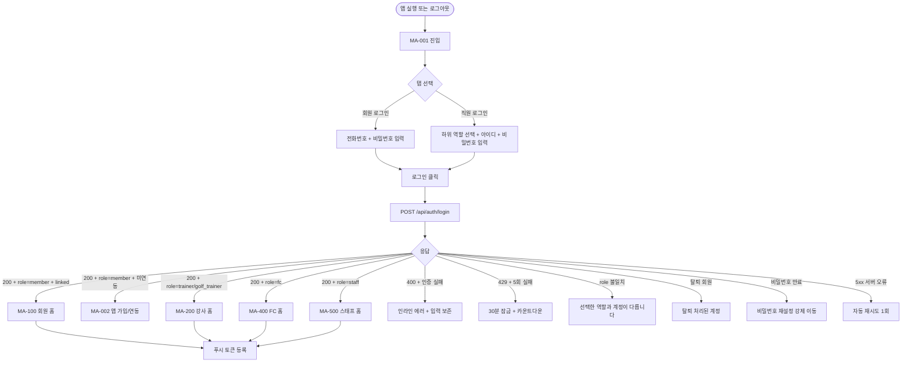
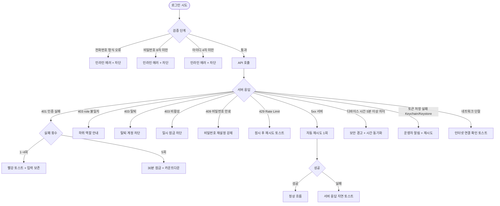

# MA-001 로그인 페이지

## 1. 화면 메타 정보

이 문서는 회원앱 로그인 화면에 대한 자기완결형 요구사항 정의서입니다. 다른 문서를 함께 보지 않아도 이 한 장만으로 화면의 모든 영역·버튼·모달·권한·예외 처리·운영 정책까지 전부 이해하고 구현할 수 있도록 작성합니다.

| 항목 | 값 |
|---|---|
| 작성일 | 2026-05-23 |
| 버전 | v1.0 |
| 상태 | 정합화 완료 |
| 도메인 | C01 공통-회원 |
| 화면 ID | MA-001 |
| 화면명 | 로그인 |
| 화면 유형 | 풀스크린 (인증 진입) |
| 라우트 (Deep Link) | `fitgenie://login` (앱 진입 직후) |
| 플랫폼 | iOS / Android 공통 |
| 우선순위 | P0 (출시 필수) |
| 기능코드 | MFN-001 |
| 연계 화면 | MA-002 앱 가입/연동, MA-100 회원 홈, MA-200 강사 홈, MA-400 FC 홈, MA-500 스태프 홈 |
| 호출 모달 | DLG 없음 (인라인 에러·토스트만) |

## 2. 화면 개요와 목적

로그인 화면은 회원앱(FitGenie) 진입 직후 최초로 표시되는 인증 화면으로, 회원과 직원(트레이너·골프강사·FC·스태프)을 단일 화면에서 분기 로그인시키고 role에 따라 적절한 Navigator로 자동 이동시키는 진입 허브 화면입니다. 회원앱 role은 `member / trainer / golf_trainer / fc / staff` 5종이며, 관리자 CRM 권한(`docs2` 8종)과 별도의 채널로 운영됩니다.

이 화면이 다루는 운영 흐름은 다음과 같습니다. 일반 회원은 전화번호 + 비밀번호로 로그인해 홈 대시보드(MA-100)에 진입하며, 트레이너·골프강사는 직원 로그인의 "트레이너" 하위 유형을 선택해 강사 홈(MA-200)으로, FC는 FC 하위 유형으로 FC 홈(MA-400)으로, 스태프는 스태프 하위 유형으로 스태프 홈(MA-500)으로 분기됩니다. 미연동 회원이 진입하면 앱 가입/연동(MA-002)으로 안내됩니다.

이 화면은 인증의 진입점이며 토큰 발급·FCM/APNs 토큰 등록·세션 시작·딥링크 라우팅까지 모든 시스템 상호작용의 시작점입니다. 그래서 보안 정책(5회 실패 잠금·HTTPS·JWT 만료·디바이스 검증)이 가장 엄격하게 적용됩니다.

## 3. 진입 경로와 인접 화면

이 화면에 진입하는 경로는 다음과 같습니다.

첫 번째 경로는 앱 최초 실행입니다. 사용자가 앱 아이콘을 처음 탭하면 본 화면이 자동 표시됩니다. 이전에 로그아웃했거나 JWT 토큰이 만료된 상태에서도 진입합니다.

두 번째 경로는 자동 로그아웃입니다. 세션 만료(30분 무사용), 비밀번호 변경, 다른 기기 로그인, 운영자 강제 로그아웃, 직원 퇴사 처리 같은 사유로 토큰이 무효화되면 본 화면으로 자동 리다이렉트됩니다.

세 번째 경로는 회원이 직접 로그아웃하는 경우입니다. 설정(MA-155)의 로그아웃 버튼이나 운영 보안 상황에서 명시적으로 로그아웃 액션을 수행하면 진입합니다.

네 번째 경로는 딥링크 진입입니다. 푸시 알림 또는 외부 링크로 앱이 열렸는데 토큰이 없으면 로그인 화면으로 안내하고, 로그인 성공 후 원래 의도한 딥링크로 자동 이동합니다.

이 화면에서 빠져나가는 인접 화면은 다음과 같습니다. 회원 로그인 성공 시 회원 홈(MA-100), 트레이너·골프강사 로그인 성공 시 강사 홈(MA-200), FC 로그인 성공 시 FC 홈(MA-400), 스태프 로그인 성공 시 스태프 홈(MA-500)으로 자동 이동합니다. 미연동 회원의 경우 앱 가입/연동(MA-002)으로 안내됩니다.

## 4. 레이아웃과 UI 구성

로그인 화면은 풀스크린 단일 컬럼 레이아웃으로, 위에서 아래로 다음 영역들이 차례로 배치됩니다.

가장 위에는 안전 영역(Safe Area) 안에 브랜드 로고와 환영 문구가 있습니다. "FitGenie 회원앱" 또는 "헬스장 생활을 더 편하게"라는 문구가 표시되며 키보드가 활성화되면 자동으로 축소됩니다.

그 아래에는 **로그인 유형 탭**이 있습니다. 가로로 2개 탭(회원 로그인 / 직원 로그인)이 같은 너비로 배치되며 활성 탭은 Primary 색상으로 강조됩니다. 기본은 회원 로그인 탭이 활성 상태입니다.

**회원 로그인 탭의 입력 영역**은 다음과 같습니다. 전화번호 입력 필드는 숫자 키패드를 호출하고 자동 하이픈 포맷팅(010-XXXX-XXXX)이 적용됩니다. 비밀번호 입력 필드는 마스킹되며 우측에 가림/보임 토글 아이콘이 있습니다. 비밀번호는 8자 이상이어야 합니다.

**직원 로그인 탭의 입력 영역**은 하위 역할 선택 라디오(트레이너 / FC / 스태프) + 아이디 입력 + 비밀번호 입력으로 구성됩니다. `golf_trainer` 계정은 직원 로그인의 "트레이너" 라디오로 진입하며 백엔드 role 검증에서 자동 분기됩니다. 직원 아이디는 영문·숫자만 허용되며 최소 4자입니다.

입력 영역 아래에는 **로그인 버튼**이 있습니다. 전체 폭, Primary 색상, 큰 글씨로 강조되어 있으며 모든 필수 입력이 채워졌을 때만 활성화됩니다. 로그인 진행 중에는 스피너로 전환되어 더블 탭이 차단됩니다.

로그인 버튼 아래에는 **보조 액션 영역**이 있습니다. 회원 탭에서는 "비밀번호 찾기"(SMS 인증 경유)와 "앱 가입/연동"(MA-002 진입)이 텍스트 링크로 노출되고, 직원 탭에서는 "관리자에게 비밀번호 재설정 요청"이 안내됩니다.

가장 아래에는 **버전 정보**가 작은 글씨로 표시됩니다. 형식은 `v1.0.0 (1)` (앱 버전 + 빌드 번호)이며 강제 업데이트가 필요한 경우 빨강 강조 + 업데이트 안내가 표시됩니다.

## 5. 탭 구성과 탭별 동작

이 화면은 회원 로그인 / 직원 로그인 2탭으로 구성되며, 탭 전환은 슬라이드 애니메이션(200ms)으로 처리됩니다. 탭이 바뀌어도 이미 입력한 값은 보존되지 않습니다(보안). 탭 전환 시 키보드는 자동으로 숨겨집니다.

회원 로그인 탭 활성 상태에서는 전화번호 + 비밀번호 필드, 비밀번호 찾기 링크, 앱 가입/연동 링크가 표시됩니다. 직원 로그인 탭 활성 상태에서는 하위 역할 라디오 + 아이디 + 비밀번호 필드, 관리자 문의 안내가 표시됩니다.

## 6. 버튼·아이콘·링크 액션 전체 정의

이 화면에 등장하는 모든 클릭 가능 요소를 빠짐없이 정의합니다.

**로그인 유형 탭** 클릭 시 활성 탭이 즉시 전환되며 슬라이드 애니메이션 + 키보드 닫힘 + 입력 초기화가 함께 일어납니다.

**전화번호 / 아이디 입력 필드** 포커스 시 자동으로 적절한 키패드(숫자 또는 영문)가 호출되며, 입력 형식 검증이 실시간으로 진행됩니다. 전화번호는 입력과 동시에 자동 하이픈이 들어가고 11자리 입력 시 자동으로 다음 필드로 포커스 이동합니다.

**비밀번호 입력 필드**의 우측 가림/보임 토글은 탭 시 즉시 마스킹을 해제·복원합니다. 입력 길이 8자 미만일 때는 인라인 메시지로 안내됩니다.

**직원 하위 역할 라디오** 선택 시 즉시 활성 라디오가 변경되며 백엔드 role 검증에 사용될 값이 결정됩니다. `golf_trainer` 계정은 트레이너를 선택해야 합니다.

**로그인 버튼** 클릭 시 입력 검증을 거친 뒤 `POST /api/auth/login`이 호출됩니다. 회원 탭이면 `{ type: "member", phone, password }`, 직원 탭이면 `{ type: "staff", subRole, userId, password }`가 전송되고 응답으로 JWT 토큰 + role + 회원 정보가 반환됩니다. 응답 성공 시 토큰을 안전한 저장소(iOS Keychain / Android Keystore)에 저장한 후 role에 따라 적절한 Navigator로 자동 이동합니다.

**비밀번호 찾기** 링크(회원 탭) 클릭 시 SMS 인증 화면으로 이동하며, 본인 확인 후 비밀번호 재설정이 가능합니다.

**앱 가입/연동** 링크(회원 탭) 클릭 시 MA-002 앱 가입/연동 화면으로 이동합니다.

모든 버튼은 응답이 돌아올 때까지 자동으로 비활성화되어 중복 요청이 차단됩니다.

## 7. 호출되는 모달 동작

이 화면은 별도의 모달을 호출하지 않습니다. 모든 사용자 피드백은 인라인 에러 메시지와 토스트로 처리됩니다. 강제 업데이트가 필요한 경우 본 화면 위에 풀스크린으로 MA-930 앱 업데이트 안내가 표시됩니다.

## 8. 토스트와 확인 팝업과 알럿

로그인 화면에서 발생하는 알림성 UI는 다음 패턴을 따릅니다.

**성공 토스트**는 로그인 성공 직후 다음 화면에서 짧게 표시됩니다 — "환영해요, {회원명}님" (회원), "안녕하세요, {강사명}님" (강사). 자동 dismiss 3초.

**실패 토스트**는 빨강 톤으로 "로그인 정보를 확인해주세요"(인증 실패), "잠시 후 다시 시도해주세요"(429 Rate Limit), "서버 응답이 늦어요"(5xx) 같은 문구가 표시됩니다.

**인라인 에러**는 입력 필드 바로 아래 빨강 텍스트로 표시됩니다 — "올바른 전화번호를 입력해주세요", "비밀번호는 8자 이상", "아이디는 영문·숫자 4자 이상".

**알럿(Alert)**은 보안 사유로 인한 잠금 안내, 강제 업데이트 안내, 디바이스 시간 변조 감지 같은 시스템 레벨 경고에 사용됩니다.

회원이 5회 연속 인증 실패한 경우 풀스크린 차단 메시지 "5회 연속 실패. 30분 후 재시도 가능합니다"가 표시되며 30분 카운트다운이 표시됩니다.

## 9. 데이터 흐름과 외부 연동

이 화면은 다음 외부 시스템과 상호작용합니다.

**인증 API**: `POST /api/auth/login` (회원·직원 통합). 요청에 type·subRole·credentials를 포함하고 응답으로 JWT(access + refresh) + role + 회원 정보를 받습니다. JWT 만료는 access 1시간, refresh 30일입니다.

**토큰 저장**: iOS는 Keychain Services, Android는 Android Keystore에 안전하게 저장합니다. AsyncStorage·SharedPreferences 같은 평문 저장소는 사용하지 않습니다.

**푸시 토큰 등록**: 로그인 성공 즉시 `POST /api/devices/push-token`으로 FCM(Android) 또는 APNs(iOS) 토큰을 백엔드에 등록합니다. 디바이스 ID·OS·앱 버전을 함께 전송합니다.

**SMS 인증** (비밀번호 찾기): `POST /api/auth/sms-verification`으로 인증 코드 발송, `POST /api/auth/verify-sms`로 검증. 인증 코드 만료는 5분, 재발송 30초 후 가능.

**디바이스 검증**: 로그인 응답에 포함된 서버 시각과 디바이스 시각 차이가 5분 이상이면 보안 경고 + 차단. 자동 시간 동기화 사용을 안내합니다.

**감사 로그**: 모든 로그인 시도(성공/실패)는 docs2 SCR-097 감사 로그에 비동기 INSERT됩니다. 기록 필드는 `device_id`, `ip`, `user_agent`, `role`, `result`, `timestamp`입니다.

**역할 분기**: 응답의 role이 `member`이면 MA-100, `trainer` 또는 `golf_trainer`이면 MA-200, `fc`이면 MA-400, `staff`이면 MA-500으로 자동 이동합니다. 회원의 경우 추가로 `app_linked_at`이 null이면 MA-002 앱 가입/연동으로 안내됩니다.

## 10. 화면 상태와 예외 처리

이 화면은 다음 상태들을 가질 수 있습니다.

**초기 상태**는 앱 첫 진입 또는 로그아웃 직후의 상태로, 회원 로그인 탭이 기본 활성이고 입력 필드는 비어있습니다.

**입력 중 상태**는 사용자가 필드에 값을 입력하는 동안의 상태로, 키보드가 활성화되어 있고 검증이 실시간으로 진행됩니다.

**로그인 중 상태**는 로그인 버튼을 누른 후 응답이 돌아오기 전까지의 상태로, 버튼이 스피너로 전환되고 모든 입력이 비활성화됩니다.

**인증 실패 상태**는 1~4회 실패 후의 상태로, 빨강 토스트와 함께 입력값이 보존되어 운영자가 수정 후 다시 시도할 수 있습니다.

**5회 실패 잠금 상태**는 30분간 진입이 차단되는 상태로, 풀스크린 메시지와 카운트다운이 표시됩니다.

**비밀번호 만료 상태**는 로그인 시도 응답이 비밀번호 만료로 돌아온 경우로, 비밀번호 재설정 화면으로 강제 이동합니다.

**role 불일치 상태**는 직원 탭에서 선택한 하위 역할과 실제 계정 role이 다른 경우로, "선택한 역할과 계정이 일치하지 않습니다" 에러가 표시되고 입력은 보존됩니다.

**회원 미연동 상태**는 회원 로그인 성공했지만 `app_linked_at`이 null인 경우로, 즉시 MA-002 앱 가입/연동으로 안내됩니다.

**탈퇴 회원 상태**는 탈퇴 처리된 계정의 로그인 시도로, "탈퇴 처리된 계정입니다" 차단됩니다.

**디바이스 시간 변조 상태**는 디바이스 시간이 서버 시각과 5분 이상 차이가 나는 경우로, 보안 경고 + 시간 동기화 안내가 표시됩니다.

**네트워크 오류 상태**는 통신 실패 또는 5xx 응답인 경우로, "서버 응답이 늦어요" 토스트와 함께 자동 재시도 1회가 진행됩니다.

예외 케이스별 처리는 다음과 같습니다. 전화번호 형식 오류는 인라인 "올바른 전화번호를 입력해주세요" + 입력 차단입니다. 비밀번호 8자 미만은 인라인 "비밀번호는 8자 이상" + 차단입니다. 5회 연속 실패는 30분 일시 잠금 + 보안 알림입니다. 비밀번호 만료는 비밀번호 재설정 화면 강제 이동입니다. 회원 미연동(`app_linked_at` null)은 "앱 가입 / 연동에서 먼저 연동해주세요"와 MA-002 진입 안내입니다. 탈퇴 회원은 "탈퇴 처리된 계정입니다" 차단입니다. 직원 role 불일치는 "선택한 역할이 계정과 다릅니다" 차단입니다. 네트워크 오류는 자동 재시도 1회 후 토스트 안내입니다. 토큰 저장 실패(Keychain/Keystore 오류)는 운영자 알림 + 재로그인 안내입니다. 강제 업데이트 필요는 MA-930 풀스크린 모달 + 스토어 이동입니다.

## 11. 권한별 처리

본 화면은 미로그인 상태의 모든 사용자가 진입 가능합니다. 로그인 성공 후 role에 따라 자동 분기됩니다.

`member` role 응답 → MA-100 회원 홈으로 이동. `app_linked_at`이 null이면 MA-002 앱 가입/연동으로 우선 안내.

`trainer` 또는 `golf_trainer` role 응답 → MA-200 강사 홈으로 이동. 직원 탭에서 "트레이너" 하위 유형을 선택하지 않았으면 role 불일치 차단.

`fc` role 응답 → MA-400 FC 홈으로 이동. 직원 탭에서 "FC" 하위 유형을 선택해야 함.

`staff` role 응답 → MA-500 스태프 홈으로 이동. 직원 탭에서 "스태프" 하위 유형을 선택해야 함.

`readonly` 같은 회원앱 미지원 role은 "이 역할은 회원앱을 사용할 수 없습니다" 차단됩니다.

권한 차단 시의 사용자 경험은 일관됩니다. 첫째, 잘못된 role 선택 시 인라인 안내 + 입력 보존. 둘째, 탈퇴·잠금·디바이스 변조 같은 보안 차단 시 풀스크린 메시지 + 명확한 후속 안내. 셋째, 모든 인증 실패 이벤트는 docs2 SCR-097 감사 로그에 기록.

## 12. 메인 흐름

로그인 화면의 핵심 동작 흐름입니다.

## 13. 에러와 예외 흐름

## 14. 핵심 디자인 요청사항

본 화면이 사용자에게 잘 작동하려면 다음 디자인 원칙이 시각적으로 명확히 드러나야 합니다.

브랜드 로고와 환영 문구는 화면 상단에 충분한 여백과 함께 배치되어 첫 인상에서 브랜드 정체성을 전달합니다. 키보드가 활성화되면 자동으로 축소되어 입력 필드가 가려지지 않게 합니다.

로그인 유형 탭(회원 / 직원)은 같은 너비로 가로 배치되며 활성 탭은 Primary 색상의 하단 인디케이터로 강조됩니다. 탭 전환은 슬라이드 애니메이션으로 자연스럽게 처리됩니다.

입력 필드는 iOS Human Interface Guidelines와 Material Design 모두에서 권장하는 floating label 또는 outlined 스타일을 사용하며, 포커스 시 강조 색상으로 변합니다.

로그인 버튼은 전체 폭, Primary 색상, 큰 글씨로 강조되어 메인 CTA임이 즉시 인지되어야 합니다. 비활성 상태(필수 입력 미완)는 회색 톤 + 50% 투명도로 표시됩니다.

비밀번호 가림/보임 토글 아이콘은 입력 필드 우측에 고정되어 항상 보이며, 탭 시 즉시 마스킹이 해제·복원됩니다.

5회 잠금 화면은 풀스크린 차단형으로 명확하게 표시되며 카운트다운 시계와 함께 운영자 연락처 안내가 함께 표시됩니다.

다크 모드는 OS 설정을 자동 추적하며 모든 색상은 라이트/다크 양쪽 변형이 정의되어 있습니다.

접근성을 위해 모든 버튼·아이콘에 `accessibilityLabel`이 제공되고 VoiceOver/TalkBack 호환됩니다.

## 15. 운영 정책 (이 화면에 연결된 부분)

본 화면은 회원앱 인증의 진입점이며 보안 정책과 직접 연결되어 있습니다.

**로그인 분기 정책**은 회원앱 5종 role(`member / trainer / golf_trainer / fc / staff`)에 따라 자동으로 다른 Navigator로 진입시킨다는 것입니다. 회원은 회원 로그인 탭, 직원은 직원 로그인 탭의 하위 역할 선택을 통해 진입하며, 선택한 역할과 실제 계정 role이 다르면 차단됩니다.

**채널 분리 정책**은 회원앱 role과 관리자 CRM 권한(`docs2` 8종)을 별도 채널로 운영한다는 것입니다. 같은 표기인 `fc`, `staff`, `trainer`도 채널에 따라 접근 범위와 화면이 다릅니다. 한 직원이 두 채널 모두 사용 가능하지만 데이터 접근 범위는 채널별 정의를 따릅니다.

**보안 잠금 정책**은 5회 연속 인증 실패 시 30분 일시 잠금이 적용된다는 것입니다. 잠금 동안은 동일 디바이스에서 로그인 시도가 차단되며 30분 후 자동 해제됩니다. 운영자 강제 해제도 가능합니다.

**비밀번호 정책**은 8자 이상 + 영문·숫자·특수문자 조합 권장, 만료 90일(센터 설정), 직전 3개 비밀번호 재사용 불가입니다. 만료 7일 전 알림이 발송되고 만료 후 로그인 시 재설정 화면으로 강제 이동합니다.

**JWT 토큰 정책**은 access 토큰 1시간 + refresh 토큰 30일입니다. access 만료 5분 전 자동 갱신이 시도되고, refresh 만료 시 본 화면으로 재로그인 안내됩니다.

**토큰 저장 정책**은 iOS Keychain Services + Android Keystore에 안전하게 저장한다는 것입니다. 평문 저장소(AsyncStorage, SharedPreferences)는 사용하지 않습니다.

**디바이스 검증 정책**은 디바이스 시각과 서버 시각이 5분 이상 차이 나면 보안 경고 + 차단입니다. QR 코드 위변조나 시간 변조 공격을 방지하기 위한 정책입니다.

**SMS 인증 정책**은 비밀번호 찾기에서 사용되며 인증 코드 만료 5분 + 재발송 30초 후 가능 + 5회 실패 30분 잠금입니다.

**감사 로그 정책**은 모든 로그인 시도(성공/실패)를 docs2 SCR-097 감사 로그에 비동기 INSERT한다는 것입니다. `device_id`, `ip`, `user_agent`, `role`, `result`, `timestamp` 필드가 기록되어 사후 보안 추적이 가능합니다.

**미연동 회원 안내 정책**은 회원 로그인 성공했지만 `app_linked_at`이 null인 경우 MA-002 앱 가입/연동으로 안내한다는 것입니다. 회원앱은 자체 가입을 허용하지 않으며 CRM에 사전 등록된 회원만 연동 가능합니다.

**탈퇴·비활성 차단 정책**은 탈퇴 처리되었거나 일시 비활성 상태인 계정의 로그인을 즉시 차단합니다. 재가입은 운영자 복구 후에만 가능합니다.

**강제 업데이트 정책**은 앱 버전이 본사가 정의한 강제 업데이트 최소 버전 미만이면 본 화면 진입 시 MA-930 풀스크린 모달로 차단합니다. 권장 업데이트는 24시간 후 재안내됩니다.

이상의 모든 정책은 이 화면을 구현하고 운영하는 사람이 별도 문서 없이 이 한 장만 보면 이해할 수 있도록 풀어 적었습니다.
