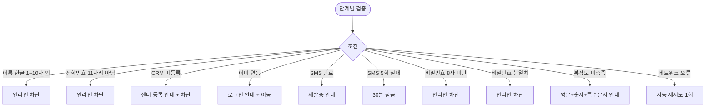

# MA-002 앱 가입 / 연동 페이지

## 1. 화면 메타 정보

| 항목 | 값 |
|---|---|
| 작성일 | 2026-05-23 |
| 버전 | v1.0 |
| 상태 | 정합화 완료 |
| 도메인 | C01 공통-회원 |
| 화면 ID | MA-002 |
| 화면명 | 앱 가입 / 연동 |
| 화면 유형 | 풀스크린 (3단계 마법사) |
| 라우트 (Deep Link) | `fitgenie://signup` (MA-001 로그인 화면의 "앱 가입/연동" 진입) |
| 플랫폼 | iOS / Android 공통 |
| 우선순위 | P0 (출시 필수) |
| 기능코드 | MFN-002 |
| 연계 화면 | MA-001 로그인, MA-100 회원 홈, MA-900 신규 회원 환영 |
| 호출 모달 | DLG 없음 (인라인 + 단계 표시기) |

## 2. 화면 개요와 목적

CRM에 사전 등록된 회원이 앱을 처음 사용할 때 본인 명의 전화번호 + SMS 인증으로 CRM 회원 마스터와 연동하는 가입 화면입니다. 회원앱은 자체 가입을 허용하지 않으며, 센터에서 사전 등록된 회원만 연동 가능합니다.

이 화면은 본인 확인 → SMS 인증 → 비밀번호 설정의 3단계 마법사로 구성되며 단계마다 명확한 진행 표시기로 사용자가 어디까지 왔는지 확인할 수 있습니다.

## 3. 진입 경로와 인접 화면

진입 경로는 MA-001 로그인 화면의 "앱 가입 / 연동" 텍스트 링크 단일 경로입니다. 미연동 회원이 회원 로그인 시도 시에도 자동 안내되어 진입할 수 있습니다.

이 화면에서 빠져나가는 인접 화면은 가입 완료 시 MA-900 신규 회원 환영(3단계 캐로셀) → MA-100 회원 홈입니다. 도중 취소 시 MA-001 로그인으로 돌아갑니다.

## 4. 레이아웃과 UI 구성

화면은 위에서 아래로 다음 영역들이 배치됩니다.

- **상단 헤더**: 뒤로가기 아이콘 + "앱 가입 / 연동" 타이틀
- **단계 표시기**: 1. 본인 확인 / 2. SMS 인증 / 3. 비밀번호 설정 (가로 3단계 progress bar)
- **단계별 입력 영역**: 활성 단계의 입력 필드가 표시됨
- **다음 / 이전 버튼**: 하단 fixed

**1단계 본인 확인**: 이름 입력 + 전화번호 입력 (자동 하이픈). [다음] 클릭 시 CRM 매칭 검증.

**2단계 SMS 인증**: 6자리 인증 코드 입력, 만료 5분 카운트다운, 재발송 30초 후 활성. 인증 완료 시 자동 다음 단계.

**3단계 비밀번호 설정**: 비밀번호 입력 (8자 이상 + 영문/숫자/특수문자 조합) + 비밀번호 확인. 일치 검증. [완료] 클릭 시 가입 확정.

## 5. 탭 구성과 탭별 동작

탭은 없습니다. 단계 표시기로 진행 상태를 시각화하며 이전 단계로 돌아갈 수 있는 [이전] 버튼이 활성화됩니다 (3단계에서는 비활성).

## 6. 버튼·아이콘·링크 액션 전체 정의

**뒤로가기 아이콘**: MA-001 로그인으로 이동. 입력 도중일 때는 "가입을 취소하시겠어요?" 확인 모달 표시.

**[다음] 버튼** (1단계): 입력 검증 후 `POST /api/auth/verify-member` 호출 → CRM 매칭 확인 → 매칭 시 SMS 자동 발송 + 2단계 진입.

**[다음] 버튼** (2단계): 인증 코드 검증 후 3단계 진입. 자동 진행은 6자리 입력 시 즉시 트리거.

**[재발송] 버튼** (2단계): 30초 카운트다운 후 활성. 클릭 시 새 SMS 발송 + 카운트다운 재시작.

**[완료] 버튼** (3단계): 비밀번호 검증 후 `POST /api/auth/complete-signup` 호출 → 가입 확정 + 토큰 발급 + MA-900 진입.

**[이전] 버튼**: 직전 단계로 돌아가며 입력값 보존.

## 7. 호출되는 모달 동작

본 화면은 별도 모달을 호출하지 않습니다. 가입 취소 확인은 인라인 시트 또는 시스템 alert으로 처리됩니다.

## 8. 토스트와 확인 팝업과 알럿

성공 토스트: 가입 완료 후 다음 화면에서 "환영합니다! 첫 출석을 시작해보세요"(자동 dismiss 5초).

실패 토스트: "센터에 먼저 등록 후 다시 시도해주세요"(CRM 미등록), "입력 정보가 일치하지 않습니다"(매칭 실패), "재발송해주세요"(SMS 만료).

인라인 에러: 이름 한글 1~10자, 전화번호 11자리, 인증 코드 6자리, 비밀번호 8자 이상 조건 위반 시.

## 9. 데이터 흐름과 외부 연동

**CRM 매칭 API**: `POST /api/auth/verify-member` (name + phone). 응답에 `member_id`, `app_linked_at`이 포함됩니다. `app_linked_at`이 not null이면 이미 연동된 계정이므로 "로그인해주세요" 안내.

**SMS 인증 API**: `POST /api/auth/sms-verification` → 6자리 코드 발송. `POST /api/auth/verify-sms` → 코드 검증.

**가입 완료 API**: `POST /api/auth/complete-signup` (member_id + password + sms_token). 응답으로 JWT 토큰 + `app_linked_at` 갱신.

**환영 트리거**: 가입 완료 시 백엔드가 `welcome_at`을 기록하고 MA-900 신규 회원 환영 모달이 자동 호출됩니다.

**감사 로그**: 가입 시도·완료·실패는 모두 docs2 SCR-097 감사 로그에 비동기 INSERT.

## 10. 화면 상태와 예외 처리

| 상태 | 설명 |
|---|---|
| 1단계 입력 중 | 이름·전화번호 입력 |
| CRM 매칭 중 | API 호출 로딩 |
| 2단계 SMS 발송됨 | 60초 카운트다운 + 6자리 입력 대기 |
| 2단계 재발송 가능 | 30초 경과 후 활성 |
| 3단계 비밀번호 입력 | 8자 이상 + 일치 검증 |
| 가입 완료 | MA-900 자동 진입 |

예외 케이스: CRM 미등록("센터 등록 후 시도"), 이름·전화번호 불일치(차단), SMS 만료(재발송 안내), 5회 인증 실패(30분 잠금), 이미 연동된 회원(로그인 안내), 탈퇴 회원(차단), 네트워크 오류(자동 재시도 1회).

## 11. 권한별 처리

미로그인 사용자만 진입 가능합니다. `member` role만 가입 대상이며 직원 계정은 별도 관리자 채널로 처리됩니다.

## 12. 메인 흐름

```mermaid
flowchart TD
    A([MA-001에서 "앱 가입/연동" 클릭]) --> B[1단계: 이름 + 전화번호 입력]
    B --> C[POST /api/auth/verify-member]
    C --> D{CRM 매칭}
    D -->|매칭 + 미연동| E[2단계: SMS 발송]
    D -->|CRM 미등록| F["센터 등록 후 시도" 차단]
    D -->|이미 연동| G[MA-001 로그인 안내]
    D -->|탈퇴| H["탈퇴 처리된 계정" 차단]
    E --> I[6자리 코드 입력]
    I --> J{인증}
    J -->|성공| K[3단계: 비밀번호 설정]
    J -->|5회 실패| L[30분 잠금]
    K --> M[POST /api/auth/complete-signup]
    M --> N[JWT 발급 + app_linked_at 갱신]
    N --> O[MA-900 신규 회원 환영]
    O --> P[MA-100 회원 홈]
```

## 13. 에러와 예외 흐름



## 14. 핵심 디자인 요청사항

3단계 마법사는 진행 표시기로 명확하게 단계를 알려야 합니다. 활성 단계는 Primary 색상, 완료 단계는 체크 아이콘, 비활성 단계는 회색으로 구분됩니다.

SMS 카운트다운은 큰 글씨 + 빨강 강조로 만료 임박을 즉시 인지하게 합니다. 재발송 버튼은 비활성 시 회색, 활성 시 Primary 색상 + 강조.

비밀번호 입력 필드의 가림/보임 토글은 항상 노출되며 입력 도중 실시간 검증(8자 이상, 복잡도) 결과가 인라인으로 표시됩니다.

## 15. 운영 정책 (이 화면에 연결된 부분)

**자체 가입 금지 정책**은 회원앱이 자체 가입을 허용하지 않고 CRM에 사전 등록된 회원만 앱 연동이 가능하도록 한다는 것입니다. 이는 센터 소속이 확인된 회원만 앱을 사용하도록 하기 위한 보안·운영 정책입니다.

**본인 확인 정책**은 CRM 매칭 시 이름 + 전화번호 동시 일치를 요구합니다. 둘 중 하나만 일치하면 매칭 실패로 처리됩니다.

**SMS 인증 정책**은 인증 코드 만료 5분 + 재발송 30초 후 가능 + 5회 실패 30분 잠금입니다. 인증 코드는 6자리 숫자이며 회원 본인 명의 전화번호로만 발송됩니다.

**비밀번호 정책**은 8자 이상 + 영문/숫자/특수문자 조합 권장 + 직전 3개 재사용 불가입니다. 가입 시점에 강한 조합을 권장하지만 기본 8자 이상은 필수입니다.

**`app_linked_at` 추적 정책**은 가입 완료 시점에 회원 마스터에 타임스탬프를 저장합니다. CRM에서 앱 연동 회원 수, 미연동 회원 수, 연동률을 KPI로 측정할 때 사용됩니다.

**환영 모달 정책**은 가입 완료 직후 MA-900 신규 회원 환영(3단계 캐로셀)을 자동 호출합니다. 첫 진입 시 한 번만 표시되며 다시 보지 않기 옵션이 있습니다.

**감사 로그 정책**은 가입 시도·완료·실패를 모두 docs2 SCR-097 감사 로그에 기록합니다. 사후 가입 추적과 보안 분석에 사용됩니다.

이상의 모든 정책은 본 화면을 구현·운영하는 사람이 별도 문서 없이 이 한 장만 보면 이해할 수 있도록 풀어 적었습니다.
