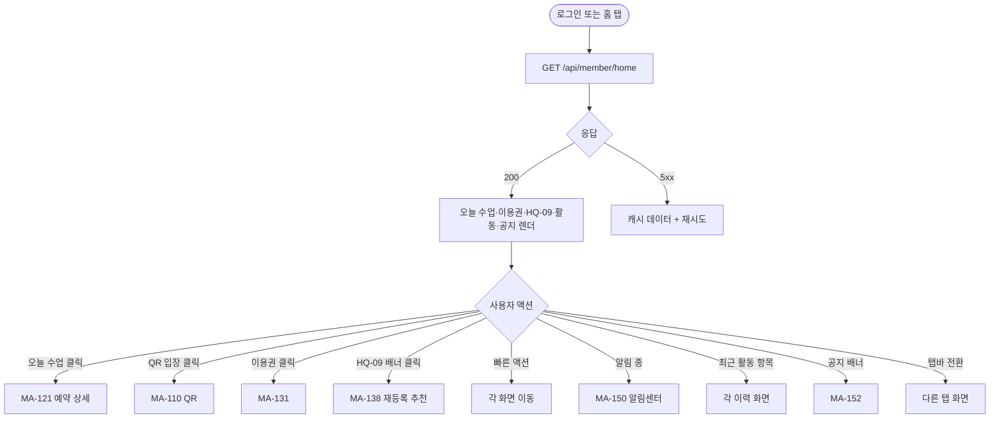
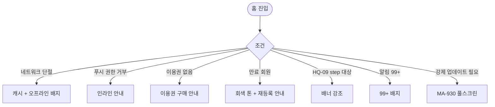

# MA-100 회원 홈 페이지

## 1. 화면 메타 정보

| 항목 | 값 |
|---|---|
| 작성일 | 2026-05-23 / 버전 v1.0 / 상태 정합화 완료 |
| 도메인 | C01 공통-회원 |
| 화면 ID | MA-100 |
| 화면명 | 회원 홈 대시보드 |
| 화면 유형 | 풀스크린 (member Tab의 홈) |
| 라우트 | `fitgenie://home` (로그인 직후 디폴트) |
| 우선순위 | P0 |
| 기능코드 | MFN-101 |
| 연계 화면 | MA-110 QR, MA-111 출석이력, MA-120 예약, MA-121 예약상세, MA-122 내예약, MA-131 이용권, MA-132 체성분, MA-134 상품스토어, MA-138 재등록추천, MA-150 알림 |
| 호출 모달 | DLG 없음 (인라인 카드만) |

## 2. 화면 개요와 목적

회원이 앱을 열었을 때 가장 먼저 보이는 메인 허브로, 오늘의 예약·이용권 잔여·HQ-09 만료 알림·최근 출석·푸시 알림 미확인 건수를 한 화면에 통합 표시합니다. 회원의 헬스장 사용 흐름의 시작점이며 다른 화면으로의 진입 허브 역할도 합니다.

이 화면이 다루는 운영 흐름은 매우 다양합니다. 출근길에 오늘 예약 확인, 헬스장 도착 후 QR 입장 카드 즉시 진입, 만료 임박 시 재등록 추천 진입, 신규 공지 확인 같은 모든 일상 흐름이 본 화면을 거칩니다.

## 3. 진입 경로와 인접 화면

진입 경로: 로그인 직후 디폴트 (MA-001 → role=member일 때), 또는 탭바 홈 클릭, 또는 딥링크 `fitgenie://home`.

빠져나가는 인접 화면: 오늘 수업 카드 클릭 → MA-121 예약 상세, QR 입장 카드 → MA-110 QR, 이용권 카드 → MA-131, HQ-09 배너 → MA-138 재등록 추천, 빠른 액션 → MA-110/120/132/134, 알림 아이콘 → MA-150.

## 4. 레이아웃과 UI 구성

- **상단 헤더**: "안녕하세요, {회원명}님" + 오른쪽 알림 종 아이콘 (배지 99+ 가능)
- **오늘의 수업 카드**: 다음 예약 1건 정보 (시간·강사·종목·QR 입장 버튼). 수업 30분 전부터 강조 표시. 예약 없으면 "오늘 예정된 수업이 없어요" 빈 상태
- **이용권 카드 (1~3개)**: 활성 이용권별 종류·잔여 횟수 또는 D-day·만료일. 만료 임박은 노랑 강조
- **HQ-09 만료 알림 배너**: docs2 D02 HQ-09 회원 이용권 만료 step 대상일 때만 표시. 클릭 시 재등록 추천(MA-138)
- **빠른 액션 4종**: 수업 예약·QR 입장·체성분·상품 스토어 (정사각형 카드 2×2 또는 1×4)
- **최근 활동 5건**: 출석·예약·결제·체성분 측정 (시간 역순)
- **공지사항 배너**: 활성 공지 1건 (드래그로 닫기)
- **하단 탭바**: 홈 / 예약 / QR / 이용권 / MY (5탭, 홈 활성)

## 5. 탭 구성과 탭별 동작

본 화면 자체에는 내부 탭이 없습니다. 하단의 5탭 탭바가 회원 영역 전체 네비게이션입니다.

## 6. 버튼·아이콘·링크 액션 전체 정의

- **알림 종 아이콘**: MA-150 알림센터 이동, 미확인 건수 배지 표시
- **오늘 수업 카드 [상세 보기]**: MA-121 예약 상세 이동
- **오늘 수업 카드 [QR 입장]**: 수업 30분 전부터 활성, 클릭 시 MA-110 QR 풀스크린
- **이용권 카드**: MA-131 이용권 조회 이동
- **HQ-09 만료 배너 [재등록 보기]**: MA-138 재등록 추천 이동
- **빠른 액션 카드**: 각각 MA-120·MA-110·MA-132·MA-134 이동
- **최근 활동 항목**: 항목 종류에 따라 출석이력·예약상세·결제이력·체성분 이동
- **공지사항 배너**: MA-152 공지사항 상세 이동, 좌 스와이프로 닫기 (24시간 유지)
- **하단 탭바**: 각 탭으로 즉시 이동, 활성 탭 재탭 시 스크롤 최상단

## 7. 호출되는 모달 동작

본 화면은 별도 모달을 호출하지 않습니다. 모든 정보는 인라인 카드 + 토스트로 처리됩니다.

## 8. 토스트와 확인 팝업과 알럿

성공 토스트: 로그인 직후 환영 토스트, 푸시 알림 도착 시 우측 상단 인앱 알림.

실패 토스트: "데이터를 불러올 수 없어요"(5xx), "오프라인 모드"(네트워크 단절).

알럿: 강제 업데이트 필요 시 MA-930 풀스크린.

## 9. 데이터 흐름과 외부 연동

**홈 데이터 API**: `GET /api/member/home` (단일 통합 엔드포인트). 응답에 오늘 예약·이용권·HQ-09 만료 step·최근 활동·공지·알림 미확인 수가 포함됩니다. 5분 캐시.

**HQ-09 만료 step**: docs2 D02 NFR-05 매일 03:00 결과 동기화. 본사 step + 지점 추가 step 적용 결과만 표시 (회원앱에서 step 직접 정의 없음).

**푸시 알림 토큰**: 화면 진입 시 FCM/APNs 토큰이 최신인지 확인 + 갱신 필요 시 자동.

**감사 로그**: 홈 진입 자체는 감사 로그 미기록 (트래픽 과다). 카드 클릭 후 진입한 다음 화면에서 기록됨.

## 10. 화면 상태와 예외 처리

| 상태 | 설명 |
|---|---|
| 정상 | 오늘 수업 + 이용권 + 활동 정상 표시 |
| 오늘 수업 없음 | "오늘 예정된 수업이 없어요" + 예약 안내 |
| 이용권 없음 | "이용권을 구매해주세요" + 스토어 진입 |
| HQ-09 만료 step 대상 | 만료 알림 배너 강조 |
| 만료 회원 | 전체 카드 회색 + 재등록 안내 |
| 데이터 로딩 실패 | 재시도 버튼 + 캐시 데이터 표시 |

예외: 네트워크 오류는 캐시 데이터 + "오프라인" 배지 + 자동 재시도. 푸시 권한 거부는 상단 인라인 안내. 알림 99+ 시 "99+" 배지.

## 11. 권한별 처리

`member` role만 진입 가능합니다. 다른 role(`trainer`, `golf_trainer`, `fc`, `staff`)은 각각 MA-200, MA-400, MA-500의 자체 홈 화면을 사용합니다.

## 12. 메인 흐름

## 13. 에러와 예외 흐름

## 14. 핵심 디자인 요청사항

- 상단 인사말 카드는 회원명을 강조하여 개인화 느낌
- 오늘 수업 카드는 큰 카드 + 시간·강사 정보 + QR 입장 강조 버튼
- HQ-09 배너는 노랑·빨강 톤으로 즉시 인지
- 이용권 카드는 만료 임박 시 D-day 강조
- 빠른 액션은 큰 아이콘 + 짧은 라벨로 즉시 인지
- 최근 활동은 작은 리스트 + 좌측 아이콘
- 다크 모드 자동 대응
- 풀투리프레시 지원 (홈 데이터 갱신)

## 15. 운영 정책 (이 화면에 연결된 부분)

**역할 분기 정책**은 로그인 직후 role에 따라 다른 홈으로 자동 이동된다는 것입니다. 본 화면은 `member` 전용이며 다른 role은 각자의 홈으로 분기됩니다.

**HQ-09 만료 step 정책**은 docs2 D02 HQ-09 회원 이용권 만료 본사 step + 지점 추가 step 적용 결과만 표시한다는 것입니다. 회원앱에서는 step 직접 정의 없이 결과 배너만 노출합니다.

**5분 캐시 정책**은 홈 데이터를 5분간 캐시하여 같은 시점 반복 진입 시 서버 부담을 줄인다는 것입니다. 풀투리프레시로 명시적 갱신 가능.

**개인화 정책**은 회원명·등급·자동 세그먼트 라벨에 따라 카드 우선순위·CTA가 달라질 수 있다는 것입니다. 이탈위험·만료임박 회원에게는 재등록 카드가 상단에 강조됩니다.

**알림 99+ 정책**은 미확인 알림 100건 이상은 "99+"로 표기하여 시각적 정리를 유지한다는 것입니다.

**오프라인 캐시 정책**은 네트워크 단절 시에도 마지막 캐시 데이터 + 오프라인 배지를 표시하여 사용성을 유지한다는 것입니다.

이상의 모든 정책은 이 화면을 구현·운영하는 사람이 별도 문서 없이 이 한 장만 보면 이해할 수 있도록 풀어 적었습니다.
