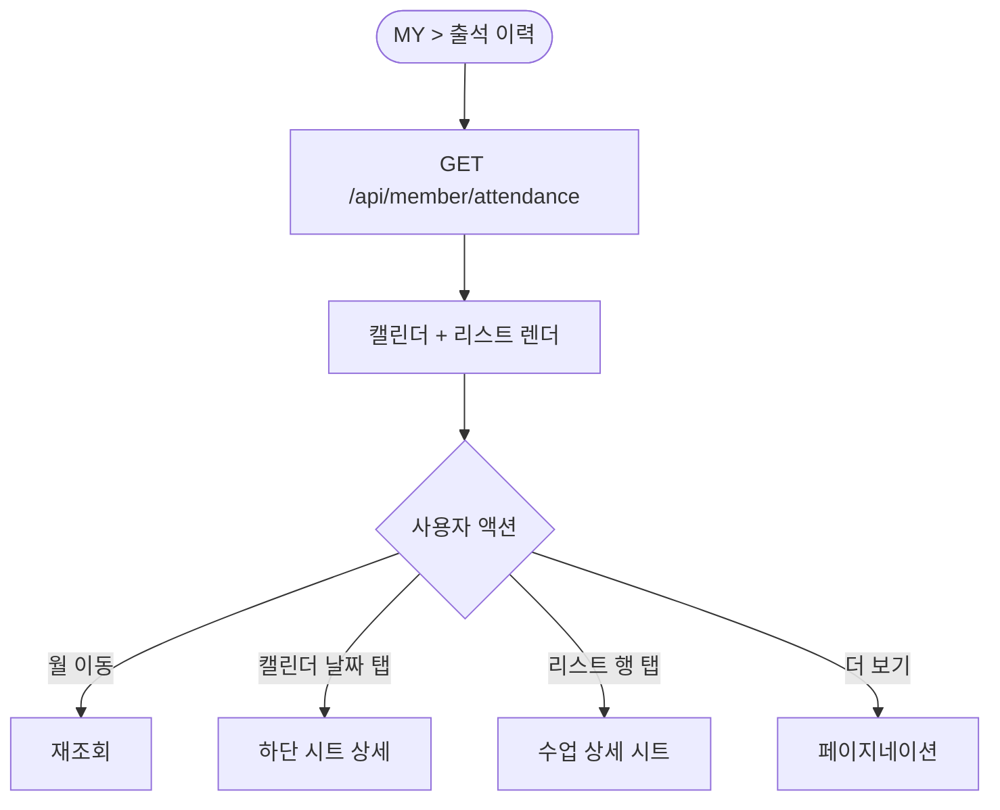
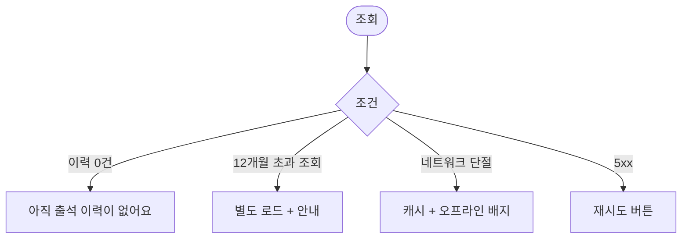

# MA-111 출석 이력 페이지

## 1. 화면 메타 정보

| 항목 | 값 |
|---|---|
| 작성일 / 버전 / 상태 | 2026-05-23 / v1.0 / 정합화 완료 |
| 도메인 | C01 공통-회원 |
| 화면 ID | MA-111 |
| 화면명 | 출석 이력 |
| 화면 유형 | 풀스크린 (캘린더 + 리스트) |
| 라우트 | `fitgenie://attendance/history` (MY > 출석 이력) |
| 우선순위 | P0 |
| 기능코드 | MFN-103 |
| 연계 화면 | MA-100 홈, MA-130 마이프로필, MA-122 내 예약 |
| 호출 모달 | DLG 없음 (인라인 상세) |

## 2. 화면 개요와 목적

회원이 본인 출석 이력을 월별 캘린더 + 리스트로 조회하는 화면입니다. docs2 _공통/상태전이.md 정본의 출석 결과 3종(성공/실패/중복)을 색상으로 구분 표시합니다.

## 3. 진입 경로와 인접 화면

진입: MY 탭 > 출석 이력, 홈의 최근 활동 항목 클릭, 딥링크.

인접: 행 클릭 시 출석 상세 (해당 수업·강사 정보 표시), 캘린더 날짜 클릭 시 해당 일 상세 시트.

## 4. 레이아웃과 UI 구성

- **상단 헤더**: 뒤로가기 + "출석 이력"
- **월별 캘린더**: 출석일에 점 표시. 색상 구분 — 녹색(성공)·회색(중복)·빨강(실패)
- **월 이동**: 좌우 화살표 또는 스와이프
- **요약 카드**: 이번 달 출석 N회 / 평균 주 N회
- **리스트 (최근 30건)**: 일시·결과·체크인 방식(QR/수동/얼굴인식)·체크인 지점
- **더 보기 버튼**: 30건 이상은 페이지네이션

## 5. 탭 구성과 탭별 동작

탭은 없습니다.

## 6. 버튼·아이콘·링크 액션 전체 정의

- **뒤로가기**: 이전 화면 복귀
- **월 이동**: 캘린더 + 리스트 동시 재조회
- **캘린더 날짜 탭**: 하단 시트로 해당 일 출석 상세
- **리스트 행 탭**: 시트 또는 풀스크린 상세 (수업·강사 정보)

## 7. 호출되는 모달 동작

본 화면은 별도 모달 없이 하단 시트로 상세 표시.

## 8. 토스트와 확인 팝업과 알럿

성공 토스트: 없음 (조회 전용).
실패 토스트: "데이터를 불러올 수 없어요" + 재시도.

## 9. 데이터 흐름과 외부 연동

**출석 이력 API**: `GET /api/member/attendance?month=YYYY-MM`. 응답에 일별 출석 결과 + 리스트 30건. 5분 캐시.

**12개월 초과**: 12개월 이전 데이터는 별도 호출 (페이지네이션).

**출석 결과 3종 정합**: docs2 _공통/상태전이.md 정본 (성공/실패/중복).

## 10. 화면 상태와 예외 처리

| 상태 | 설명 |
|---|---|
| 이력 있음 | 캘린더 + 리스트 정상 |
| 이력 없음 | "아직 출석 이력이 없어요" |
| 로딩 중 | 스켈레톤 |
| 데이터 로딩 실패 | 재시도 + 캐시 |

예외: 결과=실패 사유 표시(만료·미등록·미수금 등 비고). 12개월 이전 데이터는 별도 로드 안내.

## 11. 권한별 처리

`member` 본인 이력만 조회 가능. 다른 role은 본 화면 미진입.

## 12. 메인 흐름

## 13. 에러와 예외 흐름

## 14. 핵심 디자인 요청사항

- 캘린더는 월 단위 + 점 색상으로 결과 구분
- 결과 3종 색상: 성공(녹색)·중복(회색)·실패(빨강)
- 리스트는 컴팩트하게 1줄 (일시·결과·지점)
- 시트 상세는 풀 정보 + 수업·강사 링크
- 다크 모드 대응

## 15. 운영 정책 (이 화면에 연결된 부분)

**출석 결과 분류 정책**은 docs2 _공통/상태전이.md 정본 3종(성공/실패/중복)을 표시한다는 것입니다.

**12개월 보관 정책**은 12개월치 데이터를 캐시·표시하고 그 이전은 별도 로드합니다. docs2 D11 SCR-I001 정합 (영구 보관, 1년 이상 콜드 스토리지).

**5분 캐시 정책**으로 같은 시점 반복 조회 시 서버 부담 감소.

**개인정보 정책**으로 본인 이력만 조회 가능합니다.

이상의 모든 정책은 본 화면을 구현·운영하는 사람이 별도 문서 없이 이 한 장만 보면 이해할 수 있도록 풀어 적었습니다.
