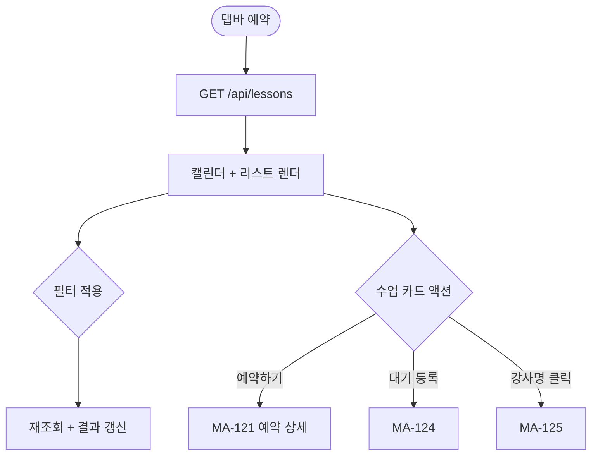
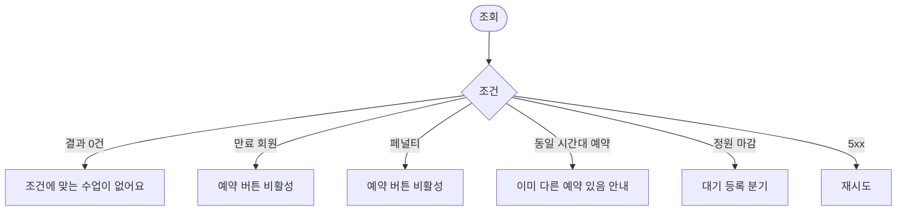

# MA-120 수업 예약 목록 페이지

## 1. 화면 메타 정보

| 항목 | 값 |
|---|---|
| 작성일 / 버전 / 상태 | 2026-05-23 / v1.0 / 정합화 완료 |
| 도메인 | C01 공통-회원 |
| 화면 ID | MA-120 |
| 화면명 | 수업 예약 목록 |
| 화면 유형 | 풀스크린 (캘린더 + 리스트) |
| 라우트 | `fitgenie://reserve` (탭바 예약) |
| 우선순위 | P0 |
| 기능코드 | MFN-105 |
| 연계 화면 | MA-121 예약 상세, MA-122 내 예약, MA-123 골프 예약, MA-124 대기 예약, MA-125 강사 상세 |
| 호출 모달 | DLG 없음 (필터는 하단 시트) |

## 2. 화면 개요와 목적

회원이 예약 가능한 수업 목록을 캘린더 + 리스트로 조회하고 예약을 시작하는 진입 허브 화면입니다. 강사·종목·시간대·세션 유형 필터로 좁혀서 본인이 원하는 수업을 빠르게 찾습니다.

## 3. 진입 경로와 인접 화면

진입: 탭바 예약, 홈 빠른 액션, 강사 상세에서의 "이 강사 수업 보기".

인접: 카드 클릭 시 MA-121 예약 상세, 대기 등록 시 MA-124, 강사명 클릭 시 MA-125, 골프 예약은 MA-123 분기.

## 4. 레이아웃과 UI 구성

- **상단 헤더**: "수업 예약" 타이틀 + 필터 아이콘
- **날짜 캘린더 (월/주 전환)**: 기본 이번 주 7일 가로 스트립
- **필터 칩**: 강사·종목(PT/GX/골프)·세션 유형(PT/필라테스/스트레칭/테라피)·정원 상태
- **수업 목록 카드**: 수업명·시간·강사·세션 유형·정원·잔여 자리·예약 가능 여부 배지
- **빈 상태**: "조건에 맞는 수업이 없어요"
- **하단 [내 예약]**: MA-122 빠른 진입

## 5. 탭 구성과 탭별 동작

월 / 주 뷰 전환 (캘린더), 강습 세션 4종 다중 선택 가능.

## 6. 버튼·아이콘·링크 액션 전체 정의

- **필터 아이콘**: 하단 시트 (강사·종목·세션 유형·시간대·정원)
- **날짜 캘린더 탭**: 해당 일 수업 리스트 표시
- **수업 카드 [예약하기]**: MA-121 예약 상세 이동
- **수업 카드 [대기 등록]**: 정원 초과 시 활성, MA-124
- **강사명 클릭**: MA-125 강사 상세
- **세션 유형 필터**: 강습 세션 4종 (docs2 D04 정본)

## 7. 호출되는 모달 동작

필터는 하단 시트로 처리. 별도 모달 없음.

## 8. 토스트와 확인 팝업과 알럿

성공 토스트: 예약 완료는 MA-121에서 처리 (본 화면은 진입 허브).

실패 토스트: "데이터를 불러올 수 없어요" + 재시도.

## 9. 데이터 흐름과 외부 연동

**수업 목록 API**: `GET /api/lessons?date=YYYY-MM-DD&filters=...` → 수업 카드 배열. 5분 캐시 + 풀투리프레시.

**강습 세션 4종**: docs2 D04 정본 (PT·필라테스·스트레칭·테라피).

**정원 상태 실시간**: WebSocket 또는 5초 폴링으로 잔여 자리 갱신.

**예약 트리거**: 카드 [예약하기] → MA-121에서 실제 예약 호출.

## 10. 화면 상태와 예외 처리

| 상태 | 설명 |
|---|---|
| 정상 | 캘린더 + 리스트 정상 |
| 결과 0건 | "조건에 맞는 수업이 없어요" + 필터 초기화 안내 |
| 만료 회원 | 예약 버튼 비활성 + "이용권 만료" 안내 |
| 페널티 적용 | 예약 버튼 비활성 + "예약 제한 중" 안내 |
| 로딩 중 | 스켈레톤 |

예외: 본인 동일 시간대 다른 예약 있음 → "다른 수업 예약 중" 안내. 정원 마감 → [대기 등록]으로 자동 분기.

## 11. 권한별 처리

`member` 가능. 트레이너·골프강사는 강사 캘린더(MA-210)를 사용, FC·스태프는 본 화면 미접근.

## 12. 메인 흐름

## 13. 에러와 예외 흐름

## 14. 핵심 디자인 요청사항

- 캘린더는 월/주 전환 + 가로 스트립
- 필터 칩은 다중 선택 가능
- 수업 카드는 정원 상태를 색상으로 (여유 녹·임박 노랑·마감 빨강)
- 본인 예약 중인 수업은 회색 처리

## 15. 운영 정책 (이 화면에 연결된 부분)

**예약 정책**: docs2 D04 정합. 동일 시간대 중복 예약 불가, 만료·페널티 회원 예약 차단.

**강습 세션 4종 정합**: docs2 D04 정본 (PT·필라테스·스트레칭·테라피).

**5분 캐시 + 실시간 정원**: 캐시는 5분 + 정원 상태는 실시간(WebSocket 또는 5초 폴링).

**대기 등록 분기**: 정원 마감 시 [대기 등록] 자동 활성 (CLS-12 정합).

이상의 모든 정책은 본 화면을 구현·운영하는 사람이 별도 문서 없이 이 한 장만 보면 이해할 수 있도록 풀어 적었습니다.
