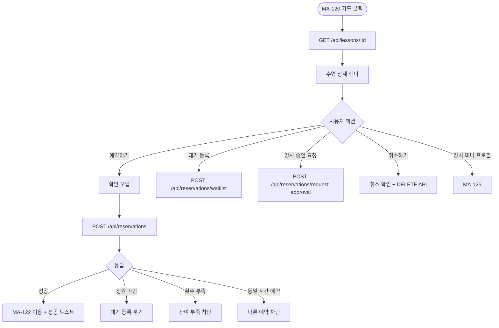
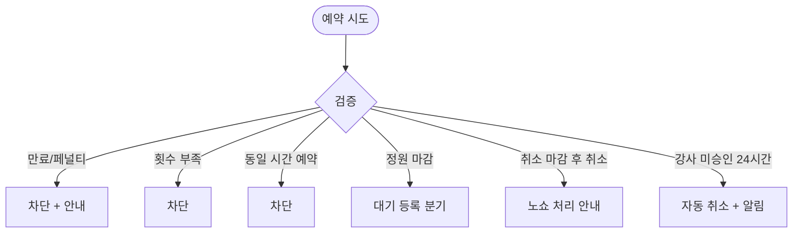

# MA-121 수업 예약 상세 페이지

## 1. 화면 메타 정보

| 항목 | 값 |
|---|---|
| 작성일 / 버전 / 상태 | 2026-05-23 / v1.0 / 정합화 완료 |
| 도메인 | C01 공통-회원 |
| 화면 ID | MA-121 |
| 화면명 | 수업 예약 상세 |
| 화면 유형 | 풀스크린 또는 시트 |
| 라우트 | `fitgenie://reserve/:lessonId` |
| 우선순위 | P0 |
| 기능코드 | MFN-105 |
| 연계 화면 | MA-120 예약 목록, MA-122 내 예약, MA-125 강사 상세, MA-126 후기 |
| 호출 모달 | 예약 확인 모달 (인라인) |

## 2. 화면 개요와 목적

단일 수업의 상세 정보를 표시하고 회원이 예약·취소·대기 등록을 수행하는 화면입니다. 회원이 트레이너에게 직접 요청하는 경우 "강사 승인 대기" 단계로 진입하며 docs2 D04 정합을 따릅니다.

## 3. 진입 경로와 인접 화면

진입: MA-120 카드 클릭, 홈 오늘 수업 카드, 푸시 알림, 강사 상세에서의 수업 선택.

인접: 예약 완료 → MA-122 내 예약, 강사명 → MA-125 강사 상세, 수업 후기 → MA-126.

## 4. 레이아웃과 UI 구성

- **상단 헤더**: 뒤로가기 + "예약 상세"
- **수업 정보 카드**: 수업명·일시·강사명·종목·세션 유형·장소·정원·잔여 자리
- **강사 미니 프로필**: 사진·이름·평점 (MA-125 진입 링크)
- **예약 조건 안내**: 취소 마감 시간 (수업 시작 N시간 전, 센터 설정)·페널티 정책
- **이용권 매칭 카드**: 본인 보유 이용권 중 적용 가능한 항목 표시
- **하단 [예약하기]**: 잔여 자리 있을 때 / [대기 등록]: 마감 시 / [강사 승인 요청]: 본인이 트레이너에 직접 요청 시
- **이미 예약된 수업**: [취소하기] (취소 마감 전) / [상세보기] (마감 후)

## 5. 탭 구성과 탭별 동작

탭 없음.

## 6. 버튼·아이콘·링크 액션 전체 정의

- **뒤로가기**: 이전 화면
- **강사 미니 프로필 탭**: MA-125 강사 상세
- **[예약하기]**: 인라인 확인 모달 → `POST /api/reservations` → 성공 시 MA-122 이동
- **[대기 등록]**: `POST /api/reservations/waitlist` → 대기 순번 표시 + MA-124 이동
- **[강사 승인 요청]**: 회원이 트레이너 가능 시간에 요청 → 강사 승인 대기 상태 (docs2 D04 정합)
- **[취소하기]**: 인라인 확인 모달 → `DELETE /api/reservations/:id` (취소 마감 전만)
- **[수업 후기]**: 완료 수업이면 MA-126 후기 작성

## 7. 호출되는 모달 동작

**예약 확인 모달 (인라인)**: "{수업명} 예약하시겠어요?" + [확인] / [취소]. 이용권 자동 매칭 안내.

**취소 확인 모달 (인라인)**: "예약을 취소하시겠어요?" + 페널티 정책 안내.

## 8. 토스트와 확인 팝업과 알럿

성공: "예약되었어요"(녹색). 실패: "잔여 횟수가 부족합니다", "이미 예약된 시간입니다", "취소 마감 시간이 지났습니다".

## 9. 데이터 흐름과 외부 연동

**수업 상세 API**: `GET /api/lessons/:id`. 5분 캐시 + 풀투리프레시.

**예약 API**: `POST /api/reservations` (lessonId + memberId). 응답으로 reservation_id.

**취소 API**: `DELETE /api/reservations/:id`. 마감 시간 검증.

**대기 등록**: `POST /api/reservations/waitlist`. 순번 표시.

**강사 승인 요청** (회원→트레이너): `POST /api/reservations/request-approval`. 강사에게 푸시 발송.

**횟수 차감**: docs2 CLS-07 정합 — 예약 시점이 아니라 수업 완료(completed) 시 차감.

## 10. 화면 상태와 예외 처리

| 상태 | 설명 |
|---|---|
| 예약 가능 | [예약하기] 활성 |
| 정원 마감 | [대기 등록] 활성 |
| 본인 예약됨 | [취소하기] 활성 (마감 전) |
| 취소 마감 후 | [상세보기]만 (취소 시 노쇼 처리 안내) |
| 만료/페널티 회원 | 예약 차단 + 안내 |
| 동일 시간대 예약 있음 | "다른 수업 예약 중" 차단 |
| 횟수 부족 | "잔여 횟수가 부족합니다" 차단 |
| 강사 승인 대기 | 회색 배지 + "강사 승인 대기" 안내 |

예외: 회원이 예약했지만 강사 미승인이면 30분 후 알림 발송, 24시간 미응답 시 자동 취소.

## 11. 권한별 처리

`member` 가능. 강사가 본 수업의 담당이면 강사 화면(MA-211)에서 진입.

## 12. 메인 흐름

## 13. 에러와 예외 흐름

## 14. 핵심 디자인 요청사항

- 수업 정보 카드는 큰 글씨 + 강조
- 강사 미니 프로필은 클릭 가능 (별점·NPS 표시)
- 예약 조건은 명확하게 (취소 마감, 페널티)
- 이용권 매칭은 자동 안내 ("PT 10회권에서 차감")

## 15. 운영 정책 (이 화면에 연결된 부분)

**예약 정책**: docs2 D04 정합. 취소 마감 시간(센터 설정, 기본 2시간), 마감 후 취소 = 노쇼 처리.

**횟수 차감 시점**: docs2 CLS-07 정합. 예약 시가 아니라 수업 완료(completed) 시 차감.

**강사 승인 정책**: 회원이 트레이너에게 직접 요청한 경우 강사 승인 후 확정. 강사가 캘린더에서 직접 배정 시 즉시 확정. 24시간 미응답 시 자동 취소.

**페널티 정책**: 노쇼 1회 경고, 3회 누적 시 예약 제한(센터 설정).

이상의 모든 정책은 본 화면을 구현·운영하는 사람이 별도 문서 없이 이 한 장만 보면 이해할 수 있도록 풀어 적었습니다.
