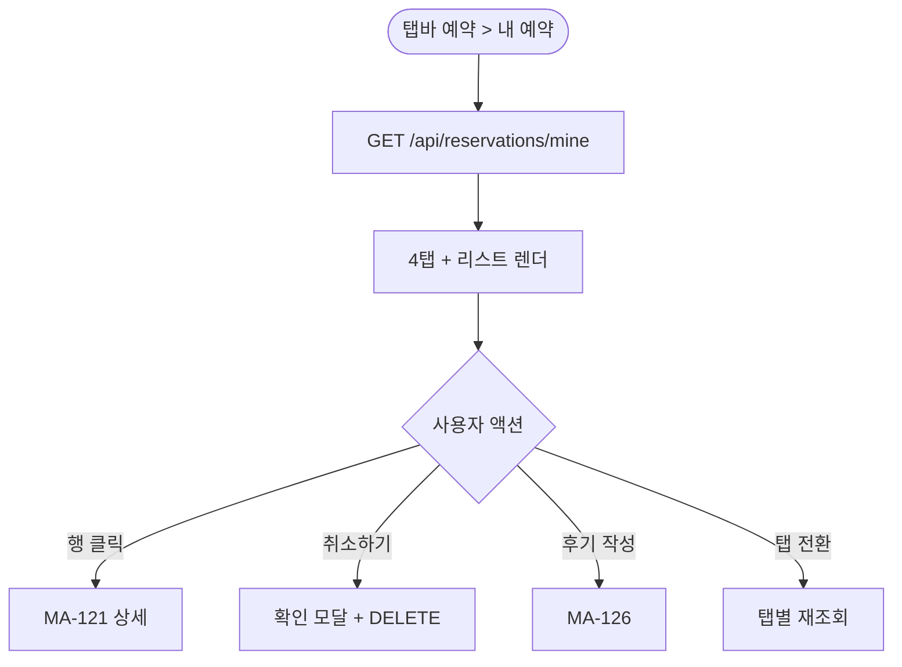
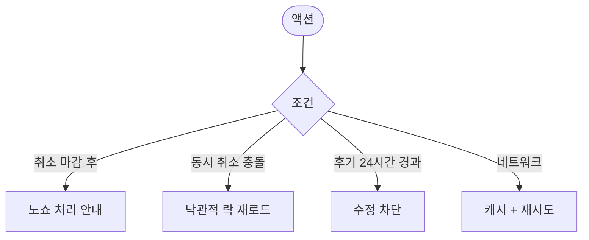

# MA-122 내 예약 / 수업 이력 페이지

## 1. 화면 메타 정보

| 항목 | 값 |
|---|---|
| 작성일 / 버전 / 상태 | 2026-05-23 / v1.0 / 정합화 완료 |
| 도메인 | C01 공통-회원 |
| 화면 ID | MA-122 |
| 화면명 | 내 예약 / 수업 이력 |
| 화면 유형 | 풀스크린 (탭 + 리스트) |
| 라우트 | `fitgenie://reservations/mine` |
| 우선순위 | P0 |
| 기능코드 | MFN-107 |
| 연계 화면 | MA-120 예약 목록, MA-121 예약 상세, MA-126 후기 |
| 호출 모달 | 취소 확인 모달 (인라인) |

## 2. 화면 개요와 목적

회원 본인의 예약·완료·취소·노쇼 이력을 통합 조회하는 화면입니다. 다가오는 예약·진행중·완료·취소/노쇼 4탭으로 분리하여 상태별 추적이 쉽습니다.

## 3. 진입 경로와 인접 화면

진입: 탭바 예약 우상단 [내 예약], 홈 빠른 액션, 푸시 알림 클릭.

인접: 행 클릭 시 MA-121, 완료 수업의 후기 작성 → MA-126, 신규 예약 → MA-120.

## 4. 레이아웃과 UI 구성

- **상단 헤더**: "내 예약/이력"
- **4탭**: 다가오는 예약 / 진행중 / 완료 / 취소·노쇼 (건수 배지)
- **리스트**: 일시·수업명·강사·상태 배지·후기 작성 가능 표시
- **상태 배지**: 다가오는(파랑)·진행중(녹색)·완료(회색)·노쇼(빨강)·취소(회색)
- **빈 상태**: 탭별로 "아직 다가오는 예약이 없어요" 등

## 5. 탭 구성과 탭별 동작

4탭 슬라이드 전환. 탭별 카운트 배지 자동 갱신.

## 6. 버튼·아이콘·링크 액션 전체 정의

- **탭 클릭**: 슬라이드 + 재조회
- **리스트 행 탭**: MA-121 상세
- **[취소하기]** (다가오는 예약): 인라인 확인 모달
- **[후기 작성]** (완료 수업): MA-126 후기
- **풀투리프레시**: 데이터 재조회

## 7. 호출되는 모달 동작

취소 확인 모달은 인라인 + 페널티 정책 안내.

## 8. 토스트와 확인 팝업과 알럿

성공: "예약이 취소되었어요". 실패: "취소 마감 시간이 지났어요" → 노쇼 처리 안내.

## 9. 데이터 흐름과 외부 연동

**내 예약 API**: `GET /api/reservations/mine?status=upcoming|inprogress|completed|cancelled`.

**취소 API**: `DELETE /api/reservations/:id`.

**완료 알림**: 수업 완료 시 푸시 + 본 화면 자동 갱신.

## 10. 화면 상태와 예외 처리

| 상태 | 설명 |
|---|---|
| 다가오는 예약 있음 | 시간 순 리스트 |
| 진행중 (현재 수업) | 강조 표시 |
| 완료 + 후기 미작성 | [후기 작성] 버튼 |
| 노쇼 | 빨강 배지 |
| 빈 탭 | 빈 상태 메시지 |

예외: 동일 회원·동시 취소 충돌 시 낙관적 락. 후기 작성 24시간 경과 시 수정 불가.

## 11. 권한별 처리

`member` 본인만 가능. 강사는 MA-211, FC는 본 화면 미접근.

## 12. 메인 흐름

## 13. 에러와 예외 흐름

## 14. 핵심 디자인 요청사항

- 4탭은 상단 고정 + 슬라이드 인디케이터
- 상태 배지 색상으로 즉시 구분
- 후기 작성 가능 행은 별도 강조

## 15. 운영 정책

**예약 이력 정책**: docs2 D04 정본 단순 표시. 회원이 자체 수정·삭제 불가 (취소만 가능).

**후기 작성 기한**: 수업 완료 후 24시간 이내 작성 + 24시간 이내 수정·삭제 가능. 그 후 잠금.

**노쇼 표시**: 빨강 배지 + 페널티 누적 카운트 안내.

이상의 모든 정책은 본 화면을 구현·운영하는 사람이 별도 문서 없이 이 한 장만 보면 이해할 수 있도록 풀어 적었습니다.
