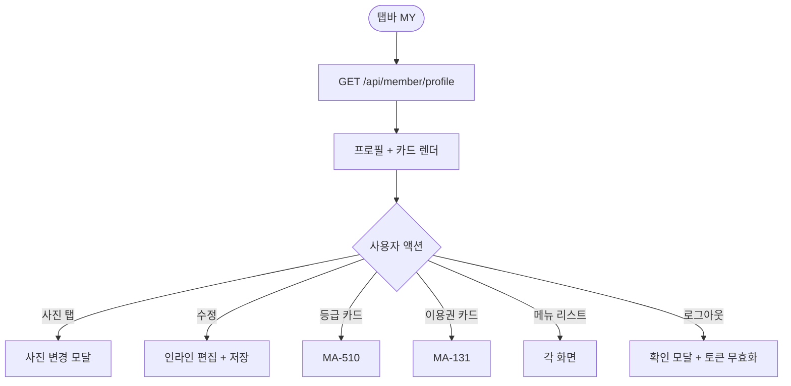
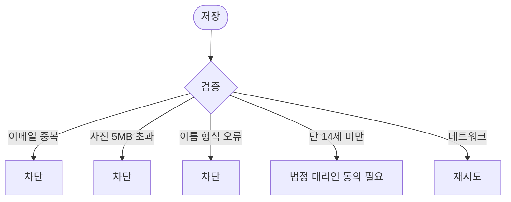

# MA-130 내 프로필 / 마이페이지 페이지

## 1. 화면 메타 정보

| 항목 | 값 |
|---|---|
| 작성일 / 버전 / 상태 | 2026-05-23 / v1.0 / 정합화 완료 |
| 도메인 | C01 공통-회원 |
| 화면 ID | MA-130 |
| 화면명 | 내 프로필 / 마이페이지 |
| 화면 유형 | 풀스크린 (member Tab의 MY) |
| 라우트 | `fitgenie://profile` |
| 우선순위 | P0 |
| 기능코드 | MFN-108 |
| 연계 화면 | MA-131 이용권, MA-111 출석이력, MA-132 체성분, MA-133 결제이력, MA-135 쿠폰, MA-136 마일리지, MA-150 알림, MA-155 설정 |
| 호출 모달 | 사진 변경 모달 (인라인) |

## 2. 화면 개요와 목적

회원이 본인 프로필을 조회·수정하고 마이페이지의 모든 회원 영역으로 진입하는 허브 화면입니다. 이름·연락처·이메일·생년월일·프로필 사진 같은 기본 정보 외에 등급 카드·잔여 마일리지·바로가기 메뉴를 통합 표시합니다.

## 3. 진입 경로와 인접 화면

진입: 탭바 MY, 홈 우상단 프로필 아이콘, 딥링크.

인접: 이용권(MA-131), 출석이력(MA-111), 체성분(MA-132), 결제(MA-133), 쿠폰(MA-135), 마일리지(MA-136), 알림센터(MA-150), 설정(MA-155).

## 4. 레이아웃과 UI 구성

- **프로필 카드**: 원형 사진 (or 이니셜) + 이름 + 등급 배지 + 회원 ID
- **수정 버튼**: 사진·이름·이메일·생년월일 수정
- **등급 카드**: 현재 등급 + 다음 등급 D-day (MA-510 진입)
- **잔여 카드 4종**: 이용권·마일리지·쿠폰·미확인 알림 (탭 시 각 화면)
- **메뉴 리스트**: 출석이력·체성분·결제이력·1:1문의·설정·로그아웃
- **하단**: 앱 버전 + 약관·개인정보 처리방침 링크

## 5. 탭 구성과 탭별 동작

탭 없음.

## 6. 버튼·아이콘·링크 액션 전체 정의

- **사진 영역**: 탭 시 사진 변경 모달 (앨범 선택 또는 카메라)
- **수정 버튼**: 인라인 편집 모드 (이름·이메일·생년월일)
- **저장**: `PATCH /api/member/profile`
- **등급 카드**: MA-510 등급 상세
- **잔여 카드**: 각 화면 이동
- **메뉴 리스트**: 각 화면 이동
- **로그아웃**: 확인 모달 + 토큰 무효화 + MA-001 이동
- **약관·개인정보 처리방침**: MA-950

## 7. 호출되는 모달 동작

**사진 변경 모달**: 앨범 선택 / 카메라 / 사진 삭제 옵션.

**로그아웃 확인 모달**: "로그아웃 하시겠어요?" + [확인]/[취소].

## 8. 토스트와 확인 팝업과 알럿

성공: "프로필이 수정되었어요". 실패: "사진 용량이 너무 커요(5MB 이내)", "이메일 형식이 올바르지 않아요".

## 9. 데이터 흐름과 외부 연동

**프로필 조회**: `GET /api/member/profile`.

**수정 API**: `PATCH /api/member/profile` (이름·이메일·생년월일·사진).

**사진 업로드**: `POST /api/member/profile/avatar` (multipart, 5MB 이내, jpg/png/webp).

**EXIF GPS 자동 제거**: 사진 업로드 시 위치 정보 자동 제거 + "위치 정보를 제거했어요" 안내.

**감사 로그**: 프로필 수정·사진 변경 이벤트는 docs2 SCR-097 감사 로그에 INSERT.

## 10. 화면 상태와 예외 처리

| 상태 | 설명 |
|---|---|
| 정상 | 프로필 + 카드 정상 |
| 수정 모드 | 인라인 편집 활성 |
| 저장 중 | 버튼 로딩 |
| 사진 업로드 중 | 진행률 표시 |

예외: 이메일 중복("이미 사용 중인 이메일"), 사진 5MB 초과, 이름 1~10자 외, 만 14세 미만 법정 대리인 동의.

## 11. 권한별 처리

`member` 본인만 본 화면 사용. 다른 role은 각자의 MY 영역 사용.

## 12. 메인 흐름

## 13. 에러와 예외 흐름

## 14. 핵심 디자인 요청사항

- 프로필 카드는 큰 원형 사진 + 등급 배지 강조
- 등급 배지 색상: 브론즈(갈색)·실버(은색)·골드(금색)·플래티넘(보라)·다이아몬드(다이아색)
- 잔여 카드 4종은 동일 크기·동일 그리드

## 15. 운영 정책

**개인정보 정책**: 사진은 5MB 이내 JPG/PNG/WebP만 허용. EXIF GPS 자동 제거.

**프로필 수정 정책**: 이름·생년월일 수정 시 운영자 알림 (CRM 마스터 동기화 확인).

**법정 대리인 동의 정책**: 만 14세 미만 회원의 정보 수정은 법정 대리인 동의 필수 (개인정보보호법).

**감사 로그 정책**: 프로필 수정·사진 변경·로그아웃 이벤트는 docs2 SCR-097 감사 로그에 INSERT.

이상의 모든 정책은 본 화면을 구현·운영하는 사람이 별도 문서 없이 이 한 장만 보면 이해할 수 있도록 풀어 적었습니다.
