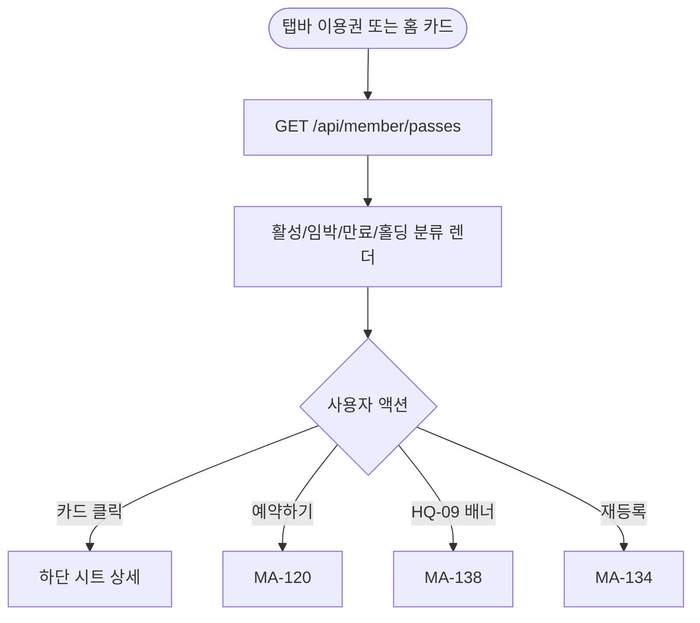
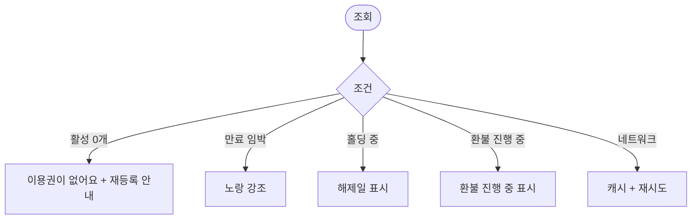

# MA-131 이용권 / 잔여 회차 조회 페이지

## 1. 화면 메타 정보

| 항목 | 값 |
|---|---|
| 작성일 / 버전 / 상태 | 2026-05-23 / v1.0 / 정합화 완료 |
| 도메인 | C01 공통-회원 |
| 화면 ID | MA-131 |
| 화면명 | 이용권 / 잔여 회차 조회 |
| 화면 유형 | 풀스크린 (탭바 이용권) |
| 라우트 | `fitgenie://passes` |
| 우선순위 | P0 |
| 기능코드 | MFN-110 |
| 연계 화면 | MA-138 재등록 추천, MA-134 상품 스토어, MA-120 예약 |
| 호출 모달 | 홀딩 안내 모달 (인라인 시트) |

## 2. 화면 개요와 목적

회원의 보유 이용권을 한 화면에 통합 표시하는 화면입니다. 활성·임박·만료·홀딩 상태별로 분리하여 잔여 횟수·D-day·홀딩 여부를 즉시 인지할 수 있게 합니다.

## 3. 진입 경로와 인접 화면

진입: 탭바 이용권, 홈 이용권 카드, MY 프로필의 이용권 카드.

인접: 만료 임박 시 MA-138 재등록 추천, 신규 구매는 MA-134 상품 스토어, 예약 진입은 MA-120.

## 4. 레이아웃과 UI 구성

- **상단 헤더**: "이용권"
- **활성 이용권 카드 (1~N개)**: 종류·잔여 횟수 또는 D-day·만료일·홀딩 상태
- **HQ-09 만료 알림 배너**: 본사 step 대상일 때
- **만료 임박/만료 이용권 (접힘)**: 펼치면 과거 이용권 표시
- **하단 [재등록 / 상품 스토어]**: MA-134 진입

## 5. 탭 구성과 탭별 동작

활성 / 만료 임박 / 만료 / 홀딩 4탭 (활성 기본 표시).

## 6. 버튼·아이콘·링크 액션 전체 정의

- **이용권 카드 클릭**: 시트로 상세 (구매일·종류·기간/횟수·홀딩 이력)
- **[예약하기]**: MA-120 이동
- **HQ-09 배너**: MA-138 이동
- **[재등록]**: MA-134 또는 MA-138 이동

## 7. 호출되는 모달 동작

이용권 상세는 하단 시트로 표시. 별도 모달 없음.

## 8. 토스트와 확인 팝업과 알럿

성공: 없음 (조회 전용). 실패: "데이터를 불러올 수 없어요" + 재시도.

## 9. 데이터 흐름과 외부 연동

**이용권 조회 API**: `GET /api/member/passes`. 응답에 활성·만료 임박·만료·홀딩 분류된 목록.

**HQ-09 만료 step 결과**: docs2 D02 NFR-05 동기화. 본 화면에서는 결과만 표시.

**5분 캐시**: 같은 시점 반복 조회 시 캐시 사용.

## 10. 화면 상태와 예외 처리

| 상태 | 설명 |
|---|---|
| 정상 | 활성 이용권 표시 |
| 활성 없음 | "활성 이용권이 없어요" + 재등록 안내 |
| 만료 임박 (D-7~D-Day) | 노랑 강조 |
| 홀딩 중 | 회색 + "홀딩 중" 배지 + 해제일 |
| 만료 | 회색 + "만료" 배지 |

예외: 회원 정지 플래그 ON이면 이용권 표시는 가능하나 예약 버튼 비활성. 환불 처리 중인 이용권은 "환불 진행 중" 표시.

## 11. 권한별 처리

`member` 본인 이용권만 조회. 다른 role 미접근.

## 12. 메인 흐름

## 13. 에러와 예외 흐름

## 14. 핵심 디자인 요청사항

- 활성 이용권 카드는 큰 D-day + 잔여 횟수 강조
- 임박은 노랑·만료는 회색·홀딩은 파랑 톤
- HQ-09 배너는 빨강 강조

## 15. 운영 정책

**이용권 정책** (docs2 D02/D05 정합):
- 기간제: 시작일~종료일 무제한 (홀딩 가능)
- 횟수제: 잔여 차감, 0회 만료
- 홀딩: 기간제만, 7~30일 (센터 설정)

**HQ-09 만료 알림**: 본사 step + 지점 추가 step 결과 단순 표시 (회원앱 step 정의 없음).

**5분 캐시**: 잦은 호출 방지.

이상의 모든 정책은 본 화면을 구현·운영하는 사람이 별도 문서 없이 이 한 장만 보면 이해할 수 있도록 풀어 적었습니다.
