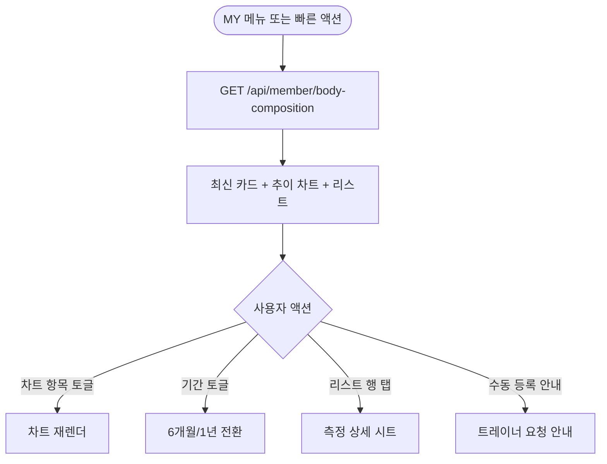
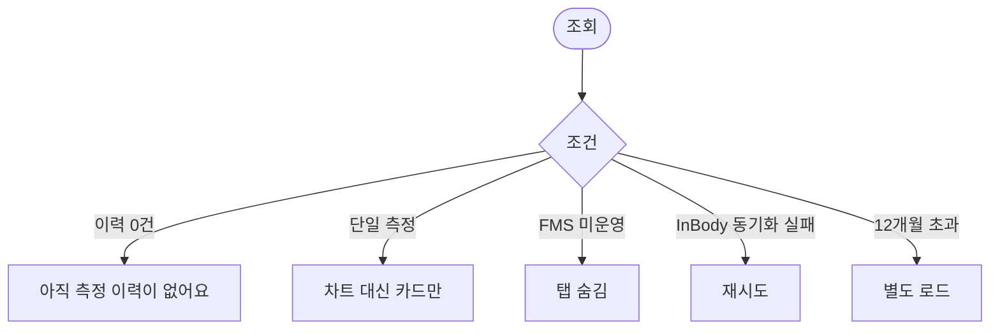

# MA-132 체성분 / FMS 조회 페이지

## 1. 화면 메타 정보

| 항목 | 값 |
|---|---|
| 작성일 / 버전 / 상태 | 2026-05-23 / v1.0 / 정합화 완료 |
| 도메인 | C01 공통-회원 |
| 화면 ID | MA-132 |
| 화면명 | 체성분 / FMS 조회 |
| 화면 유형 | 풀스크린 (차트 + 리스트) |
| 라우트 | `fitgenie://body-composition` |
| 우선순위 | P1 |
| 기능코드 | MFN-111 |
| 연계 화면 | MA-130 마이프로필, MA-146 건강 데이터, InBody 외부 장비 연동 |
| 호출 모달 | 측정 상세 시트 |

## 2. 화면 개요와 목적

회원이 본인 체성분 측정 결과(체중·골격근량·체지방률·BMI 등)와 FMS(Functional Movement Screen) 점수를 추이 차트와 리스트로 조회하는 화면입니다. InBody 장비에서 자동 수집되거나 트레이너가 수동 입력한 데이터를 단순 표시합니다.

## 3. 진입 경로와 인접 화면

진입: MY 프로필 메뉴, 빠른 액션, 홈 최근 활동 항목.

인접: 측정 상세 시트, 건강 데이터 연동(MA-146), 트레이너의 체성분 기록(MA-222 - 강사 측).

## 4. 레이아웃과 UI 구성

- **상단 헤더**: "체성분 / FMS"
- **최신 측정 카드**: 측정일·체중·골격근량·체지방률·BMI
- **추이 차트**: 6개월 / 1년 토글, 항목 토글(체중·골격근·체지방률·BMI)
- **측정 이력 리스트**: 시간 역순, 최근 20건
- **FMS 점수 카드**: 가장 최근 FMS 점수 (해당될 때만)
- **하단 [수동 측정 등록]**: 트레이너 호출 안내 (회원 본인은 수동 등록 불가)

## 5. 탭 구성과 탭별 동작

체성분 / FMS 2탭 (체성분 기본). 일부 센터는 FMS 미운영 시 탭 자동 숨김.

## 6. 버튼·아이콘·링크 액션 전체 정의

- **차트 항목 토글**: 항목 선택 시 즉시 차트 재렌더
- **기간 토글**: 6개월/1년 전환
- **리스트 행 탭**: 측정 상세 시트
- **수동 측정 등록 안내**: "트레이너에게 측정을 요청해주세요" 안내 (회원은 직접 등록 불가)

## 7. 호출되는 모달 동작

측정 상세는 시트로 표시 (날짜·측정 방식·전체 항목·트레이너 코멘트).

## 8. 토스트와 확인 팝업과 알럿

성공: 없음 (조회 전용). 실패: "데이터를 불러올 수 없어요".

## 9. 데이터 흐름과 외부 연동

**체성분 API**: `GET /api/member/body-composition?from=&to=`. 응답에 측정 이력 + FMS 점수.

**InBody 자동 수집**: InBody 장비(IB-270, InBody970 등)가 측정 후 CRM에 자동 INSERT → 회원 앱에 즉시 표시.

**Apple HealthKit / Google Fit 연동**: 회원이 MA-146에서 연동 활성화한 경우 걸음·심박 같은 보조 데이터 표시.

**5분 캐시 + 풀투리프레시**.

## 10. 화면 상태와 예외 처리

| 상태 | 설명 |
|---|---|
| 이력 있음 | 차트 + 리스트 정상 |
| 이력 없음 | "아직 측정 이력이 없어요" + 트레이너 요청 안내 |
| FMS 미운영 | FMS 탭 숨김 |
| 단일 측정 | 차트 표시 어려움 → 카드만 표시 |

예외: 12개월 초과 데이터는 별도 로드. InBody 외부 장비 연동 실패 시 재시도 알림.

## 11. 권한별 처리

`member` 본인 체성분만 조회. 트레이너는 MA-222 담당 회원 체성분 기록 화면 별도.

## 12. 메인 흐름

## 13. 에러와 예외 흐름

## 14. 핵심 디자인 요청사항

- 최신 측정 카드는 큰 숫자 강조
- 추이 차트는 항목별 색상 구분
- 변화량(전월 대비)은 화살표 + 색상 (감소 녹·증가 빨강·중성 회색)
- 다크 모드 차트 대응

## 15. 운영 정책

**측정 등록 정책**: 회원 본인은 측정 직접 등록 불가. InBody 자동 수집 또는 트레이너 수동 등록만 가능 (docs2 D02 MBR-EXT-03 정합).

**FMS 운영 여부**: 센터별 설정. 미운영 시 탭 자동 숨김.

**데이터 보관 정책**: 12개월 캐시 + 영구 보관. 1년 이상 콜드 스토리지.

**InBody 자동 연동**: 측정 즉시 회원 앱에 5초 이내 동기화 (WebSocket 또는 폴링).

이상의 모든 정책은 본 화면을 구현·운영하는 사람이 별도 문서 없이 이 한 장만 보면 이해할 수 있도록 풀어 적었습니다.
