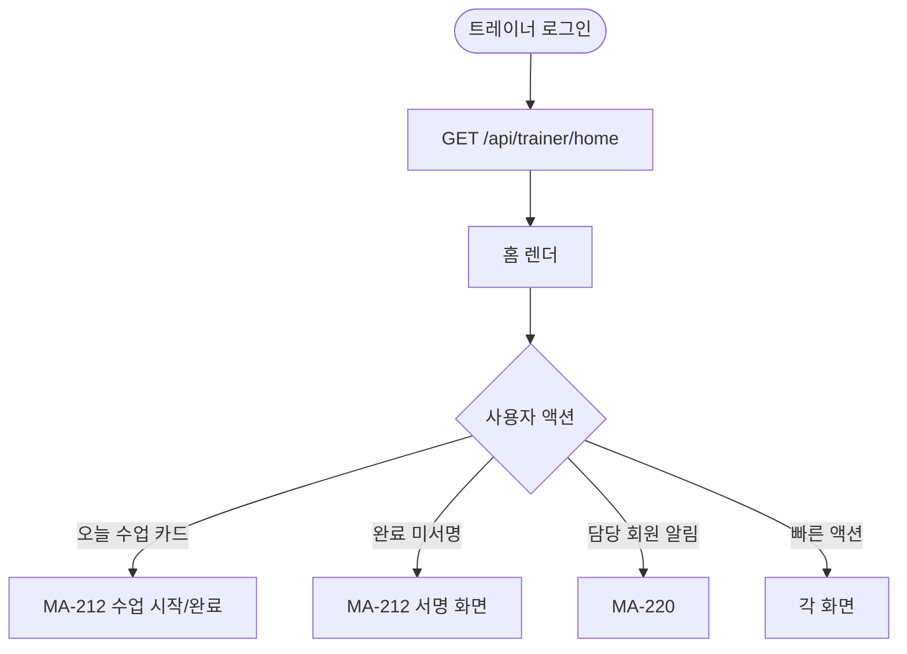
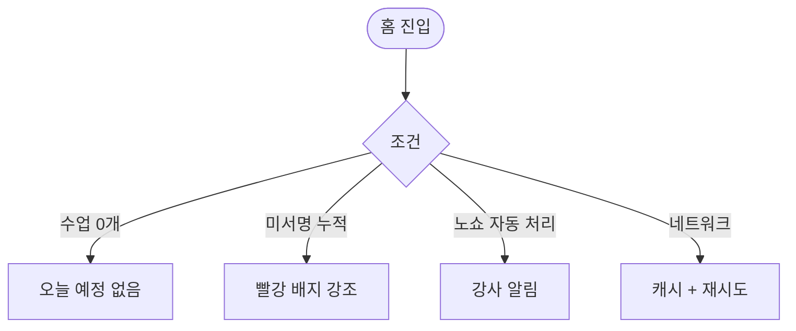

# MA-200 강사 홈 대시보드 페이지

## 1. 화면 메타 정보

| 항목 | 값 |
|---|---|
| 작성일 / 버전 / 상태 | 2026-05-23 / v1.0 / 정합화 완료 |
| 도메인 | C02 트레이너-골프강사 |
| 화면 ID | MA-200 |
| 화면명 | 강사 홈 대시보드 |
| 화면 유형 | 풀스크린 (TrainerNavigator의 홈) |
| 라우트 | `fitgenie://trainer-home` |
| 우선순위 | P0 |
| 기능코드 | MFN-201 |
| 연계 화면 | MA-210 캘린더, MA-211 수업목록, MA-212 수업 시작/완료/서명, MA-220 담당 회원, MA-240 강사 근무, MA-251 알림 |
| 호출 모달 | DLG 없음 (인라인 카드만) |

## 2. 화면 개요와 목적

트레이너 또는 골프강사가 출근 직후 오늘 수업 현황·담당 회원 알림·완료 미서명 건·NPS 평점을 한 화면에서 파악하는 메인 허브입니다.

## 3. 진입 경로와 인접 화면

진입: 직원 로그인 (트레이너 선택) 직후 디폴트, 탭바 홈, 푸시 알림 딥링크.

인접: 오늘 수업 카드 → MA-211 또는 MA-212, 완료 미서명 → 서명 화면, 만료 임박 회원 → MA-220.

## 4. 레이아웃과 UI 구성

- **상단 인사**: "안녕하세요, {강사명}님"
- **오늘 수업 카드**: 시간순 정렬, 시작 시간·종목·회원명·상태 배지 (예정/진행중/완료/노쇼)
- **요약 카드 4종**: 오늘 수업 N개·완료 N개·노쇼 N건·완료 미서명 N건
- **담당 회원 알림**: 만료 임박 회원·이용권 잔여 1회 회원
- **NPS 평점**: 이번 달 평균 별점 (회원 후기 기반)
- **빠른 액션 4종**: 수업 캘린더·담당 회원·체성분 기록·QR 출석 보조
- **하단 탭바**: 홈 / 회원 / 일정 / 피드백 / MY (5탭)

## 5. 탭 구성과 탭별 동작

본 화면 내부 탭 없음. 하단 탭바 5탭.

## 6. 버튼·아이콘·링크 액션 전체 정의

- **오늘 수업 카드 [수업 시작]**: 시작 시간 ±15분 활성 → MA-212
- **완료 미서명 클릭**: MA-212 서명 화면 (PT는 강사 서명, 골프는 쌍방서명)
- **요약 카드**: 각 화면 진입 (수업 목록·노쇼·미서명)
- **담당 회원 알림**: MA-220 담당 회원 목록
- **빠른 액션**: 각 화면

## 7. 호출되는 모달 동작

본 화면은 별도 모달 없음.

## 8. 토스트와 확인 팝업과 알럿

성공: 환영 토스트. 실패: 데이터 로딩 실패 시 재시도.

## 9. 데이터 흐름과 외부 연동

**홈 데이터 API**: `GET /api/trainer/home` (단일 통합). 오늘 수업·요약·알림·NPS 포함. 5분 캐시.

**A05 자동 노쇼**: 수업 시작 + 30분 미체크인 → 자동 노쇼 + 강사 알림.

**NPS 일일 집계**: 매일 04:00 강사별 평균 평점 갱신.

**만료 임박 알림 (HQ-09)**: 매일 03:00 NFR-05 결과 동기화 → 강사 담당 회원에 표시.

## 10. 화면 상태와 예외 처리

| 상태 | 설명 |
|---|---|
| 정상 | 오늘 수업 + 알림 정상 |
| 수업 없음 | "오늘 예정된 수업이 없어요" |
| 완료 미서명 강조 | 빨강 배지 |
| 노쇼 발생 | 노쇼 카드 강조 |

예외: 네트워크 오류 시 캐시 데이터. 본인 휴무일은 "오늘 휴무" 표시.

## 11. 권한별 처리

`trainer` / `golf_trainer`만 진입 가능. `member` / `fc` / `staff`는 미진입.

## 12. 메인 흐름

## 13. 에러와 예외 흐름

## 14. 핵심 디자인 요청사항

- 오늘 수업 카드는 시간 강조 + 회원명 표시
- 완료 미서명은 빨강 배지로 즉시 인지
- 강사 NPS 평점은 별점 + 숫자로 명확하게

## 15. 운영 정책

**역할 분기**: 트레이너 / 골프강사 동일 화면 사용. 골프강사는 쌍방서명·레슨 확인서 추가 화면 보유.

**A05 자동 노쇼 (CLS-08 정합)**: 수업 시작 + 30분 미체크인 자동 노쇼 + 페널티.

**NPS 집계 (D04 정합)**: docs2 D04 SCR-094 KPI 대시보드 강사 NPS와 1:1 매칭.

**담당 회원 데이터 접근**: 본인 담당 회원만 표시 (담당 수업 1회 이상).

이상의 모든 정책은 본 화면을 구현·운영하는 사람이 별도 문서 없이 이 한 장만 보면 이해할 수 있도록 풀어 적었습니다.
