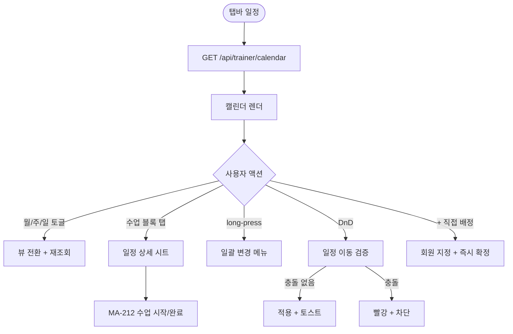
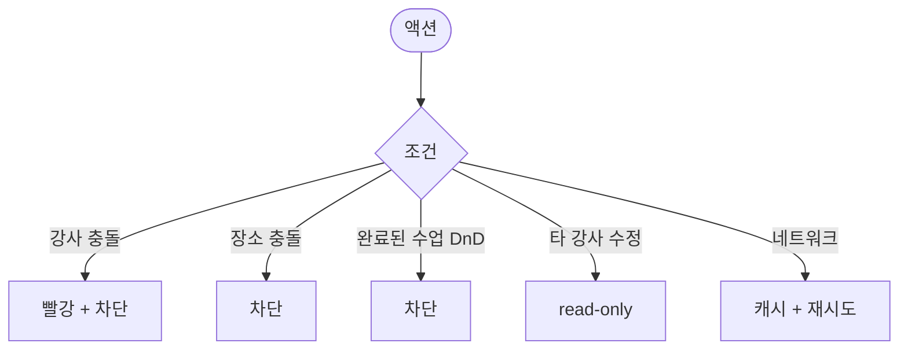

# MA-210 수업 캘린더 (월/주/일) 페이지

## 1. 화면 메타 정보

| 항목 | 값 |
|---|---|
| 작성일 / 버전 / 상태 | 2026-05-23 / v1.0 / 정합화 완료 |
| 도메인 | C02 트레이너-골프강사 |
| 화면 ID | MA-210 |
| 화면명 | 수업 캘린더 (월/주/일) |
| 화면 유형 | 풀스크린 (캘린더) |
| 라우트 | `fitgenie://trainer-calendar` |
| 우선순위 | P0 |
| 기능코드 | MFN-202 |
| 연계 화면 | MA-200 강사 홈, MA-211 수업 목록, MA-212 수업 시작/완료/서명 |
| 호출 모달 | 일정 상세 시트 |

## 2. 화면 개요와 목적

트레이너가 본인 담당 수업을 월/주/일 뷰로 조회하는 캘린더 화면입니다. 일정 이동·정원 확인·노쇼 추적·완료 미서명 강조 같은 운영 흐름을 시각적으로 처리합니다.

## 3. 진입 경로와 인접 화면

진입: 탭바 일정, 강사 홈에서 빠른 액션, 푸시 알림.

인접: 일정 셀 탭 → MA-212, 회원명 클릭 → MA-221, 일괄 변경은 일정 셀 long-press 후 메뉴.

## 4. 레이아웃과 UI 구성

- **상단 헤더**: 월/주/일 뷰 토글, 오늘 바로가기, 좌우 이동 화살표
- **캘린더 영역**: 본인 담당 수업 블록 표시 (색상: 종목별 또는 세션 유형별)
- **상태 배지**: 예정·진행중·완료·노쇼·완료 미서명
- **빈 시간 슬롯**: 회색
- **하단 [+ 직접 배정]**: 강사가 회원을 지정해 즉시 수업 생성 (CLS-01 정합)

## 5. 탭 구성과 탭별 동작

월 / 주 / 일 3종 뷰 토글.

## 6. 버튼·아이콘·링크 액션 전체 정의

- **뷰 토글**: 월/주/일 전환
- **오늘 바로가기**: 캘린더 오늘 날짜 강조
- **수업 블록 탭**: 일정 상세 시트 → MA-212
- **수업 블록 long-press**: 일괄 변경 메뉴 (시간 변경·강사 변경·취소)
- **[+ 직접 배정]**: 빈 슬롯에 회원 지정 → 즉시 확정 (docs2 D04 정합)
- **드래그&드롭**: 일정 시간 이동 (drag for time)

## 7. 호출되는 모달 동작

**일정 상세 시트**: 수업 정보 + [수업 시작/완료] 버튼 + 회원 정보 빠른 보기.

**일괄 변경 메뉴 (long-press)**: 시간 변경 / 강사 변경 (본인 외 강사로) / 취소 / 일괄 변경.

## 8. 토스트와 확인 팝업과 알럿

성공: "일정이 이동되었어요" (DnD 성공). 실패: "강사 일정이 겹쳐요"(차단), "장소가 사용 중이에요"(차단), "완료된 수업은 이동 불가"(차단).

## 9. 데이터 흐름과 외부 연동

**캘린더 데이터**: `GET /api/trainer/calendar?from=&to=&view=` → 본인 담당 수업 배열. 5분 캐시 + 풀투리프레시.

**일정 이동**: `PUT /api/lessons/:id/move` → 충돌 검증 + 적용.

**일괄 변경**: docs2 DLG-C004 일괄변경 (CRM에서 처리).

**자동 진행중 전이**: 매분 백엔드 배치가 시작 시간 도달 + 출석 1건 → "진행중" 상태 자동 전환.

**미서명 강조 잡**: 매분 종료 + 미서명 → 노랑 배지.

## 10. 화면 상태와 예외 처리

| 상태 | 설명 |
|---|---|
| 정상 | 캘린더 정상 |
| 빈 캘린더 | "이번 주 예정 수업이 없어요" |
| 충돌 감지 (DnD 중) | 빨강 + 차단 |
| 본인 휴무일 | "휴무" 표시 |
| 완료 미서명 | 노랑 배지 강조 |

예외: 강사 충돌, 장소 충돌, 회원 중복 예약 시 차단. 완료된 수업 DnD 시도 시 차단. 트레이너가 타 강사 일정 수정 시도 시 read-only.

## 11. 권한별 처리

`trainer` / `golf_trainer` 본인 담당 수업만 표시. 타 강사 수업은 조회만 가능하거나 미노출 (strict_owner 모드).

## 12. 메인 흐름

## 13. 에러와 예외 흐름

## 14. 핵심 디자인 요청사항

- 강사별 색상 코드 (캘린더 SCR-C001과 동일 톤)
- 종목·세션 유형별 색상 구분
- 노쇼·미서명 강조
- DnD는 시각 피드백 (반투명 이동)

## 15. 운영 정책

**일정 관리 정책**: docs2 D04 CLS-01 정합. 충돌 검증·DnD 일정 이동·강사 직접 배정 즉시 확정.

**자동 진행중 / 미서명 강조**: 매분 배치 자동 실행.

**본인 담당 권한**: strict_owner 모드 적용. 타 강사 수정 차단.

이상의 모든 정책은 본 화면을 구현·운영하는 사람이 별도 문서 없이 이 한 장만 보면 이해할 수 있도록 풀어 적었습니다.
