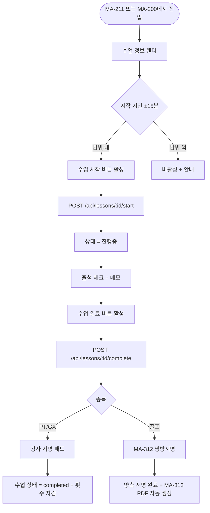
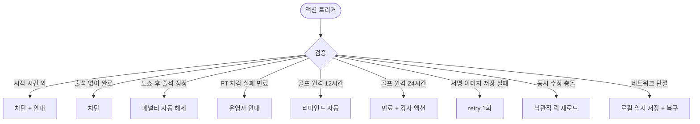

# MA-212 수업 시작 / 완료 / 서명 페이지

## 1. 화면 메타 정보

| 항목 | 값 |
|---|---|
| 작성일 / 버전 / 상태 | 2026-05-23 / v1.0 / 정합화 완료 |
| 도메인 | C02 트레이너-골프강사 |
| 화면 ID | MA-212 |
| 화면명 | 수업 시작 / 완료 / 서명 |
| 화면 유형 | 풀스크린 (단계별 흐름) |
| 라우트 | `fitgenie://lesson-complete/:lessonId` |
| 우선순위 | P0 |
| 기능코드 | MFN-204 / MFN-208 / MFN-209 |
| 연계 화면 | MA-200 강사 홈, MA-211 수업 목록, MA-222 체성분 기록, MA-312 골프 쌍방서명, MA-313 레슨 확인서 |
| 호출 모달 | 서명 패드 (풀스크린 가로 모드 자동 전환) |

## 2. 화면 개요와 목적

트레이너가 수업을 시작하고 완료 처리하며 강사 서명(PT/GX) 또는 쌍방서명(골프)을 받는 핵심 현장 화면입니다. 출석 체크·메모 입력·서명 패드·횟수 자동 차감까지의 전체 흐름이 단일 화면에서 단계적으로 진행됩니다. 골프 수업은 자동으로 MA-312 쌍방서명 흐름으로 분기됩니다.

## 3. 진입 경로와 인접 화면

진입: MA-211 수업 목록의 카드 클릭, MA-200 강사 홈의 오늘 수업 카드, 푸시 알림 "곧 수업 시작" 클릭.

인접: 골프는 MA-312 쌍방서명 → MA-313 레슨 확인서, PT/GX는 서명 후 자동 closed → MA-200 복귀, 회원 상세 빠른 보기 시트 → MA-221.

## 4. 레이아웃과 UI 구성

- **상단 헤더**: "수업 처리" + 닫기 X
- **수업 정보 카드**: 일시·종목·회원명·세션 유형(PT/필라테스/스트레칭/테라피)·장소
- **상태 표시**: 예정 → 진행중 → 완료 (단계별 progress)
- **수업 시작 버튼**: 예정 상태에서 활성 (시작 시간 ±15분 범위)
- **출석 체크 토글**: 회원 출석 / 결석 / 노쇼
- **수업 메모 입력**: 자유 텍스트 (선택, 1000자 이내)
- **수업 완료 버튼**: 출석 체크 후 활성
- **서명 패드**: PT는 강사 단독, 골프는 강사 + 회원 쌍방 (MA-312 분기)
- **회원 정보 빠른 보기**: 잔여 횟수·체성분 최근 기록 링크

## 5. 탭 구성과 탭별 동작

탭 없음. 단계별 흐름 (시작 → 출석 → 메모 → 완료 → 서명).

## 6. 버튼·아이콘·링크 액션 전체 정의

- **닫기 X**: 진행 중 작업 있으면 "정말 닫으시겠어요?" 확인 모달
- **[수업 시작]**: 시작 시간 ±15분 활성 → `POST /api/lessons/:id/start` → 상태 = 진행중
- **출석 체크 토글**: 회원 출석 / 결석 / 노쇼 즉시 저장
- **메모 입력**: 자동 저장 (3초 디바운스)
- **[수업 완료]**: 출석 체크 후 활성 → `POST /api/lessons/:id/complete` → 서명 단계 진입
- **서명 패드**: 가로 모드 자동 전환, 강사 서명 → 골프는 회원 서명 선택 (MA-312)
- **회원 정보 빠른 보기 시트**: 잔여 횟수·체성분 링크
- **체성분 기록 진입**: MA-222 (수업 완료 후 옵션)

## 7. 호출되는 모달 동작

**닫기 확인 모달 (인라인)**: 진행 중 작업 있을 때.

**서명 패드 (풀스크린)**: 가로 모드 자동 전환.

**골프 쌍방서명 분기**: MA-312 풀스크린 (대면 / 원격 서명 선택).

## 8. 토스트와 확인 팝업과 알럿

성공: "수업 시작되었어요", "수업 완료되었어요" (녹색).

실패: "시작 가능 시간이 아니에요 (±15분)"(차단), "출석 체크 후 완료 가능"(차단), "잔여 횟수가 없습니다"(차감 실패 → 운영자 안내).

## 9. 데이터 흐름과 외부 연동

**수업 시작 API**: `POST /api/lessons/:id/start`. 시작 시각 ±15분 검증.

**출석 체크 API**: `POST /api/lessons/:id/attendance` (회원별 결과 3종).

**수업 완료 API**: `POST /api/lessons/:id/complete` (메모·서명 이미지 포함).

**서명 이미지 저장**: AWS S3 / CloudFront (서명 이미지 + 타임스탬프 + 디바이스 정보).

**횟수 자동 차감 (CLS-07)**: 수업 completed 시 docs2 CLS-07 멱등성 키 적용 → 자동 차감.

**자동 노쇼 해제 (A05)**: 노쇼 처리된 회원이 출석 시 자동 해제.

**감사 로그**: 시작·출석·완료·서명·노쇼 모두 docs2 SCR-097 비동기 INSERT.

**골프 쌍방서명 분기**: 종목이 골프이면 자동으로 MA-312 풀스크린으로 전환.

## 10. 화면 상태와 예외 처리

| 상태 | 설명 |
|---|---|
| 예정 | 시작 버튼 활성 (±15분) |
| 진행중 | 완료 버튼 활성, 메모 입력 가능 |
| 완료 - 서명 대기 | 강사 또는 회원 서명 미완료 |
| 완료 + 서명 완료 | 수업 상태 = completed, 횟수 자동 차감 |
| 노쇼 | 시작 + 30분 미체크인 → A05 자동 |
| 원격 서명 대기 (골프) | 12시간 리마인드, 24시간 만료 |

예외: 시작 시간 외 시작 시도(차단), 출석 체크 없이 완료(차단), 노쇼 후 출석 정정(페널티 자동 해제), PT 차감 실패(만료 회원, 운영자 안내), 동시 수정 충돌(낙관적 락), 서명 이미지 저장 실패(retry 1회).

## 11. 권한별 처리

`trainer` 또는 `golf_trainer` 본인 담당 수업만 처리 가능. 타 강사 수업은 read-only.

## 12. 메인 흐름

## 13. 에러와 예외 흐름

## 14. 핵심 디자인 요청사항

- 단계별 progress는 시각적으로 명확하게
- 서명 패드는 가로 모드 + 풀스크린 자동 전환
- 회원 정보 빠른 보기는 시트 슬라이드
- 골프 쌍방서명 분기는 명확한 화면 전환

## 15. 운영 정책

**수업 시작 정책**: 시작 시간 ±15분 범위에서만 가능 (docs2 D04 정합).

**출석 체크 정책**: 수업 완료 전 필수. 결과 3종(성공/실패/중복)으로 분류 (docs2 _공통/상태전이.md 정합).

**자동 노쇼 (A05)**: 시작 + 30분 미체크인 자동 노쇼 + 페널티 (CLS-08 정합).

**횟수 차감 시점**: 수업 completed 시 (CLS-07 정합). 예약 시점이 아님.

**서명 정책**: PT/GX는 강사 서명만, 골프는 쌍방서명 필수 (1회 단가 10~20만원 분쟁 방지).

**서명 저장**: 이미지 + 타임스탬프 + 디바이스 정보 → 법적 증거력 확보.

**감사 로그**: 모든 수업 이벤트 docs2 SCR-097 비동기 INSERT.

이상의 모든 정책은 본 화면을 구현·운영하는 사람이 별도 문서 없이 이 한 장만 보면 이해할 수 있도록 풀어 적었습니다.
