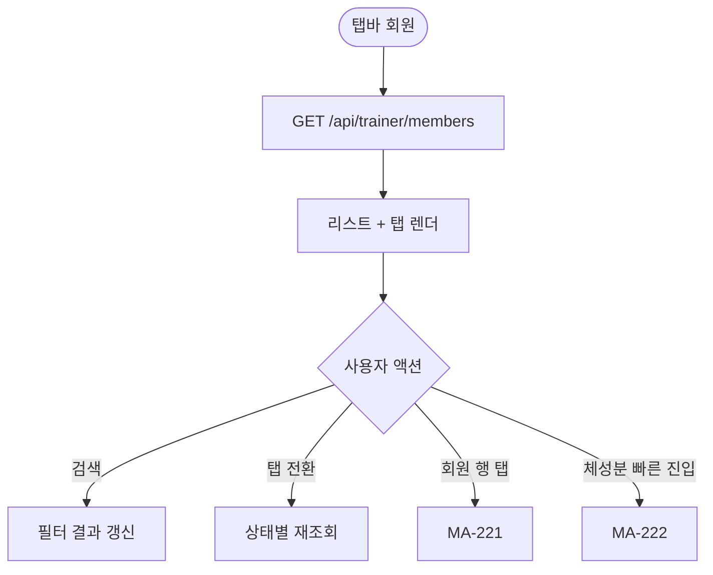
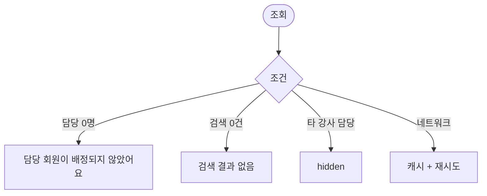

# MA-220 담당 회원 목록 페이지

## 1. 화면 메타 정보

| 항목 | 값 |
|---|---|
| 작성일 / 버전 / 상태 | 2026-05-23 / v1.0 / 정합화 완료 |
| 도메인 | C02 트레이너-골프강사 |
| 화면 ID | MA-220 |
| 화면명 | 담당 회원 목록 |
| 화면 유형 | 풀스크린 (탭 + 리스트) |
| 라우트 | `fitgenie://trainer-members` |
| 우선순위 | P0 |
| 기능코드 | MFN-220 |
| 연계 화면 | MA-221 회원 상세, MA-222 체성분 기록, MA-223 평가, MA-230 PT 횟수 |
| 호출 모달 | 회원 검색 시트 |

## 2. 화면 개요와 목적

강사가 본인 담당 회원 목록을 조회·검색·필터하는 화면입니다. 만료 임박·잔여 1회 회원 자동 강조로 운영 우선순위를 빠르게 식별합니다.

## 3. 진입 경로와 인접 화면

진입: 탭바 회원, 강사 홈 빠른 액션, 만료 임박 알림.

인접: 행 탭 → MA-221, 체성분 기록 → MA-222, PT 횟수 → MA-230.

## 4. 레이아웃과 UI 구성

- **상단 헤더**: "담당 회원" + 검색 + 필터
- **상태 필터 탭**: 전체 / 활성 / 만료 임박 / 만료 / 홀딩
- **회원 리스트**: 이름·이용권·잔여 횟수·마지막 출석·HQ-09 만료 step 배지
- **빈 상태**: "담당 회원이 없어요"

## 5. 탭 구성과 탭별 동작

5탭 (전체·활성·만료 임박·만료·홀딩).

## 6. 버튼·아이콘·링크 액션 전체 정의

- **검색**: 이름·연락처 검색
- **회원 행 탭**: MA-221 회원 상세
- **체성분 기록 빠른 진입**: 행 우측 아이콘 → MA-222
- **평가 빠른 진입**: MA-223

## 7. 호출되는 모달 동작

회원 검색 시트만 인라인 처리.

## 8. 토스트와 확인 팝업과 알럿

성공: 없음 (조회). 실패: "데이터 로딩 실패" + 재시도.

## 9. 데이터 흐름과 외부 연동

**담당 회원 API**: `GET /api/trainer/members?status=` → 본인 담당 회원 목록 (담당 수업 1회 이상). 5분 캐시.

**HQ-09 만료 step**: docs2 D02 NFR-05 결과 동기화로 만료 임박 배지 표시.

**만료 임박 자동 알림**: 매일 03:00 NFR-05 → 강사 푸시.

## 10. 화면 상태와 예외 처리

| 상태 | 설명 |
|---|---|
| 정상 | 회원 리스트 |
| 담당 없음 | "담당 회원이 배정되지 않았어요" |
| 검색 결과 0건 | "검색 결과 없음" |
| 만료 임박 강조 | 노랑 강조 |

예외: 타 강사 담당 회원 접근 시도 시 hidden 또는 read-only. FC가 본 화면 진입 시도 시 차단.

## 11. 권한별 처리

`trainer` / `golf_trainer` 본인 담당 회원만 표시. 담당 외 회원은 hidden.

## 12. 메인 흐름

## 13. 에러와 예외 흐름

## 14. 핵심 디자인 요청사항

- 회원 리스트는 컴팩트 + 잔여 횟수 큰 글씨
- HQ-09 만료 step 대상은 빨강 배지
- 만료 임박은 노랑 강조

## 15. 운영 정책

**담당 권한**: 본인 담당 수업 1회 이상 회원만 조회 (docs2 D04 strict_owner 정합).

**HQ-09 만료 결과**: docs2 D02 NFR-05 동기화. 회원앱에서 step 정의 없음.

**개인정보**: 회원 상세·체성분·평가 작성은 본인 담당만 가능.

이상의 모든 정책은 본 화면을 구현·운영하는 사람이 별도 문서 없이 이 한 장만 보면 이해할 수 있도록 풀어 적었습니다.
