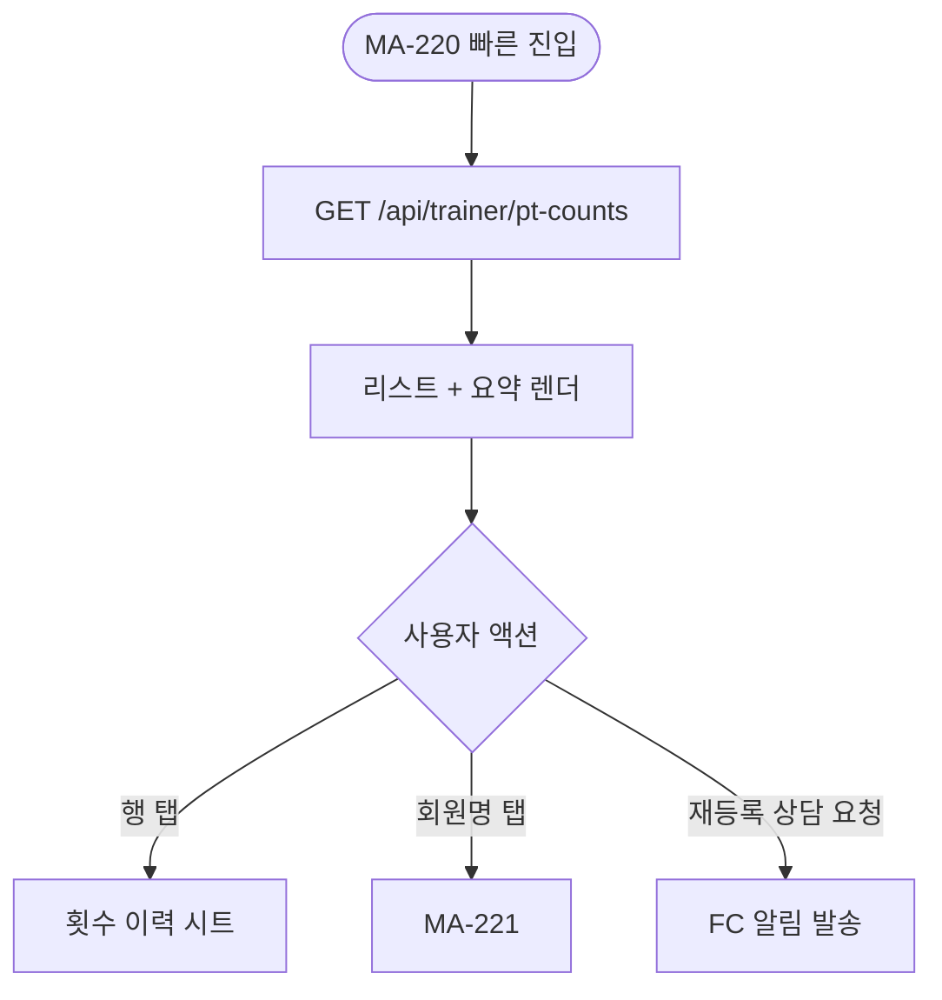

# MA-230 PT 횟수 / 완강 현황 페이지

## 1. 화면 메타 정보

| 항목 | 값 |
|---|---|
| 작성일 / 버전 / 상태 | 2026-05-23 / v1.0 / 정합화 완료 |
| 도메인 | C02 트레이너-골프강사 |
| 화면 ID | MA-230 |
| 화면명 | PT 횟수 / 완강 현황 |
| 화면 유형 | 풀스크린 (회원별 현황 테이블) |
| 라우트 | `fitgenie://trainer-pt-counts` |
| 우선순위 | P1 |
| 기능코드 | MFN-230 |
| 연계 화면 | MA-220 담당 회원, MA-221 회원 상세 |
| 호출 모달 | 횟수 이력 시트 |

## 2. 화면 개요와 목적

강사가 담당 회원별 PT 횟수 잔여·완강 진행률을 한눈에 파악하는 화면입니다. 완강 임박 회원에게 재등록 상담 트리거를 제공하고, 잔여 1회 회원은 강조 표시됩니다.

## 3. 진입 경로와 인접 화면

진입: MA-220 담당 회원 빠른 진입, 강사 홈 빠른 액션.

인접: 회원 행 탭 → MA-221, 횟수 이력 시트 → CRM CLS-07.

## 4. 레이아웃과 UI 구성

- **상단 헤더**: "PT 횟수 / 완강"
- **요약 카드 3종**: 담당 회원 N명·잔여 1회 N명·완강 임박 N명
- **회원 리스트**: 이름·이용권명·총 횟수·잔여·완강 진행률 (게이지)
- **정렬**: 잔여 적은 순 / 완강 임박 순
- **빈 상태**: "담당 PT 회원이 없어요"

## 5. 탭 구성과 탭별 동작

탭 없음 (정렬 토글로 분류).

## 6. 버튼·아이콘·링크 액션 전체 정의

- **회원 행 탭**: 횟수 이력 시트 (차감 이력)
- **이력 시트의 회원명 탭**: MA-221
- **[재등록 상담 요청]** (잔여 1회): FC에게 알림 발송

## 7. 호출되는 모달 동작

횟수 이력 시트만 인라인.

## 8. 토스트와 확인 팝업과 알럿

성공: "FC에게 재등록 상담을 요청했어요". 실패: 데이터 로딩 실패 재시도.

## 9. 데이터 흐름과 외부 연동

**PT 횟수 API**: `GET /api/trainer/pt-counts` → 본인 담당 PT 회원 + 잔여 횟수 + 완강률.

**docs2 CLS-07 정합**: 차감 이력은 CLS-07 횟수 관리 정본 동기화.

**재등록 상담 요청**: `POST /api/fc-requests` → FC에게 알림 (CRM-01 리드 관리에 신규 리드 INSERT 또는 기존 회원에 후속 상담 등록).

## 10. 화면 상태와 예외 처리

| 상태 | 설명 |
|---|---|
| 정상 | 리스트 정상 |
| 잔여 1회 | 빨강 강조 |
| 완강 임박 (90%+) | 노랑 강조 |
| 담당 PT 0명 | "담당 PT 회원이 없어요" |

예외: 동시 차감 충돌은 멱등성 키 (CLS-07 정합). 만료 회원은 회색 + "만료" 배지.

## 11. 권한별 처리

`trainer` / `golf_trainer` 본인 담당 PT 회원만 조회.

## 12. 메인 흐름



## 13. 에러와 예외 흐름

```mermaid
flowchart TD
    A([조회]) --> B{조건}
    B -->|담당 0명| C["담당 PT 회원 없음"]
    B -->|잔여 1회| D[빨강 강조]
    B -->|완강 임박| E[노랑 강조]
    B -->|만료 회원| F[회색 + "만료" 배지]
    B -->|네트워크| G[캐시 + 재시도]
```

## 14. 핵심 디자인 요청사항

- 잔여 횟수 큰 글씨 강조
- 완강률 게이지 (0%~100%)
- 잔여 1회는 빨강 강조
- 재등록 상담 요청 버튼은 잔여 1회·만료 임박에서만 활성

## 15. 운영 정책

**PT 횟수 정책 (CLS-07 정합)**: 잔여 차감은 수업 completed 시점. 멱등성 키로 중복 차감 방지.

**완강 정의**: 잔여 0회 도달.

**재등록 상담 요청**: FC에게 알림 → CRM-01 리드 관리에 후속 상담 자동 등록.

**개인정보**: 본인 담당 PT 회원만 조회.

이상의 모든 정책은 본 화면을 구현·운영하는 사람이 별도 문서 없이 이 한 장만 보면 이해할 수 있도록 풀어 적었습니다.
