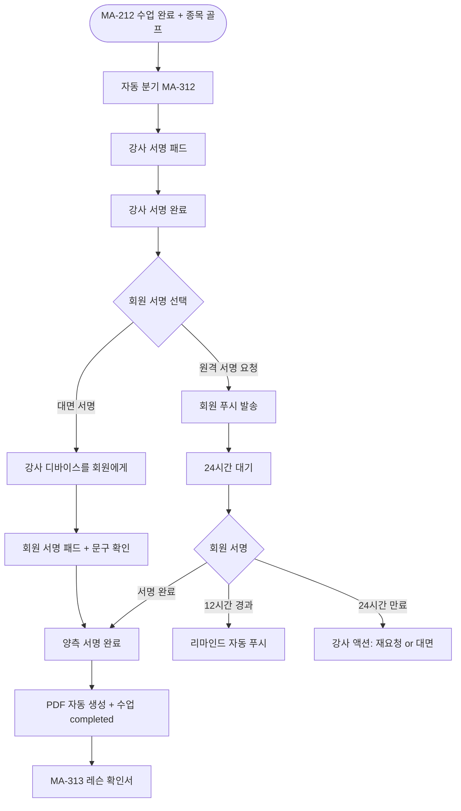
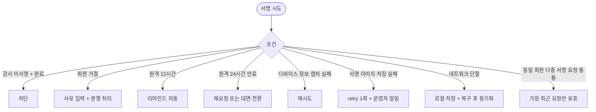

# MA-312 골프 쌍방서명 페이지

## 1. 화면 메타 정보

| 항목 | 값 |
|---|---|
| 작성일 / 버전 / 상태 | 2026-05-23 / v1.0 / 정합화 완료 |
| 도메인 | C02 트레이너-골프강사 |
| 화면 ID | MA-312 |
| 화면명 | 골프 수업 완료 쌍방서명 |
| 화면 유형 | 풀스크린 (가로 모드 자동 전환) |
| 라우트 | `fitgenie://sign/:signatureRequestId` (golf_trainer 전용) |
| 우선순위 | P0 (출시 필수) |
| 기능코드 | MFN-312 |
| 연계 화면 | MA-212 수업 완료, MA-313 레슨 확인서, 회원 앱 푸시 |
| 호출 모달 | DLG 없음 (풀스크린) |

## 2. 화면 개요와 목적

골프 레슨은 1회 단가가 10~20만원으로 PT(3~5만원) 대비 3~5배 높아 "수업을 안 했는데 수업료가 빠졌다" 같은 분쟁이 발생합니다. 본 화면은 강사 + 회원 양측 모두 서명해야 수업 완료 처리되도록 강제하여 법적 증거력을 확보합니다.

이 화면이 다루는 운영 흐름은 두 가지입니다. 대면 서명은 회원이 옆에 있을 때 강사 디바이스를 회원에게 전달해 즉시 서명받는 흐름이고, 원격 서명은 회원이 먼저 퇴장한 경우 회원 앱으로 푸시 알림이 발송되어 회원이 본인 디바이스에서 서명하는 흐름입니다.

## 3. 진입 경로와 인접 화면

진입: MA-212 수업 완료 후 종목이 골프인 경우 자동 분기, 또는 푸시 알림 딥링크 `fitgenie://sign/:signatureRequestId`.

인접: 양측 서명 완료 시 MA-313 레슨 확인서(PDF 자동 생성) 진입, 회원 앱은 푸시 알림 받은 후 본 화면(원격 서명 화면)에 진입.

## 4. 레이아웃과 UI 구성

- **상단 헤더**: "수업 완료 쌍방서명"
- **수업 정보 카드**: 날짜·시간·회원명·종목·수업 내용 (드라이버 스윙 교정 등)
- **단계 표시기**: 1. 강사 서명 → 2. 회원 서명 선택 → 3. 회원 서명 → 4. 완료
- **강사 서명 패드**: 풀스크린 가로 모드 자동 전환, 펜·지우개·다시 그리기
- **회원 서명 선택**: [대면 서명] (회원 옆에 있을 때) / [원격 서명 요청] (회원 부재 시)
- **회원 서명 패드**: 대면이면 디바이스 인계, 원격이면 회원 본인 디바이스
- **"수업을 정상 수강했습니다" 문구**: 회원 서명 단계 상단 강조
- **완료 버튼**: 양측 서명 완료 시 활성 + 레슨 확인서 PDF 자동 생성

## 5. 탭 구성과 탭별 동작

탭 없음. 단계별 진행.

## 6. 버튼·아이콘·링크 액션 전체 정의

- **강사 서명 패드**: 그리기·지우기·다시 그리기. 빈 화면 시 완료 차단
- **[강사 서명 완료]**: 다음 단계 진입
- **[대면 서명]**: 회원 서명 패드로 즉시 전환
- **[원격 서명 요청]**: 회원 푸시 발송 + 24시간 대기 + 12시간 후 리마인드
- **회원 서명 패드**: 대면은 강사 디바이스, 원격은 회원 본인 디바이스. "수업을 정상 수강했습니다" 문구 확인
- **[완료]**: 양측 서명 검증 + PDF 자동 생성 + 수업 completed
- **[다시 요청]**: 원격 서명 24시간 만료 시 강사가 재요청

## 7. 호출되는 모달 동작

본 화면은 풀스크린이므로 별도 모달 없음. 회원 거절·만료 등 예외는 상태 변경 + 시트 안내.

## 8. 토스트와 확인 팝업과 알럿

성공: "서명 완료되었어요" (양측), "회원에게 서명을 요청했어요" (원격).

실패: "서명이 만료되었어요. 재요청해주세요" (24시간 경과), "서명 이미지 저장 실패" (재시도).

## 9. 데이터 흐름과 외부 연동

**강사 서명 저장**: `POST /api/signatures/trainer` (signatureRequestId + 서명 이미지 base64 + 타임스탬프 + 디바이스 정보).

**원격 서명 요청**: `POST /api/signatures/remote-request` → 회원 푸시 발송 (FCM/APNs).

**회원 서명 저장**: `POST /api/signatures/member` (signatureRequestId + 서명 이미지 + 타임스탬프 + 디바이스 정보).

**리마인드 잡**: 12시간 경과 시 자동 푸시 재발송.

**만료 잡**: 24시간 경과 시 만료 처리 + 강사 알림.

**PDF 자동 생성**: `POST /api/lessons/:id/certificate-pdf` (양측 서명 후 자동 호출) → MA-313 레슨 확인서.

**수업 completed 트리거**: 양측 서명 완료 시 docs2 CLS-07 횟수 자동 차감 + 감사 로그 INSERT.

**서명 이미지 저장**: AWS S3 / CloudFront. 회원 PII 자동 제외. 디바이스 정보(OS·버전·IP)는 별도 저장.

## 10. 화면 상태와 예외 처리

| 상태 | 설명 |
|---|---|
| 강사 서명 대기 | 강사 서명 패드 표시 |
| 회원 서명 선택 | 대면 / 원격 선택 |
| 대면 서명 진행 | 회원 서명 패드 (강사 디바이스) |
| 원격 서명 대기 | 24시간 카운트다운 |
| 12시간 경과 | 리마인드 자동 푸시 |
| 24시간 만료 | 강사 액션 필요 (재요청 또는 대면 전환) |
| 양측 서명 완료 | PDF 생성 + 수업 completed |

예외: 강사 서명 미완료 + 완료 시도 차단. 회원 거절 시 사유 입력 + 운영자 처리 분쟁 큐. 원격 12/24시간 자동 처리. 디바이스 정보 캡처 실패 시 재시도. 네트워크 단절 시 서명 이미지 로컬 저장 + 복구 후 동기화.

## 11. 권한별 처리

`golf_trainer`만 강사 서명 진입 가능. 회원(`member`)은 원격 서명 요청 시 푸시로만 회원 서명 화면 진입.

## 12. 메인 흐름

## 13. 에러와 예외 흐름

## 14. 핵심 디자인 요청사항

- 풀스크린 가로 모드 자동 전환 + 서명 패드 가로
- "수업을 정상 수강했습니다" 문구는 회원 서명 단계 상단 강조 (의식적 확인)
- 단계 표시기로 진행 명확
- 24시간 만료 카운트다운은 빨강 강조
- PDF 생성 안내 모달은 완료 직후 짧게

## 15. 운영 정책 (이 화면에 연결된 부분)

**골프 쌍방서명 정책**: docs2 D04 정합. 1회 단가 10~20만원으로 분쟁 가능성 높아 강사 + 회원 쌍방서명 필수.

**서명 만료**: 원격 서명 24시간 (12시간 후 리마인드).

**서명 저장**: 이미지 base64 + 타임스탬프 + 디바이스 정보(OS·버전·IP) → 법적 증거력 확보.

**PDF 자동 생성**: 양측 서명 완료 시 레슨 확인서 PDF 자동 생성 → MA-313에서 조회.

**횟수 차감 (CLS-07 정합)**: 양측 서명 완료 = 수업 completed → 자동 차감 (멱등성 키).

**분쟁 처리**: 회원 거절 시 사유 입력 + 운영자 처리 큐로 이동.

**감사 로그**: 강사 서명·회원 서명·만료·재요청·거절 모두 docs2 SCR-097 비동기 INSERT.

**개인정보 정책**: 서명 이미지는 본인 외 접근 불가. 회원 거절 시 운영자만 사유 조회 가능.

이상의 모든 정책은 본 화면을 구현·운영하는 사람이 별도 문서 없이 이 한 장만 보면 이해할 수 있도록 풀어 적었습니다.
