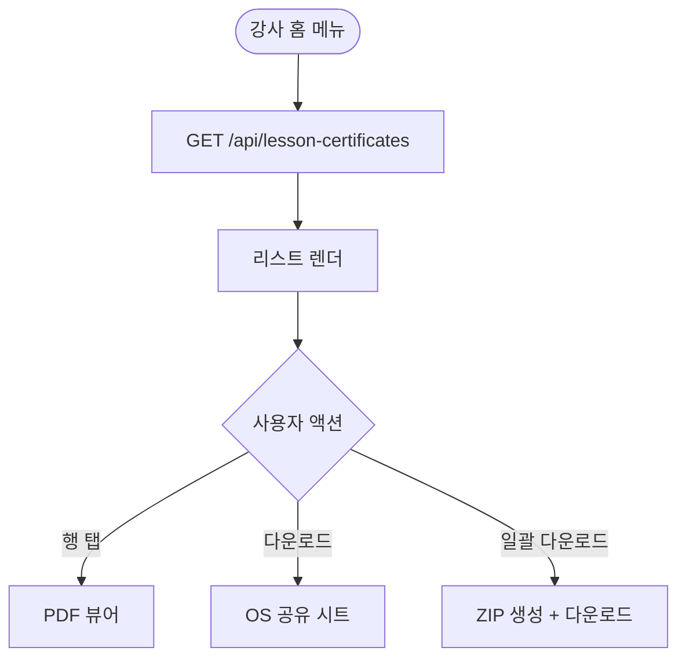
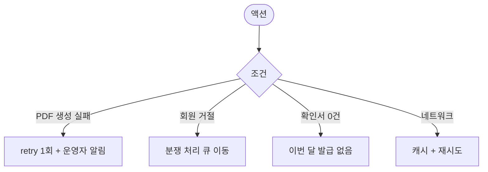

# MA-313 레슨 확인서 조회 페이지

## 1. 화면 메타 정보

| 항목 | 값 |
|---|---|
| 작성일 / 버전 / 상태 | 2026-05-23 / v1.0 / 정합화 완료 |
| 도메인 | C02 트레이너-골프강사 |
| 화면 ID | MA-313 |
| 화면명 | 레슨 확인서 조회 |
| 화면 유형 | 풀스크린 (리스트 + PDF 뷰어) |
| 라우트 | `fitgenie://lesson-certificates` |
| 우선순위 | P1 |
| 기능코드 | MFN-313 |
| 연계 화면 | MA-312 쌍방서명, MA-211 수업 목록 |
| 호출 모달 | PDF 뷰어 (인앱) |

## 2. 화면 개요와 목적

골프강사가 양측 서명이 완료된 수업의 레슨 확인서를 PDF 형태로 조회·다운로드·정산 자료로 활용하는 화면입니다. 월말 정산이나 분쟁 발생 시 법적 증거 자료로 사용됩니다.

## 3. 진입 경로와 인접 화면

진입: 강사 홈 메뉴, 탭바 일정 우측 메뉴, MA-312 양측 서명 완료 직후 안내 모달.

인접: 행 탭 시 PDF 뷰어, 다운로드 시 OS 공유 시트.

## 4. 레이아웃과 UI 구성

- **상단 헤더**: "레슨 확인서"
- **필터**: 기간(월별), 회원 검색
- **요약 카드**: 이번 달 완료 수업 N건·확인서 발급 N건·미서명 N건
- **확인서 리스트**: 날짜·회원명·종목·확인서 상태(발급 완료·미서명)
- **빈 상태**: "이번 달 발급된 확인서가 없어요"

## 5. 탭 구성과 탭별 동작

탭 없음 (필터로 분리).

## 6. 버튼·아이콘·링크 액션 전체 정의

- **확인서 행 탭**: PDF 뷰어 (인앱)
- **다운로드**: OS 공유 시트 (저장·메일·메신저)
- **일괄 다운로드**: 월별 ZIP (정산 자료)

## 7. 호출되는 모달 동작

PDF 뷰어는 인앱 전체 화면.

## 8. 토스트와 확인 팝업과 알럿

성공: "확인서 PDF가 저장됐어요". 실패: "PDF 로딩 실패" + 재시도.

## 9. 데이터 흐름과 외부 연동

**확인서 목록 API**: `GET /api/lesson-certificates?from=&to=&member=`.

**PDF 다운로드**: `GET /api/lesson-certificates/:id/pdf` → CDN URL.

**일괄 다운로드**: `GET /api/lesson-certificates/export?month=YYYY-MM` → ZIP.

**PDF 내용**: 수업 정보 + 강사·회원 서명 이미지 + 타임스탬프 + 디바이스 정보 + QR 검증 코드 (위변조 방지).

## 10. 화면 상태와 예외 처리

| 상태 | 설명 |
|---|---|
| 정상 | 리스트 정상 |
| 발급 완료 | 녹색 배지 |
| 미서명 | 노랑 배지 + 24시간 카운트다운 |
| 만료 (재요청 필요) | 빨강 배지 |

예외: PDF 생성 실패 시 retry 1회. 회원 거절 시 분쟁 처리 큐로 이동.

## 11. 권한별 처리

`golf_trainer`만 본 화면 사용. 일반 트레이너는 미진입.

## 12. 메인 흐름

## 13. 에러와 예외 흐름

## 14. 핵심 디자인 요청사항

- PDF 뷰어는 가로 모드 지원
- 다운로드 진행률 바
- 확인서 상태는 색상 배지

## 15. 운영 정책

**확인서 정책**: 양측 서명 완료 시 자동 생성. 서명 이미지 + 타임스탬프 + 디바이스 정보 + QR 검증 코드 포함.

**보관 정책**: 영구 보관. 1년 이상 콜드 스토리지.

**개인정보 정책**: 본인 담당 수업의 확인서만 조회 가능.

**위변조 방지**: PDF에 QR 검증 코드 삽입. 외부 위변조 시도 시 검증 실패 + 보안 알림.

**일괄 다운로드 정책**: 월별 ZIP. 30,000건 초과 시 백그라운드 처리.

이상의 모든 정책은 본 화면을 구현·운영하는 사람이 별도 문서 없이 이 한 장만 보면 이해할 수 있도록 풀어 적었습니다.
