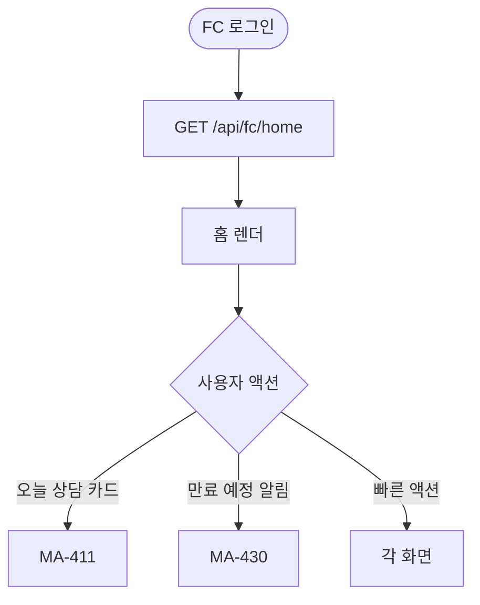
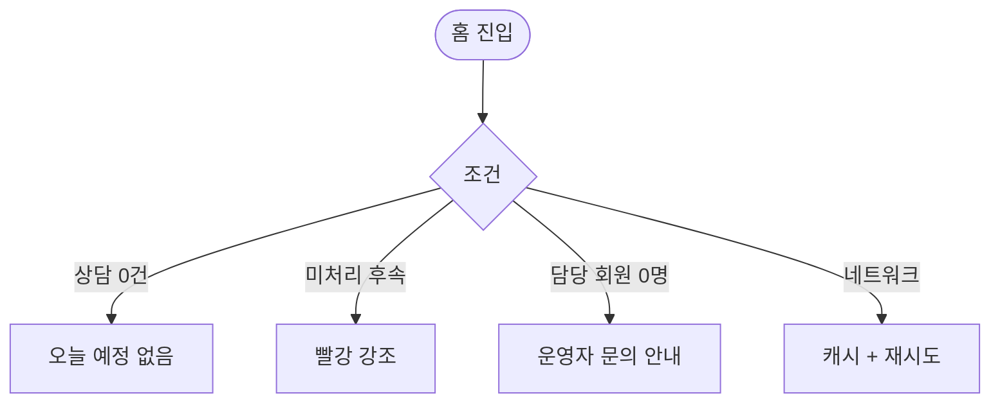

# MA-400 FC 홈 대시보드 페이지

## 1. 화면 메타 정보

| 항목 | 값 |
|---|---|
| 작성일 / 버전 / 상태 | 2026-05-23 / v1.0 / 정합화 완료 |
| 도메인 | C03 FC-스태프 |
| 화면 ID | MA-400 |
| 화면명 | FC 홈 대시보드 |
| 화면 유형 | 풀스크린 (FcNavigator의 홈) |
| 라우트 | `fitgenie://fc-home` |
| 우선순위 | P0 |
| 기능코드 | MFN-401 |
| 연계 화면 | MA-410 리드 목록, MA-411 상담 등록, MA-420 담당 회원, MA-430 만료 예정, MA-440 FC 성과 |
| 호출 모달 | DLG 없음 |

## 2. 화면 개요와 목적

FC가 출근 직후 오늘 상담 일정·만료 예정 회원·전환율 KPI·미처리 후속 액션을 한 화면에서 파악하는 메인 허브입니다.

## 3. 진입 경로와 인접 화면

진입: 직원 로그인 (FC 선택) 직후, 탭바 홈, 푸시 알림.

인접: 오늘 상담 → MA-411, 만료 예정 → MA-430, KPI → MA-440.

## 4. 레이아웃과 UI 구성

- **상단 인사**: "안녕하세요, {FC명}님"
- **오늘 상담 카드**: 시간순 정렬
- **요약 카드 4종**: 오늘 상담 N건·만료 예정 N명·이번 달 전환율 N%·미처리 후속 N건
- **만료 예정 회원 알림**: HQ-09 step 대상 (docs2 D02 정합)
- **빠른 액션 4종**: 상담 등록·리드 목록·만료 회원·KPI
- **이번 달 KPI**: 상담 건수·등록 전환율·재등록률
- **하단 탭바**: 홈 / 상담 / 회원 / KPI / 설정 (5탭)

## 5. 탭 구성과 탭별 동작

탭바 5탭만. 내부 탭 없음.

## 6. 버튼·아이콘·링크 액션 전체 정의

- 오늘 상담 카드 → MA-411 상담 등록
- 만료 예정 알림 → MA-430
- 빠른 액션 → 각 화면

## 7. 호출되는 모달 동작

본 화면은 모달 없음.

## 8. 토스트와 확인 팝업과 알럿

성공: 환영 토스트. 실패: 데이터 로딩 실패 재시도.

## 9. 데이터 흐름과 외부 연동

**홈 데이터 API**: `GET /api/fc/home` (통합). 5분 캐시.

**HQ-09 만료 step 결과 동기화**: docs2 D02 NFR-05 매일 03:00 → FC 홈 만료 예정 카드 갱신.

**보류 30일 알림**: 매일 04:00 → 보류 리드 노랑 강조.

**전환율 통계**: 단계 변경 / 첫 정상 결제 / 삭제 → 5분 캐시 무효화 + 재계산 (docs2 D08 정합).

## 10. 화면 상태와 예외 처리

| 상태 | 설명 |
|---|---|
| 정상 | 오늘 상담·만료 회원·KPI 정상 |
| 상담 없음 | "오늘 예정된 상담이 없어요" |
| 미처리 후속 강조 | 빨강 배지 |
| 만료 예정 ≥ 5명 | 강조 색상 |

예외: 본인 미배정 (담당 회원 0명) 시 "담당 회원이 배정되지 않았습니다" 안내. 데이터 로딩 실패 시 캐시.

## 11. 권한별 처리

`fc` role만 진입. 다른 role은 미접근.

## 12. 메인 흐름

## 13. 에러와 예외 흐름

## 14. 핵심 디자인 요청사항

- 오늘 상담 카드는 시간 강조
- 만료 예정 알림은 빨강 강조
- KPI는 시각적으로 비교 쉽게

## 15. 운영 정책

**FC 권한 정책 (docs2 D08 SCR-070 정합)**: 본인 담당 리드·회원만, `등록완료` 수동 저장 불가.

**HQ-09 만료 step**: docs2 D02 본사 step + 지점 추가 step 결과 단순 표시.

**전환율 통계**: docs2 D08 정합. 첫 정상 결제 완료 이벤트 기준.

이상의 모든 정책은 본 화면을 구현·운영하는 사람이 별도 문서 없이 이 한 장만 보면 이해할 수 있도록 풀어 적었습니다.
