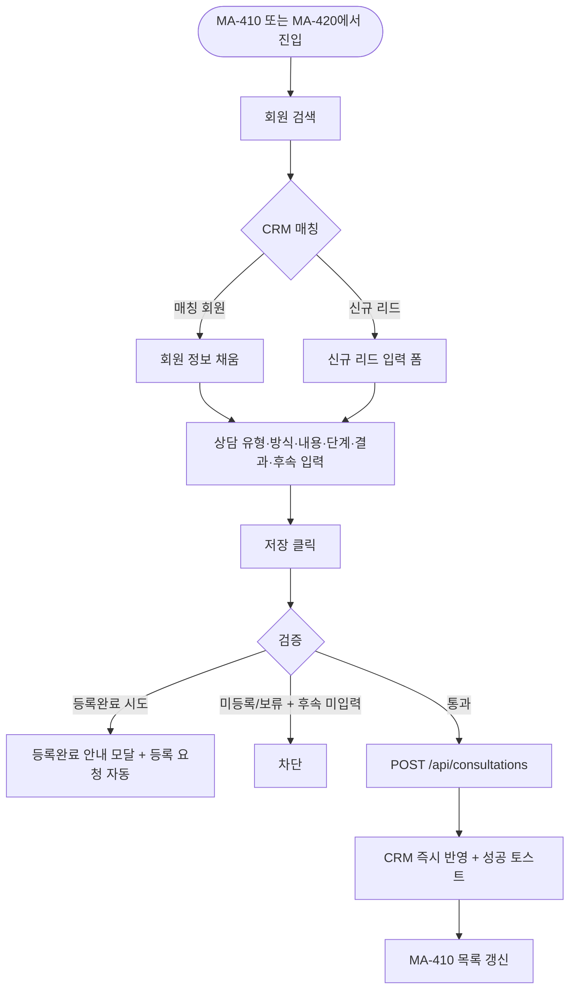
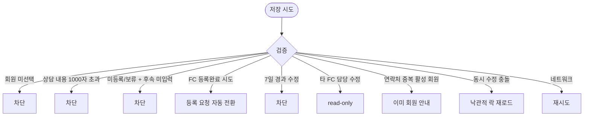

# MA-411 상담 이력 등록 페이지

## 1. 화면 메타 정보

| 항목 | 값 |
|---|---|
| 작성일 / 버전 / 상태 | 2026-05-23 / v1.0 / 정합화 완료 |
| 도메인 | C03 FC-스태프 |
| 화면 ID | MA-411 |
| 화면명 | 상담 이력 등록 |
| 화면 유형 | 풀스크린 (폼) |
| 라우트 | `fitgenie://consultation-new` |
| 우선순위 | P0 |
| 기능코드 | MFN-411 |
| 연계 화면 | MA-410 리드 목록, MA-420 담당 회원, MA-431 재등록 상담 |
| 호출 모달 | 회원 검색 시트·등록완료 안내 모달 |

## 2. 화면 개요와 목적

FC가 신규 상담·재등록 상담·OT·체험 같은 상담 이력을 등록하는 화면입니다. 회원 또는 신규 리드를 선택하고 상담 단계·결과·후속 조치를 기록하며 docs2 D08 SCR-070 CRM-01 리드 관리와 동일 데이터를 공유합니다.

## 3. 진입 경로와 인접 화면

진입: MA-410 리드 목록의 [+ 상담 등록], MA-420 담당 회원 상세, FC 홈의 빠른 액션.

인접: 저장 완료 시 MA-410 목록 자동 갱신, 만료 회원 재등록 → MA-431.

## 4. 레이아웃과 UI 구성

- **상단 헤더**: "상담 등록" + 닫기 X
- **회원 검색**: 이름·전화번호 (CRM 매칭) 또는 [+ 신규 리드 입력]
- **상담 유형**: 상담 / OT / 체험 / 재등록 상담 (라디오)
- **상담 일시**: 자동 (현재)
- **상담 방식**: 대면 / 유선 / 부재 (라디오)
- **상담 내용**: 자유 텍스트 (1000자 이내)
- **상담 단계 (7종)**: 신규 / 연락완료 / 상담예정 / 방문완료 / 등록완료 / 미전환 / 보류 (DnD 칸반 또는 드롭다운)
- **상담 결과**: 등록 / 미등록 / 보류 ("완료" 단계일 때만 활성)
- **후속 조치**: 미등록/보류 시 필수 (다음 연락 일정·후속 액션)
- **유입경로**: 9종 드롭다운 (간판·인터넷·전단지·추천·SNS·카카오톡·전화문의·방문·기타)
- **하단 [저장] / [취소]**

## 5. 탭 구성과 탭별 동작

탭 없음.

## 6. 버튼·아이콘·링크 액션 전체 정의

- **회원 검색**: 시트 + CRM 매칭 검증
- **신규 리드 입력**: 인라인 폼 (이름·전화·유입경로)
- **상담 단계 드롭다운**: 7종 선택 (`등록완료`는 비활성 - FC 수동 저장 불가, docs2 D08 SCR-070 정합)
- **[저장]**: 검증 후 `POST /api/consultations` → CRM CRM-01 즉시 반영
- **[취소]**: 입력 변경 있으면 확인 모달 → 닫기

## 7. 호출되는 모달 동작

**회원 검색 시트**: CRM 매칭 + 신규 리드 옵션.

**등록완료 안내 모달**: FC가 등록완료 단계 시도 시 "회원 등록 권한이 없어 등록 요청으로 전환됩니다" + Owner(지점장)/매니저 알림 발송 (docs2 D08 정합).

## 8. 토스트와 확인 팝업과 알럿

성공: "상담이 등록되었어요"(녹색). 

실패: "회원 검색 결과 없음", "후속 조치를 입력해주세요"(미등록/보류 + 미입력), "1000자 이내"(내용 초과), "타 FC 담당 리드는 수정 불가".

## 9. 데이터 흐름과 외부 연동

**상담 등록 API**: `POST /api/consultations` (memberOrLead + type + stage + result + followup + channel).

**CRM CRM-01 동기화**: 5초 이내 docs2 D08 SCR-070 리드 관리에 반영.

**FC 등록완료 시도 → 등록 요청**: docs2 D08 정합. FC가 단계를 `등록완료`로 시도하면 자동으로 "회원 등록 요청" 생성 + Owner(지점장)/매니저 알림 (NFR-19) 발송. `등록완료` 직접 확정은 첫 정상 결제 완료 이벤트 시 자동.

**후속 예정일 D-1 알림**: 미등록/보류의 후속 예정일 24시간 전 FC 푸시.

**보류 30일 경과 알림**: 매일 04:00 → 보류 리드 노랑 배지 + 후속 액션 권유.

**감사 로그**: 상담 등록·수정·삭제 모두 docs2 SCR-097 비동기 INSERT.

## 10. 화면 상태와 예외 처리

| 상태 | 설명 |
|---|---|
| 입력 중 | 폼 미완료 |
| 저장 중 | 버튼 로딩 |
| 저장 완료 | 성공 토스트 + 목록 갱신 |
| 회원 미선택 | 저장 차단 |
| 후속 조치 미입력 (미등록/보류) | 저장 차단 |
| FC 등록완료 시도 | 안내 모달 + 등록 요청 자동 전환 |

예외: 회원 검색 0건 시 "검색 결과 없음" + 신규 리드 안내. 상담 내용 1000자 초과 시 입력 차단. 동시 수정 충돌 시 낙관적 락. 7일 경과 후 수정 시도 시 차단(`수정 가능 기간(7일) 초과`). 연락처 중복 (활성 회원) 시 "이미 회원으로 등록된 번호" 안내. 타 FC 담당 리드 수정 시도 시 hidden 또는 read-only.

## 11. 권한별 처리

`fc` 본인 담당 리드·회원만 등록·수정 가능. 타 FC 담당은 read-only. `member`/`trainer`/`golf_trainer`/`staff`는 본 화면 미접근.

## 12. 메인 흐름

## 13. 에러와 예외 흐름

## 14. 핵심 디자인 요청사항

- 상담 단계 7종은 칸반 DnD 또는 드롭다운 (`등록완료`는 비활성·회색)
- 후속 조치 필드는 미등록/보류 선택 시 자동 펼침 + 빨강 강조
- 회원 검색 시트는 자동완성 + CRM 매칭 표시
- 상담 단계 색상은 docs2 D08 SCR-070과 동일

## 15. 운영 정책 (이 화면에 연결된 부분)

**FC `등록완료` 직접 저장 불가 (docs2 D08 SCR-070 정합)**: FC가 `등록완료`로 단계 변경 시도하면 회원 등록 요청 자동 생성 + Owner(지점장)/매니저 알림. `등록완료` 확정은 첫 정상 결제 완료 이벤트 시 자동.

**상담 단계 7종 (docs2 정본)**: 신규/연락완료/상담예정/방문완료/등록완료/미전환/보류. 운영 합의로 고정, 임의 추가·삭제 불가.

**후속 조치 정책**: 미등록/보류 시 후속 조치 필수. D-1 푸시 자동 발송.

**상담 수정 정책**: 등록 후 7일 이내만 수정 가능 (데이터 무결성).

**보류 30일 정책**: 자동 알림 + 노랑 배지 강조.

**연락처 중복 정책**: 활성 회원이면 리드 등록 차단, 탈퇴/삭제 회원이면 복구 우선 안내.

**개인정보 정책**: 본인 담당 리드·회원만 등록·수정 가능. 타 FC 담당은 hidden 또는 read-only.

**감사 로그**: 모든 등록·수정·삭제·등록 요청 자동 전환을 docs2 SCR-097에 비동기 INSERT.

이상의 모든 정책은 본 화면을 구현·운영하는 사람이 별도 문서 없이 이 한 장만 보면 이해할 수 있도록 풀어 적었습니다.
