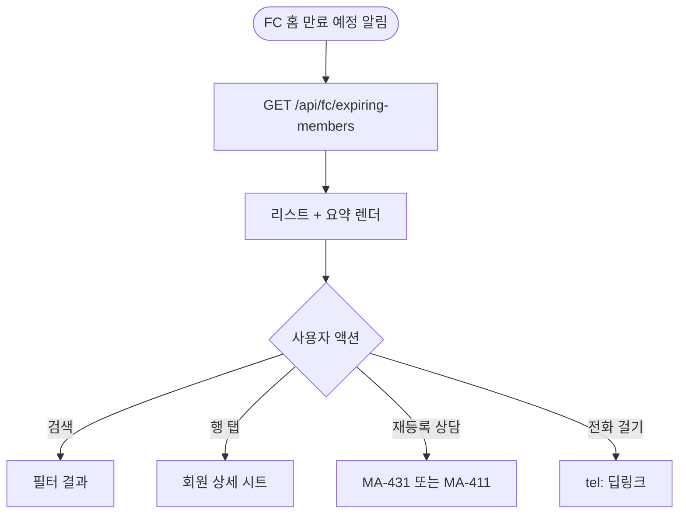
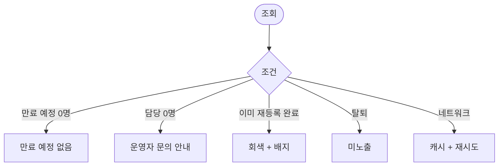

# MA-430 만료 예정 회원 목록 페이지

## 1. 화면 메타 정보

| 항목 | 값 |
|---|---|
| 작성일 / 버전 / 상태 | 2026-05-23 / v1.0 / 정합화 완료 |
| 도메인 | C03 FC-스태프 |
| 화면 ID | MA-430 |
| 화면명 | 만료 예정 회원 목록 |
| 화면 유형 | 풀스크린 (리스트) |
| 라우트 | `fitgenie://fc-expiring-members` |
| 우선순위 | P0 |
| 기능코드 | MFN-430 |
| 연계 화면 | MA-400 FC 홈, MA-411 상담 등록, MA-431 재등록 상담 |
| 호출 모달 | 회원 상세 시트 |

## 2. 화면 개요와 목적

FC가 docs2 D02 HQ-09 회원 이용권 만료 step 대상 회원을 본인 담당 기준으로 조회하고 재등록 상담을 빠르게 시작하는 화면입니다. 본사 step + 지점 추가 step 적용 결과를 단순 표시합니다.

## 3. 진입 경로와 인접 화면

진입: FC 홈의 만료 예정 알림, 탭바 회원, 푸시 알림.

인접: 행 탭 시 회원 상세 시트, [재등록 상담] → MA-431 또는 MA-411.

## 4. 레이아웃과 UI 구성

- **상단 헤더**: "만료 예정 회원" + 검색
- **필터**: 만료 step (예: D-30 / D-14 / D-7 / D-Day) + 회원 검색
- **요약 카드 3종**: 본사 step 대상 N명·지점 추가 step 대상 N명·D-Day 대상 N명
- **회원 리스트**: 이름·이용권·만료일 D-day·마지막 상담일·연락처
- **빈 상태**: "만료 예정 회원이 없어요"
- **행 [재등록 상담]**: 즉시 MA-431 진입

## 5. 탭 구성과 탭별 동작

탭 없음 (필터 칩으로 분리).

## 6. 버튼·아이콘·링크 액션 전체 정의

- **검색**: 이름·연락처
- **필터 칩**: step 다중 선택
- **회원 행 탭**: 회원 상세 시트
- **[재등록 상담]**: MA-431 진입 (또는 MA-411로 자동 채움)
- **[전화 걸기]**: tel: 딥링크
- **[메시지]**: SMS 또는 카카오톡 공유

## 7. 호출되는 모달 동작

회원 상세 시트는 인라인.

## 8. 토스트와 확인 팝업과 알럿

성공: "상담 등록되었어요" (MA-411 경유). 실패: 데이터 로딩 실패 + 재시도.

## 9. 데이터 흐름과 외부 연동

**만료 예정 API**: `GET /api/fc/expiring-members?step=` → 본인 담당 + step 대상.

**HQ-09 step 결과**: docs2 D02 NFR-05 매일 03:00 동기화. 본사 step + 지점 추가 step 적용 결과.

**상담 트리거**: 재등록 상담 시작 → MA-411 자동 채움 또는 MA-431.

## 10. 화면 상태와 예외 처리

| 상태 | 설명 |
|---|---|
| 정상 | 리스트 정상 |
| 만료 예정 0명 | "만료 예정 회원이 없어요" |
| 본인 담당 0명 | "담당 회원이 배정되지 않았어요" |
| D-Day 대상 | 빨강 강조 |

예외: 이미 재등록 완료된 회원은 회색 + "재등록 완료" 배지. 탈퇴 회원은 미노출.

## 11. 권한별 처리

`fc` 본인 담당 회원만 표시 (strict_owner 모드).

## 12. 메인 흐름

## 13. 에러와 예외 흐름

## 14. 핵심 디자인 요청사항

- D-day 색상: D-7 이내 빨강, D-7~D-14 노랑, 그 외 회색
- 빠른 액션 (전화·메시지) 우측 아이콘
- 마지막 상담일 작게 표시

## 15. 운영 정책

**HQ-09 회원 이용권 만료 step**: docs2 D02 정본. 본사 step + 지점 추가 step 결과 단순 표시. 회원앱에서 step 정의 없음.

**FC 데이터 접근**: 본인 담당 회원만 (strict_owner 모드).

**재등록 상담 흐름**: MA-431 또는 MA-411 자동 채움. CRM CRM-01에 즉시 반영.

이상의 모든 정책은 본 화면을 구현·운영하는 사람이 별도 문서 없이 이 한 장만 보면 이해할 수 있도록 풀어 적었습니다.
