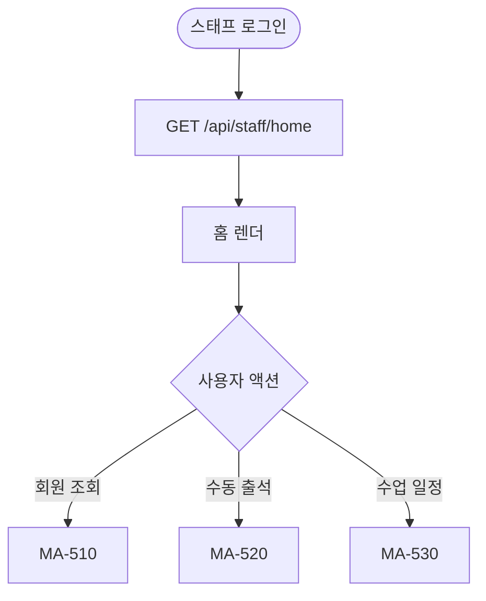
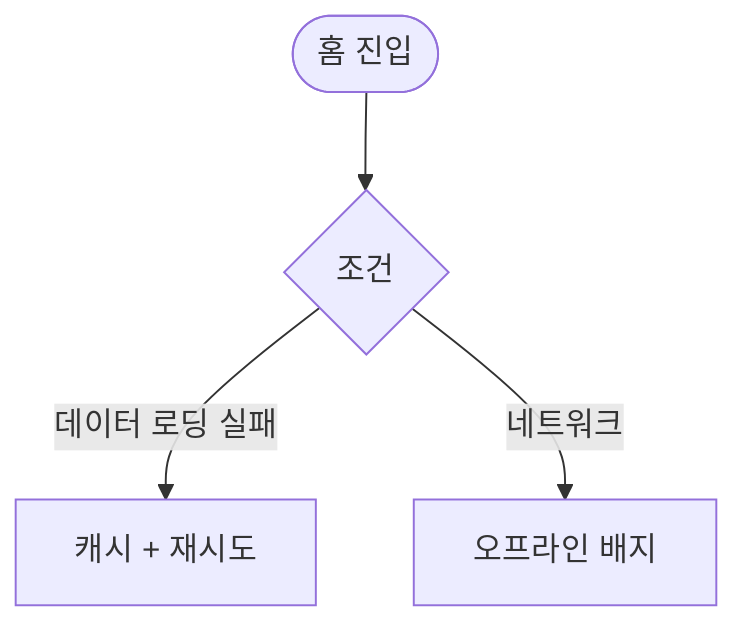

# MA-500 스태프 홈 페이지

## 1. 화면 메타 정보

| 항목 | 값 |
|---|---|
| 작성일 / 버전 / 상태 | 2026-05-23 / v1.0 / 정합화 완료 |
| 도메인 | C03 FC-스태프 |
| 화면 ID | MA-500 |
| 화면명 | 스태프 홈 |
| 화면 유형 | 풀스크린 (StaffNavigator의 홈) |
| 라우트 | `fitgenie://staff-home` |
| 우선순위 | P1 |
| 기능코드 | MFN-500 |
| 연계 화면 | MA-510 회원 조회, MA-520 수동 출석, MA-530 수업 일정 조회 |
| 호출 모달 | DLG 없음 |

## 2. 화면 개요와 목적

스태프가 출근 직후 오늘 출석 현황·진행 중 수업·미처리 알림을 한 화면에서 파악하고, 회원 조회·수동 출석 처리 같은 프론트 데스크 업무 진입 허브 역할을 합니다.

## 3. 진입 경로와 인접 화면

진입: 직원 로그인 (스태프 선택) 직후, 탭바 홈, 푸시 알림.

인접: 회원 조회 → MA-510, 수동 출석 → MA-520, 수업 일정 → MA-530.

## 4. 레이아웃과 UI 구성

- **상단 인사**: "안녕하세요, {스태프명}님"
- **요약 카드 4종**: 오늘 출석 N명·진행 중 수업 N개·만료 회원 N명·미처리 알림 N건
- **빠른 액션 4종**: 회원 조회·수동 출석·수업 일정·알림센터
- **현장 알림**: 운영자 공지·시설 점검·이용 가능 룸 현황
- **하단 탭바**: 홈 / 회원 / 출석 / 일정 / 설정 (5탭)

## 5. 탭 구성과 탭별 동작

탭바 5탭만.

## 6. 버튼·아이콘·링크 액션 전체 정의

- **요약 카드**: 각 화면 진입
- **빠른 액션**: 회원 조회·수동 출석·일정·알림

## 7. 호출되는 모달 동작

본 화면은 모달 없음.

## 8. 토스트와 확인 팝업과 알럿

성공: 환영 토스트. 실패: 데이터 로딩 실패 + 재시도.

## 9. 데이터 흐름과 외부 연동

**홈 데이터 API**: `GET /api/staff/home` (통합). 5분 캐시.

**오늘 출석 현황**: docs2 D02 회원 출석 + D11 SCR-I001 통합 출석 데이터 단순 표시 (스태프는 본인 등록 외 read-only).

## 10. 화면 상태와 예외 처리

| 상태 | 설명 |
|---|---|
| 정상 | 요약 + 알림 정상 |
| 데이터 로딩 실패 | 재시도 + 캐시 |

예외: 본 화면은 read-only 정보만 다루므로 데이터 손실 위험 없음.

## 11. 권한별 처리

`staff` role만 진입. 다른 role 미접근.

## 12. 메인 흐름

## 13. 에러와 예외 흐름

## 14. 핵심 디자인 요청사항

- 요약 카드는 큰 숫자 강조
- 빠른 액션은 큰 아이콘 + 짧은 라벨

## 15. 운영 정책

**스태프 권한 정책**: 회원 조회 read-only + 수동 출석만 가능. 회원 수정·삭제·엑셀 불가.

**docs2 D02 데이터 정합**: 회원 데이터는 단순 표시 (CRM 정본).

이상의 모든 정책은 본 화면을 구현·운영하는 사람이 별도 문서 없이 이 한 장만 보면 이해할 수 있도록 풀어 적었습니다.
