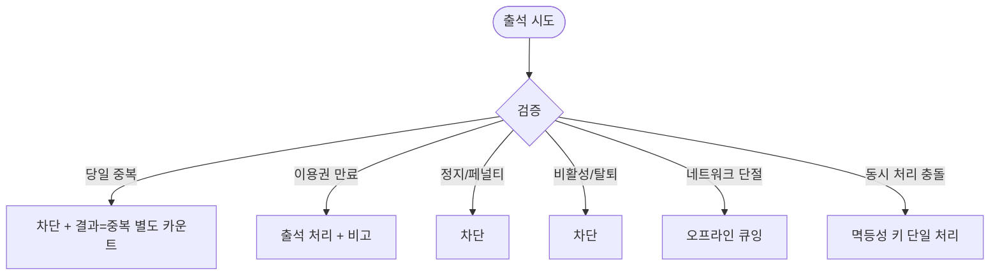

# MA-520 수동 출석 처리 페이지

## 1. 화면 메타 정보

| 항목 | 값 |
|---|---|
| 작성일 / 버전 / 상태 | 2026-05-23 / v1.0 / 정합화 완료 |
| 도메인 | C03 FC-스태프 |
| 화면 ID | MA-520 |
| 화면명 | 수동 출석 처리 |
| 화면 유형 | 풀스크린 (검색 + 처리) |
| 라우트 | `fitgenie://manual-attendance` |
| 우선순위 | P0 |
| 기능코드 | MFN-520 |
| 연계 화면 | MA-500 스태프 홈, MA-510 회원 조회 |
| 호출 모달 | DLG 없음 |

## 2. 화면 개요와 목적

스태프가 회원의 QR 스캔이 불가능할 때 (회원 폰 분실·QR 오류·체험 회원·게이트 미설치 등) 수동으로 출석 처리하는 화면입니다. docs2 D11 SCR-I001 통합 출석 관리의 모바일 수동 처리 채널입니다.

## 3. 진입 경로와 인접 화면

진입: 탭바 출석 (StaffNavigator), 스태프 홈 빠른 액션, 회원 조회에서의 [수동 출석].

인접: 회원 카드 클릭 시 MA-511 회원 상세 read-only, 처리 후 최근 출석 목록 자동 갱신.

## 4. 레이아웃과 UI 구성

- **상단 헤더**: "수동 출석 처리"
- **회원 검색**: 이름·전화번호 (자동완성 + CRM 매칭)
- **회원 카드**: 매칭된 회원 정보 (이름·이용권·잔여 횟수·마지막 방문·상태 배지)
- **이용권 만료 경고 배너**: 만료 회원도 출석은 가능하나 비고 표시 안내
- **[출석 처리] 버튼**: 회원 선택 후 활성
- **최근 처리 목록**: 본인 처리 이력 (최근 10건, 시간 역순)

## 5. 탭 구성과 탭별 동작

탭 없음.

## 6. 버튼·아이콘·링크 액션 전체 정의

- **회원 검색**: 자동완성 + CRM 매칭, 300ms 디바운스
- **회원 카드 탭**: 회원 상세 시트 (read-only)
- **[출석 처리]**: `POST /api/attendance/manual` → 결과 토스트 + 목록 갱신
- **최근 목록 행 탭**: 처리 상세 시트

## 7. 호출되는 모달 동작

본 화면은 모달 없음. 회원 상세는 시트로 처리.

## 8. 토스트와 확인 팝업과 알럿

성공: "출석 처리 완료" (녹색).

실패: "오늘 이미 출석했어요"(중복), "이용권을 확인해주세요"(만료), "예약 제한 중"(페널티), "유효하지 않은 회원"(비활성/탈퇴).

## 9. 데이터 흐름과 외부 연동

**회원 검색 API**: `GET /api/staff/member-search?q=` (자동완성).

**수동 출석 API**: `POST /api/attendance/manual` (member_id + branch_id + actor_staff_id) → 결과 3종 분류(성공/실패/중복).

**최근 처리 목록**: `GET /api/staff/manual-attendance-recent?limit=10`.

**docs2 D11 SCR-I001 정합**: 수동 출석 결과는 통합 출석 관리에 INSERT.

**자동 횟수 차감 (CLS-07)**: PT 수업 출석 시 멱등성 키 적용.

**감사 로그**: docs2 SCR-097에 `actor_staff_id`, `member_id`, `result`, `timestamp` 비동기 INSERT.

## 10. 화면 상태와 예외 처리

| 상태 | 설명 |
|---|---|
| 검색 중 | 자동완성 |
| 회원 선택됨 | 출석 처리 버튼 활성 |
| 처리 중 | 버튼 로딩 |
| 처리 완료 | 성공 토스트 + 목록 갱신 |
| 만료 회원 | 경고 배너 (출석 가능, 비고 표시) |
| 정지 / 페널티 | 차단 |
| 비활성 / 탈퇴 | 차단 |

예외: 동일 회원 당일 중복 시도 차단(결과=중복으로 별도 카운트). 동시 출석 처리 충돌 시 멱등성 키로 단일 처리. 만료 회원 출석은 비고 ("이용권 만료") + 운영자 알림.

## 11. 권한별 처리

`staff` role만 진입 가능. 수정·삭제 불가, 출석 처리만 가능.

## 12. 메인 흐름

```mermaid
flowchart TD
    A([탭바 출석]) --> B[회원 검색]
    B --> C{CRM 매칭}
    C -->|매칭| D[회원 카드 표시]
    D --> E[출석 처리 버튼 활성]
    E --> F[POST /api/attendance/manual]
    F --> G{결과}
    G -->|성공| H[녹색 토스트 + 목록 갱신]
    G -->|중복| I["오늘 이미 출석"]
    G -->|실패 (만료/페널티/탈퇴)| J[사유별 안내 + 차단]
```

## 13. 에러와 예외 흐름



## 14. 핵심 디자인 요청사항

- 검색은 즉시 자동완성
- 회원 카드는 큰 글씨 + 상태 배지
- 만료 회원 경고는 노랑 배너
- 최근 처리 목록은 컴팩트

## 15. 운영 정책

**스태프 권한 정책**: 수동 출석 처리만 가능. 수정·삭제·엑셀 불가 (read-only 외 액션 차단).

**docs2 D11 SCR-I001 정합**: 수동 출석은 통합 출석 관리의 모바일 채널.

**출석 결과 3종 (docs2 _공통/상태전이.md 정본)**: 성공 / 실패 / 중복.

**자동 횟수 차감 (CLS-07 정합)**: PT 수업 시 멱등성 키 적용.

**만료 회원 정책**: 출석은 처리하되 비고 표시 + 운영자에게 재등록 안내.

**감사 로그**: 모든 수동 출석은 docs2 SCR-097에 `actor_staff_id` 포함 INSERT (사후 추적).

이상의 모든 정책은 본 화면을 구현·운영하는 사람이 별도 문서 없이 이 한 장만 보면 이해할 수 있도록 풀어 적었습니다.
