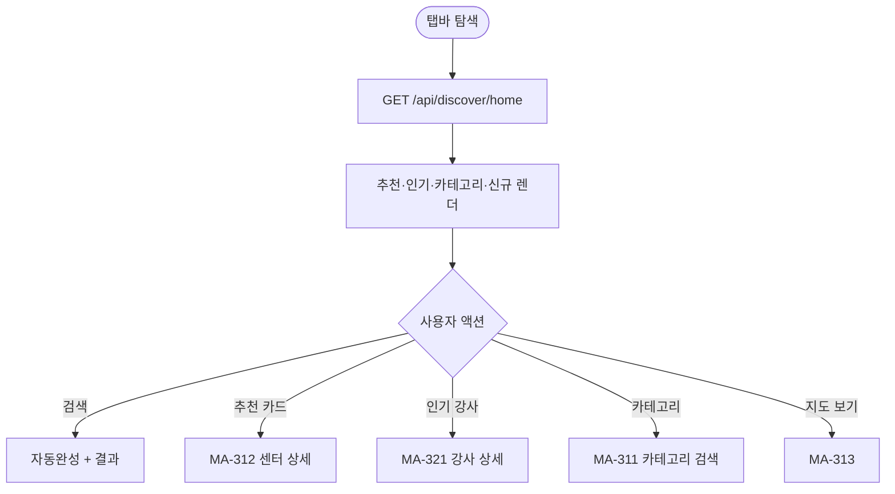
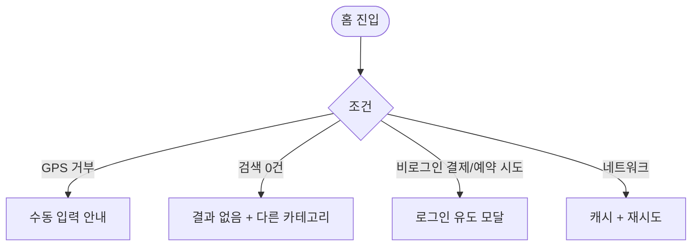

# MA-300 탐색 홈 페이지

## 1. 화면 메타 정보

| 항목 | 값 |
|---|---|
| 작성일 / 버전 / 상태 | 2026-05-23 / v1.0 / 정합화 완료 |
| 도메인 | C04 탐색플랫폼 |
| 화면 ID | MA-300 |
| 화면명 | 탐색 홈 |
| 화면 유형 | 풀스크린 (탭바 탐색) |
| 라우트 | `fitgenie://discover` |
| 우선순위 | P1 |
| 기능코드 | MFN-301 |
| 연계 화면 | MA-310 내 주변, MA-311 카테고리 검색, MA-312 센터 상세, MA-313 지도, MA-320 강사 둘러보기 |
| 호출 모달 | DLG 없음 (시트 + 인라인) |

## 2. 화면 개요와 목적

회원이 새로운 센터·강사·상품을 발견하는 마켓플레이스 진입 허브입니다. 비로그인 사용자도 진입 가능하지만 결제·예약·스크랩·메신저는 로그인 필수입니다. 회원앱 자체 신규 도메인이며 CRM 매핑 도메인이 없습니다.

## 3. 진입 경로와 인접 화면

진입: 탭바 탐색, 외부 공유 딥링크, 검색 엔진 결과.

인접: 카드 탭 시 MA-312 센터 상세, MA-321 강사 상세. 카테고리 → MA-311. 지도 → MA-313.

## 4. 레이아웃과 UI 구성

- **상단 검색창**: 센터·강사·종목 통합 검색
- **추천 센터 캐로셀**: 가까운 인기 센터 5~10개
- **인기 강사 캐로셀**: 평점 4.5+ 강사
- **카테고리 바로가기 (14종)**: 헬스·요가·필라테스·골프 등
- **근처 신규 센터**: 최근 3개월 오픈
- **하단 [지도로 보기]**: MA-313 진입

## 5. 탭 구성과 탭별 동작

탭 없음.

## 6. 버튼·아이콘·링크 액션 전체 정의

- **검색창**: 키패드 활성 + 자동완성 + 최근 검색 표시
- **추천/인기 카드**: 센터·강사 상세 진입
- **카테고리 바로가기**: MA-311 진입 (카테고리 자동 적용)
- **[지도로 보기]**: MA-313

## 7. 호출되는 모달 동작

검색 자동완성은 인라인 시트.

## 8. 토스트와 확인 팝업과 알럿

성공: 없음 (조회). 실패: "검색 결과가 없어요" + 다른 카테고리 추천.

## 9. 데이터 흐름과 외부 연동

**탐색 홈 API**: `GET /api/discover/home?lat=&lng=` → 추천 센터·강사·카테고리 + 위치 기반 신규 센터. 5분 캐시.

**위치 기반**: GPS 권한 허용 시 사용. 거부 시 수동 입력 fallback.

**비로그인 추적**: 로그인 사용자는 회원 기반 추천, 비로그인은 위치·검색 이력 기반.

## 10. 화면 상태와 예외 처리

| 상태 | 설명 |
|---|---|
| 정상 | 추천·인기·카테고리·신규 정상 |
| GPS 권한 거부 | 수동 입력 안내 |
| 검색 결과 0건 | "결과가 없어요" + 다른 카테고리 추천 |
| 비로그인 | 일반 추천 (회원 기반 X) |

예외: 데이터 로딩 실패 시 캐시 + 재시도. 14개 카테고리 외 카테고리는 자동 숨김.

## 11. 권한별 처리

`member` 가능. 비로그인 진입 허용. 다른 직원 role은 본 화면 미접근 (각자 홈 사용).

## 12. 메인 흐름

## 13. 에러와 예외 흐름

## 14. 핵심 디자인 요청사항

- 검색창은 상단 고정
- 캐로셀은 가로 스와이프 + 1개 부분 보이기
- 카테고리 14종은 그리드 또는 가로 스크롤
- 다크 모드 대응

## 15. 운영 정책

**비로그인 진입 허용**: 탐색 홈·검색·카테고리·센터 상세·강사 상세까지 비로그인 진입 가능. 결제·예약·스크랩·메신저·리뷰는 로그인 필수.

**위치 기반 검색**: GPS 권한 허용 시 사용. 데이터 저장 없이 검색 시점에만 사용.

**카테고리 14종**: 본사 관리 + 회원앱 자체 추가는 슈퍼관리자만.

**5분 캐시**: 잦은 호출 방지.

이상의 모든 정책은 본 화면을 구현·운영하는 사람이 별도 문서 없이 이 한 장만 보면 이해할 수 있도록 풀어 적었습니다.
