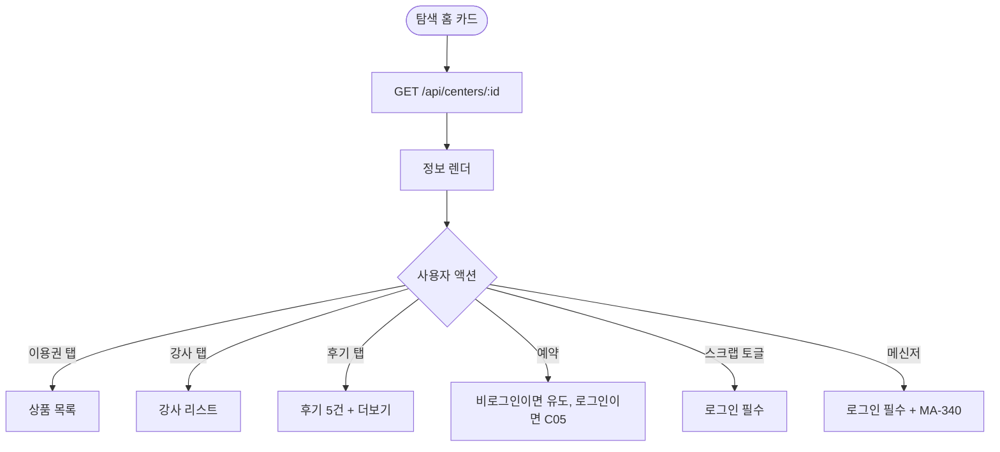
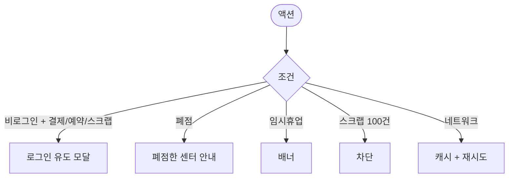

# MA-312 센터 상세 (마켓플레이스) 페이지

## 1. 화면 메타 정보

| 항목 | 값 |
|---|---|
| 작성일 / 버전 / 상태 | 2026-05-23 / v1.0 / 정합화 완료 |
| 도메인 | C04 탐색플랫폼 |
| 화면 ID | MA-312 |
| 화면명 | 센터 상세 (마켓) |
| 화면 유형 | 풀스크린 (이미지 + 정보) |
| 라우트 | `fitgenie://center/:centerId` |
| 우선순위 | P1 |
| 기능코드 | MFN-305 |
| 연계 화면 | MA-300 탐색 홈, MA-321 강사 상세, MA-350 센터 리뷰, MA-330 스크랩, MA-340 메신저, C05 결제 흐름 |
| 호출 모달 | 로그인 유도 모달 (비로그인 액션 시) |

## 2. 화면 개요와 목적

회원이 특정 센터의 상세 정보·이용권 상품·강사 리스트·후기·운영시간·위치를 한 화면에서 확인하고 예약·결제·스크랩·메신저로 진입하는 화면입니다. 비로그인 사용자도 조회 가능합니다.

## 3. 진입 경로와 인접 화면

진입: MA-300 추천 카드, MA-310 내 주변, MA-311 카테고리 검색, MA-313 지도 핀, 외부 공유 딥링크.

인접: 강사명 → MA-321, 후기 작성 → MA-350, [예약] → C05, [메신저] → MA-340, [스크랩] 토글 → MA-330.

## 4. 레이아웃과 UI 구성

- **이미지 갤러리**: 상단 가로 슬라이드 (시설·내부·운동 사진)
- **센터 카드**: 이름·평점·거리·카테고리·운영시간·전화·주소
- **이용권 상품 목록**: PT/회원권/락커/운동복 등 종류별
- **강사 리스트**: 사진·이름·평점·전문 분야
- **후기 카드 5건 + 전체 보기**: 별점 + 후기 텍스트
- **지도 위치**: 작은 지도 + 길찾기 링크
- **하단 액션**: [예약]·[스크랩 토글]·[메신저]·[공유]

## 5. 탭 구성과 탭별 동작

이용권 / 강사 / 후기 / 위치 4탭 (이용권 기본).

## 6. 버튼·아이콘·링크 액션 전체 정의

- **이미지 갤러리 탭**: 라이트박스 확대
- **이용권 카드 탭**: 상세 + 결제 진입
- **강사 카드 탭**: MA-321 강사 상세
- **후기 더보기**: MA-350 센터 리뷰
- **[스크랩 토글]**: 비로그인이면 로그인 유도, 로그인이면 즉시 토글
- **[메신저]**: 비로그인 유도, 로그인이면 MA-340 진입
- **[예약]**: C05 결제 흐름 진입
- **[공유]**: OS 공유 시트

## 7. 호출되는 모달 동작

**로그인 유도 모달**: 비로그인 사용자가 결제·예약·스크랩·메신저·리뷰 시도 시.

## 8. 토스트와 확인 팝업과 알럿

성공: "스크랩에 추가했어요", "메시지를 보냈어요". 실패: "스크랩은 최대 100건", "이용권을 구매한 회원만 후기 작성".

## 9. 데이터 흐름과 외부 연동

**센터 상세 API**: `GET /api/centers/:id` → 센터 정보 + 이용권 + 강사 + 후기 요약. 5분 캐시.

**스크랩 토글**: `POST /api/scraps` / `DELETE /api/scraps/:id`.

**메신저**: `POST /api/messages` (centerId + content).

**예약 진입**: C05 결제 흐름 (이용권 선택 후 결제).

**비로그인 시 결제·예약·스크랩 시도**: 로그인 유도 모달 + 본 화면으로 복귀.

## 10. 화면 상태와 예외 처리

| 상태 | 설명 |
|---|---|
| 정상 | 정보 정상 표시 |
| 비로그인 + 결제 시도 | 로그인 유도 모달 |
| 폐점 센터 | "폐점한 센터입니다" + 회색 |
| 임시휴업 | "임시휴업 중" 배너 |
| 후기 0건 | "아직 후기가 없어요" |

예외: 스크랩 100건 초과 시 차단. 메시지 부적절 자동 필터.

## 11. 권한별 처리

`member` 가능. 비로그인 진입 가능 (조회만). 직원 role은 본 화면 미진입.

## 12. 메인 흐름

## 13. 에러와 예외 흐름

## 14. 핵심 디자인 요청사항

- 이미지 갤러리는 자동 슬라이드 + 인디케이터
- 별점은 큰 글씨 + 후기 수
- 4탭은 sticky (스크롤 시 상단 고정)

## 15. 운영 정책

**비로그인 진입 허용**: 조회만 가능. 결제·예약·스크랩·메신저·리뷰는 로그인 유도.

**스크랩 정책**: 회원당 최대 100건. 폐점·만료 상품은 자동 비활성.

**메신저 정책**: 24시간 미응답 시 운영자 알림. 부적절 자동 필터.

**리뷰 정책**: 실제 이용권 구매·완료 회원만 작성 가능. 신고 3건 자동 숨김.

**5분 캐시 + 풀투리프레시**.

이상의 모든 정책은 본 화면을 구현·운영하는 사람이 별도 문서 없이 이 한 장만 보면 이해할 수 있도록 풀어 적었습니다.
