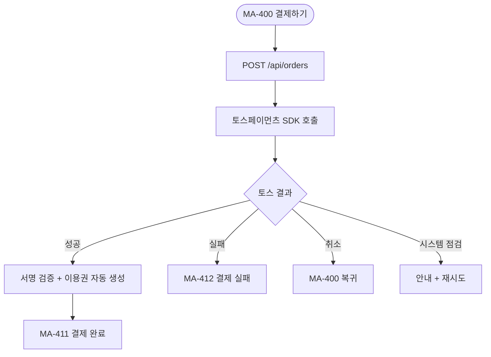
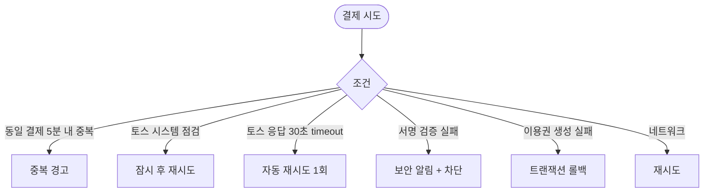

# MA-410 토스페이먼츠 결제 페이지

## 1. 화면 메타 정보

| 항목 | 값 |
|---|---|
| 작성일 / 버전 / 상태 | 2026-05-23 / v1.0 / 정합화 완료 |
| 도메인 | C05 결제주문 |
| 화면 ID | MA-410 |
| 화면명 | 토스페이먼츠 결제 |
| 화면 유형 | 외부 SDK 호출 (인앱 WebView 또는 네이티브 모듈) |
| 라우트 | `fitgenie://payment/:orderId` |
| 우선순위 | P0 |
| 기능코드 | MFN-410 |
| 연계 화면 | MA-400 결제 옵션, MA-411 결제 완료, MA-412 결제 실패 |
| 호출 모달 | 토스페이먼츠 SDK 모달 |

## 2. 화면 개요와 목적

토스페이먼츠 SDK를 호출하여 회원이 카드·계좌이체·간편결제로 실제 결제를 수행하는 화면입니다. PAY-01 직접 결제 채널이며, PAY-06 결제링크는 docs2 _정책미확정 정합으로 본 도메인에서 노출하지 않습니다.

## 3. 진입 경로와 인접 화면

진입: MA-400 결제 옵션 선택 후 [결제하기], C04 마켓플레이스에서 [예약/결제], 자동결제 진입.

인접: 성공 시 MA-411 결제 완료, 실패 시 MA-412 결제 실패.

## 4. 레이아웃과 UI 구성

본 화면은 토스페이먼츠 SDK 모달 호출 화면이므로 자체 UI 없음. SDK 응답 처리 + 진행률 + 결과 분기만 담당.

- **상단 헤더 (간단)**: "결제 진행 중"
- **결제 요약**: 상품·금액·할인·최종 결제액
- **토스페이먼츠 호출**: SDK 모달 자동 호출
- **로딩 인디케이터**: 응답 대기

## 5. 탭 구성과 탭별 동작

탭 없음.

## 6. 버튼·아이콘·링크 액션 전체 정의

- **결제 진행 자동**: 화면 진입 즉시 SDK 호출
- **취소 (사용자)**: 토스 SDK 내 취소 → MA-400 복귀
- **결과 콜백**: 성공 → MA-411, 실패 → MA-412

## 7. 호출되는 모달 동작

토스페이먼츠 SDK 모달 (외부). 모바일 결제 페이지 또는 인앱 결제.

## 8. 토스트와 확인 팝업과 알럿

성공 / 실패는 MA-411 / MA-412에서 처리. 본 화면은 로딩만.

## 9. 데이터 흐름과 외부 연동

**결제 시작 API**: `POST /api/orders` → 주문 생성 + 결제 URL/billingKey 반환.

**토스페이먼츠 SDK 호출**: 결제 URL 또는 billingKey로 SDK 모달 호출.

**결제 결과 콜백**: 토스 서명 검증 + 백엔드 검증 + 이용권 자동 생성 (D05 정합).

**5초 이내 CRM 매출 카드 갱신** (docs2 SCR-S001 정합).

**감사 로그**: 결제 시작·성공·실패·이용권 생성 모두 docs2 SCR-097 비동기 INSERT.

## 10. 화면 상태와 예외 처리

| 상태 | 설명 |
|---|---|
| 대기 | 주문 생성 중 |
| 결제 진행중 | 토스 SDK 모달 활성 |
| 성공 | MA-411 자동 진입 |
| 실패 | MA-412 자동 진입 |
| 취소 | MA-400 복귀 |
| 토스 시스템 점검 | "잠시 후 다시 시도해주세요" |
| 30초 timeout | 자동 재시도 1회 |

예외: 동일 회원·금액 5분 이내 재결제 시도 → 중복 경고. 이용권 자동 생성 실패 시 트랜잭션 롤백. 토스 서명 검증 실패 시 보안 알림.

## 11. 권한별 처리

`member` 본인 결제만 가능. 직원 role은 본 화면 미접근.

## 12. 메인 흐름

## 13. 에러와 예외 흐름

## 14. 핵심 디자인 요청사항

- 진행 중 로딩은 부드러운 스피너
- 결과 분기 화면은 즉시 전환
- 결제 요약은 작은 카드로 컴팩트

## 15. 운영 정책

**결제 수단 (docs2 D03 PAY-01 정합)**: 토스페이먼츠 (카드/계좌이체/간편결제). 한국 시장 전용.

**결제 완료 후 이용권 자동 생성**: docs2 D05 정합. 즉시 활성화.

**5초 이내 CRM 매출 카드 갱신** (docs2 SCR-S001 정합).

**중복 결제 방지**: 동일 회원·금액 5분 이내 멱등성 키 + 중복 경고.

**PAY-06 결제링크 미노출**: docs2 _정책미확정 정합. 고객사 확인 후에만.

**보안 정책**: 카드 정보는 회원앱에 저장하지 않음 (토스 빌링키만 보관). 토스 서명 검증 필수.

**감사 로그**: 모든 결제 이벤트 docs2 SCR-097 INSERT.

이상의 모든 정책은 본 화면을 구현·운영하는 사람이 별도 문서 없이 이 한 장만 보면 이해할 수 있도록 풀어 적었습니다.
