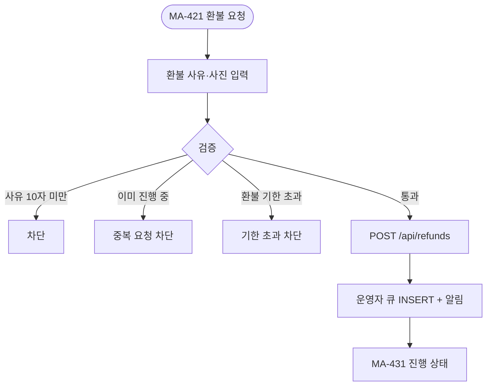
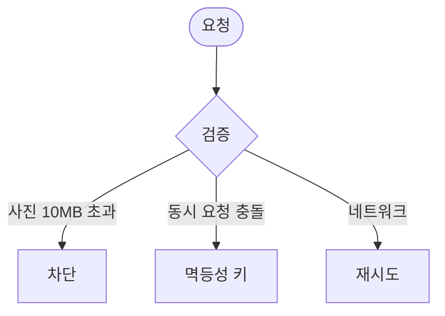

# MA-430 환불 요청 페이지

## 1. 화면 메타 정보

| 항목 | 값 |
|---|---|
| 작성일 / 버전 / 상태 | 2026-05-23 / v1.0 / 정합화 완료 |
| 도메인 | C05 결제주문 |
| 화면 ID | MA-430 |
| 화면명 | 환불 요청 |
| 화면 유형 | 풀스크린 (폼) |
| 라우트 | `fitgenie://refund/:paymentId` |
| 우선순위 | P1 |
| 기능코드 | MFN-430 |
| 연계 화면 | MA-421 주문 상세, MA-431 환불 진행 상태 |
| 호출 모달 | 환불 확인 모달 |

## 2. 화면 개요와 목적

회원이 본인 결제 건에 대해 환불을 요청하는 화면입니다. 환불 자동 계산 산식은 docs2 _정책미확정으로 v1에서는 회원이 사유만 입력하고, CRM Owner(지점장)/매니저가 수기로 환불 금액·위약금을 산정 + 승인합니다.

## 3. 진입 경로와 인접 화면

진입: MA-421 주문 상세의 [환불 요청] 버튼, 푸시 알림 딥링크.

인접: 요청 완료 → MA-431 진행 상태, 운영자 승인 후 결과 알림.

## 4. 레이아웃과 UI 구성

- **상단 헤더**: "환불 요청" + 닫기 X
- **결제 정보 카드**: 결제일·상품·금액·결제 수단
- **환불 사유**: 자유 텍스트 (최소 10자, 최대 500자)
- **사진 첨부 (선택)**: 최대 3장 (10MB 이내)
- **환불 안내 배너**: "사용분 차감·위약금은 운영자가 산정한 후 승인됩니다"
- **하단 [요청] / [취소]**

## 5. 탭 구성과 탭별 동작

탭 없음.

## 6. 버튼·아이콘·링크 액션 전체 정의

- **환불 사유 입력**: 10자 미만 차단
- **사진 첨부**: 사진 선택 (jpg/png/webp, 10MB 이내)
- **[요청]**: `POST /api/refunds` → 운영자 큐 INSERT + 회원 알림
- **[취소]**: 입력 있으면 확인 모달

## 7. 호출되는 모달 동작

**환불 확인 모달**: "환불을 요청하시겠어요?" + 안내.

## 8. 토스트와 확인 팝업과 알럿

성공: "환불 요청이 접수되었습니다" (정보). 실패: "사유를 자세히 입력해주세요"(10자 미만), "이미 환불 진행 중"(중복), "환불 가능 기한 초과".

## 9. 데이터 흐름과 외부 연동

**환불 요청 API**: `POST /api/refunds` (paymentId + reason + photos).

**운영자 큐**: docs2 D03 SCR-S007 환불 관리에 INSERT + Owner(지점장)/매니저 알림.

**환불 자동 계산**: docs2 _정책미확정으로 v1에서는 운영자 수기 입력. 향후 자동화 산식 별도 확정.

**감사 로그**: 환불 요청·승인·거절·완료 모두 docs2 SCR-097 비동기 INSERT.

## 10. 화면 상태와 예외 처리

| 상태 | 설명 |
|---|---|
| 입력 중 | 폼 미완료 |
| 요청 중 | 버튼 로딩 |
| 요청 완료 | 성공 토스트 + MA-431 이동 |
| 중복 요청 | "이미 환불 진행 중" |
| 환불 기한 초과 | "환불 가능 기한 초과" 차단 |

예외: 사진 10MB 초과 차단. 부적절 사진 자동 필터. 동시 요청 충돌 방지.

## 11. 권한별 처리

`member` 본인 결제 건만 환불 요청 가능. 직원 role은 본 화면 미접근.

## 12. 메인 흐름

## 13. 에러와 예외 흐름

## 14. 핵심 디자인 요청사항

- 환불 사유 입력은 큰 textarea
- 사진 첨부는 작은 카드형
- 안내 배너는 노랑 톤

## 15. 운영 정책

**환불 정책 (docs2 D03 정합)**: 회원 요청 + Owner(지점장)/매니저 승인 후 처리. 무분별한 환불 방지.

**환불 자동 계산 (docs2 _정책미확정)**: v1은 수기 입력 + 운영자 승인. 향후 자동화 산식 확정 필요.

**감사 로그**: 모든 환불 이벤트 docs2 SCR-097 INSERT.

**본인 인증**: 환불 요청은 본인만 가능 (앱 비밀번호 또는 생체 인증).

이상의 모든 정책은 본 화면을 구현·운영하는 사람이 별도 문서 없이 이 한 장만 보면 이해할 수 있도록 풀어 적었습니다.
