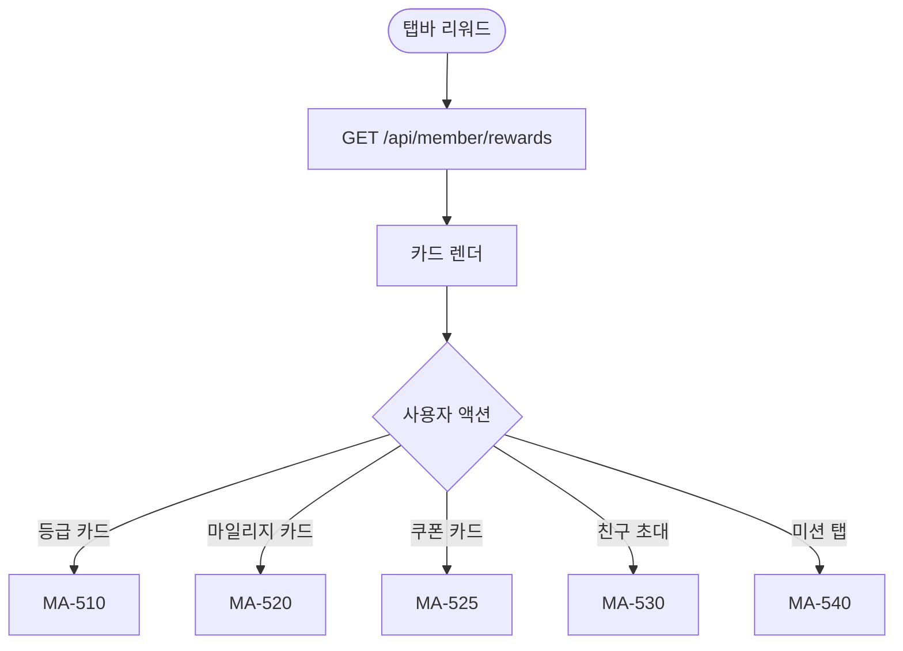
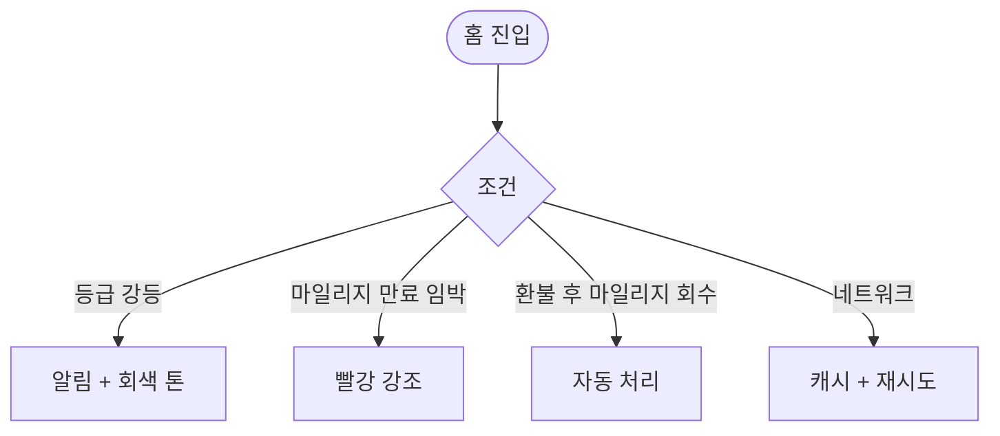

# MA-500 리워드 센터 페이지

## 1. 화면 메타 정보

| 항목 | 값 |
|---|---|
| 작성일 / 버전 / 상태 | 2026-05-23 / v1.0 / 정합화 완료 |
| 도메인 | C06 리워드활동 |
| 화면 ID | MA-500 |
| 화면명 | 리워드 센터 (홈) |
| 화면 유형 | 풀스크린 |
| 라우트 | `fitgenie://rewards` |
| 우선순위 | P1 |
| 기능코드 | MFN-500 |
| 연계 화면 | MA-510 등급 상세, MA-520 마일리지, MA-525 쿠폰함, MA-530 친구 초대, MA-540 활동/미션 |
| 호출 모달 | DLG 없음 (시트 + 인라인) |

## 2. 화면 개요와 목적

회원의 멤버십 등급·잔여 마일리지·쿠폰·친구 초대·미션 진행을 통합 표시하는 충성도(loyalty) 허브 화면입니다. docs2 D02 M009 등급 정본 + D08 마일리지/쿠폰 정본을 단순 표시합니다.

## 3. 진입 경로와 인접 화면

진입: 탭바 또는 MY 메뉴에서 진입, 푸시 알림.

인접: 등급 상세 → MA-510, 마일리지 → MA-520, 쿠폰함 → MA-525, 친구 초대 → MA-530, 미션 → MA-540.

## 4. 레이아웃과 UI 구성

- **등급 카드 (큰 카드)**: 현재 등급·다음 등급까지 게이지·등급 혜택 요약
- **마일리지 카드**: 잔여 마일리지·만료 임박 마일리지
- **쿠폰 카드**: 보유 쿠폰 N장·만료 임박 N장
- **친구 초대 카드**: 진행 중 친구 수·받은 보상
- **활동 미션**: 이번 달 미션 3~5개 (진행률 게이지)
- **하단 [활동 통계]**: MA-550 진입

## 5. 탭 구성과 탭별 동작

탭 없음.

## 6. 버튼·아이콘·링크 액션 전체 정의

- **등급 카드 탭**: MA-510 등급 상세
- **마일리지 카드 탭**: MA-520
- **쿠폰 카드 탭**: MA-525
- **친구 초대 카드 탭**: MA-530
- **미션 항목 탭**: MA-540 상세 (진행률 및 보상)

## 7. 호출되는 모달 동작

본 화면은 모달 없음.

## 8. 토스트와 확인 팝업과 알럿

성공: 미션 완료 시 "보상을 받았어요!" (자동). 등급 변경 시 "{등급}으로 승급했어요!". 실패: 데이터 로딩 실패 + 재시도.

## 9. 데이터 흐름과 외부 연동

**리워드 홈 API**: `GET /api/member/rewards` (등급·마일리지·쿠폰·친구·미션 통합). 5분 캐시.

**등급 자동 재산정 (docs2 D02 M009)**: 매월 1일 04:00 → 등급 변경 시 푸시 발송.

**마일리지 적립**: 결제 완료 즉시 1% (센터 설정) 자동 적립.

**미션 완료 → 보상 지급**: 미션 완료 즉시 마일리지/쿠폰 자동 지급.

**친구 초대 보상**: 친구 첫 정상 결제 완료 시 자동 지급.

## 10. 화면 상태와 예외 처리

| 상태 | 설명 |
|---|---|
| 정상 | 카드 정상 표시 |
| 미션 0개 | "이번 달 미션이 없어요" |
| 등급 승급 임박 | 노랑 강조 |
| 마일리지 만료 임박 | 빨강 강조 |

예외: 데이터 로딩 실패 시 캐시. 환불 시 마일리지 자동 회수.

## 11. 권한별 처리

`member` 본인 리워드만 표시. 다른 role 미접근.

## 12. 메인 흐름

## 13. 에러와 예외 흐름

## 14. 핵심 디자인 요청사항

- 등급 카드는 큰 영역 + 등급 색상 (브론즈 갈색·실버 은색·골드 금색·플래티넘 보라·다이아몬드 다이아색)
- 게이지는 다음 등급까지 진행률
- 마일리지 만료 임박은 D-day 표시

## 15. 운영 정책

**등급 5단계 (docs2 D02 M009 정본)**: 브론즈/실버/골드/플래티넘/다이아몬드. 매월 1일 자동 재산정.

**마일리지 (docs2 D08 정합)**: 1% 적립 (센터 설정), 1년 만료, 만료 30일 전 알림.

**쿠폰 (docs2 D08 정합)**: 결제 시 1장만 적용. 만료 7일 전 알림.

**친구 초대 보상**: 친구 첫 정상 결제 완료 시 지급. 회원당 최대 100명 초대.

**미션**: 매월 1일 신규 생성. 완료 즉시 보상 자동 지급.

이상의 모든 정책은 본 화면을 구현·운영하는 사람이 별도 문서 없이 이 한 장만 보면 이해할 수 있도록 풀어 적었습니다.
