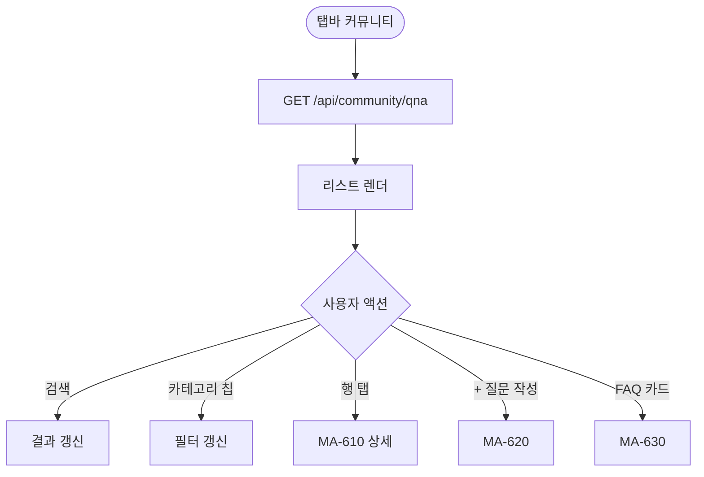
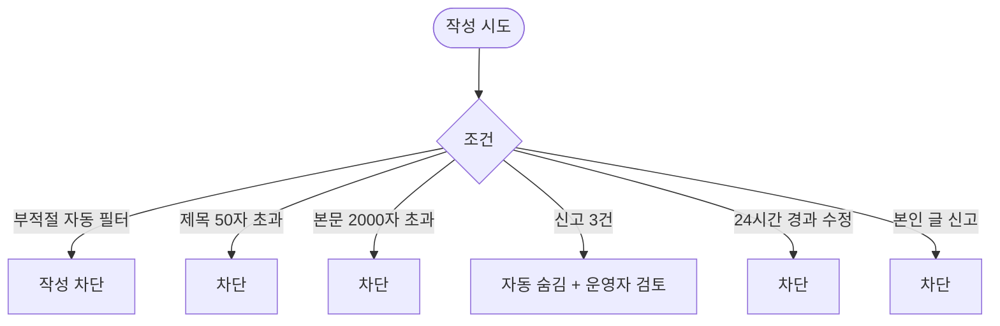

# MA-600 커뮤니티 홈 페이지

## 1. 화면 메타 정보

| 항목 | 값 |
|---|---|
| 작성일 / 버전 / 상태 | 2026-05-23 / v1.0 / 정합화 완료 |
| 도메인 | C07 커뮤니티 |
| 화면 ID | MA-600 |
| 화면명 | 커뮤니티 홈 |
| 화면 유형 | 풀스크린 (Q&A 리스트) |
| 라우트 | `fitgenie://community` |
| 우선순위 | P2 |
| 기능코드 | MFN-600 |
| 연계 화면 | MA-601 Q&A 목록, MA-610 Q&A 상세, MA-620 Q&A 작성, MA-630 FAQ, MA-640 신고 관리 |
| 호출 모달 | 카테고리 선택 시트 |

## 2. 화면 개요와 목적

회원이 공개 Q&A·FAQ를 통해 운동·식단·이용권·시설 질문을 주고받는 커뮤니티 허브 화면입니다. 회원앱 자체 신규 도메인이며 신고 자동 숨김으로 안전한 커뮤니티를 유지합니다.

## 3. 진입 경로와 인접 화면

진입: 탭바 또는 MY 메뉴, 외부 공유 딥링크.

인접: Q&A 목록 → MA-601, 상세 → MA-610, 작성 → MA-620, FAQ → MA-630, 본인 활동 → MA-650.

## 4. 레이아웃과 UI 구성

- **상단 헤더**: "커뮤니티" + 검색
- **카테고리 칩 5종**: 운동·식단·이용권·시설·기타
- **인기 질문 캐로셀**: 좋아요·답변 수 기준
- **내가 작성한 글 미리보기**: 본인 활동 카드
- **FAQ 진입 카드**: MA-630
- **Q&A 리스트**: 최신순·인기순 토글 + 답변 상태 배지
- **하단 [+ 질문 작성]**: 플로팅 버튼 (FAB)

## 5. 탭 구성과 탭별 동작

최신 / 인기 2탭 또는 정렬 토글.

## 6. 버튼·아이콘·링크 액션 전체 정의

- **검색**: 제목·태그·작성자 검색
- **카테고리 칩**: 다중 선택 가능
- **인기 질문 카드**: MA-610 진입
- **Q&A 리스트 행**: MA-610 진입
- **[+ 질문 작성]**: MA-620 진입
- **FAQ 카드**: MA-630

## 7. 호출되는 모달 동작

카테고리 선택은 시트로 처리.

## 8. 토스트와 확인 팝업과 알럿

성공: "질문이 등록되었어요" (MA-620 완료 후). 실패: "부적절한 표현이 포함되어 있어요"(필터), "신고가 접수되었어요".

## 9. 데이터 흐름과 외부 연동

**Q&A 목록 API**: `GET /api/community/qna?category=&sort=`. 5분 캐시.

**부적절 자동 필터**: 작성 시 패턴 매칭 + 자동 차단.

**신고 자동 숨김**: 3건 누적 시 자동 숨김 + docs2 D10 운영자 알림 (NFR-19).

**24시간 수정 만료**: 작성 후 24시간 이후 수정·삭제 잠금.

## 10. 화면 상태와 예외 처리

| 상태 | 설명 |
|---|---|
| 정상 | Q&A 리스트 |
| Q&A 0건 | "아직 질문이 없어요. 첫 질문을 등록해보세요" |
| 검색 결과 0건 | "검색 결과 없음" |
| 자동 숨김된 질문 | "검토 대기" 라벨 |

예외: 신고 3건 자동 숨김, 부적절 자동 필터, 본인 글 신고 차단.

## 11. 권한별 처리

`member`·`trainer`·`golf_trainer`·`fc`·`staff` 모두 작성·답변 가능. 답변자 역할 배지 3종 (회원/강사/운영자) 표시. FAQ 작성은 CRM 관리자만.

## 12. 메인 흐름

## 13. 에러와 예외 흐름

## 14. 핵심 디자인 요청사항

- Q&A 카드는 좋아요·답변 수 강조
- 인기 질문은 가로 캐로셀
- FAB는 우하단 고정
- 신고됨/자동 숨김은 회색 + 라벨

## 15. 운영 정책

**Q&A 정책**: 제목 1~50자, 본문 1~2000자, 사진 최대 5장 (각 10MB).

**카테고리 5종**: 운동·식단·이용권·시설·기타.

**부적절 자동 필터**: 욕설 패턴 매칭 + 작성 차단.

**신고 자동 숨김**: 3건 누적 → 자동 숨김 + docs2 D10 운영자 검토.

**24시간 수정 만료**: 작성 후 24시간 이후 수정·삭제 잠금.

**감사 로그**: 신고·숨김·삭제 모두 docs2 SCR-097 INSERT.

이상의 모든 정책은 본 화면을 구현·운영하는 사람이 별도 문서 없이 이 한 장만 보면 이해할 수 있도록 풀어 적었습니다.
