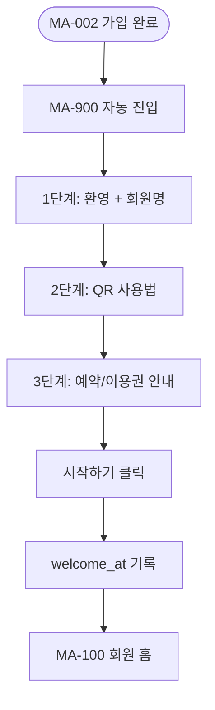
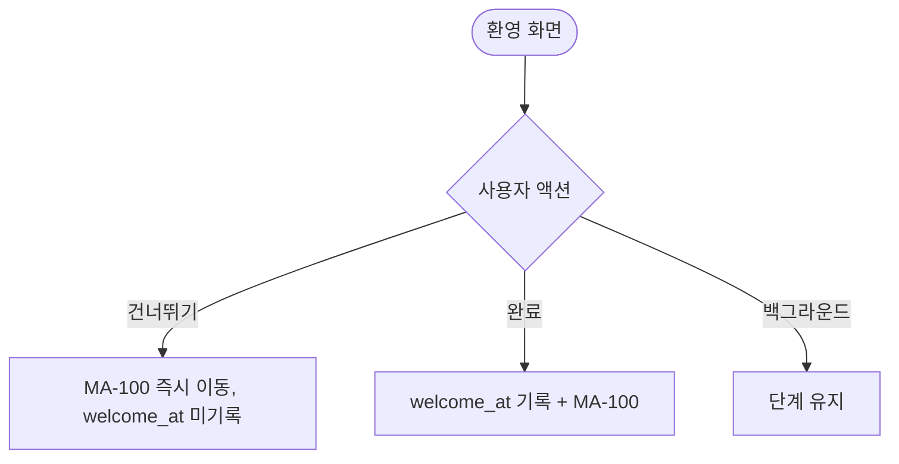

# MA-900 신규 회원 환영 페이지

## 1. 화면 메타 정보

| 항목 | 값 |
|---|---|
| 작성일 / 버전 / 상태 | 2026-05-23 / v1.0 / 정합화 완료 |
| 도메인 | C08 시스템공통 |
| 화면 ID | MA-900 |
| 화면명 | 신규 회원 환영 |
| 화면 유형 | 풀스크린 (3단계 캐로셀) |
| 라우트 | 첫 가입 직후 자동 진입 |
| 우선순위 | P1 |
| 기능코드 | MFN-900 |
| 연계 화면 | MA-002 앱 가입/연동, MA-100 회원 홈, MA-110 QR |
| 호출 모달 | DLG 없음 (풀스크린 캐로셀) |

## 2. 화면 개요와 목적

회원이 MA-002 앱 가입/연동을 완료한 직후 자동으로 표시되는 환영 화면입니다. 회원명·등급·앱 사용 가이드를 3단계 캐로셀로 안내하고 첫 QR 입장 또는 홈 진입을 유도합니다.

## 3. 진입 경로와 인접 화면

진입: MA-002 가입 완료 직후 자동, 또는 설정에서 "환영 화면 다시 보기".

인접: 완료 후 MA-100 회원 홈 자동 진입.

## 4. 레이아웃과 UI 구성

- **3단계 캐로셀**:
  1. 환영 + 회원명 + 등급 카드
  2. QR 입장 사용법 (이미지 + 짧은 가이드)
  3. 수업 예약·이용권 조회 안내
- **단계 인디케이터**: 3점 dot
- **하단 [다음] / [시작하기]** (마지막 단계)
- **상단 [건너뛰기]**: 즉시 홈 진입

## 5. 탭 구성과 탭별 동작

탭 없음. 스와이프 또는 [다음] 버튼.

## 6. 버튼·아이콘·링크 액션 전체 정의

- **[다음]**: 다음 단계로 이동
- **스와이프**: 다음/이전 단계
- **[건너뛰기]**: 즉시 MA-100 진입
- **[시작하기]** (마지막 단계): MA-100 진입 + welcome_at 기록

## 7. 호출되는 모달 동작

본 화면은 모달 없음.

## 8. 토스트와 확인 팝업과 알럿

성공: 환영 토스트 (첫 진입 시).

## 9. 데이터 흐름과 외부 연동

**`welcome_at` 기록**: 첫 시작 시 백엔드에 타임스탬프 INSERT (한 번만 표시되도록).

**다시 보기**: 설정(MA-155)에서 "환영 화면 다시 보기" 옵션 제공.

## 10. 화면 상태와 예외 처리

| 상태 | 설명 |
|---|---|
| 정상 | 3단계 캐로셀 |
| 다시 보기 | 설정에서 진입 시 표시 |

예외: 백그라운드 전환 시 단계 유지. 캐로셀 끝까지 보지 않고 [건너뛰기] 시 welcome_at 미기록 (다음 진입 시 다시 표시 가능).

## 11. 권한별 처리

`member`만 진입. 직원 가입 시에는 별도의 직원 환영 화면 또는 즉시 강사·FC·스태프 홈 진입.

## 12. 메인 흐름

## 13. 에러와 예외 흐름

## 14. 핵심 디자인 요청사항

- 캐로셀은 큰 일러스트 + 짧은 텍스트
- 단계 인디케이터는 하단 점 3개
- 다크 모드 대응
- 접근성: 단계별 음성 안내

## 15. 운영 정책

**첫 진입 정책**: 가입 완료 직후 한 번만 자동 표시 (welcome_at 기준).

**다시 보기**: 설정에서 옵션 제공.

**개인화**: 회원명·등급·운동 목표(온보딩 설문 입력값)에 따라 캐로셀 내용 일부 변경.

이상의 모든 정책은 본 화면을 구현·운영하는 사람이 별도 문서 없이 이 한 장만 보면 이해할 수 있도록 풀어 적었습니다.
