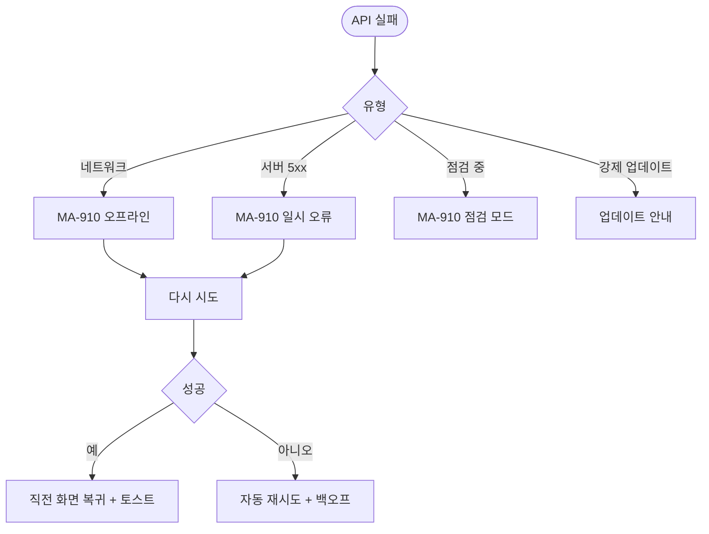
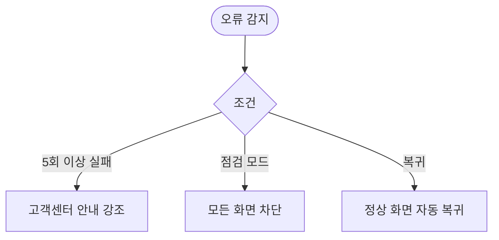

# MA-910 네트워크 오류/시스템 점검 페이지

## 1. 화면 메타 정보

| 항목 | 값 |
|---|---|
| 작성일 / 버전 / 상태 | 2026-05-23 / v1.0 / 정합화 완료 |
| 도메인 | C08 시스템공통 |
| 화면 ID | MA-910 |
| 화면명 | 네트워크 오류 / 시스템 점검 |
| 화면 유형 | 풀스크린 오류 (전역) |
| 라우트 | 자동 인터셉트 (모든 화면에서 fallback) |
| 우선순위 | P0 |
| 기능코드 | MFN-910 |
| 연계 화면 | 모든 회원앱 화면 |
| 호출 모달 | DLG 없음 |

## 2. 화면 개요와 목적

회원앱이 인터넷 연결 실패·서버 5xx·점검 중 상황을 감지했을 때 표시되는 전역 fallback 화면입니다. 일관된 안내·재시도 액션을 제공하여 회원이 앱 사용을 포기하지 않도록 합니다.

## 3. 진입 경로와 인접 화면

진입: 모든 화면에서 네트워크/서버 오류 감지 시 자동.

인접: 재시도 → 직전 화면 복귀.

## 4. 레이아웃과 UI 구성

- **상단 일러스트**: 오프라인/점검 아이콘
- **제목**: "네트워크가 연결되지 않았어요" / "잠시 점검 중이에요"
- **부제**: 오류 코드 + 권장 행동
- **[다시 시도]**: 동일 요청 재실행
- **[홈으로]**: MA-100 진입
- **[고객센터 문의]**: MA-152 진입
- **상태바**: WiFi/셀룰러 상태 아이콘

## 5. 탭 구성과 탭별 동작

탭 없음.

## 6. 버튼·아이콘·링크 액션 전체 정의

- **[다시 시도]**: 마지막 요청 재실행 + 자동 인디케이터
- **[홈으로]**: MA-100 진입
- **[고객센터 문의]**: MA-152 진입
- **WiFi 설정 열기**: 디바이스 설정 딥링크

## 7. 호출되는 모달 동작

본 화면은 모달 없음.

## 8. 토스트와 확인 팝업과 알럿

복귀 시: "다시 연결되었어요" (정보 토스트).

## 9. 데이터 흐름과 외부 연동

**네트워크 모니터링**: 회원앱 전역 미들웨어가 connection state 감시.

**서버 상태 API**: `GET /api/health` (점검 모드 플래그 + 안내 메시지).

**점검 안내 메시지**: docs2 D10 운영자가 CRM에서 등록한 점검 공지 표시.

**자동 재시도**: 5초·15초·30초 지수 백오프.

## 10. 화면 상태와 예외 처리

| 상태 | 설명 |
|---|---|
| 네트워크 끊김 | "인터넷 연결을 확인해주세요" |
| 서버 5xx | "일시적인 오류" + 재시도 |
| 서버 점검 중 | "{시간}까지 점검 중입니다" + 운영자 메시지 |
| 클라이언트 버전 강제 업데이트 | 업데이트 안내 화면 |
| 복귀 | 자동 토스트 + 직전 화면 복귀 |

예외: 재시도 5회 이상 실패 시 고객센터 안내 강조. 점검 모드는 모든 화면 차단 (가입/로그인 제외).

## 11. 권한별 처리

모든 role 동일 표시.

## 12. 메인 흐름

## 13. 에러와 예외 흐름

## 14. 핵심 디자인 요청사항

- 친근한 일러스트 + 큰 [다시 시도] 버튼
- 다크 모드 대응
- 점검 모드는 차분한 톤
- 강제 업데이트는 빨강 톤

## 15. 운영 정책

**점검 공지 (docs2 D10 정합)**: 운영자가 CRM에서 점검 시작·종료 시간 등록 → 회원앱 자동 표시.

**자동 재시도 정책**: 5초·15초·30초 지수 백오프. 5회 초과 시 고객센터 안내 강조.

**강제 업데이트 정책**: 최소 지원 버전 미만 시 진입 차단 + 마켓 링크 (App Store / Google Play).

**감사 로그**: 점검 모드 ON/OFF, 강제 업데이트 발동 모두 docs2 SCR-097 INSERT.

**오프라인 캐시**: 마지막 회원 홈·QR·일정 데이터는 최대 24시간 캐시 표시 (Stale).

이상의 모든 정책은 본 화면을 구현·운영하는 사람이 별도 문서 없이 이 한 장만 보면 이해할 수 있도록 풀어 적었습니다.
