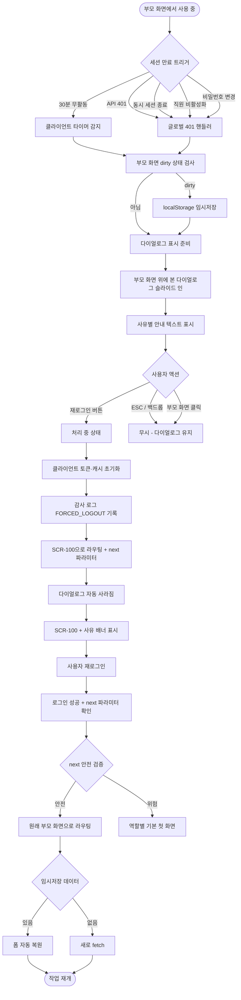
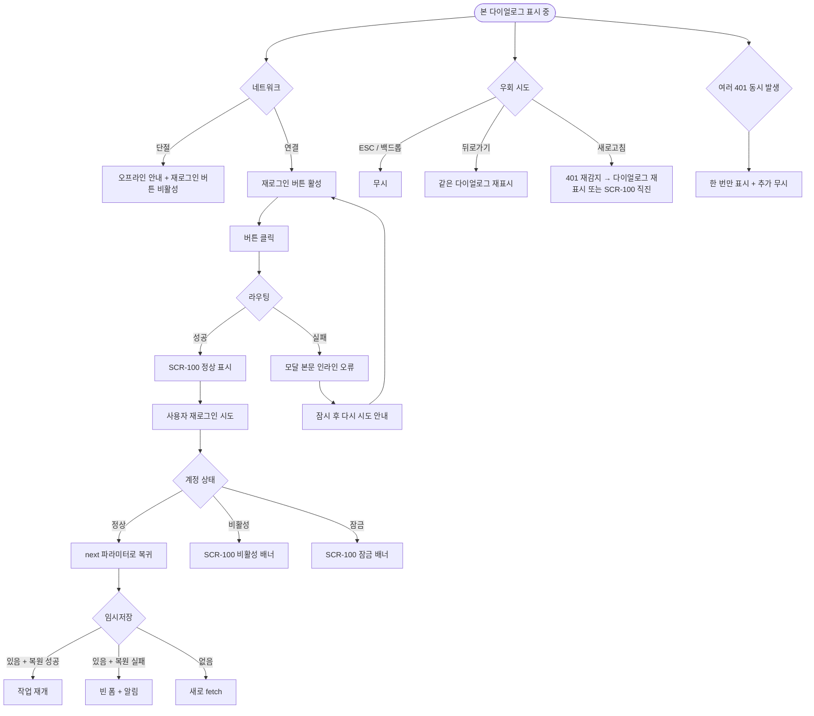

# DLG-000 세션 만료 다이얼로그

## 1. 화면 메타 정보

이 문서는 세션 만료 다이얼로그에 대한 자기완결형 요구사항 정의서입니다. 다른 문서를 함께 보지 않아도 이 문서 한 장만으로 다이얼로그에 들어가는 모든 영역, 모든 버튼, 모든 권한, 모든 예외 처리, 그리고 이 다이얼로그를 지탱하는 운영 정책까지 전부 이해하고 구현할 수 있도록 작성합니다.

| 항목 | 값 |
|---|---|
| 작성일 | 2026-05-22 |
| 버전 | v1.0 |
| 상태 | 최신 통합본 반영 (정합화 완료) |
| 도메인 | D01 공통 |
| 다이얼로그 ID | DLG-000 |
| 다이얼로그명 | 세션 만료 |
| 다이얼로그 유형 | 차단형 알림 (자동 트리거, 부모 화면 위에 오버레이) |
| 라우트 (URL) | 단독 URL 없음 (전체 화면 공통 자동 감지) |
| 플랫폼 | 데스크톱(기본), 태블릿, 모바일 |
| 우선순위 | P0 (출시 필수 보안 흐름) |
| 기능코드 | MFN-SCR-100 (로그인), AUTH-01 (인증/세션/보안 정책) 연계 |
| 계약코드 | 본 다이얼로그 직접 계약코드 없음 |
| 계약 상태 | 비계약 본기능 |
| 부모 기능 prefix | MFN, AUTH |
| Lv1 코드 | MFN-SCR-100, AUTH-01 |
| 연계 화면 | SCR-100 로그인(재로그인 이동 대상), 모든 인증 화면(자동 트리거 가능) |
| 호출 화면 | 전체 화면 공통 (자동 트리거 — 세션 만료 감지 시 인증된 모든 화면 위에 오버레이) |
| 호출되는 다이얼로그 | 본 다이얼로그가 다른 다이얼로그를 호출하지 않음 |

## 2. 다이얼로그 개요와 목적

세션 만료 다이얼로그는 사용자가 활동하던 화면에서 세션이 더 이상 유효하지 않게 된 순간에 부모 화면 위에 자동으로 떠 사용자에게 상황을 알리고 재로그인 경로를 안전하게 제공하는 차단형 알림입니다. 본 시스템은 30분 무활동 자동 로그아웃·다른 기기에서의 강제 종료·직원 비활성화·비밀번호 변경 완료에 따른 모든 세션 무효화 같은 다양한 세션 종료 사유를 가지고 있으며, 본 다이얼로그는 이 모든 사유를 같은 시각적 패턴으로 통합 처리해 사용자가 어떤 상황에 처했는지 즉시 인지할 수 있게 합니다. 본 다이얼로그가 떠 있는 동안에는 부모 화면이 어둡게 처리되어 추가 작업이 불가능하며, 사용자가 재로그인을 마치고 돌아와야 다시 시스템을 사용할 수 있습니다.

이 다이얼로그가 다루는 운영 흐름은 다양합니다. 회원 목록을 보고 있던 매니저가 점심을 먹으러 자리를 비운 사이 30분 무활동으로 세션이 만료되어, 점심을 마치고 자리에 돌아왔을 때 본 다이얼로그가 떠 있는 화면을 만납니다. FC가 본인 모바일에서 로그인한 직후 사무실 PC에서도 같은 계정으로 로그인하면 동시 세션 정책 1세션 제한 환경에서 PC 세션이 강제 종료되어 본 다이얼로그가 PC 화면 위에 표시됩니다. 직원 관리에서 슈퍼관리자가 어떤 직원을 비활성화 처리하면 그 직원이 사용 중이던 화면에서 다음 API 호출이 401로 반환되어 본 다이얼로그가 표시됩니다. 본인이 SCR-106에서 비밀번호를 변경한 직후 모든 기기의 세션이 무효화되어 다른 단말에서도 본 다이얼로그가 표시됩니다.

이 다이얼로그는 단순한 알림이 아니라, 자동 트리거 감지·작성 중 데이터 임시저장·재로그인 후 원래 화면 복귀·강제 로그아웃 사유별 분기까지 모두 반영된 보안 안전망으로 동작합니다. 부모 화면을 가리고 차단형으로 표시되므로 사용자가 인지하지 못한 채 작업을 계속하다가 보안 사고가 일어나지 않도록 보호합니다.

## 3. 호출 경로와 부모 화면

세션 만료 다이얼로그는 별도의 사용자 액션으로 호출되지 않고 시스템이 자동 감지해 트리거합니다. 호출 경로는 다음 다섯 가지가 있으며, 어느 경로로 트리거되든 동일한 시각적 패턴을 가집니다.

첫 번째 경로는 클라이언트 측 무활동 타이머 만료입니다. 마지막 사용자 활동(클릭·키 입력·스크롤) 후 30분이 경과하면 클라이언트 측 타이머가 본 다이얼로그를 자동으로 띄웁니다. 만료 직전 1분 시점에는 토스트로 경고가 먼저 표시되어 사용자가 활동을 이어 가면 타이머가 리셋됩니다.

두 번째 경로는 API 호출 시 401 응답 수신입니다. 사용자가 어떤 화면에서 액션을 시도해 API 호출이 일어났는데 백엔드가 401 Unauthorized를 반환하면, 글로벌 401 핸들러가 작동해 부모 화면 위에 본 다이얼로그를 띄웁니다. 이는 무활동 만료 외에도 동시 세션 종료, 직원 비활성화, 비밀번호 변경 후 세션 무효화 같은 다양한 사유로 발생합니다.

세 번째 경로는 직원 비활성화 이벤트 수신입니다. 직원 관리(STF)에서 슈퍼관리자가 어떤 직원을 비활성화 처리하면 그 직원의 활성 토큰이 백엔드에서 즉시 만료되며, 그 직원이 보고 있던 화면의 다음 API 호출이 401을 반환해 본 다이얼로그가 표시됩니다.

네 번째 경로는 동시 세션 정책 위반입니다. 1세션 제한 정책이 적용된 환경에서 같은 사용자가 다른 단말에서 새로 로그인하면 이전 단말의 세션이 강제 종료되며, 이전 단말의 다음 API 호출이 401을 반환해 본 다이얼로그가 표시됩니다.

다섯 번째 경로는 비밀번호 변경 후 모든 세션 무효화입니다. 사용자가 SCR-106에서 본인 비밀번호를 변경하면 그 계정의 모든 활성 세션이 즉시 만료되며, 본인이 사용 중이던 다른 단말에서도 다음 API 호출이 401을 반환해 본 다이얼로그가 표시됩니다.

본 다이얼로그가 떠 있는 부모 화면은 어떤 화면이든 될 수 있습니다. 회원 목록·매출 현황·수업 캘린더 같은 운영 화면, 회원 등록·결제 처리 같은 입력 화면, 프로필 계정·설정 같은 자기 관리 화면 등 인증된 화면이라면 모두 본 다이얼로그가 떠 있을 수 있습니다. 로그인 화면(SCR-100)이나 비밀번호 재설정(SCR-106)처럼 비로그인 화면에서는 본 다이얼로그가 트리거되지 않습니다.

본 다이얼로그에서 빠져나가는 경로는 단 하나, SCR-100 로그인 화면으로의 자동 이동입니다. 사용자가 "재로그인" 버튼을 누르면 현재 부모 화면의 URL이 next 파라미터로 보존된 채 SCR-100으로 라우팅되며, 재로그인 성공 후에는 원래 부모 화면으로 자동 복귀합니다.

## 4. 레이아웃과 UI 구성

세션 만료 다이얼로그는 부모 화면 위에 떠 있는 차단형 모달입니다. 부모 화면 전체가 어두운 백드롭으로 가려지고, 화면 중앙에 너비 약 420px의 모달 카드가 떠 있으며 모바일에서는 카드가 풀스크린 가까운 폭으로 펼쳐집니다. 모달 카드는 위에서부터 다음 영역들이 순서대로 배치됩니다.

가장 위에는 모달 헤더가 있습니다. 헤더 좌측에는 작은 자물쇠 또는 시계 아이콘과 함께 "세션이 만료되었습니다" 타이틀이 굵은 글씨로 표시됩니다. 헤더 우측에는 닫기(X) 버튼이 없습니다. 본 다이얼로그는 사용자가 임의로 닫고 작업을 이어 갈 수 없도록 차단형으로 동작하기 때문에 닫기 버튼이 노출되지 않습니다.

헤더 아래에는 본문 안내 영역이 있습니다. 안내 텍스트는 기본적으로 "로그인이 만료되어 다시 로그인이 필요합니다" 같은 자연어로 작성되며, 강제 로그아웃 사유에 따라 다음과 같이 분기됩니다. 무활동 만료는 "30분 동안 활동이 없어 자동 로그아웃되었습니다"가, 동시 세션 종료는 "다른 기기에서 로그인되어 본 세션이 종료되었습니다"가, 직원 비활성화는 "계정이 비활성화되어 세션이 종료되었습니다"가, 비밀번호 변경 후는 "비밀번호가 변경되어 모든 세션이 종료되었습니다"가 각각 표시됩니다.

본문 안내 아래에는 현재 작업 위치 안내가 작은 글씨로 표시됩니다. "재로그인 후 원래 작업 화면으로 자동 복귀합니다" 같은 안내가 표시되어 사용자가 작업을 잃지 않는다는 사실을 인지할 수 있게 합니다. 부모 화면이 dirty 상태(입력 중)였다면 "작성 중이던 내용은 임시저장되어 있습니다" 안내가 추가로 표시됩니다.

본문 가장 아래에는 "재로그인" 버튼이 풀 폭으로 배치됩니다. 강조색의 주요 액션 버튼이며, 클릭 시 현재 URL이 next 파라미터로 보존된 채 SCR-100으로 라우팅됩니다. 버튼 옆에 별도의 "취소" 또는 "닫기" 옵션은 제공되지 않습니다. 사용자가 다이얼로그를 닫고 같은 화면을 계속 사용할 수 있는 경로 자체가 존재하지 않기 때문입니다.

ESC 키와 백드롭 클릭은 본 다이얼로그를 닫지 않습니다. 일반적인 다이얼로그는 ESC와 백드롭 클릭으로 취소되지만, 본 다이얼로그는 보안상 사용자가 작업을 이어 갈 수 없는 상태이므로 임의 닫기가 차단됩니다. 사용자는 반드시 "재로그인" 버튼을 눌러 다음 단계로 진행해야 합니다.

본 다이얼로그가 표시되는 동안 부모 화면의 모든 상호작용이 차단됩니다. 부모 화면의 사이드바·헤더·본문 어디를 클릭해도 응답하지 않으며, 키보드 입력도 모달 안의 "재로그인" 버튼에만 전달됩니다. 부모 화면이 보여지는 이유는 사용자에게 어떤 화면에서 세션이 만료되었는지를 시각적으로 알려주기 위함입니다.

처리 중 상태에서는 "재로그인" 버튼이 비활성화되고 안에 스피너가 표시됩니다. 클라이언트가 라우터를 SCR-100으로 전환하는 짧은 시간(약 0.5~1초) 동안만 이 상태가 유지됩니다.

## 5. 입력과 처리 흐름

세션 만료 다이얼로그는 사용자가 입력할 폼이 없는 단순 차단형 알림입니다. 사용자에게 요구되는 액션은 "재로그인" 버튼 클릭 하나이며, 그 클릭이 다음과 같은 처리 흐름을 트리거합니다.

### 5-1. 1단계 — 자동 트리거 감지

본 다이얼로그가 표시되는 시점은 시스템이 자동으로 결정합니다. 클라이언트 측 무활동 타이머가 30분에 도달했을 때, API 호출이 401을 반환했을 때, 또는 백엔드가 세션 무효화 이벤트를 푸시했을 때 중 하나가 트리거되면 글로벌 401 핸들러 또는 세션 모니터가 본 다이얼로그를 부모 화면 위에 띄웁니다.

트리거 직전에 클라이언트는 부모 화면의 dirty 상태를 검사합니다. 부모 화면이 입력 폼을 가진 상태(예: 회원 등록 작성 중)이면 작성 중인 폼 데이터를 localStorage의 임시저장 키(예: `draft:members:new`)에 자동 저장합니다. 임시저장된 데이터는 사용자가 재로그인 후 원래 화면으로 복귀할 때 복원되어 작업을 이어 갈 수 있게 합니다.

### 5-2. 2단계 — 다이얼로그 표시

부모 화면 위에 본 다이얼로그가 슬라이드 인 또는 페이드 인 애니메이션으로 표시됩니다. 부모 화면이 어두운 백드롭으로 가려지고 모든 상호작용이 차단됩니다. 다이얼로그 본문에는 강제 로그아웃 사유에 따른 안내 텍스트가 표시되며, "재로그인" 버튼이 풀 폭으로 노출됩니다.

### 5-3. 3단계 — 재로그인 버튼 클릭

사용자가 "재로그인" 버튼을 누르면 버튼이 비활성화되고 처리 중 상태로 전환됩니다. 클라이언트는 다음과 같이 진행합니다.

먼저 클라이언트 측 토큰·캐시를 모두 비웁니다. localStorage에서 access token·refresh token·remember me 플래그·사용자 컨텍스트 같은 인증 관련 데이터가 제거됩니다. 임시저장된 폼 데이터는 그대로 유지되어 재로그인 후 복원될 수 있게 합니다.

이어서 라우터가 SCR-100 로그인 화면으로 이동합니다. URL에는 현재 부모 화면의 경로가 next 파라미터로 포함됩니다(예: `/login?next=/members`). next 파라미터 값은 안전한 같은 origin path만 허용되며, 외부 URL이나 javascript: 프로토콜은 차단됩니다.

### 5-4. 4단계 — 재로그인 완료 후 복귀

사용자가 SCR-100에서 본인 이메일·비밀번호로 다시 로그인하면, SCR-100의 로그인 성공 처리가 next 파라미터를 보고 그 경로로 자동 라우팅합니다. 즉 원래 부모 화면으로 복귀하며, 부모 화면이 입력 폼이었다면 localStorage의 임시저장 데이터가 자동으로 복원되어 사용자가 작업을 이어 갈 수 있습니다.

복귀한 화면에서는 데이터가 새로 fetch되어 사용자가 자리를 비운 사이 변경된 정보가 최신 상태로 반영됩니다. 다른 사람이 그 사이에 회원 정보를 수정한 경우 사용자가 새 값을 볼 수 있으며, 본인이 작성 중이던 데이터와 충돌하면 부모 화면이 자체적으로 충돌 경고를 띄울 수 있습니다.

### 5-5. 사유별 분기

강제 로그아웃 사유에 따라 4단계의 복귀 흐름이 미세하게 달라집니다. 무활동 만료는 next 파라미터로 원래 화면 복귀가 표준이며, 동시 세션 종료는 다른 기기의 사용자가 같은 계정으로 로그인한 상태이므로 보안 알림 배너가 SCR-100에 표시되어 본인 본인 여부를 다시 확인하게 합니다. 직원 비활성화는 본인이 더 이상 시스템에 진입할 수 없으므로 next 파라미터가 무시되고 SCR-100의 비활성 안내 배너만 표시됩니다. 비밀번호 변경 후 강제 로그아웃은 본인이 새 비밀번호로 다시 로그인해야 하므로 SCR-100에 "비밀번호가 변경되었습니다" 토스트가 표시됩니다.

## 6. 버튼·아이콘·링크 액션 전체 정의

이 다이얼로그에 등장하는 모든 클릭 가능한 요소를 빠짐없이 정의합니다.

재로그인 버튼은 본 다이얼로그의 유일한 액션 버튼이며 모달 본문 가장 아래에 풀 폭으로 배치됩니다. 클릭 시 클라이언트가 다음을 수행합니다. 첫째, 클라이언트 측 토큰·캐시 초기화. 둘째, 라우터를 SCR-100으로 전환(URL에 next 파라미터로 현재 부모 화면 경로 포함). 셋째, 처리 중 상태로 전환되어 버튼이 비활성화되고 스피너 표시. 라우팅이 완료되면 모달이 자동으로 사라지고 SCR-100이 표시됩니다.

닫기(X) 버튼은 본 다이얼로그에 노출되지 않습니다. 사용자가 임의로 다이얼로그를 닫고 부모 화면 작업을 이어 갈 수 없도록 보호하는 차단형 정책에 따른 설계입니다.

ESC 키와 백드롭 클릭은 본 다이얼로그를 닫지 않습니다. 일반적인 다이얼로그와 다르게 이 두 가지 일반 닫기 동작이 모두 차단됩니다. 사용자가 ESC를 누르거나 백드롭을 클릭해도 아무런 변화가 일어나지 않습니다.

부모 화면의 사이드바·헤더·본문 클릭은 모두 차단됩니다. 본 다이얼로그가 떠 있는 동안 부모 화면의 어떤 상호작용도 응답하지 않습니다.

브라우저 뒤로가기 버튼은 본 다이얼로그를 닫지 않습니다. 사용자가 뒤로가기를 누르면 라우터가 이전 경로로 시도하지만 그 경로 역시 인증이 필요하므로 즉시 본 다이얼로그가 다시 표시됩니다. 결국 재로그인을 거치지 않으면 시스템을 사용할 수 없습니다.

페이지 새로고침(F5)은 본 다이얼로그를 닫는 효과가 있을 수 있지만, 새로고침 직후 다시 같은 화면이 로드되면 인증 가드가 401을 감지해 본 다이얼로그가 다시 표시되거나 SCR-100으로 직접 라우팅됩니다.

모든 버튼은 응답이 돌아오는 동안 자동으로 비활성화되어 더블클릭으로 인한 중복 라우팅이 차단됩니다.

## 7. 호출되는 다이얼로그 동작

세션 만료 다이얼로그는 다른 다이얼로그를 호출하지 않습니다. 본 다이얼로그 자체가 다른 흐름들이 트리거하는 자동 알림이며, 본 다이얼로그 안에서 추가 모달이 떠 있을 수 있는 상황이 없습니다.

다음과 같은 관계가 있습니다.

### 7-1. DLG-002 이탈 경고 다이얼로그 (해당 없음)

본 다이얼로그는 사용자의 명시적 액션이 아니라 시스템 자동 트리거로 표시되며, 본 다이얼로그가 떠 있는 상태에서는 사용자가 다른 화면으로 이동할 방법이 없으므로 이탈 경고가 트리거되지 않습니다. 다만 본 다이얼로그가 표시되기 직전에 부모 화면이 dirty 상태였다면 자동으로 폼 데이터가 임시저장되어 데이터 손실을 방지합니다.

### 7-2. DLG-001 로그아웃 확인 다이얼로그 (해당 없음)

명시적 로그아웃 흐름과 본 다이얼로그는 별개입니다. 본 다이얼로그는 자동 강제 로그아웃 흐름이므로 DLG-001 확인 단계가 적용되지 않습니다.

## 8. 토스트와 안내 메시지

세션 만료 다이얼로그에서 발생하는 모든 알림성 UI는 다음과 같은 패턴으로 동작합니다.

성공 토스트는 본 다이얼로그 자체에서는 사용되지 않습니다. 다만 사용자가 "재로그인" 버튼을 눌러 SCR-100으로 이동한 직후, SCR-100 상단에 강제 로그아웃 사유 배너가 표시되어 사용자가 어떤 이유로 세션이 종료되었는지 인지할 수 있게 합니다.

실패 안내는 본 다이얼로그에서 거의 사용되지 않습니다. 다이얼로그 자체가 시스템 자동 처리이므로 사용자에게 추가 실패 알림을 띄울 일이 없습니다. 다만 "재로그인" 버튼 클릭 후 라우팅이 실패하는 극단적인 경우(라우터 오류·네트워크 단절)에는 카드 본문에 "잠시 후 다시 시도해주세요" 안내가 인라인으로 표시될 수 있습니다.

만료 직전 경고 토스트는 본 다이얼로그가 표시되기 전 단계로, 마지막 활동 후 29분 시점에 우측 상단에 노랑 토스트로 "곧 자동 로그아웃됩니다. 활동을 계속하시면 연장됩니다" 안내가 표시됩니다. 사용자가 활동(클릭·키 입력)을 하면 타이머가 리셋되어 본 다이얼로그가 표시되지 않습니다. 만료 직전 경고는 본 다이얼로그와 독립된 별도 UI 요소입니다.

임시저장 안내는 본 다이얼로그가 표시되는 시점에 부모 화면이 dirty 상태였다면 모달 본문에 "작성 중이던 내용은 임시저장되어 있습니다. 재로그인 후 자동 복원됩니다" 안내가 자동으로 추가되어 사용자가 데이터 손실 걱정 없이 재로그인을 진행할 수 있게 합니다.

확인 팝업과 알럿은 본 다이얼로그 자체가 차단형 알림이므로 추가로 사용되지 않습니다.

오프라인 안내는 본 다이얼로그가 떠 있는 상태에서 네트워크가 단절되면 모달 본문에 작은 배너로 "오프라인 상태입니다. 네트워크 복구 후 재로그인이 가능합니다" 안내가 표시됩니다.

## 9. 데이터 흐름과 외부 연동

이 다이얼로그는 인증 시스템의 강제 종결 처리를 담당하므로 토큰·세션·임시저장 데이터에 영향을 줍니다. 어떤 데이터가 어디서 어떻게 처리되는지를 모두 풀어 씁니다.

자동 트리거 감지는 클라이언트 측에서 두 가지 방식으로 일어납니다. 첫 번째는 무활동 타이머로, 마지막 사용자 활동 시각을 추적하고 30분에 도달하면 본 다이얼로그를 자동으로 띄웁니다. 두 번째는 글로벌 401 핸들러로, 모든 API 호출의 응답 상태를 가로채 401이 반환되면 본 다이얼로그를 자동으로 띄웁니다.

임시저장 처리는 본 다이얼로그가 표시되기 직전에 일어납니다. 클라이언트가 부모 화면의 dirty 상태를 검사하고, dirty이면 작성 중인 폼 데이터를 localStorage의 임시저장 키(예: `draft:{route}:{timestamp}`)에 저장합니다. 임시저장 키 형식은 부모 화면이 자체적으로 정의하며, 본 다이얼로그는 임시저장이 일어났다는 사실만 확인하고 그 정보를 본문 안내에 반영합니다.

재로그인 버튼 클릭 시점에는 클라이언트 측 인증 토큰·캐시가 초기화됩니다. localStorage에서 access token·refresh token·remember me 플래그·사용자 컨텍스트가 제거되며, 임시저장된 폼 데이터는 그대로 유지됩니다.

라우팅 시점에는 SCR-100으로 URL이 변경되며, 현재 부모 화면의 경로가 next 파라미터로 포함됩니다(예: `/login?next=/members`). next 파라미터는 SCR-100에서 안전한 같은 origin path만 허용되도록 검증되며, 외부 URL이나 javascript: 프로토콜은 무시됩니다.

재로그인 완료 후 복귀 시점에는 SCR-100의 로그인 성공 처리가 next 파라미터를 보고 라우팅합니다. 라우팅이 완료되면 부모 화면이 새로 fetch되며, 임시저장된 폼 데이터가 있으면 부모 화면의 폼 복원 로직이 그 데이터를 입력란에 자동 채워 사용자가 작업을 이어 갈 수 있게 합니다.

감사 로그는 강제 로그아웃 이벤트가 SCR-097 감사 로그에 INSERT됩니다. 기록 필드는 `actor_id`, `action=FORCED_LOGOUT`, `reason`(SESSION_EXPIRED·CONCURRENT_SESSION·EMPLOYEE_DEACTIVATED·PASSWORD_CHANGED 등), `ip`, `device`, `user_agent`, `session_id`, `timestamp`입니다.

알림 센터(NFR-19)는 사유에 따라 본 다이얼로그 트리거와 연동되어 보안 알림을 발송할 수 있습니다. 동시 세션 종료는 다른 기기의 본인에게도 알림이 전달되며, 직원 비활성화는 슈퍼관리자에게 처리 결과 알림이 전달됩니다.

세션 무효화 이벤트는 다음과 같이 처리됩니다. 무활동 만료는 클라이언트 측 타이머에서 감지되어 다음 API 호출이 401을 반환합니다. 동시 세션 종료는 백엔드가 새 로그인 시점에 이전 세션을 무효화하며, 이전 단말의 다음 API 호출에서 401이 반환됩니다. 직원 비활성화는 STF 처리 시점에 모든 활성 토큰이 즉시 만료됩니다. 비밀번호 변경 후는 SCR-106 변경 완료 시점에 모든 활성 세션이 무효화됩니다.

화면에서 호출하는 주요 API 엔드포인트는 다음과 같습니다. 본 다이얼로그 자체는 별도 API를 호출하지 않으며, "재로그인" 버튼 클릭이 SCR-100으로 라우팅을 트리거하면 그 화면이 자체적으로 인증 API를 호출합니다.

## 10. 화면 상태와 예외 처리

세션 만료 다이얼로그는 다음 상태들을 가질 수 있고, 각 상태마다 사용자에게 보이는 모습이 달라집니다.

표시 상태는 다이얼로그가 부모 화면 위에 떠 있는 기본 상태입니다. 어두운 백드롭이 깔리고 모달 카드에 사유별 안내가 표시되며, "재로그인" 버튼이 활성화되어 사용자의 클릭을 기다립니다.

처리 중 상태는 사용자가 "재로그인" 버튼을 누른 직후로, 버튼이 비활성화되고 안에 스피너가 표시됩니다. 클라이언트 측 토큰 초기화와 SCR-100 라우팅이 진행되는 짧은 시간(약 0.5~1초) 동안 유지됩니다.

재로그인 이동 상태는 라우팅이 완료되어 SCR-100이 표시된 직후로, 본 다이얼로그는 자동으로 사라지고 SCR-100 상단에 강제 로그아웃 사유 배너가 표시됩니다.

임시저장 안내 상태는 부모 화면이 dirty였던 경우 본문에 임시저장 안내가 추가로 표시되는 상태입니다. 사용자가 데이터 손실을 걱정하지 않게 합니다.

오프라인 상태는 네트워크 단절 중에 본 다이얼로그가 떠 있는 상태로, 모달 본문에 작은 배너로 "오프라인 상태입니다" 안내가 표시되고 "재로그인" 버튼이 비활성화됩니다. 네트워크가 복구되면 버튼이 활성화됩니다.

라우팅 실패 상태는 "재로그인" 버튼 클릭 후 SCR-100으로의 라우팅이 실패한 극단적인 상태로, 모달 본문에 "잠시 후 다시 시도해주세요" 안내가 인라인으로 표시되고 버튼이 다시 활성화됩니다.

예외 케이스별 처리는 다음과 같이 정의됩니다.

부모 화면이 dirty 상태였다면 본 다이얼로그가 표시되기 직전에 자동 임시저장이 일어나고, 본문에 임시저장 안내가 추가됩니다. 재로그인 후 복귀 시 임시저장 데이터가 자동 복원됩니다.

오프라인 상태에서 본 다이얼로그가 떠 있으면 "재로그인" 버튼이 비활성화되며, 네트워크 복구 시 자동으로 활성화됩니다.

브라우저 뒤로가기·새로고침으로 본 다이얼로그를 우회하려고 시도해도 인증 가드가 401을 감지해 본 다이얼로그가 다시 표시되거나 SCR-100으로 직접 라우팅됩니다.

next 파라미터가 외부 URL이나 javascript: 프로토콜을 포함하면 SCR-100의 안전 검증이 그 값을 무시하고 사용자의 역할별 기본 첫 화면으로 라우팅합니다.

비활성화된 계정으로 재로그인을 시도하면 SCR-100에서 "비활성화된 계정입니다" 안내가 표시되어 시스템 진입이 차단됩니다.

세션이 만료된 상태에서 부모 화면의 사이드바 메뉴를 빠르게 여러 번 클릭해도 본 다이얼로그가 그대로 표시되며 클릭은 모두 무시됩니다.

본 다이얼로그가 표시되는 동안 다른 다이얼로그(예: 부모 화면의 입력 폼이 자체적으로 띄운 모달)는 z-index가 본 다이얼로그보다 낮게 설정되어 본 다이얼로그가 항상 가장 위에 표시됩니다.

여러 개의 401 응답이 동시에 발생해도 본 다이얼로그는 한 번만 표시되며, 추가 401은 무시됩니다.

## 11. 권한별 처리

이 다이얼로그는 모든 인증된 역할이 만날 수 있는 공통 보안 흐름이므로 권한별 처리가 거의 동일합니다. 다만 사유와 부모 화면 정책에 따라 미세한 차이가 있습니다.

슈퍼관리자(superAdmin), 본사 최고관리자(primary), 센터장(owner), 매니저(manager), FC(fc), 스태프(staff), 프런트(front), 트레이너(trainer), 읽기 전용(readonly) 모든 역할이 본 다이얼로그를 동일하게 만날 수 있습니다. 30분 무활동 자동 로그아웃, 동시 세션 종료, 비밀번호 변경 후 강제 로그아웃은 모든 역할에게 동일하게 적용됩니다.

직원 비활성화 사유는 슈퍼관리자에 의해 비활성화 처리된 직원에게만 적용됩니다. 비활성화 처리 직후 그 직원의 활성 토큰이 즉시 만료되어 본 다이얼로그가 표시됩니다. 재로그인 시 SCR-100에서 "비활성화된 계정입니다" 안내가 표시되어 시스템 진입이 차단됩니다.

IP 화이트리스트 위반 사유는 슈퍼관리자·본사 최고관리자에게만 적용됩니다. 본사 정책이 활성화된 환경에서 슈퍼 권한자가 본사 외부 IP에서 활동 중인 사실이 감지되면 본 다이얼로그가 표시될 수 있습니다.

비로그인 사용자는 본 다이얼로그를 만나지 않습니다. 인증되지 않은 상태에서는 세션 자체가 없으므로 만료 처리가 발생하지 않습니다.

권한 외에도 부모 화면 정책에 따라 본 다이얼로그의 표시 방식이 미세하게 달라집니다. 입력 폼이 있는 부모 화면(예: 회원 등록)에서는 자동 임시저장이 일어나 데이터 손실을 방지하며, 단순 조회 화면(예: 대시보드)에서는 임시저장 안내가 추가되지 않습니다.

권한이 부족해서 액션이 차단되는 경우는 본 다이얼로그에서 발생하지 않습니다. 본 다이얼로그는 인증 종결 흐름이며 모든 역할에게 동일하게 적용됩니다.

## 12. 메인 흐름

세션 만료 다이얼로그의 핵심 동작 흐름을 다이어그램으로 표현합니다. 시스템이 세션 만료를 감지한 시점부터 사용자가 재로그인 후 원래 화면으로 복귀하기까지의 가장 일반적인 정상 흐름입니다.

## 13. 에러 흐름

세션 만료 다이얼로그에서 발생할 수 있는 주요 에러와 그 처리 흐름을 다이어그램으로 표현합니다. 오프라인·라우팅 실패·우회 시도·비활성 계정 재로그인이 어떻게 분기되는지를 정의합니다.

## 14. 운영 정책 — 세션 만료 / 자동 로그아웃 / 임시저장 자기완결 정리

이 절은 본 다이얼로그가 의존하는 세션 만료·자동 로그아웃·임시저장 운영 정책을 외부 문서 참조 없이 풀어 적습니다.

자동 로그아웃 정책은 마지막 활동 후 30분 무활동을 기본 기준으로 합니다. 클라이언트 측 타이머가 사용자의 활동(클릭·키 입력·스크롤)을 추적하고 30분에 도달하면 본 다이얼로그를 자동으로 띄웁니다. 만료 직전 1분 시점에는 토스트로 경고가 먼저 표시되어 사용자가 활동을 이어 가면 타이머가 리셋됩니다.

JWT 이중 구조 정책은 access token 15분과 refresh token 7일을 사용합니다. access token이 만료되면 refresh token으로 자동 갱신이 시도되며, 갱신이 실패하면(refresh도 만료되었거나 폐기되었거나) 본 다이얼로그가 표시됩니다.

강제 로그아웃 사유 정책은 다음 다섯 가지를 표준 사유로 정의합니다. SESSION_EXPIRED(30분 무활동), CONCURRENT_SESSION(다른 기기 강제 종료), EMPLOYEE_DEACTIVATED(직원 비활성화), PASSWORD_CHANGED(비밀번호 변경 후 모든 세션 무효화), IP_WHITELIST_VIOLATION(IP 화이트리스트 위반). 각 사유별로 본 다이얼로그의 본문 안내 텍스트가 분기됩니다.

임시저장 정책은 본 다이얼로그가 표시되기 직전에 부모 화면이 dirty 상태이면 작성 중인 폼 데이터를 localStorage의 임시저장 키에 자동 저장하도록 합니다. 임시저장 키 형식은 `draft:{route}:{timestamp}` 또는 `draft:{formId}` 같이 부모 화면이 자체 정의하며, 본 다이얼로그는 임시저장이 일어났다는 사실을 본문에 안내로 노출합니다. 재로그인 후 부모 화면 복귀 시 임시저장 데이터가 자동 복원됩니다.

차단형 표시 정책은 본 다이얼로그가 떠 있는 동안 부모 화면의 모든 상호작용이 차단되도록 합니다. ESC 키와 백드롭 클릭이 무시되어 사용자가 임의로 다이얼로그를 닫을 수 없으며, 닫기(X) 버튼도 노출되지 않습니다. 사용자는 반드시 "재로그인" 버튼을 눌러 다음 단계로 진행해야 합니다.

next 파라미터 안전 검증 정책은 SCR-100이 본 다이얼로그에서 전달받은 next 값을 검증해 같은 origin의 안전한 path만 허용합니다. 외부 URL이나 javascript: 프로토콜은 무시되며, 사용자의 역할별 기본 첫 화면으로 안전하게 라우팅됩니다.

감사 로그 정책은 모든 강제 로그아웃 이벤트를 SCR-097 감사 로그에 actor·action·reason·ip·device·user_agent·session_id·timestamp로 기록합니다. 사후 추적과 보안 분석에 활용됩니다.

비활성 계정 재로그인 차단 정책은 직원 비활성화 사유로 강제 로그아웃된 사용자가 SCR-100에서 재로그인을 시도해도 "비활성화된 계정입니다" 안내로 차단되도록 합니다. 본인이 다시 활성화될 때까지 시스템 진입이 막힙니다.

만료 직전 경고 정책은 본 다이얼로그가 표시되기 전 단계로, 마지막 활동 후 29분 시점에 토스트로 사용자에게 경고를 합니다. 사용자가 활동을 이어 가면 타이머가 리셋되어 본 다이얼로그가 표시되지 않습니다.

여러 401 동시 발생 정책은 같은 시점에 여러 API 호출이 401을 반환해도 본 다이얼로그가 한 번만 표시되도록 합니다. 추가 401은 무시되며 사용자에게 중복 안내가 표시되지 않습니다.

오프라인 처리 정책은 본 다이얼로그가 떠 있는 상태에서 네트워크가 단절되면 "재로그인" 버튼을 비활성화하고 본문에 오프라인 안내를 추가합니다. 네트워크 복구 시 자동으로 활성화됩니다.

다국어 정책은 본 다이얼로그의 모든 안내 메시지를 i18n 키로 관리해 한국어 기본과 본사 정책에 따른 영어 등 다른 언어를 지원합니다. 사유별 안내 텍스트도 모두 다국어 처리됩니다.

본인 의도 로그아웃과의 분리 정책은 명시적 로그아웃(SCR-109 + DLG-001)과 본 다이얼로그를 명확히 구분합니다. 명시적 로그아웃은 사용자가 직접 트리거하는 흐름이며 next 파라미터를 사용하지 않지만, 본 다이얼로그는 자동 트리거이며 next 파라미터로 원래 화면 복귀를 보장합니다.

## 15. 변경 이력

| 일자 | 변경 |
|---|---|
| 2026-05-22 | v1.0 자기완결형 요구사항 정의서로 통합본 작성 (화면설계서 DLG-000, 기능명세서 MFN-SCR-100/AUTH-01, 세션·강제 로그아웃·임시저장 운영 정책 통합) |
