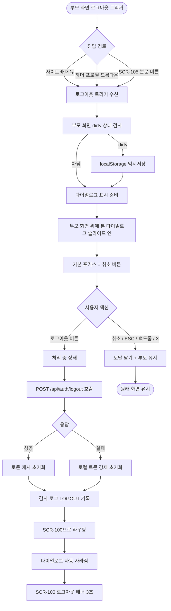
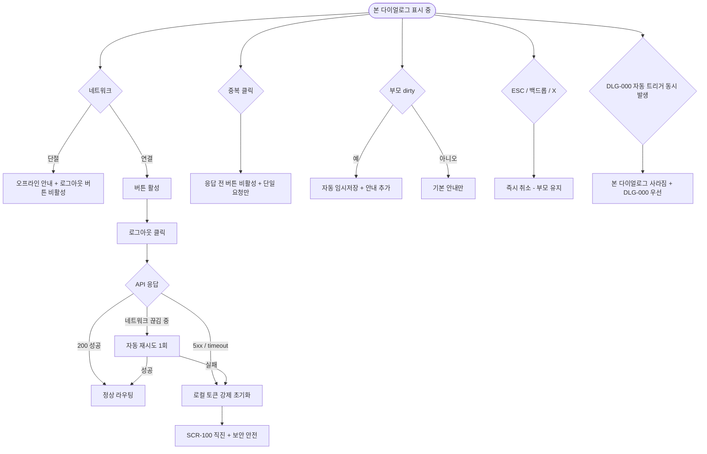

# DLG-001 로그아웃 확인 다이얼로그

## 1. 다이얼로그 메타 정보

이 문서는 로그아웃 확인 다이얼로그에 대한 자기완결형 요구사항 정의서입니다. 다른 문서를 함께 보지 않아도 이 문서 한 장만으로 다이얼로그의 모든 영역, 모든 버튼, 모든 권한, 모든 예외 처리, 그리고 이 다이얼로그를 지탱하는 운영 정책까지 전부 이해하고 구현할 수 있도록 작성합니다.

| 항목 | 값 |
|---|---|
| 작성일 | 2026-05-22 |
| 버전 | v1.0 |
| 상태 | 최신 통합본 반영 (정합화 완료) |
| 도메인 | D01 공통 |
| 다이얼로그 ID | DLG-001 |
| 다이얼로그명 | 로그아웃 확인 |
| 다이얼로그 유형 | 확인형 모달 (Confirmation Modal, 사용자 명시 트리거) |
| 라우트 (URL) | 단독 URL 없음 (전체 화면 공통 호출) |
| 플랫폼 | 데스크톱(기본), 태블릿, 모바일 |
| 우선순위 | P0 (출시 필수 인증 흐름) |
| 기능코드 | MFN-SCR-109 (로그아웃), AUTH-01 (인증/세션) |
| 계약코드 | 본 다이얼로그 직접 계약코드 없음 |
| 계약 상태 | 비계약 본기능 |
| 부모 기능 prefix | MFN, AUTH |
| Lv1 코드 | MFN-SCR-109, AUTH-01 |
| 부모 화면 | 헤더(SCR-102 사이드바)·SCR-105 프로필 계정 등 로그인 상태의 모든 화면 |
| 호출되는 다이얼로그 | 본 다이얼로그가 다른 다이얼로그를 호출하지 않음 |

## 2. 다이얼로그 개요와 목적

로그아웃 확인 다이얼로그는 사용자가 사이드바 하단 또는 프로필 메뉴에서 "로그아웃" 버튼을 명시적으로 눌렀을 때, 클릭 실수로 인한 의도하지 않은 세션 종료를 막기 위해 부모 화면 위에 떠 사용자의 의사를 한 번 더 확인받는 확인형 모달입니다. 이 다이얼로그는 자동 트리거로 표시되는 세션 만료(DLG-000)와 명확히 구분되며, 반드시 사용자의 명시적 클릭으로만 호출됩니다.

이 다이얼로그가 다루는 운영 흐름은 다양합니다. 매니저가 업무를 끝내고 사이드바 하단 로그아웃 메뉴를 눌러 본 다이얼로그를 만나고, FC가 공용 PC에서 본인 계정으로 로그인한 후 자리에서 일어나기 직전에 본 다이얼로그를 거쳐 다음 사람을 위해 세션을 종료하며, 스태프가 프로필 드롭다운에서 실수로 로그아웃을 눌렀을 때 이 다이얼로그의 취소 버튼으로 작업을 이어 갈 수 있습니다.

이 다이얼로그는 단순 yes/no가 아니라, 작성 중 데이터 임시저장 알림, 중복 클릭 차단, 키보드 포커스 트랩, 접근성 ARIA 속성, 로그아웃 처리 후 SCR-100 리다이렉트까지 모두 반영된 인증 안전망으로 동작합니다.

## 3. 호출 경로와 부모 화면

이 다이얼로그는 사용자의 명시적 클릭으로만 호출되며 호출 경로는 다음 세 가지가 있습니다.

첫 번째 경로는 사이드바(SCR-102) 하단의 로그아웃 메뉴 클릭입니다. 모든 인증된 화면에서 사이드바가 노출되므로 어떤 화면에서든 같은 방식으로 본 다이얼로그가 호출됩니다.

두 번째 경로는 헤더 우측 프로필 드롭다운의 로그아웃 항목 클릭입니다. SCR-105 프로필 계정 페이지로 가지 않고 드롭다운에서 바로 로그아웃을 선택할 수 있습니다.

세 번째 경로는 SCR-105 프로필 계정 페이지의 본문에 있는 "로그아웃" 버튼 클릭입니다. 본인 계정 관리 화면에서 명시적으로 로그아웃을 선택하는 흐름입니다.

본 다이얼로그가 떠 있는 부모 화면은 인증된 모든 화면이 될 수 있습니다. 회원 목록·매출 현황·수업 캘린더 같은 운영 화면, 회원 등록·결제 처리 같은 입력 화면, 프로필 계정·설정 같은 자기 관리 화면 등 어디서 호출되든 동일한 모양과 동작으로 표시됩니다. 로그인 화면(SCR-100)이나 비밀번호 재설정(SCR-106) 같은 비로그인 화면에서는 호출되지 않습니다.

본 다이얼로그에서 빠져나가는 경로는 두 가지입니다. 확인을 누르면 세션 종료 후 SCR-100 로그인 화면으로 라우팅되고, 취소를 누르면 다이얼로그가 닫히고 원래 부모 화면이 그대로 유지됩니다.

## 4. 모달 구성요소

부모 화면 위에 어두운 백드롭이 깔리고 화면 중앙에 너비 약 360~420px의 모달 카드가 떠 있습니다. 모바일에서는 풀스크린에 가까운 폭으로 펼쳐집니다.

모달 헤더 좌측에는 작은 로그아웃 아이콘과 함께 "로그아웃 하시겠습니까?"라는 제목이 굵은 글씨로 표시됩니다. 헤더 우측에는 닫기(X) 버튼이 배치되어 ESC·백드롭 클릭과 동일하게 취소로 처리됩니다.

본문 안내 영역에는 "로그인 화면으로 이동합니다. 작성 중인 내용은 임시저장됩니다" 같은 자연어 안내가 표시됩니다. 부모 화면이 dirty 상태(입력 중)이면 본문에 "작성 중이던 내용은 임시저장되어 있습니다. 다음 로그인 시 복원 안내가 표시될 수 있습니다" 안내가 추가됩니다.

본문 아래에는 좌측에 "취소" 보조 버튼, 우측에 "로그아웃" 주요 액션 버튼이 가로로 배치됩니다. 모바일에서는 두 버튼이 세로 스택으로 펼쳐지며 주요 버튼이 위쪽에 위치합니다.

ESC 키와 백드롭 클릭은 취소와 동일하게 모달을 닫고 부모 화면이 유지됩니다. Enter 키는 주요 액션(로그아웃 확인)을 트리거하지만 Tab 포커스가 취소 버튼에 있을 때는 취소로 처리됩니다.

키보드 포커스 트랩이 적용되어 Tab 키로 포커스가 모달 안의 두 버튼만 순환하며 부모 화면의 요소로 빠져나가지 않습니다. 모달이 열리는 순간 포커스는 안전한 기본값(취소 버튼)에 자동으로 배치됩니다.

## 5. 동작 흐름

사용자가 부모 화면에서 로그아웃 트리거를 누르는 순간 클라이언트는 부모 화면의 dirty 상태를 검사하고, dirty이면 localStorage의 임시저장 키에 작성 중인 폼 데이터를 자동 저장합니다. 그 직후 본 다이얼로그가 부모 화면 위에 슬라이드 인 또는 페이드 인 애니메이션으로 표시되며, 임시저장 안내가 본문에 자동으로 노출됩니다.

사용자가 "로그아웃" 주요 버튼을 누르면 버튼이 비활성화되고 안에 스피너가 표시됩니다. 클라이언트는 백엔드에 세션 종료 요청을 보내고, 응답 성공 시 localStorage의 access token·refresh token·remember me 플래그·사용자 컨텍스트를 모두 비웁니다. 임시저장된 폼 데이터는 그대로 유지되어 다음 로그인 시 복원될 수 있게 합니다. 토큰 초기화가 끝나면 라우터가 SCR-100 로그인 화면으로 라우팅되며 본 다이얼로그는 자동으로 사라집니다. 처리 시간은 약 0.5~1초이며 그 사이 다른 입력은 모두 차단됩니다.

사용자가 "취소"를 누르면 모달이 즉시 닫히고 부모 화면이 그대로 유지됩니다. 임시저장된 데이터는 부모 화면이 자체적으로 관리하며 본 다이얼로그는 임시저장 키를 비우지 않습니다. ESC 키, 백드롭 클릭, 닫기(X) 버튼도 모두 취소와 동일하게 처리됩니다.

부분 실패는 본 다이얼로그에 거의 발생하지 않지만, 로그아웃 API가 5xx 또는 timeout을 반환하면 클라이언트는 로컬 토큰을 강제 초기화한 후 SCR-100으로 라우팅합니다. 이는 보안상 백엔드 실패 시에도 사용자의 로컬 세션은 종료되어야 한다는 정책에 따른 것입니다.

## 6. 버튼·아이콘·링크 액션 전체 정의

로그아웃 확인 버튼(주요 액션)은 모달 본문 우측 하단에 배치됩니다. 클릭 시 세션 종료 API 호출, 토큰·캐시 초기화, SCR-100 라우팅이 순차적으로 진행되며 진행 중에는 비활성화 상태로 전환됩니다. 응답이 돌아오기 전 중복 클릭은 자동으로 차단됩니다.

취소 버튼(보조 액션)은 본문 좌측 하단에 배치됩니다. 클릭 시 모달이 즉시 닫히고 부모 화면이 변경 없이 유지됩니다.

닫기(X) 버튼은 모달 헤더 우측에 배치됩니다. 취소와 동일한 동작으로 모달을 닫습니다.

ESC 키는 취소와 동일하게 모달을 닫습니다. 입력 도중인 상태가 아니므로 추가 확인 없이 즉시 닫힙니다.

백드롭 클릭은 취소와 동일하게 모달을 닫습니다.

Enter 키는 현재 포커스된 버튼을 활성화합니다. 기본 포커스가 취소 버튼이면 모달이 닫히고, 사용자가 Tab으로 주요 액션으로 이동한 뒤 Enter를 누르면 로그아웃이 실행됩니다.

브라우저 뒤로가기는 모달이 떠 있는 동안 라우터 변경을 시도하지만 본 다이얼로그가 z-index로 가장 위에 떠 있으므로 뒤로가기로 모달이 닫히지 않습니다.

모든 버튼은 응답이 돌아오기 전까지 자동 비활성화되어 중복 요청이 차단됩니다.

## 7. 호출되는 다이얼로그 동작

로그아웃 확인 다이얼로그는 다른 다이얼로그를 호출하지 않습니다.

다음과 같은 관계가 있습니다.

DLG-002 이탈 경고 다이얼로그는 본 다이얼로그와 별개로 동작합니다. 부모 화면이 dirty 상태일 때 사용자가 본 다이얼로그를 거치지 않고 라우터로 이동을 시도하면 DLG-002가 트리거되지만, 본 다이얼로그를 거치는 명시적 로그아웃 흐름에서는 자동 임시저장 처리 후 본 다이얼로그가 직접 안내하므로 DLG-002를 추가로 띄우지 않습니다.

DLG-000 세션 만료 다이얼로그는 자동 트리거 흐름이며 본 다이얼로그(명시 트리거)와 명확히 구분됩니다. 두 다이얼로그는 동시에 표시되지 않습니다.

## 8. 토스트와 안내 메시지

성공 토스트는 본 다이얼로그 자체에서는 사용되지 않습니다. 로그아웃이 완료되어 SCR-100으로 라우팅된 직후 SCR-100 상단에 "로그아웃되었습니다" 안내 배너가 약 3초간 표시될 수 있습니다.

실패 토스트는 로그아웃 API가 네트워크 오류 또는 5xx를 반환했을 때 모달 본문에 인라인으로 "잠시 후 다시 시도해주세요" 안내가 표시됩니다. 단, 보안 정책에 따라 로컬 토큰은 강제 초기화 후 SCR-100으로 라우팅되므로 사용자가 같은 화면에 묶이는 일은 없습니다.

확인 팝업은 본 다이얼로그 자체가 확인 단계이므로 추가로 사용되지 않습니다. 다만 부모 화면이 dirty 상태였다면 본문에 임시저장 안내가 자동으로 추가되어 데이터 손실 걱정을 해소합니다.

오프라인 안내는 본 다이얼로그가 떠 있는 동안 네트워크가 단절되면 모달 본문에 작은 배너로 "오프라인 상태입니다. 네트워크 복구 후 로그아웃이 처리됩니다" 안내가 표시되고 주요 버튼이 비활성화됩니다. 네트워크 복구 시 자동으로 활성화됩니다.

## 9. 데이터 흐름과 외부 연동

본 다이얼로그가 표시되기 직전에 클라이언트가 부모 화면의 dirty 상태를 검사하고 dirty이면 localStorage의 임시저장 키(`draft:{route}:{timestamp}` 또는 `draft:{formId}`)에 작성 중인 폼 데이터를 자동 저장합니다. 임시저장 키 형식은 부모 화면이 자체 정의합니다.

확인 클릭 시 클라이언트는 `POST /api/auth/logout` API를 호출합니다. 요청 본문은 비어 있고 헤더의 토큰만 검증됩니다. 백엔드는 해당 refresh token을 폐기하고 200을 반환합니다.

응답 성공 후 클라이언트는 localStorage에서 access token·refresh token·remember me 플래그·사용자 컨텍스트·라우트 캐시를 모두 비웁니다. 임시저장된 폼 데이터는 그대로 유지됩니다. 그다음 라우터가 SCR-100으로 라우팅하며 본 다이얼로그가 자동으로 사라집니다.

감사 로그는 명시 로그아웃 이벤트가 SCR-097 감사 로그에 INSERT됩니다. 기록 필드는 `actor_id`, `action=LOGOUT`, `reason=USER_INITIATED`, `ip`, `device`, `user_agent`, `session_id`, `timestamp`입니다.

알림 센터(NFR-19)는 일반적인 사용자 로그아웃 이벤트에 대해 추가 알림을 발송하지 않습니다. 다만 보안 정책상 의심스러운 IP에서의 로그아웃이 감지되면 본인에게 보안 알림이 전송될 수 있습니다.

API 실패 시 폴백 정책에 따라 클라이언트는 로컬 토큰을 강제 초기화한 후 SCR-100으로 라우팅합니다. 백엔드의 refresh token은 다음 자동 만료(7일) 시점에 정리되거나, 사용자가 다음 로그인 시 새 토큰을 받으면서 자연스럽게 교체됩니다.

## 10. 화면 상태와 예외 처리

표시 상태는 다이얼로그가 부모 화면 위에 떠 있는 기본 상태입니다. 두 버튼이 활성화되어 사용자의 클릭을 기다리며 키보드 포커스는 기본값(취소 버튼)에 배치됩니다.

처리 중 상태는 사용자가 "로그아웃" 버튼을 누른 직후로, 주요 버튼이 비활성화되고 안에 스피너가 표시됩니다. 취소 버튼·닫기 버튼·ESC·백드롭 클릭도 모두 비활성화되어 처리 중 강제 취소가 차단됩니다. 약 0.5~1초 동안 유지됩니다.

완료 상태는 라우팅이 완료되어 SCR-100이 표시된 직후로, 본 다이얼로그는 자동으로 사라집니다.

임시저장 안내 상태는 부모 화면이 dirty였던 경우 본문에 임시저장 안내가 추가로 표시되는 상태입니다.

오프라인 상태는 네트워크 단절 중에 본 다이얼로그가 떠 있는 상태로, 본문에 오프라인 안내가 표시되고 주요 버튼이 비활성화됩니다.

실패 상태는 로그아웃 API가 5xx를 반환했을 때이지만, 보안상 로컬 토큰 강제 초기화 + SCR-100 라우팅이 즉시 일어나므로 사용자가 이 상태를 길게 보지 않습니다.

중복 클릭 차단은 응답이 돌아오기 전까지 모든 버튼이 비활성화되어 같은 요청이 두 번 보내지지 않도록 보장합니다.

부모 화면이 dirty 상태였다면 본 다이얼로그 표시 직전 자동 임시저장이 일어나고 본문에 안내가 추가됩니다. 다음 로그인 후 부모 화면 복귀 시 임시저장 데이터가 복원될 수 있도록 부모 화면이 자체적으로 처리합니다.

본 다이얼로그가 떠 있는 동안 다른 다이얼로그가 동시에 떠 있는 경우는 발생하지 않습니다. DLG-000 자동 강제 로그아웃이 같은 시점에 트리거되면 본 다이얼로그는 자동으로 사라지고 DLG-000이 표시됩니다.

여러 번의 빠른 클릭으로 본 다이얼로그가 중복 호출되어도 한 번만 표시되며, 추가 호출은 무시됩니다.

## 11. 권한별 처리

이 다이얼로그는 모든 인증된 역할이 만나는 공통 인증 흐름이므로 권한별 동작이 동일합니다.

슈퍼관리자(superAdmin), 본사 최고관리자(primary), 센터장(owner), 매니저(manager), FC(fc), 스태프(staff), 트레이너(trainer), 프런트(front), 읽기 전용(readonly) 모든 역할이 본 다이얼로그를 동일한 모양과 동작으로 만나며, 어떤 역할에서도 본 다이얼로그가 숨겨지거나 비활성화되지 않습니다.

본 다이얼로그가 호출되는 트리거(사이드바 로그아웃 메뉴, 헤더 프로필 드롭다운, SCR-105 로그아웃 버튼)는 모두 인증된 사용자라면 동일하게 사용 가능합니다.

비로그인 사용자는 본 다이얼로그를 만나지 않습니다. 세션 자체가 없으므로 호출 트리거가 노출되지 않습니다.

권한 외에도 부모 화면 정책에 따라 임시저장 안내의 노출 여부가 미세하게 달라집니다. 입력 폼이 있는 부모 화면에서는 자동 임시저장과 안내가 함께 일어나며, 단순 조회 화면에서는 임시저장 안내가 추가되지 않고 본문이 기본 안내만 표시됩니다.

권한 부족으로 인한 액션 차단은 본 다이얼로그에서 발생하지 않습니다. 본 다이얼로그는 인증 종결 흐름이며 모든 역할에게 동일하게 적용됩니다.

## 12. 메인 흐름

로그아웃 확인 다이얼로그의 핵심 동작 흐름을 다이어그램으로 표현합니다.

## 13. 에러와 예외 흐름

로그아웃 확인 다이얼로그에서 발생할 수 있는 주요 에러와 그 처리 흐름을 다이어그램으로 표현합니다.

## 14. 핵심 디자인 요청사항

이 다이얼로그가 사용자에게 잘 작동하려면 다음 디자인 원칙이 시각적으로 명확히 드러나야 합니다.

모달 카드의 폭은 데스크톱에서 360~420px로 일정하게 유지되어 사용자가 한눈에 내용을 읽을 수 있어야 합니다. 모바일에서는 풀스크린에 가까운 폭으로 펼쳐져 작은 화면에서도 가독성이 보장되어야 합니다.

주요 액션 버튼은 강조색으로, 보조 액션 버튼은 무채색 또는 부드러운 톤으로 시각적 위계가 명확해야 합니다. 두 버튼의 크기는 동일하지만 색상 대비로 어떤 버튼이 주요 액션인지 즉시 인지되어야 합니다.

모달 헤더의 로그아웃 아이콘은 부드러운 톤으로, 경고가 아닌 안내 성격임을 표현해야 합니다. 삭제(DLG-003)와 달리 되돌릴 수 없는 파괴적 액션이 아니므로 빨강 계열은 사용하지 않습니다.

키보드 포커스 표시는 명확한 외곽선 또는 그림자로 어느 버튼에 포커스가 있는지를 사용자가 직관적으로 알 수 있어야 합니다. Tab 순환 시 두 버튼 사이만 포커스가 이동하고 부모 화면으로 새지 않습니다.

처리 중 상태의 스피너는 주요 액션 버튼 안에 자연스럽게 삽입되어 사용자가 작업 진행 중임을 즉시 알 수 있어야 합니다.

부모 화면을 가리는 백드롭은 약 50% 투명도의 어두운 색으로, 부모 화면이 살짝 보이면서도 모달이 시선의 중심에 오도록 합니다.

진입과 종료 애니메이션은 슬라이드 인 또는 페이드 인 0.2초 내외로 짧고 부드럽게 처리되어 사용자가 모달의 등장·소멸을 자연스럽게 인지할 수 있어야 합니다.

## 15. 운영 정책 (이 다이얼로그에 연결된 부분)

이 절은 본 다이얼로그가 의존하는 인증·세션·임시저장·접근성 운영 정책을 외부 문서 참조 없이 풀어 적습니다.

명시 로그아웃 정책은 사용자의 명시적 클릭으로만 본 다이얼로그가 호출되도록 보장합니다. 자동 로그아웃(세션 만료·동시 세션·직원 비활성화·비밀번호 변경 후)은 DLG-000으로 분리되어 본 다이얼로그와 명확히 구분됩니다. 두 다이얼로그가 동시에 표시되지 않도록 클라이언트 측에서 단일 모달 큐가 관리됩니다.

중복 요청 차단 정책은 사용자가 "로그아웃" 버튼을 빠르게 여러 번 눌러도 응답이 돌아오기 전까지 버튼이 비활성화되어 같은 요청이 한 번만 백엔드에 도달하도록 보장합니다. 모든 확인형 모달의 공통 정책입니다.

취소 시 입력값 유지 정책은 사용자가 본 다이얼로그를 취소하고 부모 화면으로 돌아가면 부모 화면의 작성 중인 데이터가 그대로 유지되도록 합니다. 본 다이얼로그가 표시되기 직전 자동 임시저장은 일어나지만, 취소 시에도 임시저장 키는 비우지 않고 부모 화면의 자체 상태가 우선되어 작업이 끊기지 않습니다.

키보드 조작 정책은 ESC 키로 취소, Enter 키로 현재 포커스 버튼 활성화, Tab 키로 모달 안 두 버튼 사이 포커스 순환을 보장합니다. 기본 포커스는 안전한 보조 액션(취소 버튼)에 배치되어 사용자가 Enter를 무심코 눌러도 의도하지 않은 로그아웃이 발생하지 않습니다.

접근성 포커스 트랩 정책은 본 다이얼로그가 떠 있는 동안 키보드 포커스가 모달 안에서만 순환하고 부모 화면의 요소로 빠져나가지 않도록 보장합니다. 스크린리더용 ARIA 속성(role=dialog, aria-modal=true, aria-labelledby, aria-describedby)이 적용되어 보조 기술 사용자도 정상적으로 사용할 수 있어야 합니다.

자동 임시저장 정책은 본 다이얼로그가 표시되기 직전에 부모 화면이 dirty 상태이면 작성 중인 폼 데이터를 localStorage에 자동 저장하도록 합니다. 임시저장 키 형식은 부모 화면이 자체 정의하며 본 다이얼로그는 임시저장 발생 사실만 본문 안내에 노출합니다.

API 실패 시 보안 폴백 정책은 로그아웃 API가 5xx 또는 timeout을 반환해도 로컬 토큰을 강제 초기화한 후 SCR-100으로 라우팅하도록 합니다. 보안상 사용자의 로컬 세션은 백엔드 실패 여부와 무관하게 즉시 종료되어야 합니다.

감사 로그 정책은 모든 명시 로그아웃 이벤트를 SCR-097 감사 로그에 actor·action=LOGOUT·reason=USER_INITIATED·ip·device·user_agent·session_id·timestamp로 기록합니다. 사후 추적과 보안 분석에 활용됩니다.

다국어 정책은 본 다이얼로그의 모든 안내 메시지와 버튼 라벨을 i18n 키로 관리해 한국어 기본과 본사 정책에 따른 영어 등 다른 언어를 지원합니다.

이상의 정책은 본 다이얼로그를 구현·운영하는 사람이 별도 문서 없이 이 한 장으로 이해할 수 있도록 풀어 적었습니다. 정책이 바뀌면 이 문서가 함께 갱신되어야 하며, 코드 변경과 정책 변경은 항상 짝지어 진행됩니다.
