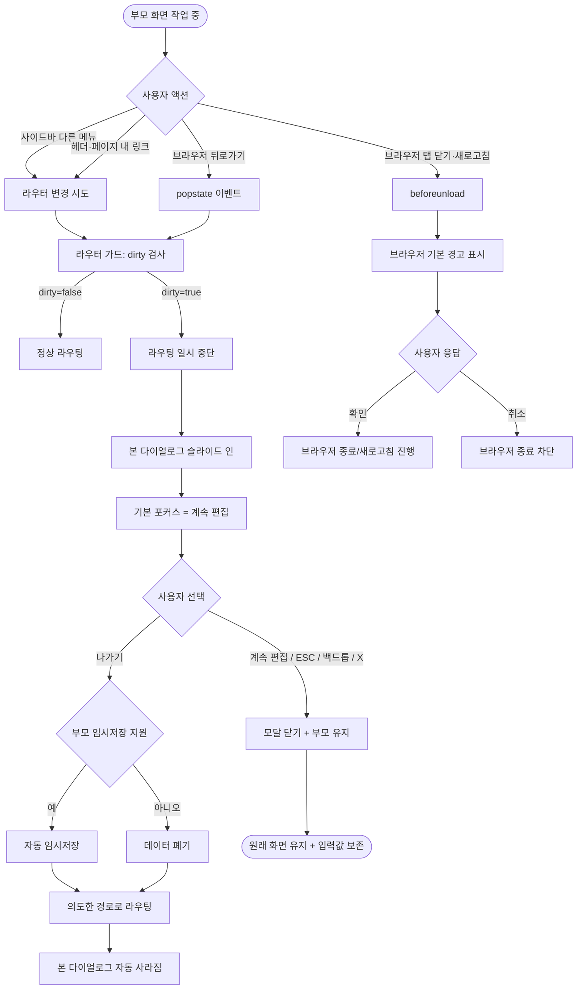
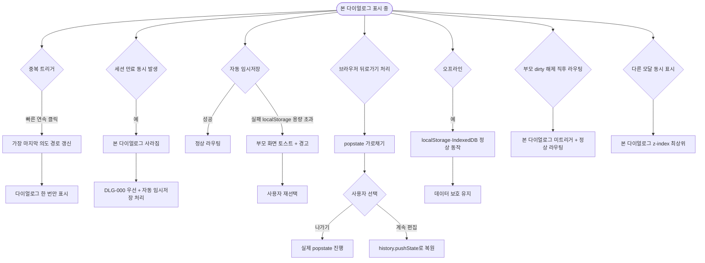

# DLG-002 이탈 경고 다이얼로그

## 1. 다이얼로그 메타 정보

이 문서는 이탈 경고 다이얼로그에 대한 자기완결형 요구사항 정의서입니다. 다른 문서를 함께 보지 않아도 이 문서 한 장만으로 다이얼로그의 모든 영역, 모든 버튼, 모든 권한, 모든 예외 처리, 그리고 이 다이얼로그를 지탱하는 운영 정책까지 전부 이해하고 구현할 수 있도록 작성합니다.

| 항목 | 값 |
|---|---|
| 작성일 | 2026-05-22 |
| 버전 | v1.0 |
| 상태 | 최신 통합본 반영 (정합화 완료) |
| 도메인 | D01 공통 |
| 다이얼로그 ID | DLG-002 |
| 다이얼로그명 | 이탈 경고 (미저장 변경사항 알림) |
| 다이얼로그 유형 | 차단형 확인 모달 (Confirmation Modal, 자동 트리거) |
| 라우트 (URL) | 단독 URL 없음 (전체 화면 공통 자동 호출) |
| 플랫폼 | 데스크톱(기본), 태블릿, 모바일 |
| 우선순위 | P0 (출시 필수 데이터 보호 흐름) |
| 기능코드 | DLG-002 (이탈 경고 본기능), 모든 입력 화면 공통 |
| 계약코드 | 본 다이얼로그 직접 계약코드 없음 |
| 계약 상태 | 비계약 본기능 |
| 부모 기능 prefix | DLG, MBR, STF, PRD, ATD 등 입력 폼이 있는 모든 도메인 |
| Lv1 코드 | DLG-002 |
| 부모 화면 | 회원 등록·수정·결제 처리·상담 등록·메모 작성 같은 dirty 상태가 발생하는 모든 입력 화면 |
| 호출되는 다이얼로그 | 본 다이얼로그가 다른 다이얼로그를 호출하지 않음 |

## 2. 다이얼로그 개요와 목적

이탈 경고 다이얼로그는 사용자가 등록·수정 화면에서 저장하지 않은 변경사항이 있는 상태로 다른 화면으로 이동하려 할 때, 데이터 손실을 막기 위해 부모 화면 위에 자동으로 떠 사용자의 의도를 확인받는 차단형 모달입니다. 사용자가 라우터를 다른 경로로 변경하려는 시점에 클라이언트가 부모 화면의 dirty 상태를 감지해 본 다이얼로그를 자동 트리거하며, 사용자가 명시적으로 "나가기" 또는 "계속 편집"을 선택하기 전까지 라우팅이 일시 중단됩니다.

이 다이얼로그가 다루는 운영 흐름은 다양합니다. 회원 등록 도중 사이드바의 다른 메뉴를 누르면 본 다이얼로그가 즉시 떠 작성 중인 정보가 사라질 위험을 알려주고, 회원 수정 화면에서 브라우저 뒤로가기를 누르면 본 다이얼로그가 트리거되어 데이터 손실 직전에 사용자가 한 번 더 선택할 기회를 가지며, 직원 정보 수정 도중 다른 회원의 알림을 누르면 본 다이얼로그가 떠 어디로 가는지를 함께 안내합니다. 스태프가 메모를 입력하다가 실수로 헤더 로고를 클릭해 대시보드로 가려고 할 때도 본 다이얼로그가 마지막 안전망 역할을 합니다.

이 다이얼로그는 단순 확인이 아니라, dirty 상태 자동 감지·이동 대상 URL 보존·임시저장 옵션·중복 트리거 차단·키보드 조작·접근성 포커스 트랩까지 모두 반영된 데이터 보호 안전망으로 동작합니다.

## 3. 호출 경로와 부모 화면

이 다이얼로그는 사용자의 명시적 클릭이 아니라 시스템이 자동으로 감지해 트리거하며, 호출 경로는 다음 다섯 가지가 있습니다.

첫 번째 경로는 사이드바(SCR-102)의 다른 메뉴 클릭입니다. 사용자가 입력 화면에서 작업 중에 사이드바의 다른 도메인 메뉴를 누르면 라우터가 라우팅을 시도하는 직전에 본 다이얼로그가 자동으로 떠 라우팅이 일시 중단됩니다.

두 번째 경로는 헤더·페이지 내부의 다른 화면으로 이동하는 링크 클릭입니다. 글로벌 검색 결과·알림 센터의 항목·테이블 행의 회원명 링크·"회원 추가" 같은 페이지 헤더 CTA가 다른 경로로의 라우터 변경을 트리거하면 본 다이얼로그가 자동으로 떠 사용자의 의도를 확인합니다.

세 번째 경로는 브라우저 뒤로가기·앞으로가기 버튼입니다. 사용자가 작업 도중 브라우저 네비게이션을 사용하면 본 다이얼로그가 자동으로 떠 라우팅이 일시 중단됩니다. 사용자가 "나가기"를 선택해야 실제로 뒤로가기가 진행됩니다.

네 번째 경로는 브라우저 탭 닫기·새로고침입니다. 브라우저 자체의 종료·새로고침 시도에 대해서는 본 다이얼로그 대신 브라우저 기본 경고(beforeunload)가 표시됩니다. 본 다이얼로그는 같은 SPA(Single Page Application) 내 라우팅에만 적용되며, 브라우저 수준의 이벤트는 기본 경고로 처리됩니다.

다섯 번째 경로는 같은 화면 안에서 큰 상태 전환이 일어나는 경우입니다. 예를 들어 회원 등록 폼에서 "초기화" 버튼을 눌러 작성 중인 모든 입력을 비우려고 할 때도 본 다이얼로그(또는 유사 패턴의 DLG-008 초기화 확인)가 트리거됩니다. 본 문서는 라우팅 이탈에 한정된 본 다이얼로그를 다룹니다.

본 다이얼로그가 떠 있는 부모 화면은 회원 등록(SCR-M002)·회원 수정(SCR-M003)·결제 처리·상담 등록·메모 작성·직원 등록·상품 등록 같은 입력 폼을 가진 모든 화면이 될 수 있습니다. 부모 화면의 dirty 상태가 감지된 경우에만 본 다이얼로그가 트리거되며, 작성 중인 입력이 없으면 트리거되지 않고 정상 라우팅됩니다.

본 다이얼로그에서 빠져나가는 경로는 두 가지입니다. "나가기"를 누르면 작성 중인 데이터가 임시저장되거나 폐기되고 원래 의도한 화면으로 라우팅됩니다. "계속 편집"을 누르면 다이얼로그가 닫히고 부모 화면이 그대로 유지됩니다.

## 4. 모달 구성요소

부모 화면 위에 어두운 백드롭이 깔리고 화면 중앙에 너비 약 400~440px의 모달 카드가 떠 있습니다. 모바일에서는 풀스크린에 가까운 폭으로 펼쳐집니다.

모달 헤더 좌측에는 노랑 또는 주황 톤의 경고 아이콘과 함께 "저장하지 않은 내용이 있습니다"라는 제목이 굵은 글씨로 표시됩니다. 헤더 우측에는 닫기(X) 버튼이 배치되어 "계속 편집"과 동일하게 처리됩니다.

본문 안내 영역에는 "작성하던 내용이 저장되지 않았어요. 정말 이 화면을 떠나시겠어요?"라는 자연어 안내가 표시됩니다. 본문 하단에 부모 화면이 정의한 이동 대상 안내(예: "회원 목록으로 이동")가 작은 글씨로 표시되어 사용자가 어디로 가려고 했는지를 직관적으로 알 수 있게 합니다. 부모 화면이 자동 임시저장을 지원하면 "이 화면을 떠나도 작성한 내용은 자동 저장되어 다음 방문 시 복원됩니다" 안내가 추가됩니다.

본문 아래에는 좌측에 "계속 편집" 보조 버튼, 우측에 "나가기" 주요 액션 버튼이 가로로 배치됩니다. 모바일에서는 두 버튼이 세로 스택으로 펼쳐지며 보조 액션("계속 편집")이 위쪽에 위치합니다.

ESC 키와 백드롭 클릭은 "계속 편집"과 동일하게 모달을 닫고 부모 화면이 유지됩니다. Enter 키는 현재 포커스된 버튼을 활성화합니다.

키보드 포커스 트랩이 적용되어 Tab 키로 포커스가 모달 안의 두 버튼 사이만 순환합니다. 모달이 열리는 순간 포커스는 안전한 기본값("계속 편집" 버튼)에 자동으로 배치되어 사용자가 Enter를 무심코 눌러도 의도하지 않은 데이터 손실이 발생하지 않습니다.

## 5. 동작 흐름

사용자가 부모 화면에서 라우팅을 시도하는 순간 클라이언트의 라우터 가드가 부모 화면의 dirty 상태를 검사합니다. dirty가 아니면 정상 라우팅이 진행되고 본 다이얼로그는 트리거되지 않습니다. dirty이면 라우팅이 일시 중단되고 본 다이얼로그가 부모 화면 위에 슬라이드 인 또는 페이드 인 애니메이션으로 표시되며, 사용자의 의도를 확인할 때까지 라우터는 원래 경로에 묶여 있습니다.

사용자가 "나가기" 주요 버튼을 누르면 클라이언트는 부모 화면이 정의한 임시저장 정책에 따라 처리합니다. 부모 화면이 자동 임시저장을 지원하면 localStorage의 임시저장 키(예: `draft:members:new` 또는 `draft:members:edit:{id}`)에 작성 중인 폼 데이터를 저장한 뒤 원래 의도한 화면으로 라우팅합니다. 부모 화면이 임시저장을 지원하지 않으면 작성 중인 데이터가 폐기되고 라우팅이 진행됩니다. 본 다이얼로그는 자동으로 사라지며 의도한 화면으로 즉시 이동합니다.

사용자가 "계속 편집"을 누르면 모달이 즉시 닫히고 부모 화면이 그대로 유지됩니다. 라우터는 원래 경로에 그대로 머물러 있으며 작성 중인 입력값은 모두 보존됩니다. ESC 키, 백드롭 클릭, 닫기(X) 버튼도 모두 "계속 편집"과 동일하게 처리됩니다.

브라우저 뒤로가기·앞으로가기의 경우 history API의 popstate 이벤트를 가로채 라우팅을 일시 중단하고 본 다이얼로그를 표시합니다. 사용자가 "나가기"를 선택해야 실제 popstate가 진행되며, "계속 편집"을 선택하면 history.pushState로 현재 경로가 다시 push되어 사용자의 뒤로가기가 무효화됩니다.

브라우저 탭 닫기·새로고침은 SPA 라우터의 통제 범위 밖이므로 본 다이얼로그가 아닌 브라우저 기본 경고(beforeunload)가 표시됩니다. 이 경우 클라이언트가 부모 화면의 dirty 상태에 따라 beforeunload 이벤트에 메시지를 등록하거나 해제합니다.

## 6. 버튼·아이콘·링크 액션 전체 정의

나가기 버튼(주요 액션)은 모달 본문 우측 하단에 배치됩니다. 클릭 시 부모 화면의 임시저장 정책에 따라 데이터를 저장하거나 폐기한 후 원래 의도한 경로로 라우팅이 진행되며 본 다이얼로그가 자동으로 사라집니다.

계속 편집 버튼(보조 액션, 기본 포커스)은 본문 좌측 하단에 배치됩니다. 클릭 시 모달이 즉시 닫히고 부모 화면이 변경 없이 유지됩니다. 라우터도 원래 경로에 머물러 있습니다.

닫기(X) 버튼은 모달 헤더 우측에 배치됩니다. "계속 편집"과 동일한 동작으로 모달을 닫습니다.

ESC 키는 "계속 편집"과 동일하게 모달을 닫습니다. 입력 폼에서 데이터가 사라질 위험이 있는 흐름이므로 ESC도 안전한 기본 동작(편집 유지)으로 매핑됩니다.

백드롭 클릭은 "계속 편집"과 동일하게 모달을 닫습니다.

Enter 키는 현재 포커스된 버튼을 활성화합니다. 기본 포커스가 "계속 편집"이므로 사용자가 무심코 Enter를 눌러도 데이터가 보존됩니다.

브라우저 뒤로가기·앞으로가기는 본 다이얼로그를 다시 트리거합니다. 사용자가 "나가기"를 선택하지 않는 한 라우팅이 진행되지 않습니다.

모든 버튼은 응답이 돌아오기 전까지 자동 비활성화되어 중복 클릭이 차단됩니다. 본 다이얼로그는 별도 API를 호출하지 않으므로 처리 중 상태가 거의 보이지 않지만, 부모 화면의 자동 임시저장 처리가 비동기로 진행되는 짧은 순간(약 100ms 이내)에는 "나가기" 버튼이 일시적으로 비활성화됩니다.

## 7. 호출되는 다이얼로그 동작

이탈 경고 다이얼로그는 다른 다이얼로그를 호출하지 않습니다.

다음과 같은 관계가 있습니다.

DLG-001 로그아웃 확인 다이얼로그는 본 다이얼로그와 별개로 동작합니다. 사용자가 명시 로그아웃을 트리거하면 DLG-001이 표시되며, DLG-001 내부에서 자동 임시저장 처리가 일어나므로 본 다이얼로그는 추가로 트리거되지 않습니다. 두 다이얼로그가 동시에 표시되지 않도록 단일 모달 큐가 관리됩니다.

DLG-004 저장 확인 다이얼로그는 부모 화면의 명시 저장 흐름에 등장하며, 사용자가 저장하지 않고 이탈하려 할 때만 본 다이얼로그가 트리거됩니다. 저장을 명시적으로 누르면 DLG-004 또는 즉시 저장 처리가 일어나며 본 다이얼로그가 트리거되지 않습니다.

DLG-008 초기화 확인 다이얼로그는 같은 화면 안에서 작성 중인 입력을 비우려는 흐름이며, 본 다이얼로그(라우팅 이탈)와는 분리된 별개 모달입니다.

## 8. 토스트와 안내 메시지

성공 토스트는 본 다이얼로그 자체에서는 사용되지 않습니다. "나가기" 선택 후 부모 화면의 자동 임시저장이 일어나면 부모 화면이 자체 토스트로 "임시저장되었어요" 안내를 표시할 수 있습니다.

실패 토스트는 본 다이얼로그에서 거의 발생하지 않습니다. 본 다이얼로그는 별도 API를 호출하지 않으므로 네트워크 실패에 의한 토스트가 없습니다.

확인 팝업은 본 다이얼로그 자체가 확인 단계이므로 추가로 사용되지 않습니다.

브라우저 기본 경고(beforeunload)는 본 다이얼로그와 분리되어 브라우저 탭 닫기·새로고침 시점에만 표시됩니다. 클라이언트가 부모 화면의 dirty 상태에 따라 beforeunload 메시지 등록 여부를 자동 관리합니다.

오프라인 안내는 본 다이얼로그가 떠 있는 동안 네트워크가 단절되어도 본 다이얼로그 자체에는 영향이 없습니다. 본 다이얼로그는 API 호출이 없는 클라이언트 측 흐름이기 때문입니다. 단 부모 화면의 자동 임시저장이 IndexedDB를 사용하면 오프라인에서도 정상 동작합니다.

## 9. 데이터 흐름과 외부 연동

본 다이얼로그는 별도 API를 호출하지 않습니다. 클라이언트 측 라우터 가드가 부모 화면의 dirty 상태를 추적하고 라우팅 시점에 본 다이얼로그를 자동 트리거합니다.

dirty 상태 감지는 부모 화면이 자체적으로 관리합니다. 부모 화면이 폼 상태를 관리하는 라이브러리(예: React Hook Form·Formik 또는 자체 상태 관리)와 연동되어 사용자가 입력란을 변경한 순간 dirty 플래그가 true로 전환되고, 사용자가 명시 저장을 완료하면 dirty 플래그가 false로 되돌아갑니다. 본 다이얼로그는 부모 화면이 제공하는 `isDirty()` 또는 컴텍스트 hook을 통해 이 플래그를 조회합니다.

자동 임시저장은 부모 화면의 정책에 따라 분기됩니다. 부모 화면이 임시저장을 지원하면 "나가기" 클릭 시 localStorage 또는 IndexedDB의 임시저장 키에 작성 중인 폼 데이터를 저장합니다. 임시저장 키 형식은 `draft:{route}:{id?}` 또는 `draft:{formId}` 같이 부모 화면이 자체 정의합니다. 본 다이얼로그는 임시저장 결과를 기다리지 않고 라우팅을 즉시 진행합니다.

원래 의도한 경로 보존은 라우터 가드가 next URL을 메모리에 잠시 보관하고, 사용자가 "나가기"를 선택한 시점에 그 경로로 라우팅합니다. 라우터 가드가 라우팅을 일시 중단한 사이에 사용자가 다른 메뉴를 추가로 누르면 가장 마지막 의도한 경로로 갱신됩니다.

브라우저 beforeunload 이벤트는 부모 화면이 자체적으로 등록·해제하며, 본 다이얼로그는 SPA 내 라우팅에만 적용됩니다. beforeunload 메시지의 본문은 브라우저 기본값(브라우저별 다름)이 사용되며, 사용자가 입력한 텍스트가 표시되지는 않습니다.

감사 로그는 본 다이얼로그 자체로 기록되지 않습니다. 본 다이얼로그는 데이터 변경 액션이 아니라 사용자 의도 확인 흐름이므로 별도 로그를 남기지 않습니다. 다만 사용자가 "나가기"를 선택한 후 부모 화면의 자동 임시저장이 일어나면 부모 화면 정책에 따라 임시저장 발생 사실이 운영 로그에 남을 수 있습니다.

알림 센터(NFR-19)는 본 다이얼로그와 직접 연동되지 않습니다. 다이얼로그 자체가 사용자에게 즉각 표시되는 차단형 UI이므로 알림 센터를 거치지 않습니다.

## 10. 화면 상태와 예외 처리

표시 상태는 다이얼로그가 부모 화면 위에 떠 있는 기본 상태입니다. 두 버튼이 활성화되어 사용자의 선택을 기다리며 키보드 포커스는 기본값("계속 편집" 버튼)에 배치됩니다.

처리 중 상태는 사용자가 "나가기" 버튼을 누른 직후 부모 화면의 자동 임시저장이 비동기로 진행되는 짧은 순간으로, 약 100ms 이내에 끝나며 사용자에게는 거의 보이지 않습니다.

완료 상태는 라우팅이 완료되어 의도한 화면이 표시된 직후로, 본 다이얼로그는 자동으로 사라집니다.

편집 유지 상태는 사용자가 "계속 편집" 또는 ESC·백드롭·닫기 버튼을 선택해 부모 화면이 유지되는 상태입니다. 라우터는 원래 경로에 그대로 머물러 있고 작성 중인 입력값이 모두 보존됩니다.

오프라인 상태는 네트워크 단절 중에도 본 다이얼로그가 정상 동작합니다. API 호출이 없는 클라이언트 측 흐름이기 때문입니다. 자동 임시저장이 localStorage 기반이면 오프라인에서도 정상 저장되며, IndexedDB 기반이면 동일하게 정상 저장됩니다.

중복 트리거 차단은 사용자가 빠르게 여러 메뉴를 클릭해도 본 다이얼로그가 한 번만 표시되도록 보장합니다. 가장 마지막 의도한 경로가 라우팅 대상으로 갱신되며, 추가 트리거는 무시됩니다.

부모 화면이 dirty가 아닌 상태로 전환된 직후(예: 저장 완료 직후) 라우팅이 일어나면 본 다이얼로그가 트리거되지 않고 정상 라우팅됩니다.

본 다이얼로그가 떠 있는 동안 같은 화면 안의 다른 다이얼로그(예: 입력 도중 띄운 상세 모달)는 z-index가 본 다이얼로그보다 낮게 설정되어 본 다이얼로그가 항상 가장 위에 표시됩니다.

세션 만료(DLG-000)가 본 다이얼로그가 떠 있는 중에 동시 발생하면 본 다이얼로그가 사라지고 DLG-000이 우선 표시됩니다. DLG-000의 자동 임시저장 처리가 일어나므로 사용자의 데이터는 보호됩니다.

자동 임시저장 실패(localStorage 용량 초과·접근 차단 등)가 발생하면 부모 화면이 자체 토스트로 "임시저장에 실패했어요. 데이터가 사라질 수 있습니다" 안내를 표시할 수 있고, 사용자는 다시 본 다이얼로그를 통해 결정하게 됩니다.

브라우저 뒤로가기·앞으로가기에 의한 본 다이얼로그 트리거가 popstate 처리와 충돌하면 클라이언트가 history.pushState로 현재 경로를 다시 push해 일관된 동작을 유지합니다.

## 11. 권한별 처리

이 다이얼로그는 모든 인증된 역할이 만나는 공통 데이터 보호 흐름이므로 권한별 동작이 동일합니다.

슈퍼관리자(superAdmin), 본사 최고관리자(primary), Owner(지점장), 매니저(manager), FC(fc), 스태프(staff), 트레이너(trainer), 프런트(front), 읽기 전용(readonly) 모든 역할이 본 다이얼로그를 동일한 모양과 동작으로 만나며, 어떤 역할에서도 본 다이얼로그가 숨겨지거나 비활성화되지 않습니다.

다만 부모 화면이 입력 폼을 가지는지 여부에 따라 본 다이얼로그의 트리거 가능 여부가 달라집니다. readonly 역할은 대부분의 화면에서 입력 폼에 접근하지 못하므로 dirty 상태가 발생할 일이 거의 없어 본 다이얼로그를 만나는 빈도가 낮습니다. 운영 권한이 있는 역할(owner·manager·staff·front 등)은 입력 화면에서 자주 본 다이얼로그를 만나게 됩니다.

본 다이얼로그가 호출되는 트리거(사이드바 클릭·헤더 링크·브라우저 네비게이션)는 인증된 사용자라면 동일하게 사용 가능합니다.

비로그인 사용자는 본 다이얼로그를 만나지 않습니다. 인증 화면(SCR-100, SCR-106)에는 dirty 상태가 발생하더라도 본 다이얼로그가 트리거되지 않거나, 트리거되더라도 보안상 라우팅이 차단됩니다.

권한 외에도 부모 화면 정책에 따라 자동 임시저장 가능 여부가 달라집니다. 본사 통합 모드에서 다른 지점 데이터를 작성 중일 때는 임시저장 키에 지점 ID가 포함되어 다른 지점에서는 복원되지 않도록 분리됩니다. PII가 포함된 입력은 임시저장 정책에 따라 마스킹된 상태로 저장되거나, 임시저장 자체가 비활성화됩니다.

권한 부족으로 인한 액션 차단은 본 다이얼로그에서 발생하지 않습니다. 본 다이얼로그는 데이터 보호 흐름이며 모든 역할에게 동일하게 적용됩니다.

## 12. 메인 흐름

이탈 경고 다이얼로그의 핵심 동작 흐름을 다이어그램으로 표현합니다.

## 13. 에러와 예외 흐름

이탈 경고 다이얼로그에서 발생할 수 있는 주요 에러와 그 처리 흐름을 다이어그램으로 표현합니다.

## 14. 핵심 디자인 요청사항

이 다이얼로그가 사용자에게 잘 작동하려면 다음 디자인 원칙이 시각적으로 명확히 드러나야 합니다.

모달 카드의 폭은 데스크톱에서 400~440px로 일정하게 유지되어 사용자가 한눈에 내용을 읽을 수 있어야 합니다. 모바일에서는 풀스크린에 가까운 폭으로 펼쳐져 작은 화면에서도 가독성이 보장되어야 합니다.

경고 아이콘은 노랑 또는 주황 톤으로, 위험 수준이 "데이터 손실 가능"임을 부드럽게 알려야 합니다. 삭제(DLG-003)와 같은 빨강 톤은 사용하지 않습니다.

주요 액션 버튼("나가기")은 강조색이지만 위험한 빨강 톤은 피하고 무채색 또는 중립 강조색을 사용해, 사용자가 "나가기"를 우발적으로 선택하지 않도록 합니다. 보조 액션 버튼("계속 편집")은 더 강조된 톤으로 안전한 기본 선택임을 시각적으로 강조해야 합니다.

키보드 포커스 표시는 명확한 외곽선 또는 그림자로 어느 버튼에 포커스가 있는지를 사용자가 직관적으로 알 수 있어야 합니다. Tab 순환 시 두 버튼 사이만 포커스가 이동하고 부모 화면으로 새지 않습니다. 기본 포커스가 "계속 편집"에 배치되어 사용자가 무심코 Enter를 눌러도 데이터가 보존됩니다.

부모 화면을 가리는 백드롭은 약 50% 투명도의 어두운 색으로, 부모 화면이 살짝 보이면서도 모달이 시선의 중심에 오도록 합니다. 사용자가 부모 화면의 입력 내용을 시각적으로 인지하면서 결정할 수 있게 합니다.

이동 대상 안내는 작은 글씨로 본문 하단에 부드럽게 배치되어 사용자가 "어디로 가는지"를 함께 확인할 수 있어야 합니다. 임시저장 가능 안내가 추가될 때는 그 옆에 작은 안내 아이콘과 함께 부드러운 톤으로 표시됩니다.

진입과 종료 애니메이션은 슬라이드 인 또는 페이드 인 0.2초 내외로 짧고 부드럽게 처리되어 사용자가 모달의 등장·소멸을 자연스럽게 인지할 수 있어야 합니다.

## 15. 운영 정책 (이 다이얼로그에 연결된 부분)

이 절은 본 다이얼로그가 의존하는 데이터 보호·자동 임시저장·라우터 가드·접근성 운영 정책을 외부 문서 참조 없이 풀어 적습니다.

자동 트리거 정책은 부모 화면이 dirty 상태인 채로 사용자가 라우팅을 시도하는 모든 시점에 본 다이얼로그가 자동으로 떠 데이터 손실을 차단하도록 보장합니다. 라우터 가드가 SPA 내 모든 라우팅 시도를 가로채 dirty 플래그를 검사하며, 어떤 트리거(사이드바·헤더·뒤로가기·앞으로가기)에서도 일관되게 본 다이얼로그가 트리거됩니다.

브라우저 수준 분리 정책은 본 다이얼로그가 SPA 내 라우팅에만 적용되도록 하고, 브라우저 탭 닫기·새로고침은 브라우저 기본 경고(beforeunload)로 분리합니다. 두 흐름이 동시에 트리거되지 않도록 클라이언트가 이벤트 등록·해제를 자동 관리합니다.

자동 임시저장 정책은 부모 화면이 임시저장을 지원하면 "나가기" 클릭 시 localStorage 또는 IndexedDB의 임시저장 키에 작성 중인 폼 데이터를 자동 저장하도록 합니다. 임시저장 키 형식은 부모 화면이 자체 정의하며 본 다이얼로그는 임시저장 발생 사실만 본문 안내에 노출합니다. 임시저장이 지원되지 않는 부모 화면에서는 데이터 폐기 안내가 본문에 명시되어 사용자가 인지하고 결정할 수 있게 합니다.

중복 요청 차단 정책은 사용자가 빠르게 여러 메뉴를 클릭해도 본 다이얼로그가 한 번만 표시되고 가장 마지막 의도한 경로로 라우팅되도록 보장합니다.

취소 시 입력값 유지 정책은 사용자가 "계속 편집" 또는 ESC·백드롭·닫기를 선택하면 부모 화면의 입력값이 모두 그대로 보존되도록 합니다. 라우터도 원래 경로에 그대로 머물러 있어 사용자가 작업을 즉시 이어 갈 수 있습니다.

키보드 조작 정책은 ESC 키로 "계속 편집"(안전), Enter 키로 현재 포커스 버튼 활성화, Tab 키로 모달 안 두 버튼 사이 포커스 순환을 보장합니다. 기본 포커스는 안전한 보조 액션("계속 편집")에 배치되어 사용자가 무심코 Enter를 눌러도 의도하지 않은 데이터 손실이 발생하지 않습니다.

접근성 포커스 트랩 정책은 본 다이얼로그가 떠 있는 동안 키보드 포커스가 모달 안에서만 순환하고 부모 화면의 요소로 빠져나가지 않도록 보장합니다. 스크린리더용 ARIA 속성(role=dialog, aria-modal=true, aria-labelledby, aria-describedby)이 적용되어 보조 기술 사용자도 정상적으로 사용할 수 있어야 합니다.

PII 임시저장 정책은 회원 이름·연락처·주민번호 같은 PII가 포함된 입력은 임시저장 키 자체에 마스킹된 형태로 저장하거나, 임시저장을 비활성화하도록 합니다. 본사 통합 모드에서는 지점 ID가 임시저장 키에 포함되어 다른 지점 사용자에게 복원되지 않도록 분리됩니다.

브라우저 history 처리 정책은 사용자가 뒤로가기·앞으로가기를 통해 본 다이얼로그를 우회하려는 시도를 popstate 이벤트 가로채기로 차단합니다. 사용자가 "계속 편집"을 선택하면 history.pushState로 현재 경로가 다시 push되어 사용자의 history 상태가 일관되게 유지됩니다.

다국어 정책은 본 다이얼로그의 모든 안내 메시지와 버튼 라벨을 i18n 키로 관리해 한국어 기본과 본사 정책에 따른 영어 등 다른 언어를 지원합니다.

이상의 정책은 본 다이얼로그를 구현·운영하는 사람이 별도 문서 없이 이 한 장으로 이해할 수 있도록 풀어 적었습니다. 정책이 바뀌면 이 문서가 함께 갱신되어야 하며, 코드 변경과 정책 변경은 항상 짝지어 진행됩니다.
