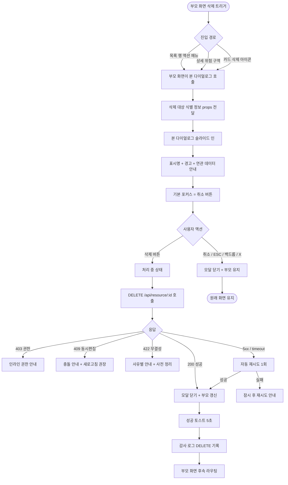
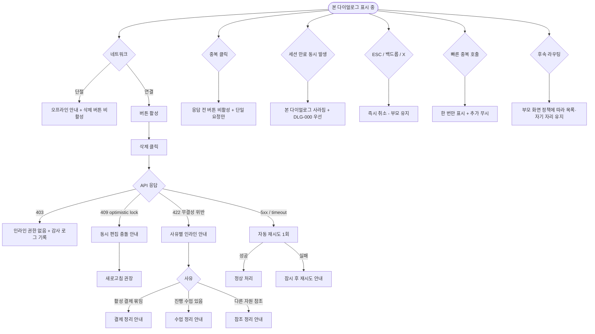

# DLG-003 삭제 확인 다이얼로그

## 1. 다이얼로그 메타 정보

이 문서는 삭제 확인 다이얼로그에 대한 자기완결형 요구사항 정의서입니다. 다른 문서를 함께 보지 않아도 이 문서 한 장만으로 다이얼로그의 모든 영역, 모든 버튼, 모든 권한, 모든 예외 처리, 그리고 이 다이얼로그를 지탱하는 운영 정책까지 전부 이해하고 구현할 수 있도록 작성합니다.

| 항목 | 값 |
|---|---|
| 작성일 | 2026-05-22 |
| 버전 | v1.0 |
| 상태 | 최신 통합본 반영 (정합화 완료) |
| 도메인 | D01 공통 |
| 다이얼로그 ID | DLG-003 |
| 다이얼로그명 | 삭제 확인 |
| 다이얼로그 유형 | 파괴적 확인 모달 (Destructive Confirmation Modal, 사용자 명시 트리거) |
| 라우트 (URL) | 단독 URL 없음 (전체 화면 공통 호출) |
| 플랫폼 | 데스크톱(기본), 태블릿, 모바일 |
| 우선순위 | P0 (출시 필수 데이터 보호 흐름) |
| 기능코드 | DLG-003 (삭제 확인 본기능), 각 도메인의 삭제 기능과 연계 |
| 계약코드 | 본 다이얼로그 직접 계약코드 없음 |
| 계약 상태 | 비계약 본기능 |
| 부모 기능 prefix | DLG, MBR, STF, PRD, CLS, MEM 등 삭제 가능 자원을 가진 모든 도메인 |
| Lv1 코드 | DLG-003 |
| 부모 화면 | 회원 상세·상품 목록·직원 목록·메모 카드·상담 카드·수업 카드 등 삭제 액션을 가진 모든 화면 |
| 호출되는 다이얼로그 | 본 다이얼로그가 다른 다이얼로그를 호출하지 않음 |

## 2. 다이얼로그 개요와 목적

삭제 확인 다이얼로그는 사용자가 어떤 자원(회원·상품·직원·메모·상담·수업 등)을 삭제하려고 버튼을 눌렀을 때, 삭제는 되돌릴 수 없는 파괴적 액션이라는 점을 한 번 더 알리고 사용자의 의사를 명시적으로 확인받는 파괴적 확인 모달입니다. 본 다이얼로그는 일반 확인 모달과 시각적 톤이 다르며, 강조색이 빨강 계열로 사용되어 사용자가 직관적으로 위험 수준을 인지할 수 있도록 설계됩니다.

이 다이얼로그가 다루는 운영 흐름은 다양합니다. 매니저가 잘못 등록된 메모 카드의 삭제 버튼을 눌렀을 때 본 다이얼로그가 떠 "정말 이 메모를 삭제하시겠어요?"를 묻고, Owner(지점장)이 더 이상 판매하지 않는 상품을 삭제할 때 본 다이얼로그가 "삭제 후에는 복구할 수 없습니다"를 안내하며, 스태프가 잘못 등록한 상담 카드를 삭제할 때 본 다이얼로그가 마지막 안전망 역할을 합니다. 회원·결제 같은 데이터 무결성이 더 강하게 요구되는 도메인의 삭제는 별도의 도메인 전용 모달(예: DLG-M002 회원 삭제, DLG-M013 환불 처리)이 사용되며, 본 다이얼로그는 그보다 가벼운 단일 자원 삭제 흐름에 사용됩니다.

이 다이얼로그는 단순 yes/no가 아니라, 대상 식별 명시·되돌릴 수 없음 경고·연관 데이터 영향 안내·중복 클릭 차단·키보드 조작·접근성 포커스 트랩까지 모두 반영된 파괴적 액션 안전망으로 동작합니다.

## 3. 호출 경로와 부모 화면

이 다이얼로그는 사용자의 명시적 클릭으로만 호출되며 호출 경로는 다음 네 가지가 있습니다.

첫 번째 경로는 목록 화면의 행 액션 삭제 버튼 클릭입니다. 상품 목록·직원 목록·수업 목록 같은 테이블 화면에서 행의 액션 메뉴(점 세 개 또는 행 끝 삭제 아이콘)를 통해 삭제를 트리거하면 본 다이얼로그가 호출됩니다.

두 번째 경로는 상세 화면의 헤더·위험 구역 삭제 버튼 클릭입니다. 회원 상세·상품 상세·수업 상세 같은 상세 화면에서 페이지 하단의 "위험 구역(Danger Zone)"에 배치된 삭제 버튼이나 헤더 우측 액션 메뉴의 삭제 항목을 누르면 본 다이얼로그가 호출됩니다.

세 번째 경로는 카드형 항목의 삭제 액션 클릭입니다. 메모 카드·상담 카드·이용권 카드 같은 카드 UI에서 카드 우측 상단의 삭제 아이콘이나 카드 메뉴의 삭제 항목을 누르면 본 다이얼로그가 호출됩니다.

네 번째 경로는 일괄 선택 후 일괄 삭제 버튼 클릭이지만, 일괄 삭제는 본 다이얼로그가 아닌 도메인 전용 모달(예: DLG-M005 일괄 탈퇴, DLG-M010 메모 삭제)이 처리합니다. 본 다이얼로그는 단일 자원 삭제에 한정됩니다.

본 다이얼로그가 떠 있는 부모 화면은 삭제 가능 자원을 가진 모든 화면이 될 수 있으며, 부모 화면이 본 다이얼로그를 호출하는 시점에 삭제 대상의 식별 정보(자원 종류, ID, 표시명, 연관 데이터 요약)를 props로 전달합니다. 본 다이얼로그는 그 정보를 모달 본문에 그대로 표시합니다.

본 다이얼로그에서 빠져나가는 경로는 두 가지입니다. 확인을 누르면 삭제 처리 후 부모 화면이 갱신되고 모달이 닫힙니다. 취소를 누르면 모달이 닫히고 부모 화면이 변경 없이 유지됩니다. 일부 부모 화면(예: 상세 화면에서 자기 자신을 삭제한 경우)은 삭제 성공 후 해당 자원의 목록 화면으로 라우팅하기도 합니다.

## 4. 모달 구성요소

부모 화면 위에 어두운 백드롭이 깔리고 화면 중앙에 너비 약 400~440px의 모달 카드가 떠 있습니다. 모바일에서는 풀스크린에 가까운 폭으로 펼쳐집니다.

모달 헤더 좌측에는 빨강 톤의 삭제 경고 아이콘(휴지통 또는 경고 삼각형)과 함께 "삭제하시겠습니까?"라는 제목이 굵은 글씨로 표시됩니다. 헤더 우측에는 닫기(X) 버튼이 배치되어 취소와 동일하게 처리됩니다.

본문 안내 영역에는 삭제 대상의 표시명이 굵게 강조되어 표시됩니다. 예를 들어 "회원 김OO의 메모를 삭제하시겠어요?" 또는 "상품 'PT 10회권'을 삭제하시겠어요?" 같이 사용자가 어떤 자원을 삭제하는지 즉시 인지할 수 있어야 합니다. 그 아래에 "삭제 후에는 복구할 수 없습니다"라는 경고 문구가 빨강 톤으로 표시됩니다.

부모 화면이 연관 데이터 영향 요약을 전달하면 본문 하단에 작은 글씨로 "이 메모는 회원 김OO에 속해 있고, 함께 등록된 첨부파일 2개가 함께 삭제됩니다" 같은 안내가 추가됩니다. 연관 데이터가 광범위한 자원(예: 회원 삭제)은 본 다이얼로그가 아닌 도메인 전용 모달이 사용됩니다.

본문 아래에는 좌측에 "취소" 보조 버튼, 우측에 "삭제" 주요 액션 버튼이 가로로 배치됩니다. "삭제" 버튼은 빨강 톤의 강조색으로 시각적 위계가 명확히 표현됩니다. 모바일에서는 두 버튼이 세로 스택으로 펼쳐지며 보조 액션("취소")이 위쪽에 위치합니다.

ESC 키와 백드롭 클릭은 취소와 동일하게 모달을 닫고 부모 화면이 유지됩니다. Enter 키는 현재 포커스된 버튼을 활성화합니다.

키보드 포커스 트랩이 적용되어 Tab 키로 포커스가 모달 안의 두 버튼 사이만 순환합니다. 모달이 열리는 순간 포커스는 안전한 기본값("취소" 버튼)에 자동으로 배치되어 사용자가 Enter를 무심코 눌러도 의도하지 않은 삭제가 발생하지 않습니다.

## 5. 동작 흐름

사용자가 부모 화면에서 삭제 트리거를 누르면 부모 화면이 본 다이얼로그를 호출하며 삭제 대상의 식별 정보(자원 종류, ID, 표시명, 연관 데이터 요약)를 props로 전달합니다. 본 다이얼로그는 그 정보를 본문에 표시하면서 슬라이드 인 또는 페이드 인 애니메이션으로 부모 화면 위에 표시됩니다.

사용자가 "삭제" 주요 버튼을 누르면 버튼이 비활성화되고 안에 스피너가 표시됩니다. 클라이언트는 부모 화면이 제공한 삭제 API(예: `DELETE /api/memos/:id`, `DELETE /api/products/:id`)를 호출합니다. 응답이 200이면 모달이 닫히고 부모 화면이 즉시 갱신됩니다. 목록 화면에서 호출된 경우에는 해당 행이 사라지면서 "삭제되었어요" 토스트가 표시되고, 상세 화면에서 자기 자신을 삭제한 경우에는 해당 자원의 목록 화면으로 자동 라우팅됩니다.

응답이 403이면 모달 본문에 "권한이 없어요" 인라인 메시지가 표시되고 "삭제" 버튼이 다시 활성화됩니다. 응답이 409이면 "다른 운영자가 동시에 편집했어요. 새로고침 후 다시 시도해주세요" 안내가 표시됩니다. 응답이 422이면 "이 자원은 다른 데이터와 연결되어 있어 삭제할 수 없어요" 같은 사유별 인라인 메시지가 표시됩니다(예: 활성 결제가 묶여 있는 상품). 응답이 5xx 또는 timeout이면 "잠시 후 다시 시도해주세요" 안내가 표시되고 자동 재시도 1회 후 사용자 액션을 기다립니다.

사용자가 "취소"를 누르면 모달이 즉시 닫히고 부모 화면이 그대로 유지됩니다. ESC 키, 백드롭 클릭, 닫기(X) 버튼도 모두 취소와 동일하게 처리됩니다.

중복 클릭 차단은 응답이 돌아오기 전까지 모든 버튼이 비활성화되어 같은 삭제 요청이 두 번 보내지지 않도록 보장합니다.

## 6. 버튼·아이콘·링크 액션 전체 정의

삭제 버튼(주요 액션, 빨강 강조)은 모달 본문 우측 하단에 배치됩니다. 클릭 시 부모 화면이 정의한 삭제 API가 호출되며 진행 중에는 비활성화 상태로 전환됩니다. 응답이 돌아오기 전 중복 클릭은 자동으로 차단됩니다.

취소 버튼(보조 액션, 기본 포커스)은 본문 좌측 하단에 배치됩니다. 클릭 시 모달이 즉시 닫히고 부모 화면이 변경 없이 유지됩니다.

닫기(X) 버튼은 모달 헤더 우측에 배치됩니다. 취소와 동일한 동작으로 모달을 닫습니다.

ESC 키는 취소와 동일하게 모달을 닫습니다. 파괴적 액션의 안전한 기본값으로 매핑됩니다.

백드롭 클릭은 취소와 동일하게 모달을 닫습니다.

Enter 키는 현재 포커스된 버튼을 활성화합니다. 기본 포커스가 "취소"이므로 사용자가 무심코 Enter를 눌러도 삭제가 실행되지 않습니다.

연관 데이터 안내 영역의 텍스트는 클릭할 수 없는 정보 표시 영역입니다.

브라우저 뒤로가기는 모달이 떠 있는 동안 라우터 변경을 시도하지만 본 다이얼로그가 z-index로 가장 위에 떠 있으므로 뒤로가기로 모달이 닫히지 않습니다. 사용자는 명시적으로 취소 또는 삭제를 선택해야 합니다.

모든 버튼은 응답이 돌아오기 전까지 자동 비활성화되어 중복 요청이 차단됩니다.

## 7. 호출되는 다이얼로그 동작

삭제 확인 다이얼로그는 다른 다이얼로그를 호출하지 않습니다.

다음과 같은 관계가 있습니다.

DLG-002 이탈 경고 다이얼로그는 본 다이얼로그가 떠 있는 동안에는 트리거되지 않습니다. 사용자가 본 다이얼로그를 열기 전 부모 화면이 dirty 상태였다면 부모 화면이 자체적으로 그 상태를 관리하며, 본 다이얼로그의 확인/취소 처리 후 부모 화면이 정상적으로 복귀합니다.

DLG-M002 회원 삭제, DLG-M005 탈퇴 처리, DLG-M013 환불 처리 같은 도메인 전용 파괴적 모달은 본 다이얼로그와 분리되어 별도로 동작합니다. 회원·결제 같은 데이터 무결성이 더 강하게 요구되는 도메인의 삭제는 추가 확인 입력(예: "탈퇴" 텍스트 입력)·차단 사유 분석·일괄 처리 등을 포함하는 도메인 전용 모달이 사용됩니다.

DLG-008 초기화 확인 다이얼로그는 본 다이얼로그와 별개로 동작합니다. 초기화는 입력 폼의 일시적 상태를 비우는 흐름이며, 삭제는 백엔드 데이터를 영구 제거하는 흐름입니다.

## 8. 토스트와 안내 메시지

성공 토스트는 삭제가 완료된 직후 부모 화면에서 우측 상단에 녹색 계열로 5초간 표시됩니다. 메시지 형식은 "삭제되었어요" 또는 "메모를 삭제했어요"처럼 부모 화면 정책에 따라 결정됩니다.

실패 토스트는 본 다이얼로그 본문에 인라인 메시지로 표시되거나 부모 화면 토스트로 표시됩니다. 403·409·422·5xx 같은 사유별로 메시지가 분기됩니다. 자동 재시도가 가능한 네트워크 오류는 1회까지 자동으로 다시 시도된 다음 사용자 액션을 기다립니다.

확인 팝업은 본 다이얼로그 자체가 확인 단계이므로 추가로 사용되지 않습니다.

연관 데이터 안내는 본문 하단의 정보 영역으로, 부모 화면이 전달한 영향 요약을 그대로 표시합니다. 예를 들어 "이 메모는 회원 김OO에 속해 있고, 함께 등록된 첨부파일 2개가 함께 삭제됩니다" 같은 안내가 표시되어 사용자가 영향 범위를 인지할 수 있게 합니다.

오프라인 안내는 본 다이얼로그가 떠 있는 동안 네트워크가 단절되면 모달 본문에 작은 배너로 "오프라인 상태입니다. 네트워크 복구 후 삭제가 가능합니다" 안내가 표시되고 "삭제" 버튼이 비활성화됩니다. 네트워크 복구 시 자동으로 활성화됩니다.

## 9. 데이터 흐름과 외부 연동

본 다이얼로그가 표시되기 직전에 부모 화면이 삭제 대상의 식별 정보(자원 종류, ID, 표시명, 연관 데이터 요약, 호출할 삭제 API, 후속 라우팅 경로)를 props 또는 컨텍스트로 전달합니다.

확인 클릭 시 클라이언트는 부모 화면이 제공한 삭제 API를 호출합니다. 일반적인 형식은 `DELETE /api/{resource}/:id`이며, 자원에 따라 `version` 헤더가 함께 전송되어 백엔드가 optimistic lock을 검증합니다. 요청 본문은 비어 있거나 `reason` 같은 선택적 필드만 포함합니다.

응답 성공 시 부모 화면이 즉시 갱신됩니다. 목록 화면이라면 해당 행이 사라지고 페이지네이션이 자동 조정되며, 상세 화면이라면 해당 자원의 목록 화면으로 자동 라우팅됩니다.

응답 실패 시 사유별로 분기됩니다. 403 권한 부족은 인라인 메시지로, 409 동시 편집 충돌은 모달 본문에 충돌 안내로, 422 연관 데이터 무결성 위반은 사유별 인라인 메시지로(예: "활성 결제가 묶여 있어 삭제할 수 없어요"), 5xx 또는 timeout은 자동 재시도 1회 후 사용자 액션 대기로 처리됩니다.

감사 로그는 모든 삭제 이벤트가 SCR-097 감사 로그에 비동기로 INSERT됩니다. 기록 필드는 `actor_id`, `action=DELETE`, `resource_type`(MEMO·PRODUCT·STAFF 등), `resource_id`, `before`(삭제 전 자원 스냅샷), `reason`(부모 화면이 전달한 사유 또는 사용자가 입력한 사유), `timestamp`입니다. 감사 로그 INSERT는 삭제 응답이 사용자에게 돌아간 후 5초 안에 보장됩니다.

알림 센터(NFR-19)는 자원 삭제 이벤트에 따라 관련 운영자에게 알림을 발송할 수 있습니다. 예를 들어 본인이 등록한 메모가 다른 운영자에 의해 삭제되면 본인에게 알림이 전달됩니다.

PII 마스킹 정책은 본 다이얼로그와 직접 연동되지 않으며, 부모 화면 또는 도메인 정책에 따라 처리됩니다. 회원·결제 같은 PII 포함 자원은 도메인 전용 모달로 처리되어 90일 마스킹·1년 hard delete 정책이 적용됩니다.

후속 라우팅은 부모 화면이 전달한 경로로 라우팅됩니다. 일반적으로 목록 화면에서 호출된 삭제는 같은 목록 화면이 갱신되고, 상세 화면에서 자기 자신을 삭제한 경우는 해당 자원의 목록 화면으로 라우팅됩니다.

## 10. 화면 상태와 예외 처리

표시 상태는 다이얼로그가 부모 화면 위에 떠 있는 기본 상태입니다. 두 버튼이 활성화되어 사용자의 선택을 기다리며 키보드 포커스는 기본값("취소" 버튼)에 배치됩니다.

처리 중 상태는 사용자가 "삭제" 버튼을 누른 직후로, 주요 버튼이 비활성화되고 안에 스피너가 표시됩니다. 취소 버튼·닫기 버튼·ESC·백드롭 클릭도 모두 비활성화되어 처리 중 강제 취소가 차단됩니다.

완료 상태는 삭제가 성공적으로 처리되어 모달이 닫히고 부모 화면이 갱신된 직후입니다.

실패 상태는 삭제 API가 403·409·422·5xx를 반환했을 때로, 모달은 닫히지 않고 본문에 사유별 인라인 메시지가 표시되며 "삭제" 버튼이 다시 활성화됩니다. 사용자가 사유를 확인하고 취소하거나 새로고침 후 재시도할 수 있습니다.

오프라인 상태는 네트워크 단절 중에 본 다이얼로그가 떠 있는 상태로, 본문에 오프라인 안내가 표시되고 "삭제" 버튼이 비활성화됩니다. 네트워크 복구 시 자동으로 활성화됩니다.

자동 재시도는 5xx 또는 timeout 오류 시 1회까지 백그라운드에서 일어나고, 그래도 실패하면 사용자에게 인라인 메시지로 알리고 액션을 기다립니다.

중복 클릭 차단은 응답이 돌아오기 전까지 모든 버튼이 비활성화되어 같은 요청이 두 번 보내지지 않도록 보장합니다.

동시 편집 충돌(409, optimistic lock 위반)이 발생하면 모달 본문에 "다른 운영자가 동시에 편집했어요. 새로고침 후 다시 시도해주세요" 안내가 표시되고 사용자가 부모 화면을 새로고침한 뒤 다시 시도해야 합니다.

연관 데이터 무결성 위반(422)은 사유별로 인라인 메시지가 분기됩니다. 활성 결제가 묶인 상품·진행 중인 수업이 있는 회원·다른 자원이 참조하는 직원 등은 삭제가 차단되고 사용자에게 사전 정리 안내가 표시됩니다.

본 다이얼로그가 떠 있는 동안 다른 다이얼로그(예: 부모 화면의 다른 모달)는 z-index가 본 다이얼로그보다 낮게 설정되어 본 다이얼로그가 항상 가장 위에 표시됩니다.

세션 만료(DLG-000)가 본 다이얼로그가 떠 있는 중에 동시 발생하면 본 다이얼로그가 사라지고 DLG-000이 우선 표시됩니다. 사용자가 재로그인 후 부모 화면으로 복귀해 다시 삭제를 시도해야 합니다.

여러 번의 빠른 클릭으로 본 다이얼로그가 중복 호출되어도 한 번만 표시되며, 추가 호출은 무시됩니다.

## 11. 권한별 처리

이 다이얼로그는 권한별 진입 가능 여부가 부모 화면의 정책에 따라 결정되며, 본 다이얼로그 자체는 모든 권한에서 동일한 모양과 동작으로 표시됩니다.

superAdmin와 primary는 모든 자원의 삭제가 가능하며 본 다이얼로그를 가장 자주 만나는 역할입니다. 본사 통합 모드에서 전 지점의 자원을 삭제할 수 있습니다.

Owner(지점장)은 자기 지점의 자원 삭제가 대부분 가능하며, 회원·결제 같은 데이터 무결성이 강한 자원은 도메인 전용 모달이 사용됩니다. 본 다이얼로그는 메모·상담·수업·상품 같은 일반 자원 삭제에 활용됩니다.

매니저(manager)는 본 다이얼로그를 통해 메모·상담·이용권 같은 운영 자원을 삭제할 수 있습니다. 회원 영구 삭제 같은 강한 파괴적 액션은 owner 이상으로 제한되어 본 다이얼로그가 노출되지 않습니다.

FC(fc)·트레이너(trainer)·스태프(staff)·프런트(front)는 자기가 등록한 자원(본인 메모·본인 상담)에 한해 본 다이얼로그를 만나며, 다른 사람이 등록한 자원의 삭제 버튼은 부모 화면에서 hidden 또는 비활성화 처리되어 본 다이얼로그가 호출되지 않습니다.

읽기 전용(readonly)은 본 다이얼로그를 만나지 않습니다. 모든 부모 화면에서 삭제 버튼이 hidden 처리됩니다.

권한 외에도 자원의 상태에 따라 삭제 가능 여부가 달라집니다. 활성 결제가 묶인 상품, 진행 중인 수업이 있는 회원, 다른 자원이 참조하는 직원 등은 백엔드에서 422로 거부되어 본 다이얼로그 본문에 사유별 안내가 표시됩니다.

권한 부족으로 인한 액션 차단은 다음 세 단계로 일관되게 처리됩니다. 첫째, 부모 화면의 삭제 버튼이 권한 없는 사용자에게 hidden 또는 비활성화 표시됩니다. 둘째, 사용자가 우회 클릭으로 본 다이얼로그까지 도달한 경우 "삭제" 버튼 클릭 시 백엔드 응답이 403이 되어 인라인 메시지로 차단됩니다. 셋째, 모든 권한 차단 이벤트는 감사 로그에 기록되어 사후 추적이 가능합니다.

## 12. 메인 흐름

삭제 확인 다이얼로그의 핵심 동작 흐름을 다이어그램으로 표현합니다.

## 13. 에러와 예외 흐름

삭제 확인 다이얼로그에서 발생할 수 있는 주요 에러와 그 처리 흐름을 다이어그램으로 표현합니다.

## 14. 핵심 디자인 요청사항

이 다이얼로그가 사용자에게 잘 작동하려면 다음 디자인 원칙이 시각적으로 명확히 드러나야 합니다.

모달 카드의 폭은 데스크톱에서 400~440px로 일정하게 유지되어 사용자가 한눈에 내용을 읽을 수 있어야 합니다. 모바일에서는 풀스크린에 가까운 폭으로 펼쳐져 작은 화면에서도 가독성이 보장되어야 합니다.

경고 아이콘은 빨강 톤(휴지통 또는 경고 삼각형)으로, 이 다이얼로그가 파괴적 액션임을 시각적으로 강하게 알려야 합니다. 일반 확인 모달(DLG-004 저장 확인)이나 이탈 경고(DLG-002)와 색상 톤이 명확히 구분되어야 합니다.

주요 액션 버튼("삭제")은 빨강 톤의 강조색으로 위험 수준을 표현해야 합니다. 보조 액션 버튼("취소")은 무채색 또는 부드러운 톤으로 시각적 위계가 명확해야 합니다. 두 버튼의 크기는 동일하지만 색상 대비로 어떤 버튼이 파괴적 액션인지 즉시 인지되어야 합니다.

삭제 대상의 표시명은 본문에서 굵게 강조되어 사용자가 어떤 자원을 삭제하는지 직관적으로 알 수 있어야 합니다. 표시명이 긴 경우(예: 30자 이상)에는 줄바꿈 또는 말줄임 처리로 가독성이 유지되어야 합니다.

"삭제 후에는 복구할 수 없습니다" 경고 문구는 빨강 톤으로 본문 내에서 시선이 즉시 가는 위치에 배치되어, 사용자가 결정 전에 반드시 인지하도록 해야 합니다.

연관 데이터 안내는 작은 글씨로 본문 하단에 부드럽게 배치되어 사용자가 영향 범위를 함께 확인할 수 있어야 합니다. 안내가 비어 있는 경우 영역 자체가 표시되지 않아 모달이 깔끔하게 유지됩니다.

키보드 포커스 표시는 명확한 외곽선 또는 그림자로 어느 버튼에 포커스가 있는지를 사용자가 직관적으로 알 수 있어야 합니다. Tab 순환 시 두 버튼 사이만 포커스가 이동하고 부모 화면으로 새지 않습니다. 기본 포커스가 "취소"에 배치되어 사용자가 무심코 Enter를 눌러도 삭제가 실행되지 않습니다.

부모 화면을 가리는 백드롭은 약 50% 투명도의 어두운 색으로, 부모 화면이 살짝 보이면서도 모달이 시선의 중심에 오도록 합니다.

진입과 종료 애니메이션은 슬라이드 인 또는 페이드 인 0.2초 내외로 짧고 부드럽게 처리되어 사용자가 모달의 등장·소멸을 자연스럽게 인지할 수 있어야 합니다.

## 15. 운영 정책 (이 다이얼로그에 연결된 부분)

이 절은 본 다이얼로그가 의존하는 데이터 보호·삭제 권한·감사 로그·접근성 운영 정책을 외부 문서 참조 없이 풀어 적습니다.

파괴적 액션 분리 정책은 본 다이얼로그를 일반 확인 모달(DLG-004 저장 확인)과 시각적·동작적으로 분리합니다. 빨강 톤 경고 아이콘과 강조색 "삭제" 버튼으로 사용자가 직관적으로 파괴적 액션임을 인지할 수 있어야 합니다. 데이터 무결성이 강한 도메인(회원·결제)의 삭제는 본 다이얼로그가 아닌 도메인 전용 모달(DLG-M002·DLG-M005·DLG-M013)이 사용되어 추가 안전 장치(텍스트 확인 입력·차단 사유 분석)가 적용됩니다.

되돌릴 수 없음 명시 정책은 본문 내 "삭제 후에는 복구할 수 없습니다" 경고 문구를 항상 표시하도록 합니다. 사용자가 결정 전에 영구 삭제임을 인지하지 못해 의도하지 않은 데이터 손실이 발생하지 않도록 합니다.

연관 데이터 영향 안내 정책은 부모 화면이 삭제 대상의 영향 범위 요약(연관 자원 종류·개수)을 전달하면 본문 하단에 부드러운 톤으로 표시되도록 합니다. 사용자가 어떤 데이터가 함께 사라지는지 인지하고 결정할 수 있어야 합니다.

중복 요청 차단 정책은 사용자가 "삭제" 버튼을 빠르게 여러 번 눌러도 응답이 돌아오기 전까지 버튼이 비활성화되어 같은 요청이 한 번만 백엔드에 도달하도록 보장합니다. 모든 확인형 모달의 공통 정책입니다.

취소 시 입력값 유지 정책은 사용자가 본 다이얼로그를 취소하고 부모 화면으로 돌아가면 부모 화면의 작성 중인 데이터가 그대로 유지되도록 합니다. 본 다이얼로그는 부모 화면의 상태를 변경하지 않으며, 취소는 부모 화면을 그대로 유지합니다.

키보드 조작 정책은 ESC 키로 취소(안전), Enter 키로 현재 포커스 버튼 활성화, Tab 키로 모달 안 두 버튼 사이 포커스 순환을 보장합니다. 기본 포커스는 안전한 보조 액션("취소")에 배치되어 사용자가 무심코 Enter를 눌러도 의도하지 않은 삭제가 발생하지 않습니다.

접근성 포커스 트랩 정책은 본 다이얼로그가 떠 있는 동안 키보드 포커스가 모달 안에서만 순환하고 부모 화면의 요소로 빠져나가지 않도록 보장합니다. 스크린리더용 ARIA 속성(role=alertdialog, aria-modal=true, aria-labelledby, aria-describedby)이 적용되어 보조 기술 사용자도 정상적으로 사용할 수 있어야 합니다. alertdialog 역할은 파괴적 액션 모달에 특화된 ARIA 패턴으로, 일반 dialog보다 강한 사용자 주의를 요청합니다.

권한 검증 단계 정책은 부모 화면(버튼 hidden 또는 비활성)·본 다이얼로그(클라이언트 검증)·백엔드(API 응답) 세 단계에서 모두 권한이 검증되도록 합니다. 우회 시도로 클라이언트 검증을 통과해도 백엔드가 403으로 거부하며 본 다이얼로그 본문에 인라인 안내가 표시됩니다.

데이터 무결성 보호 정책은 활성 결제가 묶인 상품·진행 중인 수업이 있는 회원·다른 자원이 참조하는 직원 등 무결성 제약이 있는 자원의 삭제를 백엔드에서 422로 거부합니다. 사용자에게는 사유별 인라인 안내와 사전 정리 가이드가 표시됩니다.

optimistic lock 정책은 동시 편집 충돌(409, version 불일치) 시 후행 삭제 요청을 거부해 무의미한 덮어쓰기·삭제를 방지합니다. 사용자에게 새로고침 후 재시도 안내가 표시됩니다.

감사 로그 정책은 모든 삭제 이벤트를 SCR-097 감사 로그에 actor·action=DELETE·resource_type·resource_id·before·reason·timestamp로 비동기 INSERT하며, 5초 안에 감사 로그 화면에서 조회 가능해야 합니다. 사후 추적과 보안 분석에 활용됩니다.

다국어 정책은 본 다이얼로그의 모든 안내 메시지와 버튼 라벨을 i18n 키로 관리해 한국어 기본과 본사 정책에 따른 영어 등 다른 언어를 지원합니다. 삭제 대상의 표시명은 부모 화면이 전달한 원본 값이 그대로 사용됩니다.

이상의 정책은 본 다이얼로그를 구현·운영하는 사람이 별도 문서 없이 이 한 장으로 이해할 수 있도록 풀어 적었습니다. 정책이 바뀌면 이 문서가 함께 갱신되어야 하며, 코드 변경과 정책 변경은 항상 짝지어 진행됩니다.
