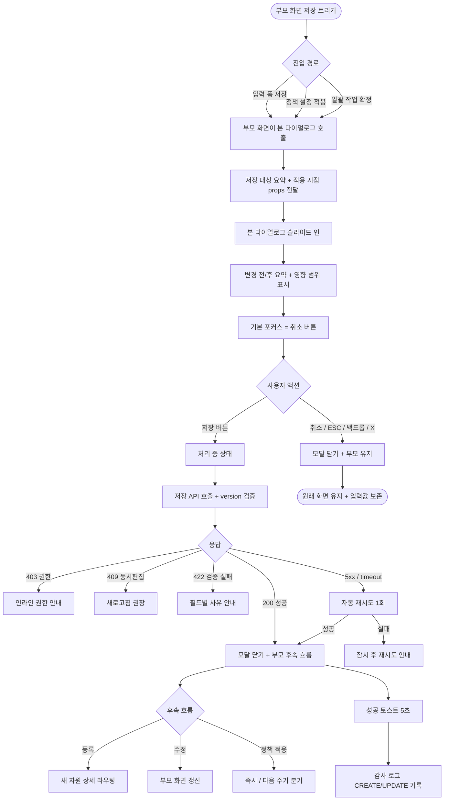
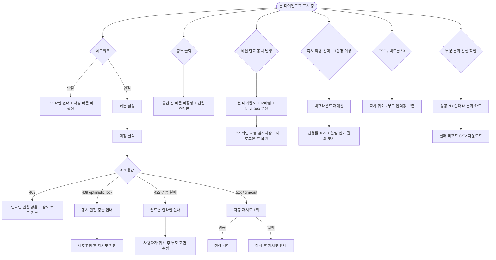

# DLG-004 저장 확인 다이얼로그

## 1. 다이얼로그 메타 정보

이 문서는 저장 확인 다이얼로그에 대한 자기완결형 요구사항 정의서입니다. 다른 문서를 함께 보지 않아도 이 문서 한 장만으로 다이얼로그의 모든 영역, 모든 버튼, 모든 권한, 모든 예외 처리, 그리고 이 다이얼로그를 지탱하는 운영 정책까지 전부 이해하고 구현할 수 있도록 작성합니다.

| 항목 | 값 |
|---|---|
| 작성일 | 2026-05-22 |
| 버전 | v1.0 |
| 상태 | 최신 통합본 반영 (정합화 완료) |
| 도메인 | D01 공통 |
| 다이얼로그 ID | DLG-004 |
| 다이얼로그명 | 저장 확인 |
| 다이얼로그 유형 | 확인형 모달 (Confirmation Modal, 사용자 명시 트리거) |
| 라우트 (URL) | 단독 URL 없음 (전체 화면 공통 호출) |
| 플랫폼 | 데스크톱(기본), 태블릿, 모바일 |
| 우선순위 | P0 (출시 필수 데이터 보호 흐름) |
| 기능코드 | MFN-SCR-105 (프로필 계정), 각 도메인의 저장 기능과 연계 |
| 계약코드 | 본 다이얼로그 직접 계약코드 없음 |
| 계약 상태 | 비계약 본기능 |
| 부모 기능 prefix | MFN, MBR, STF, PRD, CLS 등 입력 폼이 있는 모든 도메인 |
| Lv1 코드 | MFN-SCR-105 |
| 부모 화면 | 회원 등록·회원 수정·프로필 계정·상품 등록·수업 등록·메시지 발송 같은 중요 저장 흐름을 가진 모든 입력 화면 |
| 호출되는 다이얼로그 | 본 다이얼로그가 다른 다이얼로그를 호출하지 않음 |

## 2. 다이얼로그 개요와 목적

저장 확인 다이얼로그는 사용자가 등록·수정 화면에서 "저장" 또는 "확정" 버튼을 명시적으로 눌렀을 때, 변경 사항이 영구적으로 적용되기 전에 사용자의 의도를 한 번 더 확인받는 확인형 모달입니다. 모든 저장 버튼이 본 다이얼로그를 거치는 것은 아니며, 중요한 데이터 변경(예: 프로필 정보·결제 정보·정책 설정)이나 한 번 저장되면 영향 범위가 큰 변경(예: 회원 등급 정책·요금제 변경)에 대해 부모 화면이 선택적으로 본 다이얼로그를 호출합니다.

이 다이얼로그가 다루는 운영 흐름은 다양합니다. 본인이 SCR-105 프로필 계정 페이지에서 이메일·전화번호 같은 중요 정보를 수정하고 저장 버튼을 누르면 본 다이얼로그가 떠 "이 정보로 저장하시겠어요?"를 묻고, Owner(지점장)이 회원 등급 정책의 임계값을 수정한 뒤 저장하려 할 때 본 다이얼로그가 영향 범위 요약을 보여주며, 매니저가 일괄 메시지 발송 직전 본 다이얼로그를 거쳐 발송 대상 수와 메시지 미리보기를 최종 확인합니다.

이 다이얼로그는 단순 yes/no가 아니라, 저장 대상 요약·중요도별 강조·동시 편집 충돌 검증·중복 클릭 차단·키보드 조작·접근성 포커스 트랩까지 모두 반영된 데이터 무결성 안전망으로 동작합니다.

## 3. 호출 경로와 부모 화면

이 다이얼로그는 사용자의 명시적 클릭으로만 호출되며 호출 경로는 다음 세 가지가 있습니다.

첫 번째 경로는 입력 폼의 주요 저장 버튼 클릭입니다. SCR-105 프로필 계정, 회원 등록·수정, 직원 등록·수정, 상품 등록·수정 같은 입력 화면에서 본문 또는 하단의 "저장" 버튼을 누르면 부모 화면이 본 다이얼로그를 호출합니다. 부모 화면이 본 다이얼로그를 거치도록 정책상 정의된 경우에만 호출되며, 가벼운 자원(예: 메모 작성)은 본 다이얼로그를 거치지 않고 즉시 저장됩니다.

두 번째 경로는 정책 설정 화면의 적용 버튼 클릭입니다. 회원 등급 관리(SCR-M009)·세그먼트 관리(SCR-M010)·결제 정책 같은 운영 정책 화면에서 정책을 수정한 뒤 "저장" 또는 "적용" 버튼을 누르면 본 다이얼로그가 호출되어 영향 범위 요약과 적용 시점 안내가 표시됩니다.

세 번째 경로는 일괄 작업의 최종 확정 버튼 클릭입니다. 메시지 일괄 발송·일괄 이용권 변경·일괄 등급 수동 변경 같은 일괄 작업 화면에서 최종 확정 버튼을 누르면 본 다이얼로그가 호출되어 대상 수·처리 가능/불가 분리·최종 확인 입력이 표시됩니다. 단, 회원 일괄 탈퇴(DLG-M005)·결제 일괄 환불(DLG-M013) 같은 도메인 전용 모달은 본 다이얼로그와 별도로 동작합니다.

본 다이얼로그가 떠 있는 부모 화면은 본 다이얼로그를 호출한 입력 화면 그대로이며, 사용자의 저장 의도를 확인할 때까지 폼 입력값이 모두 보존됩니다. 부모 화면은 본 다이얼로그를 호출하는 시점에 저장 대상의 요약 정보(자원 종류, 변경 필드, 변경 전/후 값, 영향 범위, 호출할 저장 API)를 props로 전달합니다.

본 다이얼로그에서 빠져나가는 경로는 두 가지입니다. 확인을 누르면 저장 처리 후 부모 화면이 갱신되거나 다음 흐름(예: 상세 화면)으로 라우팅됩니다. 취소를 누르면 모달이 닫히고 부모 화면이 그대로 유지되어 사용자가 편집을 이어 갈 수 있습니다.

## 4. 모달 구성요소

부모 화면 위에 어두운 백드롭이 깔리고 화면 중앙에 너비 약 400~480px의 모달 카드가 떠 있습니다. 모바일에서는 풀스크린에 가까운 폭으로 펼쳐집니다.

모달 헤더 좌측에는 부드러운 톤의 저장 아이콘(디스켓 또는 체크)과 함께 "저장하시겠습니까?"라는 제목이 굵은 글씨로 표시됩니다. 헤더 우측에는 닫기(X) 버튼이 배치되어 취소와 동일하게 처리됩니다.

본문 안내 영역에는 저장 대상의 요약 정보가 표시됩니다. 단일 입력 폼이면 변경된 필드의 이름과 변경 전/후 값이 한 줄씩 나열되어 사용자가 어떤 값이 어떻게 바뀌는지 한눈에 확인할 수 있어야 합니다(예: "이메일: a@example.com → b@example.com"). 정책 설정이면 정책 항목과 영향 받을 회원 수가 표시되고(예: "골드 임계값: 200만원 → 300만원 / 영향 회원: 132명"), 일괄 작업이면 대상 수와 처리 가능/불가 분리가 표시됩니다.

부모 화면이 적용 시점 옵션을 전달하면 본문 하단에 라디오 또는 토글로 "즉시 적용" / "다음 주기에 적용" 같은 선택지가 표시됩니다. 부모 화면이 추가 사유 입력을 요구하면 텍스트 입력란이 본문에 함께 표시됩니다.

본문 아래에는 좌측에 "취소" 보조 버튼, 우측에 "저장" 주요 액션 버튼이 가로로 배치됩니다. 모바일에서는 두 버튼이 세로 스택으로 펼쳐지며 주요 액션("저장")이 위쪽에 위치합니다.

ESC 키와 백드롭 클릭은 취소와 동일하게 모달을 닫고 부모 화면이 유지됩니다. Enter 키는 현재 포커스된 버튼을 활성화합니다.

키보드 포커스 트랩이 적용되어 Tab 키로 포커스가 모달 안의 요소(라디오·텍스트 입력·두 버튼) 사이만 순환합니다. 모달이 열리는 순간 포커스는 안전한 기본값("취소" 버튼)에 자동으로 배치되어 사용자가 Enter를 무심코 눌러도 의도하지 않은 저장이 발생하지 않습니다.

## 5. 동작 흐름

사용자가 부모 화면에서 저장 트리거를 누르면 부모 화면이 본 다이얼로그를 호출하며 저장 대상의 요약 정보를 props로 전달합니다. 본 다이얼로그는 그 정보를 본문에 표시하면서 슬라이드 인 또는 페이드 인 애니메이션으로 부모 화면 위에 표시됩니다.

사용자가 "저장" 주요 버튼을 누르면 버튼이 비활성화되고 안에 스피너가 표시됩니다. 클라이언트는 부모 화면이 제공한 저장 API(예: `PUT /api/profile`, `POST /api/members`, `PATCH /api/grades`)를 호출합니다. 요청 본문에는 변경 필드와 `version`이 포함되어 백엔드가 optimistic lock을 검증합니다.

응답이 200이면 모달이 닫히고 부모 화면이 정의한 후속 흐름이 진행됩니다. 등록 흐름이라면 새로 생성된 자원의 상세 화면으로 자동 라우팅되고, 수정 흐름이라면 부모 화면이 갱신된 데이터로 새로고침되며 "저장되었어요" 토스트가 5초간 표시됩니다. 정책 적용 흐름이라면 본문에 표시된 적용 시점에 따라 즉시 재계산 배치가 백그라운드로 시작되거나 다음 주기 대기 상태로 전환됩니다.

응답이 403이면 모달 본문에 "권한이 없어요" 인라인 메시지가 표시되고 "저장" 버튼이 다시 활성화됩니다. 응답이 409이면 "다른 운영자가 동시에 편집했어요. 새로고침 후 다시 시도해주세요" 안내가 표시됩니다. 응답이 422이면 입력값 검증 실패 사유가 인라인으로 표시되며, 사유에 따라 사용자가 본 다이얼로그를 취소하고 부모 화면에서 입력값을 수정하도록 안내됩니다. 응답이 5xx 또는 timeout이면 자동 재시도 1회 후 사용자 액션을 기다립니다.

사용자가 "취소"를 누르면 모달이 즉시 닫히고 부모 화면이 그대로 유지됩니다. 입력값은 모두 보존되어 사용자가 편집을 이어 갈 수 있습니다. ESC 키, 백드롭 클릭, 닫기(X) 버튼도 모두 취소와 동일하게 처리됩니다. 본 다이얼로그가 사유 입력이나 적용 시점 선택을 받은 상태에서 사용자가 취소를 누르면 그 입력값은 폐기되며, 부모 화면의 원래 폼 입력값은 그대로 유지됩니다.

중복 클릭 차단은 응답이 돌아오기 전까지 모든 버튼이 비활성화되어 같은 저장 요청이 두 번 보내지지 않도록 보장합니다.

## 6. 버튼·아이콘·링크 액션 전체 정의

저장 버튼(주요 액션)은 모달 본문 우측 하단에 배치됩니다. 클릭 시 부모 화면이 정의한 저장 API가 호출되며 진행 중에는 비활성화 상태로 전환됩니다. 응답이 돌아오기 전 중복 클릭은 자동으로 차단됩니다.

취소 버튼(보조 액션, 기본 포커스)은 본문 좌측 하단에 배치됩니다. 클릭 시 모달이 즉시 닫히고 부모 화면이 변경 없이 유지됩니다. 부모 화면의 폼 입력값은 그대로 보존됩니다.

닫기(X) 버튼은 모달 헤더 우측에 배치됩니다. 취소와 동일한 동작으로 모달을 닫습니다.

ESC 키는 취소와 동일하게 모달을 닫습니다. 입력 폼의 안전한 기본값으로 매핑됩니다.

백드롭 클릭은 취소와 동일하게 모달을 닫습니다.

Enter 키는 현재 포커스된 버튼을 활성화합니다. 기본 포커스가 "취소"이므로 사용자가 무심코 Enter를 눌러도 저장이 실행되지 않습니다.

적용 시점 라디오·토글은 부모 화면이 정의한 옵션 중 하나를 선택합니다. 라디오의 기본 선택값은 부모 화면이 전달한 정책에 따르며, 일반적으로 "다음 주기에 적용"이 안전한 기본값으로 사용됩니다.

사유 입력 텍스트박스는 부모 화면이 요구하는 경우에 노출됩니다. 사용자가 입력한 사유는 저장 API의 요청 본문 또는 별도 감사 로그 필드로 함께 전송됩니다.

브라우저 뒤로가기는 모달이 떠 있는 동안 라우터 변경을 시도하지만 본 다이얼로그가 z-index로 가장 위에 떠 있으므로 뒤로가기로 모달이 닫히지 않습니다.

모든 버튼은 응답이 돌아오기 전까지 자동 비활성화되어 중복 요청이 차단됩니다.

## 7. 호출되는 다이얼로그 동작

저장 확인 다이얼로그는 다른 다이얼로그를 호출하지 않습니다.

다음과 같은 관계가 있습니다.

DLG-002 이탈 경고 다이얼로그는 본 다이얼로그가 떠 있는 동안에는 트리거되지 않습니다. 본 다이얼로그가 떠 있는 상태에서 사용자가 라우팅을 시도하면 본 다이얼로그 자체가 차단형으로 동작해 라우터 변경이 일어나지 않기 때문입니다.

DLG-003 삭제 확인 다이얼로그는 본 다이얼로그와 별개로 동작합니다. 저장은 데이터를 추가·변경하는 흐름이며 삭제는 데이터를 제거하는 흐름입니다.

DLG-008 초기화 확인 다이얼로그는 본 다이얼로그와 별개로 동작합니다. 초기화는 입력 폼의 일시적 상태를 비우는 흐름이며, 저장은 백엔드에 영구 반영하는 흐름입니다.

도메인 전용 저장 모달(예: DLG-M001 상태 변경, DLG-M013 환불 처리)은 본 다이얼로그와 분리되어 동작합니다. 각 도메인이 자체적으로 요구하는 추가 안전 장치(예: 텍스트 확인 입력·미수금 차단 분석)가 적용되는 경우에는 본 다이얼로그가 아닌 도메인 전용 모달이 사용됩니다.

## 8. 토스트와 안내 메시지

성공 토스트는 저장이 완료된 직후 부모 화면에서 우측 상단에 녹색 계열로 5초간 표시됩니다. 메시지 형식은 "저장되었어요" 또는 "프로필 정보를 업데이트했어요"처럼 부모 화면 정책에 따라 결정됩니다. 정책 적용 흐름에서는 "정책이 적용되었어요. 백그라운드 재계산이 진행됩니다" 같은 보조 안내가 추가됩니다.

실패 토스트는 본 다이얼로그 본문에 인라인 메시지로 표시되거나 부모 화면 토스트로 표시됩니다. 403·409·422·5xx 같은 사유별로 메시지가 분기됩니다. 자동 재시도가 가능한 네트워크 오류는 1회까지 자동으로 다시 시도된 다음 사용자 액션을 기다립니다.

확인 팝업은 본 다이얼로그 자체가 확인 단계이므로 추가로 사용되지 않습니다.

부분 결과 알림은 정책 적용·일괄 작업이 완료된 직후 결과 카드 형태로 부모 화면 중앙 하단에 머무를 수 있습니다. 본 다이얼로그 자체가 부분 결과를 직접 표시하지는 않으며, 모달이 닫힌 후 부모 화면이 결과 카드를 띄웁니다.

오프라인 안내는 본 다이얼로그가 떠 있는 동안 네트워크가 단절되면 모달 본문에 작은 배너로 "오프라인 상태입니다. 네트워크 복구 후 저장이 가능합니다" 안내가 표시되고 "저장" 버튼이 비활성화됩니다. 네트워크 복구 시 자동으로 활성화됩니다.

동시 편집 충돌 안내는 응답이 409일 때 모달 본문에 "다른 운영자가 동시에 편집했어요. 새로고침 후 다시 시도해주세요"가 인라인으로 표시됩니다.

## 9. 데이터 흐름과 외부 연동

본 다이얼로그가 표시되기 직전에 부모 화면이 저장 대상의 요약 정보(자원 종류, 변경 필드, 변경 전/후 값, 영향 범위, 호출할 저장 API, 적용 시점 옵션, 후속 라우팅 경로)를 props 또는 컨텍스트로 전달합니다.

확인 클릭 시 클라이언트는 부모 화면이 제공한 저장 API를 호출합니다. 일반적인 형식은 `POST /api/{resource}` 또는 `PUT /api/{resource}/:id` 또는 `PATCH /api/{resource}/:id`이며, 요청 본문에는 변경 필드·`version`·사용자가 입력한 사유·적용 시점이 포함됩니다.

응답 성공 시 부모 화면이 정의한 후속 흐름이 진행됩니다. 등록은 새로 생성된 자원의 상세 화면으로 라우팅, 수정은 부모 화면 갱신, 정책 적용은 적용 시점에 따라 즉시 재계산 또는 다음 주기 대기로 분기됩니다.

응답 실패 시 사유별로 분기됩니다. 403 권한 부족은 인라인 메시지로, 409 동시 편집 충돌은 모달 본문에 충돌 안내로, 422 입력값 검증 실패는 필드별 인라인 안내로, 5xx 또는 timeout은 자동 재시도 1회 후 사용자 액션 대기로 처리됩니다.

감사 로그는 모든 저장 이벤트가 SCR-097 감사 로그에 비동기로 INSERT됩니다. 기록 필드는 `actor_id`, `action=CREATE` 또는 `UPDATE` 또는 `POLICY_APPLY`, `resource_type`, `resource_id`, `before`, `after`(변경 전/후 JSON), `reason`, `timestamp`입니다. 감사 로그 INSERT는 저장 응답이 사용자에게 돌아간 후 5초 안에 보장됩니다.

알림 센터(NFR-19)는 정책 적용·일괄 작업·중요 데이터 변경에 따라 관련 운영자에게 알림을 발송할 수 있습니다. 예를 들어 회원 등급 정책이 변경되면 본사 권한자에게 변경 사실이 알림됩니다.

optimistic lock 검증은 백엔드가 `version` 필드를 비교해 동시 편집을 차단합니다. 부모 화면이 본 다이얼로그를 호출할 때 현재 row의 `version`을 함께 전달하고, 백엔드가 자기 row의 `version`과 비교해 일치하지 않으면 409로 거부합니다.

후속 라우팅은 부모 화면이 전달한 경로로 라우팅됩니다. 일반적으로 등록은 새 자원의 상세 화면, 수정은 부모 화면 그대로 유지(또는 상세 화면), 정책 적용은 정책 관리 화면 그대로 유지입니다.

## 10. 화면 상태와 예외 처리

표시 상태는 다이얼로그가 부모 화면 위에 떠 있는 기본 상태입니다. 저장 대상 요약과 두 버튼이 활성화되어 사용자의 선택을 기다리며 키보드 포커스는 기본값("취소" 버튼)에 배치됩니다.

처리 중 상태는 사용자가 "저장" 버튼을 누른 직후로, 주요 버튼이 비활성화되고 안에 스피너가 표시됩니다. 취소 버튼·닫기 버튼·ESC·백드롭 클릭도 모두 비활성화되어 처리 중 강제 취소가 차단됩니다.

완료 상태는 저장이 성공적으로 처리되어 모달이 닫히고 부모 화면이 후속 흐름으로 전환된 직후입니다.

실패 상태는 저장 API가 403·409·422·5xx를 반환했을 때로, 모달은 닫히지 않고 본문에 사유별 인라인 메시지가 표시되며 "저장" 버튼이 다시 활성화됩니다. 사용자가 사유를 확인하고 취소하거나 새로고침 후 재시도할 수 있습니다.

오프라인 상태는 네트워크 단절 중에 본 다이얼로그가 떠 있는 상태로, 본문에 오프라인 안내가 표시되고 "저장" 버튼이 비활성화됩니다.

자동 재시도는 5xx 또는 timeout 오류 시 1회까지 백그라운드에서 일어나고, 그래도 실패하면 사용자에게 인라인 메시지로 알리고 액션을 기다립니다.

중복 클릭 차단은 응답이 돌아오기 전까지 모든 버튼이 비활성화되어 같은 요청이 두 번 보내지지 않도록 보장합니다.

동시 편집 충돌(409, optimistic lock 위반)이 발생하면 모달 본문에 "다른 운영자가 동시에 편집했어요. 새로고침 후 다시 시도해주세요" 안내가 표시되고 사용자가 부모 화면을 새로고침한 뒤 다시 시도해야 합니다.

입력값 검증 실패(422)는 필드별 인라인 메시지로 분기됩니다(예: "이메일 형식이 올바르지 않습니다", "전화번호 중복"). 사용자는 본 다이얼로그를 취소하고 부모 화면으로 돌아가 입력값을 수정해야 합니다.

정책 적용 흐름의 즉시 적용 선택은 1만명 이상의 회원에게 영향이 미칠 경우 백그라운드 재계산으로 전환되며, 진행률이 모달 또는 부모 화면에서 표시되고 완료 시 알림 센터로 결과가 푸시됩니다.

본 다이얼로그가 떠 있는 동안 다른 다이얼로그(예: 부모 화면의 다른 모달)는 z-index가 본 다이얼로그보다 낮게 설정되어 본 다이얼로그가 항상 가장 위에 표시됩니다.

세션 만료(DLG-000)가 본 다이얼로그가 떠 있는 중에 동시 발생하면 본 다이얼로그가 사라지고 DLG-000이 우선 표시됩니다. 사용자가 재로그인 후 부모 화면으로 복귀해 다시 저장을 시도해야 하며, 자동 임시저장이 일어나면 입력값이 복원됩니다.

여러 번의 빠른 클릭으로 본 다이얼로그가 중복 호출되어도 한 번만 표시되며, 추가 호출은 무시됩니다.

## 11. 권한별 처리

이 다이얼로그는 권한별 진입 가능 여부가 부모 화면의 정책에 따라 결정되며, 본 다이얼로그 자체는 모든 권한에서 동일한 모양과 동작으로 표시됩니다.

슈퍼관리자(superAdmin)와 본사 최고관리자(primary)는 모든 자원·정책의 저장이 가능하며 본 다이얼로그를 가장 자주 만나는 역할입니다. 본사 통합 모드에서 전 지점에 영향이 미치는 정책 저장 시 본 다이얼로그가 영향 범위 요약을 자세히 표시합니다.

Owner(지점장)은 자기 지점의 자원·정책 저장이 대부분 가능하며, 본사 통합 정책 저장은 제외됩니다. 본 다이얼로그는 회원 등록·수정·상품 등록·수정·지점 한정 정책 저장에 활용됩니다.

매니저(manager)는 본 다이얼로그를 통해 회원·상품·수업 같은 운영 자원을 저장할 수 있습니다. 정책 설정 저장은 owner 이상으로 제한되어 본 다이얼로그가 노출되지 않거나, 노출되어도 권한 검증이 백엔드에서 차단됩니다.

FC(fc)·트레이너(trainer)·스태프(staff)·프런트(front)는 본인 권한 범위 내의 저장(예: 본인 프로필·본인 메모·본인 상담)에 한해 본 다이얼로그를 만나며, 다른 권한 범위의 저장 버튼은 부모 화면에서 hidden 또는 비활성화 처리되어 본 다이얼로그가 호출되지 않습니다.

읽기 전용(readonly)은 본 다이얼로그를 만나지 않습니다. 모든 부모 화면에서 저장 버튼이 hidden 처리됩니다.

권한 외에도 자원의 상태에 따라 저장 가능 여부가 달라집니다. 탈퇴된 회원의 수정·이미 환불된 결제의 수정 같은 경우는 백엔드에서 422로 거부되어 본 다이얼로그 본문에 사유별 안내가 표시됩니다.

권한 부족으로 인한 액션 차단은 다음 세 단계로 일관되게 처리됩니다. 첫째, 부모 화면의 저장 버튼이 권한 없는 사용자에게 hidden 또는 비활성화 표시됩니다. 둘째, 사용자가 우회 클릭으로 본 다이얼로그까지 도달한 경우 "저장" 버튼 클릭 시 백엔드 응답이 403이 되어 인라인 메시지로 차단됩니다. 셋째, 모든 권한 차단 이벤트는 감사 로그에 기록되어 사후 추적이 가능합니다.

## 12. 메인 흐름

저장 확인 다이얼로그의 핵심 동작 흐름을 다이어그램으로 표현합니다.

## 13. 에러와 예외 흐름

저장 확인 다이얼로그에서 발생할 수 있는 주요 에러와 그 처리 흐름을 다이어그램으로 표현합니다.

## 14. 핵심 디자인 요청사항

이 다이얼로그가 사용자에게 잘 작동하려면 다음 디자인 원칙이 시각적으로 명확히 드러나야 합니다.

모달 카드의 폭은 데스크톱에서 400~480px로 유지되어 사용자가 한눈에 내용을 읽을 수 있어야 합니다. 변경 필드가 많은 경우(예: 5개 이상) 본문이 스크롤되도록 처리되어 모달 자체가 너무 길어지지 않아야 합니다. 모바일에서는 풀스크린에 가까운 폭으로 펼쳐집니다.

저장 아이콘은 부드러운 톤(녹색 체크 또는 파랑 디스켓)으로, 이 다이얼로그가 안전한 데이터 변경 흐름임을 시각적으로 알려야 합니다. 삭제(DLG-003)와 같은 빨강 톤은 사용하지 않습니다.

주요 액션 버튼("저장")은 강조색(녹색 또는 파랑)으로 시각적 위계가 명확해야 합니다. 보조 액션 버튼("취소")은 무채색 또는 부드러운 톤으로 차별화됩니다. 두 버튼의 크기는 동일하지만 색상 대비로 어떤 버튼이 주요 액션인지 즉시 인지되어야 합니다.

변경 전/후 값 비교는 화살표 또는 두 칸 비교 형식으로 명확히 표현되어 사용자가 어떤 값이 어떻게 바뀌는지 한눈에 알 수 있어야 합니다. 변경된 값은 굵게 강조되거나 색상으로 구별되어 시각적 차이가 즉시 인지되어야 합니다.

영향 범위 안내는 작은 글씨로 본문 하단에 부드럽게 배치되어 사용자가 변경의 영향 범위(예: "영향 회원 132명")를 함께 확인할 수 있어야 합니다. 영향 범위가 큰 경우(예: 1만명 이상) 노랑 또는 주황 톤으로 추가 강조되어 사용자가 신중히 판단하도록 유도해야 합니다.

적용 시점 라디오·토글은 두 옵션이 명확히 구분되도록 시각적 위계가 적용되며, 안전한 기본 선택값("다음 주기에 적용")이 시각적으로 강조되어야 합니다.

키보드 포커스 표시는 명확한 외곽선 또는 그림자로 어느 요소에 포커스가 있는지를 사용자가 직관적으로 알 수 있어야 합니다. Tab 순환 시 모달 안 요소(라디오·텍스트 입력·두 버튼) 사이만 포커스가 이동하고 부모 화면으로 새지 않습니다. 기본 포커스가 "취소"에 배치되어 사용자가 무심코 Enter를 눌러도 저장이 실행되지 않습니다.

부모 화면을 가리는 백드롭은 약 50% 투명도의 어두운 색으로, 부모 화면이 살짝 보이면서도 모달이 시선의 중심에 오도록 합니다.

진입과 종료 애니메이션은 슬라이드 인 또는 페이드 인 0.2초 내외로 짧고 부드럽게 처리되어 사용자가 모달의 등장·소멸을 자연스럽게 인지할 수 있어야 합니다.

## 15. 운영 정책 (이 다이얼로그에 연결된 부분)

이 절은 본 다이얼로그가 의존하는 데이터 무결성·저장 권한·감사 로그·접근성 운영 정책을 외부 문서 참조 없이 풀어 적습니다.

선택적 호출 정책은 모든 저장 버튼이 본 다이얼로그를 거치는 것이 아니라, 부모 화면이 정책상 본 다이얼로그를 거치도록 정의한 경우에만 호출되도록 합니다. 가벼운 자원(예: 메모 작성·관심회원 토글)은 본 다이얼로그를 거치지 않고 즉시 저장되며, 중요 데이터(예: 프로필 정보·정책 설정·결제)는 본 다이얼로그를 거쳐 사용자가 최종 의도를 한 번 더 확인합니다.

변경 요약 명시 정책은 본문에 변경 전/후 값 비교가 항상 표시되도록 합니다. 사용자가 어떤 값이 어떻게 바뀌는지 한눈에 인지하지 못한 채 무심코 저장이 일어나지 않도록 합니다.

영향 범위 안내 정책은 정책 적용·일괄 작업처럼 영향 범위가 큰 변경에 대해 영향 받을 자원의 수(예: 회원 수·결제 건수)를 본문에 명시하도록 합니다. 1만명 이상의 영향이 예상되면 시각적 강조가 추가됩니다.

중복 요청 차단 정책은 사용자가 "저장" 버튼을 빠르게 여러 번 눌러도 응답이 돌아오기 전까지 버튼이 비활성화되어 같은 요청이 한 번만 백엔드에 도달하도록 보장합니다. 모든 확인형 모달의 공통 정책입니다.

취소 시 입력값 유지 정책은 사용자가 본 다이얼로그를 취소하고 부모 화면으로 돌아가면 부모 화면의 작성 중인 데이터가 그대로 유지되도록 합니다. 본 다이얼로그에서 입력한 사유나 적용 시점 선택은 모달 취소 시 폐기되지만, 부모 화면의 원래 폼 입력값은 보존됩니다.

키보드 조작 정책은 ESC 키로 취소(안전), Enter 키로 현재 포커스 버튼 활성화, Tab 키로 모달 안 요소 사이 포커스 순환을 보장합니다. 기본 포커스는 안전한 보조 액션("취소")에 배치되어 사용자가 무심코 Enter를 눌러도 의도하지 않은 저장이 발생하지 않습니다.

접근성 포커스 트랩 정책은 본 다이얼로그가 떠 있는 동안 키보드 포커스가 모달 안에서만 순환하고 부모 화면의 요소로 빠져나가지 않도록 보장합니다. 스크린리더용 ARIA 속성(role=dialog, aria-modal=true, aria-labelledby, aria-describedby)이 적용되어 보조 기술 사용자도 정상적으로 사용할 수 있어야 합니다.

권한 검증 단계 정책은 부모 화면(버튼 hidden 또는 비활성)·본 다이얼로그(클라이언트 검증)·백엔드(API 응답) 세 단계에서 모두 권한이 검증되도록 합니다. 우회 시도로 클라이언트 검증을 통과해도 백엔드가 403으로 거부하며 본 다이얼로그 본문에 인라인 안내가 표시됩니다.

optimistic lock 정책은 동시 편집 충돌(409, version 불일치) 시 후행 저장 요청을 거부해 무의미한 덮어쓰기를 방지합니다. 사용자에게 새로고침 후 재시도 안내가 표시됩니다.

적용 시점 안전 기본값 정책은 정책 적용 흐름에서 라디오의 기본 선택값을 "다음 주기에 적용"으로 설정해 사용자가 무심코 즉시 적용을 트리거하지 않도록 합니다. 즉시 적용은 사용자가 명시적으로 선택해야 활성화됩니다.

대용량 백그라운드 처리 정책은 즉시 적용 선택 후 1만명 이상의 영향이 예상되면 백그라운드 재계산으로 전환되도록 합니다. 사용자는 진행률을 부모 화면에서 확인할 수 있고, 완료 시 알림 센터(NFR-19)로 결과가 푸시됩니다.

자동 임시저장 연동 정책은 본 다이얼로그가 떠 있는 중에 세션 만료(DLG-000)가 동시 발생하면 본 다이얼로그가 사라지고 DLG-000이 우선 표시되도록 합니다. 부모 화면의 자동 임시저장이 일어나 재로그인 후 입력값이 복원되어 사용자가 작업을 이어 갈 수 있습니다.

감사 로그 정책은 모든 저장 이벤트를 SCR-097 감사 로그에 actor·action·resource·before·after·reason·timestamp로 비동기 INSERT하며, 5초 안에 감사 로그 화면에서 조회 가능해야 합니다. 사후 추적과 보안 분석에 활용됩니다.

다국어 정책은 본 다이얼로그의 모든 안내 메시지와 버튼 라벨을 i18n 키로 관리해 한국어 기본과 본사 정책에 따른 영어 등 다른 언어를 지원합니다. 변경 필드명과 값은 부모 화면이 전달한 원본 값이 그대로 사용됩니다.

이상의 정책은 본 다이얼로그를 구현·운영하는 사람이 별도 문서 없이 이 한 장으로 이해할 수 있도록 풀어 적었습니다. 정책이 바뀌면 이 문서가 함께 갱신되어야 하며, 코드 변경과 정책 변경은 항상 짝지어 진행됩니다.
