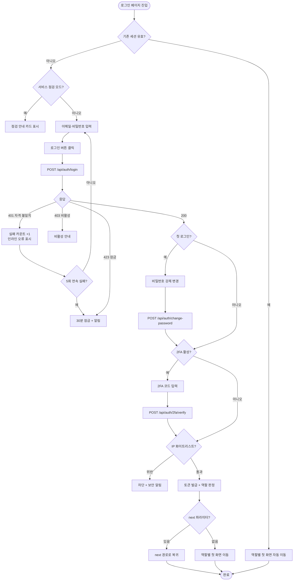
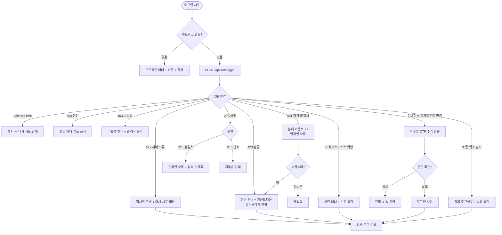

# SCR-100 로그인 페이지

## 1. 화면 메타 정보

이 문서는 관리자 로그인 페이지에 대한 자기완결형 요구사항 정의서입니다. 다른 문서를 함께 보지 않아도 이 문서 한 장만으로 로그인 페이지에 들어가는 모든 영역, 모든 버튼, 모든 다이얼로그, 모든 권한, 모든 예외 처리, 그리고 이 화면을 지탱하는 운영 정책까지 전부 이해하고 구현할 수 있도록 작성합니다.

| 항목 | 값 |
|---|---|
| 작성일 | 2026-05-22 |
| 버전 | v1.0 |
| 상태 | 최신 통합본 반영 (정합화 완료) |
| 도메인 | D01 공통 |
| 화면 ID | SCR-100 |
| 화면명 | 로그인 |
| 화면 유형 | 진입 화면 (단일 폼, 비로그인 공개) |
| 라우트 (URL) | `/login` |
| 플랫폼 | 데스크톱(기본), 태블릿, 모바일(풀스크린 진입) |
| 우선순위 | P0 (출시 필수) |
| 기능코드 | MFN-SCR-100 (로그인), AUTH-01 (인증 / 세션 / 보안 정책) |
| 계약코드 | AUTH-01 |
| 계약 상태 | 비계약 본기능 (계약 범위 외 운영 필수) |
| 부모 기능 prefix | MFN, AUTH |
| Lv1 코드 | MFN-SCR-100, AUTH-01 |
| Lv2 / Lv3 세분화 | MFN-SCR-100-01 ~ MFN-SCR-100-11 (이메일·비밀번호 입력, 로그인 상태 유지, 로그인 처리, 2FA, 첫 로그인 변경, 비밀번호 재설정, 잠금, 점검 모드), AUTH-01-01 ~ AUTH-01-08 (폼·인증·잠금·자동 로그아웃·첫 로그인·재설정·ID 찾기·감사 로그) |
| 연계 화면 | SCR-101 대시보드 통합, SCR-105 프로필 계정, SCR-106 비밀번호 재설정, SCR-108 에러 페이지(점검 모드), SCR-109 로그아웃 |
| 호출 다이얼로그 | DLG-000 세션 만료(다른 화면에서 만료 시 본 화면으로 유도) |

## 2. 화면 개요와 목적

로그인 페이지는 FitGenie CRM의 유일한 공개 진입점입니다. 외부에서 도메인에 접근한 모든 사용자는 인증되지 않은 상태에서 이 화면을 가장 먼저 만나며, 직원 등록(SCR-061)에서 발급된 로그인 계정으로 본인을 인증해야만 시스템의 다른 화면으로 이동할 수 있습니다. 본 시스템은 `직원 1명 = 로그인 계정 1개` 원칙을 따르므로, 공개 회원 가입이나 공용 운영 계정이 존재하지 않습니다. 로그인 시도자는 본사·지점에서 미리 발급받은 ID와 비밀번호로만 진입할 수 있고, 그 외 모든 경로(공유 링크·외부 임베드)는 인증 가드에 의해 본 화면으로 자동 리다이렉트됩니다.

이 화면이 다루는 운영 흐름은 단순한 인증 한 가지가 아닙니다. 본사 신임 슈퍼관리자가 처음 발급받은 임시 비밀번호로 들어왔다가 곧바로 비밀번호 강제 변경 화면으로 이동되어 새 비밀번호와 2FA를 등록하기도 하고, 매일 출근하는 센터장은 로그인 상태 유지 토글이 켜진 단말로 짧은 체크만 마치고 지점 대시보드로 이동하기도 하며, 매니저는 비밀번호를 분실하여 재설정 링크로 빠져나가기도 합니다. 5회 연속으로 비밀번호를 잘못 입력한 사용자에게는 30분 잠금이 걸리고, 본사 슈퍼관리자가 본사 외부 IP에서 슈퍼 권한으로 접근하려 하면 IP 화이트리스트로 차단됩니다. 점검 시간에는 폼 자체가 사라지고 점검 안내가 표시되며, 이미 로그인된 세션을 가진 사용자가 `/login`으로 다시 들어오면 폼을 거치지 않고 곧바로 자기 역할의 첫 화면으로 자동 우회됩니다.

따라서 이 화면은 단순한 이메일/비밀번호 폼이 아니라, 인증·역할 라우팅·보안 정책·세션 정책·서비스 점검 모드까지 모두 반영된 어드민 시스템의 출입구로 동작합니다.

## 3. 진입 경로와 인접 화면

로그인 페이지에 진입하는 경로는 여러 가지가 있고, 각 경로마다 화면이 초기 상태에서 사용자에게 보여주는 톤이 달라집니다.

첫 번째 경로는 도메인 직접 접근입니다. 사용자가 브라우저 주소창에 시스템 도메인을 입력하거나 북마크로 진입한 경우, 인증 가드가 로그인 토큰을 확인하고 토큰이 없으면 `/login`으로 리다이렉트합니다. 이 경우 폼은 빈 상태로 시작하며 이메일 입력란에 autofocus가 적용됩니다.

두 번째 경로는 보호 화면 직접 접근입니다. 사용자가 `/members`나 `/dashboard` 같은 보호된 URL을 비로그인 상태에서 직접 호출하면 인증 가드가 이를 차단하고 `/login?next={원래경로}` 형태로 리다이렉트합니다. 로그인이 완료되면 next 파라미터에 저장된 원래 경로로 자동 복귀합니다.

세 번째 경로는 세션 만료입니다. 다른 화면에서 작업 중 세션이 만료되면 DLG-000 세션 만료 다이얼로그가 표시되고, 사용자가 "재로그인" 버튼을 누르면 현재 화면의 URL이 next 파라미터로 보존된 채 본 화면으로 이동합니다. 재로그인 성공 시 만료 직전의 화면으로 자동 복귀합니다.

네 번째 경로는 명시적 로그아웃 후 복귀입니다. SCR-109 로그아웃 흐름이 완료되거나, 다른 기기 강제 종료(동시 세션 정책)·계정 비활성화 이벤트로 강제 로그아웃이 일어나면 본 화면으로 이동하며, 강제 로그아웃의 경우 상단 배너에 "다른 기기에서 로그인되어 세션이 종료되었습니다" 같은 사유 메시지가 함께 표시됩니다.

다섯 번째 경로는 비밀번호 재설정 완료 후 복귀입니다. SCR-106 비밀번호 재설정의 3단계(새 비밀번호 설정)에서 변경이 완료되면 기존 세션이 모두 무효화된 채 본 화면으로 이동하고, 변경 완료 토스트가 표시되어 새 비밀번호로 다시 로그인하도록 유도합니다.

이 화면에서 다시 빠져나가는 인접 화면으로는, 로그인 성공 직후 역할별 라우팅으로 진입하는 SCR-101 대시보드 통합(또는 역할별 지정 첫 화면), 비밀번호 재설정 링크 클릭으로 진입하는 SCR-106, 점검 모드에서 표시되는 안내성 정적 페이지(SCR-108 503 모드와 동일 톤)가 있습니다.

## 4. 레이아웃과 UI 구성

로그인 페이지는 사이드바와 상단 헤더가 모두 제거된 단일 카드형 레이아웃입니다. 본 시스템의 다른 화면이 사이드바·헤더·콘텐츠 영역의 3분할 구조를 따른다면, 이 화면만은 비로그인 전용 단순 레이아웃으로 분리되어 운영 메뉴 자체가 노출되지 않습니다. 데스크톱·태블릿에서는 화면 중앙에 너비 약 420px 정도의 로그인 카드가 떠 있고, 모바일에서는 카드가 전체 폭으로 펼쳐지며 풀스크린으로 표시됩니다.

가장 위에는 브랜드 헤더가 있습니다. 헤더에는 서비스 로고와 서비스명이 가운데 정렬로 표시되어, 사용자가 어떤 시스템에 진입했는지를 즉시 확인할 수 있습니다. 헤더 아래에는 점검 모드일 때만 등장하는 안내 배너 자리가 있어, 점검 모드에서는 폼 대신 점검 안내 카드가 같은 위치에 표시됩니다.

브랜드 헤더 바로 아래, 로그인 입력 폼 위에는 지점 선택 드롭다운이 위치합니다. 이 드롭다운은 멀티 브랜드 또는 멀티 지점 환경에서 로그인하려는 지점(또는 브랜드)을 먼저 선택하는 요소입니다. 선택된 지점 ID는 로그인 요청 시 함께 전송되어 서버가 해당 지점의 접근 범위와 권한 템플릿을 함께 검증합니다. 단일 지점·단일 브랜드 환경이거나 계정 자체에 지점이 이미 고정되어 있는 경우에는 드롭다운이 숨겨지거나 미리 선택된 상태로 비활성 표시됩니다.

브랜드 헤더 아래에는 로그인 입력 폼이 있습니다. 폼의 가장 첫 번째 행에는 이메일(또는 로그인 ID) 입력란이 배치되며 autofocus가 적용되어 페이지가 로드되자마자 키보드 포커스가 잡힙니다. 입력란은 type=email로 설정되어 모바일에서 이메일용 키보드가 뜨고, placeholder에는 "이메일을 입력하세요" 같은 안내가 표시됩니다. 한글·영문 입력을 모두 허용하지만 제출 시점에는 형식 검증이 작동해 `@`를 포함하지 않거나 비어 있으면 인라인 오류가 표시됩니다.

두 번째 행에는 비밀번호 입력란이 배치됩니다. type=password로 마스킹된 상태가 기본이며, 입력란 우측에 표시/숨김 토글 버튼(눈 모양 아이콘)이 붙어 있어 클릭으로 평문 보기와 마스킹을 전환할 수 있습니다. 평문 보기 상태는 5초 후 또는 입력란 포커스가 벗어날 때 자동으로 마스킹으로 되돌아갑니다. 빈 값으로 제출하면 인라인 오류가 표시됩니다.

세 번째 행에는 로그인 상태 유지(remember me) 체크박스가 있습니다. 체크된 상태에서 로그인하면 refresh token의 유효 기간이 7일로 길게 발급되어 단말이 기억되며, 체크되지 않은 상태로 로그인하면 브라우저 세션 단위로만 유지됩니다. 체크박스 오른쪽 끝에는 "비밀번호 재설정" 텍스트 링크가 배치되어, 클릭 시 SCR-106 1단계로 이동합니다.

폼의 가장 아래에는 로그인 버튼이 카드 폭에 맞춰 풀 폭으로 배치됩니다. 버튼은 강조색(주요 액션 컬러)이며, 폼이 유효하지 않거나 처리 중일 때는 비활성 상태가 됩니다. 처리 중에는 버튼 안에 스피너가 표시되고 라벨이 "로그인 중..."으로 바뀝니다.

로그인 카드 하단(폼 영역 바깥) 푸터 영역에는 서비스 점검 안내·약관·고객센터 같은 정적 링크가 작게 배치될 수 있으며, 본사 정책 또는 배포 플래그에 따라 노출 여부가 달라집니다. 신규 직원 가입을 허용하지 않는 시스템 특성상, 공개 회원가입 버튼은 어떠한 경우에도 노출되지 않습니다.

푸터 영역 아래에는 테스트 계정 프리셋 패널이 조건부로 표시됩니다. 이 패널은 개발(dev) 또는 스테이징(staging) 환경에서만 노출되며, 프로덕션 환경에서는 빌드 플래그에 의해 완전히 제거됩니다. 패널에는 슈퍼관리자·센터장·매니저·FC·트레이너·스태프·읽기전용 등 역할별 테스트 계정 프리셋이 버튼 형태로 나열됩니다. 프리셋 버튼을 클릭하면 해당 계정의 로그인 ID와 비밀번호가 입력란에 자동으로 채워지며, 개발자와 QA 담당자가 별도로 자격증명을 기억하지 않아도 역할별 화면을 빠르게 전환하며 테스트할 수 있습니다.

2FA가 활성화된 계정이 1차 인증(이메일·비밀번호)을 통과하면 폼이 통째로 2단계 인증 화면으로 전환됩니다. 2단계 화면에서는 로그인 카드가 동일한 자리에 유지된 채, 안에 6자리 숫자 인증 코드 입력란, 30초 쿨다운이 표시되는 재발송 버튼, 그리고 1단계로 돌아가는 링크가 표시됩니다. 인증 코드 입력란은 자동 포커스되며, 6자리를 모두 입력하면 별도 버튼 없이도 자동 제출되거나 명시적 "확인" 버튼이 활성화됩니다.

첫 로그인 또는 임시 비밀번호로 진입한 계정이 1차 인증을 통과하면 본 화면의 폼은 비밀번호 강제 변경 폼으로 전환됩니다. 강제 변경 폼에서는 새 비밀번호와 새 비밀번호 확인 두 입력란이 표시되고, 비밀번호 정책(최소 8자, 영문·숫자·특수문자 조합, 최근 5개 재사용 차단)이 인라인으로 검증되며, 변경 완료 전까지 다른 어떤 화면으로도 이동할 수 없습니다.

계정 잠금 상태(5회 실패 후 30분 잠금)에서 로그인 시도를 하면, 폼은 그대로 유지되지만 입력란 위에 잠금 안내 배너가 표시되고, 남은 잠금 시간이 분·초 단위로 카운트다운됩니다. 잠금 중에는 로그인 버튼이 비활성화되어 추가 시도가 차단되며, 카운트가 0초가 되면 자동으로 잠금이 풀리고 폼이 다시 활성화됩니다.

서비스 점검 모드에서는 폼 전체가 사라지고 그 자리에 점검 안내 카드가 표시됩니다. 카드에는 도구 모양 아이콘, "서비스 점검 중입니다" 제목, "점검 완료 후 이용 가능합니다" 설명, 점검 종료 예정 시각(설정된 경우)이 표시됩니다. 점검 모드 동안 로그인 API 호출 자체가 차단되므로 폼을 시도해도 응답 없이 안내만 표시됩니다.

## 5. 입력 폼과 단계별 동작

로그인 페이지는 사용자에게 보이는 단계가 최대 세 단계로 펼쳐질 수 있습니다. 1차는 이메일·비밀번호 입력 단계, 2차는 2FA 인증 코드 입력 단계, 3차는 임시 비밀번호 강제 변경 단계입니다. 1차만으로 종료되는 일반 로그인이 대부분이며, 2차·3차는 계정 설정에 따라 조건적으로 삽입됩니다.

1차 단계에서는 이메일·비밀번호·로그인 상태 유지 토글이 표시됩니다. 사용자는 이메일을 입력한 뒤 Tab으로 비밀번호로 이동하거나, 마우스로 직접 비밀번호 입력란을 클릭합니다. 두 필드가 모두 채워지고 이메일 형식 검증을 통과하면 로그인 버튼이 활성화됩니다. 사용자가 Enter 키를 누르면 폼 제출이 트리거되어 로그인 버튼 클릭과 동일한 동작이 일어납니다. 제출 시점에 다시 한 번 클라이언트 측 유효성 검증이 작동하며, 형식 오류가 있으면 해당 필드 아래에 인라인 오류 메시지가 표시되고 첫 오류 필드로 포커스가 자동 이동합니다.

이 단계에서 백엔드가 200(성공) 응답을 주면 응답에 포함된 사용자 역할(role), 계정 상태, 첫 로그인 여부, 2FA 활성화 여부를 보고 다음 단계가 결정됩니다. 첫 로그인 여부가 true이면 3차 단계(비밀번호 강제 변경)로 즉시 전환되고, 첫 로그인이 false이지만 2FA가 활성화되어 있으면 2차 단계(2FA 인증 코드 입력)로 전환됩니다. 둘 다 해당하지 않으면 곧바로 역할별 첫 화면으로 라우팅됩니다.

2차 단계에서는 1차 단계의 모든 필드가 사라지고 6자리 인증 코드 입력란이 화면 중앙에 표시됩니다. 코드는 계정에 등록된 OTP 채널(이메일 OTP 또는 인증 앱 TOTP)로 발송되며, 사용자는 받은 코드를 입력합니다. 입력란은 6자리 숫자만 허용하고 한 자리씩 자동 진행됩니다. 6자리가 모두 입력되면 자동 제출되거나 "확인" 버튼을 누를 수 있습니다. 코드가 일치하면 역할별 라우팅이 일어나고, 일치하지 않으면 "인증 코드가 올바르지 않습니다" 인라인 오류가 표시되며 입력란이 초기화되고 포커스가 다시 잡힙니다. 코드 만료(5분 경과)는 "인증 코드가 만료되었습니다. 재발송해주세요"로 안내됩니다. 코드 재발송 버튼은 30초 쿨다운이 적용되며, 쿨다운 동안에는 버튼이 비활성화되고 남은 시간이 초 단위로 표시됩니다.

3차 단계에서는 새 비밀번호 입력란과 새 비밀번호 확인 입력란이 표시됩니다. 비밀번호 정책 안내(최소 8자, 영문·숫자·특수문자 조합 필수, 사전 단어·연속 문자·최근 5개 재사용 차단)가 입력란 아래에 항상 노출되며, 입력 중 실시간으로 어느 조건을 충족했는지 체크 표시로 보여줍니다. 두 입력값이 일치하고 모든 조건을 충족하면 "변경 완료" 버튼이 활성화됩니다. 변경 완료 시 새 비밀번호가 저장되고, 기존 임시 토큰이 폐기된 후 일반 로그인 토큰이 새로 발급되어 역할별 첫 화면으로 자동 이동합니다.

로그인 상태 유지 토글이 켜진 상태로 로그인을 완료하면 refresh token이 7일 유효로 발급되고 단말이 기억됩니다. 토글이 꺼진 상태로 로그인하면 refresh token도 발급되지만 브라우저 종료 시 폐기되어 다음에는 다시 1차 단계부터 시작해야 합니다.

이미 유효한 세션을 가진 사용자가 `/login`에 직접 접근하면, 화면 진입 자체가 차단되고 인증 가드가 사용자의 역할에 따라 첫 화면으로 즉시 리다이렉트합니다. 이때 폼은 잠시도 노출되지 않습니다.

## 6. 버튼·아이콘·링크 액션 전체 정의

이 화면에 등장하는 모든 클릭 가능한 요소를 빠짐없이 정의합니다.

로그인 버튼은 이메일·비밀번호 두 필드가 모두 유효성 검증을 통과한 시점에 활성화됩니다. 클릭 시 클라이언트 측 검증을 다시 한 번 수행한 뒤 `POST /api/auth/login` 엔드포인트를 호출합니다. 요청 본문에는 email, password, rememberMe가 포함되고, 응답 대기 동안 버튼이 비활성화되며 안에 스피너가 표시됩니다. 응답이 200이면 다음 단계(2FA 또는 강제 변경) 또는 역할별 첫 화면 라우팅으로 진행하고, 401이면 "이메일 또는 비밀번호가 올바르지 않습니다"가 인라인으로 표시되며 실패 카운트가 +1 됩니다. 같은 메시지로 통일되는 이유는 계정 존재 여부 노출을 막기 위한 보안 정책 때문입니다.

비밀번호 표시/숨김 토글 버튼은 비밀번호 입력란 우측의 눈 모양 아이콘입니다. 클릭 시 입력란의 type 속성이 text와 password 사이에서 토글됩니다. 보안상 평문 상태는 5초 후 자동으로 마스킹으로 복원되며, 입력란이 blur 되어도 마스킹이 복원됩니다.

로그인 상태 유지 체크박스는 단순 토글이며, 체크/해제 시 클라이언트 측 상태만 변하고 별도 API 호출은 없습니다. 체크 상태는 로그인 요청에 rememberMe=true로 함께 전송됩니다.

비밀번호 재설정 링크는 폼 영역 아래의 텍스트 링크입니다. 클릭 시 SCR-106 비밀번호 재설정의 1단계(이메일 입력)로 이동하며, 이때 현재 폼에 입력 중이던 이메일이 있다면 1단계 이메일 입력란에 자동으로 채워집니다.

2FA 단계에서 인증 코드 입력란은 6자리 숫자만 허용하며 한 자리씩 자동 진행됩니다. 6자리가 모두 채워지면 onChange에서 자동으로 검증 API(`POST /api/auth/2fa/verify`)가 호출됩니다. 별도의 명시적 "확인" 버튼이 함께 제공될 수도 있으며, 같은 검증 API를 호출합니다.

2FA 단계의 재발송 버튼은 30초 쿨다운이 적용됩니다. 클릭 시 `POST /api/auth/2fa/resend`를 호출해 새 코드를 재발송하고, 쿨다운 동안 버튼이 비활성화되며 남은 시간이 카운트다운됩니다. 5분 안에 사용하지 않으면 코드가 만료되어 새로 발급받아야 합니다.

2FA 단계의 "1단계로 돌아가기" 링크는 클릭 시 현재 진행 중인 2단계를 취소하고 1차 폼으로 돌아갑니다. 이미 발급된 인증 코드는 그대로 남지만, 새로 1차 인증을 다시 거쳐야 2단계로 다시 진입할 수 있습니다.

3차 단계의 새 비밀번호 입력란들은 각각 표시/숨김 토글을 가집니다. 변경 완료 버튼은 두 입력값이 일치하고 비밀번호 정책을 모두 충족했을 때 활성화되며, 클릭 시 `POST /api/auth/change-password`를 호출합니다. 응답이 200이면 기존 임시 토큰이 폐기되고 새 정식 토큰이 발급되어 역할별 첫 화면으로 자동 이동합니다.

계정 잠금 안내 배너에는 별도의 클릭 가능 요소가 없지만, 안내 텍스트 안에 "관리자에게 문의" 링크가 포함될 수 있습니다. 이 링크는 본사 정책에 따라 별도 헬프 채널 또는 mailto 링크로 연결됩니다.

점검 모드에서는 폼이 사라지고 점검 안내 카드만 표시되므로 클릭 가능한 액션이 없습니다. 카드 안의 "고객센터" 링크는 본사 정책에 따라 외부 URL로 연결됩니다.

모든 버튼은 클릭 후 응답이 돌아오기 전까지 자동으로 비활성화되어 더블클릭이나 연타로 인한 중복 요청이 차단됩니다. 또한 동일 IP에서 1분당 N회 이상의 로그인 시도가 감지되면 rate limit이 발동되어 일시적으로 모든 시도가 차단됩니다.

## 7. 호출되는 다이얼로그 동작

이 화면에서 직접 호출되는 다이얼로그는 거의 없습니다. 로그인 폼은 자체 화면 안에서 단계 전환으로 모든 상태를 처리하기 때문에 별도의 모달이 떠 있을 일이 없기 때문입니다. 다만 본 화면과 깊게 연결된 DLG-000 세션 만료 다이얼로그가 다른 화면에서 트리거되어 본 화면으로의 진입을 유도하므로, 본 화면이 책임지는 동작을 정리합니다.

### 7-1. DLG-000 세션 만료 다이얼로그 (본 화면으로의 유입)

DLG-000은 본 화면에서 호출하는 것이 아니라 본 화면을 호출하는 다이얼로그입니다. 사용자가 다른 화면에서 작업 중 access token이 만료되거나 백엔드가 401을 반환하면, 그 화면 위에 DLG-000이 표시되고 사용자가 "재로그인" 버튼을 누르면 현재 화면 URL이 next 파라미터로 보존된 채 본 화면(`/login?next=/members`)으로 이동합니다.

본 화면이 책임지는 동작은 다음과 같습니다. URL 쿼리 파라미터 next를 안전하게 읽어 화이트리스트(같은 origin·허용 경로)와 비교한 뒤 유효하면 로그인 성공 후 그 경로로 자동 복귀시키고, 유효하지 않거나 비어 있으면 역할별 기본 첫 화면으로 라우팅합니다. next 값은 외부 URL이나 javascript: 프로토콜을 포함할 수 없으며, open redirect 공격을 방지하기 위해 같은 origin의 path만 허용합니다. 만료 직전에 다른 화면이 작성 중이던 폼 데이터를 localStorage에 자동 임시저장한 경우, 복귀 후 그 화면이 임시저장 데이터를 복원할 수 있도록 본 화면은 어떠한 임시저장 키도 임의로 삭제하지 않습니다.

본 화면이 직접 띄우는 별도의 모달이나 확인 팝업은 없으며, 모든 상호작용은 폼 단계 전환·인라인 오류·배너 형태로 화면 안에서 처리됩니다.

## 8. 토스트와 안내 메시지

로그인 페이지에서 발생하는 모든 알림성 UI는 다음과 같은 패턴으로 동작합니다.

성공 토스트는 우측 상단에 녹색 계열로 약 3~5초 동안 표시되며, "비밀번호가 변경되었습니다. 새 비밀번호로 로그인해주세요" 같은 짧은 안내를 띄웁니다. 비밀번호 재설정 직후 본 화면으로 복귀하는 경우, 또는 다른 기기에서 자동 로그아웃되었을 때 같은 메시지가 토스트로 전달됩니다. 토스트는 자동으로 사라지지만 닫기 버튼으로 즉시 닫을 수도 있습니다.

실패 안내는 토스트 대신 폼 안의 인라인 오류로 표시되는 것이 원칙입니다. "이메일 또는 비밀번호가 올바르지 않습니다", "인증 코드가 올바르지 않습니다", "비밀번호 형식이 올바르지 않습니다" 같은 메시지는 해당 필드 아래에 빨강 텍스트로 즉시 표시됩니다. 서버 오류(5xx)나 네트워크 단절은 폼 상단의 배너 또는 토스트로 분리하여 "일시적 오류가 발생했습니다. 잠시 후 다시 시도해주세요" 같은 안내와 함께 "다시 시도" 보조 액션을 제공합니다.

확인 팝업은 별도로 사용하지 않습니다. 사용자가 로그인 도중 다른 곳으로 이동하려 해도 작성 중인 폼 데이터가 클라이언트에 머무르지 않고 즉시 비워지므로 이탈 경고(DLG-002)도 트리거되지 않습니다.

알럿은 시스템 메시지에 가까운 차단형 안내로, 점검 모드 진입 시 폼 자체가 점검 안내 카드로 교체되어 표시되는 형태가 이에 해당합니다. 그 외 상황에서는 알럿을 사용하지 않습니다.

상단 강제 안내 배너는 두 가지 경우에 표시됩니다. 첫 번째는 다른 기기에서 로그아웃되어 본 화면으로 복귀한 경우로, "다른 기기에서 로그인되어 세션이 종료되었습니다" 같은 안내가 폼 위에 배너로 표시됩니다. 두 번째는 본사 슈퍼관리자가 IP 화이트리스트 외부에서 접근한 경우로, "허용된 네트워크에서 접속해주세요" 메시지가 배너로 표시되고 로그인 버튼이 비활성화됩니다.

## 9. 데이터 흐름과 외부 연동

이 화면은 인증 시스템과 직접 연결되는 핵심 출입구이므로, 어떤 데이터가 어디서 오고 어디로 가는지를 모두 풀어 씁니다.

화면 진입 시점에는 별도의 데이터 조회 API가 호출되지 않습니다. 다만 서비스 점검 모드 여부를 확인하기 위해 정적 설정 또는 `GET /api/system/status`가 한 번 호출되어, 점검 모드이면 폼 대신 점검 안내 카드를 렌더링합니다. 이미 유효한 세션이 있는지 확인하기 위해 `GET /api/auth/me`도 한 번 호출될 수 있고, 200 응답이면 곧바로 역할별 첫 화면으로 자동 우회됩니다.

1차 인증 시점에는 `POST /api/auth/login`이 호출됩니다. 요청 본문에는 email, password, rememberMe가 포함되며, 응답에는 사용자 ID, role, branchId(s), tenantId, permissions 배열, firstLogin 플래그, twoFactorRequired 플래그, lockUntil(잠금 상태인 경우), accessToken, refreshToken이 포함됩니다. accessToken은 15분, refreshToken은 7일 유효이며 rememberMe=false면 refreshToken은 브라우저 세션 단위로만 유지됩니다. 401 응답은 자격 불일치, 403은 계정 비활성, 423은 잠금 상태, 429는 rate limit, 503은 점검 모드를 의미합니다.

2FA 검증 시점에는 `POST /api/auth/2fa/verify`가 호출됩니다. 요청 본문에는 1차 인증에서 받은 임시 토큰 또는 challenge ID와 사용자가 입력한 6자리 코드가 포함되며, 응답이 200이면 정식 accessToken/refreshToken이 발급되고, 400이면 코드 불일치, 408이면 코드 만료입니다. 코드 재발송은 `POST /api/auth/2fa/resend`로 처리되며 30초 쿨다운이 백엔드에서도 강제됩니다.

비밀번호 강제 변경 시점에는 `POST /api/auth/change-password`가 호출됩니다. 요청 본문에는 임시 토큰과 새 비밀번호가 포함되며, 응답이 200이면 임시 토큰이 폐기되고 정식 토큰이 새로 발급됩니다. 비밀번호 정책 위반(사전 단어·연속 문자·최근 5개 재사용)은 422 응답으로 돌아오며 위반 사유가 응답 본문에 명시되어 인라인 오류로 분기됩니다.

비밀번호 재설정 진입은 `POST /api/auth/forgot-password`로 시작하지만 이 호출은 SCR-106에서 일어나므로 본 화면은 단순히 SCR-106 1단계로 라우팅만 합니다.

로그인 성공·실패·잠금·잠금 해제·비밀번호 변경 등 모든 인증 이벤트는 감사 로그 시스템(SCR-097)에 비동기로 INSERT됩니다. 기록되는 필드는 `actor_id`(사용자 ID, 실패 시 시도된 이메일), `action`(LOGIN_SUCCESS/LOGIN_FAILED/ACCOUNT_LOCKED/ACCOUNT_UNLOCKED/PASSWORD_CHANGED 등), `ip`(클라이언트 IP), `device`(디바이스 핑거프린트), `user_agent`, `result`, `timestamp`입니다. 감사 로그 INSERT는 응답이 사용자에게 돌아간 후 5초 안에 보장됩니다.

알림 센터(NFR-19)는 5회 실패 잠금, IP 화이트리스트 위반, 신규 단말 로그인, 다른 기기에서 강제 종료된 동시 세션 같은 보안 이벤트를 본인과 관리자에게 푸시합니다. 본인에게는 등록된 이메일과 알림 센터로, 관리자에게는 슈퍼관리자 채널로 동시에 발송됩니다.

비밀번호 만료 배치는 매일 새벽 3시에 실행되며, 비밀번호 변경일이 90일에 임박한 사용자에게 7일/3일/1일 전 알림을 발송합니다. 만료된 비밀번호로 로그인을 시도하면 1차 인증은 통과하되 비밀번호 변경 단계가 강제로 삽입됩니다.

잠금 자동 해제 배치는 잠금 시작 후 30분이 경과한 시점에 실행되어 잠금 카운트와 lockUntil 값을 초기화합니다. 슈퍼관리자는 `POST /api/auth/unlock`을 통해 30분이 지나기 전이라도 수동으로 잠금을 해제할 수 있습니다.

화면에서 호출하는 주요 API 엔드포인트는 다음과 같습니다. 시스템 상태 조회 `GET /api/system/status`, 현재 세션 조회 `GET /api/auth/me`, 로그인 `POST /api/auth/login`, 2FA 검증 `POST /api/auth/2fa/verify`, 2FA 재발송 `POST /api/auth/2fa/resend`, 비밀번호 변경 `POST /api/auth/change-password`, 토큰 갱신 `POST /api/auth/refresh`.

## 10. 화면 상태와 예외 처리

로그인 페이지는 다음 상태들을 가질 수 있고, 각 상태마다 사용자에게 보이는 모습이 달라집니다.

기본 상태에서는 빈 이메일·비밀번호 입력란과 비활성 로그인 버튼이 표시됩니다. 이메일 입력란에 autofocus가 적용되어 키보드 포커스가 잡혀 있고, 사용자가 한 글자라도 입력하면 입력 중 상태로 전환됩니다.

입력 중 상태에서는 클라이언트 측 형식 검증이 실시간으로 작동하여, 이메일에 `@`가 포함되었는지·빈 값이 아닌지를 확인합니다. 두 필드가 모두 검증을 통과한 시점부터 로그인 버튼이 활성화됩니다.

처리 중 상태에서는 로그인 버튼이 비활성화되며 안에 스피너가 표시되고 라벨이 "로그인 중..."으로 바뀝니다. 두 입력란도 비활성화되어 추가 입력이 차단됩니다.

인증 실패 상태에서는 폼 상단 또는 비밀번호 입력란 아래에 "이메일 또는 비밀번호가 올바르지 않습니다" 인라인 오류가 표시되고, 비밀번호 입력란이 자동으로 비워지며 포커스가 잡힙니다. 5회 누적 실패가 발생하면 잠금 상태로 전환됩니다.

잠금 상태에서는 폼 위에 자물쇠 아이콘과 함께 "30분 후 다시 시도해주세요" 메시지가 표시되고, 남은 시간이 분·초 단위로 카운트다운됩니다. 로그인 버튼은 비활성화되고, 입력란도 비활성화됩니다. 카운트가 0이 되면 자동으로 잠금이 풀리고 폼이 다시 활성화됩니다.

2FA 단계 상태에서는 1차 폼 대신 6자리 인증 코드 입력란이 표시되며, 자동 포커스되고 한 자리씩 자동 진행됩니다. 재발송 버튼은 30초 쿨다운이 적용됩니다.

첫 로그인(비밀번호 강제 변경) 상태에서는 1차 폼 대신 새 비밀번호·확인 입력란이 표시되며, 비밀번호 정책이 실시간 검증됩니다. 변경 완료 전까지 다른 어떤 경로로도 이동할 수 없도록 라우터 차단이 적용됩니다.

비활성 계정 상태에서는 1차 인증은 성공했지만 계정 자체가 비활성화된 경우로, "비활성화된 계정입니다. 관리자에게 문의해주세요" 안내가 폼 위에 표시되고 로그인 버튼이 비활성화됩니다.

IP 화이트리스트 위반 상태(슈퍼관리자 전용)에서는 폼 위에 "허용된 네트워크에서 접속해주세요" 배너가 표시되고 로그인 버튼이 비활성화됩니다. 본사 관리망 외부에서 슈퍼 권한으로 로그인을 시도한 경우에 발생하며, 보안 알림이 함께 발송됩니다.

서비스 점검 상태에서는 폼 자체가 사라지고 점검 안내 카드만 표시됩니다. 사용자는 어떠한 입력도 시도할 수 없으며, 점검 종료 후 자동으로 일반 상태로 전환됩니다.

오프라인 상태에서는 폼 위에 "네트워크에 연결되지 않았습니다" 배너가 표시되고 로그인 버튼이 비활성화됩니다. 네트워크가 복구되면 배너가 자동으로 사라지고 폼이 다시 활성화됩니다.

예외 케이스별 처리는 다음과 같이 정의됩니다.

이메일 형식 오류는 제출 전 인라인 유효성 안내로 처리됩니다. `@`가 없거나 빈 값이면 "올바른 이메일 형식을 입력해주세요" 메시지가 표시됩니다.

존재하지 않는 이메일과 비밀번호 불일치는 동일한 메시지("이메일 또는 비밀번호가 올바르지 않습니다")로 통일됩니다. 계정 존재 여부를 노출하지 않기 위한 보안 정책입니다.

5회 연속 실패는 30분 자동 잠금으로 처리되며, 본인 이메일과 슈퍼관리자에게 동시 알림이 발송됩니다. 잠금 중에는 어떤 시도를 해도 카운트가 증가하지 않고 남은 시간만 표시됩니다.

2FA 코드 만료는 "인증 코드가 만료되었습니다. 재발송해주세요" 안내와 함께 재발송 버튼이 활성화됩니다. 2FA 코드 불일치는 "인증 코드가 올바르지 않습니다"가 인라인으로 표시되고 입력란이 초기화됩니다.

비밀번호 정책 위반은 변경 완료 단계에서 422 응답으로 돌아오며, 위반 사유(길이·조합·사전어·재사용)가 인라인 오류로 표시되어 저장이 차단됩니다.

신규 디바이스에서 로그인하면 디바이스 핑거프린트가 미일치로 감지되어 추가 인증(이메일 OTP)이 요구됩니다. 본인 확인을 거치면 단말이 30일 동안 기억되어 다음 로그인에서는 추가 인증 없이 진행됩니다.

동시 세션 정책이 1세션 제한으로 설정된 환경에서 새 기기에서 로그인하면 이전 세션이 강제 종료되며, 이전 기기에는 "다른 기기에서 로그인되어 종료되었습니다" 모달이 표시됩니다.

JWT refresh 만료(7일 경과)는 별도 안내 없이 자동으로 로그인 화면으로 이동되며, 작성 중인 데이터는 자동 임시저장됩니다.

rate limit 초과(동일 IP 1분당 N회 이상)는 "잠시 후 다시 시도해주세요" 안내와 함께 일정 시간 후 재시도를 유도합니다.

서버 오류(5xx)는 "일시적 오류가 발생했습니다. 잠시 후 다시 시도해주세요" 토스트와 다시 시도 버튼이 표시됩니다.

토큰 위조·변조가 감지되면 즉시 강제 로그아웃되고 보안 알림이 슈퍼관리자에게 발송됩니다.

비밀번호 재설정 링크 만료(1시간 경과)는 SCR-106에서 처리되며 본 화면은 단순히 다시 발송 안내만 표시합니다.

## 11. 권한별 처리

이 화면은 본질적으로 비로그인 사용자가 진입하는 화면이므로 일반적인 권한별 처리와는 다른 방식으로 동작합니다. 다만 로그인 성공 직후의 역할 판정과 라우팅이 권한별로 분기되므로, 그 분기를 권한 단위로 정의합니다.

슈퍼관리자(superAdmin)는 로그인 성공 후 슈퍼 대시보드로 이동합니다. 본사 관리망 외부 IP에서 슈퍼 권한으로 접근하면 IP 화이트리스트에 의해 차단되며, 차단 즉시 보안 알림이 발송됩니다. 2FA가 미등록 상태이면 로그인 후에 "2FA 등록을 권장합니다" 배너가 표시되며, 첫 로그인 시점부터 7일이 경과하면 강제 등록 화면으로 진입됩니다.

본사 최고관리자(primary)는 로그인 성공 후 본사 대시보드(또는 지점 대시보드 통합)로 이동합니다. 권한 범위는 소속 브랜드 전체 지점이며, 본사 정책·감사 로그 등 본사 전용 메뉴에 접근할 수 있습니다.

센터장(owner)은 로그인 성공 후 지점 대시보드(SCR-090 DASH-01)로 이동합니다. 자동 로그인 토글이 켜진 상태로 매일 출근 직후 단말이 기억된 채 짧은 인증으로 빠르게 업무를 시작하는 것이 일반적인 패턴입니다.

매니저(manager)는 로그인 성공 후 지점 대시보드로 이동하며, 권한 범위는 소속 지점에 한정됩니다. 본사 정책·감사 로그는 차단됩니다.

FC(피트니스 코치, fc)는 로그인 성공 후 수업 캘린더 또는 지점 대시보드(운영 정책에 따라)로 이동합니다. 외근 중 모바일에서 로그인하면 디바이스 핑거프린트 변경이 감지되어 이메일 OTP로 추가 인증을 요구받습니다.

스태프(staff)와 프런트(front)는 로그인 성공 후 출석 관리 화면으로 이동합니다. 본사 정책에 따라 staff가 front를 포함하는 단일 표준 역할로 운영되므로, 두 역할은 같은 화면으로 라우팅됩니다.

트레이너(trainer)는 로그인 성공 후 수업 캘린더로 이동합니다. 본 시스템에서 trainer는 관리자 웹의 기본 표준 역할이 아니라 앱·수업 운영 관점의 역할로 분류되어 있으나, 어드민 진입이 필요한 운영 환경에서는 본 화면을 사용해 인증한 뒤 담당 화면으로 라우팅됩니다.

읽기 전용(readonly)은 로그인 성공 후 급여 명세서 또는 운영 정책으로 지정된 읽기 전용 기본 화면으로 이동합니다. 모든 변경 액션이 차단된 상태로 시스템에 진입합니다.

비활성·잠금·휴직 계정은 1차 인증을 통과해도 곧바로 해당 사유의 안내가 표시되고 어떤 화면으로도 진입할 수 없습니다. 비활성 계정에는 "비활성화된 계정입니다", 잠금 계정에는 "30분 후 다시 시도해주세요", 휴직 계정에는 "휴직 상태입니다. 관리자에게 문의해주세요" 안내가 폼 위에 표시됩니다.

권한 외에도 운영 모드에 따라 본 화면의 일부 영역이 달라집니다. 본사 IP 화이트리스트가 운영 중인 환경에서는 슈퍼관리자가 본사망 외부에서 접근할 때 차단 배너가 추가로 표시됩니다. 2FA 강제 등록 정책이 켜진 환경에서는 슈퍼관리자에게만 강제 등록 단계가 삽입됩니다. 동시 세션 1세션 제한 정책이 켜진 환경에서는 이전 세션이 강제 종료되며, 이전 기기로 알림이 발송됩니다.

권한이 부족해서 진입이 차단된 경우의 사용자 경험은 단계별로 일관됩니다. 첫째, 인증 자체가 실패한 경우(자격 불일치)에는 같은 메시지로 통일하여 계정 존재 여부를 노출하지 않습니다. 둘째, 인증은 성공했지만 계정 상태가 차단된 경우(비활성·잠금·휴직)에는 사유별로 명시적인 안내를 표시합니다. 셋째, IP·디바이스 같은 환경 조건 위반은 별도 배너로 명확히 안내합니다. 모든 차단 이벤트는 감사 로그에 기록되어 사후에 권한 우회 시도를 추적할 수 있게 합니다.

## 12. 메인 흐름

로그인 페이지의 핵심 동작 흐름을 다이어그램으로 표현합니다. 사용자가 화면에 진입한 시점부터 역할별 첫 화면 라우팅까지 이르는 가장 일반적인 정상 흐름입니다.

## 13. 에러 흐름

로그인 페이지에서 발생할 수 있는 주요 에러와 그 처리 흐름을 다이어그램으로 표현합니다. 잠금·점검·네트워크 오류·IP 화이트리스트 위반·rate limit 초과 같은 비정상 흐름이 어떻게 분기되는지를 정의합니다.

## 14. 운영 정책 — 인증 / 세션 / 보안 정책 자기완결 정리

이 절은 본 화면이 의존하는 인증·세션·보안 운영 정책을 외부 문서 참조 없이 풀어 적습니다.

비밀번호 정책은 최소 8자, 영문·숫자·특수문자 조합 필수입니다. 사전 단어, 연속 문자, 과거 5개 비밀번호 재사용이 차단됩니다. 비밀번호는 평문 저장이 금지되며 bcrypt 등 안전한 해시 알고리즘으로 저장되어 로그·응답에 절대 노출되지 않습니다. 비밀번호 만료 기간은 기본 90일이며 시스템 설정에서 30/60/90/180일로 변경 가능합니다.

세션 정책은 JWT 이중 구조를 사용합니다. access token은 15분, refresh token은 7일 유효이며 access 만료 시 refresh로 자동 갱신됩니다. 자동 로그아웃은 마지막 활동 후 30분 무활동 시 access·refresh를 모두 폐기합니다. 만료 직전 1분 시점에 토스트로 사용자에게 경고하고 작성 중 폼 데이터를 localStorage에 자동 임시저장합니다.

로그인 시도 정책은 같은 사용자 ID 기준으로 5회 연속 실패 시 30분 자동 잠금입니다. 잠금 카운트는 ID와 IP를 함께 보아 합법 사용자가 같은 IP를 이유로 차단되지 않도록 합니다. 동일 IP 1분당 N회 이상 시도는 rate limit으로 일시 차단됩니다.

다중 인증(2FA) 정책은 슈퍼관리자·센터장에게 권장이며, 정책에 따라 강제로 등록을 요구할 수 있습니다. 2FA 채널은 인증 앱 TOTP 또는 이메일 OTP이며 코드 유효 시간은 5분, 재발송 쿨다운은 30초입니다. 슈퍼관리자가 2FA를 등록하지 않은 상태로 로그인하면 권장 배너가 표시되고, 첫 로그인 후 7일이 경과하면 강제 등록 단계가 진입합니다.

IP 화이트리스트 정책은 슈퍼관리자·본사 최고관리자에게 적용되며, 본사 정책에 등록된 IP 범위에서만 로그인이 허용됩니다. 외부 IP에서 시도하면 차단되며 보안 알림이 발송됩니다.

디바이스 핑거프린트 정책은 신규 단말에서의 로그인을 추가 인증(이메일 OTP)으로 보호합니다. 본인 확인이 완료된 단말은 30일 동안 기억되며, 30일 경과 후에는 다시 신규 단말로 처리됩니다.

동시 세션 정책은 기본 다중 허용이며, 본사 정책에 따라 1세션 제한으로 설정할 수 있습니다. 1세션 제한에서 새 기기로 로그인하면 이전 세션이 즉시 강제 종료되고 이전 기기로 안내 모달이 전송됩니다.

계정 비활성화 정책은 직원 관리(STF)에서 비활성화 처리가 일어나는 즉시 활성 토큰을 모두 강제 만료시키며, 재로그인을 시도하면 비활성 안내가 표시됩니다. 비활성·휴직·잠금 상태에서는 본인이 비밀번호 재설정으로도 self-service 해제를 할 수 없으며, 슈퍼관리자만 수동 해제가 가능합니다.

감사 로그 정책은 로그인 성공·실패·잠금·잠금 해제·비밀번호 변경·로그아웃을 모두 SCR-097에 기록합니다. 기록 필드는 actor, IP, 디바이스, user agent, 결과, 시각이며, 부정 접근·계정 탈취 추적의 1차 자료로 사용됩니다.

서비스 점검 정책은 본사 슈퍼관리자가 점검 모드를 켤 때 본 화면 폼이 자동으로 점검 안내 카드로 교체되며, 점검 종료 후 정상 모드로 자동 복귀합니다. 점검 시간 동안 인증 API 자체가 503을 반환합니다.

비밀번호 재설정 정책은 1회용 링크와 1시간 유효 기간을 사용합니다. 링크는 사용 즉시 폐기되며, 만료된 링크로 접근하면 다시 발송 안내가 표시됩니다.

권한 변경 즉시 반영 정책은 세션 중 권한이 변경되면 다음 API 호출(refresh 시점)에 새 권한이 적용됩니다. 세션을 강제로 끊지는 않지만, 변경된 권한에 따라 사이드바와 액션이 자동 갱신됩니다.

다국어 정책은 한국어를 기본으로 하며, 본사 운영 정책에 따라 영어를 추가할 수 있습니다. 본 화면의 모든 안내·오류 메시지는 i18n 키로 관리됩니다.

## 15. 변경 이력

| 일자 | 변경 |
|---|---|
| 2026-05-22 | v1.0 자기완결형 요구사항 정의서로 통합본 작성 (기능명세서 MFN-SCR-100, AUTH-01, 화면설계서 SCR-100, 운영 정책 통합) |
