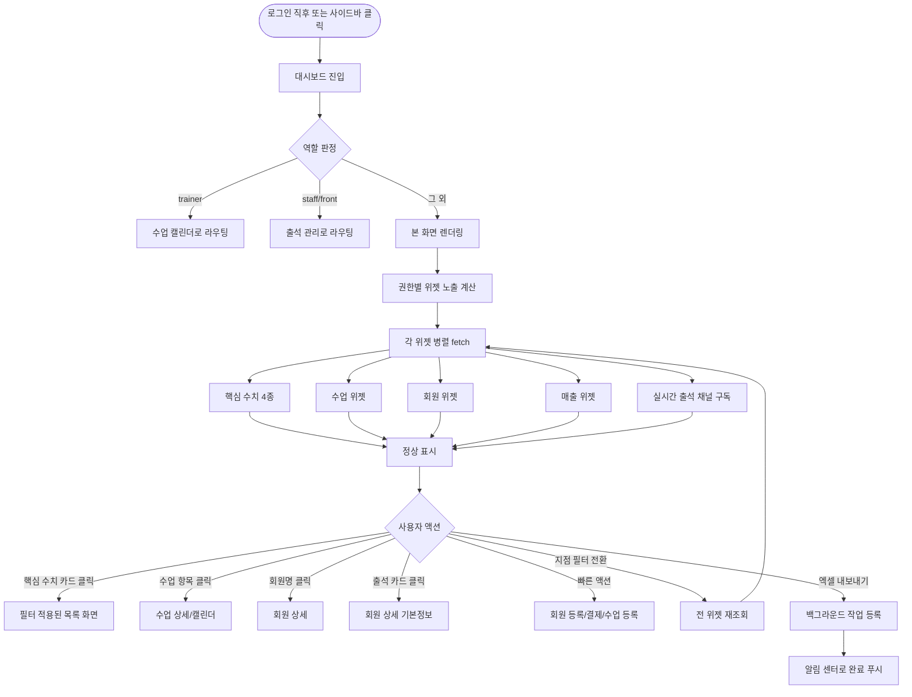
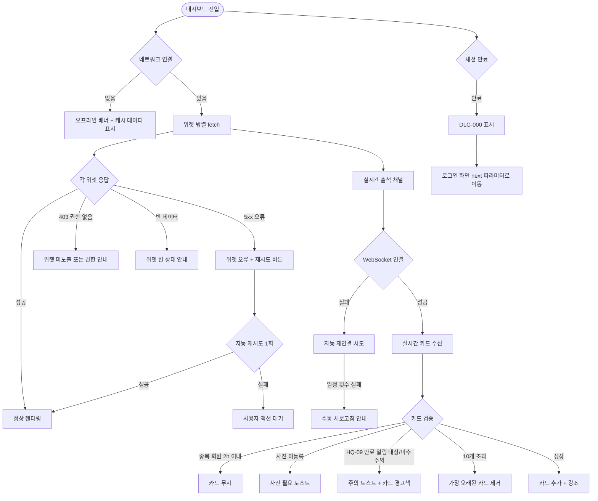

# SCR-101 대시보드 통합 페이지

## 1. 화면 메타 정보

이 문서는 대시보드 통합 페이지에 대한 자기완결형 요구사항 정의서입니다. 다른 문서를 함께 보지 않아도 이 문서 한 장만으로 대시보드에 들어가는 모든 영역, 모든 카드, 모든 위젯, 모든 버튼, 모든 권한, 모든 예외 처리, 그리고 이 화면을 지탱하는 운영 정책까지 전부 이해하고 구현할 수 있도록 작성합니다.

| 항목 | 값 |
|---|---|
| 작성일 | 2026-05-22 |
| 버전 | v1.0 |
| 상태 | 최신 통합본 반영 (정합화 완료) |
| 도메인 | D01 공통 |
| 화면 ID | SCR-101 |
| 화면명 | 대시보드 통합 |
| 화면 유형 | 허브 화면 (역할별 통합 진입 뷰) |
| 라우트 (URL) | `/` (루트 경로, 로그인 직후 자동 진입) |
| 플랫폼 | 데스크톱(기본), 태블릿, 모바일(세로 단일 컬럼 폴백) |
| 우선순위 | P0 (출시 필수) |
| 기능코드 | MFN-SCR-101 (대시보드 통합) |
| 계약코드 | 본 화면 직접 계약코드 없음. 본사 통합 KPI는 별도 SCR-090(DASH-01) 책임 |
| 계약 상태 | 비계약 본기능 |
| 부모 기능 prefix | MFN |
| Lv1 코드 | MFN-SCR-101 |
| Lv2 / Lv3 세분화 | MFN-SCR-101-01 ~ MFN-SCR-101-12 (핵심 수치 카드, 수업 위젯, 회원 위젯, 매출 위젯, 빠른 액션, 지점 필터, 엑셀 내보내기, 로딩·빈·오류·오프라인 상태, 실시간 출석 확인 카드) |
| 연계 화면 | SCR-100 로그인(진입 직전), SCR-102 사이드바(공통 레이아웃), SCR-103 글로벌 검색(공통 상단), SCR-104 알림 센터(공통 상단), SCR-M001 회원 목록, SCR-M002 회원 등록, SCR-M004 회원 상세, SCR-090 지점 대시보드(별개) |
| 호출 다이얼로그 | 본 화면이 직접 호출하는 모달은 없음. 위젯 클릭으로 연계 화면 라우팅 |

## 2. 화면 개요와 목적

대시보드 통합 페이지는 모든 역할이 로그인 직후 가장 먼저 보게 되는 통합 현황 화면입니다. 로그인 화면(SCR-100)에서 인증이 끝나면 인증 가드가 사용자의 역할을 판정해 그 역할에 가장 잘 맞는 첫 화면으로 라우팅하는데, 본사 최고관리자·Owner(지점장)·매니저·FC 같은 대다수 운영자는 이 화면으로 진입합니다. 트레이너는 수업 캘린더로, 스태프·프런트는 출석 관리로 별도 진입하지만, 어떤 역할이든 사이드바 상단의 대시보드 메뉴를 누르면 본 화면으로 돌아올 수 있어 운영의 허브 역할을 합니다.

이 화면이 다루는 운영 흐름은 매우 다양합니다. 출근 직후의 Owner(지점장)은 오늘의 출석 수와 당일 매출, 만료 임박 회원 수를 한눈에 살펴보면서 하루를 어떻게 시작할지 판단합니다. FC는 실시간 출석 확인 카드에 새로 입장한 회원의 사진과 이용권 상태가 뜨면 곧장 인사를 건네러 가거나 미수금·이용권 만료 같은 주의 태그를 보고 카운터에서 안내합니다. 매니저는 회원 위젯의 만료 예정 목록에서 D-7 회원을 즉시 회원 상세로 열어 재등록 상담을 시작하고, 슈퍼관리자는 상단 지점 필터를 다른 지점으로 전환해 본사 차원에서 지점 편차를 모니터링합니다. 스태프는 빠른 액션의 회원 등록 버튼으로 방문자를 그 자리에서 등록하고, readonly 계정은 모든 위젯을 조회만 하면서 보고 자료의 근거 데이터를 확인합니다.

이 화면은 단순한 KPI 모음이 아니라, 권한별 정보 노출 범위·실시간 이벤트·외부 출입 채널(키오스크·QR·RFID·얼굴인식)·D+1 배치·자동화 정책까지 모두 반영된 운영 허브로 동작합니다. 본사 차원에서 전 지점 편차·재등록률·환불 규모를 보는 본사 통합 KPI 화면은 별개의 SCR-090(DASH-01)로 분리되어 있으며, 본 화면은 공통 레이아웃에 들어가는 역할별 통합 진입 뷰를 담당합니다.

## 3. 진입 경로와 인접 화면

대시보드 통합 페이지에 진입하는 경로는 다음과 같이 여러 가지가 있고, 각 경로마다 화면의 초기 상태가 조금씩 달라집니다.

첫 번째 경로는 로그인 직후 자동 진입입니다. 로그인 화면(SCR-100)에서 인증이 완료된 직후 인증 가드가 사용자의 역할을 보고 이 화면으로 자동 라우팅합니다. 이 경우 URL은 시스템 루트(`/`)가 되고, 모든 위젯은 기본 상태(현재 지점 컨텍스트, 오늘 날짜 기준)로 시작합니다. 슈퍼관리자가 마지막에 선택해두었던 지점 필터가 있다면 그 상태가 복원됩니다.

두 번째 경로는 사이드바의 대시보드 메뉴 클릭입니다. 다른 화면에서 작업하다가 사이드바 가장 위의 "대시보드" 또는 브랜드 로고를 클릭하면 본 화면으로 복귀합니다. 이때도 URL은 루트이며, 현재 지점 컨텍스트가 유지된 상태로 위젯이 새로 fetch됩니다.

세 번째 경로는 에러 페이지(SCR-108)의 "대시보드로 돌아가기" 버튼 클릭입니다. 권한 없는 URL 접근(403), 존재하지 않는 페이지(404), 서버 오류(500) 같은 비정상 상황에서 사용자가 정상 화면으로 복귀할 때 본 화면이 기본 목적지가 됩니다.

네 번째 경로는 알림 센터(SCR-104)의 시스템 공지 클릭입니다. 일부 시스템 공지는 본 화면을 목적지로 가지며, 클릭 시 본 화면으로 이동하면서 상단에 공지 배너가 잠시 표시될 수 있습니다.

이 화면에서 다시 빠져나가는 인접 화면은 매우 많습니다. 오늘 출석 카드를 누르면 출석 관리 화면(SCR-I001 또는 도메인 출석 화면)으로, 당일 매출 카드를 누르면 매출 현황 화면으로, 만료 예정 회원 카드를 누르면 회원 목록(SCR-M001)의 만료 임박 필터가 적용된 상태로, 이번 달 신규 등록 카드를 누르면 회원 목록의 신규 필터가 적용된 상태로 이동합니다. 수업 위젯의 수업 항목 클릭은 수업 캘린더로, 회원 위젯의 회원명 클릭은 회원 상세(SCR-M004)로, 실시간 출석 확인 카드 클릭은 회원 상세 기본정보 탭으로 직접 이동합니다. 빠른 액션 버튼들은 회원 등록(SCR-M002), 결제 처리, 수업 등록 같은 액션 화면으로 운영자를 곧장 보냅니다.

## 4. 레이아웃과 UI 구성

대시보드 통합 페이지는 사이드바(SCR-102) + 상단 헤더(글로벌 검색·알림·프로필) + 본문 콘텐츠로 구성되는 어드민 공통 레이아웃을 따릅니다. 데스크톱에서는 본문 영역이 12 컬럼 그리드로 분할되고, 태블릿에서는 8 컬럼, 모바일에서는 세로 단일 컬럼으로 폴백됩니다. 화면은 위에서부터 다음 영역들이 순서대로 배치됩니다.

가장 위에는 페이지 헤더가 있습니다. 헤더 좌측에는 "대시보드"라는 페이지 타이틀과 함께, 현재 조회 중인 지점이 무엇인지를 알려주는 지점 컨텍스트 배지가 따라옵니다. 본사 권한자(superAdmin·primary)에게는 헤더 우측에 지점 필터 드롭다운이 노출되어 다른 지점을 선택하면 본문의 모든 위젯이 그 지점 기준으로 재조회됩니다. 헤더 가장 우측에는 엑셀 내보내기 버튼이 있고, 매출관리 권한을 가진 역할에게만 노출됩니다.

페이지 헤더 바로 아래에는 오늘 집중 업무 코크핏이 있습니다. 코크핏은 운영자가 오늘 가장 먼저 봐야 할 위험 신호를 한 줄로 묶어 보여주는 영역으로, 만료 임박 / 미수금 / 홀딩 관리 우선순위 카드를 좌에서 우로 배치합니다. 각 카드를 누르면 해당 조건이 적용된 회원 목록 또는 매출 화면으로 즉시 이동하며, 카드의 숫자는 본 화면이 진입하는 순간 최신 데이터로 fetch됩니다.

그 아래에는 역할별 빠른 액션 패널이 있습니다. 빠른 액션 패널은 현재 로그인한 계정의 역할에 맞춰 노출되는 바로가기 카드 묶음으로, Owner(지점장)·매니저에게는 회원 등록·결제 처리·수업 추가·자동 알림·Today Tasks 카드가, FC에게는 결제 처리·오늘 수업 일정 카드가, 스태프에게는 회원 등록·출석 처리 카드가 노출됩니다. 권한 매트릭스를 그대로 따라 노출이 결정되므로, 권한이 없는 역할에게는 해당 카드가 아예 보이지 않습니다.

빠른 액션 패널 아래에는 오늘의 핵심 수치 요약 카드 4개가 가로로 배치됩니다. 첫 번째 카드는 오늘 출석으로 당일 출석 완료 인원 수를 보여주며, 클릭하면 출석 관리 화면으로 이동합니다. 두 번째 카드는 당일 매출로 천 단위 구분된 누적 매출액을 보여주며, 클릭하면 매출 현황 화면으로 이동합니다. 세 번째 카드는 만료 예정 회원으로 30일 이내에 이용권이 만료되는 인원을 보여주며, 클릭하면 회원 목록의 만료 임박 필터로 이동합니다. 네 번째 카드는 이번 달 신규 등록으로 당월 신규 등록 회원 수를 보여주며, 클릭하면 회원 목록의 신규 필터로 이동합니다.

핵심 수치 카드 아래에는 실시간 출석 확인 카드 영역이 있습니다. 이 영역은 FC·프런트가 대시보드에 상시 띄워두고 키오스크 QR·앱 QR·RFID/밴드·얼굴인식·수동 출석으로 입장한 회원이 본인인지를 즉시 확인하기 위한 대형 위젯입니다. 데스크톱 기준 최대 10개 카드를 유지하며 초과 시 가장 오래된 카드부터 제거됩니다. 동일 회원이 첫 출석 후 2시간 이내에 다시 출석하면 중복 카드를 만들지 않습니다. 각 카드에는 회원 사진(없으면 기본 아바타와 "사진 필요" 태그), 회원명, 회원번호, 성별/나이, 이용권명, 만료일, 출석 시각, 출석 채널, 주의 태그(만료·만료 임박·미수금·중복·사진 필요·이용권 없음 등)가 표시됩니다. 신규 출석 이벤트가 들어오면 4~5초 동안 카드가 강조되고 알림음과 토스트가 함께 표시됩니다. 카드를 클릭하면 회원 상세(SCR-M004) 기본정보 탭으로 이동합니다. 만료 임박 태그의 기준일은 본사 자동화 정책 또는 지점 키오스크 출입 규칙의 만료 안내 기준일을 그대로 따릅니다.

실시간 출석 확인 카드 아래에는 수업 현황 위젯이 있습니다. 위젯에는 오늘 수업 일정 목록이 시간 오름차순으로 나열되며, 각 행에는 수업 시간, 수업명, 강사명, 예약 인원 / 정원이 표시됩니다. 행 우측에는 예약 현황 진행률 바가 가로로 그려져 정원 대비 채워진 비율을 시각적으로 보여줍니다. 위젯 헤더에는 "전체보기" 링크가 있어서 클릭하면 수업 캘린더로 이동합니다. 수업 항목 자체를 클릭하면 해당 수업 상세 또는 캘린더의 그 시간대로 진입합니다.

수업 위젯 옆 또는 아래에는 회원 현황 위젯이 있습니다. 회원 현황 위젯은 두 개의 서브 목록으로 구성됩니다. 첫 번째는 신규 등록 회원 목록으로 최근 등록된 5명의 회원이 등록일 내림차순으로 나열됩니다. 두 번째는 만료 예정 회원 목록으로 만료일이 D-7 이내인 회원이 만료일 오름차순으로 나열됩니다. 각 항목을 클릭하면 회원 상세(SCR-M004)로 이동합니다. 위젯 헤더의 "전체보기" 링크를 누르면 회원 목록(SCR-M001)으로 이동합니다.

회원 위젯 아래에는 매출 현황 위젯이 있습니다. 위젯에는 당월 누적 매출 추이가 선 또는 막대 차트로 그려지고, 차트 위에는 전월 대비 증감률이 ▲/▼ 부호와 함께 표시됩니다. 위젯 헤더의 "전체보기" 링크를 누르면 매출 현황 화면으로 이동합니다.

페이지 가장 아래에는 추가 위젯이 운영 정책에 따라 더 붙을 수 있습니다. 본사 슈퍼관리자에게만 보이는 전 지점 비교 위젯이나, 자동화 정책 알림 위젯 같은 확장 영역이 노출 위치를 차지합니다. 본사 통합 KPI(전사 환불 규모·재등록률·지점 간 매출 편차) 자체는 본 화면이 아니라 별개의 SCR-090 DASH-01에서 다룹니다.

페이지 우측 상단의 엑셀 내보내기 버튼은 권한이 있는 역할(superAdmin·primary·Owner(지점장)·매니저)에게만 노출되며, 클릭 시 현재 대시보드 요약 데이터가 백그라운드 작업으로 다운로드 큐에 등록되고 완료되면 알림 센터로 다운로드 링크 알림이 푸시됩니다. 권한이 없는 역할(FC·트레이너·스태프·프런트·readonly)에게는 이 버튼이 아예 화면에 나타나지 않습니다.

지점 필터 드롭다운은 본사 권한자(superAdmin·primary)에게만 표시됩니다. 드롭다운을 열면 사용자가 접근 가능한 지점이 나열되고, 다른 지점을 선택하면 본문의 모든 위젯이 그 지점 기준으로 재조회됩니다. 슈퍼관리자에게는 "전체 지점(통합)" 옵션도 함께 보이지만, 본 화면에서는 통합 KPI를 다루지 않고 개별 지점 단위 조회만 지원하므로 "전체 지점" 선택 시 SCR-090(DASH-01)로 자동 이동 또는 안내 배너가 표시됩니다.

## 5. 위젯 구성과 위젯별 동작

이 화면은 위젯이라는 단위로 영역이 구성되어 있으며, 각 위젯이 독립적으로 데이터를 fetch하고 갱신됩니다. 위젯 단위 분리는 한 위젯의 실패가 다른 위젯의 표시에 영향을 주지 않게 하기 위함이며, 각 위젯은 자체 로딩 스켈레톤·빈 상태·오류 상태를 가집니다.

오늘 집중 업무 코크핏은 만료 임박 / 미수금 / 홀딩 관리 우선순위를 카드 단위로 표시하며, 각 카드는 자체 조건 쿼리로 카운트를 가져옵니다. 만료 임박은 자동화 정책의 만료 안내 기준일(예: D-7)을 따르고, 미수금은 결제 상태가 PARTIAL 또는 UNPAID인 회원·이용권 수를 합산하며, 홀딩 관리는 홀딩 종료일이 오늘 또는 임박한 회원 수를 보여줍니다. 카드를 누르면 해당 조건이 적용된 회원 목록 또는 매출 화면으로 즉시 이동합니다.

역할별 빠른 액션 패널은 권한 매트릭스에 따라 노출 카드가 달라지는 단순 라우팅 위젯입니다. 데이터 fetch가 없고 클릭 즉시 해당 화면으로 이동합니다.

오늘의 핵심 수치 요약 카드 4개는 각각 다른 엔드포인트를 호출하여 카운트를 받아옵니다. 오늘 출석은 출석 도메인의 당일 카운트 API를, 당일 매출은 매출 도메인의 당일 합계 API를, 만료 예정 회원은 회원 도메인의 만료 30일 이내 카운트 API를, 이번 달 신규 등록은 회원 도메인의 당월 신규 카운트 API를 각각 호출합니다. 모든 카드는 진입 시 fetch되며 실시간 또는 5분 캐시 기반으로 갱신됩니다.

실시간 출석 확인 카드는 WebSocket 또는 Server-Sent Events 기반의 실시간 채널을 구독합니다. 출입 채널 어디에서든 출석 이벤트가 발생하면 서버가 이벤트를 푸시하고 본 위젯이 카드를 즉시 렌더링합니다. 카드 수가 10개를 넘으면 가장 오래된 카드부터 자동 제거되고, 동일 회원의 2시간 이내 재출석은 무시됩니다. 신규 카드가 들어오면 4~5초 강조 애니메이션이 재생되고 알림음(설정된 경우)이 재생되며 우측 상단에 토스트가 뜹니다. 사진이 등록되지 않은 회원의 첫 출석이면 FC에게 "현장에서 회원 사진 촬영이 필요합니다" 토스트가 별도로 표시됩니다.

수업 현황 위젯은 진입 시 오늘 일자의 수업 목록을 한 번 fetch하여 렌더링합니다. 위젯 내부의 새로고침은 운영 정책에 따라 5분 캐시 또는 명시적 새로고침 버튼으로 처리됩니다. 데이터가 없으면 "오늘 등록된 수업이 없습니다" 빈 상태가 표시됩니다.

회원 현황 위젯은 신규 등록 5명과 D-7 만료 예정 회원 목록을 한 번에 fetch합니다. 각 목록이 모두 비어 있으면 "신규 등록 회원이 없습니다" / "만료 예정 회원이 없습니다" 빈 상태가 각 섹션별로 표시됩니다.

매출 현황 위젯은 당월 매출 추이와 전월 대비 증감을 한 번에 fetch합니다. 데이터가 0원이면 0원으로 표시되고 별도 빈 상태 처리는 하지 않습니다(0원도 정상 데이터로 간주).

지점 필터 드롭다운은 본사 권한자가 다른 지점을 선택하면 본문의 모든 위젯이 그 지점 기준으로 재조회되도록 트리거합니다. 전환 중에는 위젯별로 스켈레톤이 표시되어 사용자에게 데이터 갱신 중임을 알립니다.

## 6. 버튼·아이콘·링크 액션 전체 정의

이 화면에 등장하는 모든 클릭 가능한 요소를 빠짐없이 정의합니다.

오늘 집중 업무 코크핏의 만료 임박 카드는 클릭 시 회원 목록의 만료 임박 필터가 자동 적용된 URL로 이동합니다. 미수금 카드는 매출 화면의 미수금 필터로 이동합니다. 홀딩 관리 카드는 회원 목록의 홀딩 상태 필터로 이동합니다. 어떤 카드를 누르든 페이지 진입 시 페이지는 1페이지로 리셋되고 필터 적용 상태로 시작됩니다.

역할별 빠른 액션 패널의 회원 등록 카드(권한: owner·manager·staff·superAdmin·primary)는 회원 등록 화면(SCR-M002)으로 이동합니다. 결제 처리 카드(권한: owner·manager·fc·superAdmin·primary)는 결제 처리 화면으로 이동합니다. 수업 추가 카드(권한: owner·manager·superAdmin·primary)는 수업 등록 화면으로 이동합니다. 자동 알림 카드는 자동화 정책 화면으로, Today Tasks 카드는 당일 업무 큐 화면으로 이동합니다. 권한이 없는 카드는 아예 노출되지 않습니다.

오늘의 핵심 수치 요약 카드 4개는 각각 클릭 가능합니다. 오늘 출석 카드는 출석 관리 화면으로, 당일 매출 카드는 매출 현황 화면으로, 만료 예정 회원 카드는 회원 목록의 만료 임박 필터 URL로, 이번 달 신규 등록 카드는 회원 목록의 신규 필터 URL로 이동합니다.

실시간 출석 확인 카드의 각 회원 카드는 클릭 시 회원 상세(SCR-M004) 기본정보 탭으로 이동합니다. 카드 자체에는 별도의 액션 버튼이 없고 카드 전체가 단일 클릭 영역입니다.

수업 위젯의 수업 항목 행은 클릭 시 해당 수업 상세 또는 캘린더의 그 시간대로 이동합니다. 위젯 헤더의 "전체보기" 링크는 수업 캘린더로 이동합니다.

회원 위젯의 회원명은 클릭 시 회원 상세로 이동합니다. 위젯 헤더의 "전체보기" 링크는 회원 목록으로 이동합니다.

매출 위젯의 차트 영역은 클릭 시 매출 현황 화면으로 이동합니다. 위젯 헤더의 "전체보기" 링크도 같은 화면으로 이동합니다.

지점 필터 드롭다운(superAdmin·primary 전용)은 클릭으로 펼쳐지고 다른 지점을 선택하면 본문의 모든 위젯이 그 지점 기준으로 재조회됩니다.

엑셀 내보내기 버튼(권한: superAdmin·primary·owner·manager)은 클릭 시 현재 대시보드 요약 데이터를 백그라운드 작업으로 큐에 등록하고 즉시 "다운로드가 시작되었어요" 토스트를 띄웁니다. 완료된 파일 링크는 알림 센터로 푸시됩니다. 권한이 없는 역할에게는 이 버튼이 표시되지 않습니다.

사이드바의 대시보드 메뉴(또는 브랜드 로고)는 다른 화면에서 본 화면으로 복귀하는 진입점입니다. 본 화면에 이미 있을 때 다시 누르면 위젯들이 강제로 재조회되어 새로고침 효과를 냅니다.

모든 클릭 가능 요소는 클릭 후 응답이 돌아오기 전까지 비활성화되어 더블클릭으로 인한 중복 라우팅이 차단됩니다.

## 7. 호출되는 다이얼로그 동작

이 화면은 위젯 클릭으로 다른 화면을 라우팅할 뿐이고, 자체적으로 모달 다이얼로그를 띄우지 않습니다. 다만 다른 도메인에서 발생한 일부 다이얼로그가 본 화면 위에 오버레이로 표시될 수 있습니다. 본 화면이 책임지는 다이얼로그 관련 동작을 정리합니다.

### 7-1. DLG-000 세션 만료 다이얼로그 (오버레이 진입)

세션 만료는 어느 화면에서든 자동으로 감지되어 부모 화면 위에 DLG-000을 띄웁니다. 본 화면이 오랫동안 띄워져 있는 상태(예: 출근 후 화면을 띄워두고 자리를 비운 경우)에서 30분 무활동이 감지되면 본 화면 위에 다이얼로그가 표시됩니다. 사용자가 "재로그인" 버튼을 누르면 현재 URL(루트)이 next 파라미터로 보존된 채 로그인 화면(SCR-100)으로 이동하고, 재로그인 성공 후 본 화면으로 자동 복귀합니다.

본 화면이 책임지는 동작은 두 가지입니다. 첫째, 다이얼로그가 표시되는 동안 본 화면의 실시간 출석 확인 카드 채널은 일시적으로 일시정지되어 만료된 세션으로 잘못된 데이터를 받지 않도록 합니다. 둘째, 다이얼로그 호출 직전에 사용자가 보고 있던 위젯 상태(지점 필터, 스크롤 위치 등)는 클라이언트 메모리에 보존되어 재로그인 후 복원됩니다.

### 7-2. DLG-002 이탈 경고 다이얼로그 (해당 없음)

본 화면에는 사용자가 직접 입력하는 폼이 없으므로 이탈 경고가 트리거되지 않습니다. 위젯 클릭으로 다른 화면으로 이동하는 것은 dirty 상태가 없으므로 별도 확인 없이 즉시 진행됩니다.

## 8. 토스트와 안내 메시지

대시보드 통합 페이지에서 발생하는 모든 알림성 UI는 다음과 같은 패턴으로 동작합니다.

성공 토스트는 우측 상단에 녹색 계열로 약 3~5초 동안 표시되며, "엑셀 다운로드가 시작되었어요" 같은 결과 안내를 표시합니다. 토스트를 클릭하면 알림 센터를 열어 진행 상태를 확인할 수 있습니다.

실시간 출석 토스트는 우측 상단에 정보 톤(파랑 또는 회색)으로 짧게 표시되며, "○○○ 회원이 키오스크로 입장했어요" 같은 안내를 띄웁니다. 같은 회원의 2시간 이내 재출석에는 토스트도 띄우지 않습니다. 사진 미등록 회원의 첫 출석이면 "현장에서 회원 사진 촬영이 필요합니다" 안내가 함께 표시됩니다.

주의 토스트는 노랑 계열로 표시되며 "만료 임박 회원이 출석했어요", "미수금이 있는 회원이 출석했어요" 같은 주의 사항을 알립니다. 카드의 주의 태그와 동일한 정보를 강조 알림으로 한 번 더 띄우는 역할입니다.

실패 토스트는 우측 상단에 빨강 계열로 표시되며, 위젯 fetch 실패 시 "오늘 출석 데이터를 불러오지 못했어요" 같은 안내와 함께 "다시 시도" 보조 액션이 따라옵니다. 위젯 단위로 격리되므로 한 위젯의 실패가 다른 위젯의 표시를 막지 않습니다.

확인 팝업과 알럿은 본 화면에서 직접 사용되지 않습니다. 위젯 클릭으로 다른 화면으로 이동할 때 별도 확인 없이 즉시 라우팅됩니다.

오프라인 배너는 본문 상단에 회색 또는 노랑 계열로 고정 표시되며, "네트워크에 연결되지 않았습니다. 마지막으로 받은 데이터를 표시합니다" 안내와 함께 마지막으로 fetch된 데이터가 그대로 표시됩니다. 네트워크가 복구되면 배너가 자동으로 사라지고 위젯들이 재조회됩니다.

## 9. 데이터 흐름과 외부 연동

이 화면은 여러 도메인의 데이터를 동시에 보여주는 허브 화면이므로 다양한 데이터 소스에 의존합니다. 화면 단위로 어떤 데이터가 어디서 오고 어디로 가는지를 모두 풀어 씁니다.

화면 진입 시점에는 각 위젯이 독립적으로 API를 호출합니다. 핵심 수치 카드 4개는 각각 `GET /api/dashboard/attendance/today`, `GET /api/dashboard/sales/today`, `GET /api/dashboard/members/expiring`, `GET /api/dashboard/members/new-this-month`로 카운트를 가져옵니다. 모든 호출에는 현재 지점 컨텍스트(branchId)가 쿼리 파라미터로 포함되며, 슈퍼관리자가 지점 필터를 전환하면 branchId가 바뀌고 모든 위젯이 재조회됩니다.

수업 현황 위젯은 `GET /api/classes/today`를 호출해 오늘 수업 목록을 받습니다. 응답에는 수업 ID, 시간, 수업명, 강사명, 정원, 예약 인원이 포함됩니다.

회원 현황 위젯은 `GET /api/members/recent?limit=5`로 최근 등록 회원 5명을, `GET /api/members/expiring?days=7&limit=5`로 D-7 만료 예정 회원 5명을 각각 가져옵니다.

매출 현황 위젯은 `GET /api/sales/monthly-trend`로 당월 매출 추이와 전월 대비 증감을 한 번에 가져옵니다.

실시간 출석 확인 카드는 진입 시 `GET /api/attendance/recent?limit=10`으로 최근 출석 10건을 초기 fetch하고, 동시에 WebSocket 또는 Server-Sent Events 채널(`/ws/attendance` 또는 `/sse/attendance`)을 구독합니다. 서버는 출입 채널 어디에서든 출석 이벤트가 발생하면 같은 형식으로 푸시를 보냅니다. 푸시 페이로드에는 회원 ID, 회원명, 회원번호, 성별/나이, 이용권명, 만료일, 출석 시각, 출석 채널, 사진 URL, 주의 태그 배열이 포함됩니다.

출입 채널은 다섯 가지입니다. 키오스크 QR은 회원이 모바일 화면의 QR을 키오스크 스캐너에 인식시켜 출석하는 경로, 앱 QR은 회원앱의 QR을 프런트 스캐너로 인식하는 경로, RFID/밴드는 손목밴드를 키오스크에 태그하는 경로, 얼굴인식은 키오스크 카메라가 등록된 얼굴을 인식하는 경로, 수동 출석은 관리자가 회원 상세 또는 출석 관리 화면에서 직접 출석을 입력하는 경로입니다. 어떤 채널이든 같은 출석 이벤트로 정규화되어 본 위젯에 도달합니다.

만료 임박 기준은 자동화 정책 세트의 만료 안내 기준일을 따릅니다. 자동화 정책(NFR-05 만료 알림 배치)이 D-30·D-7·D-Day에 푸시·SMS·알림톡을 발송하고, 그 기준일이 본 위젯의 만료 임박 태그 표시 기준이 됩니다. 본사 정책 변경이 즉시 반영되도록, 위젯은 자동화 정책 캐시를 함께 조회합니다.

홀딩 자동 처리는 A04 배치(매일 새벽 2시)가 담당합니다. 홀딩 종료일이 도래한 회원은 자동으로 상태가 활성으로 전환되고 만료일이 홀딩 기간만큼 연장됩니다. 오늘 집중 업무 코크핏의 홀딩 관리 카드는 이 배치 결과를 반영해 카운트를 표시합니다.

엑셀 내보내기는 백그라운드 작업으로 분리됩니다. 사용자가 엑셀 다운로드 버튼을 누르면 `POST /api/dashboard/export`로 작업 등록 요청이 가고, 즉시 "다운로드가 시작되었어요" 토스트가 표시되며, 실제 파일 생성은 백그라운드에서 진행됩니다. 완료된 다운로드 파일 링크는 알림 센터(SCR-104)에 푸시되어 사용자가 알림 패널에서 다운로드 링크를 클릭하면 실제 파일이 내려받아집니다.

본사 통합 KPI(전사 환불 규모·재등록률·지점 간 매출 편차)는 본 화면이 다루지 않습니다. 그 KPI는 별개의 SCR-090(DASH-01)에서 다루며, 본 화면은 공통 레이아웃의 역할별 통합 진입 뷰 역할에 집중합니다. 본사 정책에 따라 본사 권한자에게 SCR-090 진입 링크가 빠른 액션 패널에 추가로 노출됩니다.

알림 센터(NFR-19)는 엑셀 다운로드 완료, 시스템 공지, 자동화 정책 실행 결과 같은 비동기 결과를 사용자에게 푸시합니다. 본 화면은 헤더의 알림 아이콘으로 미읽음 배지를 표시하며, 사용자가 페이지를 떠나도 알림이 도착하므로 다른 업무로 넘어갈 수 있습니다.

화면에서 호출하는 주요 API 엔드포인트는 다음과 같습니다. 핵심 수치 4종 `GET /api/dashboard/attendance/today`, `GET /api/dashboard/sales/today`, `GET /api/dashboard/members/expiring`, `GET /api/dashboard/members/new-this-month`. 수업 위젯 `GET /api/classes/today`. 회원 위젯 `GET /api/members/recent`, `GET /api/members/expiring`. 매출 위젯 `GET /api/sales/monthly-trend`. 실시간 출석 `GET /api/attendance/recent`, `WS /ws/attendance`. 엑셀 내보내기 `POST /api/dashboard/export`.

## 10. 화면 상태와 예외 처리

대시보드 통합 페이지는 다음 상태들을 가질 수 있고, 각 상태마다 사용자에게 보이는 모습이 달라집니다.

로딩 중 상태에서는 각 위젯 자리에 스켈레톤이 표시됩니다. 핵심 수치 카드 자리에는 숫자 모양 스켈레톤, 수업·회원·매출 위젯 자리에는 행 모양 스켈레톤이 깜빡이며, 실시간 출석 확인 카드 영역에는 카드 모양 스켈레톤 3개가 표시됩니다.

정상 상태는 모든 위젯이 200 응답으로 데이터를 받아 렌더링된 가장 일반적인 상태입니다. 핵심 수치 카드는 숫자가 채워지고, 수업·회원·매출 위젯은 목록과 차트가 표시되며, 실시간 출석 확인 카드는 최근 출석 10건이 렌더링됩니다.

빈 상태는 위젯별로 독립적으로 발생합니다. 신규 센터처럼 오늘 데이터가 없는 경우에는 위젯별로 "오늘 등록된 수업이 없습니다", "신규 등록 회원이 없습니다" 같은 빈 안내가 표시됩니다. 오늘 매출 0원은 0으로 표시되며 빈 상태로 처리되지 않습니다(0원도 정상 데이터로 간주).

오류 상태도 위젯별로 독립적으로 발생합니다. 어떤 위젯의 API가 실패하면 그 위젯 안에 "데이터를 불러오지 못했어요" 메시지와 "다시 시도" 버튼이 표시되고, 다른 위젯은 정상 표시됩니다. 자동 재시도가 1회까지 백그라운드에서 일어나고, 그래도 실패하면 사용자 액션을 기다립니다.

오프라인 상태에서는 본문 상단에 회색 또는 노랑 배너가 고정 표시되며, "네트워크에 연결되지 않았습니다" 안내와 함께 마지막으로 fetch된 캐시 데이터가 그대로 표시됩니다. 네트워크가 복구되면 배너가 자동으로 사라지고 모든 위젯이 재조회됩니다.

실시간 출석 수신 상태는 정상 상태에 잠시 겹쳐지는 부분 상태로, 새 카드가 들어오는 순간 4~5초 동안 카드가 강조되고 알림음이 울리며 토스트가 표시됩니다. 강조가 끝나면 정상 상태로 돌아갑니다.

사진 미등록 상태는 출석 카드의 한 종류로, 사진이 없는 회원의 첫 출석 카드에는 기본 아바타와 "사진 필요" 태그가 표시되고, 동시에 FC에게 "현장에서 회원 사진 촬영이 필요합니다" 토스트가 띄워집니다.

HQ-09 만료 알림 대상/미수 주의 상태도 출석 카드의 한 종류로, 만료 임박·미수금·중복 같은 주의 태그가 카드에 빨강 또는 노랑 배지로 표시되고, 카드 자체에 경고 색상이 입혀집니다.

지점 필터 전환 중 상태에서는 본사 권한자가 지점 필터를 바꾼 직후 모든 위젯이 스켈레톤으로 일시 전환됩니다. 새 지점의 데이터 fetch가 끝나면 정상 상태로 돌아갑니다.

권한 없는 메뉴 접근 상태는 본 화면 자체가 아닌, 본 화면의 빠른 액션·위젯 클릭으로 다른 화면을 시도했을 때 발생합니다. 권한이 없으면 사이드바·빠른 액션에서 그 버튼 자체가 노출되지 않으므로 일반적으로 이 상태는 발생하지 않지만, 직접 URL로 우회한 경우에는 그 화면이 SCR-108 403 에러 페이지로 리다이렉트됩니다.

예외 케이스별 처리는 다음과 같이 정의됩니다.

위젯별 데이터 로드 실패가 발생하면 그 위젯 안에 오류 안내와 재시도 버튼이 표시됩니다. 자동 재시도 1회 후 사용자 액션을 기다립니다.

오늘 수업이 없으면 "오늘 등록된 수업이 없습니다" 빈 상태가 수업 위젯에 표시됩니다.

오늘 매출이 0원이면 0원으로 정상 표시되며 별도 빈 상태 처리는 하지 않습니다.

신규 센터로 데이터 자체가 없으면 위젯별로 "데이터가 없습니다" + 등록을 유도하는 CTA가 표시됩니다.

지점 필터 전환 중에는 위젯별 스켈레톤이 표시되어 사용자에게 데이터 갱신 중임을 알립니다.

권한 없는 메뉴를 클릭하려고 시도하면 그 메뉴/버튼이 아예 노출되지 않거나, 직접 URL 우회 시 403 화면으로 리다이렉트됩니다.

오프라인 상태에서는 마지막 캐시 데이터가 표시되며 모든 액션 버튼이 비활성화됩니다.

실시간 출석 카드가 10개를 초과하면 가장 오래된 카드가 자동 제거됩니다.

동일 회원이 첫 출석 후 2시간 이내에 다시 출석하면 새 카드를 만들지 않고 무시합니다.

사진이 미등록된 회원이 출석하면 기본 아바타와 "사진 필요" 태그가 표시되고 FC에게 촬영 필요 토스트가 띄워집니다.

만료 임박·미수금 회원이 출석하면 카드에 주의 색상과 태그가 표시되고 별도 주의 토스트가 띄워집니다.

WebSocket·SSE 연결이 끊기면 자동으로 재연결이 시도되며, 일정 횟수 실패하면 "실시간 연결이 끊겼습니다. 수동으로 새로고침해주세요" 안내가 표시됩니다.

## 11. 권한별 처리

이 화면은 권한에 따라 보이는 위젯·카드·버튼이 모두 달라집니다. 각 권한별로 어떻게 동작해야 하는지를 빠짐없이 정의합니다.

superAdmin는 본 화면의 모든 위젯을 사용할 수 있습니다. 본사 권한자 전용 지점 필터 드롭다운이 헤더에 노출되어 전체 지점·개별 지점을 자유롭게 전환하며 조회할 수 있고, 엑셀 내보내기 버튼도 노출됩니다. 본사 통합 KPI(전사 환불 규모·재등록률·매출 편차)는 본 화면이 아닌 SCR-090(DASH-01)에서 다루므로, 본사 통합 시점에는 해당 화면으로의 진입 링크가 빠른 액션 또는 별도 카드로 제공됩니다. 빠른 액션 패널에는 회원 등록·결제 처리·수업 추가·자동 알림·Today Tasks가 모두 노출됩니다.

primary는 슈퍼관리자와 동일하게 본 화면의 모든 위젯을 사용할 수 있고, 지점 필터로 소속 브랜드의 전체 지점을 전환하며 조회할 수 있습니다. 엑셀 내보내기와 모든 빠른 액션이 노출됩니다.

Owner(지점장)은 자기 지점의 모든 위젯을 조회할 수 있습니다. 지점 필터는 보이지 않거나 자기 지점만 선택 가능한 상태로 비활성화됩니다. 엑셀 내보내기, 회원 등록·결제 처리·수업 추가 빠른 액션을 모두 사용할 수 있습니다.

매니저(manager)는 자기 지점의 모든 위젯을 조회할 수 있고, 엑셀 내보내기·회원 등록·결제 처리·수업 추가를 모두 사용할 수 있습니다.

FC(피트니스 코치, fc)는 오늘 일정과 담당 출석 현황을 중심으로 위젯을 봅니다. 핵심 수치 카드 4종은 모두 조회 가능하지만, 빠른 액션에서는 결제 처리만 노출되고 회원 등록·수업 추가는 노출되지 않습니다. 엑셀 내보내기 버튼은 화면에 보이지 않습니다. 실시간 출석 확인 카드는 본인 소속 지점 기준으로 표시되며, 사진 미등록 회원의 첫 출석 시 촬영 필요 토스트가 우선적으로 본인에게 도달합니다.

스태프(staff)는 오늘 일정과 출석 현황을 중심으로 위젯을 봅니다. 핵심 수치 카드는 모두 조회 가능하고, 빠른 액션에서는 회원 등록이 노출되며 결제 처리·수업 추가는 노출되지 않습니다. 엑셀 내보내기는 보이지 않습니다.

트레이너(trainer)는 본인이 담당하는 수업과 회원 중심으로 위젯을 봅니다. 본 시스템에서 트레이너는 관리자 웹의 기본 표준 역할이 아니므로 통상적으로 수업 캘린더로 라우팅되지만, 본 화면에 진입한 경우 오늘 수업 위젯·담당 회원 위젯이 우선 표시됩니다. 빠른 액션·엑셀 내보내기는 노출되지 않으며 모든 위젯이 읽기 전용으로 동작합니다.

프런트(front)는 스태프와 동일한 동작을 합니다. 본사 운영 정책에서 front를 별도 표준 역할로 두지 않고 staff에 포함하므로, 두 역할은 같은 위젯과 같은 빠른 액션을 사용합니다.

읽기 전용(readonly)은 전체 위젯을 조회만 할 수 있습니다. 빠른 액션·엑셀 내보내기·지점 필터가 모두 노출되지 않거나 비활성화됩니다. 위젯 클릭으로 다른 화면으로 이동할 수는 있지만, 이동한 화면에서도 모든 변경 액션이 차단됩니다.

권한 외에도 운영 모드에 따라 일부 영역이 추가로 보이거나 숨겨집니다. 통합 운영 모드(브랜드 단위)가 활성화된 본사 권한자에게는 SCR-090 본사 통합 KPI 화면으로의 진입 링크가 빠른 액션에 추가됩니다. 락커·운동복을 사용하지 않는 센터에서는 관련 위젯이 보이지 않습니다. 키오스크가 설치되지 않은 지점에서는 실시간 출석 확인 카드가 수동 출석 채널 카드만 표시되거나 영역 자체가 숨겨질 수 있습니다.

권한이 부족해서 액션이 차단된 경우의 사용자 경험은 단계별로 일관됩니다. 첫째, 위젯의 버튼이 권한이 부족하면 아예 화면에 보이지 않습니다. 둘째, 위젯의 클릭으로 진입한 화면이 권한 부족이면 SCR-108 403 에러로 리다이렉트됩니다. 셋째, 직접 URL 우회 시도는 백엔드 응답이 403이 되어 차단되며 감사 로그에 기록됩니다.

## 12. 메인 흐름

대시보드 통합 페이지의 핵심 동작 흐름을 다이어그램으로 표현합니다. 사용자가 화면에 진입한 시점부터 위젯 클릭으로 다른 화면으로 이동하기까지의 가장 일반적인 정상 흐름입니다.

## 13. 에러 흐름

대시보드 통합 페이지에서 발생할 수 있는 주요 에러와 그 처리 흐름을 다이어그램으로 표현합니다. 위젯 단위로 격리되는 부분 실패, 실시간 채널 단절, 오프라인 상태가 어떻게 분기되는지를 정의합니다.

## 14. 운영 정책 — 대시보드 / 출석 / KPI 자기완결 정리

이 절은 본 화면이 의존하는 대시보드·출석·KPI 운영 정책을 외부 문서 참조 없이 풀어 적습니다.

본사와 지점의 대시보드 분리 정책은 다음과 같습니다. 본사 통합 KPI(전사 환불 규모·재등록률·지점 간 매출 편차)는 별개의 SCR-090(DASH-01)에서 다루고, 본 화면(SCR-101)은 공통 레이아웃의 역할별 통합 진입 뷰를 담당합니다. 본사 통합 대시보드는 카드 수를 늘리는 것보다 전사 위험·편차·유지율을 빠르게 읽게 하는 구성을 우선시하며, 본 화면은 오늘 운영을 시작할 때 필요한 즉시 액션 가능한 정보에 집중합니다.

본사 통합 KPI 정책은 전사 환불 규모를 환불 집중 지점을 조기 포착하는 경고 지표로, 전사 재등록률을 본사 차원의 리텐션 프로그램 효과를 보는 유지율 지표로, 지점 간 매출 편차를 운영 표준화·교육 필요성을 판단하는 지표로 정의합니다. 본 화면은 이 지표들을 직접 표시하지 않지만, 본사 권한자에게는 SCR-090 진입 링크를 제공합니다.

지점 KPI 정책은 상담 퍼널(WI vs TI 건수, TI 방문 전환율, TI 등록률, WI 등록률), 재등록·이탈 회복(재등록 상담 완료 건수, 재등록 성공률), GX(GX 수업 KPI와 6종 종목 분포), 강습세션수(PT·필라테스·스트레칭·테라피 4종), OT·수업운영(강습 OT, 골프 OT, OT 등록·거부·이월·체험 등록률), 운영 모니터링(이번 달 1~6주차 매출 추이)을 한 화면에서 보되 섹션 경계를 명확히 둡니다. 본 화면은 이 중 일부(오늘 출석·당일 매출·만료 예정·신규 등록)를 즉시 액션 가능한 수치로 노출하고, 깊은 분석은 매출 현황 화면·KPI 센터로 연결합니다.

실시간 출석 정책은 키오스크 QR·앱 QR·RFID/밴드·얼굴인식·수동 출석의 5가지 채널을 동일 위젯에 통합 표시합니다. 데스크톱 기준 최대 10개 카드를 유지하고 동일 회원의 2시간 이내 재출석은 새 카드를 만들지 않습니다. 만료 임박 태그의 기준일은 본사 자동화 정책의 만료 안내 기준일을 그대로 따르며, 자동화 정책이 바뀌면 즉시 반영됩니다.

사진 보완 정책은 프로필 사진이 등록되지 않은 회원이 첫 출석할 때 FC에게 현장 촬영 필요 토스트를 표시합니다. 이 토스트는 같은 회원에 대해 중복 표시되지 않으며, 사진이 등록되면 다음 출석부터 토스트가 사라집니다.

주의 태그 정책은 만료·만료 임박·미수금·중복·사진 필요·이용권 없음을 표시 가능 태그로 정의합니다. 한 회원의 카드에는 여러 태그가 동시에 표시될 수 있으며, 가장 우선순위가 높은 태그(만료 > 미수금 > 만료 임박 > 그 외)가 카드 색상을 결정합니다.

엑셀 내보내기 정책은 권한이 있는 역할(superAdmin·primary·Owner(지점장)·매니저)만 사용할 수 있으며, 백그라운드 작업으로 처리되고 완료 시 알림 센터로 다운로드 링크가 푸시됩니다. 데이터가 과도하게 많은 경우 백엔드에서 차단되어 "데이터가 너무 많아요. 기간을 좁혀주세요" 안내가 표시됩니다.

권한 노출 정책은 메뉴를 숨길지 읽기 전용으로 둘지를 기능별로 다르게 판단합니다. 위험한 기능(엑셀 내보내기·회원 등록·결제 처리·수업 추가)은 최초 진입부터 제한하고, 조회 전용 역할은 다운로드 가능 범위를 별도로 정의합니다. 같은 화면이라도 권한에 따라 버튼 세트가 달라져야 하며, 관리자 웹 상단 컨텍스트에는 현재 조직 범위와 권한 수준이 보이도록 합니다.

자동화·배치 연계 정책은 다음과 같습니다. 만료 알림 배치(매일 새벽 3시, NFR-05)는 D-30·D-7·D-Day 시점에 푸시·SMS·알림톡을 발송하고 만료 임박 회원 목록을 캐시에 적재합니다. 본 화면의 만료 예정 카드는 이 캐시를 우선 사용합니다. 홀딩 자동 처리 배치(매일 새벽 2시, A04)는 홀딩 종료일이 도래한 회원의 상태를 자동 전환합니다. 본 화면의 홀딩 관리 코크핏 카드는 이 결과를 반영합니다.

알림 센터 연계 정책은 엑셀 다운로드 완료, 자동화 정책 실행 결과, 시스템 공지 같은 비동기 결과를 사용자에게 푸시합니다. 본 화면 헤더의 알림 아이콘이 미읽음 배지를 표시하고, 사용자가 페이지를 떠나도 알림이 도착하므로 다른 업무로 넘어갈 수 있습니다.

세션·자동 로그아웃 정책은 SCR-100과 동일하게 적용됩니다. 30분 무활동 시 본 화면 위에 DLG-000 세션 만료 다이얼로그가 표시되고, 재로그인 후 본 화면으로 자동 복귀합니다. 작성 중인 폼이 없으므로 별도 임시저장은 필요하지 않지만, 지점 필터·스크롤 위치 같은 상태는 클라이언트 메모리에 보존되어 복원됩니다.

## 15. 변경 이력

| 일자 | 변경 |
|---|---|
| 2026-05-22 | v1.0 자기완결형 요구사항 정의서로 통합본 작성 (기능명세서 MFN-SCR-101, 화면설계서 SCR-101, 본사·지점·권한 운영 정책 통합) |
