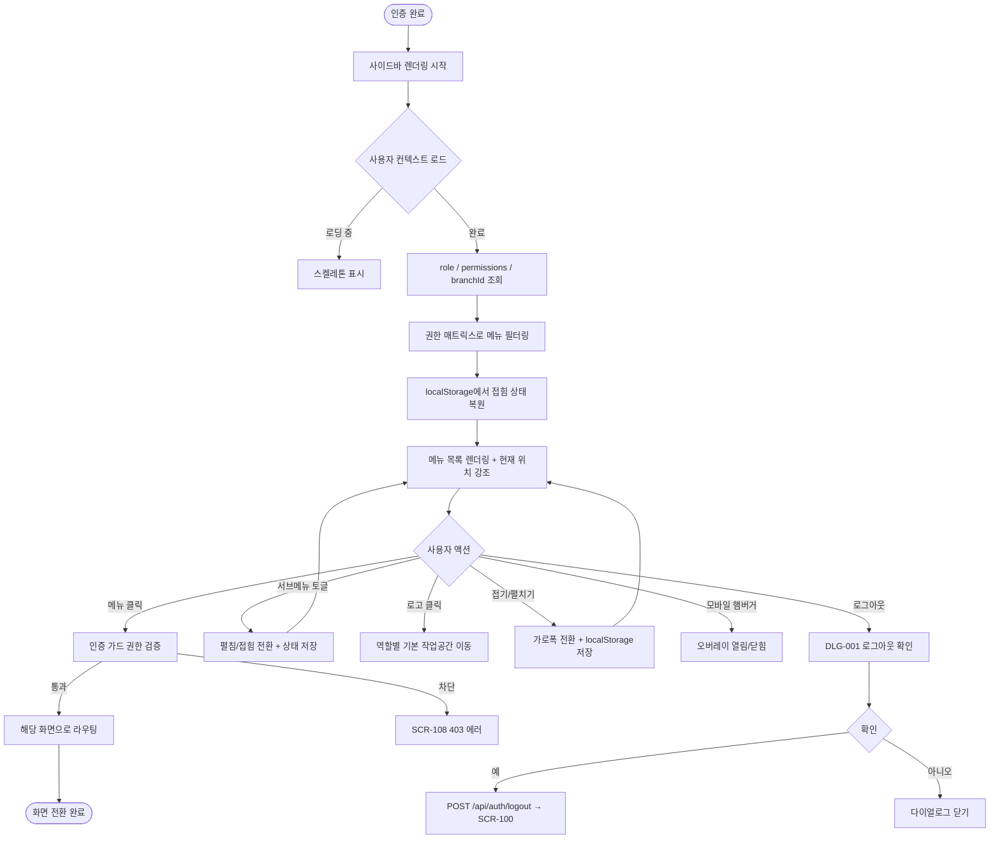

# SCR-102 사이드바 네비게이션

## 1. 화면 메타 정보

이 문서는 사이드바 네비게이션에 대한 자기완결형 요구사항 정의서입니다. 다른 문서를 함께 보지 않아도 이 문서 한 장만으로 사이드바에 들어가는 모든 영역, 모든 메뉴, 모든 토글, 모든 권한, 모든 예외 처리, 그리고 이 화면을 지탱하는 운영 정책까지 전부 이해하고 구현할 수 있도록 작성합니다.

| 항목 | 값 |
|---|---|
| 작성일 | 2026-05-22 |
| 버전 | v1.0 |
| 상태 | 최신 통합본 반영 (정합화 완료) |
| 도메인 | D01 공통 |
| 화면 ID | SCR-102 |
| 화면명 | 사이드바 네비게이션 |
| 화면 유형 | 공통 레이아웃 영역 (모든 화면 좌측 고정) |
| 라우트 (URL) | 전체 화면 공통 (`/login` 제외 모든 인증 화면) |
| 플랫폼 | 데스크톱(펼침/접힘), 태블릿(접힘 기본), 모바일(햄버거 오버레이) |
| 우선순위 | P0 (출시 필수) |
| 기능코드 | MFN-SCR-102 (사이드바 네비게이션) |
| 계약코드 | 본 화면 직접 계약코드 없음 |
| 계약 상태 | 비계약 본기능 |
| 부모 기능 prefix | MFN |
| Lv1 코드 | MFN-SCR-102 |
| Lv2 / Lv3 세분화 | MFN-SCR-102-01 ~ MFN-SCR-102-08 (브랜드 로고·지점명, 메뉴 렌더링·클릭·현재 위치 강조, 역할별 메뉴 필터링, 접기/펼치기, 모바일 햄버거, 서브메뉴 토글, 접힘 상태 저장, 권한 없는 메뉴 차단) |
| 연계 화면 | SCR-101 대시보드(로고/대시보드 메뉴 이동), SCR-108 에러 페이지(권한 없는 접근), DLG-000 세션 만료(세션 만료 중 메뉴 클릭) |
| 호출 다이얼로그 | 직접 호출 없음. DLG-000 세션 만료가 메뉴 클릭 시점에 트리거될 수 있음 |

## 2. 화면 개요와 목적

사이드바 네비게이션은 로그인 직후부터 로그아웃 직전까지 모든 화면에서 좌측에 고정으로 표시되는 공통 메뉴 영역입니다. 운영자가 현재 자기 위치를 한눈에 파악하고 시스템의 어느 화면으로든 빠르게 이동할 수 있도록 하는, 어드민 도구의 가장 일관된 길잡이 역할을 합니다. 본 시스템은 `직원 1명 = 로그인 계정 1개` 원칙에 따라 모든 운영자가 자기 역할에 맞는 메뉴 세트를 사용하므로, 사이드바는 단순한 링크 모음이 아니라 RBAC(역할 기반 접근 제어) 결과를 그대로 시각화하는 화면입니다. 역할에 따라 메뉴 항목이 자동으로 늘어나거나 줄어들고, 권한이 없는 항목은 아예 표시되지 않아 사용자가 "여기 들어가도 될까?"를 고민할 필요가 없게 만듭니다.

이 화면이 다루는 운영 흐름은 단순해 보이지만 권한 매트릭스가 매우 복잡합니다. 슈퍼관리자는 본사 전용 메뉴까지 포함한 모든 메뉴를 보고, 본사 최고관리자는 본사 정책·통합 KPI 메뉴를 추가로 보며, Owner(지점장)과 매니저는 본사 전용 메뉴를 숨긴 지점 운영 메뉴 세트를 봅니다. FC는 회원·수업 중심으로 메뉴가 좁혀지고, 스태프와 프런트는 출석·회원·POS·시설 위주의 현장 메뉴만 보며, 트레이너는 담당 수업·회원 외에는 거의 보이지 않습니다. 읽기 전용 계정은 변경 가능 메뉴가 모두 숨거나 비활성화된 채 조회 가능 메뉴만 노출됩니다. 게다가 같은 역할 안에서도 락커·운동복·상담 같은 부가 기능을 사용하지 않는 센터에서는 그 메뉴가 추가로 숨겨지므로, 사이드바 자체가 그 센터의 운영 모드를 반영하는 거울이 됩니다.

데스크톱에서는 펼침/접힘 두 가지 모드를 자유롭게 전환할 수 있고, 태블릿에서는 가로폭 절약을 위해 접힘이 기본이며, 모바일에서는 햄버거 버튼으로만 오버레이로 띄워집니다. 이 모드 상태는 사용자별 localStorage에 저장되어 다음 로그인 시에도 유지됩니다. 따라서 사이드바는 보기에 단순하지만, 권한·운영 모드·디바이스·사용자 선호도까지 모두 반영된 다층 컴포넌트로 동작합니다.

## 3. 진입 경로와 인접 화면

사이드바는 별도의 진입 경로를 가지지 않는 공통 레이아웃 영역입니다. 사용자가 인증된 상태로 어떤 화면에 들어가는 즉시 사이드바가 좌측에 함께 렌더링되며, 화면 전환과 무관하게 항상 같은 자리에 떠 있습니다. 다만 일부 특수 화면에서는 사이드바가 의도적으로 가려지거나 표시되지 않습니다.

첫 번째 예외는 로그인 화면(SCR-100)입니다. 비로그인 상태에서는 사이드바가 표시되지 않으며 로그인 카드만 화면 중앙에 떠 있습니다. 비밀번호 재설정(SCR-106), 클라이언트 프리뷰 갤러리(SCR-110)처럼 인증을 요구하지 않는 화면에서도 사이드바가 표시되지 않습니다.

두 번째 예외는 에러 페이지(SCR-108)입니다. 권한 없는 접근(403)으로 본 화면으로 리다이렉트되거나 존재하지 않는 페이지(404), 서버 오류(500), 점검 모드(503)로 진입한 경우에는 사이드바를 함께 표시할지 가릴지가 운영 정책에 따라 달라집니다. 일반적으로 로그인 상태의 403·404·500은 사이드바를 유지해 다른 메뉴로 빠르게 이탈할 수 있게 하고, 503 점검 모드는 사이드바를 가린 전체 화면 안내로 처리합니다.

세 번째 예외는 모바일 환경입니다. 모바일에서는 사이드바가 기본적으로 화면에 보이지 않고, 상단 헤더의 햄버거 버튼을 눌러야 전체 화면 오버레이로 펼쳐집니다. 메뉴 선택 또는 바깥 클릭으로 다시 닫힙니다.

사이드바에서 빠져나가는 인접 화면은 그 자체가 메뉴 항목 전부입니다. 대시보드 클릭은 SCR-101로, 회원관리 클릭은 회원 목록(SCR-M001)으로, 매출관리는 매출 현황으로, 수업관리는 수업 캘린더로, 상품관리는 상품 목록으로, 시설관리는 락커 관리로, 직원관리는 직원 목록으로, 마케팅은 리드 관리로, 설정은 센터 설정으로, 본사관리는 본사 대시보드로 이동합니다. 브랜드 로고를 클릭하면 사용자의 역할에 맞는 기본 작업공간(대다수 역할은 SCR-101 대시보드)으로 복귀합니다.

## 4. 레이아웃과 UI 구성

사이드바는 화면의 좌측에 세로로 길게 배치된 고정 영역입니다. 데스크톱에서는 펼침 모드일 때 약 240px, 접힘 모드일 때 약 64px의 가로폭을 차지하며, 어떤 화면을 띄워도 사이드바의 위치와 폭은 변하지 않습니다. 사이드바 자체는 위에서부터 아래로 다음 영역들이 순서대로 배치됩니다.

가장 위에는 상단 영역이 있습니다. 펼침 모드에서는 브랜드 로고와 서비스명이 가로로 배치되고, 그 아래 한 줄에 현재 선택된 지점명이 표시됩니다. 슈퍼관리자가 본사 통합 모드를 켠 상태라면 "전체 지점(통합)"이 표시되고, 일반 사용자에게는 본인 소속 지점명이 표시됩니다. 접힘 모드에서는 로고 아이콘만 작게 표시되고 지점명은 hover 시 툴팁으로 노출됩니다. 모바일 오버레이 모드에서는 상단 영역이 그대로 노출되며 닫기 버튼이 함께 표시됩니다.

상단 영역 바로 아래에는 메뉴 항목 목록이 세로로 펼쳐집니다. 메뉴 항목은 아이콘과 텍스트의 한 쌍으로 구성되며, 펼침 모드에서는 아이콘+텍스트, 접힘 모드에서는 아이콘만 표시됩니다. 접힘 모드에서 아이콘에 마우스를 올리면 우측에 작은 툴팁이 떠서 메뉴명을 알려줍니다.

기본 메뉴 항목은 위에서부터 다음 순서로 배치됩니다. 대시보드(통합 진입 SCR-101 또는 지점 SCR-090), KPI 센터(KPI 운영 요약), Today Tasks(당일 업무 큐), 회원관리(회원 목록 진입), 매출관리(매출 현황), 수업관리(수업 캘린더), 상품관리(상품 목록), 시설관리(락커 관리), 직원관리(직원 목록), 마케팅(리드 관리), 설정(센터 설정), 그리고 superAdmin·primary에게만 보이는 본사관리(본사 대시보드)가 마지막에 배치됩니다. 메뉴 안에 서브메뉴가 있는 경우(예: 회원관리 아래 회원 목록 / 회원 이력 / 회원 분석)는 상위 메뉴를 클릭하면 펼쳐지고 다시 클릭하면 접힙니다. 현재 경로가 서브메뉴 안에 있으면 부모 메뉴가 자동으로 펼쳐진 상태로 진입합니다.

메뉴 항목 가운데에서는 현재 위치가 강조 표시됩니다. 강조는 배경색 변경과 텍스트 색상 변경, 그리고 좌측에 얇은 강조 바를 함께 그려서 현재 어느 메뉴에 있는지를 한눈에 알 수 있게 합니다. 라우터 경로가 바뀌면 강조 위치도 자동으로 이동합니다.

메뉴 목록 가장 아래에는 접기/펼치기 버튼과 로그아웃 버튼이 배치됩니다. 접기/펼치기 버튼은 데스크톱에서만 표시되며, 클릭으로 가로폭이 펼침↔접힘 사이를 전환합니다. 로그아웃 버튼은 모든 역할에게 동일하게 노출되며, 클릭 시 DLG-001 로그아웃 확인 다이얼로그가 표시됩니다.

모바일에서는 사이드바가 평소에는 보이지 않고, 상단 헤더의 햄버거 버튼을 눌러야 전체 화면 오버레이로 펼쳐집니다. 오버레이 상태에서는 사이드바 우측에 어두운 백드롭이 깔리고, 사이드바 우측 끝에 닫기 버튼이 표시됩니다. 메뉴를 클릭하면 해당 화면으로 이동하면서 사이드바가 자동으로 닫히고, 백드롭이나 바깥을 클릭해도 닫힙니다.

권한이 없는 메뉴는 사이드바에 아예 표시되지 않습니다. 예를 들어 FC 계정으로 로그인하면 매출관리·직원관리·상품관리·설정 메뉴 자체가 사이드바에서 보이지 않고, 위에서 아래로 회원관리·수업관리·마케팅 같은 허용 메뉴만 표시됩니다. 본사관리 메뉴는 슈퍼관리자와 본사 최고관리자에게만 보입니다. 이렇게 사용자에게 "여기 들어가도 될까?"라는 질문 자체가 생기지 않도록, 사이드바는 보이는 그대로가 사용 가능한 메뉴라는 일관된 약속을 지킵니다.

## 5. 메뉴 구성과 메뉴별 동작

사이드바의 메뉴는 권한에 따라 동적으로 구성되며, 각 메뉴가 어떤 화면으로 이동하는지와 어떤 역할에게 보이는지가 모두 정해져 있습니다. 메뉴 단위로 풀어 적습니다.

대시보드 메뉴는 모든 인증 사용자에게 표시됩니다. 클릭 시 사용자 역할에 따라 다른 화면으로 라우팅됩니다. superAdmin·primary·Owner(지점장)·매니저·FC는 SCR-101 대시보드 통합(또는 본사 정책에 따라 SCR-090 지점 대시보드)로 이동하고, 트레이너는 수업 캘린더로, 스태프·프런트는 출석 관리로 이동합니다. 사용자가 보는 사이드바의 대시보드 메뉴는 그 사용자의 기본 작업공간으로의 단축키 역할을 합니다.

KPI 센터 메뉴는 owner·primary·superAdmin에게만 표시됩니다. 클릭 시 KPI 센터 화면으로 이동하여 지점 또는 본사 차원의 KPI 요약을 볼 수 있습니다. manager 이하는 본 메뉴가 보이지 않습니다.

Today Tasks 메뉴는 모든 인증 사용자에게 표시되지만 내용은 역할별로 달라집니다. 클릭 시 당일 업무 큐 화면으로 이동하여 본인이 처리해야 할 업무가 나열됩니다.

회원관리 메뉴는 모든 인증 사용자에게 표시됩니다. 클릭 시 회원 목록(SCR-M001)으로 이동하며, 권한에 따라 보이는 회원 범위와 가능한 액션이 달라집니다(트레이너는 담당 회원만 보임). 서브메뉴로 회원 목록 / 회원 이력 / 회원 분석 등이 펼쳐질 수 있습니다.

매출관리 메뉴는 트레이너·스태프 일부 권한에게는 제한됩니다. superAdmin·primary·Owner(지점장)·매니저·FC에게는 표시되고, 트레이너에게는 표시되지 않습니다. 스태프는 본사 정책에 따라 매출 조회만 허용되는 경우 표시되고 그 외에는 숨겨집니다. 클릭 시 매출 현황 화면으로 이동합니다.

수업관리 메뉴는 모든 인증 사용자에게 표시됩니다. 클릭 시 수업 캘린더로 이동하며, 트레이너는 본인 담당 수업, FC·매니저·Owner(지점장)은 지점 전체 수업, 슈퍼관리자는 전체 지점 수업이 보입니다.

상품관리 메뉴는 superAdmin·primary·Owner(지점장)·매니저에게 표시되고, FC·스태프·트레이너에게는 표시되지 않습니다. 클릭 시 상품 목록으로 이동합니다.

시설관리 메뉴는 락커·운동복을 사용하는 센터에서만 노출되며, 트레이너에게는 보이지 않습니다. 클릭 시 락커 관리 화면으로 이동합니다. 센터가 락커·운동복 미사용으로 설정되어 있으면 이 메뉴 자체가 모든 역할에게서 숨겨집니다.

직원관리 메뉴는 superAdmin·primary·Owner(지점장)에게 표시되고, 매니저는 본사 정책에 따라 일부 제한되며, FC·스태프·트레이너에게는 표시되지 않습니다. 클릭 시 직원 목록으로 이동합니다.

마케팅 메뉴는 superAdmin·primary·Owner(지점장)·매니저·FC에게 표시되고, 스태프·트레이너에게는 표시되지 않습니다. 클릭 시 리드 관리 화면으로 이동합니다.

설정 메뉴는 superAdmin·primary·Owner(지점장)에게 표시되고, 매니저는 본사 정책에 따라 일부 제한되며, FC·스태프·트레이너에게는 표시되지 않습니다. 클릭 시 센터 설정으로 이동합니다.

본사관리 메뉴는 슈퍼관리자와 본사 최고관리자에게만 표시됩니다. 클릭 시 본사 대시보드로 이동하여 전사 KPI·지점 편차·자동화 정책 같은 본사 전용 영역에 접근할 수 있습니다. 그 외 모든 역할에게는 본 메뉴가 아예 보이지 않습니다.

서브메뉴는 상위 메뉴 클릭 시 펼쳐지거나 접히며, 현재 경로가 서브메뉴 안에 있으면 상위 메뉴가 자동으로 펼쳐진 상태로 진입합니다. 한 번에 여러 상위 메뉴를 펼친 상태로 둘 수 있고, 사용자 선호도에 따라 펼침 상태가 유지됩니다.

## 6. 버튼·아이콘·링크 액션 전체 정의

이 화면에 등장하는 모든 클릭 가능한 요소를 빠짐없이 정의합니다.

브랜드 로고는 클릭 시 사용자의 역할에 맞는 기본 작업공간으로 이동합니다. superAdmin·primary·Owner(지점장)·매니저·FC는 SCR-101 대시보드로, 트레이너는 수업 캘린더로, 스태프·프런트는 출석 관리로 이동합니다. 본 화면에 이미 있는 상태에서 다시 누르면 그 화면이 강제로 새로고침됩니다.

지점명 표시는 펼침 모드에서 텍스트로 노출되며 일반적으로 클릭 가능하지 않습니다. 본사 권한자가 본사 통합 모드를 사용 가능한 환경에서는 지점명 영역이 클릭 가능 드롭다운으로 동작하여 다른 지점으로 전환하거나 통합 모드로 들어갈 수 있습니다.

각 메뉴 항목은 클릭 시 위 5절에서 정의한 매핑대로 해당 화면으로 라우팅됩니다. 라우팅 시점에 인증 가드가 권한을 다시 한 번 검증하며, 누락된 권한이 감지되면 SCR-108 403 에러로 리다이렉트됩니다. 다만 사이드바에 보이는 메뉴는 이미 권한 매트릭스로 필터링된 메뉴이므로 일반적으로 403이 발생할 일은 없습니다.

서브메뉴를 가진 메뉴는 클릭 시 서브메뉴 토글이 일어납니다. 상위 메뉴가 접힌 상태에서 누르면 펼쳐지고, 펼친 상태에서 다시 누르면 접힙니다. 펼친 상태에서 다른 화면으로 이동해도 펼침 상태는 유지됩니다.

접기/펼치기 버튼은 데스크톱에서 사이드바 하단에 위치하며, 클릭으로 사이드바 가로폭을 펼침↔접힘 사이에서 전환합니다. 접힘 상태에서는 메뉴 텍스트가 사라지고 아이콘만 남으며, 펼침 상태에서는 아이콘+텍스트가 함께 표시됩니다. 전환 상태는 사용자 localStorage에 저장되어 다음 로그인 시에도 유지됩니다.

모바일 햄버거 버튼은 상단 헤더에 위치하며, 클릭 시 사이드바가 전체 화면 오버레이로 펼쳐집니다. 메뉴를 선택하면 자동으로 닫히고, 백드롭 또는 바깥 클릭으로도 닫힙니다. 닫기 버튼이 사이드바 우측 끝에 추가로 노출되어 명시적으로 닫을 수도 있습니다.

로그아웃 버튼은 사이드바 하단에 위치하며 모든 역할에게 노출됩니다. 클릭 시 DLG-001 로그아웃 확인 다이얼로그가 표시되고, 확인하면 SCR-109 로그아웃 흐름이 실행되어 세션이 안전하게 종료됩니다.

권한이 없는 메뉴는 사이드바에 표시되지 않으므로 클릭 자체가 일어나지 않습니다. 다만 누군가 직접 URL로 권한 없는 화면에 접근하면 그 화면이 403으로 처리되며, 본 화면에서는 사이드바의 현재 위치 강조가 어느 메뉴에도 해당하지 않는 비활성 상태가 됩니다.

모든 클릭 가능 요소는 라우팅 중에는 자동으로 비활성화되어 더블클릭으로 인한 중복 라우팅이 차단됩니다.

## 7. 호출되는 다이얼로그 동작

사이드바 네비게이션 자체는 별도의 다이얼로그를 직접 호출하지 않지만, 일부 메뉴와 버튼 클릭이 트리거가 되어 다른 도메인의 다이얼로그가 부모 화면 위에 표시될 수 있습니다.

### 7-1. DLG-001 로그아웃 확인 다이얼로그

로그아웃 버튼을 누르면 DLG-001 로그아웃 확인 다이얼로그가 표시됩니다. 다이얼로그 상단에는 "로그아웃 하시겠습니까?" 메시지가, 하단에는 확인·취소 버튼이 표시됩니다. 확인을 누르면 버튼이 비활성화되고 로딩 스피너가 표시되며, 백엔드에 `POST /api/auth/logout` 요청이 전송됩니다. 응답이 돌아오면 클라이언트 측 토큰·캐시가 모두 초기화되고 SCR-100 로그인 화면으로 자동 이동합니다. 취소를 누르면 다이얼로그가 닫히고 현재 화면이 유지됩니다. 이 다이얼로그의 자세한 동작은 본 도메인의 DLG-001 문서에서 자기완결로 다시 정의됩니다.

### 7-2. DLG-000 세션 만료 다이얼로그 (조건적 트리거)

사용자가 사이드바 메뉴를 클릭한 순간 세션이 이미 만료된 상태였다면, 라우팅 요청이 401로 반환되고 자동으로 DLG-000 세션 만료 다이얼로그가 부모 화면 위에 표시됩니다. 사용자가 "재로그인" 버튼을 누르면 클릭하려고 했던 URL이 next 파라미터로 보존된 채 로그인 화면으로 이동하고, 재로그인 성공 후 원래 의도했던 메뉴 위치로 자동 복귀합니다. 본 화면이 책임지는 동작은 클릭 시점의 URL을 정확히 보존해 전달하는 것입니다.

### 7-3. DLG-002 이탈 경고 다이얼로그 (조건적 트리거)

사용자가 어떤 입력 화면에서 미저장 변경사항을 가진 채 사이드바의 다른 메뉴를 클릭하면, 그 입력 화면의 dirty 상태 감지 로직이 작동하여 DLG-002 이탈 경고 다이얼로그가 표시됩니다. "나가기"를 누르면 변경사항을 버리고 사이드바 클릭으로 이동하려던 화면으로 이동하고, "계속 편집"을 누르면 다이얼로그가 닫히고 현재 화면이 유지됩니다. 본 화면(사이드바)이 책임지는 동작은 라우팅 요청을 부모 화면의 dirty 상태 가드가 가로챌 수 있도록 라우터 인터셉트를 제공하는 것까지이며, 다이얼로그 자체의 동작은 각 화면의 책임입니다.

## 8. 토스트와 안내 메시지

사이드바 네비게이션에서 직접 발생하는 토스트나 안내는 거의 없습니다. 사이드바는 표시 자체가 안내이고, 메뉴 클릭 결과는 이동한 화면이 처리합니다. 다만 다음과 같은 안내가 본 화면에서 트리거될 수 있습니다.

권한 없는 메뉴를 직접 URL로 접근하려고 시도한 경우, 사이드바는 그 시점에 별도 토스트를 띄우지 않고 단순히 SCR-108 403 에러 페이지로 라우팅합니다. 안내는 에러 페이지가 담당합니다.

세션 만료 상태에서 메뉴를 클릭한 경우, 사이드바는 별도 토스트 없이 DLG-000 세션 만료 다이얼로그를 표시합니다. 안내는 다이얼로그가 담당합니다.

지점 전환 드롭다운(본사 권한자 전용)에서 다른 지점을 선택한 경우, 우측 상단에 "○○ 지점으로 전환되었습니다" 토스트가 짧게 표시될 수 있습니다. 본문의 모든 화면이 그 지점 기준으로 재조회됩니다.

접기/펼치기 버튼 클릭이나 모바일 햄버거 토글에서는 별도 토스트가 발생하지 않습니다. 시각적 전환 애니메이션만 일어납니다.

## 9. 데이터 흐름과 외부 연동

사이드바는 데이터를 직접 fetch하지 않고, 인증 시점에 받아둔 사용자 정보(역할·권한·소속 지점)와 클라이언트 측 localStorage에 저장된 사용자 선호도(접힘 상태·펼친 서브메뉴)를 조합해 렌더링합니다.

화면 진입 시점에는 별도 API 호출이 없습니다. 인증 가드가 보유한 사용자 컨텍스트(`role`, `permissions[]`, `branchId`, `tenantId`)를 그대로 사용해 메뉴 가시성을 결정합니다.

지점 컨텍스트 표시는 인증 컨텍스트의 `branchId`와 함께 캐시된 지점명을 사용합니다. 슈퍼관리자가 본사 통합 모드를 켤 수 있는 환경에서는 지점 전환 드롭다운이 클릭 시 `GET /api/branches`로 사용자가 접근 가능한 지점 목록을 fetch합니다.

권한 변경 즉시 반영 정책에 따라, 세션 중 사용자의 권한이 변경되면 다음 API 호출(토큰 refresh 시점)에 새 권한이 반영되고, 그 시점에 사이드바도 자동으로 재렌더링되어 보이는 메뉴 세트가 갱신됩니다. 사용자가 진행 중인 작업은 그대로 유지되며, 다음 라우팅 시점부터 새 권한이 적용됩니다.

라우터 경로 변경 시점에는 현재 위치 강조가 자동으로 업데이트됩니다. 별도 API 호출 없이 클라이언트 라우터의 현재 경로와 메뉴 매핑을 비교해 강조 위치를 결정합니다.

접힘 상태·펼친 서브메뉴 상태는 사용자 localStorage 키(예: `sidebar:collapsed`, `sidebar:expandedMenus`)에 저장됩니다. 페이지를 새로고침하거나 다음 로그인 시에도 이 상태가 복원됩니다.

세션 만료가 다른 API 호출에서 감지되면 전역 401 핸들러가 작동해 부모 화면 위에 DLG-000을 표시합니다. 사이드바 자체는 별도 행동을 하지 않으며, 세션이 복구되면 다음 라우팅부터 정상 동작합니다.

본 화면에서 호출하는 주요 API 엔드포인트는 다음과 같습니다. 지점 목록 조회(슈퍼관리자·본사 권한자 전용) `GET /api/branches`, 사용자 컨텍스트 조회(필요 시) `GET /api/auth/me`. 그 외 메뉴 클릭으로 인한 라우팅은 각 화면이 자체적으로 API를 호출합니다.

## 10. 화면 상태와 예외 처리

사이드바 네비게이션은 다음 상태들을 가질 수 있고, 각 상태마다 사용자에게 보이는 모습이 달라집니다.

펼침 상태는 데스크톱·태블릿의 기본 상태로, 아이콘+텍스트가 함께 표시되고 가로폭이 약 240px을 차지합니다. 사용자가 접기 버튼을 누를 때까지 이 상태가 유지됩니다.

접힘 상태는 데스크톱에서 사용자가 접기 버튼을 눌렀거나 태블릿에서 기본으로 적용되는 상태로, 아이콘만 표시되고 가로폭이 약 64px로 축소됩니다. 아이콘에 마우스를 올리면 우측에 메뉴명 툴팁이 표시됩니다.

모바일 닫힘 상태는 모바일의 기본 상태로, 사이드바가 보이지 않고 상단 햄버거 버튼만 표시됩니다.

모바일 열림 상태는 사용자가 햄버거 버튼을 누른 직후로, 사이드바가 전체 화면 오버레이로 펼쳐지고 우측에 어두운 백드롭이 깔립니다. 메뉴 선택 또는 바깥 클릭으로 닫힙니다.

역할 정보 미로드 상태는 인증 가드가 아직 사용자 정보를 받아오지 못한 초기 진입 시점에 잠시 발생합니다. 이 상태에서는 메뉴 목록 자리에 로딩 스켈레톤이 표시되고, 역할 확인이 완료되면 정상 렌더링됩니다.

서브메뉴 펼침 상태는 사용자가 상위 메뉴를 클릭해 서브메뉴를 펼친 상태입니다. 펼침 상태는 다른 화면으로 이동해도 유지되며 사용자 localStorage에 저장됩니다.

세션 만료 중 상태는 사용자가 메뉴를 클릭한 시점에 세션이 이미 만료된 경우로, 사이드바는 그대로 보이지만 부모 화면 위에 DLG-000 다이얼로그가 표시됩니다.

권한 없는 URL 직접 접근 상태는 사용자가 사이드바에 없는 메뉴의 URL을 직접 입력한 경우로, 본 화면에서는 어느 메뉴도 강조되지 않은 비활성 상태가 되고 본문은 SCR-108 403 에러로 리다이렉트됩니다.

예외 케이스별 처리는 다음과 같이 정의됩니다.

권한 없는 URL을 직접 접근하면 SCR-108 403 에러 페이지로 리다이렉트되며 사이드바는 정상 표시됩니다.

역할 정보가 아직 로드되지 않은 초기 진입 시점에는 메뉴 자리에 스켈레톤이 표시되고, 역할 확인 후 정상 렌더링됩니다.

모바일에서 화면을 회전하면 오버레이 상태가 초기화되고 현재 모드(닫힘/열림)가 재계산됩니다.

세션이 만료된 상태에서 메뉴를 클릭하면 DLG-000 세션 만료 다이얼로그가 표시되고, 재로그인 후 원래 의도했던 메뉴 위치로 자동 복귀합니다.

미저장 변경사항이 있는 화면에서 사이드바의 다른 메뉴를 클릭하면 DLG-002 이탈 경고가 표시됩니다.

권한 변경 즉시 반영이 일어나면 다음 라우팅 시점부터 사이드바의 메뉴 세트가 자동으로 갱신됩니다. 진행 중 작업은 유지됩니다.

localStorage 접근이 차단된 환경(시크릿 모드, 쿠키 차단)에서는 접힘 상태와 펼친 서브메뉴 상태가 매번 기본값으로 시작됩니다. 별도 안내는 표시되지 않습니다.

네트워크 단절 상태에서는 사이드바는 그대로 보이지만 메뉴 클릭으로 인한 라우팅이 실패할 수 있고, 이 경우 해당 화면의 오프라인 배너가 표시됩니다.

## 11. 권한별 처리

사이드바는 권한에 따라 보이는 메뉴 세트가 가장 크게 달라지는 영역입니다. 각 권한별로 어떻게 동작해야 하는지를 빠짐없이 정의합니다.

superAdmin는 사이드바의 모든 메뉴를 봅니다. 본사관리 메뉴를 포함한 전 영역이 노출되며, 헤더의 지점 전환 드롭다운으로 다른 지점이나 본사 통합 모드로 전환할 수 있습니다.

primary도 사이드바의 모든 메뉴를 봅니다. 본사관리 메뉴와 본사 통합 KPI 메뉴가 노출되며, 소속 브랜드의 전 지점을 자유롭게 전환할 수 있습니다.

Owner(지점장)은 본사 전용 메뉴(본사관리)를 제외한 모든 운영 메뉴를 봅니다. 자기 지점에 한정해서 작업하며, 직원관리·매출관리·설정 같은 메뉴를 모두 사용할 수 있습니다.

매니저(manager)는 본사 전용 메뉴와 일부 직원관리 메뉴가 제한된 상태로 봅니다. 회원관리·매출관리·수업관리·상품관리·시설관리·마케팅·설정의 주요 메뉴를 모두 사용할 수 있습니다. 직원관리 메뉴는 본사 정책에 따라 일부만 보이거나 아예 숨겨질 수 있습니다.

FC(피트니스 코치, fc)는 매출관리·직원관리·상품관리·설정 메뉴가 모두 숨겨진 좁은 메뉴 세트를 봅니다. 회원관리·수업관리·마케팅·Today Tasks·대시보드 정도의 메뉴가 표시됩니다.

스태프(staff)는 매출관리·직원관리·마케팅·설정 메뉴가 숨겨진 현장 운영 메뉴 세트를 봅니다. 회원관리·수업관리·상품관리(부분)·시설관리(부분) 정도의 메뉴가 표시됩니다.

프런트(front)는 스태프와 같은 메뉴 세트를 봅니다. 본사 정책에서 front를 별도 표준 역할로 두지 않고 staff에 포함하므로 두 역할은 동일하게 동작합니다.

트레이너(trainer)는 매출관리·직원관리·시설관리·상품관리·마케팅·설정 등 거의 모든 운영 메뉴가 숨겨진 가장 좁은 메뉴 세트를 봅니다. 본인 담당 수업과 회원 중심으로 수업관리·회원관리 정도가 표시됩니다.

읽기 전용(readonly)은 변경 가능 메뉴가 모두 숨거나 비활성화된 채 조회 가능 메뉴만 봅니다. 급여 명세서·예약 조회 같은 읽기 전용 화면이 우선 표시됩니다.

권한 외에도 운영 모드에 따라 일부 메뉴가 추가로 보이거나 숨겨집니다. 락커·운동복을 사용하지 않는 센터에서는 시설관리 메뉴가 모든 역할에게서 숨겨집니다. 상담 기능을 사용하지 않는 센터에서는 마케팅 메뉴의 상담 관련 서브메뉴가 숨겨집니다. 본사 통합 운영 모드(브랜드 단위)가 활성화된 본사 권한자에게는 지점 전환 드롭다운이 추가로 노출됩니다.

권한이 부족해서 메뉴가 숨겨진 경우의 사용자 경험은 단순합니다. 첫째, 사이드바에 보이지 않는 메뉴는 사용자에게 존재 자체가 노출되지 않습니다. 둘째, 직접 URL로 우회한 경우에는 SCR-108 403 에러로 리다이렉트되며 감사 로그에 기록됩니다. 셋째, 권한이 부여되거나 해제되면 다음 라우팅 시점부터 사이드바가 자동으로 재계산됩니다.

## 12. 메인 흐름

사이드바 네비게이션의 핵심 동작 흐름을 다이어그램으로 표현합니다. 사용자가 화면에 진입한 시점부터 메뉴 클릭으로 다른 화면으로 이동하기까지의 가장 일반적인 정상 흐름입니다.



## 13. 에러 흐름

사이드바 네비게이션에서 발생할 수 있는 주요 에러와 그 처리 흐름을 다이어그램으로 표현합니다. 권한 부족·세션 만료·미저장 이탈·역할 정보 미로드가 어떻게 분기되는지를 정의합니다.

```mermaid
flowchart TD
    A([메뉴 클릭]) --> B{사용자 컨텍스트}
    B -->|미로드| C[로딩 스켈레톤 + 재시도]
    B -->|로드 완료| D{세션 유효?}
    D -->|만료| E[DLG-000 세션 만료]
    E --> F[next 파라미터로 로그인 이동]
    F --> G[재로그인 후 원래 메뉴로 복귀]
    D -->|유효| H{권한 검증}
    H -->|차단(403)| I[SCR-108 403 에러]
    I --> J[감사 로그 기록]
    H -->|통과| K{현재 화면 dirty?}
    K -->|예| L[DLG-002 이탈 경고]
    L --> M{선택}
    M -->|나가기| N[변경사항 버리고 이동]
    M -->|계속 편집| O[현재 화면 유지]
    K -->|아니오| P[라우팅 진행]
    P --> Q{네트워크}
    Q -->|단절| R[오프라인 안내]
    Q -->|정상| S[새 화면 렌더링]
    A --> T{권한 변경 감지}
    T -->|예| U[메뉴 세트 자동 재계산]
    U --> V[사용자 보던 메뉴 사라짐 → 안내]
```

## 14. 운영 정책 — 사이드바 / 메뉴 / 권한 자기완결 정리

이 절은 본 화면이 의존하는 사이드바·메뉴·권한 운영 정책을 외부 문서 참조 없이 풀어 적습니다.

관리자 웹 표준 역할 정책은 다음 7개를 기준으로 합니다. superAdmin(전사 최고 권한), primary(본사 운영 총괄), owner(지점 최고 책임자), manager(지점 운영 관리자), fc(상담·영업 담당), staff(현장 운영 담당), readonly(조회 전용). 본 시스템에서 front는 별도 표준 역할로 두지 않고 staff에 포함하며, trainer는 관리자 웹의 기본 역할이 아니라 앱·수업 운영 관점의 역할로 봅니다. 사이드바의 메뉴 세트는 이 7개 표준 역할을 기본 축으로 계산됩니다.

본사·지점 소유권 분리 정책은 본사 메뉴와 지점 메뉴를 명확히 구분합니다. 본사 소유 영역은 전사 권한 템플릿, 공통 상품 마스터, 자동화 정책 세트, 알림 템플릿, 공지 템플릿, KPI·감사 기준이며, 지점 소유 영역은 회원·리드 실제 운영, 현장 결제·미수금 처리, 수업 개설·스케줄 운영, 시설 배정, 본사 정책 범위 안에서의 적용 설정입니다. 사이드바는 두 영역이 같은 화면에서 뒤섞이지 않도록 본사관리 메뉴는 본사 권한자에게만 분리 노출합니다.

핵심 기능별 최소 운영 권한 정책은 다음과 같이 정의됩니다. 리드 등록·수정은 fc 이상, 회원 등록·수정은 staff 이상, 회원 상태 일괄 변경은 manager 이상, 상품 배포는 primary 이상, 결제 승인·환불은 manager 이상, 지점 이관 승인은 manager 이상, 자동화 정책 생성은 primary 이상, 자동화 정책 적용은 owner 또는 manager, 권한 템플릿 관리는 superAdmin 또는 primary, 본사 통합 KPI 조회는 primary 이상, 지점 KPI 조회는 owner 이상, 개인 KPI 조회는 manager 이상입니다. 사이드바는 이 권한 기준을 그대로 적용해 메뉴 가시성을 계산합니다.

화면 노출 정책은 메뉴를 숨길지 읽기전용으로 둘지를 기능별로 다르게 판단합니다. 위험한 기능은 메뉴를 보여주고 액션 버튼을 잠그는 방식보다 최초 진입부터 제한하는 편이 낫다는 원칙을 따릅니다. 따라서 사이드바는 권한이 없는 메뉴를 아예 숨기는 방식을 기본으로 하고, 일부 조회 가능 메뉴는 읽기 전용 상태로 노출합니다.

운영 모드 반영 정책은 락커·운동복·상담·전자계약 같은 부가 기능의 사용 여부에 따라 관련 메뉴를 동적으로 숨깁니다. 센터 설정에서 락커·운동복을 미사용으로 체크하면 시설관리 메뉴 자체가 사라지고, 상담 기능을 미사용으로 체크하면 마케팅 메뉴의 상담 서브메뉴가 사라집니다.

권한 변경 즉시 반영 정책은 세션 중 사용자의 권한이 변경되면 다음 토큰 refresh 시점에 새 권한이 적용되고 사이드바가 자동으로 재계산되도록 합니다. 진행 중인 작업은 그대로 유지되며, 변경된 권한에 따라 메뉴 세트만 갱신됩니다.

상단 컨텍스트 표시 정책은 관리자 웹 상단에 현재 조직 범위(본사/지점)와 권한 수준이 항상 보이도록 합니다. 사이드바 상단의 지점명 표시와 본사 통합 모드 배지가 이를 담당하며, 본사와 지점 기능이 같은 화면에서 뒤섞이지 않도록 시각적으로 분리합니다.

사용자 선호도 저장 정책은 접힘 상태와 펼친 서브메뉴 상태를 사용자별 localStorage에 저장합니다. 다른 단말에서 로그인하면 그 단말의 localStorage가 비어 있으므로 기본 상태로 시작합니다.

세션·자동 로그아웃 정책은 SCR-100과 동일하게 적용됩니다. 30분 무활동 시 부모 화면 위에 DLG-000 세션 만료 다이얼로그가 표시되고, 사이드바는 세션 만료 시점의 현재 위치 강조를 유지한 채 사용자가 재로그인하면 같은 위치로 복귀하도록 보장합니다.

이탈 경고 정책은 미저장 상태가 있는 화면에서 사이드바의 다른 메뉴를 클릭하면 DLG-002 이탈 경고가 자동으로 표시되도록 합니다. 사이드바는 라우터 인터셉트를 제공해 부모 화면의 dirty 가드가 작동할 수 있게 합니다.

403 에러 처리 정책은 직접 URL로 권한 없는 화면에 접근한 경우 SCR-108 403 에러로 리다이렉트하고 감사 로그에 기록합니다. 사이드바 자체에는 권한 없는 메뉴가 보이지 않으므로 일반적으로 403이 발생할 일은 없지만, URL 우회 시도 추적을 위해 모든 차단 이벤트가 기록됩니다.

## 15. 변경 이력

| 일자 | 변경 |
|---|---|
| 2026-05-22 | v1.0 자기완결형 요구사항 정의서로 통합본 작성 (기능명세서 MFN-SCR-102, 화면설계서 SCR-102, 본사·지점·권한 운영 정책 통합) |
