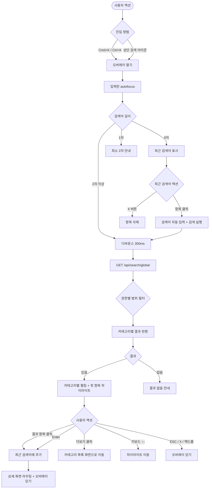
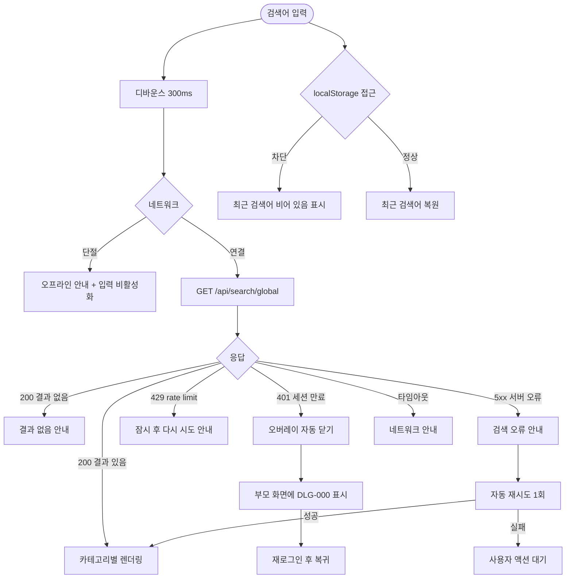

# SCR-103 글로벌 검색

## 1. 화면 메타 정보

이 문서는 글로벌 검색 오버레이에 대한 자기완결형 요구사항 정의서입니다. 다른 문서를 함께 보지 않아도 이 문서 한 장만으로 글로벌 검색에 들어가는 모든 영역, 모든 입력, 모든 결과 카테고리, 모든 권한, 모든 예외 처리, 그리고 이 화면을 지탱하는 운영 정책까지 전부 이해하고 구현할 수 있도록 작성합니다.

| 항목 | 값 |
|---|---|
| 작성일 | 2026-05-22 |
| 버전 | v1.0 |
| 상태 | 최신 통합본 반영 (정합화 완료) |
| 도메인 | D01 공통 |
| 화면 ID | SCR-103 |
| 화면명 | 글로벌 검색 |
| 화면 유형 | 공통 오버레이 (모든 화면 상단 검색 진입점) |
| 라우트 (URL) | 전체 화면 공통 (단독 URL 없음, 오버레이 형태) |
| 플랫폼 | 데스크톱(Cmd+K/Ctrl+K), 태블릿(검색 아이콘 탭), 모바일(검색 아이콘 탭) |
| 우선순위 | P0 (출시 필수) |
| 기능코드 | MFN-SCR-103 (글로벌 검색) |
| 계약코드 | 본 화면 직접 계약코드 없음 |
| 계약 상태 | 비계약 본기능 |
| 부모 기능 prefix | MFN |
| Lv1 코드 | MFN-SCR-103 |
| Lv2 / Lv3 세분화 | MFN-SCR-103-01 ~ MFN-SCR-103-10 (검색 진입, 최근 검색어, 입력·실시간 결과, 결과 클릭·이동, 더보기 카테고리 진입, 결과 없음, 오버레이 닫기, 역할별 범위, 키보드 탐색, 로딩 상태) |
| 연계 화면 | SCR-M004 회원 상세, 직원 상세, 수업 상세 또는 캘린더, 상품 상세, 회원 목록 / 직원 목록 / 수업 캘린더 / 상품 목록(더보기 진입) |
| 호출 다이얼로그 | 직접 호출 없음 |

## 2. 화면 개요와 목적

글로벌 검색은 어떤 화면에 있든 상단 검색 진입점 또는 단축키 Cmd+K(Mac) / Ctrl+K(Windows)로 호출되는 공통 오버레이입니다. 사이드바를 일일이 펼치며 메뉴를 따라가지 않고도 회원·직원·수업·상품을 이름이나 식별자로 즉시 찾아 상세 화면으로 진입할 수 있게 만들어, 운영자가 손을 키보드에서 떼지 않고도 빠르게 업무를 처리할 수 있는 단축 경로 역할을 합니다. 특히 회원의 이름이나 연락처만 알고 있는 FC·스태프가 키오스크 카운터에서 즉각적인 업무 처리를 하는 데 가장 자주 사용됩니다.

이 화면이 다루는 운영 흐름은 단순하지만 매우 빈번합니다. 카운터의 스태프가 방문한 회원의 이름을 듣고 Cmd+K를 누른 뒤 두세 글자만 입력하면 회원 목록이 곧장 뜨고, 클릭 한 번으로 회원 상세 페이지가 열립니다. FC는 상담 예정 회원의 연락처를 입력해 같은 방식으로 진입하고, 매니저는 직원의 이름을 검색해 직원 상세 페이지로 빠르게 들어갑니다. 슈퍼관리자는 전 지점의 회원을 동시에 검색해 본사 차원의 회원 이력을 한 번에 찾아낼 수 있고, 트레이너는 본인 담당 회원에 한정해서만 검색 결과를 받습니다.

이 화면은 단순한 검색 박스가 아니라, 권한별 검색 범위·실시간 결과·카테고리 분류·키보드 탐색·최근 검색어 저장까지 모두 반영된 운영 단축키 영역으로 동작합니다. 오버레이 형태로 떠 있어 부모 화면을 가리지 않으며, 검색 결과 클릭으로 다른 화면으로 진입하면 오버레이는 자동으로 닫힙니다.

## 3. 진입 경로와 인접 화면

글로벌 검색에 진입하는 경로는 다음 네 가지가 있고, 각 경로마다 오버레이가 처음에 보여주는 상태가 다릅니다.

첫 번째 경로는 상단 검색 진입점(검색 아이콘 또는 검색 입력 자리)을 클릭하는 것입니다. 어떤 화면에 있든 상단 헤더에 검색 아이콘이 표시되어 있고, 클릭하면 즉시 오버레이가 열리며 입력란에 autofocus가 잡힙니다. 모바일에서는 검색 아이콘이 햄버거 옆에 작게 표시되어 탭으로 같은 동작을 일으킵니다.

두 번째 경로는 단축키 Cmd+K(Mac) 또는 Ctrl+K(Windows)입니다. 어느 화면에 있든 단축키 한 번으로 즉시 오버레이가 열리며, 다른 입력 필드에 포커스가 잡혀 있어도 단축키가 우선적으로 작동합니다. 단, 일부 깊은 입력 폼(예: 텍스트 에디터 안)에서는 단축키가 부모로 전파되지 않도록 차단될 수 있습니다.

세 번째 경로는 알림 센터(SCR-104)에서 회원·직원 관련 알림을 통해 진입하는 우회 경로입니다. 일부 알림은 글로벌 검색의 검색 결과 화면처럼 동작하는 카테고리 목록으로 이동시키지만, 통상적으로 알림 클릭은 직접 상세 화면으로 진입하므로 글로벌 검색을 거치지 않습니다.

네 번째 경로는 화면설계서 오버레이(SCR-107)의 내부 검색을 글로벌 검색과 혼동해 호출한 경우입니다. SCR-107의 Cmd+/는 글로벌 검색과 별개로 동작하며, 두 오버레이는 동시에 떠 있지 않도록 상호 배타적으로 관리됩니다.

이 오버레이에서 빠져나가는 인접 화면은 검색 결과의 클릭 대상에 따라 달라집니다. 회원 결과를 클릭하면 회원 상세(SCR-M004)로, 직원 결과를 클릭하면 직원 상세 화면으로, 수업 결과를 클릭하면 수업 상세 또는 수업 캘린더의 해당 시간대로, 상품 결과를 클릭하면 상품 상세로 이동합니다. 각 카테고리의 "더보기"를 클릭하면 그 카테고리의 목록 화면(회원 목록·직원 목록·수업 캘린더·상품 목록)으로 현재 검색어가 적용된 상태로 진입합니다.

## 4. 레이아웃과 UI 구성

글로벌 검색은 부모 화면 위에 떠 있는 오버레이입니다. 데스크톱·태블릿에서는 화면 상단 중앙에 너비 약 600px의 검색 카드가 떠 있고, 카드 뒤로는 어두운 백드롭이 깔려 부모 화면이 흐리게 보입니다. 모바일에서는 카드가 전체 폭으로 펼쳐지며 풀스크린 오버레이로 동작합니다. 카드는 위에서부터 아래로 다음 영역들이 순서대로 배치됩니다.

가장 위에는 검색 입력창이 있습니다. 입력창은 카드 폭에 맞춰 좌측에 검색 아이콘, 가운데에 입력 영역, 우측에 닫기(X) 버튼이 배치됩니다. 입력란은 autofocus가 적용되어 오버레이가 열리는 즉시 키보드 포커스가 잡히며, placeholder는 "회원, 직원, 수업, 상품 검색"으로 표시되어 어떤 종류를 찾을 수 있는지 즉시 알 수 있게 합니다. 입력 도중 검색어가 0자가 되면 결과 영역은 자동으로 최근 검색어 화면으로 되돌아갑니다.

입력창 바로 아래에는 결과 영역이 펼쳐집니다. 결과 영역은 검색어 상태에 따라 세 가지 모습 중 하나로 나타납니다.

첫 번째 모습은 검색어가 비어 있을 때 표시되는 최근 검색어 패널입니다. 최근 검색어는 사용자가 최근에 검색해서 결과를 클릭한 키워드들이 최대 5개까지 최신순으로 나열됩니다. 각 항목 좌측에는 시계 또는 히스토리 아이콘이, 우측에는 개별 삭제 X 버튼이 있어 항목별로 삭제할 수 있습니다. 검색어가 한 번도 없는 신규 사용자에게는 "최근 검색어가 없습니다" 안내가 그 자리에 표시됩니다.

두 번째 모습은 검색어를 1자만 입력했을 때의 상태로, 결과 영역에 "최소 2자 이상 입력해주세요" 안내가 표시됩니다. 최근 검색어는 그대로 유지되어 보이며, 사용자가 한 글자 더 입력하면 다음 모습으로 전환됩니다.

세 번째 모습은 검색어를 2자 이상 입력해 실시간 결과가 표시되는 상태입니다. 결과는 회원 / 직원 / 수업 / 상품 4개 카테고리로 구분되어 위에서 아래로 펼쳐집니다. 각 카테고리는 헤더에 카테고리명과 결과 수("회원 12건")가 표시되고, 그 아래 3~5개의 결과 항목이 카드 또는 행 형태로 나열됩니다. 결과가 5개를 초과하면 카테고리 헤더 우측에 "더보기" 링크가 표시되어 클릭 시 해당 카테고리 목록 화면으로 이동합니다. 어느 카테고리에도 결과가 없으면 그 카테고리 자체가 결과 영역에 표시되지 않고, 모든 카테고리가 0건이면 "검색 결과가 없습니다" 빈 상태 안내가 표시됩니다.

각 카테고리별 결과 항목의 표시 내용은 카테고리마다 다릅니다. 회원 카테고리의 항목에는 회원명, 연락처(마스킹된 일부), 상태 배지(활성·만료·홀딩 등)가 표시됩니다. 직원 카테고리의 항목에는 직원명, 역할(Owner(지점장)·매니저·FC 등), 소속 지점명이 표시됩니다. 수업 카테고리의 항목에는 수업명, 강사명, 다음 진행 일정 또는 시간대가 표시됩니다. 상품 카테고리의 항목에는 상품명, 유형(이용권·수강권·락커 등), 가격이 표시됩니다.

키보드 탐색을 위해 결과 영역 안의 첫 번째 항목에 자동으로 시각적 하이라이트가 적용됩니다. 사용자가 위/아래 방향키를 누르면 하이라이트가 항목 사이를 이동하고, Enter 키를 누르면 현재 하이라이트된 항목이 선택되어 해당 상세 화면으로 이동합니다. ESC 키를 누르면 오버레이가 닫힙니다. 마우스로 항목 위에 호버해도 동일한 하이라이트가 적용됩니다.

카드 우측 상단의 닫기(X) 버튼은 오버레이를 닫는 명시적 액션이며, 백드롭(어두운 영역) 클릭으로도 동일하게 닫힙니다. ESC 키도 같은 동작을 합니다. 검색 결과 항목을 클릭해서 다른 화면으로 이동하는 경우에도 오버레이는 자동으로 닫힙니다.

로딩 상태에서는 결과 영역에 작은 스피너 또는 스켈레톤 행이 표시되어 사용자에게 검색 중임을 알립니다. 디바운스(300ms) 동안에는 이전 결과가 그대로 유지되다가 디바운스가 끝나는 시점에 새 검색이 시작되며 로딩 상태가 표시됩니다.

## 5. 검색 입력과 결과 처리

글로벌 검색의 핵심 동작은 사용자가 입력한 키워드로 회원·직원·수업·상품을 동시에 검색하고, 결과를 카테고리별로 묶어 표시하는 것입니다. 입력 처리와 결과 표시의 흐름을 풀어 적습니다.

사용자가 입력란에 글자를 입력하기 시작하면 클라이언트는 디바운스 타이머를 시작합니다. 디바운스는 300ms이며, 사용자가 빠르게 타이핑하는 동안에는 API 호출이 누적되지 않고 가장 마지막 입력에서 300ms 후에 한 번만 호출됩니다. 입력이 멈춰 디바운스가 끝나면, 입력값이 최소 2자 이상인 경우에 한해 검색 API가 호출됩니다. 1자 이하 입력은 결과 영역에 "최소 2자 이상 입력해주세요" 안내만 표시하고 API를 호출하지 않습니다.

검색 API는 `GET /api/search/global?q={검색어}&limit=5`로 호출되며, 응답에는 회원·직원·수업·상품 4개 카테고리의 결과가 각각 최대 5개씩, 그리고 각 카테고리의 총 결과 수가 함께 포함됩니다. 검색 범위는 사용자의 역할에 따라 백엔드에서 자동으로 좁혀집니다. 슈퍼관리자는 전 지점, 본사 최고관리자는 소속 브랜드 전 지점, Owner(지점장)·매니저·FC·스태프는 소속 지점, 트레이너는 본인 담당 회원/수업으로 한정됩니다. 권한이 없는 카테고리는 응답에서 아예 제외됩니다(예: FC에게는 직원 카테고리가 빠짐).

각 카테고리의 검색 매칭 규칙은 다음과 같습니다. 회원은 회원명·연락처·운동 ID를 OR 조건으로 매칭하며 부분 일치를 허용합니다. 직원은 직원명·로그인 ID를 OR로 매칭합니다. 수업은 수업명·강사명을 OR로 매칭합니다. 상품은 상품명·상품 코드를 OR로 매칭합니다.

응답이 돌아오면 결과 영역이 카테고리별로 펼쳐집니다. 결과가 있는 카테고리만 표시되고 없는 카테고리는 헤더 자체가 보이지 않습니다. 한 카테고리의 결과가 5개를 초과하면 헤더 우측에 "더보기 (총 N건)" 링크가 표시되어 클릭 시 해당 카테고리의 목록 화면으로 현재 검색어가 적용된 상태로 이동합니다.

결과 항목을 클릭하면 두 가지가 동시에 일어납니다. 첫째, 클릭한 검색어가 사용자 localStorage의 최근 검색어 목록 맨 위에 추가됩니다(중복 키워드는 기존 위치에서 제거되고 맨 위로 다시 이동). 최근 검색어는 최대 5개까지 유지되고, 5개를 초과하면 가장 오래된 항목이 제거됩니다. 둘째, 오버레이가 자동으로 닫히면서 클릭한 항목의 상세 화면으로 라우팅이 일어납니다.

키보드 탐색을 위해 위/아래 방향키, Enter 키, ESC 키가 처리됩니다. 위/아래 방향키는 카테고리 경계를 자유롭게 넘나들며 결과 항목 사이를 이동합니다. Enter는 현재 하이라이트된 항목 선택, ESC는 오버레이 닫기입니다. 마우스 사용 중에는 호버가 키보드 하이라이트보다 우선됩니다.

오버레이가 열려 있는 동안 부모 화면의 키보드 입력은 차단되어, 사용자가 검색에 집중할 수 있도록 합니다. 오버레이가 닫히면 부모 화면의 입력으로 포커스가 자동으로 복귀합니다.

## 6. 버튼·아이콘·링크 액션 전체 정의

이 화면에 등장하는 모든 클릭 가능한 요소를 빠짐없이 정의합니다.

상단 검색 진입점(검색 아이콘 또는 검색 입력 자리)은 부모 화면의 헤더에 있으며 본 오버레이의 진입 트리거입니다. 클릭 시 오버레이가 즉시 열리고 입력란에 autofocus가 잡힙니다.

단축키 Cmd+K(Mac) / Ctrl+K(Windows)는 어느 화면에서든 오버레이를 즉시 엽니다. 같은 단축키를 오버레이 열린 상태에서 다시 누르면 오버레이가 닫힙니다.

검색 입력란은 텍스트 입력 영역이며, 입력 시 디바운스 300ms 후 자동 검색이 트리거됩니다. 별도의 "검색 버튼"은 없고 실시간 결과 표시 방식입니다.

최근 검색어 항목은 클릭 시 해당 검색어가 입력란에 자동 입력되고 즉시 검색이 실행됩니다. 항목 우측의 X 버튼은 그 항목만 최근 검색어 목록에서 삭제합니다.

검색 결과 항목은 클릭 시 두 가지 동작이 동시에 일어납니다. 첫째, 검색어가 최근 검색어 목록의 맨 위로 이동(또는 추가)됩니다. 둘째, 오버레이가 자동으로 닫히면서 그 항목의 상세 화면으로 라우팅됩니다.

카테고리 헤더 우측의 "더보기" 링크는 클릭 시 해당 카테고리의 목록 화면(회원 목록·직원 목록·수업 캘린더·상품 목록)으로 현재 검색어가 적용된 상태로 이동합니다. 회원 카테고리의 더보기는 SCR-M001 회원 목록의 검색 결과로, 직원 카테고리는 직원 목록의 검색 결과로 라우팅됩니다.

오버레이 우측 상단의 닫기(X) 버튼은 오버레이를 닫습니다.

오버레이 바깥의 백드롭(어두운 영역)은 클릭 시 오버레이를 닫습니다.

ESC 키는 오버레이를 닫는 키보드 단축키입니다. 입력란에 포커스가 있어도 ESC가 우선적으로 작동합니다.

위/아래 방향키는 결과 항목 하이라이트를 이동시키며, Enter 키는 현재 하이라이트된 항목을 선택해 해당 상세 화면으로 이동합니다. 마우스 호버는 키보드 하이라이트와 동일한 시각적 효과를 가집니다.

모든 클릭 가능 요소는 응답이 돌아오는 동안 비활성화되어 더블클릭으로 인한 중복 라우팅이 차단됩니다.

## 7. 호출되는 다이얼로그 동작

글로벌 검색 오버레이는 자체적으로 다이얼로그를 호출하지 않습니다. 본 오버레이 자체가 화면 위에 떠 있는 비차단형 UI이므로, 그 안에서 또 다른 모달을 띄우지 않는 것이 기본 동작입니다. 다만 다음과 같은 상호작용이 다이얼로그와 관련됩니다.

### 7-1. DLG-000 세션 만료 다이얼로그 (조건적 트리거)

사용자가 오버레이를 연 상태에서 검색 API 호출이 401로 반환되면, 세션이 만료된 것으로 판단하고 글로벌 401 핸들러가 작동해 부모 화면 위에 DLG-000 세션 만료 다이얼로그를 표시합니다. 이때 본 오버레이는 자동으로 닫히고 DLG-000이 부모 화면 위에 표시됩니다. 사용자가 재로그인하면 다이얼로그가 사라지고 부모 화면으로 복귀하며, 본 오버레이는 다시 열려야 사용 가능합니다.

### 7-2. DLG-002 이탈 경고 다이얼로그 (해당 없음)

본 오버레이는 사용자가 직접 입력한 폼 데이터를 저장하지 않으므로 이탈 경고가 트리거되지 않습니다. 검색어는 단순 조회 수단일 뿐 dirty 상태로 간주되지 않습니다.

## 8. 토스트와 안내 메시지

글로벌 검색에서 발생하는 모든 알림성 UI는 다음과 같은 패턴으로 동작합니다.

성공 토스트는 본 화면에서 직접 띄우지 않습니다. 검색 결과 클릭 후 이동한 상세 화면이 자체적으로 안내를 제공합니다.

실패 안내는 오버레이 안의 결과 영역에 인라인 메시지로 표시됩니다. API 오류 시 "검색 중 오류가 발생했습니다. 다시 시도해주세요" 메시지가 결과 영역에 표시되고, 사용자가 새 검색어를 입력하면 자동으로 재시도됩니다. 자동 재시도 1회 후에도 실패하면 사용자 액션을 기다립니다.

오프라인 안내는 결과 영역에 "오프라인 상태입니다. 네트워크 연결을 확인해주세요" 메시지가 표시되고, 입력란이 시각적으로 비활성화되어 검색이 차단됩니다. 네트워크가 복구되면 자동으로 활성화됩니다.

결과 없음 안내는 어느 카테고리에도 결과가 없을 때 결과 영역에 "검색 결과가 없습니다" 텍스트와 함께 작은 안내 아이콘이 표시됩니다.

최소 입력 안내는 검색어가 1자 이하일 때 결과 영역에 "최소 2자 이상 입력해주세요" 안내가 표시되어 사용자가 더 입력하도록 유도합니다.

권한 없는 카테고리 안내는 별도로 표시되지 않습니다. 권한이 없는 카테고리는 결과 영역에서 아예 보이지 않으므로 사용자에게 존재 자체가 노출되지 않습니다.

확인 팝업과 알럿은 본 화면에서 사용되지 않습니다.

## 9. 데이터 흐름과 외부 연동

이 화면은 단순한 검색 단축키이지만, 권한별로 다른 데이터 범위를 다루어야 하므로 여러 데이터 소스에 의존합니다. 화면 단위로 어떤 데이터가 어디서 오고 어디로 가는지를 모두 풀어 씁니다.

오버레이 진입 시점에는 별도 데이터 API가 호출되지 않습니다. 최근 검색어는 사용자 localStorage(`globalSearch:recentKeywords`)에서 즉시 읽어와 렌더링되며, 빈 상태이면 "최근 검색어가 없습니다" 안내가 표시됩니다.

검색어 입력 시점에는 디바운스 300ms 후 `GET /api/search/global?q={검색어}&limit=5` 엔드포인트가 호출됩니다. 요청에는 사용자의 인증 토큰이 포함되어 백엔드에서 권한별 범위 필터링이 자동으로 적용됩니다. 응답에는 members[], staff[], classes[], products[] 네 개 배열과 각각의 totalCount가 포함되며, 권한이 없는 카테고리는 응답에서 제외됩니다.

각 카테고리의 검색 매칭은 백엔드 인덱스를 기반으로 합니다. 회원 인덱스는 이름·연락처·운동 ID로 구성되며, 부분 일치 검색을 지원합니다. 직원 인덱스는 이름·로그인 ID, 수업 인덱스는 수업명·강사명, 상품 인덱스는 상품명·상품 코드로 구성됩니다. 부분 일치는 prefix 매칭과 contains 매칭을 함께 사용하며, prefix 매칭이 우선 순위가 높게 정렬됩니다.

검색 결과 항목 클릭 시점에는 두 가지가 일어납니다. 첫째, 클릭한 검색어가 localStorage의 최근 검색어 목록 맨 위로 이동(또는 추가)되고, 5개를 초과하면 가장 오래된 항목이 제거됩니다. 둘째, 해당 항목의 상세 화면으로 라우터가 이동하며 오버레이가 자동으로 닫힙니다. 라우팅 시점에 인증 가드가 권한을 다시 한 번 검증하지만, 검색 결과로 반환된 항목은 이미 권한 필터를 거쳤으므로 일반적으로 차단되지 않습니다.

"더보기" 클릭 시점에는 해당 카테고리의 목록 화면으로 라우팅되며, URL 쿼리 파라미터로 현재 검색어가 함께 전달됩니다(예: `/members?search=홍길동`). 목록 화면에 도착하면 그 검색어가 자동으로 검색 입력란에 채워진 채 시작됩니다.

검색 이력은 보안상 백엔드에 저장되지 않고 클라이언트 localStorage에만 저장됩니다. 다른 단말에서 로그인하면 그 단말의 localStorage가 비어 있어 최근 검색어가 없는 상태로 시작합니다.

마스킹된 정보(연락처 일부) 표시 정책은 회원 상세 진입 권한과 분리되어 적용됩니다. FC·스태프 같은 일반 운영자에게는 회원 결과의 연락처가 부분 마스킹되어 표시되고, 슈퍼관리자·Owner(지점장) 같은 권한자에게는 전체가 표시될 수 있습니다. PII 마스킹 정책은 본사 정책에 따라 달라질 수 있습니다.

화면에서 호출하는 주요 API 엔드포인트는 다음과 같습니다. 글로벌 검색 `GET /api/search/global`, 인증 컨텍스트 조회(필요 시) `GET /api/auth/me`.

## 10. 화면 상태와 예외 처리

글로벌 검색 오버레이는 다음 상태들을 가질 수 있고, 각 상태마다 사용자에게 보이는 모습이 달라집니다.

닫힘 상태는 오버레이가 표시되지 않은 기본 상태입니다. 부모 화면 상단에 검색 아이콘만 표시되어 클릭을 기다립니다.

열림(초기) 상태는 사용자가 검색 아이콘이나 단축키로 오버레이를 연 직후의 상태입니다. 입력란은 빈 상태로 autofocus가 잡혀 있고, 결과 영역에는 최근 검색어 목록(또는 "최근 검색어가 없습니다" 안내)이 표시됩니다.

검색어 1자 이하 상태는 사용자가 한 글자만 입력한 상태로, 결과 영역에 "최소 2자 이상 입력해주세요" 안내가 표시됩니다. 최근 검색어 목록은 화면에서 사라지지 않고 그대로 유지됩니다.

검색 중 상태는 디바운스가 끝나고 API 호출이 진행 중인 상태로, 결과 영역에 작은 스피너 또는 스켈레톤 행이 표시됩니다. 이전 결과는 잠시 그대로 유지되다가 새 결과로 교체됩니다.

결과 표시 상태는 200 응답으로 결과를 받아 카테고리별로 렌더링한 상태입니다. 결과가 있는 카테고리만 펼쳐지며, 첫 번째 항목에 자동 하이라이트가 적용됩니다.

결과 없음 상태는 어느 카테고리에도 결과가 없는 상태로, "검색 결과가 없습니다" 안내가 결과 영역에 표시됩니다.

오류 상태는 검색 API가 5xx 또는 네트워크 단절로 실패한 상태로, "검색 중 오류가 발생했습니다. 다시 시도해주세요" 안내가 표시됩니다. 자동 재시도 1회 후 사용자 액션을 기다립니다.

오프라인 상태는 네트워크가 단절된 상태로, 입력란이 비활성화되고 "오프라인 상태입니다" 안내가 표시됩니다.

세션 만료 중 상태는 검색 API가 401을 반환한 상태로, 본 오버레이가 자동으로 닫히고 부모 화면 위에 DLG-000 세션 만료 다이얼로그가 표시됩니다.

예외 케이스별 처리는 다음과 같이 정의됩니다.

검색어가 2자 미만이면 결과를 표시하지 않고 "최소 2자 이상" 안내만 표시하며, 최근 검색어 목록은 유지됩니다.

검색 결과가 0건이면 "검색 결과가 없습니다" 빈 상태가 결과 영역에 표시됩니다.

검색 API가 5xx 오류로 실패하면 "검색 중 오류가 발생했습니다. 다시 시도해주세요" 안내가 표시되고, 사용자가 새 검색어를 입력하면 자동 재시도됩니다.

오프라인 상태에서는 입력란이 비활성화되어 검색이 차단됩니다. 네트워크가 복구되면 자동으로 활성화됩니다.

권한 없는 카테고리는 응답에서 아예 제외되어 사용자에게 보이지 않습니다. FC에게는 직원 카테고리가, 트레이너에게는 직원·상품 카테고리가 보이지 않습니다.

세션이 만료된 상태에서 검색을 시도하면 자동으로 본 오버레이가 닫히고 DLG-000이 표시됩니다.

localStorage 접근이 차단된 환경에서는 최근 검색어가 매번 빈 상태로 시작됩니다.

검색어에 특수문자나 SQL/스크립트 인젝션 패턴이 포함되면 백엔드에서 안전하게 이스케이프되어 검색 인덱스로 전달됩니다. 클라이언트는 별도 차단 없이 입력을 그대로 전송합니다.

매우 짧은 시간에 너무 많은 검색이 시도되면(예: 동일 IP에서 1분당 N회 이상) rate limit이 발동되어 일시적으로 검색이 차단됩니다. "잠시 후 다시 시도해주세요" 안내가 표시됩니다.

## 11. 권한별 처리

이 화면은 권한에 따라 검색 가능한 데이터 범위와 보이는 카테고리가 달라집니다. 각 권한별로 어떻게 동작해야 하는지를 빠짐없이 정의합니다.

superAdmin는 전 지점의 회원·직원·수업·상품을 모두 검색할 수 있습니다. 결과에는 각 항목이 어느 지점 소속인지가 함께 표시될 수 있으며, 회원의 PII(연락처)도 마스킹 없이 노출됩니다.

primary는 소속 브랜드의 전 지점 데이터를 검색할 수 있습니다. 검색 범위와 결과 표시는 슈퍼관리자와 유사하지만, 브랜드 단위로 한정됩니다.

Owner(지점장)은 자기 지점의 회원·직원·수업·상품을 검색할 수 있습니다. 다른 지점의 데이터는 결과에서 제외됩니다.

매니저(manager)는 자기 지점의 회원·직원·수업·상품을 검색할 수 있고, 일부 직원 카테고리는 본사 정책에 따라 노출 범위가 제한될 수 있습니다.

FC(피트니스 코치, fc)는 자기 지점의 회원과 수업만 검색할 수 있습니다. 직원 카테고리와 상품 카테고리는 결과에서 제외되어 보이지 않습니다. 회원의 연락처는 부분 마스킹(예: 010-1234-****)으로 표시되어 PII를 보호합니다.

스태프(staff)는 자기 지점의 회원과 수업을 검색할 수 있습니다. 직원과 상품 카테고리는 보이지 않으며, 회원 연락처도 부분 마스킹됩니다.

프런트(front)는 스태프와 동일하게 동작합니다.

트레이너(trainer)는 본인이 담당하는 회원과 수업만 검색할 수 있습니다. 다른 트레이너의 담당 회원은 결과에서 RLS로 차단되어 보이지 않습니다. 직원·상품 카테고리는 보이지 않습니다.

읽기 전용(readonly)은 자기 지점의 회원·직원·수업·상품을 조회 범위 내에서 검색할 수 있습니다. 검색 결과 클릭으로 진입한 상세 화면에서는 모든 변경 액션이 차단된 채 조회만 가능합니다.

비로그인 상태에서는 본 오버레이 자체에 접근할 수 없습니다. 인증되지 않은 사용자는 SCR-100 로그인 화면으로 자동 라우팅됩니다.

권한 외에도 운영 모드에 따라 일부 카테고리가 숨겨질 수 있습니다. 락커·운동복을 사용하지 않는 센터에서는 상품 카테고리 안의 락커·운동복 결과가 제외됩니다. 상담 기능을 사용하지 않는 센터에서는 마케팅 관련 결과가 제외됩니다.

권한이 부족해서 결과가 차단된 경우의 사용자 경험은 단순합니다. 첫째, 권한 없는 카테고리는 결과 영역에서 아예 보이지 않습니다. 둘째, 검색 결과로 반환된 항목을 클릭해서 이동한 상세 화면이 권한 부족이면 SCR-108 403 에러로 리다이렉트되지만, 일반적으로 검색 결과는 이미 권한 필터를 거쳤으므로 이런 일은 발생하지 않습니다. 셋째, 모든 검색 이벤트는 감사 로그 또는 분석 로그에 기록될 수 있어 운영 패턴을 추적합니다.

## 12. 메인 흐름

글로벌 검색의 핵심 동작 흐름을 다이어그램으로 표현합니다. 사용자가 오버레이를 연 시점부터 검색 결과 클릭으로 다른 화면으로 이동하기까지의 가장 일반적인 정상 흐름입니다.

## 13. 에러 흐름

글로벌 검색에서 발생할 수 있는 주요 에러와 그 처리 흐름을 다이어그램으로 표현합니다. 네트워크 단절·세션 만료·API 오류·rate limit이 어떻게 분기되는지를 정의합니다.

## 14. 운영 정책 — 글로벌 검색 / 권한 범위 / PII 자기완결 정리

이 절은 본 화면이 의존하는 검색·권한·PII 운영 정책을 외부 문서 참조 없이 풀어 적습니다.

검색 범위 정책은 사용자의 역할을 기준으로 백엔드에서 자동으로 좁혀집니다. 슈퍼관리자는 전 지점, 본사 최고관리자는 소속 브랜드의 전 지점, Owner(지점장)·매니저·FC·스태프는 소속 지점, 트레이너는 본인 담당 회원·수업으로 한정됩니다. 권한이 없는 카테고리는 응답에서 아예 제외되어 사용자에게 노출되지 않습니다.

PII 마스킹 정책은 회원 연락처·이메일을 권한에 따라 마스킹합니다. 슈퍼관리자·Owner(지점장)에게는 마스킹 없이 표시되고, FC·스태프 같은 일반 운영자에게는 부분 마스킹(예: 010-1234-****)으로 표시됩니다. 마스킹 규칙은 본사 정책에 따라 강화·완화될 수 있으며, 검색 결과 단계에서부터 일관되게 적용됩니다.

디바운스 정책은 300ms를 기본으로 합니다. 사용자가 빠르게 타이핑하는 동안에는 API 호출이 누적되지 않고 가장 마지막 입력 이후 300ms 시점에 한 번만 호출됩니다. 너무 짧으면 불필요한 트래픽이 발생하고, 너무 길면 사용자가 반응성이 느리다고 느끼는 균형점입니다.

최소 검색어 길이 정책은 2자입니다. 한 글자 검색은 결과 후보가 너무 많아 검색 인덱스 부담이 크고 사용자에게도 의미 있는 결과를 보여주기 어려우므로, 2자 이상부터 검색을 시작합니다.

최근 검색어 정책은 클라이언트 localStorage에만 저장하고 최대 5개까지 유지합니다. 보안상 백엔드에 저장하지 않으며, 다른 단말에서 로그인하면 비어 있는 상태로 시작합니다. 중복 키워드는 기존 위치에서 제거되고 맨 위로 다시 이동합니다. 5개 초과 시 가장 오래된 항목이 제거됩니다.

결과 카테고리 정책은 회원·직원·수업·상품 4종을 기본으로 합니다. 각 카테고리는 최대 5개 결과를 노출하고, 초과 시 "더보기" 링크로 해당 카테고리 목록 화면으로 이동합니다. 결과가 없는 카테고리는 표시되지 않습니다.

키보드 단축키 정책은 Cmd+K(Mac) / Ctrl+K(Windows)를 글로벌 검색에 할당합니다. SCR-107 화면설계서 오버레이는 Cmd+/로 별도 단축키를 가지며, 두 오버레이는 동시에 떠 있지 않도록 상호 배타적으로 관리됩니다. 다른 입력 필드에 포커스가 있어도 글로벌 단축키가 우선 작동합니다.

rate limit 정책은 동일 IP에서 1분당 N회 초과 검색을 임시 차단합니다. 정상적인 운영자는 거의 닿지 않는 임계값이며, 무차별 검색 시도(스크래핑·자동화 공격)를 차단하기 위한 안전장치입니다.

운영 모드 반영 정책은 락커·운동복·상담 같은 부가 기능을 사용하지 않는 센터에서 해당 카테고리의 결과가 제외되도록 합니다. 센터 설정과 본사 정책이 검색 응답에 즉시 반영됩니다.

권한 변경 즉시 반영 정책은 세션 중 사용자의 권한이 변경되면 다음 검색부터 새 권한 범위가 적용되도록 합니다. 진행 중이던 검색은 기존 권한으로 완료되고, 다음 입력부터 새 권한이 적용됩니다.

오버레이 상호 배제 정책은 글로벌 검색 오버레이와 화면설계서 오버레이(SCR-107)가 동시에 떠 있지 않도록 합니다. 하나가 열리는 시점에 다른 하나가 자동으로 닫힙니다. 알림 센터(SCR-104) 패널과는 다른 영역에 떠 있으므로 동시에 떠 있을 수 있습니다.

검색 인덱스 정책은 회원·직원·수업·상품 각각에 대해 prefix 매칭과 contains 매칭을 함께 지원합니다. prefix 매칭은 우선 순위가 높게 정렬되어 사용자가 시작 부분으로 검색할 때 가장 정확한 결과가 위쪽에 표시되도록 합니다.

세션·자동 로그아웃 정책은 SCR-100과 동일하게 적용됩니다. 본 오버레이가 열린 상태에서 세션이 만료되면 자동으로 오버레이가 닫히고 부모 화면 위에 DLG-000이 표시됩니다.

## 15. 변경 이력

| 일자 | 변경 |
|---|---|
| 2026-05-22 | v1.0 자기완결형 요구사항 정의서로 통합본 작성 (기능명세서 MFN-SCR-103, 화면설계서 SCR-103, 권한·PII·검색 운영 정책 통합) |
