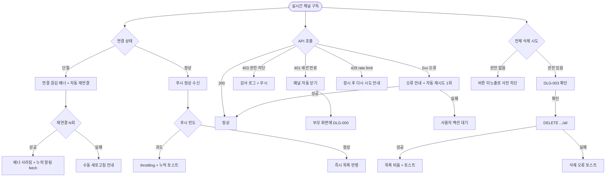

# SCR-104 알림 센터

## 1. 화면 메타 정보

이 문서는 알림 센터에 대한 자기완결형 요구사항 정의서입니다. 다른 문서를 함께 보지 않아도 이 문서 한 장만으로 알림 센터에 들어가는 모든 영역, 모든 알림 유형, 모든 버튼, 모든 권한, 모든 예외 처리, 그리고 이 화면을 지탱하는 운영 정책까지 전부 이해하고 구현할 수 있도록 작성합니다.

| 항목 | 값 |
|---|---|
| 작성일 | 2026-05-22 |
| 버전 | v1.0 |
| 상태 | 최신 통합본 반영 (정합화 완료) |
| 도메인 | D01 공통 |
| 화면 ID | SCR-104 |
| 화면명 | 알림 센터 |
| 화면 유형 | 공통 오버레이 패널 (상단 알림 아이콘 클릭으로 열림) |
| 라우트 (URL) | 전체 화면 공통 (단독 URL 없음, 패널 형태) |
| 플랫폼 | 데스크톱(우측 슬라이드 인), 태블릿(우측 슬라이드 인), 모바일(하단 슬라이드 업 또는 풀스크린) |
| 우선순위 | P0 (출시 필수) |
| 기능코드 | MFN-SCR-104 (알림 센터) |
| 계약코드 | NFR-19(알림 센터 비기능 요구) 연계, 본 화면 직접 계약코드 없음 |
| 계약 상태 | 비계약 본기능 |
| 부모 기능 prefix | MFN |
| Lv1 코드 | MFN-SCR-104 |
| Lv2 / Lv3 세분화 | MFN-SCR-104-01 ~ MFN-SCR-104-14 (배지 표시, 패널 열기, 알림 항목 렌더링, 알림 클릭 + 읽음 처리, 개별 읽음·삭제, 전체 읽음, 전체 삭제, 알림 없음, 알림 설정, 역할별 알림 범위, 실시간 수신, 배지 자동 갱신, 전체 삭제 권한 차단) |
| 연계 화면 | SCR-105 프로필 계정(알림 설정 진입), SCR-M004 회원 상세(만료·결제 알림), 매출 화면(결제 알림), 수업 캘린더(수업 취소 알림), 공지 상세(시스템 공지) |
| 호출 다이얼로그 | 전체 삭제 확인 시 DLG-003 삭제 확인을 호출(공통 다이얼로그 차용) |

## 2. 화면 개요와 목적

알림 센터는 운영 중 발생하는 비동기 이벤트를 실시간으로 수신해 한 곳에 모아 보여주는 공통 알림 패널입니다. 회원의 이용권이 곧 만료된다는 안내, 결제가 완료되었다는 통지, 오전 10시 필라테스 수업이 취소되었다는 알림, 본사가 발행한 시스템 공지, 그리고 본인이 시작한 엑셀 내보내기·일괄 작업이 끝났다는 결과 알림까지 모두 이 한 패널에 모여 미읽음 배지로 표시됩니다. 운영자가 어느 화면을 보고 있더라도 헤더의 알림 아이콘만 보면 새 이벤트가 있는지를 즉시 인지할 수 있고, 패널을 열어 한두 번의 클릭으로 관련 화면으로 직접 진입할 수 있습니다.

이 화면이 다루는 운영 흐름은 다양합니다. 출근 직후 매니저는 알림 센터를 열어 어젯밤 결제된 회원과 오늘 만료될 회원을 한눈에 보고 그 회원의 상세 페이지로 직접 진입해 처리를 시작합니다. FC는 본인 담당 회원의 만료 임박 알림을 패널에서 받아 그 즉시 회원에게 메시지를 보냅니다. 슈퍼관리자는 본사 시스템 공지를 알림 센터로 전체 직원에게 동시에 발송하고, 모든 직원의 알림에 그 공지가 표시됩니다. 본인이 시작한 회원 목록 엑셀 내보내기가 백그라운드에서 완료되면 그 결과 다운로드 링크가 알림 센터로 푸시되어, 매니저는 다른 업무를 보면서도 완료 시점에 곧장 파일을 받을 수 있습니다.

이 화면은 단순한 알림 모음이 아니라, 실시간 푸시 채널(WebSocket 또는 Server-Sent Events) 구독·권한별 알림 범위·문맥 바로가기·일괄 관리·알림 설정 진입까지 모두 반영된 운영 알림 허브로 동작합니다. 부모 화면을 가리지 않는 우측 슬라이드 인 패널 형태로 떠 있으며, 알림 클릭으로 관련 화면으로 진입하면 패널은 자동으로 닫힙니다.

## 3. 진입 경로와 인접 화면

알림 센터는 별도의 진입 URL이 없는 패널형 오버레이입니다. 진입 방법은 세 가지가 있고, 각 방법마다 패널이 열리는 위치와 초기 상태가 조금씩 다릅니다.

첫 번째 경로는 상단 헤더의 알림 아이콘 클릭입니다. 모든 화면 우측 상단에 종 모양 알림 아이콘이 표시되고, 미읽음 알림이 있으면 우측 위에 숫자 배지(최대 99+)가 빨강 원으로 표시됩니다. 아이콘을 클릭하면 패널이 즉시 우측에서 슬라이드 인 되며 입력 포커스가 패널 안으로 이동합니다.

두 번째 경로는 토스트 클릭입니다. 우측 상단에 잠시 떠 있는 토스트(예: 엑셀 다운로드 완료)를 사용자가 클릭하면 알림 센터가 자동으로 열리면서 해당 알림이 가장 위에 강조된 상태로 표시됩니다. 이는 토스트가 사라지기 전에 사용자가 결과를 자세히 보고 싶을 때 사용하는 단축 경로입니다.

세 번째 경로는 부모 화면의 자동 트리거입니다. 일부 화면(예: 회원 목록의 엑셀 내보내기 완료 시)이 명시적으로 알림 센터를 자동 오픈하도록 요청할 수 있습니다. 이 경우도 우측에서 슬라이드 인 되며 가장 최근 알림이 강조됩니다.

이 패널에서 빠져나가는 인접 화면은 알림 항목의 유형에 따라 다양합니다. 회원 만료 예정 알림을 클릭하면 회원 상세(SCR-M004)로, 결제 완료 알림을 클릭하면 결제 이력 또는 매출 현황 화면으로, 수업 취소 알림을 클릭하면 수업 캘린더로, 시스템 공지를 클릭하면 공지 상세 또는 안내 페이지로, 엑셀 다운로드 완료 알림을 클릭하면 다운로드 링크 자체가 트리거되어 파일이 내려받아집니다. 패널 상단의 문맥 바로가기 버튼을 누르면 현재 업무 맥락(회원·매출·설정 중 어디인지)에 맞춰 즉시 다른 운영 화면으로 이동하고, 패널 하단의 알림 설정 바로가기는 SCR-105 프로필 계정의 알림 설정 영역으로 이동합니다.

## 4. 레이아웃과 UI 구성

알림 센터는 부모 화면 위에 떠 있는 우측 슬라이드 인 패널입니다. 데스크톱·태블릿에서는 화면 오른쪽 끝에 너비 약 400px의 세로 패널이 슬라이드 인 되며, 부모 화면은 그대로 보이고 패널 뒤로 어두운 백드롭이 옅게 깔립니다. 모바일에서는 패널이 하단에서 슬라이드 업 되거나 풀스크린으로 표시됩니다. 패널은 위에서부터 아래로 다음 영역들이 순서대로 배치됩니다.

가장 위에는 패널 헤더가 있습니다. 헤더 좌측에는 "알림 센터" 타이틀과 함께 미읽음 수가 작은 배지로 표시되고("미읽음 5"), 우측에는 닫기(X) 버튼이 배치됩니다. 헤더 아래에는 옅은 구분선이 그어져 본문과 헤더를 시각적으로 분리합니다.

헤더 바로 아래에는 문맥 바로가기 영역이 있습니다. 이 영역은 사용자가 현재 보고 있던 부모 화면이 어느 도메인인지에 따라 다른 바로가기 4개를 자동으로 보여줍니다. 예를 들어 사용자가 회원 화면 계열에서 알림 센터를 열었다면 "회원 목록", "메시지 발송", "전자계약", "출석 관리" 같은 회원 운영 단축 버튼이 가로로 배치되고, 사용자가 매출 화면 계열에서 열었다면 "신규 결제", "매출 현황", "자동 알림", "회원 목록" 같은 매출 운영 단축 버튼이 표시됩니다. 설정 화면 계열에서 열었다면 "센터 설정", "권한 관리", "자동 알림", "공지 발송" 같은 설정 운영 단축 버튼이 표시됩니다. 사용자는 패널을 통해 알림을 확인하면서도 다음 업무로 바로 이동할 수 있습니다.

문맥 바로가기 영역 아래에는 일괄 관리 버튼 줄이 있습니다. 좌측에는 "전체 읽음" 버튼이, 우측에는 "전체 삭제" 버튼이 배치되며, 가장 우측에는 톱니바퀴 아이콘의 "알림 설정" 버튼이 있습니다. 전체 삭제 버튼은 권한에 따라 노출 여부가 결정되며, FC·스태프·트레이너·readonly 같은 일반 역할에게는 보이지 않습니다.

일괄 관리 버튼 아래에는 알림 목록 영역이 펼쳐집니다. 알림은 최신순으로 위에서 아래로 나열되며, 패널이 길어지면 내부 스크롤로 더 많은 알림을 볼 수 있습니다. 각 알림 항목은 카드형 행으로 다음 요소가 배치됩니다. 좌측에는 알림 유형 아이콘(회원·결제·수업·시스템 등)이 색상 배경에 표시되고, 중앙에는 알림 내용 요약(한 줄 텍스트)과 발생 시각(예: "3분 전", "오늘 오전 9:30", "어제 23:15")이 표시되며, 우측에는 미읽음 표시(작은 점 또는 색상 배지)와 호버 시 노출되는 개별 삭제 X 버튼이 배치됩니다.

미읽음 알림은 시각적으로 강조됩니다. 항목 배경이 연한 색으로 채워지거나, 좌측에 강조 바가 그어져 사용자가 새 알림을 쉽게 식별할 수 있게 합니다. 항목을 클릭하면 자동으로 읽음 처리되어 강조가 사라지고 일반 상태로 전환됩니다.

알림이 한 건도 없을 때는 알림 목록 영역에 "새 알림이 없습니다" 안내가 회색 톤으로 표시되고, 안내 아래에 작은 일러스트가 함께 노출되어 빈 상태임을 자연스럽게 알립니다.

패널 가장 아래(또는 본문 영역의 마지막)에는 알림 설정 바로가기 링크가 있습니다. 클릭하면 SCR-105 프로필 계정 화면의 알림 설정 영역으로 이동해 어떤 유형의 알림을 받을지를 사용자가 직접 조정할 수 있습니다.

패널은 닫기 버튼, 패널 바깥 클릭(백드롭), ESC 키 중 어느 것으로도 닫을 수 있습니다. 닫히면 부모 화면이 그대로 보이고 알림 아이콘의 배지는 미읽음 수가 다시 노출됩니다.

## 5. 알림 유형과 알림별 동작

알림은 유형에 따라 아이콘·색상·이동 대상이 달라집니다. 본 시스템이 다루는 주요 알림 유형을 카테고리별로 풀어 적습니다.

회원 만료 예정 알림은 회원의 이용권 만료가 임박(D-7·D-3·D-1·D-Day)했을 때 자동화 정책 배치(NFR-05)가 생성합니다. 알림 텍스트는 "홍길동 회원 이용권이 3일 후 만료됩니다"처럼 회원명과 D-Day가 함께 포함되며, 클릭 시 그 회원의 상세 페이지(SCR-M004)로 이동합니다. 권한 범위는 그 회원의 담당자(FC) 또는 소속 지점의 운영자에게 발송됩니다.

결제 완료 알림은 회원의 결제가 성공적으로 처리되었을 때 결제 도메인이 생성합니다. 알림 텍스트는 "김철수 회원 결제가 완료되었습니다"이며, 클릭 시 결제 이력 화면 또는 그 회원의 상세 페이지 결제 탭으로 이동합니다. 권한 범위는 해당 지점의 매니저·센터장 또는 결제 담당자에게 발송됩니다.

수업 취소 알림은 강사 부재·정원 미달 등으로 수업이 취소되었을 때 수업 도메인이 생성합니다. 알림 텍스트는 "오전 10시 필라테스 수업이 취소되었습니다"이며, 클릭 시 수업 캘린더의 그 시간대로 이동합니다. 권한 범위는 그 수업의 강사·예약 회원의 담당 FC·소속 지점의 운영자에게 발송됩니다.

시스템 공지 알림은 본사가 전 직원 또는 특정 역할 대상으로 발행한 공지입니다. 알림 텍스트는 "시스템 점검이 예정되어 있습니다", "새로운 정책이 적용되었습니다"처럼 공지 제목이 그대로 표시되며, 클릭 시 공지 상세 페이지 또는 안내 카드로 이동합니다. 권한 범위는 공지 발행 시 지정된 수신 대상(전체·본사·지점·역할별)에 따라 달라집니다.

엑셀 내보내기 완료 알림은 사용자가 시작한 백그라운드 내보내기 작업이 끝났을 때 생성됩니다. 알림 텍스트는 "회원 목록 엑셀 다운로드가 준비되었습니다"이며, 클릭 시 다운로드 링크가 트리거되어 파일이 내려받아집니다. 권한 범위는 해당 작업을 시작한 본인에게만 발송됩니다.

일괄 작업 완료 알림은 사용자가 시작한 일괄 작업(상태 변경·메시지 발송·일괄 출석·일괄 탈퇴 등)이 끝났을 때 생성됩니다. 알림 텍스트는 "회원 23명의 상태가 변경되었습니다", "회원 50명에게 메시지가 발송되었습니다"이며, 부분 실패가 있으면 "성공 80건 / 실패 20건" 같은 결과 요약이 함께 표시됩니다. 클릭 시 결과 상세 화면 또는 실패 리포트 CSV 다운로드 링크로 이동합니다. 권한 범위는 본인에게만 발송됩니다.

보안 알림은 5회 실패 잠금·IP 화이트리스트 위반·신규 단말 로그인·다른 기기 강제 종료 같은 인증 보안 이벤트가 발생했을 때 생성됩니다. 알림 텍스트는 "본인 계정이 5회 실패로 잠금되었습니다", "허용되지 않은 네트워크에서 로그인 시도가 감지되었습니다" 같이 구체적이며, 클릭 시 보안 안내 페이지 또는 슈퍼관리자 대시보드로 이동합니다. 본인과 슈퍼관리자에게 동시 발송됩니다.

자동화 정책 실행 결과 알림은 만료 알림 배치·홀딩 자동 처리·세그먼트 재계산 같은 정기 배치의 결과가 본사 관리자에게 통지될 때 생성됩니다. 클릭 시 배치 결과 화면 또는 자동화 정책 대시보드로 이동합니다.

각 알림 항목의 아이콘은 카테고리별로 다른 색상을 갖습니다. 회원은 파랑, 결제는 초록, 수업은 보라, 시스템 공지는 주황, 보안은 빨강, 백그라운드 작업은 회색 톤으로 구분되어 사용자가 한눈에 알림 유형을 식별할 수 있게 합니다.

## 6. 버튼·아이콘·링크 액션 전체 정의

이 화면에 등장하는 모든 클릭 가능한 요소를 빠짐없이 정의합니다.

상단 헤더의 알림 아이콘은 부모 화면의 헤더에 있으며 본 패널의 진입 트리거입니다. 클릭 시 패널이 슬라이드 인 됩니다. 아이콘 우측 위의 숫자 배지는 미읽음 수를 표시하며 99를 초과하면 "99+"로 표시됩니다.

패널 헤더의 닫기(X) 버튼은 클릭 시 패널을 슬라이드 아웃 시킵니다. ESC 키와 백드롭 클릭으로도 동일하게 닫힙니다.

문맥 바로가기 영역의 각 버튼은 현재 부모 화면 도메인에 따라 다른 화면으로 라우팅됩니다. 회원 도메인의 "회원 목록"은 SCR-M001로, "메시지 발송"은 SCR-071로, "전자계약"은 계약 화면으로, "출석 관리"는 출석 도메인 화면으로 이동합니다. 매출 도메인의 "신규 결제"는 결제 등록으로, "매출 현황"은 매출 도메인 메인으로, "자동 알림"은 자동화 정책으로 이동합니다. 라우팅 시 패널은 자동으로 닫힙니다.

전체 읽음 버튼은 모든 역할에게 노출되며 클릭 시 패널 내 모든 미읽음 알림을 일괄로 읽음 처리합니다. 백엔드에 `POST /api/notifications/mark-all-read` 요청이 전송되고, 응답이 돌아오면 모든 항목의 미읽음 강조가 사라지며 헤더의 미읽음 수와 알림 아이콘 배지가 0으로 갱신됩니다.

전체 삭제 버튼은 owner·manager·superAdmin·primary에게만 노출됩니다. 클릭 시 DLG-003 삭제 확인 다이얼로그가 표시되어 "모든 알림을 삭제하시겠습니까? 삭제 후에는 복구할 수 없습니다" 안내가 뜨고, 확인하면 `DELETE /api/notifications/all`이 호출되어 모든 알림이 영구 삭제됩니다.

알림 설정 버튼(톱니바퀴 아이콘)은 클릭 시 SCR-105 프로필 계정의 알림 설정 영역으로 이동하면서 패널이 자동으로 닫힙니다.

각 알림 항목은 클릭 시 두 가지가 동시에 일어납니다. 첫째, 그 알림이 자동으로 읽음 처리되어 `POST /api/notifications/{id}/read`가 호출됩니다. 둘째, 그 알림이 지정한 관련 화면으로 라우팅되며 패널이 자동으로 닫힙니다. 엑셀 다운로드 알림처럼 파일 다운로드 링크가 동작하는 경우에는 라우팅 대신 다운로드가 트리거되고 패널은 그대로 유지될 수 있습니다.

알림 항목 우측의 X 버튼(호버 시 노출)은 클릭 시 그 알림 하나만 삭제합니다. `DELETE /api/notifications/{id}`가 호출되고 응답이 돌아오면 목록에서 그 항목이 즉시 사라집니다. 미읽음 알림을 삭제해도 미읽음 수가 자동 차감되어 배지가 갱신됩니다.

패널 바깥의 백드롭은 클릭 시 패널을 닫습니다.

ESC 키는 패널을 닫는 키보드 단축키입니다.

모든 버튼은 응답이 돌아오는 동안 자동으로 비활성화되어 더블클릭으로 인한 중복 요청이 차단됩니다.

## 7. 호출되는 다이얼로그 동작

알림 센터는 일부 위험한 액션(전체 삭제)에 한해 공통 확인 다이얼로그를 호출합니다.

### 7-1. DLG-003 삭제 확인 다이얼로그 (전체 삭제 시)

전체 삭제 버튼(권한: owner·manager·superAdmin·primary)을 누르면 DLG-003 삭제 확인 다이얼로그가 표시됩니다. 다이얼로그 상단에는 경고 아이콘과 "모든 알림을 삭제하시겠습니까?" 메시지가, 그 아래에는 "삭제 후에는 복구할 수 없습니다" 안내 문구가 표시됩니다. 확인 버튼(강조색)과 취소 버튼이 하단에 배치됩니다.

확인을 누르면 다이얼로그가 처리 중 상태로 전환되어 버튼이 비활성화되고 백엔드에 `DELETE /api/notifications/all` 요청이 전송됩니다. 응답이 200이면 다이얼로그가 닫히고 본 패널의 모든 알림이 즉시 목록에서 사라지며, 헤더의 미읽음 수와 알림 아이콘 배지가 0으로 갱신됩니다. 우측 상단에 "모든 알림이 삭제되었습니다" 성공 토스트가 잠시 표시됩니다.

취소를 누르거나 ESC 키 또는 백드롭 클릭으로 다이얼로그를 닫으면 아무 변경 없이 알림 센터로 복귀합니다.

이 다이얼로그의 자세한 동작은 본 도메인의 DLG-003 문서에서 자기완결로 다시 정의됩니다.

### 7-2. DLG-000 세션 만료 다이얼로그 (조건적 트리거)

사용자가 알림 항목 클릭이나 일괄 작업 버튼을 눌렀을 때 백엔드가 401을 반환하면 글로벌 401 핸들러가 작동해 부모 화면 위에 DLG-000 세션 만료 다이얼로그를 표시합니다. 이때 본 패널은 자동으로 닫히고 다이얼로그가 부모 화면 위에 표시됩니다. 재로그인 후에는 부모 화면으로 복귀하며, 알림 패널은 사용자가 다시 열어야 합니다.

## 8. 토스트와 안내 메시지

알림 센터에서 발생하는 모든 알림성 UI는 다음과 같은 패턴으로 동작합니다.

성공 토스트는 우측 상단에 녹색 계열로 약 3~5초 동안 표시되며, "모든 알림이 삭제되었습니다", "모든 알림을 읽음 처리했습니다", "알림이 삭제되었습니다" 같은 결과 안내를 띄웁니다.

실패 토스트는 우측 상단에 빨강 계열로 표시되며, "삭제 중 오류가 발생했습니다. 다시 시도해주세요" 같은 안내와 함께 "다시 시도" 보조 액션을 제공합니다.

실시간 푸시 알림 토스트는 별도 채널로, 사용자가 다른 화면을 보고 있을 때 새 알림이 도착하면 우측 상단에 회색 또는 정보 톤 토스트가 짧게 표시되며 "새 알림이 있습니다: ○○○ 회원 이용권이 곧 만료됩니다" 같은 안내가 뜹니다. 토스트를 클릭하면 알림 센터가 자동으로 열리고 해당 알림이 가장 위에 강조됩니다. 토스트는 닫기 버튼으로 즉시 닫을 수도 있고, 자동으로 5초 후 사라집니다.

확인 팝업은 전체 삭제 액션에 한해 DLG-003을 호출하는 형태로 사용됩니다. 일반 읽음 처리·개별 삭제 같은 가벼운 액션은 확인 없이 즉시 실행됩니다.

알럿은 본 화면에서 사용되지 않습니다.

연결 끊김 안내는 실시간 채널이 끊어졌을 때 패널 상단에 작은 배너로 "실시간 알림 연결이 끊어졌습니다. 재연결 중..." 안내가 표시됩니다. 재연결에 성공하면 배너가 자동으로 사라지고, 일정 횟수 실패하면 "수동으로 새로고침해주세요" 안내가 표시됩니다.

빈 상태 안내는 알림이 한 건도 없을 때 "새 알림이 없습니다" 텍스트와 함께 일러스트가 표시됩니다.

## 9. 데이터 흐름과 외부 연동

이 화면은 실시간 푸시 채널을 핵심으로 하므로, 데이터가 어디서 오고 어디로 가는지를 모두 풀어 씁니다.

화면 진입 시점(패널 열림 시점)에는 `GET /api/notifications?limit=50` 엔드포인트가 호출되어 최근 알림 최대 50건이 fetch됩니다. 응답에는 각 알림의 ID, 유형(member_expiring·payment_completed·class_canceled·system_notice·export_completed·bulk_completed·security 등), 내용 텍스트, 발생 시각, 읽음/미읽음, 관련 화면 라우트, 다운로드 링크(엑셀의 경우) 같은 필드가 포함됩니다.

미읽음 수 배지는 별도의 가벼운 엔드포인트 `GET /api/notifications/unread-count`로 계산되며, 인증된 사용자에게는 어떤 화면에서든 헤더의 아이콘이 이 값을 표시합니다. 미읽음 수는 실시간 채널로 푸시되는 새 알림에 따라 즉시 갱신됩니다.

실시간 푸시 채널은 WebSocket 또는 Server-Sent Events 중 본사 정책에 따라 선택되며, 인증 토큰을 채널 헤더에 포함해 연결됩니다. 채널 경로는 `/ws/notifications` 또는 `/sse/notifications`이며, 서버가 새 알림 이벤트를 발행하면 페이로드에 알림 객체 하나가 담겨 클라이언트로 푸시됩니다. 클라이언트는 푸시를 받으면 패널이 열려 있는 경우 알림 목록 맨 위에 즉시 추가하고, 닫혀 있는 경우에는 미읽음 배지만 +1 갱신하면서 토스트를 띄웁니다.

알림 항목 클릭 시점에는 `POST /api/notifications/{id}/read`가 호출되어 그 알림이 읽음 처리됩니다. 응답을 기다리지 않고 클라이언트는 즉시 UI를 갱신(낙관적 업데이트)하며, 응답 실패 시 원래 미읽음 상태로 롤백합니다.

전체 읽음 처리는 `POST /api/notifications/mark-all-read`로 처리되며 응답이 돌아오면 모든 항목의 미읽음 강조가 사라집니다.

개별 삭제는 `DELETE /api/notifications/{id}`로, 전체 삭제는 `DELETE /api/notifications/all`로 처리됩니다. 전체 삭제는 권한자만 가능하며 DLG-003 확인을 거칩니다.

알림 발송 소스는 다양합니다. 자동화 정책 배치(NFR-05 만료 알림 배치, A04 홀딩 자동 처리, MBR-EXT-04 세그먼트 재계산)가 정기적으로 알림을 생성하고, 결제 도메인이 결제 성공 시 알림을 발행하며, 수업 도메인이 수업 취소·강사 변경 시 알림을 발행합니다. 본사 슈퍼관리자는 시스템 공지를 수동으로 발행하고, 백그라운드 작업 큐가 엑셀 내보내기·일괄 작업 완료 시 알림을 발행합니다. 보안 도메인은 로그인 잠금·IP 위반·신규 단말·다른 기기 강제 종료 시 알림을 발행합니다.

권한별 알림 범위는 백엔드에서 자동으로 적용됩니다. 슈퍼관리자는 전 지점 시스템 알림과 운영 알림을 받고, 본사 최고관리자는 소속 브랜드 전 지점 알림을 받으며, 센터장·매니저는 소속 지점 운영 알림을, FC는 본인 담당 수업·회원 관련 알림만, 스태프는 출석·회원 관련 알림만 받습니다. readonly는 조회 전용 알림만 받습니다.

문맥 바로가기는 별도 API 호출이 없으며, 클라이언트 라우터의 현재 경로를 보고 매핑 테이블로 도메인(회원·매출·설정 등)을 판정한 뒤 그에 맞는 바로가기 4개를 정적으로 표시합니다.

화면에서 호출하는 주요 API 엔드포인트는 다음과 같습니다. 알림 목록 조회 `GET /api/notifications`, 미읽음 수 조회 `GET /api/notifications/unread-count`, 개별 읽음 `POST /api/notifications/{id}/read`, 전체 읽음 `POST /api/notifications/mark-all-read`, 개별 삭제 `DELETE /api/notifications/{id}`, 전체 삭제 `DELETE /api/notifications/all`, 실시간 채널 `WS /ws/notifications` 또는 `SSE /sse/notifications`.

## 10. 화면 상태와 예외 처리

알림 센터는 다음 상태들을 가질 수 있고, 각 상태마다 사용자에게 보이는 모습이 달라집니다.

닫힘 상태는 패널이 화면에 보이지 않는 기본 상태입니다. 부모 화면 헤더의 알림 아이콘과 미읽음 배지만 보입니다.

열림 + 로딩 상태는 사용자가 알림 아이콘을 누른 직후 `GET /api/notifications` 응답이 돌아오기 전까지의 짧은 상태입니다. 패널이 슬라이드 인 되면서 알림 목록 자리에 스켈레톤 행이 3~5개 표시됩니다.

열림 + 정상 상태는 200 응답으로 알림 목록이 렌더링된 일반 상태입니다. 알림이 최신순으로 나열되며 미읽음 항목은 강조 표시됩니다.

열림 + 빈 상태는 응답에 알림이 한 건도 없을 때입니다. "새 알림이 없습니다" 안내와 일러스트가 표시됩니다.

열림 + 오류 상태는 API 호출이 실패한 상태로, 패널 안에 "알림을 불러오지 못했어요" 안내와 "다시 시도" 버튼이 표시됩니다.

실시간 수신 상태는 정상 상태에 잠시 겹쳐지는 부분 상태로, 새 알림이 푸시되는 순간 목록 맨 위에 새 항목이 슬라이드 인 되며 잠시 강조됩니다. 동시에 헤더의 미읽음 수도 +1 갱신됩니다.

연결 끊김 상태는 실시간 채널이 단절된 상태로, 패널 상단에 작은 배너로 "실시간 알림 연결이 끊어졌습니다. 재연결 중..." 안내가 표시됩니다. 자동 재연결이 시도되며 성공 시 배너가 사라집니다.

오프라인 상태는 네트워크가 단절된 상태로, 패널이 열려 있어도 새 알림 푸시를 받지 못하고 기존 알림만 표시됩니다.

세션 만료 중 상태는 알림 액션이 401을 반환한 상태로, 본 패널이 자동으로 닫히고 부모 화면 위에 DLG-000이 표시됩니다.

전체 삭제 확인 중 상태는 DLG-003이 열린 상태입니다. 본 패널은 그대로 보이고 그 위에 다이얼로그가 차단형으로 떠 있습니다.

예외 케이스별 처리는 다음과 같이 정의됩니다.

알림이 한 건도 없으면 "새 알림이 없습니다" 빈 상태가 표시됩니다.

알림 로드가 실패하면 "알림을 불러오지 못했어요" 안내와 "다시 시도" 버튼이 표시되며, 자동 재시도 1회 후 사용자 액션을 기다립니다.

전체 삭제가 실패하면 "삭제 중 오류가 발생했습니다" 토스트가 표시되고 알림 목록은 그대로 유지됩니다.

실시간 채널이 끊어지면 자동으로 재연결이 시도되며, 일정 횟수(예: 5회) 실패 후에는 "수동으로 새로고침해주세요" 안내가 표시됩니다. 재연결 동안 발생한 알림은 다음 fetch 시점에 정상 적재됩니다.

권한 없는 사용자가 전체 삭제를 시도하면 버튼 자체가 노출되지 않으므로 일반적으로는 차단이 사전에 일어납니다. 직접 API 호출로 우회한 경우 백엔드가 403을 반환하고 감사 로그에 기록됩니다.

실시간 푸시가 너무 자주 오는 경우(예: 1초에 수십 건)에는 클라이언트 측에서 throttling을 적용해 UI 깜빡임을 막고 누적된 새 알림 수만 토스트로 알립니다.

세션 만료 상태에서 알림 액션을 시도하면 401이 반환되며 패널이 자동으로 닫히고 DLG-000이 표시됩니다.

매우 오래된 알림(예: 90일 이상 경과)은 백엔드의 보관 정책에 따라 자동으로 정리되어 사용자가 보지 못할 수 있습니다.

## 11. 권한별 처리

이 화면은 권한에 따라 받는 알림 종류와 가능한 관리 액션이 모두 달라집니다. 각 권한별로 어떻게 동작해야 하는지를 빠짐없이 정의합니다.

슈퍼관리자(superAdmin)는 전 지점의 시스템 알림과 모든 운영 알림을 받습니다. 본사 시스템 공지 발행, 본사 정책 실행 결과, 전 지점 보안 이벤트 같은 본사 차원 알림이 추가로 도달합니다. 전체 읽음·전체 삭제·알림 설정을 모두 사용할 수 있습니다.

본사 최고관리자(primary)는 소속 브랜드 전 지점의 운영 알림과 본사 알림을 받습니다. 전체 읽음·전체 삭제·알림 설정을 모두 사용할 수 있습니다.

센터장(owner)은 소속 지점의 모든 운영 알림을 받습니다. 회원 만료·결제 완료·수업 취소·자동화 정책 결과 같은 지점 운영 알림이 도달하며, 전체 읽음·전체 삭제·알림 설정을 모두 사용할 수 있습니다.

매니저(manager)는 소속 지점의 운영 알림을 받습니다. owner와 거의 동일한 알림 범위를 가지며 전체 읽음·전체 삭제·알림 설정을 모두 사용할 수 있습니다.

FC(피트니스 코치, fc)는 본인 담당 수업·회원에 관련된 알림만 받습니다. 회원 만료 예정(담당 회원), 결제 완료(담당 회원), 수업 취소(담당 수업) 같은 알림이 도달하며, 전체 읽음과 알림 설정은 사용 가능하지만 전체 삭제 버튼은 노출되지 않습니다. 개별 읽음과 개별 삭제만 가능합니다.

스태프(staff)는 출석·회원 관련 알림을 받습니다. 출석 이슈, 회원 등록 안내 같은 현장 운영 알림이 도달하며, 전체 읽음과 알림 설정은 사용 가능하지만 전체 삭제는 노출되지 않습니다.

프런트(front)는 스태프와 동일한 알림 범위를 가집니다.

트레이너(trainer)는 본인 담당 수업과 회원 관련 알림만 받습니다. 수업 취소·예약 변경·담당 회원 만료 같은 알림이 도달하며, 전체 읽음과 알림 설정은 사용 가능하지만 전체 삭제는 노출되지 않습니다.

읽기 전용(readonly)은 조회 전용 알림(시스템 공지·일부 안내)만 받습니다. 개별 읽음만 가능하며 개별 삭제·전체 읽음·전체 삭제·알림 설정 중 일부 액션이 제한될 수 있습니다.

권한 외에도 사용자가 알림 설정 화면에서 직접 알림 유형별 수신 여부를 조정할 수 있습니다. 예를 들어 수업 취소 알림을 끄면 그 유형의 알림이 본 패널에 도달하지 않으며, 만료 예정 알림 수신 시점을 D-7로 좁히면 D-30 같은 더 이른 시점의 알림은 보지 않게 됩니다.

권한이 부족해서 액션이 차단된 경우의 사용자 경험은 단계별로 일관됩니다. 첫째, 권한이 없는 액션 버튼(전체 삭제)은 패널에서 아예 노출되지 않습니다. 둘째, 직접 API 호출로 우회한 경우 백엔드가 403을 반환하고 감사 로그에 기록됩니다. 셋째, 권한이 없는 알림 유형은 사용자에게 도달하지 않습니다.

## 12. 메인 흐름

알림 센터의 핵심 동작 흐름을 다이어그램으로 표현합니다. 사용자가 알림 아이콘을 클릭한 시점부터 알림 항목 클릭으로 관련 화면으로 이동하기까지의 가장 일반적인 정상 흐름입니다.

```mermaid
flowchart TD
    A([인증 완료]) --> B[실시간 채널 구독]
    B --> C[미읽음 수 fetch]
    C --> D[헤더 알림 아이콘 + 배지 표시]
    D --> E{새 알림 푸시?}
    E -->|있음| F[배지 +1 + 토스트]
    E -->|없음| G[대기]
    F --> G
    G --> H{사용자 액션}
    H -->|알림 아이콘 클릭| I[패널 슬라이드 인]
    H -->|토스트 클릭| I
    I --> J[GET /api/notifications]
    J --> K{응답}
    K -->|성공| L[알림 목록 최신순 렌더링]
    K -->|빈| M[새 알림 없음 안내]
    K -->|오류| N[오류 안내 + 재시도]
    L --> O{사용자 액션}
    O -->|알림 항목 클릭| P[POST .../read]
    P --> Q[관련 화면 라우팅 + 패널 닫기]
    O -->|개별 X 클릭| R[DELETE .../{id}]
    O -->|전체 읽음| S[POST .../mark-all-read]
    S --> T[미읽음 강조 모두 제거]
    O -->|전체 삭제| U[DLG-003 확인]
    U -->|확인| V[DELETE .../all]
    V --> W[목록 비움 + 토스트]
    O -->|문맥 바로가기| X[운영 화면 라우팅]
    O -->|알림 설정| Y[SCR-105 알림 설정 영역]
    O -->|닫기 / ESC / 백드롭| Z[패널 슬라이드 아웃]
```

## 13. 에러 흐름

알림 센터에서 발생할 수 있는 주요 에러와 그 처리 흐름을 다이어그램으로 표현합니다. 실시간 채널 단절·API 오류·권한 차단·세션 만료가 어떻게 분기되는지를 정의합니다.



## 14. 운영 정책 — 알림 / 실시간 / 권한 자기완결 정리

이 절은 본 화면이 의존하는 알림·실시간·권한 운영 정책을 외부 문서 참조 없이 풀어 적습니다.

알림 발송 소스 정책은 자동화 정책 배치·결제 도메인·수업 도메인·본사 슈퍼관리자·백그라운드 작업 큐·보안 도메인 6개를 표준 소스로 둡니다. 만료 알림 배치(매일 새벽 3시, NFR-05)는 D-30·D-7·D-Day 시점에 알림을 생성하고, 홀딩 자동 처리(A04, 매일 새벽 2시)는 홀딩 종료 회원의 상태 전환 결과를 알림으로 전달하며, 결제 도메인은 결제 성공 즉시 알림을 발행합니다.

권한별 알림 범위 정책은 사용자의 역할을 기준으로 백엔드에서 자동으로 좁혀집니다. 슈퍼관리자·본사 최고관리자는 전사 또는 브랜드 단위, 센터장·매니저는 소속 지점, FC·트레이너는 본인 담당, 스태프·프런트는 출석·회원, readonly는 조회 전용 알림으로 한정됩니다.

미읽음 배지 정책은 헤더의 알림 아이콘 우측에 미읽음 수를 빨강 원 배지로 표시하며 99 초과 시 "99+"로 줄입니다. 실시간 푸시 수신과 읽음 처리 결과가 배지에 즉시 반영됩니다.

실시간 채널 정책은 WebSocket 또는 Server-Sent Events 중 본사 정책에 따라 선택되며, 인증 토큰을 채널 헤더에 포함합니다. 연결 끊김 시 자동 재연결을 N회까지 시도하고, 실패하면 수동 새로고침 안내가 표시됩니다.

전체 삭제 권한 정책은 owner·manager·superAdmin·primary에게만 전체 삭제 버튼을 노출합니다. FC·스태프·트레이너·readonly는 개별 삭제만 가능합니다. 전체 삭제는 DLG-003 삭제 확인을 반드시 거치며, 삭제 후에는 복구할 수 없습니다.

문맥 바로가기 정책은 현재 부모 화면이 어느 도메인(회원·매출·설정 등)인지에 따라 패널 상단의 바로가기 4개를 동적으로 표시합니다. 회원 화면 계열에서는 회원 운영 단축 4개, 매출 화면 계열에서는 매출 운영 단축 4개가 노출되어 사용자가 패널을 통해 다음 업무로 이어 갈 수 있게 합니다.

알림 설정 정책은 사용자가 직접 알림 유형별 수신 여부와 채널(앱 푸시·이메일·SMS)을 SCR-105 프로필 계정의 알림 설정 영역에서 조정할 수 있도록 합니다. 본 패널의 알림 설정 버튼이 그 영역으로 직접 이동시킵니다.

엑셀 다운로드 완료 알림 정책은 사용자가 시작한 엑셀 내보내기 작업이 백그라운드에서 완료되면 본인에게만 알림을 발행합니다. 알림에는 다운로드 링크가 포함되어 클릭 시 즉시 파일이 내려받아집니다. 다운로드 권한이 없는 사용자에게는 애초에 내보내기 작업 자체가 차단됩니다.

보안 알림 정책은 인증 보안 이벤트(5회 실패 잠금·IP 위반·신규 단말·다른 기기 강제 종료)를 본인과 슈퍼관리자에게 동시에 발송합니다. 본인은 본인 계정 안전을 확인하고, 슈퍼관리자는 운영 차원에서 추적합니다.

알림 보관 정책은 본사 정책에 따라 일정 기간(예: 90일) 이후 자동 정리됩니다. 정리된 알림은 사용자가 볼 수 없지만 감사 로그에는 별도로 보존됩니다.

throttling 정책은 실시간 푸시가 너무 자주 들어오는 경우 클라이언트 측에서 UI 갱신을 묶어 처리합니다. 1초에 수십 건의 알림이 도달하면 누적된 새 알림 수만 토스트로 알리고 목록은 일정 간격으로 일괄 갱신됩니다.

오버레이 상호 배제 정책은 알림 센터 패널과 다른 오버레이(글로벌 검색, 화면설계서 오버레이) 사이의 동시 표시 정책을 정합니다. 알림 센터는 우측 슬라이드 인이므로 다른 오버레이와 동시에 떠 있을 수 있지만, 시각적 충돌을 막기 위해 z-index와 위치를 잘 분리합니다.

세션·자동 로그아웃 정책은 SCR-100과 동일하게 적용됩니다. 본 패널이 열린 상태에서 세션이 만료되면 자동으로 패널이 닫히고 부모 화면 위에 DLG-000이 표시됩니다.

감사 로그 정책은 알림 전체 삭제·권한 우회 시도 같은 위험 액션을 감사 로그(SCR-097)에 기록합니다. 일반 읽음·개별 삭제는 사용자 활동 로그에만 가볍게 기록됩니다.

## 15. 변경 이력

| 일자 | 변경 |
|---|---|
| 2026-05-22 | v1.0 자기완결형 요구사항 정의서로 통합본 작성 (기능명세서 MFN-SCR-104, 화면설계서 SCR-104, 알림·권한·실시간 운영 정책 통합) |
