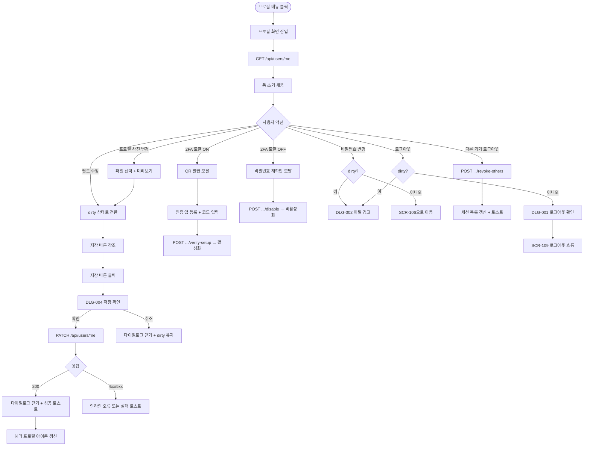
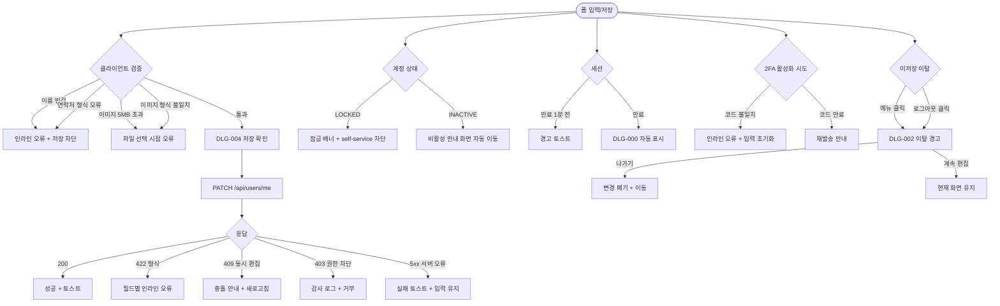

# SCR-105 프로필 계정 페이지

## 1. 화면 메타 정보

이 문서는 프로필 계정 페이지에 대한 자기완결형 요구사항 정의서입니다. 다른 문서를 함께 보지 않아도 이 문서 한 장만으로 프로필 계정 페이지에 들어가는 모든 영역, 모든 입력 필드, 모든 버튼, 모든 다이얼로그, 모든 권한, 모든 예외 처리, 그리고 이 화면을 지탱하는 운영 정책까지 전부 이해하고 구현할 수 있도록 작성합니다.

| 항목 | 값 |
|---|---|
| 작성일 | 2026-05-22 |
| 버전 | v1.0 |
| 상태 | 최신 통합본 반영 (정합화 완료) |
| 도메인 | D01 공통 |
| 화면 ID | SCR-105 |
| 화면명 | 프로필 / 계정 설정 |
| 화면 유형 | 입력/설정 화면 (본인 계정 편집) |
| 라우트 (URL) | `/profile` |
| 플랫폼 | 데스크톱(기본), 태블릿, 모바일(세로 단일 컬럼) |
| 우선순위 | P0 (출시 필수) |
| 기능코드 | MFN-SCR-105 (프로필 / 계정 설정) |
| 계약코드 | 본 화면 직접 계약코드 없음 |
| 계약 상태 | 비계약 본기능 |
| 부모 기능 prefix | MFN |
| Lv1 코드 | MFN-SCR-105 |
| Lv2 / Lv3 세분화 | MFN-SCR-105-01 ~ MFN-SCR-105-08 (진입·로드, 프로필 사진, 기본 정보 수정, 읽기 전용 영역, 비밀번호 변경, 2FA·세션 관리, 저장 처리, 로그아웃) |
| 연계 화면 | SCR-100 로그인(로그아웃 이후), SCR-106 비밀번호 재설정(비밀번호 변경 진입), SCR-109 로그아웃 |
| 호출 다이얼로그 | DLG-001 로그아웃 확인(로그아웃 액션), DLG-002 이탈 경고(미저장 이탈), DLG-004 저장 확인(저장 액션) |

## 2. 화면 개요와 목적

프로필 계정 페이지는 현재 로그인한 운영자가 본인의 개인 정보와 보안 설정을 조회하고 수정하는 자기 관리 화면입니다. 본 시스템은 `직원 1명 = 로그인 계정 1개` 원칙을 따르므로, 본 화면은 단순한 프로필 화면이 아니라 본인에게 발급된 로그인 계정의 보안 상태를 점검하는 영역이기도 합니다. 이름·연락처·프로필 사진 같은 기본 정보 수정, 2단계 인증(2FA) 활성화·비활성화, 비밀번호 변경(SCR-106 진입), 활성 세션 조회·다른 기기 로그아웃, 그리고 명시적 로그아웃까지 계정과 관련된 개인 관리 기능이 한 곳에 모여 있습니다.

이 화면이 다루는 운영 흐름은 다양합니다. 신임 슈퍼관리자가 첫 로그인 후 2FA를 등록하면서 인증 앱과 연동된 QR 코드 프로세스를 진행하고, 매니저가 외근 중 본인 연락처가 바뀐 사실을 떠올려 프로필을 수정한 뒤 저장합니다. FC는 다른 단말에서 로그인된 세션이 남아 있을까 걱정되어 활성 세션 목록을 확인하고 타 기기 로그아웃을 실행하며, Owner(지점장)은 자기 프로필 사진을 새로 찍은 사진으로 갈아 끼웁니다. 슈퍼관리자가 직원의 역할·소속 지점을 본 화면에서 변경할 수도 있지만, 일반 직원에게는 그 영역이 모두 읽기 전용으로 표시되어 본인이 함부로 바꾸지 못합니다.

이 화면은 단순한 폼이 아니라, 입력 폼 + 사진 업로드 + 2FA 토글 + 세션 관리 + 비밀번호 변경 진입 + 로그아웃을 통합한 다목적 보안 관리 영역으로 동작합니다. 미저장 상태에서 다른 화면으로 이동하려고 하면 DLG-002 이탈 경고가, 저장 버튼을 누르면 DLG-004 저장 확인이, 로그아웃 버튼을 누르면 DLG-001 로그아웃 확인이 호출되어 모든 위험 액션이 한 번의 확인을 거칩니다.

## 3. 진입 경로와 인접 화면

프로필 계정 페이지에 진입하는 경로는 다음 두 가지가 있고, 어느 경로로 들어와도 화면의 초기 상태는 동일합니다.

첫 번째 경로는 상단 헤더의 프로필 메뉴입니다. 모든 화면 우측 상단에 사용자의 프로필 아이콘(또는 이니셜 아바타)이 표시되고, 클릭하면 드롭다운 메뉴가 펼쳐집니다. 드롭다운에는 "내 계정", "프로필", "알림 설정", "로그아웃" 같은 항목이 있고, "내 계정" 또는 "프로필" 항목을 누르면 본 화면으로 이동합니다. 이 경로가 가장 일반적인 진입 방법입니다.

두 번째 경로는 직접 URL 접근입니다. 사용자가 `/profile`을 주소창에 입력하거나 북마크로 진입한 경우, 인증 가드가 본인 인증을 확인한 뒤 본 화면으로 라우팅합니다. 비로그인 상태에서는 SCR-100 로그인 화면으로 자동 리다이렉트됩니다.

이 화면에서 빠져나가는 인접 화면은 다음과 같습니다. 비밀번호 변경 버튼을 누르면 SCR-106 비밀번호 재설정의 로그인 상태 경로로 이동하며, 변경 완료 후에는 다시 본 화면 또는 로그인 화면으로 복귀합니다. 로그아웃 버튼을 누르면 DLG-001 로그아웃 확인 후 SCR-109 로그아웃 흐름을 거쳐 SCR-100 로그인 화면으로 이동합니다. 저장 또는 액션 도중 미저장 상태로 다른 메뉴를 클릭하면 DLG-002 이탈 경고가 떠 이동을 가로챕니다.

## 4. 레이아웃과 UI 구성

프로필 계정 페이지는 사이드바(SCR-102) + 상단 헤더(글로벌 검색·알림·프로필) + 본문 콘텐츠로 구성되는 어드민 공통 레이아웃을 따릅니다. 본문은 단일 컬럼 형태로 위에서 아래로 영역들이 순서대로 배치되며, 데스크톱에서는 가로폭이 약 720px 정도로 중앙 정렬되어 표시되고 모바일에서는 전체 폭으로 펼쳐집니다.

가장 위에는 페이지 헤더가 있습니다. 헤더에는 "프로필 / 계정 설정" 타이틀과 함께 우측 끝에 저장 버튼이 표시되어 있고, 사용자가 폼을 수정하면 저장 버튼이 강조색으로 활성화됩니다. 저장 버튼 옆에는 로그아웃 버튼이 별도로 노출되어, 본 화면에서 직접 로그아웃을 시작할 수 있습니다.

헤더 바로 아래에는 프로필 사진 영역이 있습니다. 좌측에는 원형 프로필 사진이 큰 사이즈로 표시되고(사진이 없으면 이니셜 아바타), 우측에는 "사진 변경" 버튼과 "사진 삭제" 버튼이 세로로 배치됩니다. 사진 변경 버튼을 누르면 파일 선택 다이얼로그가 열리며 jpg·png·gif 형식의 5MB 이하 이미지만 허용됩니다. 선택 후에는 즉시 원형 영역에 미리보기가 표시되고, 저장 버튼으로 최종 반영됩니다. 사진 삭제 버튼은 기본 아바타로 초기화하며 역시 저장 시점에 반영됩니다.

프로필 사진 영역 아래에는 기본 정보 섹션이 있습니다. 섹션 헤더에는 "기본 정보"라는 작은 타이틀이 표시되고, 그 아래에 다음 입력 필드들이 세로로 나열됩니다.

이름 입력란은 텍스트 입력으로 한·영 모두 허용하며 최대 20자입니다. 모든 역할이 본인 이름을 수정할 수 있습니다.

로그인 ID 입력란은 잠금 아이콘과 함께 표시되며 항상 읽기 전용입니다. 직원에게 발급된 로그인 계정 식별자로 본인은 수정할 수 없고, 슈퍼관리자가 직원 등록 화면(SCR-061)에서만 변경 가능합니다.

이메일 입력란은 비밀번호 재설정과 보안 알림 수신 채널로 사용됩니다. 본사 정책에 따라 본인 수정이 허용되는 환경과 슈퍼관리자만 수정 가능한 환경이 분기되며, 본인 수정이 허용된 경우 이메일 형식 검증이 실시간으로 작동합니다.

연락처 입력란은 숫자만 입력 가능하며 자동 하이픈 포맷이 적용됩니다(예: 010-1234-5678). 모든 역할이 본인 연락처를 수정할 수 있습니다.

소속 지점명 표시는 읽기 전용으로 노출되며, 일반 계정은 본인이 바꿀 수 없고 슈퍼관리자만 수정 가능합니다.

역할/직책 표시도 읽기 전용으로 노출되며, 슈퍼관리자·Owner(지점장)만 수정 가능합니다. 일반 계정에는 비활성 스타일과 잠금 아이콘이 함께 표시됩니다.

권한 템플릿 표시는 owner·manager·fc·staff·readonly 같은 연결 역할명을 보여주며, 일반 계정은 수정 불가입니다.

기본 정보 섹션 아래에는 계정·보안 상태 섹션이 있습니다. 섹션 헤더에는 "계정 / 보안 상태" 타이틀이 표시되고, 그 아래에 다음 항목들이 카드 형태로 나열됩니다.

계정 상태 카드는 ACTIVE / LOCKED / INACTIVE 중 하나를 색상 배지와 함께 표시합니다. 본인이 잠금 상태이면 "잠금 해제는 관리자에게 문의해주세요" 안내가 함께 표시됩니다.

최근 로그인 시각 카드는 마지막 성공 로그인 일시와 그 시점의 IP·기기 정보를 표시합니다.

활성 세션 목록 카드는 현재 본 계정으로 로그인된 모든 세션을 나열합니다. 각 행에는 기기명(브라우저·OS 추정), 마지막 활동 시각, 위치 정보(IP 기반 추정), 그리고 우측에 "이 기기 로그아웃" 액션 버튼이 표시됩니다. 현재 보고 있는 세션은 "이 기기" 라벨이 붙어 자기 자신을 잘못 끊지 않게 표시됩니다. 카드 하단에는 "다른 기기 모두 로그아웃" 버튼이 있어 한 번에 본인 세션을 제외한 모든 세션을 종료할 수 있습니다.

비밀번호 변경 필요 여부 배지는 first login 또는 reset 직후 강제 변경이 필요한 상태일 때 노랑 또는 빨강 배지로 표시되며, "지금 변경" 액션 링크가 함께 노출됩니다.

계정·보안 상태 섹션 아래에는 보안 설정 섹션이 있습니다. 섹션 헤더에는 "보안 설정" 타이틀이 표시되고, 다음 영역들이 배치됩니다.

비밀번호 변경 영역은 "비밀번호 변경" 버튼만 단순하게 노출됩니다. 클릭 시 SCR-106 비밀번호 재설정의 로그인 상태 경로로 이동해 새 비밀번호를 설정합니다.

2FA(2단계 인증) 영역은 활성/비활성 토글 스위치와 함께 현재 상태가 텍스트로 함께 표시됩니다. 비활성 상태에서 토글을 켜면 QR 코드 발급 모달이 열리며 인증 앱 등록, 확인 코드 입력, 완료의 3단계 프로세스가 진행됩니다. 활성 상태에서 토글을 끄면 비밀번호 재확인 모달이 열려 본인 확인 후에야 2FA가 비활성화됩니다.

자동 로그아웃 / 동시 세션 정책 안내 영역은 본사 정책으로 적용된 보안 기준(예: 30분 무활동 자동 로그아웃, 동시 세션 허용 수)을 사용자가 알 수 있도록 텍스트로 노출합니다. 정책 자체는 본 화면에서 변경할 수 없고 본사 정책 화면에서만 조정 가능합니다.

페이지 가장 아래에는 다시 한 번 저장 버튼과 로그아웃 버튼이 우측 정렬로 배치됩니다. 사용자가 폼을 길게 스크롤한 뒤에도 저장과 로그아웃이 가까이 있도록 두 위치에 모두 노출하는 구조입니다.

미저장 상태(dirty)에서는 페이지 헤더와 저장 버튼이 시각적으로 강조되어 사용자가 저장하지 않은 변경사항이 있다는 사실을 인지하도록 합니다. 이 상태에서 다른 메뉴로 이동하려 하면 DLG-002 이탈 경고가 자동으로 호출됩니다.

## 5. 입력 폼과 저장 처리

본 화면의 입력 폼은 여러 영역에 분산되어 있지만, 사용자 입장에서는 한 화면 안에서 한 번에 모든 변경을 마치고 저장 버튼으로 일괄 반영하는 흐름이 기본입니다. 입력과 저장의 흐름을 풀어 적습니다.

화면 진입 시점에는 `GET /api/auth/me`(또는 `/api/users/me`)가 호출되어 현재 사용자의 최신 정보가 fetch됩니다. 응답에는 사용자 ID, 이름, 로그인 ID, 이메일, 연락처, 프로필 사진 URL, 역할, 권한 템플릿, 소속 지점 ID/이름, 계정 상태, 최근 로그인 시각, 활성 세션 목록, 2FA 활성 여부, 비밀번호 변경 필요 여부가 포함됩니다. 폼은 이 응답으로 채워진 초기 상태에서 시작합니다.

사용자가 입력 필드를 수정하면 클라이언트 측에서 그 필드의 dirty 플래그가 켜지고, 화면 헤더와 저장 버튼이 강조 상태로 전환됩니다. 입력 도중 실시간 검증이 작동하여 이름 빈값, 연락처 형식 오류, 이메일 형식 오류 같은 즉각적인 문제를 인라인 오류로 알려줍니다.

저장 버튼 클릭 시점에는 DLG-004 저장 확인 다이얼로그가 표시됩니다. 다이얼로그 상단에는 "변경 사항을 저장하시겠습니까?" 메시지와 함께 변경된 필드 요약(예: "이름, 연락처, 프로필 사진")이 표시됩니다. 사용자가 확인을 누르면 다이얼로그가 처리 중 상태로 전환되고, 백엔드에 `PATCH /api/users/me` 요청이 전송됩니다. 요청 본문에는 변경된 필드만 포함되며, 프로필 사진은 별도의 multipart 업로드로 처리됩니다.

응답이 200이면 DLG-004가 닫히고 본 화면이 새 상태로 갱신됩니다. 상단 헤더의 프로필 아이콘과 사용자명도 즉시 갱신되어 변경 결과가 다른 화면에서도 일관되게 보입니다. 우측 상단에 "변경 사항이 저장되었습니다" 성공 토스트가 잠시 표시되고, dirty 플래그가 모두 초기화됩니다.

응답이 4xx(필수값 누락·형식 오류·중복)이면 다이얼로그가 닫히고 본 화면의 해당 필드에 인라인 오류가 표시됩니다. 응답이 409(다른 사람이 동시 수정 충돌)이면 다이얼로그 안에 "다른 곳에서 동시에 편집되었습니다. 새로고침 후 다시 시도해주세요" 안내가 표시되고 새로고침 액션이 제공됩니다.

응답이 5xx(서버 오류)이면 다이얼로그가 닫히고 "저장 중 오류가 발생했습니다" 토스트가 표시되며 입력값은 그대로 유지되어 사용자가 재시도할 수 있습니다.

프로필 사진 변경은 사용자가 파일 선택 후 즉시 미리보기가 표시되며, 저장 버튼 클릭 시 다른 필드와 함께 일괄 업로드됩니다. 파일 형식(jpg·png·gif)과 용량(5MB 이하) 검증은 파일 선택 시점에 클라이언트에서 일차 검증되고, 업로드 시점에 백엔드에서도 다시 검증됩니다.

2FA 토글은 다른 폼 필드와 별개의 즉시 액션입니다. 토글 ON은 QR 코드 발급 모달을 띄워 인증 앱 등록과 확인 코드 입력을 거쳐 완료되고, 토글 OFF는 비밀번호 재확인 모달을 거쳐 비활성화됩니다. 저장 버튼과 별도로 즉시 백엔드에 반영됩니다.

활성 세션의 "이 기기 로그아웃" 버튼은 단일 세션의 즉시 종료 액션이며 저장 버튼과 별개입니다. "다른 기기 모두 로그아웃" 버튼도 즉시 액션으로 동작하며, 본인 현재 세션은 그대로 유지되고 나머지 세션이 모두 종료됩니다.

미저장 상태에서 사이드바의 다른 메뉴를 클릭하면 라우터 인터셉트가 작동해 DLG-002 이탈 경고가 호출됩니다. "나가기"를 누르면 변경사항을 버리고 이동하고, "계속 편집"을 누르면 다이얼로그가 닫히고 본 화면이 유지됩니다.

로그아웃 버튼은 저장과 별개의 액션이며, 미저장 변경사항이 있는 상태에서 로그아웃을 시도하면 먼저 DLG-002 이탈 경고가 호출되고, 사용자가 "나가기"를 선택하면 DLG-001 로그아웃 확인으로 이어집니다. 미저장 변경사항이 없으면 곧장 DLG-001로 진입합니다.

## 6. 버튼·아이콘·링크 액션 전체 정의

이 화면에 등장하는 모든 클릭 가능한 요소를 빠짐없이 정의합니다.

페이지 헤더 우측의 저장 버튼은 dirty 상태가 아니면 비활성, dirty 상태이면 강조색으로 활성화됩니다. 클릭 시 DLG-004 저장 확인이 호출되고, 확인 시 `PATCH /api/users/me`가 호출됩니다. 페이지 하단의 저장 버튼도 동일하게 동작합니다.

페이지 헤더와 하단의 로그아웃 버튼은 클릭 시 미저장 상태 여부를 확인하고, dirty이면 DLG-002 이탈 경고를 먼저 호출하며, 그렇지 않으면 곧장 DLG-001 로그아웃 확인을 호출합니다.

프로필 사진 변경 버튼은 클릭 시 파일 선택 다이얼로그를 엽니다. 선택된 파일은 즉시 미리보기로 표시되며, 저장 시 일괄 반영됩니다. 형식·용량 검증이 파일 선택 시점에 클라이언트에서 일차 작동합니다.

프로필 사진 삭제 버튼은 클릭 시 미리보기가 기본 아바타로 즉시 전환되고, 저장 시 백엔드에 사진 삭제 요청이 함께 전송됩니다.

이름·이메일·연락처 입력란은 텍스트 입력으로 동작하며, 입력 시 dirty 플래그가 켜지고 인라인 검증이 작동합니다. 로그인 ID·소속 지점명·역할·권한 템플릿 표시 영역은 읽기 전용이므로 클릭이나 입력이 무시됩니다.

비밀번호 변경 버튼은 클릭 시 SCR-106 비밀번호 재설정의 로그인 상태 경로로 이동합니다. 미저장 변경사항이 있으면 이동 전에 DLG-002가 호출되며, 사용자가 "나가기"를 선택해야 SCR-106으로 이동합니다.

2FA 토글 스위치는 클릭 시 현재 상태에 따라 활성화 또는 비활성화 프로세스를 시작합니다. 활성화는 별도 모달에서 QR 코드 등록과 확인 코드 입력을 거쳐 완료되고, 비활성화는 비밀번호 재확인 모달을 거쳐 완료됩니다. 두 동작 모두 저장 버튼과 별개로 즉시 백엔드에 반영됩니다.

활성 세션 카드의 "이 기기 로그아웃" 버튼은 클릭 시 그 세션 하나만 종료하는 `POST /api/auth/sessions/{id}/revoke` 요청을 보냅니다. 응답이 돌아오면 그 행이 목록에서 사라지고 "세션이 종료되었습니다" 토스트가 표시됩니다. 본인 현재 세션은 이 버튼이 비활성화 또는 미노출 상태입니다.

"다른 기기 모두 로그아웃" 버튼은 클릭 시 본인 현재 세션을 제외한 모든 세션을 일괄 종료합니다. `POST /api/auth/sessions/revoke-others`가 호출되고, 응답이 돌아오면 활성 세션 목록이 현재 세션만 남기고 비워지며 "다른 모든 기기에서 로그아웃되었습니다" 토스트가 표시됩니다.

비밀번호 변경 필요 배지의 "지금 변경" 링크는 비밀번호 변경 버튼과 동일한 동작을 합니다.

상단 헤더의 프로필 아이콘은 본 화면을 진입하는 트리거이지만, 본 화면에 이미 있는 상태에서 다시 누르면 드롭다운 메뉴가 닫히기만 합니다.

모든 버튼은 응답이 돌아오는 동안 자동으로 비활성화되어 더블클릭으로 인한 중복 요청이 차단됩니다.

## 7. 호출되는 다이얼로그 동작

이 화면에서 호출되는 다이얼로그는 세 가지이며, 각각 어떤 트리거로 열리고 어떤 입력을 받고 확인/취소 시 어떤 변화가 일어나는지가 모두 다릅니다.

### 7-1. DLG-004 저장 확인 다이얼로그

저장 확인 다이얼로그는 본 화면의 저장 버튼을 누른 직후 호출됩니다. 다이얼로그 상단에는 "변경 사항을 저장하시겠습니까?" 메시지가, 그 아래에는 저장될 대상 요약(변경된 필드 목록 또는 핵심 변경 사항)이 표시됩니다. 하단에는 강조색의 저장 확인 버튼과 회색의 취소 버튼이 배치됩니다.

저장 확인을 누르면 다이얼로그가 처리 중 상태로 전환되어 두 버튼이 모두 비활성화되고 스피너가 표시됩니다. 백엔드에 `PATCH /api/users/me` 요청이 전송되고, 응답이 200이면 다이얼로그가 닫히면서 본 화면이 새 데이터로 갱신되고 "변경 사항이 저장되었습니다" 토스트가 표시됩니다. 응답이 4xx면 다이얼로그가 닫히고 본 화면의 해당 필드에 인라인 오류가 표시됩니다. 409 충돌이면 다이얼로그 안에 "다른 곳에서 동시에 편집되었습니다" 안내가 표시되고 새로고침 액션이 제공됩니다. 5xx면 "저장 중 오류가 발생했습니다" 토스트가 표시되고 입력값이 유지됩니다.

취소를 누르면 다이얼로그가 닫히고 본 화면이 dirty 상태 그대로 유지됩니다. ESC 키와 백드롭 클릭도 동일하게 동작합니다.

이 다이얼로그의 자세한 동작은 본 도메인의 DLG-004 문서에서 자기완결로 다시 정의됩니다.

### 7-2. DLG-002 이탈 경고 다이얼로그

이탈 경고 다이얼로그는 미저장 변경사항이 있는 상태에서 사용자가 다른 화면으로 이동하려 하거나 브라우저 뒤로가기를 누르거나 로그아웃을 시도할 때 자동으로 호출됩니다. 다이얼로그 상단에는 "저장하지 않은 내용이 있습니다" 경고 메시지가, 그 아래에는 안내 텍스트가 표시됩니다. 하단에는 "나가기" 버튼(변경사항을 버리고 이동)과 "계속 편집" 버튼(현재 화면 유지)이 배치됩니다.

나가기를 누르면 본 화면의 dirty 플래그가 강제로 초기화되고 원래 이동하려던 경로로 라우팅됩니다. 계속 편집을 누르면 다이얼로그가 닫히고 본 화면이 유지되어 사용자가 저장을 마칠 수 있게 합니다.

이 다이얼로그의 자세한 동작은 본 도메인의 DLG-002 문서에서 자기완결로 다시 정의됩니다.

### 7-3. DLG-001 로그아웃 확인 다이얼로그

로그아웃 확인 다이얼로그는 본 화면의 로그아웃 버튼을 누른 직후 호출됩니다. 다이얼로그 상단에는 "로그아웃 하시겠습니까?" 메시지가, 하단에는 강조색의 로그아웃 확인 버튼과 회색의 취소 버튼이 배치됩니다.

로그아웃 확인을 누르면 SCR-109 로그아웃 흐름이 시작되어 `POST /api/auth/logout`이 호출되고, 클라이언트 측 토큰·캐시가 모두 초기화된 뒤 SCR-100 로그인 화면으로 자동 이동합니다. 취소를 누르면 다이얼로그가 닫히고 본 화면이 유지됩니다.

미저장 상태에서 로그아웃을 시도하면 DLG-002가 먼저 호출되고, 사용자가 "나가기"를 선택하면 그 직후 DLG-001이 이어서 호출됩니다.

이 다이얼로그의 자세한 동작은 본 도메인의 DLG-001 문서에서 자기완결로 다시 정의됩니다.

### 7-4. 2FA 활성화 / 비활성화 모달 (전용)

2FA 토글 스위치는 별도의 전용 모달을 호출합니다. 활성화 모달은 1단계로 QR 코드 발급(인증 앱 스캔용), 2단계로 인증 앱에서 받은 6자리 코드 입력, 3단계로 활성화 완료 안내의 3단계를 거칩니다. 비활성화 모달은 보안 확인을 위해 본인 비밀번호 입력 단계 1개로 구성되며, 비밀번호가 일치하면 2FA가 즉시 비활성화됩니다. 두 모달 모두 본 화면 안에서 닫히면 토글 스위치 상태가 자동으로 갱신됩니다.

## 8. 토스트와 안내 메시지

프로필 계정 페이지에서 발생하는 모든 알림성 UI는 다음과 같은 패턴으로 동작합니다.

성공 토스트는 우측 상단에 녹색 계열로 약 3~5초 동안 표시되며, "변경 사항이 저장되었습니다", "세션이 종료되었습니다", "다른 모든 기기에서 로그아웃되었습니다", "2FA가 활성화되었습니다" 같은 결과 안내를 띄웁니다.

실패 토스트는 우측 상단에 빨강 계열로 표시되며, "저장 중 오류가 발생했습니다", "세션 종료에 실패했습니다", "사진 업로드에 실패했습니다" 같은 안내와 함께 "다시 시도" 보조 액션을 제공합니다.

인라인 오류는 입력 필드 아래에 빨강 텍스트로 표시되며, "이름을 입력해주세요", "올바른 연락처 형식을 입력해주세요", "5MB 이하 이미지를 선택해주세요", "jpg, png, gif 형식만 지원합니다" 같이 필드 단위의 즉각적인 안내를 합니다.

확인 팝업은 저장(DLG-004), 이탈(DLG-002), 로그아웃(DLG-001) 세 가지 위험·확인 액션에 사용되며 본문 위에 차단형으로 떠 있습니다.

세션 만료 예정 경고 토스트는 30분 무활동 직전(1분 전)에 자동으로 표시되어 "곧 자동 로그아웃됩니다. 활동을 계속하시면 연장됩니다" 안내와 함께 사용자가 활동을 이어 갈 수 있게 합니다. 30분이 지나면 본 화면 위에 DLG-000 세션 만료가 표시됩니다.

잠금 안내는 본인 계정이 잠금 상태일 때 본 화면 상단에 노랑 배너로 "본인 계정이 잠금 상태입니다. 잠금 해제는 관리자에게 문의해주세요" 안내가 고정 표시됩니다. 본인은 self-service로 해제할 수 없습니다.

비밀번호 변경 필요 배지는 first login 또는 reset 직후 강제 변경이 필요한 상태일 때 본 화면 상단에 빨강 배지로 표시되며, "지금 변경" 액션 링크가 함께 노출됩니다.

알럿은 본 화면에서 사용되지 않습니다.

## 9. 데이터 흐름과 외부 연동

이 화면은 본인 계정의 보안 상태와 정보를 다루는 화면이므로 인증·세션·파일 업로드 같은 여러 데이터 소스에 의존합니다. 화면 단위로 어떤 데이터가 어디서 오고 어디로 가는지를 모두 풀어 씁니다.

화면 진입 시점에는 `GET /api/users/me`가 호출되어 현재 사용자 정보 전체가 fetch됩니다. 응답에는 사용자 ID, 이름, 로그인 ID, 이메일, 연락처, 프로필 사진 URL, 역할, 권한 템플릿, 소속 지점 ID/이름, 계정 상태(ACTIVE/LOCKED/INACTIVE), 최근 로그인 시각, 활성 세션 목록, 2FA 활성 여부, 비밀번호 변경 필요 여부, 비밀번호 마지막 변경 일시 같은 필드가 포함됩니다.

저장 시점에는 `PATCH /api/users/me`가 호출됩니다. 요청 본문에는 변경된 필드만 포함되며, 변경되지 않은 필드는 전송되지 않습니다. 응답이 200이면 새로운 사용자 정보가 응답에 포함되어 화면이 즉시 갱신되며, 상단 헤더의 프로필 아이콘과 사용자명도 일관성 있게 업데이트됩니다.

프로필 사진 업로드는 별도의 multipart 엔드포인트 `POST /api/users/me/avatar`로 처리됩니다. 파일이 5MB를 초과하거나 허용되지 않은 형식이면 백엔드에서 422를 반환하며, 클라이언트 측에서도 파일 선택 시점에 일차 검증이 작동합니다.

비밀번호 변경은 본 화면에서 직접 처리하지 않고 SCR-106으로 라우팅됩니다. 라우팅 시점에 본 화면이 미저장 상태이면 DLG-002가 가로채며, 그렇지 않으면 곧장 이동합니다.

2FA 활성화는 다단계 흐름입니다. 첫째, `POST /api/auth/2fa/setup`이 호출되어 백엔드가 사용자별 시크릿을 생성하고 QR 코드(시크릿을 인증 앱으로 등록하기 위한 URI)를 응답합니다. 둘째, 사용자가 인증 앱에서 6자리 코드를 받아 모달에 입력하면 `POST /api/auth/2fa/verify-setup`이 호출되어 코드가 검증됩니다. 코드가 일치하면 2FA가 활성화된 채 저장되고 모달이 닫힙니다. 백업 코드(인증 앱 분실 시 사용)가 응답에 포함되어 사용자에게 안내됩니다.

2FA 비활성화는 보안상 본인 비밀번호 재확인이 필요합니다. `POST /api/auth/2fa/disable`에 본인 비밀번호를 함께 전송하여 검증되면 2FA가 즉시 비활성화됩니다.

활성 세션 목록은 `GET /api/auth/sessions`로 fetch되며 응답에는 세션 ID, 기기명(브라우저·OS 추정), 마지막 활동 시각, IP, 위치 정보가 포함됩니다. 개별 세션 종료는 `POST /api/auth/sessions/{id}/revoke`, 다른 기기 일괄 종료는 `POST /api/auth/sessions/revoke-others`로 처리됩니다.

로그아웃은 SCR-109의 흐름으로 진행되며 `POST /api/auth/logout`이 호출됩니다. 응답이 돌아오면 클라이언트의 모든 토큰·캐시가 초기화되고 SCR-100 로그인 화면으로 자동 이동합니다.

세션 만료 정책은 30분 무활동을 기준으로 하며, 만료 1분 전에 클라이언트 측 타이머가 경고 토스트를 띄웁니다. 만료 시점에는 본 화면 위에 DLG-000이 표시됩니다.

권한 변경 즉시 반영 정책에 따라 슈퍼관리자가 본 사용자의 역할이나 권한 템플릿을 다른 화면에서 변경하면, 본 화면이 열려 있어도 다음 fetch 시점부터 새 값이 표시되며 사용자가 보던 dirty 상태는 그대로 유지됩니다.

감사 로그 정책에 따라 비밀번호 변경·2FA 활성화/비활성화·세션 종료·계정 정보 변경 같은 보안 이벤트가 SCR-097 감사 로그에 actor·IP·디바이스·UA·결과·시각으로 기록됩니다.

화면에서 호출하는 주요 API 엔드포인트는 다음과 같습니다. 사용자 정보 조회 `GET /api/users/me`, 정보 수정 `PATCH /api/users/me`, 사진 업로드 `POST /api/users/me/avatar`, 2FA 설정 시작 `POST /api/auth/2fa/setup`, 2FA 검증·활성화 `POST /api/auth/2fa/verify-setup`, 2FA 비활성화 `POST /api/auth/2fa/disable`, 활성 세션 목록 `GET /api/auth/sessions`, 단일 세션 종료 `POST /api/auth/sessions/{id}/revoke`, 다른 기기 일괄 종료 `POST /api/auth/sessions/revoke-others`, 로그아웃 `POST /api/auth/logout`.

## 10. 화면 상태와 예외 처리

프로필 계정 페이지는 다음 상태들을 가질 수 있고, 각 상태마다 사용자에게 보이는 모습이 달라집니다.

기본 상태는 사용자 정보가 fetch된 직후의 정상 상태로, 모든 필드가 현재 값으로 채워져 있고 저장 버튼은 비활성입니다.

로딩 중 상태는 화면 진입 시 GET 요청이 응답을 기다리는 짧은 상태로, 폼 영역에 스켈레톤이 표시됩니다.

편집 중(dirty) 상태는 사용자가 하나 이상의 필드를 수정한 직후입니다. 페이지 헤더와 저장 버튼이 강조 표시로 전환되며, 사이드바의 다른 메뉴로 이동하려 하면 DLG-002가 자동으로 호출됩니다.

저장 중 상태는 DLG-004 확인 후 PATCH 요청이 응답을 기다리는 상태로, 다이얼로그 안에 스피너가 표시되고 본 화면의 입력 필드도 비활성화됩니다.

저장 완료 상태는 응답이 200으로 돌아온 직후로, 다이얼로그가 닫히고 "변경 사항이 저장되었습니다" 토스트가 표시되며 dirty 플래그가 모두 초기화됩니다.

저장 실패 상태는 응답이 4xx/5xx로 돌아온 상태로, 다이얼로그가 닫히면서 인라인 오류 또는 토스트가 표시됩니다. 입력값은 유지되어 사용자가 재시도할 수 있습니다.

잠금 상태는 본인 계정이 LOCKED인 경우로, 상단에 "본인 계정이 잠금 상태입니다" 배너가 표시되고 본인이 self-service로 해제할 수 없다는 안내가 함께 표시됩니다. 슈퍼관리자만 해제 가능합니다.

비활성 상태는 본인 계정이 INACTIVE인 경우로, 본 화면 자체에 접근하려 하면 비활성 안내 화면으로 자동 라우팅되어 본 화면이 보이지 않습니다.

세션 만료 예정 상태는 30분 무활동 직전(1분 전)으로, 우측 상단에 경고 토스트가 표시되어 자동 로그아웃 예고를 합니다. 사용자가 활동(클릭·입력)을 하면 타이머가 리셋됩니다.

세션 만료 중 상태는 30분이 경과한 직후로, 본 화면 위에 DLG-000이 자동 표시됩니다. 사용자가 재로그인하면 본 화면으로 자동 복귀합니다.

권한 변경 감지 상태는 슈퍼관리자가 본 사용자의 역할을 변경한 직후입니다. 다음 fetch 시점에 새 역할이 반영되어 본 화면의 읽기 전용 영역이 갱신됩니다. 사용자 편집 중 dirty 상태는 그대로 유지됩니다.

예외 케이스별 처리는 다음과 같이 정의됩니다.

이름을 빈값으로 제출하면 "이름을 입력해주세요" 인라인 오류가 표시되고 저장이 차단됩니다.

연락처 형식이 잘못되면 "올바른 연락처 형식을 입력해주세요" 인라인 오류가 표시됩니다.

이미지 용량이 5MB를 초과하면 "5MB 이하 이미지를 선택해주세요" 오류가 파일 선택 시점에 표시되고 미리보기가 반영되지 않습니다.

이미지 형식이 jpg·png·gif가 아니면 "jpg, png, gif 형식만 지원합니다" 오류가 표시됩니다.

2FA 확인 코드가 일치하지 않으면 "인증 코드가 올바르지 않습니다" 인라인 오류가 모달 안에 표시되고 입력란이 초기화됩니다.

본인이 잠금 상태에서 self-service 해제를 시도하면 "잠금 해제는 관리자에게 문의해주세요" 안내가 표시되고 해제 액션이 제공되지 않습니다.

타 기기 로그아웃이 실패하면 "세션 종료에 실패했습니다" 토스트가 표시됩니다.

저장 API가 실패하면 "저장 중 오류가 발생했습니다. 다시 시도해주세요" 토스트가 표시되며 입력값은 유지됩니다.

미저장 상태에서 다른 화면으로 이동하려 하면 DLG-002 이탈 경고가 호출됩니다.

세션이 만료되면 DLG-000이 본 화면 위에 표시됩니다.

다른 운영자가 동시에 본 사용자의 정보를 편집(슈퍼관리자가 역할 변경 등)한 경우 409 충돌이 반환되며 다이얼로그 안에 "다른 곳에서 동시에 편집되었습니다" 안내와 새로고침 액션이 제공됩니다.

## 11. 권한별 처리

이 화면은 권한에 따라 편집 가능 필드와 보이는 영역이 달라집니다. 각 권한별로 어떻게 동작해야 하는지를 빠짐없이 정의합니다.

슈퍼관리자(superAdmin)는 본인 계정의 모든 항목을 편집할 수 있습니다. 이름·연락처·사진·2FA·비밀번호·세션은 일반 영역에서 본인이 수정 가능하고, 추가로 소속 지점과 역할까지 본인 화면에서 변경 가능합니다(슈퍼관리자가 본인 역할을 바꾸는 경우는 드물지만 정책상 허용). 이메일은 본사 정책에 따라 본인 수정이 제한될 수 있습니다.

본사 최고관리자(primary)는 이름·연락처·사진·2FA·비밀번호·세션을 편집할 수 있습니다. 소속 지점과 역할은 본인이 수정할 수 없고 슈퍼관리자만 가능하므로 읽기 전용으로 표시됩니다.

Owner(지점장)도 이름·연락처·사진·2FA·비밀번호·세션을 편집할 수 있고, 소속 지점과 역할은 읽기 전용입니다.

매니저(manager)는 이름·연락처·사진·2FA·비밀번호·세션을 편집할 수 있고, 소속 지점과 역할은 읽기 전용입니다.

FC(fc)는 이름·연락처·사진·2FA·비밀번호·세션을 편집할 수 있고, 소속 지점과 역할은 읽기 전용입니다.

스태프(staff)와 프런트(front)는 이름·연락처·사진·2FA·비밀번호·세션을 편집할 수 있고, 소속 지점과 역할은 읽기 전용입니다.

트레이너(trainer)는 이름·연락처·사진·2FA·비밀번호·세션을 편집할 수 있고, 소속 지점과 역할은 읽기 전용입니다.

읽기 전용(readonly)은 본인 정보를 조회할 수 있고 비밀번호 변경과 2FA 토글 같은 본인 보안 설정은 변경할 수 있지만, 그 외 정보 수정은 본사 정책에 따라 제한될 수 있습니다. 저장 버튼은 본인 보안 설정 변경에 한해 활성화됩니다.

권한 외에도 운영 정책에 따라 일부 영역이 추가로 보이거나 숨겨집니다. 본사 정책에서 이메일 본인 수정을 허용하지 않는 환경에서는 이메일이 모든 역할에게 읽기 전용으로 표시됩니다. 2FA 강제 적용 환경에서는 2FA 토글이 비활성화 방향으로 작동하지 않거나, 비활성화하려고 하면 "본사 정책으로 2FA가 필수입니다" 안내가 표시됩니다.

권한이 부족해서 액션이 차단된 경우의 사용자 경험은 단계별로 일관됩니다. 첫째, 권한이 없는 필드는 잠금 아이콘과 비활성 스타일로 표시되어 사용자가 클릭해도 입력이 무시됩니다. 둘째, 직접 API 호출로 우회한 경우 백엔드가 403을 반환하고 감사 로그에 기록됩니다. 셋째, 잠금 상태인 본인 계정은 self-service 해제가 불가능합니다.

## 12. 메인 흐름

프로필 계정 페이지의 핵심 동작 흐름을 다이어그램으로 표현합니다. 사용자가 화면에 진입한 시점부터 저장 또는 로그아웃까지 이르는 가장 일반적인 정상 흐름입니다.

## 13. 에러 흐름

프로필 계정 페이지에서 발생할 수 있는 주요 에러와 그 처리 흐름을 다이어그램으로 표현합니다. 유효성 오류·동시 편집 충돌·세션 만료·잠금 상태가 어떻게 분기되는지를 정의합니다.

## 14. 운영 정책 — 직원 계정 / 보안 / 세션 자기완결 정리

이 절은 본 화면이 의존하는 직원 계정·보안·세션 운영 정책을 외부 문서 참조 없이 풀어 적습니다.

직원 1명 = 로그인 계정 1개 정책은 본 시스템의 가장 기본 원칙입니다. 공개 회원 가입이나 공용 운영 계정이 없으며, 모든 로그인 계정은 직원 등록(SCR-061)에서 슈퍼관리자가 발급한 직원에게만 부여됩니다. 본 화면은 그 계정의 본인 보안 상태를 점검하는 영역입니다.

읽기 전용 필드 정책은 일반 계정이 본인 화면에서 소속 지점·역할·권한 템플릿을 수정하지 못하도록 잠금 처리합니다. 이 필드들은 슈퍼관리자·Owner(지점장) 같은 권한자가 직원 관리 화면에서만 변경할 수 있으며, 본 화면에는 잠금 아이콘과 비활성 스타일로 표시됩니다.

비밀번호 변경 정책은 본 화면에서 직접 처리하지 않고 SCR-106으로 라우팅합니다. 비밀번호 정책(최소 8자, 영문·숫자·특수문자 조합, 최근 5개 재사용 차단)은 SCR-106에서 일관되게 적용됩니다.

비밀번호 만료 정책은 90일 기본이며 본사 정책에서 30/60/90/180일로 조정 가능합니다. 만료 임박 시 비밀번호 변경 필요 배지가 본 화면에 표시되어 사용자에게 변경을 유도합니다.

2FA 정책은 슈퍼관리자·Owner(지점장)에게 권장이며 본사 정책에 따라 강제 적용될 수 있습니다. 강제 적용 환경에서는 2FA를 비활성화하려고 해도 차단됩니다. 인증 채널은 인증 앱 TOTP가 기본이며, 본사 정책에 따라 이메일 OTP를 추가로 지원할 수 있습니다. 백업 코드는 활성화 완료 시점에 발급되며 사용자가 안전한 곳에 보관해야 합니다.

자동 로그아웃 정책은 30분 무활동을 기본으로 합니다. 본 화면이 열려 있는 동안에도 무활동이 30분을 넘으면 본 화면 위에 DLG-000이 표시되며, 만료 1분 전에 경고 토스트가 표시됩니다.

동시 세션 정책은 기본 다중 허용이며 본사 정책에 따라 1세션 제한으로 설정할 수 있습니다. 본 화면의 활성 세션 목록에는 본인 모든 세션이 나열되며, 본인이 직접 다른 기기를 로그아웃할 수 있습니다.

타 기기 로그아웃 정책은 본인 현재 세션을 제외한 나머지 세션을 일괄 종료하는 기능입니다. 분실된 단말이나 의심스러운 세션이 있을 때 사용자가 즉시 자기 보호를 할 수 있도록 합니다.

잠금 정책은 5회 연속 로그인 실패 시 30분 자동 잠금을 적용합니다. 본 화면에서는 잠금 상태가 배너로 표시되지만 본인이 self-service로 해제할 수 없으며, 슈퍼관리자만 수동 해제 가능합니다.

계정 비활성화 즉시 로그아웃 정책은 직원 비활성화 시점에 모든 활성 토큰을 강제 만료시킵니다. 본 화면이 열려 있어도 비활성화 직후 다음 API 호출에서 401이 반환되어 DLG-000이 표시됩니다.

이메일 수정 정책은 본사 정책에 따라 본인 수정 허용/불허가 분기됩니다. 본인 수정이 허용되면 이메일 형식 검증이 작동하고 변경 시 보안 알림이 본인에게 발송됩니다. 본인 수정이 불허된 환경에서는 이메일이 모든 역할에게 읽기 전용으로 표시됩니다.

프로필 사진 정책은 jpg·png·gif 형식의 5MB 이하 이미지만 허용합니다. 업로드된 사진은 본 화면 외에도 사이드바, 상단 헤더, 회원 상세의 담당자 표시, 출석 카드의 운영자 표시 같은 곳에 자동으로 반영됩니다.

감사 로그 정책은 비밀번호 변경·2FA 활성화/비활성화·세션 종료·계정 정보 변경·이메일 변경 같은 보안 이벤트를 SCR-097 감사 로그에 actor·IP·디바이스·UA·결과·시각으로 기록합니다.

권한 변경 즉시 반영 정책은 슈퍼관리자가 본 사용자의 권한을 변경하면 다음 API 호출 시 새 권한이 적용되도록 합니다. 본 화면이 열려 있어도 다음 fetch부터 새 값이 반영되며, 사용자 편집 중 dirty 상태는 유지됩니다.

이탈·저장·로그아웃 가드 정책은 본 화면의 dirty 상태를 기준으로 DLG-002 이탈 경고, DLG-004 저장 확인, DLG-001 로그아웃 확인 다이얼로그를 호출해 모든 위험 액션이 한 번의 확인을 거치도록 합니다.

## 15. 변경 이력

| 일자 | 변경 |
|---|---|
| 2026-05-22 | v1.0 자기완결형 요구사항 정의서로 통합본 작성 (기능명세서 MFN-SCR-105, 화면설계서 SCR-105, 직원 계정 생명주기·보안·세션 운영 정책 통합) |
