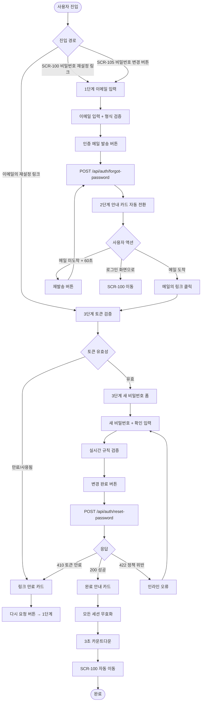
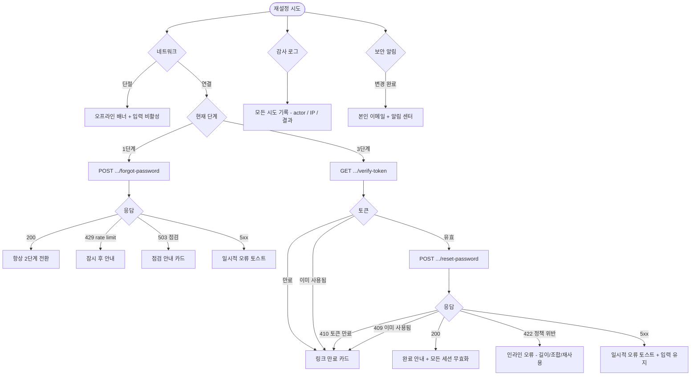

# SCR-106 비밀번호 재설정 페이지

## 1. 화면 메타 정보

이 문서는 비밀번호 재설정 페이지에 대한 자기완결형 요구사항 정의서입니다. 다른 문서를 함께 보지 않아도 이 문서 한 장만으로 비밀번호 재설정 페이지에 들어가는 모든 단계, 모든 입력, 모든 버튼, 모든 권한, 모든 예외 처리, 그리고 이 화면을 지탱하는 운영 정책까지 전부 이해하고 구현할 수 있도록 작성합니다.

| 항목 | 값 |
|---|---|
| 작성일 | 2026-05-22 |
| 버전 | v1.0 |
| 상태 | 최신 통합본 반영 (정합화 완료) |
| 도메인 | D01 공통 |
| 화면 ID | SCR-106 |
| 화면명 | 비밀번호 재설정 |
| 화면 유형 | 다단계 폼 (3단계 스텝) |
| 라우트 (URL) | `/reset-password` |
| 플랫폼 | 데스크톱(기본), 태블릿, 모바일(풀스크린) |
| 우선순위 | P0 (출시 필수) |
| 기능코드 | MFN-SCR-106 (비밀번호 재설정) |
| 계약코드 | 본 화면 직접 계약코드 없음, AUTH-01 보안 정책 연계 |
| 계약 상태 | 비계약 본기능 |
| 부모 기능 prefix | MFN |
| Lv1 코드 | MFN-SCR-106 |
| Lv2 / Lv3 세분화 | MFN-SCR-106-01 ~ MFN-SCR-106-08 (진입 경로, 1단계 이메일 입력, 2단계 발송 안내·재발송, 3단계 새 비밀번호 입력, 비밀번호 확인 검증, 변경 완료 처리, 링크 만료, 최근 비밀번호 재사용 차단) |
| 연계 화면 | SCR-100 로그인(변경 후 자동 이동), SCR-105 프로필 계정(로그인 상태 진입 경로) |
| 호출 다이얼로그 | 직접 호출 없음. 로그인 상태에서 미저장 이탈 시 DLG-002 조건적 트리거 |

## 2. 화면 개요와 목적

비밀번호 재설정 페이지는 운영자가 비밀번호를 분실했거나 정기적인 보안 갱신이 필요할 때 새 비밀번호를 안전하게 설정하는 다단계 폼입니다. 본 시스템은 `직원 1명 = 로그인 계정 1개` 원칙을 따르므로 비밀번호는 그 사람만의 보안 자산이며, 어떤 운영자나 관리자도 다른 사람의 비밀번호를 대신 보거나 설정해서는 안 됩니다. 따라서 본 화면은 이메일 인증을 통해 본인 확인을 한 뒤, 본인만 알고 있는 새 비밀번호로 갱신하는 self-service 프로세스를 제공합니다.

이 화면이 다루는 운영 흐름은 두 가지입니다. 첫 번째는 비로그인 진입으로, 사용자가 비밀번호를 잊어버려 로그인 화면(SCR-100)의 "비밀번호 재설정" 링크로 들어오는 경우입니다. 이메일 입력 → 인증 메일 발송 → 메일의 링크 클릭 → 새 비밀번호 설정의 3단계를 거쳐 완료되며, 완료 후에는 자동으로 SCR-100 로그인 화면으로 이동해 새 비밀번호로 다시 로그인합니다. 두 번째는 로그인 상태 진입으로, 이미 로그인된 사용자가 SCR-105 프로필 계정의 "비밀번호 변경" 버튼으로 들어오는 경우입니다. 이때는 본인 확인이 이미 끝난 상태이므로 백엔드 정책에 따라 1·2단계를 건너뛰고 곧장 3단계(새 비밀번호 설정)로 진입하거나, 그대로 3단계 흐름을 따르되 이메일 채널은 보안 알림 용도로만 사용합니다.

이 화면은 단순한 폼이 아니라, 본인 확인(이메일 인증)·1회용 토큰·1시간 만료·재발송 쿨다운·비밀번호 정책 검증·최근 5개 재사용 차단·완료 후 모든 세션 무효화까지 모두 반영된 보안 핵심 흐름으로 동작합니다. 비로그인 환경에서 시작되는 경우가 많아 사이드바·헤더가 모두 제거된 단일 카드형 레이아웃을 사용합니다.

## 3. 진입 경로와 인접 화면

비밀번호 재설정 페이지에 진입하는 경로는 다음 세 가지가 있고, 각 경로마다 시작 단계와 본인 확인 방식이 다릅니다.

첫 번째 경로는 로그인 화면(SCR-100)의 "비밀번호 재설정" 링크 클릭입니다. 비로그인 사용자가 본인 비밀번호를 분실한 경우의 표준 흐름이며, 본 화면의 1단계(이메일 입력)에서 시작합니다. SCR-100의 폼에 입력 중이던 이메일이 있으면 자동으로 1단계 이메일 입력란에 채워집니다.

두 번째 경로는 프로필 계정(SCR-105)의 "비밀번호 변경" 버튼 클릭입니다. 이미 로그인된 사용자가 본인 비밀번호를 변경하고자 할 때의 흐름이며, 본 화면의 1단계 또는 3단계로 직접 진입할 수 있습니다. 본사 보안 정책에 따라, 이미 로그인된 상태라도 이메일 인증 단계를 거치게 하는 환경과, 본인 비밀번호 재확인만으로 3단계로 직진하는 환경이 분기됩니다. 본 문서는 표준으로 1단계부터 시작하는 흐름을 기준으로 작성하되, 로그인 상태 사용자에게는 1단계 이메일 입력란이 본인 등록 이메일로 자동 채워지고 읽기 전용으로 표시됩니다.

세 번째 경로는 이메일로 받은 재설정 링크 클릭입니다. 사용자가 1단계에서 인증 메일을 발송받은 뒤 받은 메일에서 "새 비밀번호 설정" 링크를 클릭하면 본 화면의 3단계로 직접 진입합니다. URL에는 1회용 토큰이 쿼리 파라미터로 포함되어 있으며, 진입 시점에 토큰의 유효성을 검증합니다. 토큰이 유효하면 3단계 폼이 표시되고, 만료되었거나 이미 사용된 토큰이면 안내 페이지가 표시되며 다시 1단계로 돌아가도록 유도됩니다.

이 화면에서 빠져나가는 인접 화면은 다음과 같습니다. 변경 완료 후에는 모든 세션이 무효화된 채 SCR-100 로그인 화면으로 자동 이동하며, 변경 완료 토스트가 표시되어 새 비밀번호로 재로그인하도록 유도합니다. 1·2단계에서 "로그인 화면으로 돌아가기" 링크를 누르면 SCR-100으로 이동합니다. 로그인 상태에서 본 화면에 진입한 사용자가 변경을 완료하면 보안 정책에 따라 SCR-100으로 강제 이동(기존 세션 폐기 정책)되거나 SCR-105 프로필 계정으로 복귀합니다. 본 문서는 보안을 우선해 변경 완료 시 SCR-100으로 이동하는 것을 표준으로 정의합니다.

## 4. 레이아웃과 UI 구성

비밀번호 재설정 페이지는 SCR-100 로그인과 유사한 단일 카드형 레이아웃을 따릅니다. 사이드바와 상단 헤더가 모두 제거되며, 화면 중앙에 너비 약 420px의 카드가 떠 있고 모바일에서는 풀스크린으로 펼쳐집니다. 카드는 단계별로 다른 내용을 표시하지만 공통 영역이 유지됩니다.

가장 위에는 브랜드 헤더가 있습니다. 헤더에는 서비스 로고와 서비스명이 가운데 정렬로 표시되어 사용자가 어떤 시스템의 비밀번호를 재설정하는지 즉시 확인할 수 있습니다. 헤더 아래에는 단계 표시(1/3, 2/3, 3/3)가 작게 표시되어 사용자가 현재 어느 단계에 있는지를 알려줍니다.

1단계 카드는 이메일 입력 폼입니다. 카드 본문 가장 위에는 "비밀번호 재설정" 타이틀과 함께 "가입 시 사용한 이메일을 입력하시면 재설정 링크를 보내드립니다" 안내가 표시됩니다. 그 아래에 이메일 입력란이 autofocus 상태로 노출되며, type=email로 설정되어 모바일에서 이메일용 키보드가 뜨고 placeholder에는 "이메일을 입력하세요"가 표시됩니다. 입력란 아래에는 "인증 메일 발송" 버튼이 풀 폭으로 배치되며, 이메일 형식이 유효하지 않으면 비활성 상태로 유지됩니다. 카드 가장 아래에는 "로그인 화면으로 돌아가기" 텍스트 링크가 작게 표시되어 SCR-100으로 복귀할 수 있게 합니다.

2단계 카드는 인증 메일 발송 안내입니다. 카드 본문 가장 위에는 봉투 모양 아이콘과 함께 "이메일을 확인해주세요" 타이틀이 표시되고, 그 아래에 "입력하신 이메일로 재설정 링크를 발송했습니다" 안내와 함께 사용자가 입력한 이메일이 부분 마스킹된 형태로 표시됩니다(예: ad***@example.com). 안내 아래에는 "이메일을 받지 못하셨나요?" 부제목과 함께 "스팸함을 확인해주세요" 안내가 따라옵니다. 그 아래에 "이메일 재발송" 버튼이 노출되며 60초 쿨다운이 적용되어 남은 시간이 초 단위로 카운트다운됩니다. 카드 가장 아래에는 "로그인 화면으로 돌아가기" 링크가 있습니다. 이 단계는 사용자가 메일함을 열어 링크를 클릭할 때까지 대기하는 단계로, 실제로는 같은 브라우저 탭을 떠나 메일 클라이언트로 이동하는 경우가 일반적입니다.

3단계 카드는 새 비밀번호 설정 폼입니다. 사용자가 이메일의 재설정 링크를 클릭해 본 화면의 `/reset-password/confirm?token={token}` URL로 진입한 시점부터 표시됩니다. 카드 본문 가장 위에는 자물쇠 모양 아이콘과 함께 "새 비밀번호 설정" 타이틀이 표시되고, 그 아래에 새 비밀번호 입력란과 새 비밀번호 확인 입력란이 세로로 배치됩니다. 두 입력란 모두 type=password로 마스킹된 상태가 기본이며, 입력란 우측에 표시/숨김 토글(눈 아이콘)이 있어 평문 보기와 마스킹을 전환할 수 있습니다. 두 번째 입력란 아래에는 비밀번호 규칙 안내(최소 8자, 영문·숫자·특수문자 조합 필수)가 항상 노출되어 사용자가 충족 여부를 시각적으로 확인할 수 있습니다. 충족된 규칙에는 체크 표시가, 미충족 규칙에는 회색 점이 표시됩니다. 또한 비밀번호 강도 표시 바(약/보통/강)가 입력 중 실시간으로 채워집니다. 카드 가장 아래에는 "변경 완료" 버튼이 풀 폭으로 배치되며, 두 입력값이 일치하고 모든 규칙을 충족했을 때만 활성화됩니다.

링크 만료 카드는 사용자가 이미 만료되었거나 사용된 1회용 토큰으로 진입한 경우에 표시됩니다. 카드 본문에는 경고 아이콘과 함께 "재설정 링크가 만료되었습니다" 또는 "이미 사용된 링크입니다" 타이틀이 표시되고, 그 아래에 "다시 요청해주세요" 안내와 "비밀번호 재설정 다시 요청하기" 버튼이 노출되어 클릭 시 1단계로 돌아갑니다.

완료 안내 카드는 새 비밀번호가 성공적으로 저장된 직후 짧게 표시되며, "비밀번호가 변경되었습니다" 메시지와 함께 자동 이동 카운트다운("3초 후 로그인 화면으로 이동합니다")이 함께 표시됩니다. 사용자가 카운트다운을 기다리지 않고 즉시 이동하고 싶으면 "지금 이동" 링크를 누를 수 있습니다.

모든 단계의 카드 푸터 영역에는 본사 정책에 따라 약관·고객센터 같은 정적 링크가 작게 배치될 수 있습니다.

## 5. 단계별 동작과 검증

비밀번호 재설정은 3단계로 구성되며, 각 단계가 다른 검증과 처리를 가집니다. 단계별로 흐름을 풀어 적습니다.

### 1단계 — 이메일 입력

사용자가 이메일 입력란에 가입 시 사용한 이메일을 입력합니다. 입력 중 실시간으로 이메일 형식이 검증되며, `@`가 없거나 빈 값이면 인증 메일 발송 버튼이 비활성 상태로 유지됩니다. 이메일이 유효한 형식이 되면 버튼이 활성화됩니다.

사용자가 인증 메일 발송 버튼을 누르면 클라이언트가 클라이언트 측 검증을 다시 한 번 수행한 뒤 `POST /api/auth/forgot-password`를 호출합니다. 요청 본문에는 email이 포함되며, 응답 대기 동안 버튼이 비활성화되고 안에 스피너가 표시됩니다.

응답이 돌아오면 보안 정책에 따라 항상 같은 메시지로 처리됩니다. 백엔드는 입력된 이메일이 실제로 존재하는 계정인지 여부와 무관하게 200을 반환하며, 존재하는 계정이면 실제로 재설정 메일을 발송하고, 존재하지 않는 계정이면 메일을 발송하지 않습니다. 이는 계정 존재 여부를 외부에 노출하지 않기 위한 보안 정책으로, 사용자에게는 어느 경우든 동일한 "메일을 발송했습니다" 안내가 표시되어 2단계 카드로 자동 전환됩니다. 이 정책 덕분에 공격자가 본 시스템에 어떤 이메일이 등록되어 있는지를 추측하지 못합니다.

### 2단계 — 인증 메일 확인 안내

1단계 처리 직후 2단계 카드로 자동 전환됩니다. 카드에는 발송 완료 메시지와 함께 사용자가 입력한 이메일이 부분 마스킹되어 표시됩니다. 사용자는 이 시점에 메일 클라이언트로 이동해 받은 메일에서 "새 비밀번호 설정" 링크를 클릭합니다. 링크에는 1회용 토큰이 쿼리 파라미터로 포함되어 있으며, 토큰은 1시간 유효하고 사용 즉시 폐기됩니다.

사용자가 메일을 받지 못한 경우 60초 쿨다운 후 "이메일 재발송" 버튼이 활성화됩니다. 클릭 시 `POST /api/auth/forgot-password`가 다시 호출되어 새 토큰이 생성된 메일이 발송됩니다. 이전 토큰은 새 토큰 발급 시점에 즉시 무효화되어 두 토큰이 동시에 유효한 일이 없도록 합니다. 쿨다운 동안에는 버튼이 비활성화되고 남은 시간이 초 단위로 카운트다운됩니다.

2단계 카드는 사용자가 직접 다음 단계로 진행하지 않습니다. 사용자가 메일의 링크를 클릭해 새 탭 또는 같은 탭에서 본 화면의 3단계 URL로 진입하는 시점에 자연스럽게 3단계로 전환됩니다.

### 3단계 — 새 비밀번호 설정

사용자가 메일의 재설정 링크를 클릭하면 `/reset-password/confirm?token={token}` URL로 진입합니다. 진입 시점에 클라이언트가 토큰을 백엔드에 검증 요청(`GET /api/auth/reset-password/verify-token?token={token}`)하거나, 별도 검증 없이 새 비밀번호 입력을 받은 뒤 제출 시점에 검증하는 방식 둘 다 가능합니다. 본 문서는 진입 시점에 가벼운 검증을 먼저 수행해 만료된 토큰이면 곧장 링크 만료 카드를 표시하는 흐름을 표준으로 정의합니다.

토큰이 유효하면 새 비밀번호 입력 폼이 표시됩니다. 사용자가 새 비밀번호 입력란에 입력을 시작하면 실시간으로 비밀번호 규칙 검증이 작동하여 최소 8자, 영문 포함, 숫자 포함, 특수문자 포함 같은 조건이 충족 여부 체크 표시로 즉시 표시됩니다. 비밀번호 강도(약/보통/강)도 입력 중 실시간으로 표시됩니다.

새 비밀번호 확인 입력란에 두 번째 비밀번호를 입력하면 첫 번째 입력값과의 일치 여부가 실시간으로 검증됩니다. 일치하지 않으면 두 번째 입력란 아래에 "비밀번호가 일치하지 않습니다" 인라인 오류가 표시되고, 일치하면 오류가 사라집니다.

두 입력값이 일치하고 모든 규칙이 충족된 시점에 "변경 완료" 버튼이 활성화됩니다. 사용자가 버튼을 누르면 클라이언트 측 검증이 한 번 더 수행되고, `POST /api/auth/reset-password`가 호출됩니다. 요청 본문에는 token과 new_password가 포함되며, 응답 대기 동안 버튼이 비활성화되고 안에 스피너가 표시됩니다.

응답이 200이면 새 비밀번호가 저장되고 모든 기존 세션이 무효화됩니다. 본 화면은 완료 안내 카드로 전환되며 "비밀번호가 변경되었습니다" 메시지와 3초 카운트다운 후 SCR-100 로그인 화면으로 자동 이동합니다.

응답이 4xx면 사유에 따라 인라인 또는 카드 전환으로 분기됩니다. 토큰 만료(410)는 링크 만료 카드로 전환, 이미 사용된 토큰(409)도 링크 만료 카드로 전환, 비밀번호 정책 위반(422)은 본 화면 안의 해당 입력란에 인라인 오류 표시, 최근 5개 재사용(422 with reason=password_recently_used)은 "최근에 사용한 비밀번호는 사용할 수 없습니다" 인라인 오류로 표시됩니다.

응답이 5xx면 "일시적 오류가 발생했습니다. 잠시 후 다시 시도해주세요" 토스트가 표시되고 입력값은 유지되어 사용자가 재시도할 수 있습니다.

## 6. 버튼·아이콘·링크 액션 전체 정의

이 화면에 등장하는 모든 클릭 가능한 요소를 빠짐없이 정의합니다.

1단계의 이메일 입력란은 텍스트 입력 영역이며 autofocus가 적용됩니다. Tab 키로 다음 영역(인증 메일 발송 버튼)으로 이동할 수 있고, Enter 키는 폼 제출을 트리거해 인증 메일 발송 버튼 클릭과 동일하게 동작합니다.

1단계의 인증 메일 발송 버튼은 이메일 형식이 유효할 때만 활성화됩니다. 클릭 시 `POST /api/auth/forgot-password`가 호출되며, 응답 대기 동안 비활성화됩니다. 응답이 돌아오면 보안 정책상 항상 2단계 카드로 전환됩니다.

1단계의 "로그인 화면으로 돌아가기" 링크는 SCR-100으로 라우팅합니다. 1단계는 dirty 상태로 간주되지 않으므로 별도 확인 없이 즉시 이동합니다.

2단계의 이메일 재발송 버튼은 60초 쿨다운이 적용됩니다. 쿨다운 동안 비활성화되며 남은 시간이 초 단위로 표시됩니다. 쿨다운이 끝나면 활성화되어 클릭 시 `POST /api/auth/forgot-password`가 다시 호출됩니다. 이전 토큰은 새 토큰 발급 시점에 즉시 무효화됩니다.

2단계의 "로그인 화면으로 돌아가기" 링크는 SCR-100으로 이동합니다.

3단계의 새 비밀번호 입력란과 확인 입력란은 각각 표시/숨김 토글(눈 아이콘)을 가지며, 클릭 시 입력란의 type 속성이 text와 password 사이에서 토글됩니다. 보안상 평문 상태는 5초 후 또는 입력란 blur 시 자동으로 마스킹으로 복원됩니다.

3단계의 변경 완료 버튼은 두 입력값이 일치하고 모든 비밀번호 규칙을 충족했을 때만 활성화됩니다. 클릭 시 `POST /api/auth/reset-password`가 호출되며, 응답 대기 동안 비활성화됩니다.

링크 만료 카드의 "비밀번호 재설정 다시 요청하기" 버튼은 1단계로 돌아가는 라우팅을 수행합니다. 클릭 시 본 화면의 1단계가 빈 폼 상태로 다시 표시됩니다.

완료 안내 카드의 "지금 이동" 링크는 카운트다운을 기다리지 않고 SCR-100으로 즉시 이동합니다.

모든 버튼은 응답이 돌아오는 동안 자동으로 비활성화되어 더블클릭이나 연타로 인한 중복 요청이 차단됩니다. 동일 IP에서 1분당 N회 이상의 재설정 요청이 감지되면 rate limit이 발동되어 일시적으로 모든 시도가 차단됩니다.

## 7. 호출되는 다이얼로그 동작

비밀번호 재설정 페이지는 자체적으로 다이얼로그를 호출하지 않습니다. 단계별 카드 전환으로 모든 상태를 처리하기 때문에 별도 모달이 떠 있을 일이 없습니다. 다만 로그인 상태에서 본 화면에 진입한 사용자가 미저장 변경(3단계 입력 중)에서 다른 화면으로 이동하려 할 때 DLG-002 이탈 경고가 조건적으로 호출될 수 있습니다.

### 7-1. DLG-002 이탈 경고 다이얼로그 (조건적 트리거)

로그인 상태로 본 화면의 3단계에서 새 비밀번호를 입력 중이던 사용자가 사이드바의 다른 메뉴를 클릭하거나 브라우저 뒤로가기를 누르면, 입력 중인 비밀번호가 손실되지 않도록 DLG-002 이탈 경고가 호출됩니다. 다이얼로그 상단에는 "저장하지 않은 내용이 있습니다" 메시지가, 하단에는 "나가기"와 "계속 편집" 버튼이 표시됩니다. "나가기"를 누르면 입력값을 폐기하고 의도한 화면으로 이동하며, "계속 편집"을 누르면 다이얼로그가 닫히고 본 화면이 유지됩니다.

비로그인 상태에서는 사이드바와 다른 운영 메뉴가 없으므로 이탈 경고가 트리거되지 않습니다. 사용자가 "로그인 화면으로 돌아가기" 링크를 누르면 별도 확인 없이 즉시 이동합니다.

### 7-2. DLG-000 세션 만료 다이얼로그 (해당 없음)

본 화면은 비로그인 상태가 기본이므로 세션 만료가 트리거되지 않습니다. 로그인 상태로 진입한 경우에도 본인 비밀번호 변경 흐름은 일반 세션 만료 가드와 동일하게 동작하며, 만료 시 부모 화면 위에 DLG-000이 표시될 수 있습니다.

## 8. 토스트와 안내 메시지

비밀번호 재설정 페이지에서 발생하는 모든 알림성 UI는 다음과 같은 패턴으로 동작합니다.

성공 안내는 단계 카드 전환 형태로 처리됩니다. 1단계 완료 시 2단계 카드로 자동 전환되어 "이메일을 발송했습니다" 안내가 카드 본문에 표시되고, 3단계 완료 시 완료 안내 카드로 전환되어 "비밀번호가 변경되었습니다" 메시지가 표시됩니다. 별도의 토스트는 사용하지 않습니다.

실패 안내는 인라인 오류 또는 카드 전환으로 처리됩니다. 이메일 형식 오류는 "올바른 이메일 형식을 입력해주세요" 인라인 오류로, 비밀번호 정책 위반은 "최소 8자 이상이어야 합니다", "특수문자를 포함해야 합니다" 같은 인라인 오류로, 토큰 만료는 링크 만료 카드 전환으로 표시됩니다.

서버 오류(5xx)는 토스트로 분리되어 "일시적 오류가 발생했습니다. 잠시 후 다시 시도해주세요" 안내와 "다시 시도" 보조 액션이 제공됩니다.

rate limit 초과(429)는 카드 본문 상단에 "잠시 후 다시 시도해주세요" 배너가 표시되고 모든 입력과 버튼이 일시 비활성화됩니다.

비밀번호 변경 완료 후 SCR-100으로 이동한 직후에는 로그인 화면 상단에 "비밀번호가 변경되었습니다. 새 비밀번호로 로그인해주세요" 토스트가 표시되어 사용자가 다음 행동을 자연스럽게 이어 갈 수 있게 합니다.

확인 팝업은 본 화면에서 직접 사용되지 않습니다(로그인 상태의 DLG-002 조건적 트리거 제외).

알럿은 사용되지 않습니다.

## 9. 데이터 흐름과 외부 연동

이 화면은 이메일 채널, 1회용 토큰, 비밀번호 정책 검증을 모두 다루는 보안 핵심 화면입니다. 화면 단위로 어떤 데이터가 어디서 오고 어디로 가는지를 모두 풀어 씁니다.

1단계 시점에 `POST /api/auth/forgot-password`가 호출됩니다. 요청 본문에는 email이 포함되며, 응답은 보안 정책상 항상 200으로 통일됩니다. 백엔드는 이메일이 실제로 존재하는 계정인지 확인하고, 존재하면 1회용 토큰을 생성해 이메일 발송 큐에 작업을 등록합니다. 존재하지 않으면 아무 처리도 하지 않지만 응답은 동일합니다. 토큰은 1시간 유효이며 사용 즉시 폐기됩니다. 토큰은 충분히 긴 임의의 안전한 문자열(예: 64자 URL-safe base64)로 생성되어 추측 공격을 차단합니다.

이메일 발송은 비동기 큐가 처리합니다. 발송된 메일에는 "새 비밀번호 설정" 링크가 포함되며 링크는 `https://{도메인}/reset-password/confirm?token={토큰}` 형태입니다. 메일 본문에는 "이 메일을 요청하지 않으셨다면 무시해주세요" 같은 보안 안내도 함께 포함되어, 누군가 다른 사람의 이메일로 잘못 시도한 경우 메일 수신자가 인지할 수 있게 합니다.

3단계 진입 시점에 `GET /api/auth/reset-password/verify-token?token={토큰}`이 호출되어 토큰 유효성이 검증됩니다. 응답이 200이면 새 비밀번호 폼이 표시되고, 410(만료)이나 409(이미 사용됨)이면 링크 만료 카드로 전환됩니다.

3단계 제출 시점에 `POST /api/auth/reset-password`가 호출됩니다. 요청 본문에는 token과 new_password가 포함됩니다. 백엔드는 토큰을 다시 한 번 검증하고, 비밀번호 정책을 검증하며, 최근 5개 비밀번호와의 중복 여부를 확인합니다. 모든 검증을 통과하면 새 비밀번호를 bcrypt 같은 안전한 해시로 저장하고 토큰을 폐기합니다. 동시에 그 계정의 모든 활성 세션이 강제 만료되어, 본인이 다른 단말에서 로그인 중이었어도 즉시 로그아웃됩니다.

비밀번호 정책 검증 규칙은 다음과 같습니다. 최소 8자, 영문 포함, 숫자 포함, 특수문자 포함이 기본이며, 본사 정책에 따라 사전 단어 차단·연속 문자 차단(예: "123456", "qwerty")이 추가됩니다. 최근 5개 비밀번호 재사용 차단은 백엔드에서 본인의 과거 비밀번호 해시 5개를 별도로 저장해 새 비밀번호의 해시가 그 중 하나와 일치하면 거부합니다.

비밀번호 변경 완료 직후 모든 세션이 무효화되는 정책은 보안 사고 발생 시 다른 단말의 잔류 세션을 차단하기 위함입니다. 본인은 새 비밀번호로 다시 로그인해야 하며, 본인이 사용 중이던 모든 단말에서 로그아웃 상태가 됩니다.

감사 로그 정책에 따라 비밀번호 재설정 요청·재발송·완료·실패 같은 보안 이벤트가 SCR-097 감사 로그에 actor·IP·디바이스·UA·결과·시각으로 기록됩니다. 토큰 만료된 채로 시도된 요청도 기록되어 무차별 시도를 추적합니다.

알림 센터(NFR-19)는 비밀번호 변경 완료 시 본인 이메일과 알림 채널로 보안 알림을 발송합니다. "본인 계정의 비밀번호가 변경되었습니다. 본인이 변경하지 않았다면 즉시 관리자에게 문의해주세요" 메시지로 본인이 의심스러운 변경을 즉시 감지할 수 있게 합니다.

rate limit 정책은 동일 IP에서 1분당 N회 초과 요청을 임시 차단해 무차별 재설정 시도를 막습니다.

화면에서 호출하는 주요 API 엔드포인트는 다음과 같습니다. 비밀번호 재설정 요청 `POST /api/auth/forgot-password`, 토큰 유효성 검증 `GET /api/auth/reset-password/verify-token`, 새 비밀번호 저장 `POST /api/auth/reset-password`.

## 10. 화면 상태와 예외 처리

비밀번호 재설정 페이지는 다음 상태들을 가질 수 있고, 각 상태마다 사용자에게 보이는 모습이 달라집니다.

1단계 입력 대기 상태는 화면 진입 직후로, 이메일 입력란이 빈 상태이며 인증 메일 발송 버튼은 비활성입니다.

1단계 처리 중 상태는 인증 메일 발송 버튼 클릭 후 응답을 기다리는 짧은 상태로, 버튼에 스피너가 표시되고 입력란이 비활성화됩니다.

2단계 안내 상태는 1단계 처리 완료 후 자동으로 전환된 상태로, 발송 완료 메시지와 재발송 버튼(60초 쿨다운)이 표시됩니다.

3단계 입력 대기 상태는 사용자가 메일 링크로 진입한 직후로, 토큰 검증이 통과한 상태입니다. 새 비밀번호 입력란이 autofocus되고 변경 완료 버튼은 비활성입니다.

3단계 입력 중 상태는 사용자가 새 비밀번호와 확인을 입력하는 동안의 상태로, 실시간 규칙 검증과 일치 여부 검증이 작동합니다.

3단계 처리 중 상태는 변경 완료 버튼 클릭 후 응답을 기다리는 짧은 상태입니다.

완료 상태는 3단계 처리 성공 직후로, 완료 안내 카드가 표시되고 3초 카운트다운 후 SCR-100으로 자동 이동합니다.

링크 만료 상태는 토큰이 만료되었거나 이미 사용된 상태로, 링크 만료 카드가 표시되고 다시 요청 버튼이 노출됩니다.

서비스 점검 상태는 본사 슈퍼관리자가 점검 모드를 켠 경우로, 본 화면 전체가 점검 안내 카드로 교체됩니다.

오프라인 상태는 네트워크가 단절된 상태로, 카드 상단에 오프라인 배너가 표시되고 모든 액션 버튼이 비활성화됩니다.

예외 케이스별 처리는 다음과 같이 정의됩니다.

이메일 형식 오류는 인라인 오류 "올바른 이메일 형식을 입력해주세요"로 표시됩니다.

존재하지 않는 이메일은 보안상 발송 성공처럼 표시됩니다. 사용자는 어느 경우든 동일하게 2단계 안내를 보게 되며, 실제 메일은 발송되지 않습니다.

인증 링크 만료(1시간 경과)는 "재설정 링크가 만료되었습니다. 다시 요청해주세요" 안내와 재발송 버튼이 표시됩니다.

이미 사용된 링크는 "이미 사용된 링크입니다. 다시 요청해주세요" 안내가 표시됩니다.

새 비밀번호 정책 미충족은 규칙별 인라인 오류로 표시됩니다. 충족된 규칙에 체크 표시, 미충족 규칙에 오류 안내가 즉시 보입니다.

비밀번호 확인 불일치는 "비밀번호가 일치하지 않습니다" 인라인 오류로 표시됩니다.

최근 5개 비밀번호 재사용은 "최근에 사용한 비밀번호는 사용할 수 없습니다" 인라인 오류로 표시됩니다.

API 서버 오류(5xx)는 "일시적 오류가 발생했습니다. 잠시 후 다시 시도해주세요" 토스트가 표시되고 입력값은 유지됩니다.

rate limit 초과(429)는 카드 상단에 "잠시 후 다시 시도해주세요" 배너가 표시되고 모든 입력이 일시 비활성화됩니다.

오프라인 상태에서는 카드 상단에 오프라인 배너가 표시되고 모든 액션이 비활성화됩니다.

비밀번호 변경 완료 후 모든 세션이 무효화되므로, 본인이 다른 단말에서 로그인 중이던 세션도 자동으로 끊어집니다.

## 11. 권한별 처리

이 화면은 본질적으로 비로그인 사용자가 진입할 수 있는 자기 보안 self-service 화면이므로 일반적인 권한별 처리와는 다른 방식으로 동작합니다.

비로그인 사용자는 본 화면에 자유롭게 진입할 수 있습니다. 1단계 이메일 입력 시 본인 이메일을 입력하고 메일 인증을 통해 본인 확인을 거친 뒤 3단계에서 새 비밀번호를 설정할 수 있습니다.

슈퍼관리자(superAdmin), 본사 최고관리자(primary), 센터장(owner), 매니저(manager), FC(fc), 스태프(staff), 트레이너(trainer), 읽기 전용(readonly) 모든 역할이 로그인 상태에서도 본 화면에 진입해 본인 비밀번호를 변경할 수 있습니다. 본인 비밀번호 변경은 보안상 모든 역할의 본인 권한에 속하므로 차별이 없습니다.

다른 사용자의 비밀번호를 본 화면에서 변경할 수 있는 권한은 어떤 역할에게도 부여되지 않습니다. 슈퍼관리자가 다른 직원의 비밀번호를 초기화하려면 직원 관리 화면(SCR-061)에서 임시 비밀번호 발급 또는 강제 재설정 메일 발송 기능을 사용해야 하며, 본 화면을 통해 다른 사람의 비밀번호를 설정하는 경로는 존재하지 않습니다.

본 화면은 비로그인 진입을 허용하기 때문에 본질적으로 권한 검증이 없습니다. 다만 보안 정책상 다음과 같은 보호 장치가 있습니다. 첫째, 토큰은 1시간 유효이며 사용 즉시 폐기됩니다. 둘째, 토큰은 충분히 긴 임의 문자열로 생성되어 추측 공격을 차단합니다. 셋째, rate limit이 적용되어 무차별 재설정 시도가 차단됩니다. 넷째, 비밀번호 변경 완료 시 본인의 모든 세션이 무효화되어 의심스러운 변경이 일어났을 때 영향을 최소화합니다. 다섯째, 변경 완료 알림이 본인 이메일과 알림 센터로 발송되어 본인이 의심스러운 변경을 즉시 감지할 수 있게 합니다.

비활성·휴직·잠금 상태 계정도 본 화면에서 비밀번호를 재설정할 수 있는지는 본사 정책에 따라 다릅니다. 표준 정책은 비활성·휴직 계정의 self-service 재설정을 차단하고 슈퍼관리자에게만 재설정 권한을 부여합니다. 잠금 계정은 30분 자동 해제 후 또는 슈퍼관리자 수동 해제 후에야 본 화면을 사용할 수 있습니다.

권한이 부족해서 액션이 차단된 경우의 사용자 경험은 단순합니다. 비활성·휴직 계정 이메일로 1단계 요청을 보내면 보안상 발송 성공처럼 표시되지만 실제 메일은 발송되지 않으며, 사용자에게는 "메일이 도착하지 않으면 관리자에게 문의해주세요" 안내가 추가로 보일 수 있습니다.

## 12. 메인 흐름

비밀번호 재설정 페이지의 핵심 동작 흐름을 다이어그램으로 표현합니다. 사용자가 1단계에 진입한 시점부터 3단계 완료 후 SCR-100으로 이동하기까지의 가장 일반적인 정상 흐름입니다.

## 13. 에러 흐름

비밀번호 재설정 페이지에서 발생할 수 있는 주요 에러와 그 처리 흐름을 다이어그램으로 표현합니다. 토큰 만료·정책 위반·rate limit·서비스 점검·오프라인이 어떻게 분기되는지를 정의합니다.

## 14. 운영 정책 — 비밀번호 / 재설정 / 보안 자기완결 정리

이 절은 본 화면이 의존하는 비밀번호·재설정·보안 운영 정책을 외부 문서 참조 없이 풀어 적습니다.

비밀번호 정책은 최소 8자, 영문 포함, 숫자 포함, 특수문자 포함을 기본 규칙으로 합니다. 사전 단어와 연속 문자(예: "123456", "qwerty")는 본사 정책에 따라 추가 차단됩니다. 비밀번호는 평문 저장이 금지되며 bcrypt 같은 안전한 해시 알고리즘으로 저장되어 로그·응답에 절대 노출되지 않습니다.

최근 비밀번호 재사용 차단 정책은 최근 5개 비밀번호와의 중복을 검증합니다. 백엔드가 본인의 과거 비밀번호 해시 5개를 별도로 저장해 새 비밀번호의 해시가 그 중 하나와 일치하면 거부합니다.

비밀번호 만료 정책은 90일 기본이며 본사 정책에서 30/60/90/180일로 조정 가능합니다. 만료된 비밀번호로 로그인을 시도하면 SCR-100에서 강제 변경 단계가 삽입되어 본 화면 또는 동등한 비밀번호 변경 흐름이 진행됩니다.

1회용 토큰 정책은 본 화면 핵심 보안 메커니즘입니다. 토큰은 충분히 긴 임의의 안전한 문자열(예: 64자 URL-safe base64)로 생성되며 1시간 유효이고 사용 즉시 폐기됩니다. 동시에 여러 토큰이 유효하지 않도록 새 토큰 발급 시 이전 토큰은 즉시 무효화됩니다.

계정 존재 여부 노출 차단 정책은 1단계 응답을 항상 동일하게(성공처럼) 처리해 공격자가 어떤 이메일이 등록되어 있는지 추측하지 못하도록 합니다. 실제 메일 발송 여부는 백엔드에서만 분기되며 사용자는 어느 경우든 동일한 2단계 안내를 봅니다.

재발송 쿨다운 정책은 2단계에서 60초 쿨다운을 적용해 메일 발송 남용을 방지합니다. 쿨다운 동안 재발송 버튼이 비활성화되고 남은 시간이 표시됩니다.

rate limit 정책은 동일 IP에서 1분당 N회 초과 재설정 요청을 임시 차단합니다. 무차별 재설정 시도(스크래핑·자동화 공격)를 차단하는 안전장치입니다.

모든 세션 무효화 정책은 비밀번호 변경 완료 시점에 본인의 모든 활성 세션(다른 단말 포함)을 즉시 만료시킵니다. 본인은 새 비밀번호로 다시 로그인해야 하며, 이는 의심스러운 변경 시 다른 단말의 잔류 세션을 차단하는 보호 장치입니다.

보안 알림 정책은 비밀번호 변경 완료 시 본인 이메일과 알림 센터로 "본인 계정의 비밀번호가 변경되었습니다" 알림을 발송합니다. 본인이 변경하지 않았는데 이 알림을 받았다면 즉시 관리자에게 문의해 계정 탈취 가능성을 점검합니다.

감사 로그 정책은 비밀번호 재설정 요청·재발송·완료·실패·토큰 만료 시도 등 모든 보안 이벤트를 SCR-097 감사 로그에 actor·IP·디바이스·UA·결과·시각으로 기록합니다. 무차별 시도와 정상 사용을 사후에 분리 분석할 수 있게 합니다.

비활성·휴직·잠금 계정 처리 정책은 self-service 재설정을 본사 정책에 따라 차단할 수 있게 합니다. 표준 정책은 비활성·휴직 계정의 self-service를 차단하고 슈퍼관리자에게만 재설정 권한을 부여합니다. 잠금 계정은 30분 자동 해제 후 또는 슈퍼관리자 수동 해제 후에야 본 화면을 사용할 수 있습니다.

다른 사용자 비밀번호 설정 차단 정책은 본 화면을 통해 다른 사람의 비밀번호를 변경하는 경로를 일체 허용하지 않습니다. 슈퍼관리자가 다른 직원의 비밀번호를 초기화하려면 직원 관리 화면에서 임시 비밀번호 발급 또는 강제 재설정 메일 발송 기능을 사용해야 합니다.

서비스 점검 정책은 본사 슈퍼관리자가 점검 모드를 켤 때 본 화면이 점검 안내 카드로 교체됩니다. 점검 시간 동안 비밀번호 재설정 API가 503을 반환합니다.

이메일 채널 정책은 비밀번호 재설정 메일의 본문 형식·발신 주소·보안 안내 문구를 표준화합니다. 본문에는 "이 메일을 요청하지 않으셨다면 무시해주세요" 같은 안내가 포함되어, 누군가 다른 사람의 이메일로 잘못 시도한 경우 메일 수신자가 인지할 수 있게 합니다.

세션·자동 로그아웃 정책은 본 화면 자체에는 적용되지 않습니다(비로그인 기본). 다만 로그인 상태로 진입한 사용자가 30분 무활동이 되면 일반 세션 만료 흐름이 작동해 부모 화면 위에 DLG-000이 표시될 수 있습니다.

## 15. 변경 이력

| 일자 | 변경 |
|---|---|
| 2026-05-22 | v1.0 자기완결형 요구사항 정의서로 통합본 작성 (기능명세서 MFN-SCR-106, 화면설계서 SCR-106, 비밀번호·재설정·보안 운영 정책 통합) |
