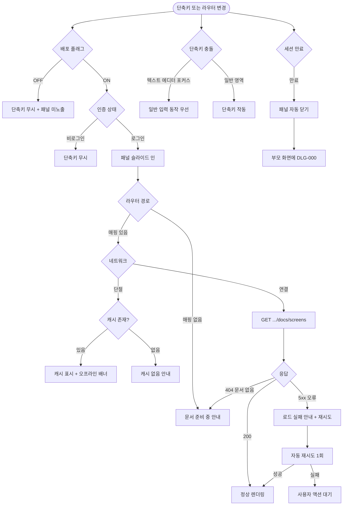

# SCR-107 화면설계서 오버레이

## 1. 화면 메타 정보

이 문서는 화면설계서 오버레이에 대한 자기완결형 요구사항 정의서입니다. 다른 문서를 함께 보지 않아도 이 문서 한 장만으로 화면설계서 오버레이에 들어가는 모든 영역, 모든 탭, 모든 버튼, 모든 권한, 모든 예외 처리, 그리고 이 화면을 지탱하는 운영 정책까지 전부 이해하고 구현할 수 있도록 작성합니다.

| 항목 | 값 |
|---|---|
| 작성일 | 2026-05-22 |
| 버전 | v1.0 |
| 상태 | 최신 통합본 반영 (정합화 완료) |
| 도메인 | D01 공통 |
| 화면 ID | SCR-107 |
| 화면명 | 화면설계서 오버레이 |
| 화면 유형 | 공통 오버레이 (Cmd+/ 단축키로 호출되는 우측 슬라이드 패널) |
| 라우트 (URL) | 전체 화면 공통 (단독 URL 없음, 오버레이 형태) |
| 플랫폼 | 데스크톱(Cmd+/ 또는 Ctrl+/), 태블릿(별도 진입 버튼), 모바일(별도 진입 버튼) |
| 우선순위 | P1 (개발·기획·QA 도구) |
| 기능코드 | MFN-SCR-107 (화면설계서 오버레이) |
| 계약코드 | 본 화면 직접 계약코드 없음 |
| 계약 상태 | 비계약 본기능 (개발·기획 참조 도구) |
| 부모 기능 prefix | MFN |
| Lv1 코드 | MFN-SCR-107 |
| Lv2 / Lv3 세분화 | MFN-SCR-107-01 ~ MFN-SCR-107-12 (단축키 진입, 현재 화면 자동 감지, 문서 로딩, 기능명세 탭, 화면설계 탭, 섹션 아코디언·자동 강조, 내부 검색, 읽기 진행률, 전체보기, 닫기, 바깥 클릭, 문서 없음) |
| 연계 화면 | 전체 화면 (모든 화면에서 호출 가능한 공통 오버레이) |
| 호출 다이얼로그 | 직접 호출 없음 |

## 2. 화면 개요와 목적

화면설계서 오버레이는 개발·기획·QA 팀원이 실제 운영 화면을 보면서 그 화면의 기획 의도와 화면설계 내용을 즉시 참조할 수 있도록 우측에서 슬라이드 인 되는 도구 패널입니다. 사용자가 별도 문서 탭을 열고 닫지 않고도 Cmd+/(Mac) 또는 Ctrl+/(Windows) 단축키 한 번으로 현재 화면의 기능명세와 화면설계 내용을 그 자리에서 확인할 수 있어, 개발·검수·고객 시연 같은 다양한 상황에서 활용됩니다. 본 화면은 운영 데이터에 영향을 주지 않는 순수 참조용 개발 도구이며, 운영자에게는 거의 사용되지 않지만 시스템 이해도를 높이는 보조 채널 역할을 합니다.

이 화면이 다루는 운영 흐름은 다양합니다. 신규 개발자가 회원 목록 화면을 구현하면서 Cmd+/로 화면설계서를 띄워 어떤 영역이 빠졌는지 확인하고, 기획자는 고객사 시연 중 특정 화면의 기획 의도를 즉시 참조하기 위해 같은 단축키로 패널을 열어 보여줍니다. QA 엔지니어는 테스트를 진행하면서 화면별 상태 정의와 예외 처리를 비교하기 위해 패널을 옆에 띄워 두고 작업합니다. 신규 직원이 시스템 사용법을 배울 때도 어떤 화면의 의도를 모르겠을 때 단축키로 즉시 설명을 확인할 수 있습니다.

이 화면은 단순한 문서 뷰어가 아니라, 라우터 경로 자동 감지 + 문서 자동 매핑 + 탭 전환 + 섹션 아코디언 + 내부 검색 + 읽기 진행률 + 전체 화면 확장까지 모두 반영된 통합 참조 도구로 동작합니다. 부모 화면을 가리지 않는 우측 슬라이드 인 형태로 떠 있으며, 같은 단축키 재입력 또는 ESC 키로 즉시 닫힙니다. 프로덕션 환경에서의 노출 여부는 배포 플래그(feature flag)로 제어할 수 있어, 일반 운영 환경에서는 숨길 수도 있습니다.

## 3. 진입 경로와 인접 화면

화면설계서 오버레이에 진입하는 경로는 다음 세 가지가 있고, 각 경로마다 오버레이가 열리는 시점과 표시되는 문서가 다릅니다.

첫 번째 경로는 단축키 Cmd+/(Mac) 또는 Ctrl+/(Windows)입니다. 어떤 화면에 있든 단축키 한 번으로 즉시 오버레이가 우측에서 슬라이드 인 되며, 현재 보고 있는 화면의 문서가 자동으로 매핑되어 표시됩니다. 다른 입력 필드에 포커스가 있어도 단축키가 우선 작동하되, 텍스트 에디터 같은 깊은 입력 영역에서는 충돌을 막기 위해 단축키가 차단될 수 있습니다.

두 번째 경로는 같은 단축키를 다시 누르는 토글 동작입니다. 오버레이가 열린 상태에서 Cmd+/를 다시 누르면 오버레이가 닫힙니다. 글로벌 검색(Cmd+K)과 별도 단축키이므로 두 오버레이가 동시에 떠 있을 일은 없으며, 글로벌 검색이 열린 상태에서 본 오버레이를 호출하면 글로벌 검색이 자동으로 닫히고 본 오버레이가 열립니다.

세 번째 경로는 라우터 경로 변경 시 자동 전환입니다. 오버레이가 이미 열려 있는 상태에서 사용자가 다른 화면으로 이동하면, 본 오버레이는 자동으로 새 화면의 문서로 콘텐츠를 전환합니다. 즉 사용자가 한 번 패널을 열어 두면 화면을 옮기면서도 패널이 따라 다니며 해당 화면의 문서를 계속 보여줍니다.

이 오버레이는 부모 화면 위에 떠 있는 참조 패널이므로 별도로 빠져나가는 인접 화면이 없습니다. 패널을 닫으면 사용자는 그대로 부모 화면에 머무릅니다. 다만 본 패널은 운영 데이터를 다루지 않으므로 회원 상세나 결제 같은 운영 화면으로 직접 이동하지 않으며, 모든 운영 액션은 부모 화면 또는 글로벌 검색에서 처리합니다.

## 4. 레이아웃과 UI 구성

화면설계서 오버레이는 부모 화면 위에 떠 있는 우측 슬라이드 인 패널입니다. 데스크톱에서는 화면 오른쪽 끝에 너비 약 480~560px의 세로 패널이 슬라이드 인 되며, 부모 화면의 가로폭은 그대로 유지되고 패널이 부모 화면 일부를 가립니다. 패널 뒤로는 백드롭을 깔지 않아 사용자가 부모 화면을 부분적으로 보면서 문서를 참조할 수 있게 합니다. 모바일·태블릿에서는 가독성을 위해 풀스크린에 가까운 폭으로 펼쳐지거나 별도의 모달 형태로 표시될 수 있습니다.

가장 위에는 패널 헤더가 있습니다. 헤더 좌측에는 현재 화면의 ID(예: "SCR-100"), 화면명(예: "로그인"), 도메인 카테고리 배지(예: "D01 공통")가 표시되어 사용자가 어느 화면의 문서를 보고 있는지를 즉시 파악할 수 있습니다. 헤더 우측에는 두 개의 아이콘 버튼이 있습니다. 첫 번째는 "전체보기" 버튼으로, 클릭 시 패널이 전체 화면 확장 모드로 전환되어 문서를 더 넓게 볼 수 있습니다. 두 번째는 "닫기(X)" 버튼으로, 클릭 시 오버레이가 슬라이드 아웃 됩니다.

헤더 바로 아래에는 탭 전환 영역이 있습니다. 탭은 "기능명세"와 "화면설계" 두 가지로 구성되며, 기본 활성 탭은 "기능명세"입니다. 각 탭은 클릭으로 전환되며 전환 시 본문 콘텐츠가 그에 맞춰 갱신됩니다. 두 탭은 같은 화면의 다른 측면을 보여줍니다. 기능명세 탭은 그 화면의 기능 목적·Lv2/Lv3 매트릭스·권한·비즈니스 규칙·예외 처리·API 같은 개발 친화적 정보를, 화면설계 탭은 화면 상태별 설계 내용·UI 구성요소 설명·UX 흐름·계정별 차이 같은 기획 친화적 정보를 표시합니다.

탭 전환 영역 아래에는 내부 검색 영역이 있습니다. 작은 검색 입력란이 패널 폭에 맞춰 배치되며, placeholder에는 "패널 내 검색"이 표시됩니다. Ctrl+F 또는 Cmd+F 단축키로 입력란에 즉시 포커스가 잡힙니다. 입력하면 본문 영역 안의 일치하는 텍스트에 노란색 하이라이트가 즉시 적용되고, 일치 항목 수("3건 일치")가 입력란 우측에 표시됩니다. 다음/이전 일치 항목으로 이동하는 화살표 버튼이 함께 노출되어 사용자가 일치 항목 사이를 빠르게 이동할 수 있습니다.

내부 검색 영역 아래에는 본문 콘텐츠가 펼쳐집니다. 본문은 섹션별 아코디언 구조로 구성되며, 각 섹션은 헤더(섹션 제목)와 펼침/접힘 토글로 이루어집니다. 섹션을 클릭하면 그 섹션의 본문이 접히거나 펼쳐지고, 한 번에 여러 섹션을 펼친 상태로 둘 수 있습니다. 패널이 처음 열리는 시점에는 현재 화면과 관련성이 높은 핵심 섹션(예: 화면 목적, 주요 구성요소, 권한별 처리)이 자동으로 펼쳐진 상태로 표시되고 나머지는 접힌 상태로 시작합니다.

본문 안에는 표·코드 블록·다이어그램이 그대로 렌더링됩니다. 표는 가로 스크롤이 가능하게 처리되고, 코드 블록은 모노스페이스 폰트로 강조됩니다. Mermaid 다이어그램은 SVG로 렌더링되어 줌·팬이 가능하며, 이미지가 포함된 문서는 lightbox 형태로 확대 보기를 제공할 수 있습니다.

패널 본문 우측 또는 하단에는 읽기 진행률 표시 바가 있습니다. 사용자의 스크롤 위치를 기반으로 0~100% 사이의 값을 보여주어 사용자가 문서를 어디까지 읽었는지를 시각적으로 알 수 있게 합니다. 진행률 바를 클릭하면 그 위치로 스크롤 점프할 수도 있습니다.

전체보기 모드는 본 오버레이가 화면 전체로 확장된 모드입니다. 사용자가 헤더의 "전체보기" 버튼을 누르면 패널이 부드럽게 확장되어 부모 화면을 완전히 가리고 본 패널이 전체 화면을 차지합니다. 가운데 정렬된 넓은 본문 영역으로 문서를 읽기 편한 형태로 표시되며, 헤더의 같은 버튼이 "원래 크기로" 또는 "축소" 라벨로 바뀌어 다시 원래 사이드 패널 모드로 돌아갈 수 있습니다.

문서 없음 상태에서는 본문 영역에 "해당 화면의 문서를 준비 중입니다" 안내가 일러스트와 함께 표시됩니다. 모든 화면에 문서가 매핑되어 있는 것이 이상적이지만, 새로 추가된 화면이나 아직 문서화되지 않은 화면에서는 이 빈 상태가 일시적으로 나타날 수 있습니다.

## 5. 탭별 콘텐츠와 섹션 구성

본 오버레이는 두 개의 탭으로 구성되며, 각 탭이 같은 화면의 다른 측면을 보여줍니다. 탭별 콘텐츠 구성을 풀어 적습니다.

기능명세 탭은 그 화면의 기능 목적·Lv2/Lv3 세분화 매트릭스·권한·주요 이벤트·예외 처리·API 같은 개발 친화적 정보를 표시합니다. 구체적인 섹션은 다음과 같이 구성됩니다. "기능 목적" 섹션은 그 화면이 왜 존재하는지를 풀어쓰며, "주요 구성요소" 섹션은 화면에 들어가는 영역과 컴포넌트를 표·텍스트로 정리하고, "Lv2 / Lv3 세분화 매트릭스" 섹션은 기능을 세부 액션 단위로 분해해 표로 보여줍니다. "권한" 섹션은 역할별 가능 동작을 정리하고, "주요 이벤트 / 자동화" 섹션은 그 화면에서 트리거되는 백그라운드 처리·배치·알림을 정리하며, "예외 / 에러 처리" 섹션은 예외 케이스별 처리 기준을 표로 정리합니다. "연관 문서"와 "개발 추적 기준" 섹션은 다른 산출물과의 관계를 명시합니다.

화면설계 탭은 화면 상태별 설계·UI 구성요소·UX 흐름·계정별 차이·다이어그램 같은 기획 친화적 정보를 표시합니다. 구체적인 섹션은 다음과 같습니다. "화면 목적" 섹션은 화면의 운영 맥락을 풀어쓰며, "주요 구성요소" 섹션은 UI 영역을 정리하고, "주요 UX 흐름" 섹션은 사용자가 화면을 사용하는 일반 흐름을 번호 순서로 설명합니다. "화면 상태" 섹션은 로딩·정상·빈·오류·오프라인 같은 상태별 설계를 표로 정리하고, "계정별 차이" 섹션은 역할별 보이는 영역의 차이를 정리합니다. "연계 기능 기준" 섹션은 연계 기능명세 문서와의 매핑을, "관련 다이어그램" 섹션은 흐름·상태·권한 같은 보조 다이어그램의 위치를 명시합니다.

두 탭의 섹션 아코디언은 사용자별 localStorage(`overlayDoc:expandedSections:{routeKey}`)에 펼침 상태가 저장되어 같은 화면에서 다시 패널을 열면 사용자가 마지막에 펼쳐 둔 섹션들이 그대로 복원됩니다. 다른 화면으로 이동하면 그 화면의 기본 펼침 상태(핵심 섹션 자동 펼침)가 적용됩니다.

자동 강조 정책은 현재 부모 화면의 라우터 경로 또는 화면 ID와 강한 연관성을 가진 섹션을 자동으로 펼쳐서 강조 표시합니다. 예를 들어 사용자가 회원 목록 화면에 있다면 "주요 구성요소", "권한별 처리", "예외 처리"가 자동으로 펼쳐지고, 사용자가 결제 화면에 있다면 "결제 흐름" 관련 섹션이 자동으로 펼쳐집니다. 강조는 좌측에 얇은 강조 바와 함께 시각적으로 표시되어 사용자가 어디부터 봐야 할지를 직관적으로 알 수 있게 합니다.

내부 검색은 본 패널 안의 모든 콘텐츠를 대상으로 합니다. 입력 시 디바운스 200ms 후 검색이 작동하며, 일치하는 텍스트에 노란색 하이라이트가 즉시 적용됩니다. 일치 항목이 있는 섹션은 자동으로 펼쳐져서 사용자가 일치 항목을 즉시 볼 수 있게 합니다. 다음/이전 버튼은 일치 항목 사이를 순차로 이동하며, 입력란을 비우면 하이라이트가 모두 사라집니다.

## 6. 버튼·아이콘·링크 액션 전체 정의

이 화면에 등장하는 모든 클릭 가능한 요소를 빠짐없이 정의합니다.

단축키 Cmd+/(Mac) 또는 Ctrl+/(Windows)는 어디서든 본 오버레이를 토글합니다. 닫혀 있으면 열고, 열려 있으면 닫습니다. 글로벌 검색(Cmd+K)이 열려 있는 상태에서 본 단축키를 누르면 글로벌 검색이 자동으로 닫히고 본 오버레이가 열립니다.

패널 헤더의 화면 ID/화면명/도메인 배지는 단순 표시 영역이며 클릭 가능하지 않습니다. 다만 화면 ID 옆에 작은 "복사" 아이콘이 함께 표시되어 개발자가 화면 ID를 클립보드로 복사할 수 있게 할 수 있습니다.

패널 헤더의 전체보기 버튼은 클릭 시 패널을 화면 전체로 확장합니다. 같은 위치의 버튼이 "원래 크기로" 또는 "축소" 라벨로 바뀌어 클릭 시 다시 사이드 패널 모드로 돌아갑니다.

패널 헤더의 닫기(X) 버튼은 클릭 시 오버레이를 슬라이드 아웃 시킵니다. ESC 키와 백드롭(외부 영역) 클릭으로도 동일하게 닫힙니다.

탭 전환 영역의 "기능명세" 탭과 "화면설계" 탭은 클릭으로 본문 콘텐츠를 전환합니다. 활성 탭은 강조 표시되며, 비활성 탭은 회색 톤으로 표시됩니다. 키보드 좌/우 방향키로도 탭 전환이 가능합니다.

내부 검색 입력란은 텍스트 입력 영역이며, Ctrl+F 또는 Cmd+F 단축키로 즉시 포커스가 잡힙니다. 입력 시 디바운스 200ms 후 본문에 하이라이트가 적용되고, 일치 항목 수가 입력란 우측에 표시됩니다.

내부 검색의 다음/이전 화살표 버튼은 일치 항목 사이를 순차 이동시킵니다. 다음은 ↓ 아이콘, 이전은 ↑ 아이콘으로 표시됩니다.

섹션 아코디언 헤더는 클릭으로 본문이 펼쳐지거나 접힙니다. 한 번에 여러 섹션을 펼쳐 둘 수 있고, 펼침 상태는 localStorage에 저장됩니다.

읽기 진행률 바는 클릭 시 그 위치로 스크롤 점프할 수 있습니다.

문서 없음 상태의 "다른 화면으로 이동" 또는 "문서 준비 안내" 텍스트는 정적 안내이며 클릭 액션이 없습니다.

모든 단축키와 버튼은 응답성이 즉시 보장되며, 별도 API 호출이 없어 라우팅 비활성화가 일어나지 않습니다.

## 7. 호출되는 다이얼로그 동작

화면설계서 오버레이는 자체적으로 다이얼로그를 호출하지 않습니다. 본 오버레이는 운영 데이터를 다루지 않는 참조 도구이므로 위험 액션이나 확인이 필요한 흐름이 없으며, 모든 사용자 상호작용은 패널 안에서 즉시 처리됩니다.

다음과 같은 다이얼로그와의 관계가 있습니다.

### 7-1. DLG-000 세션 만료 다이얼로그 (조건적 트리거)

본 오버레이는 운영 데이터를 fetch하지 않으므로 세션 만료를 직접 감지하지 않습니다. 다만 패널 안에서 문서 콘텐츠를 가져오는 API 호출이 401을 반환하면 글로벌 401 핸들러가 작동해 본 오버레이가 자동으로 닫히고 부모 화면 위에 DLG-000이 표시될 수 있습니다.

### 7-2. 다른 오버레이와의 상호 배제

본 오버레이는 글로벌 검색 오버레이(SCR-103)와 동시에 떠 있지 않도록 상호 배타적으로 관리됩니다. 하나가 열리는 시점에 다른 하나가 자동으로 닫힙니다. 알림 센터 패널(SCR-104)과는 다른 영역에 떠 있을 수 있으나, 시각적 충돌을 막기 위해 두 오버레이가 동시에 떠 있는 경우 z-index와 위치가 잘 분리됩니다.

## 8. 토스트와 안내 메시지

화면설계서 오버레이에서 발생하는 모든 알림성 UI는 다음과 같은 패턴으로 동작합니다.

성공 토스트는 본 화면에서 거의 사용되지 않습니다. 화면 ID 복사 같은 작은 동작에 대해서만 "화면 ID가 복사되었습니다" 짧은 토스트가 표시될 수 있습니다.

실패 안내는 본 패널 안의 인라인 메시지로 처리됩니다. 문서 로드가 실패하면 본문 영역에 "문서를 불러오지 못했습니다. 다시 시도해주세요" 메시지와 "다시 시도" 버튼이 표시됩니다.

문서 없음 안내는 본문 영역에 "해당 화면의 문서를 준비 중입니다" 안내가 일러스트와 함께 표시됩니다. 별도 토스트는 사용하지 않습니다.

오프라인 안내는 본문 상단에 작은 배너로 "오프라인 상태입니다. 마지막으로 로드된 문서를 표시합니다" 안내가 표시되고, 네트워크 복구 시 자동으로 사라집니다.

확인 팝업과 알럿은 본 화면에서 사용되지 않습니다.

검색 결과 안내는 내부 검색 입력란 우측에 "3건 일치" 같은 카운트로 표시되며, 일치 항목이 없으면 "일치하는 내용이 없습니다" 인라인 메시지가 입력란 아래에 표시됩니다.

## 9. 데이터 흐름과 외부 연동

이 화면은 정적 문서를 표시하는 참조 도구이지만, 라우터 경로 감지·문서 매핑·캐시 관리에 일부 데이터 처리가 필요합니다. 화면 단위로 어떤 데이터가 어디서 오고 어디로 가는지를 모두 풀어 씁니다.

오버레이 진입 시점에는 현재 부모 화면의 라우터 경로를 읽어 화면 ID로 매핑합니다. 매핑 테이블은 빌드 타임에 정적으로 생성된 클라이언트 측 객체이며, 라우터 경로(예: `/members`)와 화면 ID(예: `SCR-M001`)의 양방향 매핑을 가집니다. 매핑되지 않은 경로(404 또는 신규 화면)에는 "문서 준비 중" 안내가 표시됩니다.

문서 콘텐츠는 두 가지 방식 중 하나로 로드됩니다. 첫 번째 방식은 빌드 타임에 모든 문서가 JSON 또는 마크다운으로 클라이언트 번들에 포함되어 즉시 표시되는 방식으로, 추가 API 호출이 없습니다. 두 번째 방식은 화면 ID별로 백엔드 또는 정적 CDN에서 문서를 lazy fetch하는 방식으로, 첫 로드 시 짧은 로딩이 발생하고 이후에는 클라이언트 캐시에 보관됩니다. 본 문서는 후자(lazy fetch + 캐시)를 표준으로 정의합니다.

라우터 경로 변경 시점에는 본 오버레이가 자동으로 새 화면의 문서로 콘텐츠를 전환합니다. 이미 캐시에 있으면 즉시 표시되고, 캐시에 없으면 새로 fetch합니다. fetch 동안에는 본문 영역에 스켈레톤이 표시됩니다.

내부 검색은 클라이언트 측에서만 작동하며 별도 API 호출이 없습니다. 본문 콘텐츠 전체를 정규화한 텍스트와 검색어를 매칭해 일치 위치를 찾아내고, DOM에 하이라이트 마크업을 삽입합니다.

섹션 아코디언 펼침 상태는 사용자별 localStorage(`overlayDoc:expandedSections:{routeKey}`)에 저장되어 다음에 같은 화면에서 패널을 열 때 복원됩니다. 다른 화면으로 이동하면 그 화면의 기본 펼침 상태(자동 강조 정책)가 적용됩니다.

오프라인 상태에서는 클라이언트 캐시에 있는 문서만 표시되고 새 fetch는 차단됩니다. 캐시에 없는 화면에서 패널을 열면 "오프라인 상태이고 캐시에 문서가 없습니다" 안내가 표시됩니다.

배포 플래그(feature flag)는 본 오버레이의 노출 여부를 제어합니다. 프로덕션 환경에서 일반 운영자에게 노출하지 않으려면 플래그를 OFF로 설정해 단축키가 작동하지 않도록 합니다. 개발·스테이징·QA 환경에서는 ON 상태로 운영해 누구나 사용할 수 있게 합니다.

화면에서 호출하는 주요 API 엔드포인트는 다음과 같습니다(lazy fetch 방식 채택 시). 문서 콘텐츠 조회 `GET /api/docs/screens/{screenId}` 또는 정적 CDN에서 `/docs/screens/{screenId}.json` 형태로 직접 로드. 별도의 인증 토큰 없이도 접근 가능하지만, 운영 환경에서는 인증된 사용자에게만 노출되도록 보호할 수 있습니다.

## 10. 화면 상태와 예외 처리

화면설계서 오버레이는 다음 상태들을 가질 수 있고, 각 상태마다 사용자에게 보이는 모습이 달라집니다.

닫힘 상태는 오버레이가 화면에 보이지 않는 기본 상태입니다. 부모 화면이 정상적으로 보이며 본 패널은 어디에도 나타나지 않습니다.

열림 + 로딩 상태는 사용자가 단축키로 패널을 연 직후로, 패널이 슬라이드 인 되는 동안 본문 영역에 스켈레톤이 잠시 표시됩니다. 캐시에 있는 문서면 거의 즉시 정상 상태로 전환되고, 캐시에 없으면 fetch가 완료될 때까지 로딩이 유지됩니다.

열림 + 기능명세 탭 상태는 기능명세 탭이 활성화되어 기능 목적·매트릭스·권한 같은 콘텐츠가 표시되는 상태입니다. 자동 강조 정책에 따라 핵심 섹션이 펼쳐져 있습니다.

열림 + 화면설계 탭 상태는 화면설계 탭이 활성화되어 화면 상태·UI 구성요소·UX 흐름 같은 콘텐츠가 표시되는 상태입니다.

전체보기 모드 상태는 사용자가 전체보기 버튼을 누른 직후로, 패널이 화면 전체로 확장되어 부모 화면이 거의 가려진 상태입니다. 헤더의 같은 버튼이 "원래 크기로"로 바뀌어 다시 사이드 패널 모드로 돌아갈 수 있습니다.

문서 없음 상태는 현재 화면에 매핑된 문서가 없는 상태로, "해당 화면의 문서를 준비 중입니다" 안내가 본문 영역에 표시됩니다.

문서 로드 실패 상태는 fetch가 실패한 상태로, "문서를 불러오지 못했습니다. 다시 시도해주세요" 안내와 재시도 버튼이 표시됩니다.

검색 중 상태는 사용자가 내부 검색 입력란에 입력 중인 상태로, 디바운스 200ms 후 본문에 하이라이트가 적용됩니다. 입력 도중에는 이전 하이라이트가 유지됩니다.

검색 결과 없음 상태는 입력한 검색어가 본문 어디에도 일치하지 않는 상태로, 입력란 아래에 "일치하는 내용이 없습니다" 인라인 메시지가 표시됩니다.

오프라인 상태는 네트워크가 단절된 상태로, 본문 상단에 오프라인 배너가 표시되고 캐시된 문서만 표시 가능합니다.

세션 만료 중 상태는 본 오버레이가 자동으로 닫히고 부모 화면 위에 DLG-000이 표시된 상태입니다.

배포 플래그 OFF 상태는 본 오버레이가 비활성화된 환경으로, 단축키가 작동하지 않으며 어떤 동작도 일어나지 않습니다.

예외 케이스별 처리는 다음과 같이 정의됩니다.

해당 화면에 매핑된 문서가 없으면 "해당 화면의 문서를 준비 중입니다" 안내가 표시됩니다.

문서 로딩이 실패하면 "문서를 불러오지 못했습니다" 안내와 재시도 버튼이 표시되며, 자동 재시도 1회 후 사용자 액션을 기다립니다.

단축키 충돌이 감지되면(다른 입력 필드에 포커스된 상태에서) 본 단축키는 무시되고 그 입력 필드의 일반 동작이 우선합니다. 다만 빈 입력 필드나 일반 텍스트 영역에서는 본 단축키가 우선됩니다.

오프라인 상태에서 캐시에 없는 문서를 열려고 하면 "오프라인 상태이고 캐시에 문서가 없습니다" 안내가 표시됩니다.

내부 검색 결과가 없으면 "일치하는 내용이 없습니다" 메시지가 입력란 아래에 표시됩니다.

라우터 경로가 빠르게 연속 변경되면(예: 사용자가 여러 메뉴를 빠르게 클릭) 본 오버레이는 가장 마지막 경로의 문서만 로드해 표시합니다. 중간 경로의 fetch는 자동 취소됩니다.

세션이 만료되면 본 오버레이가 자동으로 닫히고 부모 화면 위에 DLG-000이 표시됩니다.

배포 플래그가 OFF로 설정된 환경에서는 본 오버레이의 어떤 기능도 작동하지 않습니다.

## 11. 권한별 처리

이 화면은 운영 데이터를 다루지 않는 참조 도구이므로 권한별 처리가 거의 동일합니다. 다만 다음과 같은 미세한 차이가 있습니다.

슈퍼관리자(superAdmin)는 본 오버레이를 모든 화면에서 사용할 수 있습니다. 슈퍼관리자 전용 화면(본사 관리·감사 로그)에서도 같은 단축키로 패널을 열어 문서를 참조할 수 있습니다.

본사 최고관리자(primary)는 본 오버레이를 모든 접근 가능 화면에서 사용할 수 있습니다.

Owner(지점장)·매니저(manager)·FC(fc)·스태프(staff)·프런트(front)·트레이너(trainer)·읽기 전용(readonly) 모든 역할이 본 오버레이를 본인 접근 가능한 화면에서 사용할 수 있습니다. 본 오버레이는 운영 데이터에 영향을 주지 않으므로 권한 제한이 거의 없습니다.

비로그인 사용자는 본 오버레이에 접근할 수 없습니다. 로그인되지 않은 상태에서는 단축키가 작동하지 않으며, 본 오버레이 자체가 인증된 사용자에게만 노출되는 도구입니다.

권한 외에도 배포 환경에 따라 본 오버레이의 노출 여부가 달라집니다. 프로덕션 환경에서는 본사 정책에 따라 일반 운영자에게 본 오버레이를 노출하지 않을 수 있으며, 이는 배포 플래그(feature flag)로 제어됩니다. 개발·스테이징·QA 환경에서는 누구나 사용할 수 있게 활성화됩니다. 일부 본사 정책 환경에서는 개발자·기획자 역할에게만 노출되도록 추가 필터를 적용할 수 있습니다.

권한이 부족해서 액션이 차단된 경우의 사용자 경험은 단순합니다. 첫째, 비로그인 사용자는 단축키 자체가 작동하지 않아 패널이 열리지 않습니다. 둘째, 배포 플래그 OFF 환경에서는 모든 역할에게 본 오버레이가 비활성화됩니다. 셋째, 패널 안의 문서는 권한과 무관하게 동일한 내용이 표시되므로 별도의 권한 필터링이 적용되지 않습니다.

## 12. 메인 흐름

화면설계서 오버레이의 핵심 동작 흐름을 다이어그램으로 표현합니다. 사용자가 단축키로 패널을 연 시점부터 문서 참조 후 패널을 닫기까지의 가장 일반적인 정상 흐름입니다.

```mermaid
flowchart TD
    A([사용자 작업 중]) --> B{단축키 또는 액션}
    B -->|Cmd+/ / Ctrl+/| C{현재 상태}
    C -->|닫힘| D[오버레이 슬라이드 인]
    C -->|열림| E[오버레이 슬라이드 아웃]
    D --> F[라우터 경로 → 화면 ID 매핑]
    F --> G{문서 캐시}
    G -->|있음| H[즉시 표시]
    G -->|없음| I[GET /api/docs/screens/{id}]
    I --> J{응답}
    J -->|성공| K[캐시 저장 + 본문 렌더링]
    J -->|매핑 없음| L[문서 준비 중 안내]
    J -->|오류| M[로드 실패 + 재시도 버튼]
    H --> N[자동 강조 섹션 펼침]
    K --> N
    N --> O{사용자 액션}
    O -->|탭 전환| P[기능명세 ↔ 화면설계]
    O -->|섹션 아코디언 클릭| Q[펼침/접힘 + localStorage 저장]
    O -->|내부 검색 입력| R[디바운스 200ms]
    R --> S[일치 텍스트 하이라이트]
    O -->|다음/이전 일치| T[일치 항목 사이 이동]
    O -->|전체보기| U[화면 전체 확장]
    U -->|원래 크기로| V[사이드 패널 모드 복귀]
    O -->|Cmd+/ 재입력| E
    O -->|ESC / 닫기 X| E
    O -->|부모 화면 라우터 변경| W[새 화면 문서 자동 전환]
    W --> F
```

## 13. 에러 흐름

화면설계서 오버레이에서 발생할 수 있는 주요 에러와 그 처리 흐름을 다이어그램으로 표현합니다. 문서 매핑 없음·로드 실패·오프라인·단축키 충돌·배포 플래그 OFF가 어떻게 분기되는지를 정의합니다.



## 14. 운영 정책 — 개발 도구 / 노출 / 캐시 자기완결 정리

이 절은 본 화면이 의존하는 개발 도구·노출·캐시 운영 정책을 외부 문서 참조 없이 풀어 적습니다.

운영 도구 노출 정책은 본 오버레이를 개발·기획·QA 환경에서 항상 활성화하고, 프로덕션 환경에서는 본사 정책에 따라 활성/비활성을 분기합니다. 활성화 여부는 배포 플래그(feature flag)로 제어되며, 플래그가 OFF면 단축키가 작동하지 않습니다. 일부 본사 정책 환경에서는 프로덕션에서도 개발자·기획자 역할에게만 노출되도록 추가 필터를 적용할 수 있습니다.

단축키 정책은 Cmd+/(Mac) 또는 Ctrl+/(Windows)를 본 오버레이에 할당합니다. 글로벌 검색의 Cmd+K와 충돌하지 않도록 별도 키로 분리되어 있으며, 두 오버레이는 상호 배타적으로 동작해 동시에 떠 있지 않습니다. 다른 입력 필드에 포커스가 있어도 본 단축키가 우선 작동하되, 깊은 텍스트 에디터에서는 충돌을 막기 위해 차단될 수 있습니다.

자동 감지·매핑 정책은 라우터 경로와 화면 ID의 양방향 매핑 테이블을 빌드 타임에 정적으로 생성합니다. 새 화면이 추가되면 매핑 테이블도 함께 업데이트되어야 하며, 매핑되지 않은 경로는 "문서 준비 중" 안내가 표시됩니다.

자동 강조 정책은 현재 부모 화면과 강한 연관성을 가진 핵심 섹션을 자동으로 펼치고 강조 표시합니다. 어떤 섹션을 자동 강조할지는 화면 ID별로 사전 정의된 메타데이터에 따릅니다.

섹션 아코디언 상태 저장 정책은 사용자별 localStorage(`overlayDoc:expandedSections:{routeKey}`)에 펼침 상태를 저장합니다. 같은 화면에서 다시 패널을 열면 마지막 펼침 상태가 복원되며, 다른 화면으로 이동하면 그 화면의 기본 펼침 상태가 적용됩니다.

문서 캐시 정책은 lazy fetch 방식으로 문서를 가져온 뒤 클라이언트 메모리(또는 sessionStorage)에 캐시합니다. 같은 세션 동안 같은 화면을 다시 열면 즉시 표시되며, 페이지 새로고침 또는 로그아웃 시 캐시가 초기화됩니다.

내부 검색 정책은 디바운스 200ms를 적용해 사용자가 입력하는 동안 불필요한 검색을 줄이고, 본 패널 안의 모든 콘텐츠를 대상으로 클라이언트 측에서만 매칭합니다. 별도 API 호출이 없으며 외부 검색 인덱스를 사용하지 않습니다.

읽기 진행률 정책은 사용자의 스크롤 위치를 기반으로 0~100% 사이의 값을 진행률 바에 표시합니다. 진행률 바 클릭으로 그 위치로 스크롤 점프할 수 있어 긴 문서를 빠르게 탐색할 수 있게 합니다.

전체보기 정책은 패널을 화면 전체로 확장해 부모 화면을 거의 가린 상태로 문서를 읽을 수 있게 합니다. 같은 버튼으로 다시 사이드 패널 모드로 돌아갈 수 있으며, 전체보기 상태에서도 단축키와 키보드 탐색이 그대로 작동합니다.

오버레이 상호 배제 정책은 글로벌 검색 오버레이(SCR-103)와 본 오버레이가 동시에 떠 있지 않도록 합니다. 하나가 열리는 시점에 다른 하나가 자동으로 닫힙니다. 알림 센터 패널(SCR-104)은 다른 위치에 떠 있을 수 있으나 시각적 충돌을 막기 위해 z-index와 위치가 잘 분리됩니다.

운영 데이터 영향 없음 정책은 본 오버레이가 운영 데이터를 직접 수정하지 않는다는 원칙입니다. 본 오버레이의 모든 액션은 클라이언트 측에서 닫혀 있으며, 회원·결제·수업 같은 운영 도메인에 어떠한 변경도 발생시키지 않습니다. 따라서 별도의 권한 차단·감사 로그·확인 다이얼로그가 필요하지 않습니다.

다국어 정책은 본 오버레이의 문서 콘텐츠가 한국어 기본으로 작성되며, 본사 정책에 따라 영어 등 다른 언어로 번역된 문서가 추가될 수 있습니다. 언어 전환은 사용자 프로필 설정 또는 시스템 언어를 따릅니다.

새 화면 추가 시 문서 작성 정책은 새 화면이 시스템에 추가될 때마다 그 화면의 화면설계서가 함께 작성되어 매핑 테이블에 등록되도록 합니다. 문서가 없는 화면이라도 본 오버레이가 깨지지 않도록 "문서 준비 중" 안내로 폴백됩니다.

세션·자동 로그아웃 정책은 SCR-100과 동일하게 적용됩니다. 본 오버레이가 열린 상태에서 세션이 만료되면 자동으로 패널이 닫히고 부모 화면 위에 DLG-000이 표시됩니다.

## 15. 변경 이력

| 일자 | 변경 |
|---|---|
| 2026-05-22 | v1.0 자기완결형 요구사항 정의서로 통합본 작성 (기능명세서 MFN-SCR-107, 화면설계서 SCR-107, 개발 도구 노출·캐시·단축키 운영 정책 통합) |
