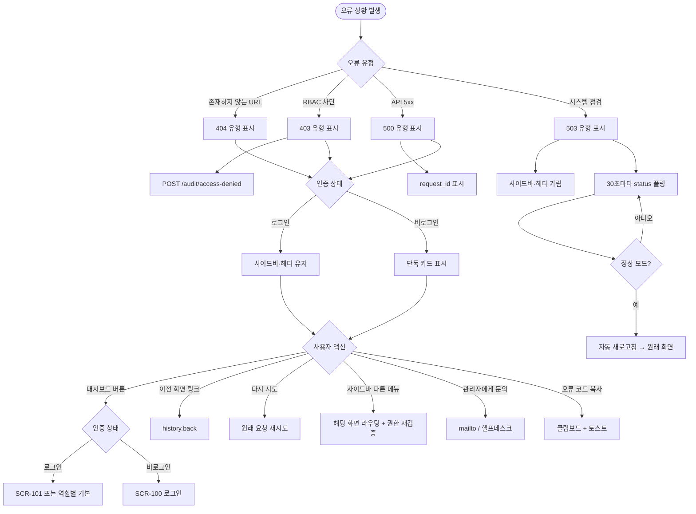
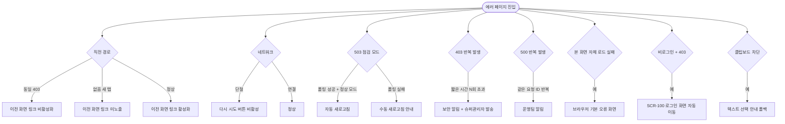

# SCR-108 에러 페이지

## 1. 화면 메타 정보

이 문서는 에러 페이지에 대한 자기완결형 요구사항 정의서입니다. 다른 문서를 함께 보지 않아도 이 문서 한 장만으로 에러 페이지에 들어가는 모든 오류 유형, 모든 안내 메시지, 모든 복구 액션, 모든 권한, 모든 예외 처리, 그리고 이 화면을 지탱하는 운영 정책까지 전부 이해하고 구현할 수 있도록 작성합니다.

| 항목 | 값 |
|---|---|
| 작성일 | 2026-05-22 |
| 버전 | v1.0 |
| 상태 | 최신 통합본 반영 (정합화 완료) |
| 도메인 | D01 공통 |
| 화면 ID | SCR-108 |
| 화면명 | 에러 페이지 |
| 화면 유형 | 폴백 / 안내 화면 (HTTP 오류·점검 모드 통합 표시) |
| 라우트 (URL) | `/error` (또는 매칭되지 않은 모든 경로) |
| 플랫폼 | 데스크톱(기본), 태블릿, 모바일(풀스크린) |
| 우선순위 | P0 (출시 필수) |
| 기능코드 | MFN-SCR-108 (에러 페이지) |
| 계약코드 | 본 화면 직접 계약코드 없음 |
| 계약 상태 | 비계약 본기능 |
| 부모 기능 prefix | MFN |
| Lv1 코드 | MFN-SCR-108 |
| Lv2 / Lv3 세분화 | MFN-SCR-108-01 ~ MFN-SCR-108-08 (404·403·500·503 유형별 표시, 대시보드로 이동, 이전 화면 이동, 오류 코드 자동 감지, 로그 기록) |
| 연계 화면 | SCR-100 로그인(비로그인 시 복귀 대상), SCR-101 대시보드 통합(로그인 시 복귀 대상), SCR-102 사이드바(권한 없는 메뉴 접근 차단) |
| 호출 다이얼로그 | 직접 호출 없음 |

## 2. 화면 개요와 목적

에러 페이지는 시스템이 정상 처리 흐름에서 벗어났을 때 사용자에게 어떤 상황인지 안내하고 정상 화면으로 돌아갈 수 있는 길을 제공하는 폴백 화면입니다. 존재하지 않는 페이지에 접근한 404, 권한이 없는 화면에 접근한 403, 서버에서 일시적 오류가 발생한 500, 서비스 점검 모드인 503의 네 가지 주요 HTTP 오류를 같은 시각적 패턴으로 통합 처리해, 사용자가 어떤 오류를 만나든 일관된 경험을 가질 수 있게 합니다. 본 화면은 운영자가 자주 보지 않는 화면이어야 하지만, 그럼에도 잘 만들어진 에러 페이지는 사용자가 막힌 상황에서 다음 단계를 명확히 알게 해주어 업무 중단을 최소화합니다.

이 화면이 다루는 운영 흐름은 매우 다양합니다. 운영자가 잘못된 URL을 입력해 404를 만나면 "주소를 다시 확인해주세요" 안내와 대시보드 복귀 버튼이 표시되고, 권한 없는 운영자가 직접 URL로 본사 관리 화면에 접근하려 하면 403이 발생해 "접근 권한이 없습니다. 관리자에게 문의하세요" 안내가 표시되어 차단됩니다. 서버가 일시적 5xx 오류를 반환하면 "일시적 오류가 발생했습니다" 안내와 재시도 버튼이 함께 표시되어 사용자가 같은 동작을 다시 시도할 수 있고, 본사가 점검 모드를 켜면 모든 사용자에게 "서비스 점검 중입니다" 안내가 점검 종료 예정 시각과 함께 표시됩니다.

이 화면은 단순한 에러 메시지가 아니라, RBAC 기반 접근 제어의 최종 방어선·서버 오류 감지·점검 모드 통합·로그 기록·역할별 복귀 라우팅까지 모두 반영된 운영 안전망으로 동작합니다. 사용자가 어떤 경로로 본 화면에 도달하든, 본 화면을 통해 항상 정상 화면으로 복귀할 수 있어야 합니다.

## 3. 진입 경로와 인접 화면

에러 페이지에 진입하는 경로는 다음 다섯 가지가 있고, 각 경로마다 표시되는 오류 유형이 달라집니다.

첫 번째 경로는 존재하지 않는 URL 접근(404)입니다. 사용자가 주소창에 잘못된 URL을 입력하거나, 외부 링크가 만료된 경로를 가리키거나, 라우터에서 매칭되지 않는 경로로 이동하면 본 화면이 404 유형으로 자동 표시됩니다. 잘못 입력된 URL이 그대로 보이거나, `/error`로 리다이렉트되거나, 화면만 본 화면으로 교체되는 방식 중 본사 정책에 따라 선택됩니다.

두 번째 경로는 권한 없는 URL 직접 접근(403)입니다. 사용자가 사이드바에는 보이지 않는 메뉴의 URL(예: FC 계정이 `/admin/policies`에 접근)을 직접 입력하면 인증 가드와 RBAC 가드가 작동해 본 화면이 403 유형으로 표시됩니다. 사이드바에서는 권한이 없는 메뉴가 아예 보이지 않으므로 일반적으로 이 경로는 URL 우회 시도에 해당하며, 모든 차단 이벤트는 감사 로그에 기록됩니다.

세 번째 경로는 서버 5xx 오류 발생(500)입니다. 사용자가 정상 화면에서 작업하다가 백엔드가 500·502·504 같은 5xx 응답을 반환하면 글로벌 에러 핸들러가 본 화면을 500 유형으로 표시합니다. 다만 일부 화면(예: 회원 목록의 위젯)은 자체적으로 부분 오류를 처리하므로 본 화면으로 라우팅되지 않고 위젯 내부 오류 메시지로 분기될 수 있습니다.

네 번째 경로는 서비스 점검 모드 진입(503)입니다. 본사 슈퍼관리자가 점검 모드를 켜면 모든 인증 화면에서 본 화면이 503 유형으로 강제 표시됩니다. 사용자는 점검 종료까지 어떤 화면에도 접근할 수 없으며, 점검 종료 시 자동으로 원래 화면 또는 대시보드로 복귀합니다.

다섯 번째 경로는 명시적 `/error` URL 접근입니다. 개발·테스트 목적으로 직접 본 화면을 호출할 수 있으며, 이 경우 기본은 일반 오류 안내(또는 쿼리 파라미터로 지정된 코드)로 표시됩니다.

이 화면에서 빠져나가는 인접 화면은 두 가지 표준 복귀 경로가 있습니다. 첫 번째는 "대시보드로 돌아가기" 버튼 클릭으로 SCR-101 대시보드 통합(로그인 상태) 또는 SCR-100 로그인(비로그인 상태)으로 이동하는 경로입니다. 두 번째는 "이전 화면으로 돌아가기" 링크 클릭으로 브라우저 history.back()을 호출해 직전 경로로 복귀하는 경로입니다. 점검 모드(503)에서는 복귀 경로가 제공되지 않거나 "점검 종료 후 자동 복귀" 안내만 표시될 수 있습니다.

## 4. 레이아웃과 UI 구성

에러 페이지는 사이드바와 헤더가 운영 정책에 따라 표시될 수도 있고 가려질 수도 있는 유연한 레이아웃입니다. 일반적으로 로그인 상태의 404·403·500은 사이드바를 유지해 사용자가 다른 메뉴로 빠르게 이탈할 수 있게 하고, 503 점검 모드는 사이드바를 가린 전체 화면 안내로 처리합니다. 비로그인 상태에서는 사이드바가 없으므로 단순 안내 카드만 화면 중앙에 떠 있습니다. 본 화면은 위에서부터 다음 영역들이 순서대로 배치됩니다.

가장 위에는 페이지 헤더가 있습니다. 사이드바가 유지되는 경우에는 상단 헤더(글로벌 검색·알림·프로필)도 그대로 유지되어 사용자가 다른 화면으로 이동할 수 있습니다. 사이드바가 가려지는 경우(503 점검 모드, 비로그인 상태)에는 헤더도 함께 가려지고 화면 중앙에 단독 안내 카드만 표시됩니다.

본문 중앙에는 오류 안내 카드가 배치됩니다. 카드는 단순하고 명확한 구조로, 위에서부터 다음 요소들이 세로로 정렬됩니다. 가장 위에는 오류 유형 아이콘이 큰 사이즈로 표시되어 사용자가 한눈에 오류의 성격을 파악할 수 있게 합니다. 404는 돋보기 또는 물음표 아이콘, 403은 자물쇠 아이콘, 500은 경고 삼각형 아이콘, 503은 도구 또는 공사 아이콘으로 구분됩니다.

아이콘 아래에는 오류 제목이 큰 글자로 표시됩니다. 404는 "페이지를 찾을 수 없습니다", 403은 "접근 권한이 없습니다", 500은 "일시적인 오류가 발생했습니다", 503은 "서비스 점검 중입니다" 같이 사용자가 즉시 이해할 수 있는 자연어로 작성됩니다.

제목 아래에는 오류 설명 메시지가 본문 텍스트로 따라옵니다. 404는 "주소를 다시 확인해주세요", 403은 "관리자에게 문의하세요", 500은 "잠시 후 다시 시도해주세요", 503은 "점검 완료 후 이용 가능합니다" 같은 구체적 안내가 표시됩니다. 503의 경우 점검 종료 예정 시각이 설정되어 있으면 그 시각이 함께 노출됩니다(예: "점검 종료 예정: 오늘 23:00").

설명 메시지 아래에는 복구 액션 버튼이 배치됩니다. 첫 번째 버튼은 "대시보드로 돌아가기"로 강조색의 주요 액션 버튼이며, 클릭 시 사용자의 인증 상태에 따라 SCR-101 대시보드 통합 또는 SCR-100 로그인 화면으로 이동합니다. 500 오류에는 "다시 시도" 보조 버튼이 추가로 표시되어 클릭 시 원래 요청을 재시도하거나 페이지를 새로고침합니다. 503 점검 모드에는 복구 버튼이 표시되지 않고 점검 안내만 노출됩니다.

복구 액션 버튼 아래에는 "이전 화면으로 돌아가기" 텍스트 링크가 작게 표시됩니다. 클릭 시 브라우저 history.back()이 호출되어 직전 경로로 복귀합니다. 직전 경로가 없는 경우(새 탭으로 직접 진입 등)에는 링크가 표시되지 않거나 비활성 상태로 노출됩니다.

본문 카드 가장 아래에는 본사 정책에 따라 고객센터 연락처, 본사 운영 안내, 관리자 문의 같은 보조 안내 링크가 작게 배치될 수 있습니다. 403 오류에는 "관리자에게 문의" 링크가 강조되어 표시되어 사용자가 권한 부여 요청을 어디로 보낼지 알 수 있게 합니다.

오류 코드는 카드 하단에 작은 글씨로 표시됩니다. 예를 들어 "오류 코드: 404", "오류 코드: 500 (요청 ID: abc-123)" 같이 표시되어 운영자가 슈퍼관리자에게 문의할 때 추적 키로 사용할 수 있게 합니다. 500 오류에는 요청 ID가 함께 표시되어 백엔드 로그 추적에 활용됩니다.

503 점검 모드는 본 화면을 가장 단순한 형태로 표시합니다. 사이드바·헤더·복구 버튼 모두 가려지고 점검 안내 카드만 화면 전체에 떠 있어, 사용자가 점검 종료까지 다른 시도를 하지 못하게 합니다. 점검 종료 시점에는 자동으로 화면이 새로고침되어 정상 화면으로 복귀합니다.

## 5. 오류 유형별 동작 정의

본 화면은 네 가지 주요 HTTP 오류 유형을 통합 처리하며, 각 유형마다 다른 안내 메시지·아이콘·복구 동작을 가집니다. 유형별로 풀어 적습니다.

### 5-1. 404 — 페이지를 찾을 수 없습니다

404 오류는 사용자가 존재하지 않는 URL에 접근했을 때 발생합니다. 라우터에서 매칭되지 않는 모든 경로가 본 화면의 404 유형으로 폴백되며, 외부 링크 만료·잘못된 북마크·오타 입력 등이 주요 원인입니다.

표시 내용은 다음과 같습니다. 아이콘은 돋보기 또는 물음표 형태로 표시되고, 제목은 "페이지를 찾을 수 없습니다"입니다. 설명 메시지는 "주소를 다시 확인해주세요"이며, 복구 액션 버튼으로 "대시보드로 돌아가기"가 강조 색상으로 노출되고 그 아래에 "이전 화면으로 돌아가기" 링크가 표시됩니다. 본사 정책에 따라 사용자가 입력한 잘못된 경로가 카드 안에 표시될 수도 있습니다.

복구 동작은 "대시보드로 돌아가기" 클릭 시 사용자의 인증 상태에 따라 SCR-101 또는 SCR-100으로 이동하고, "이전 화면으로 돌아가기" 클릭 시 브라우저 history.back()이 호출됩니다.

### 5-2. 403 — 접근 권한이 없습니다

403 오류는 사용자가 권한이 없는 URL에 직접 접근했을 때 발생합니다. 사이드바에서는 권한 없는 메뉴가 아예 보이지 않으므로 본 오류는 URL 우회 시도(또는 권한이 다른 사용자가 공유한 링크를 통한 접근)에 해당합니다.

표시 내용은 다음과 같습니다. 아이콘은 자물쇠 형태로 표시되고, 제목은 "접근 권한이 없습니다"입니다. 설명 메시지는 "관리자에게 문의하세요"이며, "관리자에게 문의" 텍스트 링크가 카드 하단에 추가로 노출되어 본사 정책에 따라 mailto 링크나 헬프데스크 채널로 연결됩니다.

복구 동작은 "대시보드로 돌아가기"가 기본 액션이며, "이전 화면으로 돌아가기"는 직전 경로가 권한이 있는 경로였을 때만 활성화됩니다(직전이 같은 403 오류라면 무한 루프를 막기 위해 비활성화).

403 오류는 모든 차단 이벤트가 감사 로그에 기록됩니다. 기록 필드는 actor(사용자 ID), attempted_url(시도된 경로), reason(권한 부족 사유), ip, device, timestamp이며, 운영팀이 사후에 권한 우회 시도를 추적할 수 있게 합니다. 일부 본사 정책 환경에서는 짧은 시간에 같은 사용자가 여러 번 403을 트리거하면 보안 알림이 슈퍼관리자에게 자동 발송됩니다.

### 5-3. 500 — 일시적인 오류가 발생했습니다

500 오류는 백엔드가 5xx(500·502·503·504) 응답을 반환할 때 발생합니다. 화면이 정상 화면에서 작업 중이던 사용자가 서버 오류를 만난 상황으로, 일시적 장애·DB 연결 실패·외부 서비스 장애 등 다양한 원인이 있습니다.

표시 내용은 다음과 같습니다. 아이콘은 경고 삼각형 형태로 표시되고, 제목은 "일시적인 오류가 발생했습니다"입니다. 설명 메시지는 "잠시 후 다시 시도해주세요"이며, 복구 액션 버튼으로 "대시보드로 돌아가기"와 함께 "다시 시도" 보조 버튼이 노출됩니다. 오류 코드와 요청 ID가 카드 하단에 작은 글씨로 표시되어 사용자가 슈퍼관리자에게 문의할 때 추적 키로 사용할 수 있게 합니다.

복구 동작은 "대시보드로 돌아가기"가 기본 액션이고, "다시 시도"는 원래 요청을 재시도하거나 페이지를 새로고침합니다. 직전 경로가 안전하게 재시도 가능한 경로이면 history.back()으로 직전으로 복귀해 자동 재시도하는 흐름이 가능합니다.

500 오류는 자동으로 감사 로그 또는 오류 로그에 기록됩니다. 기록 필드는 user, requested_url, request_id, error_message(클라이언트에 노출되지 않는 상세), timestamp이며, 운영팀이 사후 추적·복구할 수 있게 합니다.

### 5-4. 503 — 서비스 점검 중입니다

503 오류는 본사 슈퍼관리자가 점검 모드를 켰을 때 발생합니다. 점검 모드에서는 모든 사용자가 어떤 화면에도 접근할 수 없으며, 본 화면이 503 유형으로 전체 화면 안내를 표시합니다.

표시 내용은 다음과 같습니다. 사이드바·헤더가 모두 가려진 단독 안내 카드 형태로 표시되며, 아이콘은 도구 또는 공사 형태입니다. 제목은 "서비스 점검 중입니다"이고, 설명 메시지는 "점검 완료 후 이용 가능합니다"입니다. 점검 종료 예정 시각이 설정되어 있으면 "점검 종료 예정: 오늘 23:00" 같이 함께 표시되고, 미정인 경우에는 시각 표시가 생략됩니다.

복구 동작은 기본적으로 제공되지 않습니다. 복구 버튼 자체가 노출되지 않으며, 사용자는 점검 종료까지 대기해야 합니다. 다만 본사 정책에 따라 슈퍼관리자에게는 별도의 우회 경로가 제공될 수 있습니다.

점검 종료 시점에는 클라이언트가 주기적으로(예: 30초마다) `GET /api/system/status`로 점검 상태를 폴링하다가 정상 모드로 전환되면 자동으로 화면이 새로고침되어 원래 화면 또는 대시보드로 복귀합니다.

## 6. 버튼·아이콘·링크 액션 전체 정의

이 화면에 등장하는 모든 클릭 가능한 요소를 빠짐없이 정의합니다.

대시보드로 돌아가기 버튼은 모든 오류 유형(503 제외)에서 표시되는 주요 복구 액션입니다. 클릭 시 사용자의 인증 상태에 따라 다르게 동작합니다. 로그인 상태이면 SCR-101 대시보드 통합으로 이동하며, 트레이너·스태프·프런트 같은 역할은 본인 역할의 기본 작업공간(수업 캘린더·출석 관리)으로 이동합니다. 비로그인 상태이면 SCR-100 로그인 화면으로 이동합니다.

이전 화면으로 돌아가기 링크는 브라우저 history.back()을 호출해 직전 경로로 복귀시킵니다. 직전 경로가 없거나(새 탭 직접 진입) 직전 경로가 같은 403 오류였다면 무한 루프를 막기 위해 링크가 비활성화 또는 미노출됩니다.

다시 시도 버튼(500 오류 전용)은 클릭 시 원래 요청을 재시도하거나 페이지를 새로고침합니다. 본사 정책에 따라 다음 두 가지 방식 중 하나로 동작합니다. 첫 번째는 직전 경로로 자동 복귀해 그 화면이 자체 재시도 로직을 작동시키는 방식, 두 번째는 단순 페이지 새로고침으로 같은 오류를 재현하지 않는지 확인하는 방식입니다. 본 문서는 직전 경로 복귀 방식을 표준으로 정의합니다.

관리자에게 문의 링크(403 오류 전용)는 본사 정책에 따라 mailto 링크 또는 외부 헬프데스크 채널 URL로 연결됩니다. 본사 정책이 없으면 단순 안내 텍스트로 표시됩니다.

고객센터·약관·본사 운영 안내 같은 정적 링크는 본사 정책에 따라 카드 하단에 작게 배치될 수 있으며, 외부 URL로 연결됩니다.

오류 코드와 요청 ID 표시는 정적 텍스트이며 클릭 액션이 없습니다. 다만 본사 정책에 따라 "이 코드 복사" 버튼이 함께 표시되어 사용자가 슈퍼관리자에게 문의할 때 식별자를 쉽게 전달할 수 있게 할 수 있습니다.

503 점검 모드에서는 복구 버튼이 표시되지 않으므로 클릭 가능한 요소가 거의 없습니다. 다만 본사 정책에 따라 "수동 새로고침" 또는 "공지 확인" 링크가 추가로 표시될 수 있습니다.

사이드바가 유지되는 오류 유형(404·403·500의 로그인 상태)에서는 사이드바의 모든 메뉴와 헤더의 글로벌 검색·알림 센터·프로필 메뉴가 그대로 동작합니다. 사용자가 본 화면에서 사이드바의 다른 메뉴를 클릭하면 그 메뉴로 정상 라우팅되며, 인증 가드가 다시 한 번 권한을 검증합니다.

모든 버튼은 응답이 돌아오는 동안 자동으로 비활성화되어 더블클릭으로 인한 중복 라우팅이 차단됩니다.

## 7. 호출되는 다이얼로그 동작

에러 페이지는 자체적으로 다이얼로그를 호출하지 않습니다. 본 화면은 정상 흐름에서 벗어난 상태를 안내하는 폴백 화면이므로, 추가적인 확인 흐름이나 위험 액션이 발생하지 않습니다.

다음과 같은 다이얼로그와의 관계가 있습니다.

### 7-1. DLG-000 세션 만료 다이얼로그 (해당 없음)

본 화면은 인증된 사용자에게도 비로그인 사용자에게도 표시될 수 있으므로, 본 화면 자체에는 세션 만료 가드가 적용되지 않습니다. 사용자가 본 화면에 있는 동안 세션이 만료되어도 본 화면은 그대로 보이며, 사용자가 "대시보드로 돌아가기" 버튼을 누르는 시점에 인증 가드가 작동해 SCR-100 로그인 화면으로 라우팅됩니다.

### 7-2. DLG-002 이탈 경고 다이얼로그 (해당 없음)

본 화면에는 사용자가 입력하는 폼이 없으므로 이탈 경고가 트리거되지 않습니다.

## 8. 토스트와 안내 메시지

에러 페이지에서 발생하는 모든 알림성 UI는 다음과 같은 패턴으로 동작합니다.

성공 토스트는 본 화면에서 사용되지 않습니다. 본 화면 자체가 오류 상태의 안내이므로 성공 결과가 발생할 일이 없습니다.

실패 토스트도 본 화면에서 추가로 발생하지 않습니다. 모든 오류 안내는 화면 본문의 카드에서 풀어 표시되며, 별도 토스트를 추가하지 않아 사용자에게 혼란을 주지 않습니다.

서비스 점검 안내 배너는 503 모드에서 본 화면이 통째로 안내 카드 역할을 하므로 별도 배너가 필요하지 않습니다. 다만 503 모드가 일시적으로 일부 화면에서만 발생한 경우(예: 특정 도메인의 API만 503)에는 부모 화면 상단에 작은 배너로 "일부 기능이 점검 중입니다" 안내가 표시될 수 있습니다.

확인 팝업과 알럿은 본 화면에서 사용되지 않습니다.

오류 코드 복사 안내는 사용자가 "이 코드 복사" 버튼을 누른 직후 짧게 "오류 코드가 복사되었습니다" 토스트가 표시될 수 있습니다.

503 점검 모드에서 점검 종료 시점이 가까워지면 카드 안에 카운트다운("점검 종료까지 약 30초")이 표시될 수 있으며, 점검 종료가 감지되면 "정상 모드로 전환되었습니다. 잠시 후 자동 이동합니다" 안내가 짧게 표시된 뒤 자동 새로고침됩니다.

## 9. 데이터 흐름과 외부 연동

이 화면은 오류 상태를 표시하는 폴백 화면이지만, 오류 유형 감지·로그 기록·점검 모드 폴링에 일부 데이터 처리가 필요합니다. 화면 단위로 어떤 데이터가 어디서 오고 어디로 가는지를 모두 풀어 씁니다.

오류 유형 감지는 클라이언트 측의 글로벌 에러 핸들러와 라우터 가드가 담당합니다. 라우터에서 매칭되지 않는 경로는 404 유형으로 폴백되고, RBAC 가드가 권한 차단한 경로는 403 유형으로 폴백되며, API 응답이 5xx인 경우 글로벌 에러 핸들러가 500 유형으로 본 화면을 띄웁니다. 503 모드는 시스템 상태 API(`GET /api/system/status`)가 503을 반환할 때 진입됩니다.

403 오류 발생 시 클라이언트가 백엔드에 차단 이벤트 기록을 요청(`POST /api/audit/access-denied`)할 수 있습니다. 요청 본문에는 attempted_url, reason, user_id, timestamp가 포함되며, 백엔드는 이를 감사 로그(SCR-097)에 저장합니다. 일부 본사 정책 환경에서는 짧은 시간에 같은 사용자가 여러 번 403을 트리거하면 보안 알림이 슈퍼관리자에게 자동 발송됩니다.

500 오류 발생 시 클라이언트는 백엔드의 오류 응답에서 request_id를 추출해 본 화면에 표시합니다. 요청 ID는 백엔드의 분산 추적 시스템(예: trace_id, span_id)에서 발급된 식별자로, 운영팀이 사후에 그 요청의 전체 흐름을 추적할 수 있게 합니다. 클라이언트 측에서도 오류 발생을 분석 도구(예: Sentry, Datadog)로 전송해 운영팀이 즉시 인지하도록 할 수 있습니다.

503 점검 모드에서는 클라이언트가 주기적으로(예: 30초마다) `GET /api/system/status`를 폴링해 점검 상태를 확인합니다. 응답이 200으로 돌아오면 정상 모드로 전환된 것으로 판단하고 자동으로 화면을 새로고침해 원래 화면 또는 대시보드로 복귀시킵니다. 폴링 주기는 본사 정책에 따라 조정 가능합니다.

오류 코드 복사 액션은 클라이언트 측에서 navigator.clipboard API를 사용해 클립보드에 복사합니다. 별도 API 호출이 없으며, 클립보드 접근이 차단된 환경에서는 폴백으로 텍스트 선택 안내가 표시됩니다.

다국어 정책에 따라 오류 메시지는 i18n 키로 관리됩니다. 한국어 기본이며 본사 정책에 따라 영어 등 다른 언어가 추가됩니다.

화면에서 호출하는 주요 API 엔드포인트는 다음과 같습니다. 시스템 상태 조회 `GET /api/system/status`(503 모드 폴링), 차단 이벤트 기록 `POST /api/audit/access-denied`(403 발생 시), 오류 분석 전송(외부 분석 도구, 클라이언트 측에서 처리).

## 10. 화면 상태와 예외 처리

에러 페이지는 다음 상태들을 가질 수 있고, 각 상태마다 사용자에게 보이는 모습이 달라집니다.

404 상태는 존재하지 않는 URL 접근으로 인한 표시이며, 사이드바·헤더가 유지된 채(로그인 상태) 또는 단독 카드 형태(비로그인 상태)로 표시됩니다.

403 상태는 권한 없는 접근으로 인한 표시이며, 사이드바·헤더가 유지되어 사용자가 다른 메뉴로 이탈할 수 있습니다. 카드 본문에 자물쇠 아이콘과 관리자 문의 안내가 강조됩니다.

500 상태는 서버 오류로 인한 표시이며, 사이드바·헤더가 유지된 채 다시 시도 버튼이 추가로 노출됩니다.

503 상태는 점검 모드로 인한 표시이며, 사이드바·헤더가 모두 가려진 전체 화면 안내 카드만 표시됩니다.

비로그인 상태는 본 화면에서도 인증되지 않은 사용자에게 표시되는 폴백 모드입니다. 사이드바·헤더가 가려진 채 단독 카드만 표시되며, "대시보드로 돌아가기" 버튼은 SCR-100 로그인 화면으로 라우팅됩니다.

503 점검 종료 감지 상태는 클라이언트의 폴링이 정상 모드 응답을 받은 직후로, 카드 안에 "정상 모드로 전환되었습니다. 잠시 후 자동 이동합니다" 짧은 안내가 표시되고 자동 새로고침됩니다.

오류 코드 복사 완료 상태는 사용자가 복사 버튼을 누른 직후로, 짧은 토스트가 표시됩니다.

예외 케이스별 처리는 다음과 같이 정의됩니다.

로그인 세션이 없는 상태의 403은 일반 403 안내보다는 로그인 화면으로 이동을 우선 유도합니다. "로그인이 필요합니다. 로그인 화면으로 이동합니다" 안내와 함께 자동 카운트다운 후 SCR-100으로 이동하거나, 즉시 SCR-100으로 라우팅됩니다.

503 점검 종료 시각이 미정이면 "점검 완료 후 이용 가능합니다" 메시지만 표시되고 시각 표시는 생략됩니다.

본 화면 자체가 로드되지 못하는 경우(예: 라우터 매칭조차 실패)에는 브라우저 기본 오류 화면으로 fallback 됩니다. 이는 본 시스템의 운영 정책으로 통제 불가능한 영역입니다.

직전 경로가 같은 403 오류였던 경우(권한 없는 화면을 여러 번 클릭) "이전 화면으로 돌아가기" 링크가 비활성화되어 무한 루프를 막습니다.

500 오류가 같은 사용자에게 짧은 시간에 여러 번 발생하면 본사 정책에 따라 보안 알림이 슈퍼관리자에게 발송됩니다.

오프라인 상태에서 본 화면에 접근하면 본 화면 자체는 로드되지만 "다시 시도" 버튼이 비활성화되거나 500 오류로 분기되어 표시됩니다.

브라우저 history.back()을 호출했는데 직전 경로가 없으면(새 탭 직접 진입) "이전 화면으로 돌아가기" 링크가 자동으로 미노출됩니다.

오류 코드 복사가 차단된 환경(시크릿 모드, 권한 거부)에서는 폴백으로 텍스트 선택 안내가 표시됩니다.

503 점검 모드에서 폴링이 실패하면(예: 네트워크 단절) 자동 새로고침이 일어나지 않고 사용자가 수동으로 새로고침해야 합니다.

## 11. 권한별 처리

이 화면은 모든 역할이 만날 수 있는 폴백 화면이지만, 표시되는 오류 유형과 복구 경로가 권한에 따라 미세하게 달라집니다. 각 권한별로 어떻게 동작해야 하는지를 빠짐없이 정의합니다.

비로그인 사용자는 404·500·503에서 본 화면을 만날 수 있습니다. 403은 거의 발생하지 않으며(인증 가드가 우선 SCR-100으로 라우팅), 모든 복구 버튼은 SCR-100 로그인 화면으로 이동합니다. 사이드바·헤더가 없는 단독 카드 형태로 표시됩니다.

슈퍼관리자(superAdmin)는 본 화면에서 사이드바·헤더가 유지된 채 일반 안내 카드를 봅니다. "대시보드로 돌아가기"는 SCR-101 또는 본사 정책에 따라 슈퍼 대시보드로 이동합니다. 503 점검 모드는 본사 정책에 따라 슈퍼관리자에게는 우회 경로가 제공되어 다른 화면에 접근할 수 있습니다.

본사 최고관리자(primary)는 본 화면에서 사이드바·헤더가 유지된 채 일반 안내를 봅니다. 503 점검 모드에서는 다른 역할과 동일하게 대기해야 합니다.

센터장(owner)·매니저(manager)는 본 화면에서 사이드바·헤더가 유지된 채 일반 안내를 봅니다. "대시보드로 돌아가기"는 SCR-101 또는 SCR-090 지점 대시보드로 이동합니다.

FC(fc)는 본 화면에서 사이드바·헤더가 유지된 채 일반 안내를 봅니다. "대시보드로 돌아가기"는 SCR-101 또는 본사 정책에 따라 수업 캘린더로 이동합니다.

스태프(staff)·프런트(front)는 본 화면에서 사이드바·헤더가 유지된 채 일반 안내를 봅니다. "대시보드로 돌아가기"는 출석 관리 화면으로 이동합니다.

트레이너(trainer)는 본 화면에서 사이드바·헤더가 유지된 채 일반 안내를 봅니다. "대시보드로 돌아가기"는 수업 캘린더로 이동합니다.

읽기 전용(readonly)은 본 화면에서 사이드바·헤더가 유지된 채 일반 안내를 봅니다. "대시보드로 돌아가기"는 본사 정책에 따라 급여 명세서 또는 운영 정책으로 지정된 읽기 전용 기본 화면으로 이동합니다.

403 오류는 역할에 따라 다른 안내가 추가될 수 있습니다. 슈퍼관리자에게는 거의 발생하지 않지만 만일 발생한다면(본사 정책 화면 중 슈퍼관리자도 막힌 영역) "이 화면은 본사 정책 보호 영역입니다" 같은 구체적 안내가 추가됩니다. 일반 운영자에게는 "관리자에게 문의하세요" 안내가 강조됩니다.

503 점검 모드는 모든 역할에게 동일하게 적용되며, 본사 정책에 따라 슈퍼관리자에게만 우회 경로가 제공됩니다.

권한이 부족해서 액션이 차단된 경우의 사용자 경험은 단계별로 일관됩니다. 첫째, 사용자가 본 화면에 도달하는 시점에 이미 권한 차단이 일어난 상태이므로, 본 화면 안에서 추가 차단은 발생하지 않습니다. 둘째, 사이드바의 다른 메뉴를 클릭하면 인증 가드가 다시 권한을 검증하므로 권한 없는 메뉴로의 진입은 다시 본 화면(403)으로 라우팅됩니다. 셋째, 모든 차단 이벤트는 감사 로그에 기록되어 사후 추적이 가능합니다.

## 12. 메인 흐름

에러 페이지의 핵심 동작 흐름을 다이어그램으로 표현합니다. 사용자가 오류 상황에 부딪힌 시점부터 정상 화면으로 복귀하기까지의 가장 일반적인 흐름입니다.

## 13. 에러 흐름

에러 페이지에서 발생할 수 있는 추가 예외와 그 처리 흐름을 다이어그램으로 표현합니다. 본 화면 자체에서 발생하는 무한 루프·오프라인·폴링 실패·세션 만료가 어떻게 분기되는지를 정의합니다.

## 14. 운영 정책 — 오류 처리 / 점검 / 로그 자기완결 정리

이 절은 본 화면이 의존하는 오류 처리·점검·로그 운영 정책을 외부 문서 참조 없이 풀어 적습니다.

오류 유형 통합 표시 정책은 네 가지 주요 HTTP 오류(404·403·500·503)를 본 화면 하나로 통합 처리합니다. 같은 시각적 패턴(아이콘·제목·설명·복구 버튼)을 유지해 사용자가 어떤 오류를 만나든 일관된 경험을 가질 수 있게 합니다.

RBAC 403 정책은 권한 없는 URL 직접 접근을 본 화면의 403 유형으로 라우팅합니다. 사이드바에서는 권한 없는 메뉴가 아예 보이지 않으므로 일반적으로 본 오류는 URL 우회 시도에 해당하며, 모든 차단 이벤트가 감사 로그에 기록됩니다. 짧은 시간에 같은 사용자가 여러 번 403을 트리거하면 보안 알림이 슈퍼관리자에게 자동 발송됩니다.

서비스 점검 모드 정책은 본사 슈퍼관리자가 점검 모드를 켤 때 모든 인증 화면에서 본 화면이 503 유형으로 강제 표시되도록 합니다. 사이드바·헤더가 모두 가려진 전체 화면 안내로 처리되며, 점검 종료 시 자동으로 정상 모드로 복귀합니다. 본사 정책에 따라 슈퍼관리자에게는 우회 경로가 제공될 수 있습니다.

오류 로그 자동 기록 정책은 403·500 오류 발생 시 그 내용을 감사 로그(SCR-097) 또는 오류 로그에 자동 기록합니다. 기록 필드는 user, requested_url, error_code, request_id, reason, ip, device, timestamp이며, 운영팀이 사후에 추적·복구할 수 있게 합니다.

요청 ID 표시 정책은 500 오류에서 백엔드 분산 추적 시스템(trace_id, span_id)의 식별자를 사용자에게 노출합니다. 사용자가 슈퍼관리자에게 문의할 때 이 ID를 전달하면 운영팀이 해당 요청의 전체 흐름을 빠르게 추적할 수 있습니다.

복구 경로 정책은 사용자가 본 화면에서 항상 정상 화면으로 복귀할 수 있는 최소 1개의 명확한 경로를 제공합니다. "대시보드로 돌아가기"가 표준 경로이며, "이전 화면으로 돌아가기"는 보조 경로입니다. 503에서는 복구 경로가 제공되지 않고 점검 종료 자동 새로고침으로 대체됩니다.

자동 새로고침 정책은 503 점검 모드에서 클라이언트가 주기적으로 시스템 상태를 폴링해 정상 모드로 전환된 시점에 자동으로 화면을 새로고침합니다. 폴링 주기는 30초가 기본이며 본사 정책에 따라 조정 가능합니다.

다국어 정책은 본 화면의 모든 안내 메시지를 i18n 키로 관리해 한국어 기본과 본사 정책에 따른 영어 등 다른 언어를 지원합니다.

오류 분석 전송 정책은 클라이언트 측에서 오류 발생을 외부 분석 도구(예: Sentry, Datadog)로 전송해 운영팀이 즉시 인지할 수 있게 합니다. 전송되는 정보는 user_id, request_id, error_code, stack_trace 같이 사후 추적에 필요한 최소 정보로 한정하며, 민감 정보(비밀번호·세션 토큰)는 자동으로 마스킹됩니다.

권한 없는 메뉴 사전 차단 정책은 사이드바에서 권한 없는 메뉴 자체를 노출하지 않아 사용자가 본 화면에 도달하기 전에 차단이 일어나도록 합니다. 본 화면의 403은 사실상 URL 우회 시도에 해당하며, 모든 시도는 감사 로그에 기록됩니다.

비로그인 403 폴백 정책은 비로그인 사용자가 권한 보호 화면에 접근하면 본 화면의 403 대신 SCR-100 로그인 화면으로 우선 라우팅합니다. "로그인이 필요합니다" 안내와 함께 자동 이동되며, 로그인 후에는 원래 의도했던 화면으로 복귀합니다.

무한 루프 방지 정책은 직전 경로가 같은 403 오류였던 경우 "이전 화면으로 돌아가기" 링크를 비활성화해 사용자가 같은 오류에 갇히지 않도록 합니다.

본 화면 자체 로드 실패 폴백 정책은 본 화면조차 로드되지 않는 극단적인 경우 브라우저 기본 오류 화면으로 fallback 되도록 합니다. 이는 시스템 운영 정책으로 통제 불가능한 영역이며 라우터 매칭과 빌드 단계에서 충분히 보호됩니다.

세션·자동 로그아웃 정책은 본 화면 자체에는 적용되지 않습니다. 본 화면이 비로그인 상태에서도 표시될 수 있으므로 세션 만료 가드가 본 화면을 우회하며, 사용자가 "대시보드로 돌아가기" 버튼을 누르는 시점에 인증 가드가 작동합니다.

## 15. 변경 이력

| 일자 | 변경 |
|---|---|
| 2026-05-22 | v1.0 자기완결형 요구사항 정의서로 통합본 작성 (기능명세서 MFN-SCR-108, 화면설계서 SCR-108, 오류·점검·로그 운영 정책 통합) |
