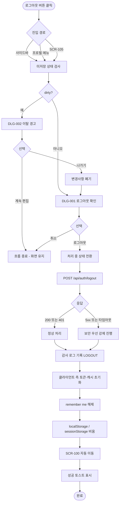
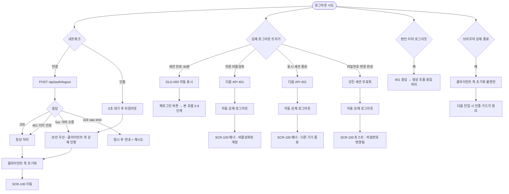

# SCR-109 로그아웃

## 1. 화면 메타 정보

이 문서는 로그아웃 흐름에 대한 자기완결형 요구사항 정의서입니다. 다른 문서를 함께 보지 않아도 이 문서 한 장만으로 로그아웃 처리에 들어가는 모든 진입점, 모든 다이얼로그, 모든 권한, 모든 예외 처리, 그리고 이 흐름을 지탱하는 운영 정책까지 전부 이해하고 구현할 수 있도록 작성합니다.

| 항목 | 값 |
|---|---|
| 작성일 | 2026-05-22 |
| 버전 | v1.0 |
| 상태 | 최신 통합본 반영 (정합화 완료) |
| 도메인 | D01 공통 |
| 화면 ID | SCR-109 |
| 화면명 | 로그아웃 |
| 화면 유형 | 처리 흐름 (단독 화면이 아닌 다이얼로그 + API 처리 + 자동 라우팅 결합) |
| 라우트 (URL) | 로그아웃 처리 후 `/login` 이동 (단독 URL 없음) |
| 플랫폼 | 데스크톱(기본), 태블릿, 모바일 |
| 우선순위 | P0 (출시 필수) |
| 기능코드 | MFN-SCR-109 (로그아웃) |
| 계약코드 | 본 화면 직접 계약코드 없음, AUTH-01 보안 정책 연계 |
| 계약 상태 | 비계약 본기능 |
| 부모 기능 prefix | MFN |
| Lv1 코드 | MFN-SCR-109 |
| Lv2 / Lv3 세분화 | MFN-SCR-109-01 ~ MFN-SCR-109-06 (사이드바·프로필 메뉴·SCR-105에서의 진입, DLG-001 확인, 서버 측 세션 무효화, 클라이언트 측 데이터 초기화, 로그인 화면 이동, remember me 해제) |
| 연계 화면 | SCR-100 로그인(이동 대상), SCR-105 프로필 계정(진입 경로 중 하나), SCR-102 사이드바(진입 경로 중 하나) |
| 호출 다이얼로그 | DLG-001 로그아웃 확인(필수), DLG-002 이탈 경고(미저장 상태에서 로그아웃 시) |

## 2. 화면 개요와 목적

로그아웃 흐름은 운영자가 현재 세션을 안전하게 종료하고 로그인 화면으로 돌아가는 핵심 보안 처리입니다. 본 시스템은 `직원 1명 = 로그인 계정 1개` 원칙을 따르므로, 한 직원이 같은 단말에서 다른 직원으로 전환하거나, 외부에 잠시 단말을 두고 자리를 비울 때 또는 업무를 마치고 퇴근할 때 반드시 명시적 로그아웃을 거쳐야 다른 사람이 본인 권한으로 접근하지 못합니다. 본 흐름은 단순히 토큰을 지우는 것이 아니라, 서버 측 refresh token 폐기·클라이언트 측 토큰·캐시·임시저장 데이터 초기화·세션 추적용 감사 로그 기록까지 모두 포함된 보안 처리입니다.

이 흐름이 다루는 운영 흐름은 매우 다양합니다. 매일 퇴근 시간 매니저가 사이드바 하단의 로그아웃 버튼을 누르고 DLG-001 확인 후 안전하게 로그인 화면으로 복귀합니다. 본사 슈퍼관리자가 회의를 마치고 자리로 돌아오면서 다른 사람이 사용했을 단말을 안전하게 초기화하기 위해 명시적 로그아웃을 실행합니다. FC가 다른 단말에서 본인 계정이 의심스럽게 로그인된 사실을 발견하고 본 단말에서 명시적 로그아웃을 한 뒤 비밀번호를 변경합니다. 본인이 의도하지 않은 강제 로그아웃(직원 비활성화, 동시 세션 정책 위반, 다른 기기에서의 강제 종료, 세션 만료)도 본 흐름과 유사한 처리로 진행됩니다.

이 흐름은 단순한 토큰 삭제가 아니라, 사용자 명시적 확인(DLG-001) + 미저장 상태 보호(DLG-002) + 서버 측 토큰 폐기 + 클라이언트 측 데이터 초기화 + 자동 라우팅 + remember me 해제 + 감사 로그 기록까지 모두 반영된 보안 종결 처리로 동작합니다. 본 흐름은 단독 화면을 갖지 않고 부모 화면 위에 DLG-001 다이얼로그가 떠 처리 중 안내와 함께 진행되며, 완료 시 SCR-100으로 자동 이동합니다.

## 3. 진입 경로와 인접 화면

로그아웃 흐름에 진입하는 경로는 다음 세 가지가 있고, 어느 경로로 시작하든 동일한 처리 흐름을 따릅니다.

첫 번째 경로는 사이드바 하단의 로그아웃 버튼 클릭입니다. SCR-102 사이드바의 가장 아래에 모든 역할에게 로그아웃 버튼이 표시되며, 클릭 시 DLG-001 로그아웃 확인 다이얼로그가 부모 화면 위에 떠 처리가 시작됩니다. 운영자가 가장 자주 사용하는 진입 경로입니다.

두 번째 경로는 상단 헤더의 프로필 메뉴 드롭다운입니다. 모든 화면 우측 상단의 프로필 아이콘을 클릭하면 드롭다운이 펼쳐지고, 그 안의 "로그아웃" 항목을 누르면 DLG-001이 호출됩니다. 사이드바가 접혀 있거나 모바일에서 사이드바가 보이지 않는 상황에서 자주 사용되는 경로입니다.

세 번째 경로는 SCR-105 프로필 계정 페이지의 로그아웃 버튼 클릭입니다. 본인 프로필을 보던 사용자가 그 자리에서 로그아웃을 시작할 수 있도록 SCR-105 페이지 헤더와 하단에 로그아웃 버튼이 별도로 노출되어 있습니다.

이 세 경로 모두 미저장 변경사항이 있는 상태에서 시도되면 DLG-002 이탈 경고가 먼저 호출됩니다. 사용자가 "나가기"를 선택하면 그 직후 DLG-001 로그아웃 확인이 이어서 호출되고, "계속 편집"을 선택하면 다이얼로그가 닫히고 현재 화면이 유지됩니다.

본 흐름에서 빠져나가는 인접 화면은 단 하나, SCR-100 로그인 화면입니다. 로그아웃 처리가 성공적으로 완료되면 클라이언트 측 모든 토큰·캐시·임시저장 데이터가 초기화된 채 SCR-100으로 자동 이동하며, 사용자는 새로 로그인해야 시스템에 다시 진입할 수 있습니다. 본인이 의도하지 않은 강제 로그아웃(직원 비활성화, 동시 세션 강제 종료 등)에서도 같은 SCR-100으로 이동하지만, 화면 상단에 강제 로그아웃 사유 배너가 추가로 표시됩니다.

## 4. 레이아웃과 UI 구성

로그아웃 흐름은 단독 화면을 갖지 않으므로 별도의 레이아웃이 없습니다. 부모 화면(사용자가 로그아웃 버튼을 누르기 직전에 보고 있던 화면)이 그대로 유지된 채 그 위에 다이얼로그가 차단형으로 떠서 처리가 진행됩니다. 본 흐름이 표시되는 UI 요소는 다음 두 가지로 정리됩니다.

첫 번째 UI 요소는 DLG-001 로그아웃 확인 다이얼로그입니다. 부모 화면 위에 어두운 백드롭이 깔리고 화면 중앙에 너비 약 400px의 모달 카드가 떠 있습니다. 카드 본문 가장 위에는 "로그아웃 하시겠습니까?" 확인 메시지가 굵은 글씨로 표시되고, 그 아래에는 보조 설명(예: "로그아웃 후 새로 로그인해야 합니다")이 작은 글씨로 따라옵니다. 카드 하단에는 두 개의 버튼이 가로로 배치되어, 좌측에 회색의 "취소" 버튼이, 우측에 강조색의 "로그아웃" 버튼이 놓입니다. ESC 키와 백드롭 클릭으로도 다이얼로그를 닫을 수 있으며, 이는 "취소"와 동일하게 동작합니다.

두 번째 UI 요소는 처리 중 안내 상태입니다. 사용자가 DLG-001의 "로그아웃" 버튼을 누른 직후, 다이얼로그가 사라지지 않은 채 처리 중 상태로 전환됩니다. 두 버튼이 모두 비활성화되고, 본문 영역에 작은 스피너와 함께 "로그아웃 중..." 안내가 표시됩니다. 이 상태에서는 사용자의 추가 입력이 차단되며 약 1~3초 정도 머무릅니다.

세 번째 UI 요소는 자동 이동 직후의 SCR-100 화면입니다. 로그아웃이 성공적으로 완료되면 부모 화면이 즉시 SCR-100 로그인 화면으로 교체되고, 화면 상단에 "안전하게 로그아웃되었습니다" 짧은 토스트가 표시될 수 있습니다. 강제 로그아웃의 경우 토스트 대신 SCR-100 상단에 강제 로그아웃 사유 배너("다른 기기에서 로그인되어 세션이 종료되었습니다" 등)가 표시됩니다.

로그아웃 버튼 자체의 위치와 모양은 진입 경로마다 다릅니다. 사이드바 로그아웃 버튼은 사이드바 가장 아래에 회색 톤의 텍스트 버튼으로 배치되며, 펼침 모드에서는 "로그아웃" 라벨과 함께, 접힘 모드에서는 아이콘만 표시됩니다. 프로필 메뉴 드롭다운의 로그아웃 항목은 다른 메뉴 항목들 사이에 회색 톤으로 표시되며, 강조 색상은 아닙니다. SCR-105 프로필 계정 페이지의 로그아웃 버튼은 페이지 헤더와 하단에 노출되며, 저장 버튼과 별도의 위치에 배치되어 잘못 누르지 않게 합니다.

미저장 변경사항이 있는 상태에서 로그아웃을 시도하면 DLG-001 대신 DLG-002 이탈 경고가 먼저 호출됩니다. DLG-002 카드 본문에는 "저장하지 않은 내용이 있습니다" 경고 메시지와 함께 "나가기"·"계속 편집" 버튼이 표시됩니다. "나가기"를 누르면 변경사항이 폐기되고 그 직후 DLG-001이 이어서 호출되며, "계속 편집"을 누르면 다이얼로그가 닫히고 현재 화면이 유지됩니다.

## 5. 처리 단계와 단계별 동작

로그아웃 흐름은 사용자가 어떤 진입 경로로 시작하든 다음과 같은 단계로 진행됩니다. 각 단계별 동작을 풀어 적습니다.

### 5-1. 1단계 — 미저장 상태 검사

사용자가 로그아웃 버튼을 누르면 클라이언트가 먼저 부모 화면의 dirty 상태를 검사합니다. 부모 화면이 입력 폼을 가진 상태(예: 회원 등록 작성 중, 프로필 편집 중)이면 dirty 플래그가 켜져 있으며, 이 시점에 DLG-002 이탈 경고가 먼저 호출됩니다. 사용자가 "나가기"를 선택하면 변경사항이 폐기되고 다음 단계로 진행, "계속 편집"을 선택하면 흐름이 종료되어 현재 화면이 유지됩니다.

dirty 상태가 아니면(부모 화면이 입력 폼이 없거나 변경사항이 없는 상태) 이 단계가 생략되고 곧장 2단계로 진행됩니다.

### 5-2. 2단계 — 로그아웃 확인 (DLG-001)

DLG-001 로그아웃 확인 다이얼로그가 부모 화면 위에 표시됩니다. 사용자는 "로그아웃" 또는 "취소" 중 하나를 선택합니다. 취소(또는 ESC, 백드롭 클릭)를 선택하면 다이얼로그가 닫히고 흐름이 종료되어 부모 화면이 유지됩니다. "로그아웃"을 선택하면 다음 단계로 진행됩니다.

본 단계는 사용자가 실수로 로그아웃 버튼을 누른 경우를 막기 위한 안전장치입니다. 한 번의 명시적 확인을 거쳐야만 실제 로그아웃 처리가 시작됩니다.

### 5-3. 3단계 — 처리 중 상태 전환

사용자가 "로그아웃"을 누른 즉시 다이얼로그가 처리 중 상태로 전환됩니다. 두 버튼이 비활성화되고 본문에 스피너가 표시되며, 사용자의 추가 입력이 차단됩니다. 이 상태는 백엔드와 클라이언트의 모든 정리 작업이 끝날 때까지 약 1~3초 정도 유지됩니다.

### 5-4. 4단계 — 서버 측 세션 무효화

클라이언트가 `POST /api/auth/logout` 엔드포인트를 호출합니다. 요청 헤더에 현재 access token이 포함되며, 요청 본문에 refresh token이 함께 전송됩니다. 백엔드는 그 refresh token을 즉시 폐기(blacklist 또는 DB 삭제)하고, 같은 세션에 연결된 access token도 무효화 마크를 적용합니다.

응답이 200이면 정상 완료로 간주하고 다음 단계로 진행됩니다. 응답이 4xx/5xx여도 보안 우선 원칙에 따라 클라이언트 측 초기화는 그대로 진행됩니다. 네트워크 단절·서버 다운 같은 이유로 응답이 돌아오지 않아도 보안상 클라이언트 측 데이터를 즉시 비워야 하므로, 응답을 일정 시간(예: 5초) 대기한 뒤 타임아웃이 발생하면 다음 단계로 강제 진행합니다.

감사 로그가 함께 기록됩니다. 백엔드는 `action=LOGOUT`, `actor_id`, `ip`, `device`, `user_agent`, `timestamp`를 SCR-097 감사 로그에 저장합니다. 강제 로그아웃의 경우 `reason`(직원 비활성화·동시 세션 종료·세션 만료 등)이 추가로 기록됩니다.

### 5-5. 5단계 — 클라이언트 측 데이터 초기화

서버 응답을 받았든 받지 않았든 클라이언트는 자신의 모든 인증 토큰과 캐시 데이터를 초기화합니다. localStorage에서 access token·refresh token·remember me 플래그·사용자 컨텍스트(role·permissions·branchId) 키들이 모두 제거되고, sessionStorage·쿠키의 인증 관련 항목도 함께 비워집니다.

또한 클라이언트 측 캐시(글로벌 상태 관리 store, API 응답 캐시, React Query 캐시 등)도 모두 무효화됩니다. 사용자가 보던 사이드바의 메뉴 세트, 알림 센터의 미읽음 수, 글로벌 검색의 최근 검색어 등 사용자별 데이터가 메모리에서 즉시 사라집니다.

localStorage의 사용자 선호도(사이드바 접힘 상태, 패널 펼침 상태) 같은 비민감 정보는 보존됩니다. 다음에 같은 사용자가 같은 단말에서 로그인하면 그 선호도가 복원됩니다.

remember me 설정이 켜져 있던 경우에도 본 단계에서 명시적으로 해제됩니다. refresh token이 7일 유효였더라도 본 흐름이 그 토큰을 즉시 폐기하므로, 다음 로그인에서는 사용자가 명시적으로 remember me를 다시 켜야 합니다.

### 5-6. 6단계 — 로그인 화면 자동 이동

클라이언트 측 정리가 끝나면 라우터가 SCR-100 로그인 화면으로 자동 이동합니다. 이동 직전에 부모 화면이 잠시 닫히는 애니메이션이 표시될 수도 있습니다. SCR-100에 도착하면 빈 폼 상태로 시작하며, 이메일 입력란에 autofocus가 잡힙니다.

선택적으로 SCR-100 상단에 "안전하게 로그아웃되었습니다" 짧은 토스트가 표시될 수 있습니다. 강제 로그아웃의 경우 토스트 대신 강제 로그아웃 사유 배너("다른 기기에서 로그인되어 세션이 종료되었습니다" 등)가 표시되어 사용자가 상황을 즉시 인지할 수 있게 합니다.

### 5-7. 강제 로그아웃 분기 (사용자가 직접 트리거하지 않은 경우)

세션 만료(30분 무활동), 직원 비활성화(STF에서 처리), 동시 세션 정책 위반(다른 기기에서 로그인), 비밀번호 변경 완료에 따른 모든 세션 무효화, IP 화이트리스트 위반 같은 상황에서는 사용자가 본 흐름을 명시적으로 트리거하지 않았는데도 강제로 로그아웃이 일어납니다.

세션 만료는 부모 화면 위에 DLG-000 세션 만료 다이얼로그가 자동 표시되고, 사용자가 "재로그인" 버튼을 누르면 본 흐름의 5·6단계가 실행되어 SCR-100으로 이동합니다.

직원 비활성화는 그 직원의 활성 토큰이 백엔드에서 즉시 만료되며, 다음 API 호출에서 401이 반환되어 글로벌 401 핸들러가 본 흐름의 5·6단계를 실행합니다. SCR-100 상단에 "비활성화된 계정입니다" 배너가 표시됩니다.

동시 세션 강제 종료는 다른 기기에서의 새 로그인이 본 단말 세션을 강제 만료시키며, 본 단말의 다음 API 호출에서 401이 반환되어 강제 로그아웃됩니다. SCR-100 상단에 "다른 기기에서 로그인되어 세션이 종료되었습니다" 배너가 표시됩니다.

비밀번호 변경 완료에 따른 강제 로그아웃은 사용자가 본인 비밀번호를 SCR-106에서 변경한 직후 그 계정의 모든 활성 세션이 즉시 만료되는 흐름입니다. 본 단말과 다른 단말 모두 강제 로그아웃되며, SCR-100 상단에 "비밀번호가 변경되었습니다. 새 비밀번호로 로그인해주세요" 토스트가 표시됩니다.

## 6. 버튼·아이콘·링크 액션 전체 정의

이 흐름에 등장하는 모든 클릭 가능한 요소를 빠짐없이 정의합니다.

사이드바 하단의 로그아웃 버튼은 클릭 시 본 흐름의 1단계(미저장 검사)를 시작합니다. 미저장 상태가 아니면 곧장 DLG-001이 호출되고, 미저장 상태이면 DLG-002가 먼저 호출됩니다.

상단 헤더 프로필 메뉴의 "로그아웃" 항목은 사이드바 로그아웃 버튼과 동일하게 동작합니다. 클릭 시 드롭다운이 닫히고 DLG-001(또는 DLG-002)이 호출됩니다.

SCR-105 프로필 계정 페이지의 로그아웃 버튼은 페이지 헤더 또는 하단에 위치하며, 클릭 시 동일하게 본 흐름을 시작합니다. SCR-105에서 미저장 변경사항이 있는 상태이면 DLG-002가 먼저 호출되고 사용자가 "나가기"를 선택해야 DLG-001로 이어집니다.

DLG-001 로그아웃 확인 다이얼로그의 "로그아웃" 버튼(강조색)은 클릭 시 처리 중 상태로 전환되며 `POST /api/auth/logout` 호출이 시작됩니다. 응답 또는 타임아웃 후 클라이언트 측 초기화와 SCR-100 자동 이동이 일어납니다.

DLG-001의 "취소" 버튼(회색)은 클릭 시 다이얼로그가 닫히고 현재 화면이 그대로 유지됩니다. ESC 키와 백드롭 클릭으로도 동일하게 동작합니다.

DLG-002 이탈 경고 다이얼로그의 "나가기" 버튼은 클릭 시 미저장 변경사항을 폐기하고 그 직후 DLG-001을 이어서 호출합니다.

DLG-002의 "계속 편집" 버튼은 클릭 시 다이얼로그가 닫히고 흐름이 종료되어 현재 화면이 유지됩니다.

DLG-000 세션 만료 다이얼로그(자동 트리거)의 "재로그인" 버튼은 사용자가 직접 누르는 액션이며, 클릭 시 본 흐름의 5·6단계를 실행해 SCR-100으로 이동합니다.

모든 버튼은 응답이 돌아오는 동안 자동으로 비활성화되어 더블클릭으로 인한 중복 요청이 차단됩니다. 동일 사용자가 짧은 시간에 여러 번 로그아웃을 시도해도 한 번만 처리됩니다.

## 7. 호출되는 다이얼로그 동작

본 흐름은 두 개의 다이얼로그를 차례로 또는 조건적으로 호출합니다.

### 7-1. DLG-001 로그아웃 확인 다이얼로그 (필수)

로그아웃 확인 다이얼로그는 본 흐름의 핵심 진입 다이얼로그입니다. 사용자가 사이드바·프로필 메뉴·SCR-105 중 어느 경로로 로그아웃을 시작하든, 미저장 상태가 아니면 곧장 DLG-001이 호출됩니다. 다이얼로그 상단에는 "로그아웃 하시겠습니까?" 메시지가, 하단에는 "로그아웃" 확인 버튼(강조색)과 "취소" 버튼이 표시됩니다.

확인을 누르면 다이얼로그가 처리 중 상태로 전환되어 두 버튼이 모두 비활성화되고 스피너가 표시됩니다. 백엔드에 `POST /api/auth/logout` 요청이 전송되고, 응답이 돌아오면(또는 타임아웃이 발생하면) 클라이언트 측 데이터가 초기화되고 SCR-100으로 자동 이동합니다.

취소를 누르면 다이얼로그가 즉시 닫히고 부모 화면이 그대로 유지됩니다. ESC 키와 백드롭 클릭으로도 동일하게 동작하며, 어떠한 데이터 변경도 일어나지 않습니다.

이 다이얼로그의 자세한 동작은 본 도메인의 DLG-001 문서에서 자기완결로 다시 정의됩니다.

### 7-2. DLG-002 이탈 경고 다이얼로그 (조건적 트리거)

이탈 경고 다이얼로그는 미저장 변경사항이 있는 상태에서 로그아웃을 시도할 때 DLG-001보다 먼저 호출됩니다. 다이얼로그 상단에는 "저장하지 않은 내용이 있습니다" 경고 메시지가, 하단에는 "나가기"(변경사항 폐기)와 "계속 편집"(현재 화면 유지) 버튼이 표시됩니다.

"나가기"를 누르면 부모 화면의 dirty 플래그가 강제로 초기화되고 그 직후 DLG-001이 자동으로 호출됩니다. "계속 편집"을 누르면 다이얼로그가 닫히고 흐름이 종료되어 사용자가 작업을 마저 마칠 수 있습니다.

이 다이얼로그의 자세한 동작은 본 도메인의 DLG-002 문서에서 자기완결로 다시 정의됩니다.

### 7-3. DLG-000 세션 만료 다이얼로그 (강제 로그아웃 트리거)

세션 만료 다이얼로그는 사용자가 명시적으로 로그아웃을 트리거하지 않았지만 자동으로 본 흐름이 시작되는 경우의 진입 다이얼로그입니다. 30분 무활동·다른 기기 강제 종료·직원 비활성화 같은 상황에서 부모 화면 위에 자동으로 표시됩니다. 다이얼로그에는 "세션이 만료되었습니다" 안내와 "재로그인" 버튼이 표시되며, 사용자가 "재로그인"을 누르면 본 흐름의 5·6단계(클라이언트 측 초기화 + SCR-100 이동)가 즉시 실행됩니다.

이 다이얼로그의 자세한 동작은 본 도메인의 DLG-000 문서에서 자기완결로 다시 정의됩니다.

## 8. 토스트와 안내 메시지

로그아웃 흐름에서 발생하는 모든 알림성 UI는 다음과 같은 패턴으로 동작합니다.

성공 토스트는 본 흐름이 완료된 직후 SCR-100 로그인 화면에서 표시됩니다. "안전하게 로그아웃되었습니다" 같은 짧은 안내가 우측 상단에 약 3~5초 동안 표시되며, 자동으로 사라집니다.

실패 토스트는 본 흐름에서 거의 사용되지 않습니다. 보안 우선 원칙에 따라 서버 측 무효화에 실패하더라도 클라이언트 측 초기화는 그대로 진행되므로 사용자에게는 항상 정상 로그아웃으로 보입니다. 다만 본사 정책에 따라 "일부 세션 정리가 지연될 수 있습니다" 같은 안내가 추가로 표시될 수 있습니다.

처리 중 안내는 DLG-001 다이얼로그 안의 스피너와 "로그아웃 중..." 텍스트로 표시됩니다. 이 안내는 처리가 완료되어 SCR-100으로 이동하는 순간 자동으로 사라집니다.

강제 로그아웃 사유 배너는 SCR-100 상단에 강조 색상으로 고정 표시됩니다. 사용자가 의도하지 않은 로그아웃을 만난 경우, 어떤 이유로 본 단말의 세션이 끊겼는지 즉시 알 수 있도록 합니다. 사유별 안내는 다음과 같습니다. 세션 만료는 "세션이 만료되어 자동 로그아웃되었습니다", 직원 비활성화는 "비활성화된 계정입니다. 관리자에게 문의해주세요", 동시 세션 종료는 "다른 기기에서 로그인되어 세션이 종료되었습니다", 비밀번호 변경 후는 "비밀번호가 변경되었습니다. 새 비밀번호로 로그인해주세요"가 표시됩니다.

확인 팝업은 DLG-001과 DLG-002 두 다이얼로그를 의미하며 본 흐름의 핵심 안전장치입니다.

알럿은 본 흐름에서 사용되지 않습니다.

## 9. 데이터 흐름과 외부 연동

이 흐름은 인증 시스템의 종결 처리이므로 토큰·세션·캐시·감사 로그 등 여러 데이터에 영향을 줍니다. 어떤 데이터가 어디서 어떻게 처리되는지를 모두 풀어 씁니다.

로그아웃 처리 시점에 `POST /api/auth/logout`이 호출됩니다. 요청 헤더에는 현재 access token이 Authorization 헤더로 포함되며, 요청 본문에는 refresh token이 포함됩니다. 백엔드는 그 refresh token을 즉시 폐기하며, 이는 다음 세 가지 방식 중 하나로 구현됩니다. 첫 번째는 토큰 자체를 DB에서 삭제하는 방식, 두 번째는 블랙리스트 테이블에 폐기 시각과 함께 기록하는 방식, 세 번째는 사용자별 토큰 버전을 +1 증가시켜 기존 토큰을 무효화하는 방식입니다. 어떤 방식이든 폐기된 refresh token은 더 이상 access token을 발급받을 수 없습니다.

같은 세션에 연결된 access token도 백엔드에서 무효화 마크를 적용해 다음 API 호출 시 401이 반환되도록 합니다. access token은 짧은 유효기간(15분)을 가지므로 마크 없이 자연 만료되는 정책도 가능하지만, 보안 우선 정책에서는 즉시 무효화가 표준입니다.

응답이 200이면 정상 완료로 간주합니다. 응답이 4xx(이미 만료된 토큰)이면 보안 우선 원칙에 따라 클라이언트 측 초기화를 그대로 진행합니다. 응답이 5xx(서버 오류)이거나 타임아웃이면 마찬가지로 클라이언트 측 초기화를 강제 진행해 사용자에게는 항상 정상 로그아웃으로 보입니다.

클라이언트 측 초기화는 다음 항목을 모두 비웁니다. localStorage에서 access token·refresh token·remember me 플래그·사용자 컨텍스트(role·permissions·branchId·tenantId)·기타 인증 관련 키들이 모두 제거됩니다. sessionStorage의 임시 데이터도 함께 비워집니다. 쿠키 기반 인증을 사용하는 경우 인증 쿠키도 즉시 만료 처리됩니다.

클라이언트 측 캐시 무효화는 다음을 포함합니다. 글로벌 상태 관리 store(Redux·Zustand·Pinia 등)에서 사용자 슬라이스 전체 초기화, API 응답 캐시(React Query·SWR 등)에서 모든 인증 의존 쿼리 무효화, 위젯별 캐시 데이터 비움, 알림 센터의 미읽음 수 초기화, 글로벌 검색의 최근 검색어 보존(사용자 선호도)을 거칩니다.

사용자 선호도(사이드바 접힘 상태·패널 펼침 상태)는 다른 사용자가 같은 단말을 쓰지 않는 한 보존됩니다. 본 흐름은 보안 데이터만 비우고 UX 선호도는 그대로 둡니다. 단, 본사 정책에서 공용 단말 환경(키오스크·프런트 PC)을 가정하는 경우 모든 localStorage를 비우는 옵션을 제공할 수 있습니다.

감사 로그는 비동기로 SCR-097 감사 로그 시스템에 INSERT됩니다. 기록 필드는 `actor_id`, `action=LOGOUT`(또는 강제 로그아웃의 경우 `action=FORCED_LOGOUT` + `reason`), `ip`, `device`, `user_agent`, `session_id`, `timestamp`입니다. 부정 접근 추적과 감사 추적의 1차 자료로 사용됩니다.

알림 센터(NFR-19)는 본 흐름 자체로는 알림을 발송하지 않습니다. 다만 강제 로그아웃의 경우(직원 비활성화, IP 위반, 비밀번호 변경) 해당 도메인에서 별도로 보안 알림을 본인과 슈퍼관리자에게 발송할 수 있습니다.

SCR-100 로그인 화면으로 이동 시 next 파라미터는 사용하지 않습니다. 명시적 로그아웃은 사용자가 의도적으로 세션을 종료한 것이므로, 다음에 로그인하면 그 사용자의 역할별 기본 첫 화면으로 이동하는 것이 자연스럽습니다.

화면에서 호출하는 주요 API 엔드포인트는 다음과 같습니다. 로그아웃 처리 `POST /api/auth/logout`. 토큰 폐기와 감사 로그 INSERT는 백엔드 내부에서 함께 처리됩니다.

## 10. 화면 상태와 예외 처리

로그아웃 흐름은 다음 상태들을 가질 수 있고, 각 상태마다 사용자에게 보이는 모습이 달라집니다.

확인 대기 상태는 DLG-001 다이얼로그가 표시된 직후로, 사용자의 확인 또는 취소 입력을 기다립니다.

처리 중 상태는 사용자가 "로그아웃"을 누른 직후로, 다이얼로그가 처리 중으로 전환되어 두 버튼이 비활성화되고 스피너가 표시됩니다. `POST /api/auth/logout` 응답을 기다리는 약 1~3초 사이의 상태입니다.

완료 상태는 처리가 끝나 SCR-100 로그인 화면으로 자동 이동한 직후입니다. SCR-100 상단에 짧은 성공 토스트(또는 강제 로그아웃 사유 배너)가 표시되고 본 흐름이 종료됩니다.

미저장 경고 상태는 dirty 상태에서 로그아웃을 시도해 DLG-002가 표시된 상태로, 사용자의 "나가기" 또는 "계속 편집" 입력을 기다립니다.

강제 로그아웃 상태는 사용자가 직접 트리거하지 않았는데 자동으로 본 흐름이 진행되는 상태로, DLG-000 또는 별도 모달이 표시되거나 즉시 SCR-100으로 이동합니다. SCR-100에 사유 배너가 표시됩니다.

예외 케이스별 처리는 다음과 같이 정의됩니다.

서버 측 세션 무효화 API가 실패(5xx)하면 보안 우선 원칙에 따라 클라이언트 측 초기화는 그대로 진행됩니다. 사용자에게는 정상 로그아웃으로 보이며, 백엔드 측에서 폐기되지 않은 토큰은 짧은 유효기간(15분) 안에 자연 만료되거나 다음 보안 점검 배치에서 정리됩니다.

네트워크 단절 상태에서 로그아웃을 시도하면 API 호출이 타임아웃되며, 5초 정도 대기 후 클라이언트 측 초기화를 강제 진행합니다. 사용자가 다시 네트워크가 연결된 환경에서 로그인하면 그 시점에 백엔드가 사용자의 마지막 활동과 토큰을 확인합니다.

이미 로그아웃된 상태에서 다시 로그아웃을 시도하면(예: 다른 탭에서 먼저 로그아웃 후 본 탭에서도 시도) API가 401을 반환하며 클라이언트는 정상 흐름과 동일하게 처리합니다. SCR-100으로 이동합니다.

미저장 상태에서 사용자가 DLG-002의 "계속 편집"을 누르면 흐름이 종료되고 현재 화면이 유지됩니다. 미저장 변경사항은 그대로 보존됩니다.

DLG-001에서 사용자가 "취소"를 누르면 흐름이 종료되고 현재 화면이 유지됩니다.

세션 만료 등으로 자동 트리거된 DLG-000에서 사용자가 다이얼로그를 닫지 않고 무시한 채로 화면을 계속 사용하려고 하면, 다음 API 호출이 401로 차단되며 다이얼로그가 다시 표시됩니다. 결국 재로그인이 필요합니다.

본인이 같은 시간대에 같은 단말에서 빠르게 로그아웃과 로그인을 반복하면 백엔드에서 rate limit이 발동될 수 있으며, "잠시 후 다시 시도해주세요" 안내가 SCR-100에 표시될 수 있습니다.

오프라인 상태에서 강제 로그아웃이 일어나면 클라이언트 측 초기화는 그대로 진행되지만, SCR-100으로 이동한 후에도 네트워크가 단절되어 있어 로그인을 시도할 수 없습니다. SCR-100 상단에 오프라인 배너가 표시됩니다.

브라우저를 강제 종료하거나 단말 전원이 꺼지는 경우 클라이언트 측 초기화가 불완전하게 끝날 수 있습니다. 다음에 같은 단말에서 시스템에 접근하면 인증 가드가 토큰을 검증하며 폐기된 토큰은 자동으로 401이 반환되어 SCR-100으로 라우팅됩니다.

## 11. 권한별 처리

본 흐름은 모든 인증된 역할이 동일하게 사용할 수 있는 공통 기능입니다. 각 권한별로 어떻게 동작해야 하는지를 빠짐없이 정의합니다.

슈퍼관리자(superAdmin)는 본 흐름을 사용해 로그아웃할 수 있습니다. 슈퍼관리자가 본인 세션을 명시적으로 종료하는 것은 보안상 권장되는 운영 관행이며, 특히 다중 사용자가 사용하는 본사 단말에서는 매번 로그아웃이 필요합니다.

본사 최고관리자(primary), 센터장(owner), 매니저(manager), FC(fc), 스태프(staff), 프런트(front), 트레이너(trainer), 읽기 전용(readonly) 모든 역할이 본 흐름을 동일하게 사용합니다. 로그아웃 자체는 권한 분기가 없는 본인 자기 보안 기능입니다.

비로그인 사용자는 본 흐름을 사용할 수 없습니다. 사이드바·프로필 메뉴·SCR-105 자체가 인증된 사용자에게만 노출되므로 진입 경로 자체가 차단됩니다.

권한 외에도 본사 정책에 따라 특정 환경에서 로그아웃 동작이 미세하게 달라질 수 있습니다. 공용 단말(키오스크·프런트 PC)에서는 로그아웃 시 사용자 선호도(사이드바 접힘 상태 등)까지 모두 초기화하는 옵션이 적용될 수 있습니다. 보안이 강화된 환경에서는 로그아웃 직후 캐시·임시저장 데이터를 완전히 지우고 페이지 새로고침까지 강제할 수 있습니다.

권한이 부족해서 액션이 차단되는 경우는 본 흐름에서 발생하지 않습니다. 본 흐름은 본인 보안 종결이며 모든 역할에게 동일하게 보장되는 기능입니다.

강제 로그아웃 분기에서는 권한과 무관하게 특정 사유에 해당하는 사용자가 자동으로 로그아웃됩니다. 직원 비활성화는 STF에서 처리한 직원에게, IP 화이트리스트 위반은 슈퍼관리자·본사 최고관리자에게, 동시 세션 종료는 1세션 제한 정책 환경의 모든 역할에게, 비밀번호 변경 후 모든 세션 무효화는 본인 비밀번호를 변경한 역할에게 각각 적용됩니다.

## 12. 메인 흐름

로그아웃의 핵심 동작 흐름을 다이어그램으로 표현합니다. 사용자가 로그아웃 버튼을 누른 시점부터 SCR-100 로그인 화면으로 이동하기까지의 가장 일반적인 정상 흐름입니다.

## 13. 에러 흐름

로그아웃 흐름에서 발생할 수 있는 주요 에러와 그 처리 흐름을 다이어그램으로 표현합니다. 서버 오류·네트워크 단절·강제 로그아웃이 어떻게 분기되는지를 정의합니다.

## 14. 운영 정책 — 로그아웃 / 세션 / 보안 자기완결 정리

이 절은 본 흐름이 의존하는 로그아웃·세션·보안 운영 정책을 외부 문서 참조 없이 풀어 적습니다.

명시적 확인 정책은 로그아웃 액션 직전에 반드시 DLG-001 로그아웃 확인 다이얼로그를 거치도록 합니다. 실수로 로그아웃 버튼을 누르는 경우를 막기 위한 안전장치이며, 모든 진입 경로(사이드바·프로필 메뉴·SCR-105)에 일관되게 적용됩니다.

미저장 보호 정책은 dirty 상태에서 로그아웃을 시도할 때 DLG-002 이탈 경고를 먼저 호출하도록 합니다. 사용자가 작성 중이던 변경사항을 무의식적으로 잃지 않도록 보호하는 정책이며, "나가기"를 명시적으로 선택해야 변경사항이 폐기됩니다.

서버 측 세션 무효화 정책은 로그아웃 처리 시 백엔드가 즉시 refresh token을 폐기하도록 합니다. 폐기 방식은 DB 삭제·블랙리스트 등록·토큰 버전 +1 중 하나이며, 어떤 방식이든 폐기된 토큰은 더 이상 access token을 발급받을 수 없습니다. access token도 무효화 마크가 적용되어 다음 API 호출에서 401이 반환됩니다.

클라이언트 측 초기화 정책은 보안 우선 원칙을 따릅니다. 서버 응답이 4xx/5xx이거나 네트워크 단절로 응답이 오지 않더라도, 클라이언트는 자신의 모든 인증 토큰·캐시·임시저장 데이터를 즉시 비웁니다. 사용자에게는 항상 정상 로그아웃으로 보이며, 백엔드 측 미완료 정리는 짧은 유효기간 안에 자연 만료되거나 보안 점검 배치에서 정리됩니다.

remember me 해제 정책은 로그아웃 시 본인이 켜둔 자동 로그인 설정을 명시적으로 해제하도록 합니다. refresh token이 7일 유효였더라도 본 흐름이 즉시 폐기하며, 다음 로그인에서는 사용자가 명시적으로 다시 remember me를 켜야 합니다.

사용자 선호도 보존 정책은 보안 데이터만 비우고 UX 선호도(사이드바 접힘 상태·패널 펼침 상태)는 그대로 둡니다. 다음에 같은 사용자가 같은 단말에서 로그인하면 그 선호도가 복원됩니다. 다만 공용 단말 환경(키오스크·프런트 PC)에서는 본사 정책에 따라 모든 localStorage를 비우는 옵션이 적용될 수 있습니다.

감사 로그 정책은 로그아웃 이벤트를 SCR-097 감사 로그에 actor·action·ip·device·user_agent·session_id·timestamp로 기록합니다. 명시적 로그아웃과 강제 로그아웃이 구분되며, 강제 로그아웃의 경우 reason(세션 만료·직원 비활성화·동시 세션 종료·비밀번호 변경·IP 위반)이 추가로 기록됩니다.

강제 로그아웃 정책은 본인이 직접 트리거하지 않았는데도 자동으로 본 흐름이 실행되는 상황을 정의합니다. 세션 만료(30분 무활동), 직원 비활성화(STF), 동시 세션 정책 위반, 비밀번호 변경 완료에 따른 모든 세션 무효화, IP 화이트리스트 위반이 표준 강제 로그아웃 트리거입니다. 각 사유는 SCR-100 상단에 별도 배너로 안내됩니다.

자동 로그아웃 정책은 마지막 활동 후 30분 무활동 시 access·refresh 토큰이 모두 만료되도록 합니다. 만료 직전 1분 시점에 클라이언트 측 타이머가 토스트로 경고하고, 30분이 지나면 부모 화면 위에 DLG-000이 자동 표시됩니다.

동시 세션 정책은 기본 다중 허용이며 본사 정책에 따라 1세션 제한으로 설정할 수 있습니다. 1세션 제한 환경에서는 같은 사용자가 새 기기로 로그인하면 이전 세션이 즉시 강제 종료되며, 이전 기기에는 강제 로그아웃이 적용됩니다.

비밀번호 변경 후 모든 세션 무효화 정책은 사용자가 SCR-106에서 본인 비밀번호를 변경한 시점에 그 계정의 모든 활성 세션을 즉시 만료시킵니다. 본인이 사용 중이던 모든 단말에서 강제 로그아웃되며, 이는 보안 사고 시 다른 단말의 잔류 세션을 차단하기 위한 보호 장치입니다.

직원 비활성화 즉시 로그아웃 정책은 직원 관리(STF)에서 비활성화 처리가 일어난 시점에 그 직원의 모든 활성 토큰을 강제 만료시킵니다. 본 화면이 열려 있는 단말에서는 다음 API 호출이 401이 반환되어 자동 강제 로그아웃됩니다.

IP 화이트리스트 위반 정책은 슈퍼관리자·본사 최고관리자가 본사 외부 IP에서 활동 중인 사실이 감지되면 강제 로그아웃을 적용할 수 있습니다. 본사 정책에 따라 적용 강도가 조정 가능합니다.

다국어 정책은 본 흐름의 모든 안내 메시지(다이얼로그·토스트·배너)를 i18n 키로 관리해 한국어 기본과 본사 정책에 따른 영어 등 다른 언어를 지원합니다.

세션·자동 로그아웃 정책은 SCR-100과 동일하게 적용됩니다. 본 흐름이 진행 중에 세션이 만료되어도 보안 우선 원칙으로 클라이언트 측 초기화가 정상 진행되어 SCR-100으로 안전하게 도착합니다.

next 파라미터 미사용 정책은 명시적 로그아웃이 사용자의 의도적 종료이므로 다음 로그인 시 그 사용자의 역할별 기본 첫 화면으로 이동하도록 합니다. 강제 로그아웃의 경우에도 next 파라미터를 사용하지 않으며, SCR-100에 사유 배너만 표시됩니다.

## 15. 변경 이력

| 일자 | 변경 |
|---|---|
| 2026-05-22 | v1.0 자기완결형 요구사항 정의서로 통합본 작성 (기능명세서 MFN-SCR-109, 화면설계서 SCR-109, 로그아웃·세션·보안 운영 정책 통합) |
