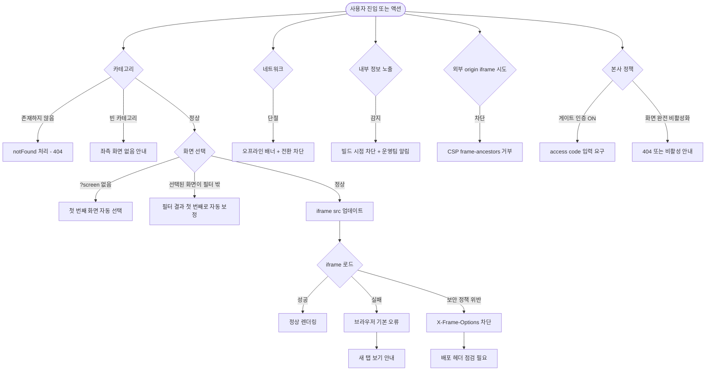

# SCR-110 클라이언트 프리뷰 갤러리

## 1. 화면 메타 정보

이 문서는 클라이언트 프리뷰 갤러리에 대한 자기완결형 요구사항 정의서입니다. 다른 문서를 함께 보지 않아도 이 문서 한 장만으로 클라이언트 프리뷰 갤러리에 들어가는 모든 영역, 모든 카테고리, 모든 버튼, 모든 권한, 모든 예외 처리, 그리고 이 화면을 지탱하는 운영 정책까지 전부 이해하고 구현할 수 있도록 작성합니다.

| 항목 | 값 |
|---|---|
| 작성일 | 2026-05-22 |
| 버전 | v1.0 |
| 상태 | 최신 통합본 반영 (정합화 완료) |
| 도메인 | D01 공통 |
| 화면 ID | SCR-110 |
| 화면명 | 클라이언트 프리뷰 갤러리 |
| 화면 유형 | 공개 갤러리 (비로그인 외부 검토용 화면 카탈로그) |
| 라우트 (URL) | `/client-preview` (개요), `/client-preview/{category}` (카테고리 상세) |
| 플랫폼 | 데스크톱(기본), 태블릿, 모바일 |
| 우선순위 | P1 (출시 옵션 — 검수·시연용) |
| 기능코드 | MFN-SCR-110 (클라이언트 프리뷰 갤러리) |
| 계약코드 | 본 화면 직접 계약코드 없음 |
| 계약 상태 | 비계약 본기능 |
| 부모 기능 prefix | MFN |
| Lv1 코드 | MFN-SCR-110 |
| Lv2 / Lv3 세분화 | MFN-SCR-110-01 ~ MFN-SCR-110-07 (공개 개요 렌더링, 카테고리 이동, 화면 목록 필터, 선택 화면 유지, iframe 프리뷰, 공개 노출 제한, 배포 헤더 제어) |
| 연계 화면 | 내부 검수 화면 `/publishing`, `/publishing/[category]` (분리 운영), 각 도메인 화면의 preview 모드(`preview=1` URL) |
| 호출 다이얼로그 | 직접 호출 없음 |

## 2. 화면 개요와 목적

클라이언트 프리뷰 갤러리는 외부 클라이언트가 FitGenie CRM 로그인 계정이 없는 상태에서도 퍼블리싱 결과물을 확인할 수 있도록 제공되는 공개 검토용 갤러리입니다. 내부 검수용 `/publishing` 화면과 동일한 화면 카탈로그를 사용하지만, 본 화면은 CRM 사이드바·헤더·권한 가드 없이 갤러리 UI와 iframe 프리뷰만 제공해 클라이언트가 별도 인증 없이 자유롭게 화면을 둘러볼 수 있게 합니다. 본 시스템은 `직원 1명 = 로그인 계정 1개` 원칙이 적용되는 어드민 도구이므로 일반 직원은 본 화면을 거의 사용하지 않지만, 본사 슈퍼관리자가 클라이언트와의 시연·검수 미팅에서 공유 링크 형태로 본 화면을 외부에 노출시킬 때 핵심 도구로 활용됩니다.

이 화면이 다루는 운영 흐름은 다음과 같습니다. 본사 PM이 신규 도입 클라이언트와의 검수 미팅에서 `/client-preview` 링크를 공유해, 클라이언트가 본인 단말에서 직접 회원관리·매출관리·수업관리 같은 도메인의 퍼블리싱 결과를 확인합니다. 클라이언트는 카테고리 카드로 도메인을 선택한 뒤, 좌측 화면 목록에서 검토하고 싶은 화면을 클릭하고, 우측 iframe에 떠 있는 그 화면의 preview 모드를 보면서 화면의 시각적 결과를 점검합니다. 디자이너는 같은 갤러리에서 본인이 작업한 화면의 퍼블리싱 결과를 빠르게 훑어 시각적 일관성을 점검하고, QA 엔지니어는 같은 갤러리를 사용해 모든 화면의 상태를 한 번에 비교합니다.

이 화면은 단순한 화면 목록이 아니라, 비로그인 진입 + AppLayout 제거 + iframe 프리뷰 + 카테고리 분류 + 검색·필터 + 새 탭 보기 + 보안 헤더 제어까지 모두 반영된 공개 검토 전용 카탈로그로 동작합니다. 내부 검수용 `/publishing`과 명확히 분리되어 본 화면에는 내부 기능명세 파일 경로·실제 운영 라우트 직접 열기·개발 가이드 같은 내부 자료가 노출되지 않습니다. 실데이터 검수가 아니라 퍼블리싱 형태와 화면 상태 검토가 목적이므로 모든 iframe은 mock 데이터 또는 preview 전용 세션 데이터로만 렌더링됩니다.

## 3. 진입 경로와 인접 화면

클라이언트 프리뷰 갤러리에 진입하는 경로는 다음 두 가지가 있고, 어느 경로로 들어와도 비로그인 상태가 기본입니다.

첫 번째 경로는 외부 공유 URL 직접 접근입니다. 본사 PM이 클라이언트에게 메일·메신저로 `/client-preview` URL을 공유하면, 클라이언트가 그 링크를 클릭해 본 화면의 개요 페이지로 진입합니다. 인증 가드가 적용되지 않으므로 로그인하지 않은 외부 사용자도 자유롭게 접근할 수 있습니다.

두 번째 경로는 카테고리별 직접 링크 접근입니다. `/client-preview/{category}` 형태의 URL이 공유되면 사용자가 그 카테고리의 화면 목록으로 직접 진입합니다. 카테고리 안에서 특정 화면을 선택한 상태(`?screen={screenId}`)로 공유 링크가 만들어진 경우, 그 화면이 자동으로 우측 iframe에 떠 있는 상태로 진입합니다.

이 화면에서 빠져나가는 인접 화면은 두 가지입니다. 첫 번째는 카테고리 카드 또는 카테고리 탭 이동으로, `/client-preview/{category}` 경로 내에서의 도메인 전환입니다. 두 번째는 새 탭 보기 클릭으로, 선택된 화면의 `preview=1` URL이 새 탭에서 열리는 외부 이동입니다. 새 탭에서 열린 화면은 본 갤러리 레이아웃 없이 그 화면 자체의 preview 모드만 풀스크린으로 표시됩니다.

본 화면에서는 실제 운영 라우트(`/members`, `/dashboard` 등)로의 직접 이동 링크가 노출되지 않습니다. 클라이언트가 잘못 운영 화면에 진입해 인증 가드에 막히지 않도록, 모든 화면 이동은 `/client-preview` prefix 안에서만 일어나도록 격리됩니다.

## 4. 레이아웃과 UI 구성

클라이언트 프리뷰 갤러리는 어드민 공통 레이아웃(AppLayout)을 사용하지 않습니다. 사이드바·상단 헤더·알림 아이콘 같은 운영 UI가 전혀 노출되지 않으며, 단순한 갤러리 전용 레이아웃이 적용됩니다. URL에 따라 두 가지 레이아웃 모드를 가집니다.

### 4-1. 개요 화면 (`/client-preview`)

개요 화면은 모든 카테고리를 한 번에 볼 수 있는 진입 페이지입니다. 화면 가장 위에는 페이지 헤더가 있으며, 좌측에 "FitGenie 화면 갤러리" 같은 타이틀과 우측에 공개 안내 텍스트(예: "외부 클라이언트 검토용 페이지입니다")가 표시됩니다. 별도의 로그인 안내나 운영 메뉴는 노출되지 않습니다.

헤더 아래에는 도메인 카테고리 카드 그리드가 배치됩니다. 카드 그리드는 데스크톱에서 3~4열로, 태블릿에서 2열로, 모바일에서 1열로 폴백됩니다. 각 카드에는 카테고리 아이콘, 카테고리명(예: "D01 공통", "D02 회원관리", "D03 매출관리"), 그리고 그 카테고리에 포함된 화면 수("12개 화면")가 표시됩니다. 카드 하단에는 카테고리 설명(예: "회원 등록·조회·이관·탈퇴 등 회원 운영 전반의 화면")이 한 줄로 따라옵니다.

페이지 하단에는 전체 통계 영역이 작게 표시될 수 있습니다. "총 N개 화면, M개 도메인" 같은 메타 정보가 노출되어 클라이언트가 갤러리의 전체 규모를 즉시 파악할 수 있게 합니다.

페이지 가장 아래에는 본사 정책에 따라 공개 안내 문구·약관·연락처 같은 정적 정보가 작게 배치될 수 있습니다.

### 4-2. 카테고리 화면 (`/client-preview/{category}`)

카테고리 화면은 특정 도메인의 화면 목록과 iframe 프리뷰를 동시에 보여주는 페이지입니다. 화면은 좌우 2열 구조로 배치됩니다.

페이지 가장 위에는 카테고리 탭 영역이 있습니다. 사용자가 카테고리 사이를 자유롭게 전환할 수 있도록 모든 카테고리가 가로 탭으로 나열되며, 현재 카테고리가 강조 표시됩니다. 탭을 클릭하면 `/client-preview/{새카테고리}` URL로 이동합니다. 탭 영역 우측에는 "개요로 돌아가기" 링크가 작게 표시되어 `/client-preview`로 복귀할 수 있게 합니다.

카테고리 탭 아래에는 검색·필터 영역이 있습니다. 좌측에는 검색 입력란(placeholder: "화면명·route·설명으로 검색")이 배치되고, 우측에는 타입 필터 드롭다운(대시보드·목록/운영·입력/설정·상세/확인·진입 화면 등)이 배치됩니다. 필터를 적용하면 좌측 화면 목록이 즉시 필터링됩니다.

본문은 좌우 2열로 나뉩니다. 좌측은 화면 목록 패널로, 카테고리에 속한 화면들이 카드 또는 행 형태로 나열됩니다. 각 항목에는 화면 ID(예: "SCR-100"), 화면명(예: "로그인"), route(예: "/login"), 화면 유형(예: "진입"), 한 줄 요약이 표시됩니다. 현재 선택된 화면은 강조 표시(배경색·왼쪽 강조 바)되어 사용자가 어느 화면을 보고 있는지 알 수 있게 합니다. 항목 클릭으로 우측 iframe이 그 화면으로 전환됩니다.

우측은 프리뷰 패널로, 선택된 화면의 `preview=1` URL을 iframe으로 렌더링합니다. iframe 폭은 데스크톱에서 본문의 약 65%를 차지하며, 태블릿에서는 좌측 목록 폭이 줄어들고 iframe 폭이 상대적으로 커지며, 모바일에서는 좌우 2열 구조가 아닌 상하 구조로 전환되어 목록 위에 iframe이 표시됩니다. iframe 헤더에는 현재 선택된 화면명·route 정보와 "새 탭 보기" 외부 링크 버튼이 함께 표시됩니다.

iframe 영역 내부에는 그 화면의 preview 모드가 실제로 렌더링됩니다. preview 모드는 mock 데이터 또는 preview 전용 세션 데이터를 사용해 운영 데이터에 영향을 주지 않으며, 실제 사이드바·헤더 같은 운영 UI도 가려지거나 단순화될 수 있습니다.

검색 결과가 없거나 카테고리에 화면이 등록되지 않은 경우, 좌측 패널에 "조건에 맞는 화면이 없습니다" 또는 "이 카테고리에 등록된 화면이 없습니다" 빈 안내가 표시됩니다.

존재하지 않는 카테고리(예: `/client-preview/unknown`)로 접근하면 404 안내 또는 개요로 자동 이동하는 처리가 적용됩니다.

## 5. 화면 목록과 카테고리 동작

본 화면의 핵심 동작은 카테고리 단위로 묶인 화면 카탈로그를 사용자가 자유롭게 탐색할 수 있게 하는 것입니다. 카테고리와 화면 목록의 동작을 풀어 적습니다.

카테고리는 도메인(D01·D02·D03 등)을 기본 단위로 정의됩니다. 빌드 타임에 정적으로 생성된 카탈로그 데이터에 각 카테고리의 ID·이름·설명·아이콘·화면 목록이 포함되어 있으며, 새 화면이 추가되면 카탈로그가 함께 업데이트됩니다.

카테고리 카드 클릭은 `/client-preview/{category}` URL로 라우팅되며, 그 카테고리의 화면 목록이 좌측 패널에 즉시 렌더링됩니다. 카테고리 탭으로 다른 카테고리를 선택하면 URL이 변경되면서 좌측 목록과 우측 iframe이 모두 갱신됩니다.

검색 입력은 좌측 목록을 실시간으로 필터링합니다. 검색 매칭은 화면명·route·요약 텍스트를 OR 조건으로 부분 일치 매칭합니다. 디바운스 200ms가 적용되어 사용자가 빠르게 타이핑하는 동안에는 필터링이 누적되지 않습니다.

타입 필터는 화면 유형(대시보드·목록/운영·입력/설정·상세/확인·진입 화면 등)을 기준으로 화면 목록을 좁힙니다. 필터가 적용되면 좌측 목록에 그 타입의 화면만 남으며, 검색과 동시에 적용되어 두 조건을 모두 만족하는 화면만 표시됩니다.

화면 항목 클릭은 우측 iframe을 그 화면의 preview 모드로 전환합니다. 동시에 URL에 `?screen={screenId}` 쿼리 파라미터가 추가되어 현재 선택된 화면 정보가 URL에 보존됩니다. 페이지 새로고침이나 공유 링크로 다시 진입해도 같은 화면이 선택된 상태로 복원됩니다.

`?screen` 쿼리 파라미터가 없는 상태로 카테고리에 진입하면 그 카테고리의 첫 번째 화면이 자동 선택되어 iframe에 렌더링됩니다. 선택된 화면이 현재 필터 결과 밖에 있는 경우(예: 사용자가 검색어를 입력해 그 화면이 필터에서 빠진 경우) 현재 필터 결과의 첫 번째 화면으로 자동 보정됩니다.

새 탭 보기 버튼은 클릭 시 선택된 화면의 `preview=1` URL을 새 탭에서 엽니다. 새 탭에서 열린 화면은 본 갤러리 레이아웃 없이 풀스크린으로 표시되며, 클라이언트가 더 큰 화면으로 검토하고 싶을 때 유용합니다. 새 탭 URL도 인증 가드 없이 접근 가능한 preview 모드 URL이어야 합니다.

iframe 내부의 화면은 mock 또는 preview 전용 세션 데이터로 렌더링됩니다. 실제 운영 데이터(회원·매출·수업)는 절대 노출되지 않으며, 모든 데이터는 사전에 준비된 가상 데이터로 시뮬레이션됩니다. 권한별 화면 차이도 preview 모드에서는 가상의 권한 컨텍스트(예: owner 시뮬레이션)로 표시됩니다.

## 6. 버튼·아이콘·링크 액션 전체 정의

이 화면에 등장하는 모든 클릭 가능한 요소를 빠짐없이 정의합니다.

개요 화면의 카테고리 카드는 클릭 시 `/client-preview/{category}` URL로 라우팅됩니다. 카드 전체가 단일 클릭 영역이며 별도의 액션 버튼은 없습니다.

카테고리 화면의 카테고리 탭은 클릭 시 다른 카테고리로 라우팅됩니다. 현재 카테고리 탭은 강조 표시되어 클릭해도 동일 카테고리이므로 라우팅이 일어나지 않습니다.

카테고리 화면 우측 상단의 "개요로 돌아가기" 링크는 `/client-preview`로 이동합니다.

검색 입력란은 텍스트 입력 영역이며, 입력 시 디바운스 200ms 후 좌측 목록이 필터링됩니다. ESC 키로 입력을 비우면 필터가 초기화됩니다.

타입 필터 드롭다운은 클릭으로 펼쳐지며 선택 시 좌측 목록이 즉시 필터링됩니다. "전체" 옵션을 선택하면 타입 필터가 해제됩니다.

좌측 화면 목록의 각 항목은 클릭 시 우측 iframe이 그 화면으로 전환되고 URL의 `?screen` 쿼리 파라미터가 업데이트됩니다.

우측 iframe 헤더의 "새 탭 보기" 버튼은 클릭 시 선택된 화면의 `preview=1` URL을 새 탭에서 엽니다.

우측 iframe 내부의 클릭은 iframe 안의 화면이 자체적으로 처리합니다. iframe 안에서 사용자가 클릭하는 모든 액션은 mock 데이터로 시뮬레이션되며, 실제 운영 데이터에는 영향을 주지 않습니다.

좌측 패널의 "조건에 맞는 화면이 없습니다" 빈 안내에는 별도의 클릭 액션이 없지만, 그 아래에 "필터 초기화" 보조 링크가 함께 표시되어 클릭 시 검색어와 타입 필터를 모두 초기화합니다.

본 화면의 푸터(있는 경우)에 배치된 공개 안내·약관·연락처 링크는 외부 URL로 연결됩니다. 본사 정책에 따라 mailto 링크 또는 외부 헬프데스크 URL이 사용됩니다.

내부 기능명세 파일 경로·실제 운영 라우트 직접 열기·개발 가이드 같은 내부 자료는 본 화면에 노출되지 않으므로 클릭 가능 요소가 없습니다.

모든 버튼은 라우팅 중에는 자동으로 비활성화되어 더블클릭으로 인한 중복 라우팅이 차단됩니다.

## 7. 호출되는 다이얼로그 동작

클라이언트 프리뷰 갤러리는 자체적으로 다이얼로그를 호출하지 않습니다. 본 화면은 비로그인 외부 검토용 카탈로그이므로 위험 액션·확인 흐름·세션 관리가 없으며, 모든 상호작용은 페이지 내 라우팅과 iframe 전환으로 즉시 처리됩니다.

다음과 같은 다이얼로그와의 관계가 있습니다.

### 7-1. DLG-000 세션 만료 다이얼로그 (해당 없음)

본 화면은 인증 가드가 적용되지 않는 비로그인 화면이므로 세션 만료가 발생하지 않습니다. iframe 안의 preview 모드도 mock 데이터 또는 preview 전용 세션으로 동작하므로 인증 흐름이 적용되지 않습니다.

### 7-2. DLG-001 로그아웃 확인 다이얼로그 (해당 없음)

본 화면은 비로그인 상태이므로 로그아웃 흐름이 발생하지 않습니다.

### 7-3. DLG-002 이탈 경고 다이얼로그 (해당 없음)

본 화면에는 사용자가 입력한 폼 데이터가 저장되지 않으므로 이탈 경고가 트리거되지 않습니다. 검색어와 타입 필터는 단순 조회 수단이므로 dirty 상태로 간주되지 않습니다.

## 8. 토스트와 안내 메시지

클라이언트 프리뷰 갤러리에서 발생하는 모든 알림성 UI는 다음과 같은 패턴으로 동작합니다.

성공 토스트는 본 화면에서 거의 사용되지 않습니다. 본 화면 자체가 조회와 시연을 위한 카탈로그이므로 사용자에게 결과를 알릴 액션이 거의 없습니다.

실패 안내는 인라인 메시지 형태로 처리됩니다. 검색 결과가 없을 때 좌측 패널에 "조건에 맞는 화면이 없습니다" 빈 안내가 표시되고, 존재하지 않는 카테고리로 접근하면 404 안내 페이지가 표시됩니다. 카테고리에 등록된 화면이 하나도 없는 경우 "이 카테고리에 등록된 화면이 없습니다" 안내가 표시됩니다.

iframe 로딩 실패 안내는 우측 iframe 영역에 표시됩니다. preview 화면이 로드되지 못하거나 동일 origin 보안 정책 위반으로 차단된 경우, 브라우저 기본 iframe 오류 화면이 표시되거나 본 화면이 별도로 "프리뷰를 불러오지 못했습니다. 새 탭 보기로 다시 시도해주세요" 안내를 표시할 수 있습니다.

오프라인 안내는 본 화면 상단에 작은 배너로 "오프라인 상태입니다" 안내가 표시되고, 이미 로드된 카탈로그와 iframe 캐시 데이터로만 동작합니다. 새로운 화면 전환은 차단됩니다.

확인 팝업과 알럿은 본 화면에서 사용되지 않습니다.

내부 정보 노출 경고는 본 화면이 잘못된 정보를 노출하지 않도록 빌드 시점에 검증되며, 런타임 안내는 별도로 표시되지 않습니다.

## 9. 데이터 흐름과 외부 연동

이 화면은 외부 클라이언트가 접근하는 공개 갤러리이므로 운영 데이터와 분리된 정적 카탈로그를 사용합니다. 어떤 데이터가 어디서 오고 어디로 가는지를 모두 풀어 씁니다.

화면 진입 시점에는 별도의 데이터 fetch가 일어나지 않습니다. 화면 카탈로그(카테고리·화면 목록·메타 정보)는 빌드 타임에 정적으로 생성된 클라이언트 측 객체이며, 페이지가 로드되면 즉시 사용 가능합니다. 새 화면이 추가되거나 카테고리가 변경되면 코드 베이스의 카탈로그 데이터가 업데이트되어 다음 배포에 반영됩니다.

카테고리 라우팅 시점에는 URL 변경 외에 별도 API 호출이 없습니다. 클라이언트 라우터가 `/client-preview/{category}` 경로를 인식해 해당 카테고리의 화면 목록을 카탈로그에서 즉시 렌더링합니다.

화면 항목 클릭 시점에는 우측 iframe의 src 속성이 업데이트되어 그 화면의 `preview=1` URL을 로드합니다. iframe 내부의 페이지가 자체적으로 mock 데이터 또는 preview 전용 세션을 사용해 렌더링되며, 본 화면은 iframe 로드 이벤트만 관찰합니다. URL의 `?screen={screenId}` 쿼리 파라미터도 동시에 갱신됩니다.

iframe 내부 화면의 preview 모드는 다음과 같이 동작합니다. URL에 `preview=1` 쿼리 파라미터가 포함되면, 그 화면의 클라이언트 로직이 preview 모드로 분기되어 인증 가드를 우회하고 mock 데이터를 사용합니다. 실제 API 호출은 차단되거나 mock API 응답으로 대체되며, 실제 운영 데이터(회원·매출·수업)는 절대 노출되지 않습니다. 권한 컨텍스트도 가상으로 구성되어(예: owner 또는 슈퍼관리자 시뮬레이션) 권한별 화면 차이를 점검할 수 있게 합니다.

새 탭 보기 클릭 시점에는 선택된 화면의 `preview=1` URL이 새 탭에서 열립니다. 새 탭의 URL도 인증 가드 없이 접근 가능한 preview 모드이며, AppLayout 없이 풀스크린으로 표시됩니다.

내부 검수용 `/publishing`과의 분리는 다음과 같이 구현됩니다. `/publishing` 경로는 인증이 필요한 내부 화면으로 본사 직원만 접근 가능하며, 본 화면(`/client-preview`)과 다른 라우터·다른 컴포넌트로 분리되어 있습니다. `/publishing`에는 내부 기능명세 파일 경로·실제 운영 라우트 직접 열기·개발 가이드 같은 내부 자료가 노출되지만, `/client-preview`에는 그 자료들이 빌드 시점에 제외되어 외부 사용자에게 노출되지 않습니다.

배포 헤더 정책은 본 화면이 같은 origin iframe을 허용하면서 외부 origin iframe은 차단되도록 설정됩니다. 구체적으로 `X-Frame-Options: SAMEORIGIN`과 `Content-Security-Policy: frame-ancestors 'self'`를 사용해, 같은 도메인에서의 iframe 임베드는 허용하고 외부 사이트에서의 iframe 임베드는 거부합니다. `X-Frame-Options: DENY`를 적용하면 같은 도메인의 preview iframe도 차단되므로 사용하지 않습니다.

오프라인 상태에서는 이미 로드된 카탈로그와 iframe 캐시 데이터로만 동작합니다. 새로운 카테고리 전환이나 화면 전환은 네트워크가 필요하므로 차단됩니다.

분석·통계 정책은 본사 정책에 따라 본 화면의 사용량을 외부 분석 도구로 전송할 수 있습니다. 단, 개인 정보가 포함되지 않은 익명 통계(어느 카테고리·화면이 자주 조회되는지)만 수집되며, 본 화면 자체가 비로그인이므로 사용자 식별 정보는 수집되지 않습니다.

화면에서 호출하는 주요 API 엔드포인트는 다음과 같습니다. 정적 카탈로그 데이터(빌드 타임 포함)는 별도 API 호출이 없으며, iframe 내부 페이지가 자체적으로 호출하는 mock API 또는 preview 전용 엔드포인트가 일부 존재할 수 있습니다.

## 10. 화면 상태와 예외 처리

클라이언트 프리뷰 갤러리는 다음 상태들을 가질 수 있고, 각 상태마다 사용자에게 보이는 모습이 달라집니다.

개요 상태는 `/client-preview`로 진입한 직후로, 모든 카테고리 카드가 그리드로 표시되고 전체 통계가 노출됩니다.

카테고리 선택 상태는 `/client-preview/{category}`로 진입한 상태로, 좌측 화면 목록과 우측 iframe이 동시에 표시됩니다. `?screen` 쿼리 파라미터가 없으면 첫 번째 화면이 자동 선택되어 iframe에 표시됩니다.

검색 결과 없음 상태는 사용자가 검색어를 입력했지만 일치하는 화면이 없는 상태로, 좌측 패널에 "조건에 맞는 화면이 없습니다" 안내와 "필터 초기화" 보조 링크가 표시됩니다.

빈 카테고리 상태는 카테고리에 등록된 화면이 한 건도 없는 상태로, 좌측 패널에 "이 카테고리에 등록된 화면이 없습니다" 안내가 표시되고 우측 iframe은 빈 상태로 남습니다.

잘못된 카테고리 상태는 사용자가 존재하지 않는 카테고리(예: `/client-preview/unknown`)로 접근한 상태로, 404 안내 페이지가 표시되거나 자동으로 개요로 이동합니다. 본 문서는 `notFound()` 처리로 404 안내를 표준으로 정의합니다.

iframe 로딩 상태는 사용자가 화면 항목을 클릭한 직후로, 우측 iframe 영역에 브라우저 기본 iframe 로딩 상태가 잠시 표시됩니다. preview 페이지가 로드되면 즉시 정상 상태로 전환됩니다.

iframe 로드 실패 상태는 preview URL이 응답을 반환하지 못하거나 보안 정책 위반으로 차단된 상태로, iframe 영역에 브라우저 기본 오류 화면이 표시됩니다. 사용자는 "새 탭 보기"로 재확인할 수 있습니다.

오프라인 상태는 네트워크가 단절된 상태로, 본 화면 상단에 오프라인 배너가 표시되고 새로운 카테고리·화면 전환이 차단됩니다.

예외 케이스별 처리는 다음과 같이 정의됩니다.

알 수 없는 카테고리로 접근하면 `notFound()` 처리로 404 안내가 표시됩니다. 별도의 안내 페이지 또는 개요로의 자동 이동 옵션이 본사 정책에 따라 선택될 수 있습니다.

카테고리에 화면이 비어 있으면 좌측 패널에 "이 카테고리에 등록된 화면이 없습니다" 안내가 표시됩니다.

`?screen` 쿼리 파라미터가 없으면 카테고리의 첫 번째 화면이 자동 선택됩니다.

선택된 화면이 현재 검색·타입 필터 결과 밖에 있으면 현재 필터 결과의 첫 번째 화면으로 자동 보정되어 우측 iframe이 그 화면으로 전환됩니다.

iframe 로드가 실패하면 브라우저 기본 오류 화면이 표시되며, 사용자는 "새 탭 보기"로 그 화면을 다시 확인할 수 있습니다.

배포 헤더가 잘못 설정되어 같은 origin iframe이 차단된 경우(예: `X-Frame-Options: DENY` 잘못 적용), 모든 iframe이 로드되지 않습니다. 이는 배포 시점에 점검되어야 하며 런타임 안내는 별도로 표시되지 않습니다.

오프라인 상태에서 화면 전환을 시도하면 iframe이 로드되지 않고 이전 화면이 그대로 유지됩니다. 본 화면 상단에 오프라인 배너가 표시됩니다.

같은 사용자가 짧은 시간에 화면을 빠르게 전환하면 iframe 로딩이 누적되지 않고 가장 마지막 선택만 로드됩니다.

내부 기능명세 파일 경로·실제 운영 라우트 직접 열기·개발 가이드 같은 내부 자료가 본 화면에 노출되는 일은 빌드 시점에 검증되어 차단됩니다. 잘못된 노출이 감지되면 본사 운영팀에 알림이 발송될 수 있습니다.

## 11. 권한별 처리

이 화면은 비로그인 외부 클라이언트용으로 설계된 공개 화면이므로 일반적인 권한별 처리와는 다른 방식으로 동작합니다.

외부 클라이언트(external_client)는 본 화면을 자유롭게 사용할 수 있습니다. 별도의 인증이나 권한 부여 없이 `/client-preview` URL만 알면 누구나 접근 가능하며, 모든 카테고리·화면을 자유롭게 탐색할 수 있습니다. 단, iframe 안의 preview 모드는 mock 데이터만 표시하므로 실제 운영 데이터에는 접근할 수 없습니다.

superAdmin, primary, Owner(지점장), 매니저(manager)도 본 화면을 사용할 수 있습니다. 본사 슈퍼관리자가 클라이언트와의 시연 미팅에서 본인 단말로 본 화면을 띄우거나, 본사 PM이 본 화면의 링크를 공유하기 전에 미리 검토하는 용도로 활용됩니다. 이들 역할이 본 화면에 진입해도 본 화면 자체에는 인증 컨텍스트가 적용되지 않아 외부 사용자와 동일한 화면을 봅니다.

FC(fc), 스태프(staff), 프런트(front), 트레이너(trainer), 읽기 전용(readonly) 역할은 일반적으로 본 화면을 사용할 일이 없지만, 비로그인 화면이므로 접근 자체에는 제약이 없습니다. 이 역할들도 외부 사용자와 동일한 화면을 봅니다.

본 화면의 비로그인 정책은 보안 트레이드오프를 가집니다. 한쪽에서는 외부 클라이언트가 별도 인증 없이 갤러리를 자유롭게 사용할 수 있다는 편의성을 얻고, 다른 쪽에서는 누구나 URL을 알면 접근할 수 있다는 노출 위험이 있습니다. 이 트레이드오프는 다음 방어 장치로 완화됩니다.

첫 번째 방어 장치는 운영 데이터 분리입니다. 본 화면의 iframe 안에는 mock 데이터 또는 preview 전용 세션 데이터만 표시되며, 실제 회원·매출·수업·직원 같은 운영 데이터는 절대 노출되지 않습니다. 따라서 누군가 URL을 우연히 알아내도 의미 있는 운영 정보를 얻을 수 없습니다.

두 번째 방어 장치는 내부 정보 제거입니다. 본 화면에는 내부 기능명세 파일 경로·실제 운영 라우트 직접 열기·개발 가이드·관리자 도구 같은 내부 자료가 노출되지 않습니다. 클라이언트가 본 화면에서 시스템의 내부 구조를 파악하지 못하도록 엄격히 격리됩니다.

세 번째 방어 장치는 배포 헤더입니다. 본 화면이 외부 사이트의 iframe으로 임베드되지 못하도록 `X-Frame-Options: SAMEORIGIN`과 `Content-Security-Policy: frame-ancestors 'self'`가 적용됩니다.

네 번째 방어 장치는 본사 정책 옵션입니다. 보안이 더 강화된 환경이 필요하면 본 화면 자체에 간단한 게이트 인증(예: 사전 발급된 access code 입력)을 추가하거나, 본사 정책으로 본 화면을 완전히 비활성화할 수 있습니다.

권한이 부족해서 액션이 차단되는 경우는 본 화면에서 발생하지 않습니다. 본 화면은 비로그인 공개 화면이므로 모든 사용자가 동일한 UI와 동일한 데이터를 봅니다.

내부 검수용 `/publishing`은 본 화면과 다른 경로이며 인증이 필요합니다. 본사 직원만 `/publishing`에 접근할 수 있고, 그 화면에서는 내부 자료가 노출됩니다. 클라이언트는 `/publishing`에 접근하지 못하므로 두 경로가 명확히 분리됩니다.

## 12. 메인 흐름

클라이언트 프리뷰 갤러리의 핵심 동작 흐름을 다이어그램으로 표현합니다. 외부 클라이언트가 공유 링크로 진입한 시점부터 화면을 검토하는 일반적인 흐름입니다.

```mermaid
flowchart TD
    A([외부 공유 URL 접속]) --> B{진입 경로}
    B -->|/client-preview| C[개요 화면 렌더링]
    B -->|/client-preview/{category}| D[카테고리 화면 렌더링]
    C --> E[카테고리 카드 그리드 표시]
    E --> F[카테고리 카드 클릭]
    F --> D
    D --> G[카테고리 탭 + 검색·필터 + 좌우 2열]
    G --> H{?screen 쿼리}
    H -->|있음| I[해당 화면 자동 선택]
    H -->|없음| J[첫 번째 화면 자동 선택]
    I --> K[우측 iframe에 preview URL 로드]
    J --> K
    K --> L{사용자 액션}
    L -->|검색어 입력| M[디바운스 200ms + 목록 필터링]
    L -->|타입 필터 선택| M
    L -->|화면 항목 클릭| N[?screen 갱신 + iframe 전환]
    L -->|새 탭 보기| O[preview URL 새 탭 열림]
    L -->|카테고리 탭 클릭| P[다른 카테고리 라우팅]
    L -->|개요로 돌아가기| C
    M --> Q{필터 결과}
    Q -->|있음| R[목록 갱신]
    Q -->|없음| S[빈 안내 + 필터 초기화]
    N --> K
    R --> T{선택된 화면 필터 밖?}
    T -->|예| U[첫 번째 결과로 자동 보정]
    T -->|아니오| V[그대로 유지]
    U --> K
```

## 13. 에러 흐름

클라이언트 프리뷰 갤러리에서 발생할 수 있는 주요 에러와 그 처리 흐름을 다이어그램으로 표현합니다. 잘못된 카테고리·빈 카테고리·iframe 로드 실패·배포 헤더 오류가 어떻게 분기되는지를 정의합니다.



## 14. 운영 정책 — 공개 갤러리 / 보안 / 분리 자기완결 정리

이 절은 본 화면이 의존하는 공개 갤러리·보안·분리 운영 정책을 외부 문서 참조 없이 풀어 적습니다.

내부·외부 분리 정책은 본 화면(`/client-preview`)을 내부 검수용(`/publishing`)과 명확히 분리합니다. 두 경로는 다른 라우터·다른 컴포넌트로 격리되어 있으며, 내부용은 인증이 필요하고 본 화면은 비로그인 접근을 허용합니다. 같은 화면 카탈로그를 공유하지만 본 화면에는 내부 자료가 노출되지 않도록 빌드 시점에 검증됩니다.

AppLayout 미적용 정책은 본 화면이 사이드바·헤더 같은 운영 UI를 가지지 않도록 합니다. 비로그인 진입을 허용하면서도 운영 메뉴가 노출되지 않아 외부 클라이언트가 시스템의 운영 구조를 파악하지 못하도록 합니다.

mock 데이터 사용 정책은 iframe 안의 preview 모드가 실제 운영 데이터에 절대 접근하지 못하도록 합니다. 모든 데이터는 사전에 준비된 mock 또는 preview 전용 세션 데이터로 시뮬레이션되며, 실제 회원·매출·수업·직원 정보는 노출되지 않습니다.

내부 자료 제거 정책은 본 화면에 다음 항목들이 노출되지 않도록 합니다. 내부 기능명세 파일 경로(예: 문서 파일 시스템 경로), 실제 운영 라우트 직접 열기 링크, 공통 개발 가이드, 관리자 도구, API 엔드포인트 상세, 데이터베이스 스키마 정보. 빌드 시점에 이런 정보가 본 화면에 포함되지 않도록 정적 분석이 수행됩니다.

iframe URL 정책은 본 화면의 iframe과 새 탭 보기가 항상 `preview=1` 쿼리 파라미터가 포함된 URL만 사용하도록 합니다. 실제 운영 라우트(`/members`, `/dashboard`)는 본 화면에서 어떤 형태로도 호출되지 않습니다.

배포 보안 헤더 정책은 다음을 사용합니다. `X-Frame-Options: SAMEORIGIN`은 같은 도메인의 iframe 임베드는 허용하고 외부 사이트는 차단합니다. `Content-Security-Policy: frame-ancestors 'self'`도 동일한 정책을 강화합니다. `X-Frame-Options: DENY`는 같은 도메인의 preview iframe도 차단하므로 사용하지 않습니다.

외부 origin iframe 차단 정책은 본 화면이 외부 사이트(예: 클라이언트 자체 웹사이트)에 iframe으로 임베드되지 못하도록 합니다. 본사가 본 화면을 노출하는 것은 클라이언트와의 1대1 검수 미팅에서 직접 공유 링크를 보내는 방식으로 한정되며, 무차별 임베드는 허용되지 않습니다.

분석·통계 정책은 본 화면의 사용량을 본사 분석 도구로 익명 수집할 수 있습니다. 어느 카테고리·화면이 자주 조회되는지를 통계로 보아 개선 우선순위를 정하는 데 활용되며, 사용자 식별 정보는 수집되지 않습니다.

선택 화면 URL 보존 정책은 사용자가 클릭한 화면이 URL의 `?screen` 쿼리 파라미터로 보존되도록 합니다. 공유 링크로 다시 진입하거나 새로고침해도 같은 화면이 선택된 상태로 복원되어 클라이언트와의 협의가 일관되게 진행될 수 있습니다.

빈 카테고리·잘못된 카테고리 처리 정책은 카테고리에 화면이 없으면 빈 안내를, 존재하지 않는 카테고리면 404 안내(또는 개요 자동 이동)를 표시합니다. 사용자가 막다른 화면에 갇히지 않도록 항상 복귀 경로(개요로 돌아가기)가 제공됩니다.

다국어 정책은 본 화면의 안내 메시지·카테고리명·화면 요약을 i18n 키로 관리해 한국어 기본과 본사 정책에 따른 영어 등 다른 언어를 지원합니다. 클라이언트의 언어 환경에 맞게 표시될 수 있습니다.

본사 정책 옵션 정책은 보안이 더 강화된 환경에서 본 화면에 게이트 인증(사전 발급된 access code 입력)을 추가하거나 본 화면을 완전히 비활성화할 수 있도록 합니다. 본사 정책에 따라 사용 여부와 강도가 조정됩니다.

`/publishing` 분리 유지 정책은 내부 검수용 화면을 본 화면과 별개로 유지해 본사 직원이 내부 자료(파일 경로·실제 라우트·개발 가이드)에 접근할 수 있게 합니다. 클라이언트와 직원이 다른 경로를 사용해 같은 카탈로그를 다른 시각으로 검토합니다.

새 화면 추가 시 카탈로그 업데이트 정책은 시스템에 새 화면이 추가될 때마다 본 화면의 카탈로그 데이터도 함께 업데이트되도록 합니다. 빌드 타임에 정적 카탈로그가 생성되므로 다음 배포 시점에 본 화면이 자동으로 새 화면을 노출합니다.

세션·자동 로그아웃 정책은 본 화면에 적용되지 않습니다. 본 화면은 비로그인 기본이므로 세션 만료 가드가 우회됩니다.

## 15. 변경 이력

| 일자 | 변경 |
|---|---|
| 2026-05-22 | v1.0 자기완결형 요구사항 정의서로 통합본 작성 (기능명세서 MFN-SCR-110, 화면설계서 SCR-110, 공개 갤러리·보안 헤더·내부 분리 운영 정책 통합) |
