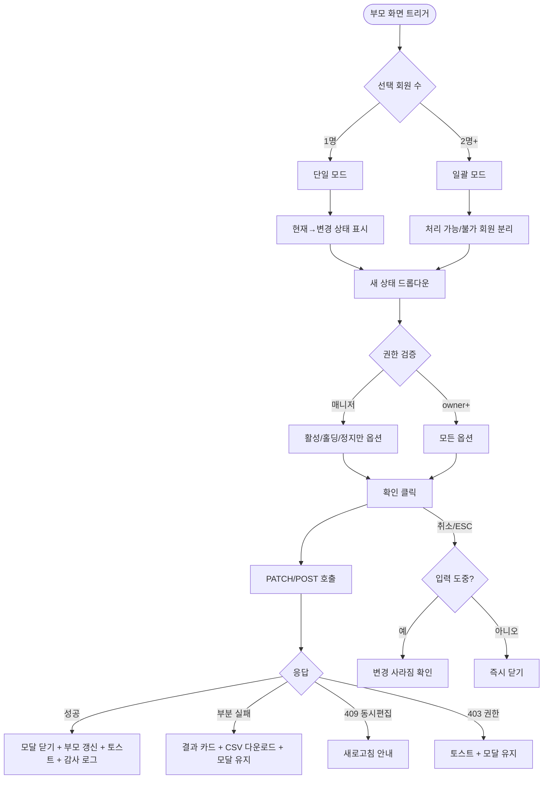

# DLG-M001 회원 상태 변경 다이얼로그

## 1. 다이얼로그 메타 정보

이 문서는 회원 상태 변경 다이얼로그에 대한 자기완결형 요구사항 정의서입니다. 다른 문서를 함께 보지 않아도 이 문서 한 장만으로 이 다이얼로그의 모든 영역, 모든 버튼, 모든 권한, 모든 예외 처리, 그리고 이 다이얼로그를 지탱하는 운영 정책까지 전부 이해하고 구현할 수 있도록 작성합니다.

| 항목 | 값 |
|---|---|
| 작성일 | 2026-05-22 |
| 버전 | v1.0 |
| 상태 | 정합화 완료 |
| 도메인 | D02 회원관리 |
| 다이얼로그 ID | DLG-M001 |
| 다이얼로그명 | 회원 상태 변경 확인 |
| 다이얼로그 유형 | 확인형 모달 (Confirmation Modal, 단일+일괄 모드) |
| 호출 화면 | SCR-M001 회원 목록, SCR-M004 회원 상세 |
| 우선순위 | P0 (출시 필수) |
| 기능코드 | MBR-01, MBR-02 |
| 계약코드 | MBR-01, MBR-02 |

## 2. 다이얼로그 목적

회원 상태 변경 다이얼로그는 회원의 상태(활성·홀딩·정지·탈퇴 등)를 바꾸기 전에 의도하지 않은 변경을 막기 위한 최종 확인을 받는 모달입니다. 회원 상태는 운영 의사결정의 결과이며 한번 변경되면 회원의 출석·결제·이용권 사용 가능 여부에 즉시 영향을 주므로, 클릭 한 번으로 무심코 처리되지 않도록 별도 확인 단계를 거치는 것이 이 다이얼로그의 존재 이유입니다.

이 모달은 단일 모드와 일괄 모드 두 가지로 동작합니다. 단일 모드는 한 명의 회원 상태를 바꿀 때, 일괄 모드는 회원 목록에서 여러 명을 선택해 일괄로 상태를 변경할 때 호출됩니다. 두 모드는 모달 본문의 정보 표시 방식이 다르지만 확인·취소 흐름은 동일합니다.

## 3. 부모 화면 호출 맥락

### SCR-M001 회원 목록에서의 호출

회원 목록 페이지에서는 두 가지 트리거로 이 다이얼로그가 열립니다. 첫째, 액션 큐의 상태 변경 버튼이나 상단 액션 바의 상태 변경 버튼으로 호출됩니다. 둘째, 일괄 작업 바의 상태 변경 버튼으로 호출됩니다. 선택된 회원이 한 명이면 단일 모드, 두 명 이상이면 일괄 모드로 열립니다.

회원 목록에서 호출 시 부모 화면은 진행 중에 모달의 dim 오버레이로 가려지고, 모달 확인 성공 후에는 해당 회원 행의 상태 배지가 즉시 갱신되며 "n명의 상태를 변경했어요" 토스트가 표시됩니다. 일괄 모드 부분 실패 시에는 결과 카드가 부모 화면 중앙 하단에 머무릅니다.

### SCR-M004 회원 상세에서의 호출

회원 상세 페이지에서는 헤더의 탈퇴 버튼이나 위험 구역의 상태 변경 메뉴를 통해 이어지는 흐름에서 활용됩니다. 단일 회원 모드로 열려 활성·홀딩·정지·탈퇴 중 새 상태를 선택하고 확인합니다. 확인 성공 시 부모 페이지가 자동으로 새로고침되어 새 상태에 맞는 배너·헤더 액션 활성/비활성 상태로 전환됩니다.

## 4. 모달 구성요소

모달 상단에는 "상태를 변경하시겠습니까?"라는 제목이 표시됩니다. 단일 모드에서는 그 아래에 변경 대상 회원의 이름과 함께 현재 상태 → 변경될 상태가 화살표 형태로 보여지고, 일괄 모드에서는 선택된 회원 수(예: "총 23명 선택")와 변경될 상태가 표시됩니다.

변경될 상태를 고르는 드롭다운이 있어서 활성·홀딩·정지·탈퇴 중에서 선택할 수 있습니다. 권한에 따라 옵션이 달라지며 매니저는 활성·홀딩·정지로만 변경 가능하고 탈퇴는 드롭다운에서 보이지 않습니다. Owner(지점장)과 슈퍼관리자는 모든 옵션을 사용할 수 있습니다.

일괄 모드에서는 처리 가능 회원과 처리 불가 회원이 분리되어 표시됩니다. 처리 불가 회원은 사유(예: 이미 탈퇴 처리됨, 권한 부족, optimistic lock 위반)와 함께 나열되어 운영자가 확인할 수 있습니다.

모달 하단에는 확인 버튼과 취소 버튼이 있습니다. 확인 버튼은 변경될 상태가 선택되고 권한 검증을 통과한 경우에만 활성화됩니다.

## 5. 동작 흐름

확인을 누르면 모달이 로딩 상태로 전환되어 주요 버튼이 모두 비활성화되고 백엔드에 상태 변경 요청이 전송됩니다. 백엔드는 회원 row에 optimistic lock(`version`)을 검증한 뒤 상태를 변경합니다.

성공하면 모달이 닫히고 부모 화면의 해당 회원 행 상태 배지(목록의 경우) 또는 헤더 상태(상세의 경우)가 즉시 갱신됩니다. 우측 상단에 "n명의 상태를 변경했어요"라는 성공 토스트가 5초간 표시됩니다.

일괄 모드에서 부분 실패가 발생하면 모달은 닫히지 않고 "성공 N / 실패 M"이라는 결과 카드가 모달 본문에 표시됩니다. 실패 회원 목록을 CSV로 다운로드받을 수 있는 링크가 함께 제공되어, 운영자가 실패 사유별로 추후 처리를 이어갈 수 있게 합니다.

취소를 누르면 모달이 즉시 닫히고 아무 변경도 일어나지 않습니다. ESC 키 또는 배경 클릭으로도 취소와 동일한 동작이 일어나지만, 입력 도중(상태가 선택된 후)인 경우에는 "변경 사항이 사라집니다. 닫으시겠습니까?"라는 확인을 한 번 더 묻습니다.

## 6. 권한별 처리

권한별로 변경 가능한 상태 옵션이 달라집니다.

매니저(manager)는 활성·홀딩·정지로만 변경 가능하며 탈퇴는 드롭다운에서 보이지 않습니다. 탈퇴는 일괄 작업 권한 정책에 따라 owner 이상만 가능하기 때문입니다.

Owner(지점장)·슈퍼관리자(superAdmin)·본사 최고관리자(primary)는 모든 옵션(활성·홀딩·정지·탈퇴)을 사용할 수 있습니다.

FC·트레이너·스태프·프런트·readonly는 이 모달에 진입조차 할 수 없습니다. 부모 화면의 상태 변경 버튼 자체가 비활성 또는 hidden 처리되어 모달이 호출되지 않습니다. 직접 API 호출 시 백엔드가 403으로 거부합니다.

모든 권한 차단 이벤트는 감사 로그에 기록됩니다.

## 7. 화면 상태

| 상태 | 설명 |
|---|---|
| 기본 표시 | 부모 화면에서 선택한 대상의 최신 상태와 가능한 옵션을 표시 |
| 상태 선택 중 | 드롭다운이 펼쳐진 상태 |
| 처리 중 | 확인 버튼 클릭 후 로딩 + 중복 클릭 방지 |
| 완료 | 성공 시 모달 닫힘 + 부모 화면 갱신 + 토스트 |
| 일괄 부분 실패 | 결과 카드 + CSV 다운로드 링크 + 모달 유지 |
| 실패 | 실패 사유 인라인 메시지 또는 토스트 + 입력값 유지 |

## 8. 데이터 흐름과 외부 연동

모달 진입 시 부모 화면이 전달한 회원 ID(단일) 또는 회원 ID 배열(일괄)이 props로 전달됩니다.

확인 클릭 시 단일 모드는 `PATCH /api/members/:id/status`를, 일괄 모드는 `POST /api/members/bulk-action`(action=STATUS_CHANGE)을 호출합니다. 요청 본문에는 회원 ID, 변경될 상태, `version`이 포함됩니다.

성공 응답에는 변경된 회원 ID와 새 상태가 포함되어 부모 화면이 즉시 갱신할 수 있습니다. 일괄 모드 부분 실패 응답에는 성공 회원 ID 배열과 실패 회원 ID + 사유 배열이 포함됩니다.

상태 변경 후 자동화 체인이 트리거됩니다. 활성 → 홀딩 전환은 A04 배치 등록 + 만료일 자동 연장이 발동되고, 활성 → 탈퇴는 X11 PII 마스킹 90일 카운트가 시작됩니다. 활성 → 정지는 운영자 액션으로만 해제 가능한 강제 비활성 상태로 전환됩니다.

모든 상태 변경은 SCR-097 감사 로그에 actor·member_id·action·before·after·timestamp가 INSERT됩니다.

## 9. 예외 처리

권한 부족(403) 시 토스트 "권한이 없어요" + 모달 유지 + 입력값 보존입니다.

동시 편집 충돌(409, version 불일치) 시 "다른 운영자가 동시에 편집했어요" 모달이 추가로 표시되며 새로고침 후 재시도 안내됩니다.

일괄 모드 차단 사유는 처리 불가 회원 목록에 사유별로 표시됩니다. 이미 탈퇴 처리된 회원, 만료된 회원 등이 차단 대상입니다.

탈퇴 전환 시 회원에게 미수금이나 미사용 이용권이 있으면 별도 강제 탈퇴/정산 후 탈퇴 선택 모달이 추가로 표시되며 강제 탈퇴는 권한자만 가능합니다.

네트워크 끊김 시 자동 재시도 1회 후 사용자 액션을 기다립니다.

ESC 또는 배경 클릭으로 입력 도중 닫으려 하면 "변경 사항이 사라집니다. 닫으시겠습니까?" 확인이 한 번 더 표시됩니다.

## 10. 운영 정책

회원 상태 정의 정책은 운영 의사결정의 결과를 반영합니다. 활성은 현재 이용 가능, 홀딩은 일시 정지(만료일 자동 연장), 정지는 강제 비활성(운영자 액션으로만 해제), 탈퇴는 status=WITHDRAWN으로 데이터 보존 + 90일 후 PII 마스킹 + 1년 후 hard delete입니다.

상태 변경 권한 정책은 매니저는 활성·홀딩·정지만, Owner(지점장) 이상은 탈퇴 포함 모든 옵션이 가능합니다. 일괄 변경은 매니저 이상, 일괄 탈퇴는 owner 이상으로 한정됩니다.

일괄 모드 부분 실패 처리 정책은 전체 롤백이 아닌 처리 가능 회원만 진행입니다. 운영자가 같은 일을 다시 처음부터 하지 않도록 하기 위한 정책입니다.

optimistic lock(`version`) 정책은 동시 편집 충돌 시 후행 요청을 거부해 무의미한 덮어쓰기를 방지합니다.

감사 로그 정책은 모든 상태 변경 이벤트를 actor·member·action·before·after·timestamp로 SCR-097에 비동기 INSERT하며, 5초 안에 조회 가능해야 합니다.

이상의 정책은 이 다이얼로그를 구현·운영하는 사람이 별도 문서 없이 이 한 장으로 이해할 수 있도록 풀어 적었습니다.

## 11. 흐름 다이어그램

