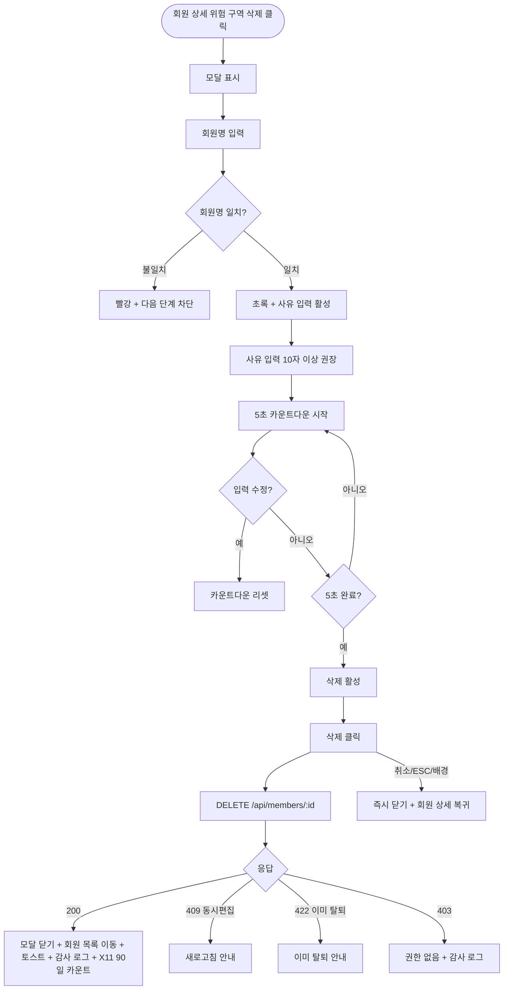

# DLG-M002 회원 삭제 확인 다이얼로그

## 1. 다이얼로그 메타 정보

| 항목 | 값 |
|---|---|
| 작성일 | 2026-05-22 |
| 버전 | v1.0 |
| 상태 | 정합화 완료 |
| 도메인 | D02 회원관리 |
| 다이얼로그 ID | DLG-M002 |
| 다이얼로그명 | 회원 삭제 확인 |
| 다이얼로그 유형 | 위험 작업 2차 확인형 모달 |
| 호출 화면 | SCR-M004 회원 상세 (위험 구역) |
| 우선순위 | P0 |
| 기능코드 | MBR-02 |
| 계약코드 | MBR-02 |

## 2. 다이얼로그 목적

회원 삭제 확인 다이얼로그는 회원 데이터를 삭제(논리적 삭제, soft delete)하기 전에 되돌릴 수 없는 작업임을 명확히 고지하고 최종 의사를 확인하는 모달입니다. 회원 삭제는 회원 목록에서 보이지 않게 처리되며 90일 후 PII가 자동 마스킹되고 1년 후 hard delete 대상이 되므로, 클릭 한 번으로 무심코 처리되지 않도록 회원명 직접 입력 + 사유 입력 + 5초 카운트다운의 다단계 안전장치가 적용됩니다.

이 다이얼로그는 단순 확인형 모달과는 다릅니다. 일반 확인형 모달은 [확인] 버튼이 즉시 활성 상태로 표시되지만, 이 모달은 회원명 정확 입력 + 사유 입력이 완료된 후에도 5초 카운트다운이 끝나야 [삭제] 버튼이 활성화됩니다. 이 카운트다운은 운영자가 실수로 누른 경우 마음을 바꿀 시간을 주기 위한 정책입니다.

## 3. 부모 화면 호출 맥락

회원 상세(SCR-M004) 페이지 하단의 위험 구역(Danger Zone)에서 호출됩니다. 위험 구역은 권한자(Owner(지점장)·슈퍼관리자)에게만 노출되며 빨강 테두리와 경고 아이콘으로 시각적으로 분리됩니다.

위험 구역의 "회원 삭제" 버튼을 누르면 이 모달이 호출됩니다. 모달 진입 시 부모 화면은 dim 오버레이로 가려지고, 모달 확인 성공 후에는 회원 목록(SCR-M001)으로 자동 이동하면서 "회원이 삭제되었습니다" 토스트가 표시됩니다.

회원 목록에서는 별도의 일괄 삭제 흐름은 없습니다. 일괄 탈퇴(DLG-M005)는 있지만 일괄 삭제는 운영 사고의 위험이 크므로 단일 회원 삭제만 허용됩니다.

## 4. 모달 구성요소

모달 상단에는 "회원을 삭제하시겠습니까?"라는 제목이 표시되고 그 아래에 빨강 톤의 경고 메시지 "삭제된 데이터는 복구할 수 없습니다"가 강조 표시됩니다. 또한 "90일 후 개인정보가 자동 마스킹되며 1년 후 영구 삭제됩니다"라는 정책 안내가 작은 글씨로 추가됩니다.

대상 회원명이 카드 형태로 표시되며 이름·연락처·등록일·소속 지점·현재 상태가 한눈에 보입니다.

회원명 직접 입력란이 있어 운영자가 회원명을 정확히 타이핑해야 합니다. 한 글자라도 다르면 빨강 강조 + 다음 단계 진입 차단이며, 정확 일치 시 초록 강조로 시각적 피드백이 즉시 제공됩니다.

회원명 입력이 정확 일치한 후 사유 입력 텍스트 영역이 활성화됩니다. 사유는 필수이며 10자 이상 권장입니다. 사유 입력이 완료되면 그 아래에 5초 카운트다운 게이지가 표시되고, 카운트다운이 끝나야 [삭제] 버튼이 빨강 톤으로 활성화됩니다.

[삭제] 버튼은 카운트다운 완료 후에만 활성화되며 클릭 시 백엔드 호출이 시작됩니다. [취소] 버튼은 항상 활성 상태로 모달을 즉시 닫습니다.

## 5. 동작 흐름

회원명 입력 → 정확 일치 검증 → 사유 입력 → 5초 카운트다운 → [삭제] 활성화 → 클릭 → `DELETE /api/members/:id` 호출 → 백엔드가 soft delete 처리(`status=DELETED`) + X11 PII 마스킹 90일 카운트 시작 + SCR-097 감사 로그 INSERT.

성공 시 모달이 닫히고 회원 목록(SCR-M001)으로 자동 이동하면서 "회원이 삭제되었습니다" 토스트가 5초간 표시됩니다.

실패 시 모달은 닫히지 않고 에러 메시지가 표시됩니다. 회원이 이미 다른 운영자에 의해 처리(탈퇴/이관)된 경우 409 또는 422 응답이 반환되며 새로고침 후 재시도 안내가 표시됩니다.

[취소] 또는 ESC 또는 배경 클릭은 모달을 즉시 닫고 회원 상세 페이지로 복귀합니다. 입력 도중에도 별도 확인 없이 닫힙니다(되돌릴 수 있는 변경이 없으므로).

## 6. 권한별 처리

이 다이얼로그는 Owner(지점장)과 superAdmin·primary에게만 접근 가능합니다. 매니저·FC·트레이너·스태프·프런트·readonly는 부모 화면의 위험 구역 자체가 hidden 처리되어 모달 호출 자체가 차단됩니다.

직접 API 호출 시 백엔드가 403으로 거부하며 모든 권한 차단 이벤트는 감사 로그에 기록됩니다.

hard delete는 본사 슈퍼관리자만 별도 절차로 수행하며 이 다이얼로그는 soft delete 전용입니다.

## 7. 화면 상태

| 상태 | 설명 |
|---|---|
| 기본 표시 | 회원명 입력 대기, 모든 다음 단계 비활성 |
| 회원명 입력 중 | 글자 다름 시 빨강 강조 |
| 회원명 일치 | 초록 강조 + 사유 입력 활성 |
| 사유 입력 중 | 10자 이상 권장 안내 |
| 사유 완료 | 5초 카운트다운 시작 |
| 카운트다운 중 | 게이지 표시 + [삭제] 비활성 유지 |
| 카운트다운 완료 | [삭제] 활성 (빨강 톤) |
| 처리 중 | 로딩 + 모든 버튼 비활성 |
| 완료 | 모달 닫기 + 회원 목록 이동 + 토스트 |
| 실패 | 에러 메시지 + 모달 유지 |

## 8. 데이터 흐름과 외부 연동

[삭제] 클릭 시 `DELETE /api/members/:id`가 호출됩니다. 요청 본문에는 사유와 회원 `version`이 포함됩니다. 백엔드는 version 검증 후 `status=DELETED`로 변경하고 X11 PII 마스킹 배치(매일 새벽 5시)의 90일 카운트 대상에 등록합니다.

자동화 체인이 트리거됩니다. SCR-097 감사 로그에 actor·member_id·action=DELETE·reason·timestamp INSERT, NFR-19 알림 센터에 운영자 알림 발송, X11 PII 마스킹 90일 카운트 시작, MBR-EXT-04 세그먼트 자동 재계산 배치(D+1)가 회원 라벨을 정리합니다.

## 9. 예외 처리

회원명 입력 불일치 시 빨강 강조 + 다음 단계 진입 차단입니다. 정확 일치 시에만 사유 입력이 활성됩니다.

5초 카운트다운 도중 회원명 또는 사유를 다시 수정하면 카운트다운이 처음부터 다시 시작됩니다. 이는 운영자가 정말 신중하게 삭제하도록 강제하는 정책입니다.

권한 부족(403)은 부모 화면에서 이미 차단되어 모달이 호출되지 않지만, 직접 API 호출 시 백엔드 403으로 거부 + 감사 로그 INSERT가 발생합니다.

동시 처리 충돌(409, version 불일치)은 "다른 운영자가 동시에 회원을 변경했습니다" 모달 표시 + 새로고침 안내입니다. 회원이 이미 탈퇴된 상태면 422 + "이미 탈퇴된 회원입니다" 안내가 표시됩니다.

네트워크 끊김은 자동 재시도 1회 후 사용자 액션을 기다립니다.

## 10. 운영 정책

회원 삭제 권한 정책은 Owner(지점장)·슈퍼관리자에 한정합니다. 현장 스태프·FC·트레이너의 실수로 인한 회복 불가능 변경을 차단하기 위한 정책입니다.

회원명 직접 입력 + 5초 카운트다운 정책은 다단계 안전장치입니다. 회원명 입력은 운영자가 삭제 대상을 명확히 인식하도록 강제하고, 5초 카운트다운은 실수로 누른 경우 마음을 바꿀 시간을 줍니다.

soft delete + 90일 후 PII 마스킹 + 1년 후 hard delete 정책은 단계적 처리로 잘못된 삭제를 복구할 가능성을 일정 기간 유지하기 위한 것입니다. soft delete된 회원은 위험 구역에서 권한자가 복구할 수 있으며 90일이 경과한 후에는 마스킹된 상태로만 조회 가능합니다.

hard delete 정책은 본사 슈퍼관리자만 별도 절차로 수행하며 이 다이얼로그는 soft delete 전용입니다.

감사 로그 정책은 모든 삭제 이벤트를 actor·member·reason·timestamp로 SCR-097에 INSERT하며 사후 추적성을 보장합니다.

이상의 정책은 이 다이얼로그를 구현·운영하는 사람이 별도 문서 없이 이 한 장으로 이해할 수 있도록 풀어 적었습니다.

## 11. 흐름 다이어그램

