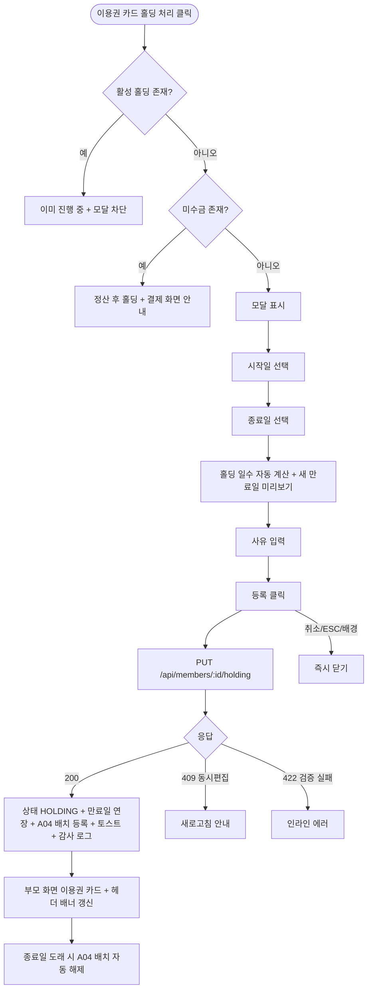

# DLG-M003 홀딩 등록 다이얼로그

## 1. 다이얼로그 메타 정보

| 항목 | 값 |
|---|---|
| 작성일 | 2026-05-22 |
| 버전 | v1.0 |
| 상태 | 정합화 완료 |
| 도메인 | D02 회원관리 |
| 다이얼로그 ID | DLG-M003 |
| 다이얼로그명 | 홀딩 등록 |
| 다이얼로그 유형 | 입력형 모달 (Input Modal) |
| 호출 화면 | SCR-M004 회원 상세 (이용권 탭, 상세내역 탭의 홀딩 서브탭) |
| 우선순위 | P0 |
| 기능코드 | MBR-02 |
| 계약코드 | MBR-02 |

## 2. 다이얼로그 목적

홀딩 등록 다이얼로그는 회원이 이용권을 일시적으로 사용하지 못하는 상황(부상·출장·장기 여행·임신 등)에서 관리자가 이용권 사용을 잠시 멈추는 홀딩을 등록하는 모달입니다. 홀딩 처리 시 이용권 만료일이 홀딩 일수만큼 자동 연장되어 회원에게 손해가 가지 않게 합니다. 홀딩 기간 중 회원의 출석·이용권 사용은 차단되지만 결제·예약은 가능합니다.

홀딩 종료일이 도래하면 A04 배치(매일 새벽 2시)가 자동으로 활성 상태로 복귀시키며 운영자가 별도로 해제 처리하지 않아도 됩니다.

## 3. 부모 화면 호출 맥락

회원 상세(SCR-M004)의 이용권 탭에 있는 활성 이용권 카드의 "홀딩 처리" 버튼 또는 상세내역 탭의 홀딩 서브탭의 "홀딩 등록" 버튼으로 호출됩니다. 현재 활성 이용권이 존재하는 회원에게만 버튼이 활성화되며, 만료·정지·탈퇴 회원에게는 비활성됩니다.

이미 활성 홀딩이 1건 이상 있는 회원에게는 "기존 홀딩이 진행 중입니다. 해제 후 새 홀딩을 등록해 주세요" 안내가 표시되고 모달 호출 자체가 차단됩니다. 이는 홀딩 중복 등록 차단 정책입니다.

미수금이 있는 회원의 홀딩 등록 시도 시 "미수금이 있어요. 정산 후 홀딩하세요" 안내 모달이 먼저 표시되고 결제 화면(SCR-S004)으로 진입할 수 있는 링크가 제공됩니다.

확인 성공 후 부모 화면의 이용권 카드 상태 배지가 "홀딩"으로 즉시 갱신되고 회원 상세 헤더의 상태 배너가 보라색 톤으로 전환됩니다.

## 4. 모달 구성요소

모달 상단에는 "홀딩 등록"이라는 제목이 표시됩니다.

홀딩 시작일 입력란은 캘린더 형태이며 기본값은 오늘입니다. 과거 날짜는 권한자(매니저+) 사유 입력 후 가능하지만 일반적으로 미래 또는 오늘로 시작합니다.

홀딩 종료일 입력란도 캘린더 형태이며 시작일 이후로 선택해야 합니다. 홀딩 최대 기간은 본사 정책에 따라 제한될 수 있습니다(일반적으로 3~6개월).

시작일과 종료일을 모두 선택하면 홀딩 일수가 자동 계산되어 표시되고, 이용권의 새 만료일(현재 만료일 + 홀딩 일수)이 미리보기로 표시됩니다. 예를 들어 현재 만료일이 2026-06-30이고 30일 홀딩을 등록하면 새 만료일은 2026-07-30이 됩니다.

홀딩 사유 입력란은 텍스트 또는 사전 정의된 사유 목록 드롭다운(부상·출장·여행·임신·기타)을 제공합니다. 사유는 필수입니다.

[등록] 버튼은 시작일·종료일·사유가 모두 입력된 경우에만 활성화됩니다. [취소] 버튼은 항상 활성 상태로 변경 없이 모달을 닫습니다.

## 5. 동작 흐름

[등록] 클릭 시 `PUT /api/members/:id/holding`이 호출됩니다. 요청 본문에는 시작일·종료일·사유·이용권 ID가 포함됩니다.

성공 시 회원 상태가 `HOLDING`으로 변경되고 이용권 만료일이 자동 연장되며, A04 배치 대상에 등록되어 종료일 도래 시 자동 해제됩니다. 모달이 닫히고 부모 화면의 이용권 카드와 헤더 상태 배너가 즉시 갱신되며 "홀딩이 등록되었어요" 토스트가 표시됩니다.

실패 시 모달은 닫히지 않고 에러 메시지가 표시됩니다. 미수금 존재 시 "미수금이 있어요. 정산 후 홀딩하세요" 안내, 동시 편집 충돌(409)은 새로고침 안내, 권한 부족(403)은 "권한이 없어요" 안내가 표시됩니다.

[취소] 또는 ESC 또는 배경 클릭은 모달을 즉시 닫습니다. 입력 도중인 경우 별도 확인 없이 닫힙니다(되돌릴 수 있는 변경 단계이므로).

## 6. 권한별 처리

매니저(manager) 이상이 홀딩 등록 가능합니다. FC·트레이너·스태프·프런트·readonly는 부모 화면의 "홀딩 처리" 버튼 자체가 비활성 또는 hidden 처리되어 모달이 호출되지 않습니다.

과거 날짜 홀딩 등록은 매니저+ 사유 입력 시 가능합니다.

## 7. 화면 상태

| 상태 | 설명 |
|---|---|
| 기본 표시 | 시작일·종료일·사유 입력 대기 |
| 시작일 선택 | 종료일 입력 활성 |
| 종료일 선택 | 홀딩 일수 자동 계산 + 새 만료일 미리보기 |
| 사유 입력 | [등록] 활성 |
| 처리 중 | 버튼 비활성 + 로딩 |
| 완료 | 모달 닫기 + 부모 갱신 + 토스트 |
| 실패 | 에러 메시지 + 입력값 유지 |

## 8. 데이터 흐름과 외부 연동

`PUT /api/members/:id/holding`을 호출하면 백엔드는 회원 row optimistic lock 검증, 활성 홀딩 중복 검증, 미수금 검증을 수행한 후 트랜잭션 안에서 홀딩 INSERT + 이용권 만료일 UPDATE + 회원 상태 UPDATE를 처리합니다.

A04 배치(매일 새벽 2시)가 홀딩 종료일 도래 회원을 자동으로 활성 상태 복귀시키며 별도 운영자 액션이 필요 없습니다.

SCR-097 감사 로그에 actor·member·action=HOLDING_REGISTER·start·end·days·reason·timestamp INSERT됩니다.

NFR-19 알림 센터를 통해 회원에게 카카오 알림톡 "홀딩이 등록되었어요" 발송이 트리거됩니다.

## 9. 예외 처리

기존 활성 홀딩 존재 시 부모 화면에서 모달 호출 자체가 차단됩니다.

미수금 존재 시 "미수금이 있어요. 정산 후 홀딩하세요" 안내 모달 + 결제 화면 진입 링크입니다.

시작일/종료일 잘못(종료일이 시작일보다 이전)은 인라인 빨강 + 저장 차단입니다.

홀딩 최대 기간 초과 시 "홀딩 최대 기간은 N일입니다" 안내 + 저장 차단입니다.

권한 부족·동시 편집 충돌·네트워크 끊김은 일반 정책과 동일합니다.

## 10. 운영 정책

홀딩 자동 연장 정책은 만료일이 홀딩 일수만큼 자동 연장되는 것입니다. 회원에게 손해가 가지 않게 하는 운영 원칙입니다.

홀딩 중복 등록 차단 정책은 활성 홀딩이 1건 이상이면 새 홀딩 등록 불가입니다. 동시에 여러 홀딩이 활성이면 만료일 계산이 혼란스러워지므로 단일 홀딩만 유지합니다.

홀딩 기간 중 차단·허용 정책은 출석·이용권 사용 차단, 결제·예약 허용입니다.

A04 자동 해제 배치 정책은 매일 새벽 2시에 종료일 도래 회원을 자동 활성 복귀시키며 운영자 별도 액션이 불필요합니다.

미수금 존재 시 홀딩 차단 정책은 미수금이 회원 채무로 누적되는 동안 홀딩이 활성이면 회수가 어려워지므로 정산 후 홀딩이 원칙입니다.

홀딩 권한 정책은 매니저 이상으로 제한되어 일선 직원의 임의 처리를 막습니다.

감사 로그 정책은 모든 홀딩 등록을 SCR-097에 기록합니다.

## 11. 흐름 다이어그램

