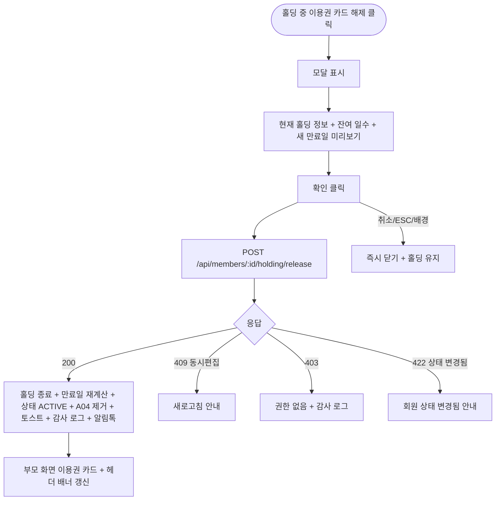

# DLG-M004 홀딩 해제 다이얼로그

## 1. 다이얼로그 메타 정보

| 항목 | 값 |
|---|---|
| 작성일 | 2026-05-22 |
| 버전 | v1.0 |
| 상태 | 정합화 완료 |
| 도메인 | D02 회원관리 |
| 다이얼로그 ID | DLG-M004 |
| 다이얼로그명 | 홀딩 해제 |
| 다이얼로그 유형 | 확인형 모달 |
| 호출 화면 | SCR-M004 회원 상세 (이용권 탭, 상세내역 탭의 홀딩 서브탭) |
| 우선순위 | P0 |
| 기능코드 | MBR-02 |
| 계약코드 | MBR-02 |

## 2. 다이얼로그 목적

홀딩 해제 다이얼로그는 현재 홀딩 중인 이용권을 운영자가 명시적으로 재개할 때 의사를 최종 확인하는 모달입니다. 회원이 홀딩 기간을 다 채우지 않고 조기 복귀를 원하거나 운영자가 잘못된 홀딩을 정정해야 할 때 사용합니다.

해제 시 잔여 홀딩 기간이 이용권 만료일에서 차감될 수 있음을 사전에 안내합니다. 예를 들어 30일 홀딩을 등록했는데 10일만에 해제하면 남은 20일이 만료일에서 차감되어 회원이 원래 받아야 할 연장보다 짧아진다는 의미입니다.

A04 배치(매일 새벽 2시)가 종료일 도래 회원을 자동 해제하기 때문에 정상 종료된 홀딩은 이 모달이 필요 없습니다. 이 모달은 종료일 이전 조기 해제 흐름 전용입니다.

## 3. 부모 화면 호출 맥락

회원 상세(SCR-M004)의 이용권 탭에서 홀딩 상태인 이용권 카드의 "홀딩 해제" 버튼 또는 상세내역 탭의 홀딩 서브탭의 활성 홀딩 행에서 "해제" 버튼으로 호출됩니다.

이용권 상태가 `HOLDING`인 경우에만 이 버튼이 활성화되며, 활성 이용권에는 비활성됩니다.

확인 성공 후 부모 화면의 이용권 카드 상태가 "활성"으로 즉시 갱신되고 헤더 상태 배너가 보라색에서 일반(녹색)으로 전환됩니다.

## 4. 모달 구성요소

모달 상단에는 "홀딩을 해제하시겠습니까?"라는 제목이 표시됩니다.

본문 안내 메시지에는 현재 홀딩 기간(시작일 → 종료일·총 일수), 해제 후 잔여 홀딩 일수, 해제 후 이용권의 새 만료일 미리보기가 표시됩니다. 예를 들어 "30일 홀딩 중 10일 경과. 해제 시 잔여 20일이 만료일에서 차감되어 새 만료일은 2026-07-10이 됩니다"처럼 명시됩니다.

선택적으로 해제 사유 입력란이 제공될 수 있습니다(테넌트 정책에 따라).

[확인] 버튼은 즉시 활성 상태이며 클릭 시 해제 처리가 진행됩니다. [취소] 버튼은 모달을 닫고 홀딩을 유지합니다.

## 5. 동작 흐름

[확인] 클릭 시 `POST /api/members/:id/holding/release`가 호출됩니다. 백엔드는 트랜잭션 안에서 홀딩 종료 UPDATE + 이용권 만료일 재계산 + 회원 상태 UPDATE + A04 배치 대상 제거를 처리합니다.

성공 시 모달이 닫히고 부모 화면이 즉시 갱신되며 "홀딩이 해제되었어요. 새 만료일은 △△입니다" 토스트가 표시됩니다.

실패 시 모달은 닫히지 않고 에러 메시지가 표시됩니다. 동시 편집 충돌(409)은 새로고침 안내, 권한 부족(403)은 "권한이 없어요" 안내입니다.

[취소] 또는 ESC 또는 배경 클릭은 모달을 즉시 닫습니다. 해제하지 않고 홀딩 그대로 유지됩니다.

## 6. 권한별 처리

매니저(manager) 이상이 홀딩 해제 가능합니다. FC·트레이너·스태프·프런트·readonly는 부모 화면의 "홀딩 해제" 버튼 자체가 비활성 또는 hidden 처리됩니다.

## 7. 화면 상태

| 상태 | 설명 |
|---|---|
| 기본 표시 | 현재 홀딩 정보 + 해제 후 만료일 미리보기 표시 |
| 처리 중 | 버튼 비활성 + 로딩 |
| 완료 | 모달 닫기 + 부모 갱신 + 토스트 |
| 실패 | 에러 메시지 + 모달 유지 |

## 8. 데이터 흐름과 외부 연동

`POST /api/members/:id/holding/release` 호출 → 백엔드 트랜잭션 처리(홀딩 종료 + 만료일 재계산 + 상태 UPDATE + A04 제거) → SCR-097 감사 로그 INSERT → NFR-19 알림 센터 회원 알림톡 발송 트리거.

A04 배치는 자동 해제 대상에서 이 회원을 제거합니다(중복 처리 방지).

## 9. 예외 처리

권한 부족·동시 편집 충돌·네트워크 끊김은 일반 정책과 동일합니다.

회원이 이미 다른 이유로 상태 변경된 경우(탈퇴·삭제·이관) 422 + 모달 안내 후 부모 화면 새로고침 권장됩니다.

## 10. 운영 정책

조기 해제 시 잔여 홀딩 차감 정책은 회원이 받아야 할 연장 보장과 운영 형평성을 동시에 달성하기 위한 정책입니다. 회원이 사용하지 않은 홀딩 기간을 만료일에 더해 주지 않습니다.

홀딩 해제 권한 정책은 매니저 이상으로 제한됩니다.

A04 배치와의 중복 방지 정책은 운영자가 명시적으로 해제한 회원은 A04 배치 대상에서 제거되어 중복 상태 변경이 발생하지 않도록 하는 것입니다.

감사 로그 정책은 모든 해제 이벤트를 SCR-097에 기록합니다.

## 11. 흐름 다이어그램

